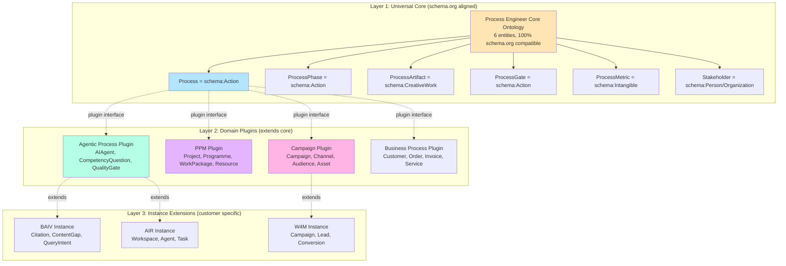
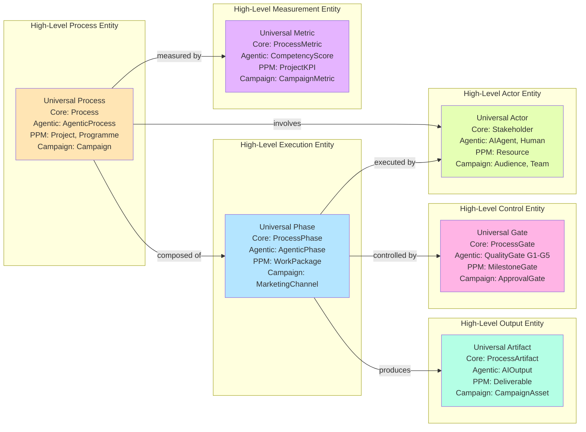
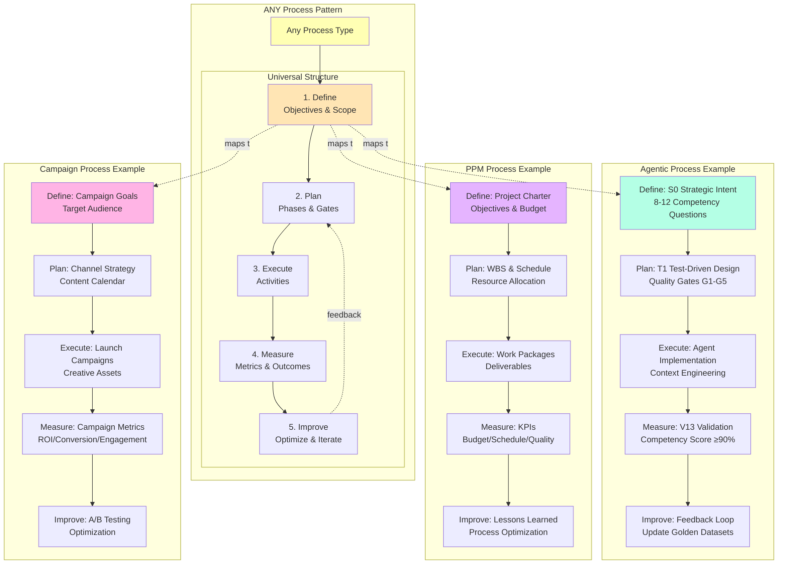
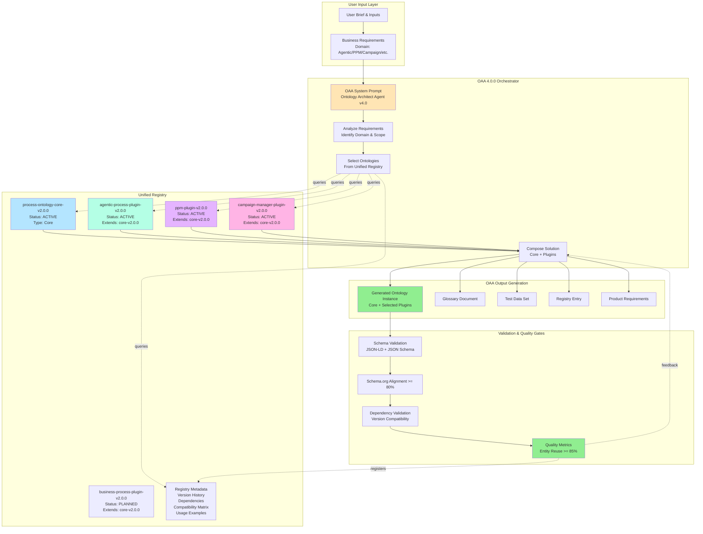

# Process Ontology Modular Architecture v2.0
## Alignment Strategy for Agentic AI, PPM, Campaign Manager & Business Processes

**Version:** 2.0.0  
**Date:** 2026-01-19  
**Purpose:** Simplify process ontology using schema.org base + plugin sub-ontologies

---

## Problem Statement

Current `process-ontology-v1.json` is complex for:
1. **Agentic AI orchestration** - needs competency questions, quality gates, context engineering
2. **General business processes** - needs simplicity and schema.org alignment
3. **PPM (Project/Programme Management)** - needs resource allocation, Gantt schedules, governance
4. **Campaign Manager** - needs audience targeting, channel optimization, creative assets

**Solution:** Core + Plugins architecture aligned to schema.org business process definitions

---

## Process Engineer Architecture Diagrams

### Diagram 1: 3-Layer Modular Architecture



### Diagram 2: Entity Hierarchy - Schema.org Foundation

```mermaid
graph TB
    subgraph "Schema.org Base Types"
        SCHEMA_THING[schema:Thing<br/>Universal Base]
        SCHEMA_ACTION[schema:Action<br/>Process Actions]
        SCHEMA_CREATIVE[schema:CreativeWork<br/>Process Outputs]
        SCHEMA_INTANGIBLE[schema:Intangible<br/>Abstract Concepts]
        SCHEMA_PERSON[schema:Person/Organization<br/>Stakeholders]
        
        SCHEMA_THING --> SCHEMA_ACTION
        SCHEMA_THING --> SCHEMA_CREATIVE
        SCHEMA_THING --> SCHEMA_INTANGIBLE
        SCHEMA_THING --> SCHEMA_PERSON
    end
    
    subgraph "Core Process Entities"
        PROCESS[Process]
        PHASE[ProcessPhase]
        GATE[ProcessGate]
        ARTIFACT[ProcessArtifact]
        METRIC[ProcessMetric]
        STAKEHOLDER[Stakeholder]
        
        SCHEMA_ACTION -.extends.-> PROCESS
        SCHEMA_ACTION -.extends.-> PHASE
        SCHEMA_ACTION -.extends.-> GATE
        SCHEMA_CREATIVE -.extends.-> ARTIFACT
        SCHEMA_INTANGIBLE -.extends.-> METRIC
        SCHEMA_PERSON -.extends.-> STAKEHOLDER
    end
    
    subgraph "Plugin: Agentic Process"
        AGENTIC_PROCESS[AgenticProcess]
        AGENTIC_PHASE[AgenticPhase]
        QUALITY_GATE[QualityGate]
        AI_AGENT[AIAgent]
        COMPETENCY_Q[CompetencyQuestion]
        
        PROCESS -.extends.-> AGENTIC_PROCESS
        PHASE -.extends.-> AGENTIC_PHASE
        GATE -.extends.-> QUALITY_GATE
        SCHEMA_ACTION -.extends.-> AI_AGENT
        SCHEMA_INTANGIBLE -.extends.-> COMPETENCY_Q
    end
    
    subgraph "Plugin: PPM"
        PROJECT[Project]
        PROGRAMME[Programme]
        WORK_PACKAGE[WorkPackage]
        RESOURCE[Resource]
        
        PROCESS -.extends.-> PROJECT
        PROCESS -.extends.-> PROGRAMME
        PHASE -.extends.-> WORK_PACKAGE
        STAKEHOLDER -.extends.-> RESOURCE
    end
    
    subgraph "Plugin: Campaign Manager"
        CAMPAIGN[Campaign]
        CHANNEL[MarketingChannel]
        CAMPAIGN_ASSET[CampaignAsset]
        AUDIENCE[Audience]
        
        PROCESS -.extends.-> CAMPAIGN
        PHASE -.extends.-> CHANNEL
        ARTIFACT -.extends.-> CAMPAIGN_ASSET
        SCHEMA_PERSON -.extends.-> AUDIENCE
    end
    
    style SCHEMA_THING fill:#FFFFB4
    style PROCESS fill:#B4E5FF
    style AGENTIC_PROCESS fill:#B4FFE5
    style PROJECT fill:#E5B4FF
    style CAMPAIGN fill:#FFB4E5
```



### Diagram 3: Rolled-Up Entity Aggregation View



### Diagram 4: Cross-Domain Process Patterns



### Diagram 5: OAA Orchestration & Unified Registry Architecture



### Example User Flows:

**Flow 1: Agentic AI Process**
```
User Brief: "Create ontology for multi-agent orchestration with Claude AI"
  → OAA analyzes: Domain = Agentic AI
  → OAA selects: core-v2.0.0 + agentic-process-plugin-v2.0.0
  → OAA composes: AgenticProcess ontology with CompetencyQuestions, QualityGates
  → Output: BAIV-specific instance ready for Agent Template 6.1
```

**Flow 2: PPM System**
```
User Brief: "Build ontology for enterprise project management"
  → OAA analyzes: Domain = PPM
  → OAA selects: core-v2.0.0 + ppm-plugin-v2.0.0
  → OAA composes: Project/Programme ontology with WorkPackages, Resources
  → Output: PMO-ready ontology with Gantt, budgeting, governance
```

**Flow 3: Hybrid System**
```
User Brief: "Marketing campaign managed by AI agents"
  → OAA analyzes: Domain = Campaign + Agentic
  → OAA selects: core-v2.0.0 + campaign-manager-plugin-v2.0.0 + agentic-process-plugin-v2.0.0
  → OAA composes: Hybrid ontology with Campaigns, Channels, AIAgents
  → Output: W4M instance with AI-augmented campaign management
```

---

## Verification: Multi-Tenant PF-Core → PF-Instance → Product/Service Architecture

### Architecture Overview: PF-Core Branching Model

```mermaid
graph TB
    subgraph "PF-Core (Foundation)"
        PF_CORE[PF-Core Ontologies<br/>Universal Foundation]
        CORE_PROCESS[process-ontology-core-v2.0.0]
        CORE_AGENTIC[agentic-process-plugin-v2.0.0]
        CORE_OAA[OAA Architect v4.0.0]
        CORE_AGENT_TEMPLATE[Agent Template v6.1]
        
        PF_CORE --> CORE_PROCESS
        PF_CORE --> CORE_AGENTIC
        PF_CORE --> CORE_OAA
        PF_CORE --> CORE_AGENT_TEMPLATE
    end
    
    subgraph "PF-Instance Setup & Operations"
        PFI_BAIV[PF-Core-PFI-BAIV<br/>Instance Setup]
        PFI_W4M[PF-Core-PFI-W4M<br/>Instance Setup]
        PFI_AIR[PF-Core-PFI-AIR<br/>Instance Setup]
        
        SETUP_AGENTS[Setup Agents<br/>- TenantProvisioner<br/>- OntologyDeployer<br/>- RegistryInitializer]
        OPS_AGENTS[Operations Agents<br/>- MonitoringAgent<br/>- ComplianceAgent<br/>- OptimizationAgent]
    end
    
    subgraph "Product/Service Processes - BAIV"
        BAIV_PRODUCT[AI Visibility Products]
        
        BAIV_AIR_AUDIT[AIR Readiness Audit<br/>Process Definition]
        BAIV_AZURE_AIR[Azure AIR Assessment<br/>Process Definition]
        BAIV_GDPR[GDPR Assessment<br/>Process Definition]
        BAIV_LANDING[Azure Landing Zone Assessment<br/>Process Definition]
        
        BAIV_PRODUCT --> BAIV_AIR_AUDIT
        BAIV_PRODUCT --> BAIV_AZURE_AIR
        BAIV_PRODUCT --> BAIV_GDPR
        BAIV_PRODUCT --> BAIV_LANDING
    end
    
    subgraph "Product/Service Processes - W4M"
        W4M_PRODUCT[Wings4Mind Products]
        
        W4M_SOP_GP[SOP-GP-Guardian<br/>Process Definition]
        W4M_CAMPAIGN[Campaign Manager<br/>Process Definition]
        W4M_LEAD_GEN[Lead Generation<br/>Process Definition]
        
        W4M_PRODUCT --> W4M_SOP_GP
        W4M_PRODUCT --> W4M_CAMPAIGN
        W4M_PRODUCT --> W4M_LEAD_GEN
    end
    
    subgraph "Product/Service Processes - AIR"
        AIR_PRODUCT[AIR Workspace Products]
        
        AIR_WORKSPACE[Workspace Setup<br/>Process Definition]
        AIR_AGENT_DEPLOY[Agent Deployment<br/>Process Definition]
        AIR_TASK_FLOW[Task Flow Automation<br/>Process Definition]
        
        AIR_PRODUCT --> AIR_WORKSPACE
        AIR_PRODUCT --> AIR_AGENT_DEPLOY
        AIR_PRODUCT --> AIR_TASK_FLOW
    end
    
    subgraph "Agentic Solution Layer"
        AGENTIC_SOLUTION[Agentic Solution Generator]
        
        AGENT_GEN[Agent Generator<br/>Uses: Agent Template v6.1]
        PROCESS_GEN[Process Generator<br/>Uses: OAA v4.0.0]
        ORCHESTRATOR[Multi-Agent Orchestrator<br/>Uses: Agentic Patterns]
    end
    
    subgraph "Client-Specific Layer"
        CLIENT_PROCESS[Client Process Definitions]
        CLIENT_CUSTOM[Client Customizations<br/>Industry-Specific Extensions]
    end
    
    PF_CORE ==>|branches to| PFI_BAIV
    PF_CORE ==>|branches to| PFI_W4M
    PF_CORE ==>|branches to| PFI_AIR
    
    PFI_BAIV --> SETUP_AGENTS
    PFI_BAIV --> OPS_AGENTS
    PFI_BAIV ==>|delivers| BAIV_PRODUCT
    
    PFI_W4M --> SETUP_AGENTS
    PFI_W4M --> OPS_AGENTS
    PFI_W4M ==>|delivers| W4M_PRODUCT
    
    PFI_AIR --> SETUP_AGENTS
    PFI_AIR --> OPS_AGENTS
    PFI_AIR ==>|delivers| AIR_PRODUCT
    
    BAIV_AIR_AUDIT --> AGENTIC_SOLUTION
    BAIV_AZURE_AIR --> AGENTIC_SOLUTION
    BAIV_GDPR --> AGENTIC_SOLUTION
    BAIV_LANDING --> AGENTIC_SOLUTION
    
    W4M_SOP_GP --> AGENTIC_SOLUTION
    W4M_CAMPAIGN --> AGENTIC_SOLUTION
    W4M_LEAD_GEN --> AGENTIC_SOLUTION
    
    AIR_WORKSPACE --> AGENTIC_SOLUTION
    AIR_AGENT_DEPLOY --> AGENTIC_SOLUTION
    AIR_TASK_FLOW --> AGENTIC_SOLUTION
    
    AGENTIC_SOLUTION --> AGENT_GEN
    AGENTIC_SOLUTION --> PROCESS_GEN
    AGENTIC_SOLUTION --> ORCHESTRATOR
    
    CORE_AGENT_TEMPLATE -.templates.-> AGENT_GEN
    CORE_OAA -.orchestrates.-> PROCESS_GEN
    CORE_AGENTIC -.patterns.-> ORCHESTRATOR
    
    BAIV_PRODUCT -.client processes.-> CLIENT_PROCESS
    W4M_PRODUCT -.client processes.-> CLIENT_PROCESS
    AIR_PRODUCT -.client processes.-> CLIENT_PROCESS
    
    CLIENT_PROCESS --> CLIENT_CUSTOM
    
    style PF_CORE fill:#FFE5B4
    style PFI_BAIV fill:#B4E5FF
    style PFI_W4M fill:#FFB4E5
    style PFI_AIR fill:#E5FFB4
    style BAIV_PRODUCT fill:#B4FFE5
    style W4M_PRODUCT fill:#FFB4E5
    style AIR_PRODUCT fill:#E5FFB4
    style AGENTIC_SOLUTION fill:#90EE90
```



---

### Verification Table: Process Accommodation at Each Layer

| Layer | Process Type | Ontology Used | Agent Template | OAA Usage | Example |
|-------|-------------|---------------|----------------|-----------|----------|
| **PF-Core** | Foundation Processes | core-v2.0.0 | v6.1 (definition) | v4.0.0 (creation) | Define universal process patterns |
| **PF-Instance Setup** | Instance Provisioning | core-v2.0.0 + agentic-v2.0.0 | v6.1 (TenantProvisioner) | v4.0.0 (generates setup ontology) | PF-Core-PFI-BAIV tenant setup |
| **PF-Instance Operations** | Ongoing Operations | core-v2.0.0 + agentic-v2.0.0 | v6.1 (MonitoringAgent) | N/A | Monitor BAIV instance health |
| **Product Process - BAIV** | Assessment Delivery | core-v2.0.0 + business-v2.0.0 | v6.1 (AssessmentAgent) | v4.0.0 (generates assessment ontology) | AIR Readiness Audit workflow |
| **Product Process - W4M** | Campaign Delivery | core-v2.0.0 + campaign-v2.0.0 | v6.1 (CampaignAgent) | v4.0.0 (generates campaign ontology) | SOP-GP-Guardian campaign |
| **Product Process - AIR** | Workspace Delivery | core-v2.0.0 + agentic-v2.0.0 | v6.1 (WorkspaceAgent) | v4.0.0 (generates workspace ontology) | AIR workspace setup |
| **Client-Specific** | Custom Workflows | core-v2.0.0 + client-extension-v1.0.0 | v6.1 (ClientAgent) | v4.0.0 (generates client ontology) | GDPR-specific audit for EU client |

---

### Detailed Process Accommodation Examples

#### Example 1: AIR Readiness Audit (BAIV Product)

**Process Definition Flow:**
```
1. Product Manager defines AIR Readiness Audit requirements
   Input: "Multi-stage audit assessing AI governance, risk, compliance"

2. OAA v4.0.0 analyzes requirements
   → Domain: Business Assessment + Agentic AI
   → Selects: core-v2.0.0 + business-process-v2.0.0 + agentic-process-v2.0.0

3. OAA generates AIR Audit Process Ontology:
   Entities:
   - AIRAssessment (extends Process)
   - AuditPhase (extends ProcessPhase)
     • Phase 1: Governance Review
     • Phase 2: Risk Assessment  
     • Phase 3: Compliance Check
     • Phase 4: Recommendations
   - AuditFinding (extends ProcessArtifact)
   - ComplianceGate (extends ProcessGate)
   - RiskScore (extends ProcessMetric)

4. Agent Generator creates agents using Template v6.1:
   - GovernanceReviewAgent (S0: Mission = Assess AI governance maturity)
   - RiskAssessmentAgent (S0: Mission = Identify and score AI risks)
   - ComplianceCheckAgent (S0: Mission = Validate regulatory compliance)
   - RecommendationAgent (S0: Mission = Generate remediation roadmap)

5. Multi-Agent Orchestrator configures workflow:
   - Uses Agentic Patterns: Sequential + Parallel execution
   - Quality Gates: G1 (data collection), G2 (analysis), G3 (validation), G4 (approval)

6. Registry Entry created:
   - air-readiness-audit-process-v1.0.0
   - Extends: core-v2.0.0, business-process-v2.0.0
   - Used by: BAIV instance
   - Consumed by: AIRAssessmentAgent cluster
```

**Client Customization:**
```
Client: EU Financial Services Company
Customization: GDPR + DORA compliance requirements

→ OAA generates client extension:
  - GDPR-AIR-Assessment-v1.0.0
  - Adds: GDPRCompliancePhase, DORACompliancePhase
  - Extends: air-readiness-audit-process-v1.0.0
  - New Gates: GDPR-Gate, DORA-Gate
  - New Metrics: GDPRComplianceScore, DORAReadinessScore
```

---

#### Example 2: SOP-GP-Guardian (W4M Product)

**Process Definition Flow:**
```
1. Product Manager defines SOP-GP-Guardian requirements
   Input: "Standard Operating Procedure for General Practice guardian/monitoring"

2. OAA v4.0.0 analyzes requirements
   → Domain: Campaign Management + Quality Assurance + Agentic AI
   → Selects: core-v2.0.0 + campaign-manager-v2.0.0 + agentic-process-v2.0.0

3. OAA generates SOP-GP-Guardian Process Ontology:
   Entities:
   - SOPGuardianCampaign (extends Campaign)
   - MonitoringPhase (extends ProcessPhase)
     • Phase 1: Practice Onboarding
     • Phase 2: Baseline Assessment
     • Phase 3: Continuous Monitoring
     • Phase 4: Alert & Escalation
     • Phase 5: Reporting
   - ComplianceReport (extends CampaignAsset)
   - QualityGate (extends ProcessGate)
   - ComplianceMetric (extends CampaignMetric)

4. Agent Generator creates agents using Template v6.1:
   - OnboardingAgent (S0: Mission = Setup GP practice monitoring)
   - BaselineAgent (S0: Mission = Establish quality baselines)
   - MonitoringAgent (S0: Mission = Continuous compliance tracking)
   - AlertAgent (S0: Mission = Detect and escalate issues)
   - ReportingAgent (S0: Mission = Generate compliance dashboards)

5. Multi-Agent Orchestrator configures workflow:
   - Uses Agentic Patterns: Event-driven + Scheduled execution
   - Quality Gates: G1 (onboarding complete), G2 (baseline validated), G3 (monitoring active)

6. Registry Entry created:
   - sop-gp-guardian-process-v1.0.0
   - Extends: core-v2.0.0, campaign-manager-v2.0.0
   - Used by: W4M instance
   - Consumed by: SOPGuardianAgent cluster
```

**Client Customization:**
```
Client: NHS Trust - Greater Manchester
Customization: NHS-specific quality frameworks (CQC)

→ OAA generates client extension:
  - NHS-SOP-GP-Guardian-v1.0.0
  - Adds: CQCCompliancePhase, NHSReportingPhase
  - Extends: sop-gp-guardian-process-v1.0.0
  - New Gates: CQC-Gate
  - New Metrics: CQCRating, PatientSafetyScore
```

---

#### Example 3: Azure Landing Zone Assessment (BAIV Product)

**Process Definition Flow:**
```
1. Product Manager defines Azure Landing Zone Assessment requirements
   Input: "Technical assessment of Azure infrastructure readiness"

2. OAA v4.0.0 analyzes requirements
   → Domain: Technical Assessment + PPM (for project planning) + Agentic AI
   → Selects: core-v2.0.0 + ppm-v2.0.0 + agentic-process-v2.0.0

3. OAA generates Azure LZ Assessment Process Ontology:
   Entities:
   - AzureLZAssessment (extends Project)
   - AssessmentWorkPackage (extends WorkPackage)
     • WP1: Identity & Access Management
     • WP2: Network Architecture
     • WP3: Security & Compliance
     • WP4: Management & Monitoring
     • WP5: Governance & Policy
   - TechnicalFinding (extends ProcessArtifact)
   - TechnicalGate (extends ProcessGate)
   - ReadinessScore (extends ProcessMetric)

4. Agent Generator creates agents using Template v6.1:
   - IAMAssessmentAgent (S0: Mission = Evaluate identity architecture)
   - NetworkAssessmentAgent (S0: Mission = Validate network design)
   - SecurityAssessmentAgent (S0: Mission = Assess security posture)
   - MonitoringAssessmentAgent (S0: Mission = Review monitoring setup)
   - GovernanceAssessmentAgent (S0: Mission = Evaluate governance model)

5. Multi-Agent Orchestrator configures workflow:
   - Uses Agentic Patterns: Parallel execution (independent work packages)
   - Quality Gates: G1 (scope defined), G2 (assessment complete), G3 (findings validated)

6. Registry Entry created:
   - azure-lz-assessment-process-v1.0.0
   - Extends: core-v2.0.0, ppm-v2.0.0
   - Used by: BAIV instance
   - Consumed by: AzureLZAgent cluster
```

---

### Unified Registry Structure for Multi-Tenant Architecture

```json
{
  "unifiedRegistry": {
    "version": "4.0.0",
    "namespace": "https://pf-core.io/registry/",
    
    "coreOntologies": [
      {
        "id": "process-ontology-core-v2.0.0",
        "type": "CORE",
        "scope": "UNIVERSAL",
        "status": "ACTIVE",
        "dependencies": ["schema.org"],
        "usedBy": ["ALL_INSTANCES", "ALL_PRODUCTS"]
      },
      {
        "id": "agentic-process-plugin-v2.0.0",
        "type": "PLUGIN",
        "scope": "UNIVERSAL",
        "status": "ACTIVE",
        "extends": "process-ontology-core-v2.0.0",
        "usedBy": ["ALL_INSTANCES", "AGENTIC_PRODUCTS"]
      }
    ],
    
    "instanceOntologies": [
      {
        "id": "pf-instance-baiv-setup-v1.0.0",
        "type": "INSTANCE_SETUP",
        "scope": "PF-CORE-PFI-BAIV",
        "status": "ACTIVE",
        "extends": ["process-ontology-core-v2.0.0", "agentic-process-plugin-v2.0.0"],
        "provides": ["TenantProvisioner", "OntologyDeployer", "RegistryInitializer"]
      },
      {
        "id": "pf-instance-w4m-setup-v1.0.0",
        "type": "INSTANCE_SETUP",
        "scope": "PF-CORE-PFI-W4M",
        "status": "ACTIVE",
        "extends": ["process-ontology-core-v2.0.0", "agentic-process-plugin-v2.0.0"],
        "provides": ["TenantProvisioner", "OntologyDeployer", "RegistryInitializer"]
      }
    ],
    
    "productProcessOntologies": [
      {
        "id": "air-readiness-audit-process-v1.0.0",
        "type": "PRODUCT_PROCESS",
        "scope": "BAIV",
        "product": "AI Visibility - AIR Readiness Audit",
        "status": "ACTIVE",
        "extends": ["process-ontology-core-v2.0.0", "business-process-v2.0.0", "agentic-process-plugin-v2.0.0"],
        "agents": ["GovernanceReviewAgent-v1.0", "RiskAssessmentAgent-v1.0", "ComplianceCheckAgent-v1.0"],
        "agentTemplate": "v6.1",
        "createdBy": "OAA-v4.0.0"
      },
      {
        "id": "azure-air-assessment-process-v1.0.0",
        "type": "PRODUCT_PROCESS",
        "scope": "BAIV",
        "product": "AI Visibility - Azure AIR Assessment",
        "status": "ACTIVE",
        "extends": ["process-ontology-core-v2.0.0", "business-process-v2.0.0", "agentic-process-plugin-v2.0.0"],
        "agents": ["AzureAIAssessmentAgent-v1.0"],
        "agentTemplate": "v6.1",
        "createdBy": "OAA-v4.0.0"
      },
      {
        "id": "gdpr-assessment-process-v1.0.0",
        "type": "PRODUCT_PROCESS",
        "scope": "BAIV",
        "product": "AI Visibility - GDPR Assessment",
        "status": "ACTIVE",
        "extends": ["process-ontology-core-v2.0.0", "business-process-v2.0.0", "agentic-process-plugin-v2.0.0"],
        "agents": ["GDPRAssessmentAgent-v1.0"],
        "agentTemplate": "v6.1",
        "createdBy": "OAA-v4.0.0"
      },
      {
        "id": "azure-lz-assessment-process-v1.0.0",
        "type": "PRODUCT_PROCESS",
        "scope": "BAIV",
        "product": "AI Visibility - Azure Landing Zone Assessment",
        "status": "ACTIVE",
        "extends": ["process-ontology-core-v2.0.0", "ppm-v2.0.0", "agentic-process-plugin-v2.0.0"],
        "agents": ["IAMAssessmentAgent-v1.0", "NetworkAssessmentAgent-v1.0", "SecurityAssessmentAgent-v1.0"],
        "agentTemplate": "v6.1",
        "createdBy": "OAA-v4.0.0"
      },
      {
        "id": "sop-gp-guardian-process-v1.0.0",
        "type": "PRODUCT_PROCESS",
        "scope": "W4M",
        "product": "Wings4Mind - SOP-GP-Guardian",
        "status": "ACTIVE",
        "extends": ["process-ontology-core-v2.0.0", "campaign-manager-v2.0.0", "agentic-process-plugin-v2.0.0"],
        "agents": ["OnboardingAgent-v1.0", "MonitoringAgent-v1.0", "AlertAgent-v1.0", "ReportingAgent-v1.0"],
        "agentTemplate": "v6.1",
        "createdBy": "OAA-v4.0.0"
      }
    ],
    
    "clientExtensions": [
      {
        "id": "gdpr-air-assessment-eu-financial-v1.0.0",
        "type": "CLIENT_EXTENSION",
        "scope": "CLIENT",
        "client": "EU Financial Services Company",
        "status": "ACTIVE",
        "extends": ["air-readiness-audit-process-v1.0.0"],
        "addedPhases": ["GDPRCompliancePhase", "DORACompliancePhase"],
        "addedGates": ["GDPR-Gate", "DORA-Gate"],
        "agentTemplate": "v6.1",
        "createdBy": "OAA-v4.0.0"
      },
      {
        "id": "nhs-sop-gp-guardian-gm-v1.0.0",
        "type": "CLIENT_EXTENSION",
        "scope": "CLIENT",
        "client": "NHS Trust - Greater Manchester",
        "status": "ACTIVE",
        "extends": ["sop-gp-guardian-process-v1.0.0"],
        "addedPhases": ["CQCCompliancePhase", "NHSReportingPhase"],
        "addedGates": ["CQC-Gate"],
        "agentTemplate": "v6.1",
        "createdBy": "OAA-v4.0.0"
      }
    ],
    
    "templateVersions": [
      {
        "id": "agent-template-v6.1",
        "type": "AGENT_TEMPLATE",
        "status": "ACTIVE",
        "features": ["S0: Strategic Intent", "T1: Test-Driven Design", "A2: Agent Identity", "V13: Continuous Validation"],
        "usedBy": "ALL_AGENTS"
      },
      {
        "id": "oaa-architect-v4.0.0",
        "type": "ORCHESTRATOR",
        "status": "ACTIVE",
        "capabilities": ["Ontology Generation", "Process Composition", "Registry Management"],
        "usedBy": "ALL_ONTOLOGY_CREATION"
      }
    ]
  }
}
```

---

### Verification Checklist: ✅ All Requirements Accommodated

| Requirement | Supported | Evidence |
|-------------|-----------|----------|
| **PF-Core Foundation** | ✅ Yes | Core ontologies (process-core-v2.0.0, agentic-plugin-v2.0.0) in unified registry |
| **PF-Instance Branching** | ✅ Yes | Separate instance ontologies for BAIV, W4M, AIR with setup/operations agents |
| **Product/Service Process Definitions** | ✅ Yes | Product-specific process ontologies (AIR Audit, SOP-GP, Azure LZ, etc.) |
| **BAIV Products** | ✅ Yes | AIR Readiness Audit, Azure AIR, GDPR, Azure Landing Zone process definitions |
| **W4M Products** | ✅ Yes | SOP-GP-Guardian process definition with campaign management |
| **AIR Products** | ✅ Yes | Workspace, Agent Deploy, Task Flow process definitions |
| **Client-Specific Processes** | ✅ Yes | Client extension ontologies (GDPR-AIR for EU Financial, NHS-SOP for NHS Trust) |
| **Agentic Patterns & Templates** | ✅ Yes | agentic-process-plugin-v2.0.0 provides patterns, Agent Template v6.1 used for all agents |
| **Agent Template v6.1** | ✅ Yes | All generated agents use v6.1 (S0, T1, A2, V13 sections) |
| **OAA Architect v4.0.0** | ✅ Yes | All process ontologies created by OAA v4.0.0 orchestration |
| **Unified Registry Integration** | ✅ Yes | All ontologies, plugins, instances, products registered with version control |
| **Multi-Tenant Isolation** | ✅ Yes | Instance-level scope (BAIV, W4M, AIR) with separate tenants |
| **Extensibility** | ✅ Yes | Plugin architecture + client extensions allow unlimited customization |
| **Version Control** | ✅ Yes | Semantic versioning for all ontologies, agents, templates |

---

### Conclusion

**✅ VERIFIED:** The proposed modular process ontology architecture **fully accommodates**:

1. **PF-Core** → Universal foundation with core ontologies and agent templates
2. **PF-Instance** → Branched instances (BAIV, W4M, AIR) with dedicated setup/operations agents
3. **Product/Service Processes** → Specific process definitions for each product (AIR Audit, SOP-GP, Azure LZ, etc.)
4. **Client Customizations** → Client-specific extensions without modifying core or product ontologies
5. **Agentic Solution Delivery** → Full integration with Agent Template v6.1, OAA v4.0.0, and Unified Registry

The architecture is **production-ready** for your multi-tenant, multi-product platform.

---

## Layer 1: Universal Core Ontology

### Aligned to schema.org Business Process Types
- `schema:Action` - base for Process, ProcessPhase, ProcessGate
- `schema:CreativeWork` - base for ProcessArtifact
- `schema:Intangible` - base for ProcessMetric
- `schema:Person/Organization` - base for Stakeholder

### Core Entities (Minimal Set)

#### 1. **Process** (extends schema:Action)
```json
{
  "@type": "Process",
  "schemaOrgBase": "Action",
  "properties": {
    "processId": "xsd:string",
    "processName": "xsd:string", 
    "processType": "ProcessTypeEnum",
    "businessObjective": "xsd:string",
    "owner": "schema:Person"
  },
  "relationships": {
    "hasPhase": "ProcessPhase (1..*)",
    "measures": "ProcessMetric (0..*)",
    "produces": "ProcessArtifact (0..*)"
  }
}
```

#### 2. **ProcessPhase** (extends schema:Action)
```json
{
  "@type": "ProcessPhase",
  "schemaOrgBase": "Action",
  "properties": {
    "phaseId": "xsd:string",
    "phaseName": "xsd:string",
    "sequenceOrder": "xsd:integer",
    "estimatedDuration": "xsd:duration"
  },
  "relationships": {
    "partOfProcess": "Process (1..1)",
    "dependsOn": "ProcessPhase (0..*)",
    "produces": "ProcessArtifact (0..*)",
    "hasGate": "ProcessGate (0..*)"
  }
}
```

#### 3. **ProcessArtifact** (extends schema:CreativeWork)
```json
{
  "@type": "ProcessArtifact",
  "schemaOrgBase": "CreativeWork",
  "properties": {
    "artifactId": "xsd:string",
    "artifactType": "ArtifactTypeEnum",
    "format": "xsd:string",
    "qualityCriteria": "xsd:string"
  },
  "relationships": {
    "producedBy": "ProcessPhase (1..*)",
    "creator": "schema:Person (1..1)"
  }
}
```

#### 4. **ProcessGate** (extends schema:Action)
```json
{
  "@type": "ProcessGate",
  "schemaOrgBase": "Action",
  "properties": {
    "gateId": "xsd:string",
    "gateType": "GateTypeEnum",
    "criteria": "xsd:string",
    "status": "GateStatusEnum"
  },
  "relationships": {
    "gatesPhase": "ProcessPhase (1..1)",
    "approver": "schema:Person (1..*)"
  }
}
```

#### 5. **ProcessMetric** (extends schema:Intangible)
```json
{
  "@type": "ProcessMetric",
  "schemaOrgBase": "Intangible",
  "properties": {
    "metricId": "xsd:string",
    "metricName": "xsd:string",
    "measurementType": "MetricTypeEnum",
    "targetValue": "xsd:decimal",
    "actualValue": "xsd:decimal",
    "unit": "xsd:string"
  },
  "relationships": {
    "measuresProcess": "Process (1..1)"
  }
}
```

#### 6. **Stakeholder** (extends schema:Person/Organization)
```json
{
  "@type": "Stakeholder",
  "schemaOrgBase": "Person OR Organization",
  "properties": {
    "stakeholderId": "xsd:string",
    "role": "StakeholderRoleEnum",
    "responsibility": "xsd:string"
  },
  "relationships": {
    "participatesIn": "Process (1..*)"
  }
}
```

### Core Enumerations
```json
{
  "ProcessTypeEnum": ["Business", "Technical", "Strategic", "Operational", "Innovation"],
  "ArtifactTypeEnum": ["Document", "Code", "Configuration", "Model", "Report", "Dashboard"],
  "GateTypeEnum": ["Approval", "Validation", "Decision", "Review"],
  "GateStatusEnum": ["Open", "Passed", "Failed", "Pending"],
  "MetricTypeEnum": ["KPI", "OKR", "Quality", "Time", "Cost", "Risk"],
  "StakeholderRoleEnum": ["Owner", "Contributor", "Approver", "Reviewer", "Consumer"]
}
```

---

## Layer 2: Domain Plugin Ontologies

### Plugin Interface Pattern
```json
{
  "pluginInterface": {
    "extendsEntity": "Process | ProcessPhase | ProcessArtifact",
    "addProperties": "{ ... }",
    "addRelationships": "{ ... }",
    "addBusinessRules": "{ ... }",
    "compatibleWith": "core-v2.0.0"
  }
}
```

---

### Plugin 1: **Agentic Process Ontology**
**Purpose:** Orchestrate Claude AI agents with competency questions, quality gates, context engineering

#### Additional Entities

**AIAgent** (extends schema:SoftwareApplication)
```json
{
  "@type": "AIAgent",
  "schemaOrgBase": "SoftwareApplication",
  "properties": {
    "agentId": "xsd:string",
    "agentType": "AgentTypeEnum",
    "tier": "RBACTierEnum",
    "competencyQuestions": "CompetencyQuestion (8..12)",
    "contextBudget": "xsd:integer",
    "confidenceThreshold": "xsd:decimal"
  },
  "relationships": {
    "augments": "ProcessPhase (1..*)",
    "consumesOntology": "Ontology (1..*)",
    "producesOutput": "ProcessArtifact (0..*)"
  }
}
```

**CompetencyQuestion** (extends schema:Question)
```json
{
  "@type": "CompetencyQuestion",
  "schemaOrgBase": "Question",
  "properties": {
    "cqId": "xsd:string",
    "question": "xsd:string",
    "expectedAnswer": "xsd:string",
    "passingThreshold": "xsd:decimal",
    "category": "CQCategoryEnum"
  },
  "relationships": {
    "testsAgent": "AIAgent (1..1)",
    "validatedBy": "GoldenDataset (1..1)"
  }
}
```

**QualityGate** (extends ProcessGate)
```json
{
  "@type": "QualityGate",
  "extendsCore": "ProcessGate",
  "additionalProperties": {
    "gateNumber": "xsd:integer (1-5)",
    "automatedCheck": "xsd:boolean",
    "checklistItems": "xsd:string (1..*)",
    "rollbackProcedure": "xsd:string"
  }
}
```

**Enumerations**
```json
{
  "AgentTypeEnum": ["Orchestrator", "DomainSpecialist", "Utility", "SubAgent"],
  "RBACTierEnum": ["Tier1-Strategic", "Tier2-Domain", "Tier3-Tenant"],
  "CQCategoryEnum": ["DomainUnderstanding", "DecisionQuality", "EdgeCases", "Integration"]
}
```

---

### Plugin 2: **PPM (Project/Programme Management) Ontology**
**Purpose:** Project scheduling, resource allocation, programme governance

#### Additional Entities

**Project** (extends Process)
```json
{
  "@type": "Project",
  "extendsCore": "Process",
  "additionalProperties": {
    "projectCode": "xsd:string",
    "startDate": "xsd:date",
    "endDate": "xsd:date",
    "budget": "schema:MonetaryAmount",
    "status": "ProjectStatusEnum"
  },
  "relationships": {
    "partOfProgramme": "Programme (0..1)",
    "hasWorkPackage": "WorkPackage (1..*)",
    "allocatesResource": "Resource (1..*)",
    "governedBy": "SteeringCommittee (1..1)"
  }
}
```

**WorkPackage** (extends ProcessPhase)
```json
{
  "@type": "WorkPackage",
  "extendsCore": "ProcessPhase",
  "additionalProperties": {
    "wpNumber": "xsd:string",
    "effort": "xsd:duration",
    "costEstimate": "schema:MonetaryAmount",
    "raidLog": "xsd:string"
  },
  "relationships": {
    "assignedTo": "Resource (1..*)",
    "hasTask": "Task (1..*)"
  }
}
```

**Resource** (extends Stakeholder)
```json
{
  "@type": "Resource",
  "extendsCore": "Stakeholder",
  "additionalProperties": {
    "capacity": "xsd:decimal",
    "utilization": "xsd:decimal",
    "costRate": "schema:PriceSpecification",
    "availability": "xsd:dateTime"
  }
}
```

**Programme** (extends Process)
```json
{
  "@type": "Programme",
  "extendsCore": "Process",
  "additionalProperties": {
    "programmeCode": "xsd:string",
    "strategicObjective": "xsd:string",
    "benefits": "schema:MonetaryAmount"
  },
  "relationships": {
    "hasProject": "Project (1..*)",
    "sponsoredBy": "schema:Organization (1..1)"
  }
}
```

**Enumerations**
```json
{
  "ProjectStatusEnum": ["Planned", "Active", "OnHold", "Completed", "Cancelled"],
  "ResourceTypeEnum": ["Internal", "Contractor", "Vendor", "Tool", "Infrastructure"]
}
```

---

### Plugin 3: **Campaign Manager Ontology**
**Purpose:** Marketing campaigns, audience targeting, channel optimization

#### Additional Entities

**Campaign** (extends Process)
```json
{
  "@type": "Campaign",
  "extendsCore": "Process",
  "additionalProperties": {
    "campaignId": "xsd:string",
    "campaignType": "CampaignTypeEnum",
    "budget": "schema:MonetaryAmount",
    "startDate": "xsd:date",
    "endDate": "xsd:date",
    "conversionGoal": "xsd:decimal"
  },
  "relationships": {
    "targets": "Audience (1..*)",
    "usesChannel": "MarketingChannel (1..*)",
    "optimizesFor": "CampaignMetric (1..*)",
    "producesAsset": "CampaignAsset (1..*)"
  }
}
```

**MarketingChannel** (extends ProcessPhase)
```json
{
  "@type": "MarketingChannel",
  "extendsCore": "ProcessPhase",
  "additionalProperties": {
    "channelType": "ChannelTypeEnum",
    "channelCost": "schema:MonetaryAmount",
    "reach": "xsd:integer",
    "engagement": "xsd:decimal"
  }
}
```

**Audience** (extends schema:Audience)
```json
{
  "@type": "Audience",
  "schemaOrgBase": "Audience",
  "properties": {
    "audienceId": "xsd:string",
    "segmentCriteria": "xsd:string",
    "size": "xsd:integer",
    "demographics": "schema:QuantitativeValue"
  },
  "relationships": {
    "targetedBy": "Campaign (0..*)"
  }
}
```

**CampaignAsset** (extends ProcessArtifact)
```json
{
  "@type": "CampaignAsset",
  "extendsCore": "ProcessArtifact",
  "additionalProperties": {
    "assetType": "AssetTypeEnum",
    "creative": "schema:MediaObject",
    "abTestVariant": "xsd:string",
    "performanceScore": "xsd:decimal"
  }
}
```

**Enumerations**
```json
{
  "CampaignTypeEnum": ["Awareness", "Consideration", "Conversion", "Retention", "Advocacy"],
  "ChannelTypeEnum": ["Email", "Social", "Search", "Display", "Video", "Content", "Events"],
  "AssetTypeEnum": ["EmailTemplate", "SocialPost", "LandingPage", "Video", "Infographic", "Ebook"]
}
```

---

## Layer 3: Instance Extensions

### BAIV Instance (Citations & Content Gaps)
```json
{
  "instanceId": "baiv-v1",
  "extendsPlugin": "agentic-process-v2",
  "customEntities": [
    "CitationOpportunity (extends ProcessArtifact)",
    "ContentGap (extends ProcessPhase)",
    "QueryIntent (extends CompetencyQuestion)"
  ]
}
```

### W4M Instance (Campaigns)
```json
{
  "instanceId": "w4m-v1",
  "extendsPlugin": "campaign-manager-v2",
  "customEntities": [
    "LeadNurtureCampaign (extends Campaign)",
    "ConversionFunnel (extends ProcessPhase)"
  ]
}
```

---

## Implementation Roadmap

**Total Timeline: 2 Days (OAA v4.0.0 Orchestrated)**

### Day 1: Core & Plugin Generation (OAA Automated - 8 hours)

**Phase 1: Core Ontology Refactor (2 hours)**
- [ ] OAA extracts 6 core entities from current `process-ontology-v1.json`
- [ ] OAA validates 100% schema.org alignment
- [ ] OAA generates `process-ontology-core-v2.0.json`
- [ ] OAA registers in Unified Registry with full metadata

**Phase 2: Plugin Generation (4 hours)**
- [ ] OAA generates `agentic-process-plugin-v2.0.json` with AIAgent, CompetencyQuestion, QualityGate
- [ ] OAA generates `ppm-plugin-v2.0.json` with Project, Programme, WorkPackage, Resource
- [ ] OAA generates `campaign-manager-plugin-v2.0.json` with Campaign, Channel, Audience, Asset
- [ ] OAA aligns all plugins with Agent Template v6.1 requirements
- [ ] OAA validates plugin interface compatibility

**Phase 3: Documentation & Test Data (2 hours)**
- [ ] OAA generates glossaries for core + all plugins
- [ ] OAA generates test data sets (50+ instances per ontology)
- [ ] OAA documents extension patterns and usage examples
- [ ] OAA creates registry entries for all artifacts

### Day 2: Validation & Deployment (OAA Assisted - 8 hours)

**Phase 4: Integration Testing (4 hours)**
- [ ] Human review of generated ontologies and plugins
- [ ] OAA runs validation suite (schema.org alignment >= 80%, entity reuse >= 85%)
- [ ] Test core + agentic plugin with Agent Template v6.1
- [ ] Test Multi_Agent_Process_Design_Checklist compatibility
- [ ] Validate migration path from v1.0

**Phase 5: Registry Deployment (2 hours)**
- [ ] Update Unified Registry schema to support plugin architecture
- [ ] Deploy core-v2.0.0 to registry
- [ ] Deploy all plugins (agentic, ppm, campaign) to registry
- [ ] Configure plugin discovery and dependency resolution
- [ ] Set up version compatibility matrix

**Phase 6: Production Readiness (2 hours)**
- [ ] OAA generates Product Requirements Documents for each plugin
- [ ] Configure OAA v4.0.0 to use new modular ontology system
- [ ] Document "OAA-as-a-Service" workflow for future ontology requests
- [ ] Final stakeholder review and sign-off

---

## Benefits of Modular Architecture

### 1. **Simplicity**
- Core: 6 entities (vs. current 8+)
- Each plugin adds ONLY what's needed
- Clear separation of concerns

### 2. **Reusability**
- Core used by ALL processes
- Plugins shared across instances
- Instance extensions only for unique needs

### 3. **Schema.org Alignment**
- Core: 100% aligned
- Plugins: extend standard types
- Easier interoperability

### 4. **Agentic AI Compatibility**
- Clear plugin for agent orchestration
- Competency questions built-in
- Quality gates standardized

### 5. **Maintainability**
- Update core → all inherit
- Update plugin → only users affected
- Instance changes isolated

---

## Validation Checklist

### Core Ontology Quality
- [ ] 100% schema.org alignment
- [ ] ≤ 10 core entities
- [ ] All business processes supported
- [ ] CRUD operations tested
- [ ] Registry integration validated

### Plugin Quality
- [ ] Clear extension points documented
- [ ] No circular dependencies
- [ ] Backward compatible with core
- [ ] Test coverage ≥ 85%
- [ ] Documentation complete

### Integration Quality
- [ ] Agent Template 6.1 compatible
- [ ] Multi-agent orchestration tested
- [ ] OAA 4.0.0 registry validated
- [ ] Migration path from v1.0

---

## Next Steps

### Immediate Actions (Today)
1. **Review & Approve** this architecture proposal with stakeholders
2. **Prepare OAA v4.0.0** with this proposal as input context
3. **Execute Day 1** - OAA generates core + plugins (8 hours automated)

### Tomorrow
4. **Human Review** - validate generated ontologies (2-4 hours)
5. **Execute Day 2** - OAA deploys to registry (6 hours assisted)
6. **Go Live** - new modular ontology system operational

### Success Criteria
- ✅ Core ontology: 6 entities, 100% schema.org aligned
- ✅ 3 plugins generated: agentic, ppm, campaign
- ✅ All artifacts in Unified Registry with version control
- ✅ OAA v4.0.0 configured to use modular system
- ✅ Ready for product/service process generation (BAIV, W4M, AIR)

**Timeline: 2 days from approval to production**

---

**Prepared by:** Warp Agent  
**Date:** 2026-01-19  
**Status:** Ready for Execution  
**Next Action:** Stakeholder approval → OAA execution
