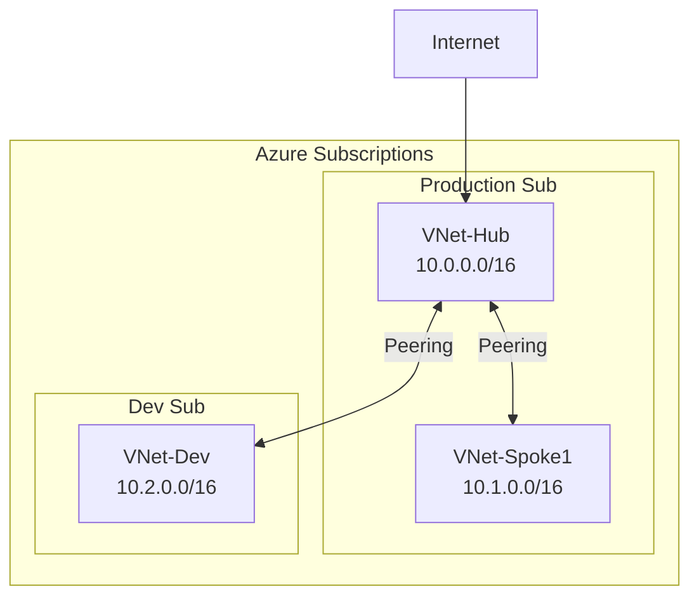

# ALZ Pre-Implementation Snapshot Audit
## Operating & Deployment Guide

**Document Version:** 1.0.0  
**Date:** February 2026  
**Classification:** Vendor Operations Guide  
**Audience:** Audit Delivery Team / Consultant

---

## Document Purpose

This guide provides step-by-step instructions for delivering a comprehensive snapshot audit of an existing Azure environment prior to Azure Landing Zone (ALZ) implementation. The audit establishes baseline compliance posture against MCSB v1, MCSB v2, NIST 800-53, UK NCSC 14 Principles, and ISO 27001.

**Sector Context:** Insurance Advisory  
**Regulatory Context:** FCA, PRA, Solvency II, Lloyd's, GDPR

---

## Table of Contents

1. [Pre-Engagement Checklist](#1-pre-engagement-checklist)
2. [Access & Permissions Setup](#2-access--permissions-setup)
3. [Tool Deployment](#3-tool-deployment)
4. [Data Collection Procedures](#4-data-collection-procedures)
5. [MCSB Assessment Execution](#5-mcsb-assessment-execution)
6. [Analysis & Scoring](#6-analysis--scoring)
7. [Deliverable Production](#7-deliverable-production)
8. [Handover Process](#8-handover-process)
9. [Troubleshooting](#9-troubleshooting)

---

## 1. Pre-Engagement Checklist

### 1.1 Client Information Required

Before starting the audit, obtain the following from the client:

| Item | Required | Notes |
|------|----------|-------|
| **Tenant ID** | ✅ | Azure AD tenant GUID |
| **Subscription List** | ✅ | All subscriptions in scope |
| **Primary Contact** | ✅ | Technical point of contact |
| **Security Contact** | ✅ | For access approvals |
| **Existing Documentation** | ⚪ | Architecture diagrams, policies |
| **Known Compliance Requirements** | ⚪ | FCA, PRA, specific frameworks |
| **Preferred Audit Window** | ✅ | Business hours, maintenance windows |
| **Data Residency Constraints** | ✅ | UK data sovereignty requirements |

### 1.2 Engagement Confirmation

```
□ Statement of Work (SoW) signed
□ NDA executed
□ Data Processing Agreement (if PII in scope)
□ Access request submitted to client
□ Audit timeline confirmed (Weeks 1-3)
□ Stakeholder kickoff meeting scheduled
```

### 1.3 Team Preparation

| Role | Responsibility | Required Skills |
|------|----------------|-----------------|
| Lead Auditor | Overall delivery, client liaison | Azure architecture, compliance frameworks |
| Platform Engineer | Tool deployment, data collection | KQL, PowerShell, Azure CLI |
| Security Analyst | MCSB assessment, gap analysis | MCSB v1/v2, NIST, ISO 27001 |

---

## 2. Access & Permissions Setup

### 2.1 Required Azure Permissions

Request the following permissions from the client's Azure administrator:

#### Option A: Built-in Roles (Recommended)

```
Scope: Management Group Root (or all subscriptions in scope)
Roles Required:
├── Reader                          # Resource inventory
├── Security Reader                 # Defender for Cloud access
├── Resource Policy Contributor     # Policy compliance data (read)
└── Log Analytics Reader            # Activity logs, diagnostics
```

#### Option B: Custom Role (Minimal Privilege)

```json
{
  "Name": "ALZ-Audit-Reader",
  "Description": "Read-only access for ALZ pre-implementation audit",
  "Actions": [
    "*/read",
    "Microsoft.Resources/subscriptions/resourceGroups/read",
    "Microsoft.Resources/subscriptions/resources/read",
    "Microsoft.Security/*/read",
    "Microsoft.PolicyInsights/*/read",
    "Microsoft.Authorization/*/read",
    "Microsoft.Network/*/read",
    "Microsoft.Storage/*/read",
    "Microsoft.KeyVault/*/read",
    "Microsoft.Compute/*/read",
    "Microsoft.Sql/*/read",
    "Microsoft.OperationalInsights/*/read"
  ],
  "NotActions": [],
  "DataActions": [],
  "NotDataActions": [],
  "AssignableScopes": [
    "/providers/Microsoft.Management/managementGroups/{mg-id}"
  ]
}
```

### 2.2 Access Request Template

Send to client security team:

```
Subject: Azure Read-Only Access Request - ALZ Snapshot Audit

We request the following access for the ALZ pre-implementation audit:

Requestor Details:
- Name: [Auditor Name]
- Email: [Auditor Email]
- Company: [Vendor Company]
- Engagement Reference: [SoW Number]

Access Requirements:
- Scope: [Management Group / Subscription List]
- Role: Reader + Security Reader
- Duration: [Start Date] to [End Date + 1 week buffer]
- Justification: Pre-ALZ compliance assessment

Access will be used to:
1. Enumerate Azure resources via Resource Graph
2. Review Defender for Cloud security posture
3. Assess Azure Policy compliance status
4. Document network topology
5. Evaluate RBAC assignments

No write operations will be performed.
No data will be exported outside Azure except aggregated reports.

Please confirm when access is provisioned.
```

### 2.3 Access Verification

Once access granted, verify permissions:

```bash
# Verify subscription access
az account list --output table

# Verify Resource Graph access
az graph query -q "resources | summarize count()" --output table

# Verify Defender access
az security assessment list --subscription <sub-id> --output table

# Verify Policy access
az policy state list --subscription <sub-id> --top 5 --output table
```

**Expected Output:** All commands return data without permission errors.

---

## 3. Tool Deployment

### 3.1 Prerequisites

Install on auditor workstation:

```bash
# Azure CLI (latest)
curl -sL https://aka.ms/InstallAzureCLIDeb | sudo bash
az version  # Verify: 2.50.0+

# Azure CLI Extensions
az extension add --name resource-graph
az extension add --name azure-devops
az extension add --name account

# PowerShell (if preferred)
# Install Az module
Install-Module -Name Az -AllowClobber -Scope CurrentUser

# Python (for custom scripts)
python3 --version  # Verify: 3.10+
pip install pandas openpyxl azure-identity azure-mgmt-resource
```

### 3.2 Authenticate to Azure

```bash
# Interactive login (with MFA)
az login --tenant <tenant-id>

# Verify correct tenant
az account show --output table

# Set default subscription (if multiple)
az account set --subscription <primary-subscription-id>

# List all accessible subscriptions
az account list --query "[].{Name:name, ID:id, State:state}" --output table
```

### 3.3 Deploy Azure Workbook

#### Step 1: Create Resource Group (if needed)

```bash
# Create resource group for audit tools
az group create \
  --name rg-alz-audit-tools \
  --location uksouth \
  --tags Environment=Audit Project=ALZ-Assessment Owner=VendorName
```

#### Step 2: Deploy Workbook via Azure CLI

```bash
# Download workbook template
curl -o Pre-ALZ-Assessment-Workbook.workbook \
  https://raw.githubusercontent.com/[your-repo]/Pre-ALZ-Assessment-Workbook.workbook

# Deploy workbook
az monitor workbook create \
  --resource-group rg-alz-audit-tools \
  --location uksouth \
  --display-name "Pre-ALZ Environment Audit" \
  --serialized-data @Pre-ALZ-Assessment-Workbook.workbook \
  --category workbook \
  --tags Environment=Audit
```

#### Step 3: Deploy Workbook via Azure Portal (Alternative)

1. Navigate to **Azure Monitor** → **Workbooks**
2. Click **+ New**
3. Click **</>** (Advanced Editor)
4. Paste contents of `Pre-ALZ-Assessment-Workbook.workbook`
5. Click **Apply**
6. Click **Save As**
   - Title: `Pre-ALZ Environment Audit`
   - Resource Group: `rg-alz-audit-tools`
7. Click **Save**

#### Step 4: Verify Workbook Deployment

1. Navigate to **Azure Monitor** → **Workbooks**
2. Find `Pre-ALZ Environment Audit`
3. Open and verify all tabs load:
   - ✅ Audit Summary
   - ✅ Resource Inventory
   - ✅ Subscriptions & Governance
   - ✅ Security Configuration
   - ✅ Network Topology
   - ✅ Identity & RBAC
   - ✅ Data & AI Resources
   - ✅ MCSB v1 Assessment
   - ✅ MCSB v2 Assessment
   - ✅ NIST/NCSC/ISO Mapping

### 3.4 Prepare Query Scripts

Create working directory and download query library:

```bash
# Create working directory
mkdir -p ~/alz-audit/{exports,reports,scripts}
cd ~/alz-audit

# Download KQL queries
curl -o scripts/kql-queries.json \
  https://raw.githubusercontent.com/[your-repo]/kql-queries.json

# Download compliance mapping
curl -o scripts/compliance-mapping.json \
  https://raw.githubusercontent.com/[your-repo]/compliance-mapping.json
```

---

## 4. Data Collection Procedures

### 4.1 Collection Schedule

| Day | Activity | Duration | Output |
|-----|----------|----------|--------|
| **Day 1** | Resource inventory | 4 hours | `inventory-*.json/csv` |
| **Day 2** | Governance & policy | 4 hours | `governance-*.json` |
| **Day 3** | Security configuration | 4 hours | `security-*.csv` |
| **Day 4** | Network topology | 4 hours | `network-*.json` |
| **Day 5** | Identity & RBAC | 3 hours | `rbac-*.json` |

### 4.2 Resource Inventory Collection

#### 4.2.1 Full Resource Inventory

```bash
# Export complete resource inventory
az graph query -q "
resources
| project 
    name,
    type,
    resourceGroup,
    subscriptionId,
    location,
    sku = tostring(sku),
    kind,
    tags,
    id
| order by type asc, name asc
" --first 5000 --output json > exports/inventory-full.json

# If more than 5000 resources, paginate
az graph query -q "resources | count" --output json
# Note: If count > 5000, use --skip parameter for pagination
```

#### 4.2.2 Resource Summary by Type

```bash
az graph query -q "
resources
| summarize ResourceCount = count() by type
| order by ResourceCount desc
" --output json > exports/inventory-by-type.json

# Convert to CSV for Excel
cat exports/inventory-by-type.json | \
  jq -r '["ResourceType","Count"], (.data[] | [.type, .ResourceCount]) | @csv' \
  > exports/inventory-by-type.csv
```

#### 4.2.3 Untagged Resources (Governance Gap)

```bash
az graph query -q "
resources
| where isnull(tags) or tags == '{}'
| project name, type, resourceGroup, subscriptionId, location, id
| order by type asc
" --first 1000 --output json > exports/untagged-resources.json
```

### 4.3 Governance Data Collection

#### 4.3.1 Management Group Hierarchy

```bash
az account management-group list --output json > exports/management-groups.json

# Get hierarchy tree
az account management-group show \
  --name <root-mg-name> \
  --expand \
  --recurse \
  --output json > exports/mg-hierarchy.json
```

#### 4.3.2 Subscription List

```bash
az account list \
  --query "[].{Name:name, ID:id, State:state, TenantId:tenantId}" \
  --output json > exports/subscriptions.json
```

#### 4.3.3 Policy Assignments

```bash
# Get all policy assignments
az policy assignment list \
  --output json > exports/policy-assignments.json

# Get policy compliance state
az policy state list \
  --management-group <mg-id> \
  --top 1000 \
  --output json > exports/policy-compliance.json
```

### 4.4 Security Configuration Collection

#### 4.4.1 Storage Account Security

```bash
az graph query -q "
resources
| where type == 'microsoft.storage/storageaccounts'
| extend 
    httpsOnly = properties.supportsHttpsTrafficOnly,
    minTlsVersion = properties.minimumTlsVersion,
    allowBlobPublicAccess = properties.allowBlobPublicAccess,
    networkDefaultAction = properties.networkAcls.defaultAction
| project 
    name, 
    resourceGroup, 
    subscriptionId,
    location,
    httpsOnly,
    minTlsVersion,
    allowBlobPublicAccess,
    networkDefaultAction
" --output json > exports/storage-security.json
```

#### 4.4.2 Key Vault Configuration

```bash
az graph query -q "
resources
| where type == 'microsoft.keyvault/vaults'
| extend 
    enableRbacAuthorization = properties.enableRbacAuthorization,
    enableSoftDelete = properties.enableSoftDelete,
    enablePurgeProtection = properties.enablePurgeProtection,
    publicNetworkAccess = properties.publicNetworkAccess
| project 
    name, 
    resourceGroup, 
    subscriptionId,
    enableRbacAuthorization,
    enableSoftDelete,
    enablePurgeProtection,
    publicNetworkAccess
" --output json > exports/keyvaults.json
```

#### 4.4.3 Defender for Cloud Secure Score

```bash
# Get secure score for each subscription
for sub in $(az account list --query "[].id" -o tsv); do
  echo "Processing subscription: $sub"
  az security secure-score list \
    --subscription $sub \
    --output json >> exports/secure-scores.json
done

# Get security assessments
az security assessment list \
  --output json > exports/security-assessments.json
```

### 4.5 Network Topology Collection

#### 4.5.1 Virtual Networks

```bash
az graph query -q "
resources
| where type == 'microsoft.network/virtualnetworks'
| extend 
    addressSpace = properties.addressSpace.addressPrefixes,
    dnsServers = properties.dhcpOptions.dnsServers,
    subnets = array_length(properties.subnets)
| project 
    name, 
    resourceGroup, 
    subscriptionId, 
    location,
    addressSpace,
    dnsServers,
    subnets
" --output json > exports/vnets.json
```

#### 4.5.2 Subnets with NSG Status

```bash
az graph query -q "
resources
| where type == 'microsoft.network/virtualnetworks'
| mv-expand subnet = properties.subnets
| extend 
    subnetName = subnet.name,
    addressPrefix = subnet.properties.addressPrefix,
    nsgId = subnet.properties.networkSecurityGroup.id,
    hasNsg = isnotnull(subnet.properties.networkSecurityGroup.id)
| project 
    vnetName = name,
    subnetName,
    addressPrefix,
    hasNsg,
    nsgId,
    resourceGroup,
    subscriptionId
" --output json > exports/subnets.json
```

#### 4.5.3 VNet Peerings

```bash
az graph query -q "
resources
| where type == 'microsoft.network/virtualnetworks'
| mv-expand peering = properties.virtualNetworkPeerings
| extend 
    peeringName = peering.name,
    peeringState = peering.properties.peeringState,
    remoteVnet = peering.properties.remoteVirtualNetwork.id
| where isnotnull(peeringName)
| project 
    vnetName = name,
    peeringName,
    peeringState,
    remoteVnet,
    resourceGroup,
    subscriptionId
" --output json > exports/peerings.json
```

#### 4.5.4 Network Security Groups and Rules

```bash
az graph query -q "
resources
| where type == 'microsoft.network/networksecuritygroups'
| project 
    name, 
    resourceGroup, 
    subscriptionId, 
    location,
    rulesCount = array_length(properties.securityRules),
    defaultRulesCount = array_length(properties.defaultSecurityRules)
" --output json > exports/nsgs.json

# Get detailed NSG rules (separate query per NSG if needed)
az network nsg list --output json > exports/nsg-rules-detail.json
```

### 4.6 Identity & RBAC Collection

#### 4.6.1 Role Assignments

```bash
az graph query -q "
authorizationresources
| where type == 'microsoft.authorization/roleassignments'
| extend 
    principalId = properties.principalId,
    principalType = properties.principalType,
    roleDefinitionId = properties.roleDefinitionId,
    scope = properties.scope
| project 
    name,
    principalId,
    principalType,
    roleDefinitionId,
    scope
" --first 5000 --output json > exports/rbac-assignments.json
```

#### 4.6.2 Managed Identities

```bash
az graph query -q "
resources
| where identity.type has 'SystemAssigned' or identity.type has 'UserAssigned'
| extend 
    identityType = identity.type,
    principalId = identity.principalId
| project 
    name, 
    type, 
    resourceGroup, 
    subscriptionId,
    identityType,
    principalId
" --output json > exports/managed-identities.json
```

### 4.7 Data Collection Checklist

```
□ inventory-full.json
□ inventory-by-type.csv
□ untagged-resources.json
□ management-groups.json
□ mg-hierarchy.json
□ subscriptions.json
□ policy-assignments.json
□ policy-compliance.json
□ storage-security.json
□ keyvaults.json
□ secure-scores.json
□ security-assessments.json
□ vnets.json
□ subnets.json
□ peerings.json
□ nsgs.json
□ nsg-rules-detail.json
□ rbac-assignments.json
□ managed-identities.json
```

---

## 5. MCSB Assessment Execution

### 5.1 MCSB v1 Assessment

#### 5.1.1 Enable Regulatory Compliance (if not enabled)

```bash
# Check if MCSB v1 is assigned
az security regulatory-compliance-standards list \
  --query "[?name=='Azure-Security-Benchmark']" \
  --output table
```

#### 5.1.2 Export MCSB v1 Compliance Data

```bash
# Get MCSB v1 compliance controls
az security regulatory-compliance-controls list \
  --standard-name "Azure-Security-Benchmark" \
  --output json > exports/mcsb-v1-controls.json

# Get control assessments
az security regulatory-compliance-assessments list \
  --standard-name "Azure-Security-Benchmark" \
  --output json > exports/mcsb-v1-assessments.json
```

#### 5.1.3 Calculate MCSB v1 Score

```python
# Python script: calculate_mcsb_v1_score.py
import json

with open('exports/mcsb-v1-assessments.json') as f:
    assessments = json.load(f)

total = len(assessments)
passed = len([a for a in assessments if a['properties']['state'] == 'Passed'])
failed = len([a for a in assessments if a['properties']['state'] == 'Failed'])
skipped = len([a for a in assessments if a['properties']['state'] == 'Skipped'])

score = (passed / (total - skipped)) * 100 if (total - skipped) > 0 else 0

print(f"MCSB v1 Score: {score:.1f}%")
print(f"Passed: {passed}, Failed: {failed}, Skipped: {skipped}, Total: {total}")
```

### 5.2 MCSB v2 Assessment

#### 5.2.1 Export MCSB v2 Compliance Data

```bash
# Get MCSB v2 compliance (if enabled)
az security regulatory-compliance-controls list \
  --standard-name "Microsoft-cloud-security-benchmark" \
  --output json > exports/mcsb-v2-controls.json

az security regulatory-compliance-assessments list \
  --standard-name "Microsoft-cloud-security-benchmark" \
  --output json > exports/mcsb-v2-assessments.json
```

#### 5.2.2 Manual MCSB v2 Control Assessment

For controls not automatically assessed, use the workbook MCSB tabs and document manually:

| Control | Domain | Resource Types | Check Method | Status |
|---------|--------|----------------|--------------|--------|
| NS-1 | Network Security | VNets, NSGs | Query subnets without NSG | ☐ |
| NS-2 | Network Security | NSGs | Review NSG rules | ☐ |
| DP-1 | Data Protection | All | Classification labels | ☐ |
| DP-3 | Data Protection | Storage, SQL | TLS configuration | ☐ |
| DP-5 | Data Protection | Key Vault | CMK configuration | ☐ |
| IM-1 | Identity Management | Entra ID | Authentication methods | ☐ |
| IM-3 | Identity Management | Apps | Managed identity usage | ☐ |
| PA-1 | Privileged Access | RBAC | PIM enablement | ☐ |

### 5.3 Cross-Framework Mapping Assessment

Use `compliance-mapping.json` to assess controls across frameworks:

```bash
# Generate cross-framework compliance matrix
python3 scripts/generate_compliance_matrix.py \
  --mcsb-v1 exports/mcsb-v1-assessments.json \
  --mcsb-v2 exports/mcsb-v2-assessments.json \
  --output reports/compliance-matrix.xlsx
```

---

## 6. Analysis & Scoring

### 6.1 Scoring Methodology

#### 6.1.1 Overall Compliance Score

```
Overall Score = (Σ Control Scores × Control Weights) / Total Weighted Controls

Where:
- P0 Controls (Critical): Weight = 3
- P1 Controls (Important): Weight = 2  
- P2 Controls (Advisory): Weight = 1
```

#### 6.1.2 Control Status Definitions

| Status | Definition | Score |
|--------|------------|-------|
| **Compliant** | Meets control requirement | 100% |
| **Partial** | Partially implemented | 50% |
| **Non-Compliant** | Does not meet requirement | 0% |
| **Not Applicable** | Control not relevant | Excluded |
| **Not Assessed** | Unable to assess | Excluded |

### 6.2 Gap Analysis Process

#### Step 1: Identify Non-Compliant Controls

```bash
# Extract failed assessments
jq '[.[] | select(.properties.state == "Failed")]' \
  exports/mcsb-v2-assessments.json > reports/failed-controls.json
```

#### Step 2: Map to Remediation Priority

```python
# Priority mapping based on severity and regulatory impact
PRIORITY_MAP = {
    ("critical", "FCA"): 1,    # Immediate action
    ("critical", "PRA"): 1,
    ("high", "FCA"): 2,        # Within 30 days
    ("high", "PRA"): 2,
    ("medium", None): 3,       # Within 90 days
    ("low", None): 4,          # Best effort
    ("informational", None): 5 # Advisory
}
```

#### Step 3: Generate Gap Analysis Report

For each gap, document:

| Field | Description |
|-------|-------------|
| Control ID | MCSB/NIST/ISO control identifier |
| Control Name | Human-readable name |
| Current State | What exists today |
| Expected State | Target configuration |
| Gap Description | What's missing |
| Affected Resources | Count and list |
| Regulatory Impact | FCA/PRA/Lloyd's relevance |
| Remediation Steps | How to fix |
| Estimated Effort | Hours/days |
| Priority | 1-5 |

### 6.3 Risk Assessment

#### 6.3.1 Risk Scoring Matrix

```
Risk Score = Likelihood × Impact

Likelihood:
- 5 = Almost Certain (>90%)
- 4 = Likely (70-90%)
- 3 = Possible (30-70%)
- 2 = Unlikely (10-30%)
- 1 = Rare (<10%)

Impact:
- 5 = Critical (Regulatory breach, data loss)
- 4 = Major (Significant security exposure)
- 3 = Moderate (Compliance gap)
- 2 = Minor (Best practice deviation)
- 1 = Negligible (Informational)
```

#### 6.3.2 Risk Register Template

| Risk ID | Description | Likelihood | Impact | Score | Control Gap | Mitigation |
|---------|-------------|------------|--------|-------|-------------|------------|
| R001 | Storage without encryption | 3 | 4 | 12 | DP-4 | Enable encryption |
| R002 | Missing NSGs on subnets | 4 | 4 | 16 | NS-1 | Deploy NSGs |

---

## 7. Deliverable Production

### 7.1 Required Deliverables

| # | Deliverable | Format | Description |
|---|------------|--------|-------------|
| 1 | Resource Inventory | CSV, JSON | Complete asset register |
| 2 | Current State Architecture | Mermaid/Visio | As-is diagrams |
| 3 | MCSB v1 Compliance Report | Excel, PDF | v1 control-by-control scoring |
| 4 | MCSB v2 Compliance Report | Excel, PDF | v2 control-by-control scoring |
| 5 | Security Posture Report | PDF | Defender scores, recommendations |
| 6 | Governance Assessment | PDF | Policy, tagging, RBAC analysis |
| 7 | Network Topology | Diagram + Table | VNets, subnets, peerings |
| 8 | Cost Baseline | Excel | Current spend analysis |
| 9 | Gap Analysis Matrix | Excel | Gaps mapped to all frameworks |
| 10 | Risk Register | Excel | Prioritised risks |
| 11 | Executive Summary | PDF | Management presentation |
| 12 | ALZ Target State Inputs | Document | Requirements for design phase |

### 7.2 Report Templates

#### 7.2.1 Executive Summary Structure

```
1. Engagement Overview
   - Scope
   - Timeline
   - Methodology
   
2. Key Findings
   - Overall compliance score
   - Critical gaps (top 5)
   - Risk summary
   
3. Compliance Posture
   - MCSB v1 score: XX%
   - MCSB v2 score: XX%
   - Insurance regulatory alignment
   
4. Recommendations
   - Immediate actions (P1)
   - Short-term improvements (P2)
   - Strategic initiatives (P3)
   
5. Next Steps
   - ALZ target state design
   - Remediation roadmap
   - Resource requirements
```

#### 7.2.2 Gap Analysis Report Structure

```
1. Methodology
2. Scoring Summary
3. Framework Coverage
   - MCSB v1 Results
   - MCSB v2 Results
   - NIST 800-53 Mapping
   - UK NCSC Mapping
   - ISO 27001 Mapping
4. Detailed Gap Analysis (by control family)
5. Remediation Priorities
6. Resource Estimates
```

### 7.3 Diagram Production

#### Network Topology Diagram



Generate diagrams using collected data:

```python
# generate_network_diagram.py
import json

with open('exports/vnets.json') as f:
    vnets = json.load(f)

with open('exports/peerings.json') as f:
    peerings = json.load(f)

# Generate Mermaid diagram
print("graph TB")
for vnet in vnets['data']:
    print(f"    {vnet['name']}[{vnet['name']}<br/>{vnet['addressSpace']}]")
    
for peering in peerings['data']:
    print(f"    {peering['vnetName']} <-->|Peering| {peering['remoteVnet'].split('/')[-1]}")
```

### 7.4 Deliverable Checklist

```
Phase 1 Deliverables (Week 3):
□ D01 - Resource Inventory (inventory-full.json, inventory-by-type.csv)
□ D02 - Current State Architecture (current-state-architecture.md)
□ D03 - MCSB v1 Compliance Report (mcsb-v1-assessment.xlsx)
□ D04 - MCSB v2 Compliance Report (mcsb-v2-assessment.xlsx)
□ D05 - Security Posture Report (security-posture.pdf)
□ D06 - Governance Assessment (governance-assessment.pdf)
□ D07 - Network Topology (network-topology.md, network-diagram.png)
□ D08 - Cost Baseline (cost-baseline.xlsx)
□ D09 - Gap Analysis Matrix (gap-analysis.xlsx)
□ D10 - Risk Register (risk-register.xlsx)
□ D11 - Executive Summary (executive-summary.pdf)
□ D12 - ALZ Target State Inputs (alz-requirements.md)
```

---

## 8. Handover Process

### 8.1 Stakeholder Presentation

#### Presentation Agenda (90 minutes)

| Time | Topic | Presenter |
|------|-------|-----------|
| 0-10 | Introduction & Methodology | Lead Auditor |
| 10-30 | Executive Summary & Key Findings | Lead Auditor |
| 30-50 | Technical Deep Dive | Platform Engineer |
| 50-70 | Gap Analysis & Recommendations | Security Analyst |
| 70-80 | Q&A | All |
| 80-90 | Next Steps & ALZ Design Phase | Lead Auditor |

### 8.2 Document Handover

```
Handover Package:
├── /01-Executive/
│   └── Executive-Summary.pdf
├── /02-Inventories/
│   ├── inventory-full.json
│   ├── inventory-by-type.csv
│   └── untagged-resources.csv
├── /03-Compliance/
│   ├── mcsb-v1-assessment.xlsx
│   ├── mcsb-v2-assessment.xlsx
│   └── compliance-matrix.xlsx
├── /04-Security/
│   ├── security-posture.pdf
│   ├── secure-scores.json
│   └── security-assessments.json
├── /05-Network/
│   ├── network-topology.md
│   ├── vnets.json
│   ├── subnets.json
│   └── network-diagram.png
├── /06-Governance/
│   ├── governance-assessment.pdf
│   ├── policy-assignments.json
│   └── rbac-assignments.json
├── /07-Analysis/
│   ├── gap-analysis.xlsx
│   └── risk-register.xlsx
├── /08-ALZ-Inputs/
│   └── alz-requirements.md
└── /09-Raw-Data/
    └── [all raw exports]
```

### 8.3 Access Revocation

After handover:

```bash
# Confirm all data exported
ls -la exports/ | wc -l  # Verify file count

# Request access revocation
# Send email to client security team:

Subject: ALZ Audit Complete - Access Revocation Request

The ALZ pre-implementation audit is now complete.

Please revoke the following access:
- User: [Auditor Email]
- Role: ALZ-Audit-Reader (or Reader + Security Reader)
- Scope: [Management Group / Subscriptions]

All required data has been collected and exported.
Deliverables have been transferred to [SharePoint/Teams location].

Thank you for your cooperation.
```

### 8.4 Cleanup

```bash
# Remove local sensitive data (after handover confirmed)
rm -rf ~/alz-audit/exports/
rm -rf ~/alz-audit/reports/

# Logout from Azure
az logout

# Clear Azure CLI cache
az cache purge
az account clear
```

---

## 9. Troubleshooting

### 9.1 Common Issues

| Issue | Cause | Resolution |
|-------|-------|------------|
| `AuthorizationFailed` | Insufficient permissions | Request additional role assignments |
| `ResourceNotFound` | Resource deleted during audit | Re-run query, note in report |
| `QuotaExceeded` | Resource Graph query limit | Use pagination (`--skip`, `--first`) |
| `InvalidSubscription` | Subscription not in scope | Verify subscription list with client |
| `TooManyRequests` | API throttling | Add delays between queries |

### 9.2 Resource Graph Query Limits

```bash
# Check current query limits
az graph query -q "resources | count"

# If > 5000 results, paginate
PAGE_SIZE=1000
SKIP=0

while true; do
  RESULT=$(az graph query -q "resources" --first $PAGE_SIZE --skip $SKIP --output json)
  if [ $(echo $RESULT | jq '.data | length') -eq 0 ]; then
    break
  fi
  echo $RESULT >> exports/inventory-paginated.json
  SKIP=$((SKIP + PAGE_SIZE))
  sleep 1  # Avoid throttling
done
```

### 9.3 Defender for Cloud Issues

If regulatory compliance data is missing:

```bash
# Check if standards are enabled
az security regulatory-compliance-standards list --output table

# If empty, standards may need to be enabled in Defender for Cloud
# Navigate to: Defender for Cloud → Regulatory Compliance → Manage Standards
```

### 9.4 Support Escalation

If issues cannot be resolved:

1. Document the issue with screenshots/error messages
2. Check Azure Service Health for outages
3. Contact client Azure administrator
4. If persistent, open Azure support ticket (client must raise)

---

## Appendix A: Quick Reference Commands

```bash
# === AUTHENTICATION ===
az login --tenant <tenant-id>
az account set --subscription <sub-id>

# === RESOURCE INVENTORY ===
az graph query -q "resources | summarize count() by type" --output table
az graph query -q "resources" --first 1000 --output json > inventory.json

# === SECURITY ===
az security secure-score list --output table
az security assessment list --output table

# === POLICY ===
az policy assignment list --output table
az policy state list --top 100 --output table

# === NETWORK ===
az network vnet list --output table
az network nsg list --output table

# === IDENTITY ===
az role assignment list --all --output table
```

---

## Appendix B: File Naming Convention

```
{domain}-{content}-{date}.{ext}

Examples:
inventory-full-20260203.json
mcsb-v2-assessment-20260203.xlsx
network-topology-20260203.md
gap-analysis-20260203.xlsx
```

---

## Document Control

| Version | Date | Author | Changes |
|---------|------|--------|---------|
| 1.0.0 | 2026-02-03 | Advisory Team | Initial release |
