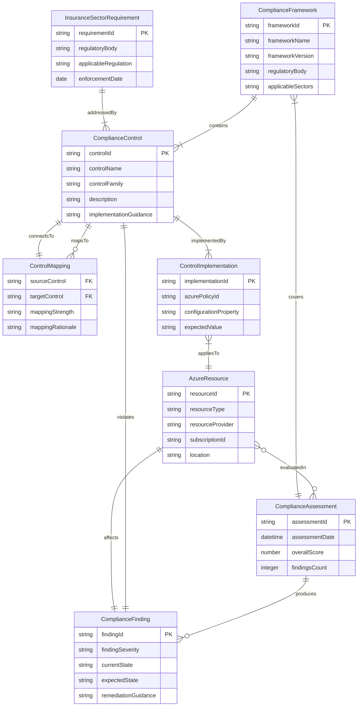
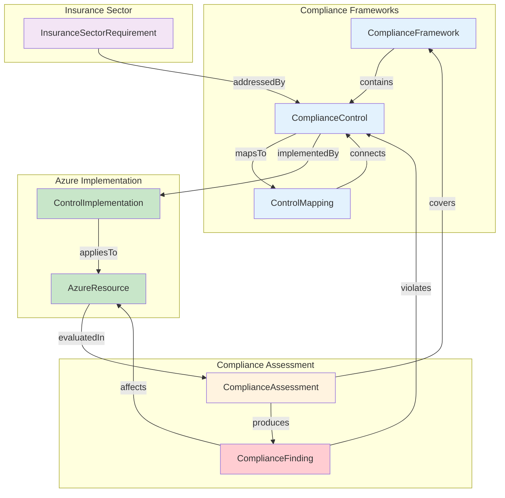
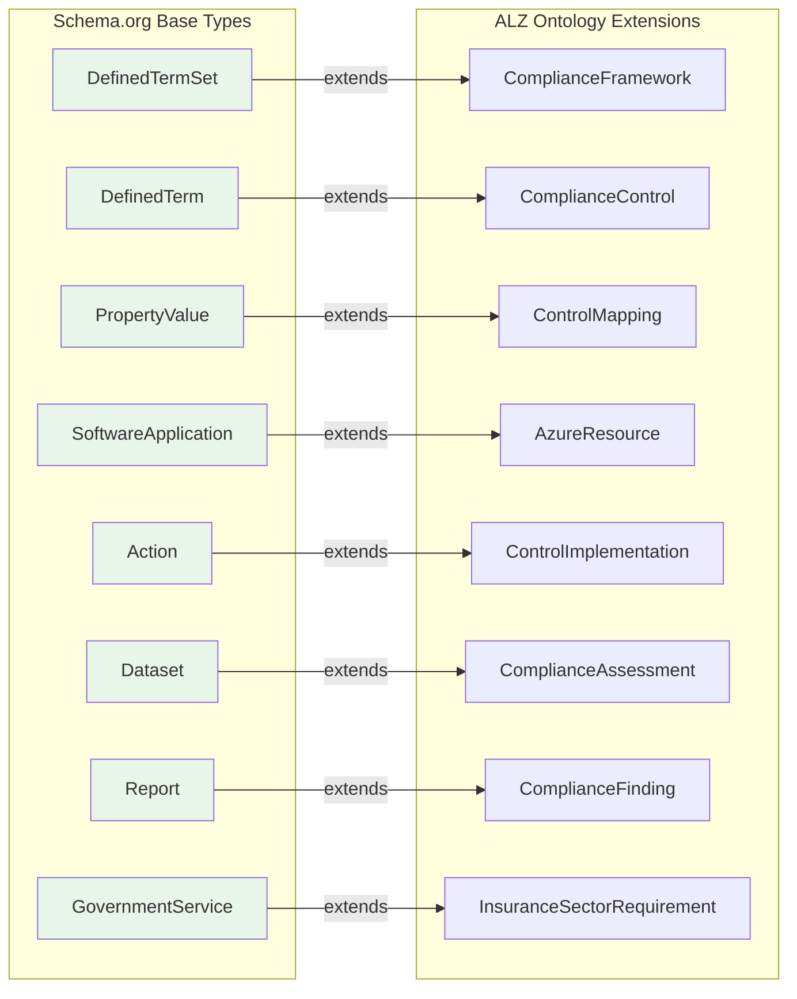
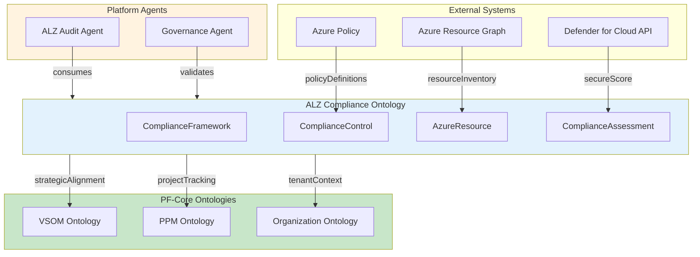
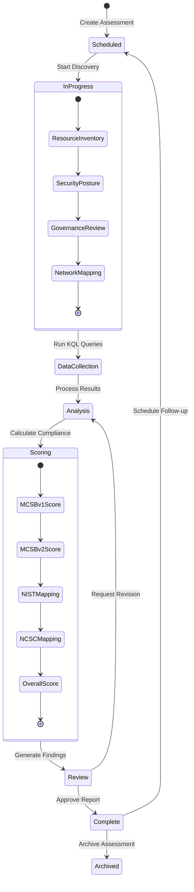
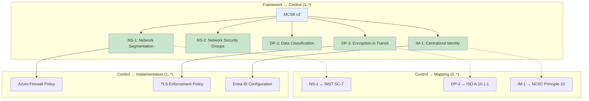

# ALZ Compliance Ontology - Visual Architecture Guide
## OAA v5.0.0 Compliant

**Ontology:** ALZ Compliance Ontology v1.0.0  
**Entry ID:** Entry-ONT-ALZ-001  
**Generated:** 2026-02-03  
**OAA Version:** v5.0.0

---

## 1. Entity-Relationship Diagram

Core ontology structure showing all entities, their properties, and relationships with cardinality.

---

## 2. Architecture Overview

High-level structure showing entity categories and their interconnections.

---

## 3. Schema.org Mapping

Inheritance relationships from Schema.org base types to custom extensions.

---

## 4. Domain Integration

How this ontology integrates with other platform ontologies and external systems.

---

## 5. Lifecycle Flow (Assessment State Machine)

Status transitions for compliance assessments and findings.

---

## 6. Relationship Patterns

Example relationship instances showing cardinality and network structure.

---

## Validation Status

| Diagram | Renders | Entities Covered | Notes |
|---------|---------|------------------|-------|
| 1. ER Diagram | ✅ | 8/8 (100%) | All entities with properties |
| 2. Architecture Overview | ✅ | 8/8 (100%) | Color-coded by category |
| 3. Schema.org Mapping | ✅ | 8/8 (100%) | All base types documented |
| 4. Domain Integration | ✅ | 4/8 (50%) | Focus on integration points |
| 5. Lifecycle Flow | ✅ | 2/8 (25%) | Assessment states only |
| 6. Relationship Patterns | ✅ | 3/8 (38%) | Example instances |

**Visual Guide Status:** COMPLETE ✅

---

## Entity Connectivity Validation (GATE 2B)

| Entity | Relationships (Source) | Relationships (Target) | Connected |
|--------|------------------------|------------------------|-----------|
| ComplianceFramework | 1 (contains) | 1 (coveredBy) | ✅ |
| ComplianceControl | 4 (mapsTo, implementedBy, addressesSector, belongsTo) | 3 (contains, violates, addressedBy) | ✅ |
| ControlMapping | 1 (connectsControls) | 1 (mapsTo) | ✅ |
| AzureResource | 1 (evaluatedIn) | 2 (appliesTo, affects) | ✅ |
| ControlImplementation | 2 (satisfiesControl, appliesTo) | 1 (implementedBy) | ✅ |
| ComplianceAssessment | 2 (covers, produces) | 1 (evaluatedIn) | ✅ |
| ComplianceFinding | 2 (violates, affects) | 1 (produces) | ✅ |
| InsuranceSectorRequirement | 1 (addressedBy) | 1 (addressesSector) | ✅ |

**Entity Connectivity:** 8/8 (100%) ✅  
**Graph Connectivity:** Single connected component ✅  
**Relationship Density:** 16 edges / 8 nodes = 2.0 (≥0.8 threshold) ✅

---

## Change Control

| Version | Date | Author | Changes |
|---------|------|--------|---------|
| 1.0.0 | 2026-02-03 | OAA v5.0.0 | Initial visual guide generation |
