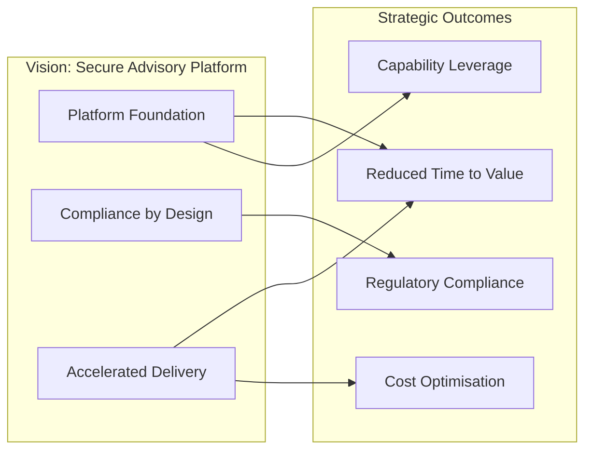
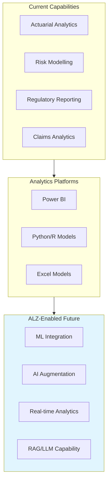
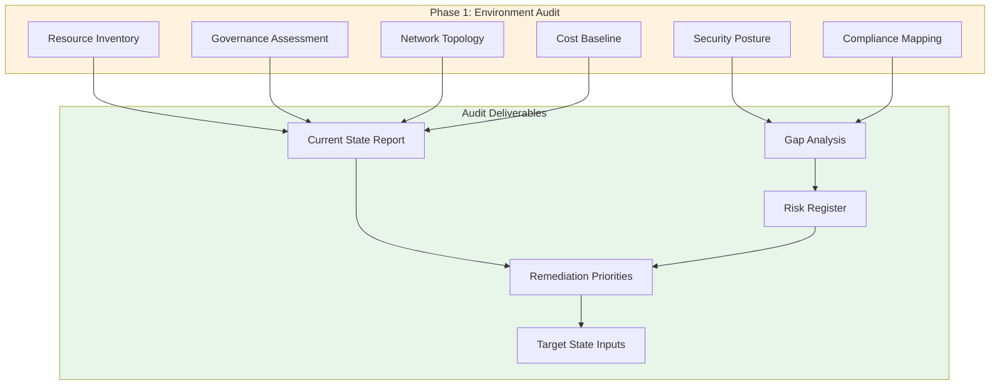
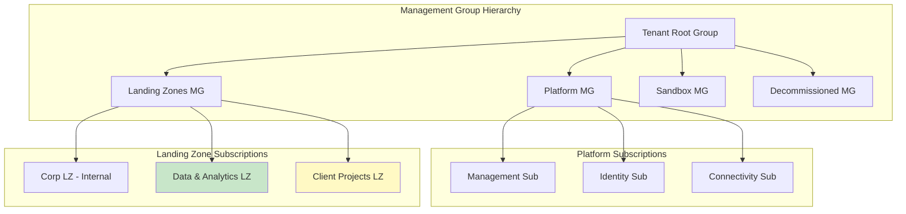
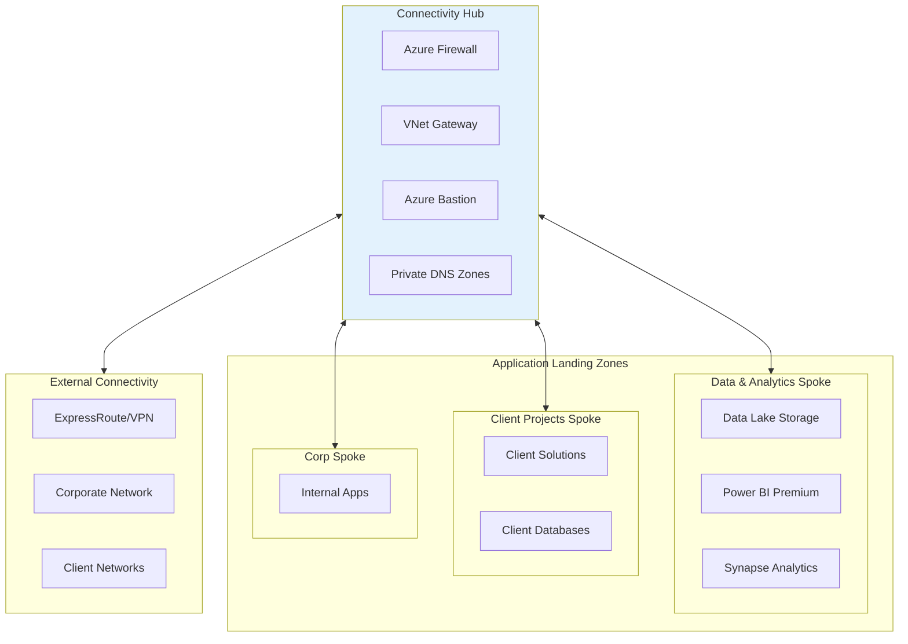
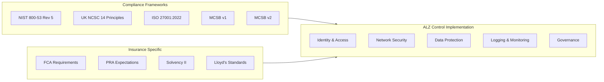
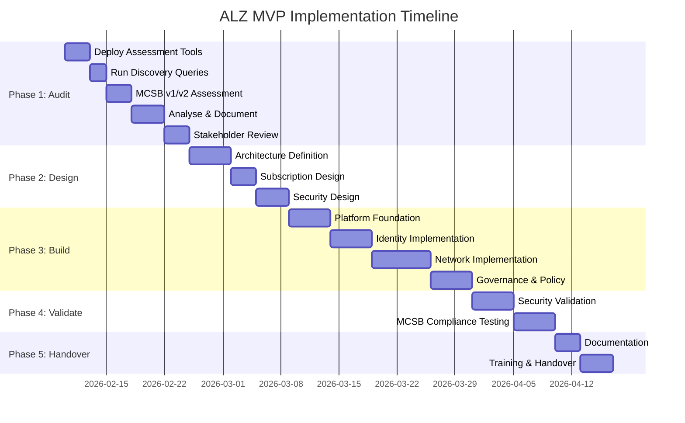

# Azure Landing Zone MVP
## Vision, Strategy & Implementation Plan

**Document Version:** 1.1  
**Date:** February 2026  
**Sector:** Insurance Advisory  
**Classification:** Internal / RFP Baseline

---

## Executive Summary

This document establishes the vision, strategy, scope, and baseline implementation plan for an Azure Landing Zone (ALZ) Minimum Viable Product (MVP) to support an Insurance Advisory firm providing consulting, analytics, and technology services to insurance carriers, brokers, and reinsurers across UK and international markets.

**Primary Objective:** Conduct a comprehensive snapshot audit of the existing Azure environment to establish baseline compliance posture, identify gaps, and inform ALZ target state architecture.

The ALZ MVP will be delivered within an 8-12 week timeframe using approximately 2-3 external FTE resources, adopting Microsoft Cloud Adoption Framework Accelerators and Microsoft Security Benchmarks (MCSB v1 and v2) aligned to NIST 800-53, UK NCSC 14 Principles, ISO 27001, and insurance sector regulatory requirements.

---

## 1. Vision Statement

> **Enable a secure, governed, and scalable Azure platform that accelerates delivery of Data, BI, Analytics, and AI-augmented advisory solutions for insurance clients whilst maintaining rigorous compliance with regulatory requirements including FCA, PRA, Solvency II, and Lloyd's standards.**

### Strategic Outcomes

---

## 2. Strategic Context

### 2.1 Organisation Profile

| Attribute | Description |
|-----------|-------------|
| **Sector** | Insurance Advisory |
| **Services** | Consulting, Analytics, Technology Advisory, Transformation |
| **Markets** | UK, Lloyd's, International Insurance/Reinsurance |
| **Clients** | Carriers, Brokers, MGAs, Reinsurers |
| **Regulatory Context** | FCA, PRA, Solvency II, Lloyd's, GDPR, NIST 800-53, UK NCSC, ISO 27001 |

### 2.2 Advisory Capability Landscape

### 2.3 Business & Digital Transformation Scope

- Enterprise AI, Data, BI, Analytics
- Insurance-specific modelling and simulation
- Lean Six Sigma / Continuous Improvement
- RegTech and Compliance Automation
- DevSecOps Process Maturity

---

## 3. Phase 1: Existing Environment Audit

### 3.1 Audit Objectives

> **Establish a comprehensive baseline of the current Azure estate to inform ALZ target state design, identify compliance gaps, and prioritise remediation activities.**

### 3.2 Audit Scope

| Domain | Assessment Areas | Key Outputs |
|--------|------------------|-------------|
| **Resource Inventory** | All deployed resources, types, locations, SKUs | Complete asset register (CSV/JSON) |
| **Governance** | Management groups, subscriptions, policies, tags | Governance maturity assessment |
| **Security** | Defender status, Key Vault config, NSGs, encryption | MCSB v1/v2 compliance score |
| **Network** | VNets, subnets, peerings, connectivity | Network topology diagram |
| **Identity** | Entra ID, RBAC, PIM status, service principals | IAM risk assessment |
| **Data & AI** | Data services, storage, analytics resources | Data platform inventory |
| **Cost** | Current spend, trends, untagged resources | Cost baseline report |
| **Compliance** | NIST, NCSC, ISO, MCSB alignment | Compliance gap matrix |

### 3.3 Audit Execution Workflow

```mermaid
flowchart LR
    subgraph Week1["Week 1: Discovery"]
        D1[Deploy Workbook]
        D2[Run KQL Queries]
        D3[Export Inventories]
    end
    
    subgraph Week2["Week 2: Analysis"]
        A1[MCSB Assessment]
        A2[Defender Review]
        A3[Policy Analysis]
        A4[Network Mapping]
    end
    
    subgraph Week3["Week 3: Reporting"]
        R1[Current State Doc]
        R2[Gap Analysis]
        R3[Recommendations]
        R4[Stakeholder Review]
    end
    
    D1 --> D2 --> D3
    D3 --> A1
    A1 --> A2 --> A3 --> A4
    A4 --> R1
    R1 --> R2 --> R3 --> R4
```

### 3.4 Audit Deliverables

| Deliverable | Format | Description |
|-------------|--------|-------------|
| **Resource Inventory** | CSV, JSON | Complete list of all Azure resources |
| **Current State Architecture** | Mermaid/Visio | As-is architecture diagrams |
| **MCSB v1 Compliance Report** | Excel, PDF | Legacy benchmark scoring |
| **MCSB v2 Compliance Report** | Excel, PDF | Current benchmark scoring |
| **Security Posture Report** | PDF | Defender scores, vulnerabilities, recommendations |
| **Governance Assessment** | PDF | Policy coverage, tagging compliance, RBAC analysis |
| **Network Topology** | Diagram + Table | VNets, subnets, peerings, IP addressing |
| **Cost Baseline** | Excel | Current spend by service, resource group, tag |
| **Gap Analysis Matrix** | Excel | Gaps mapped to NIST/NCSC/ISO/MCSB controls |
| **Risk Register** | Excel | Prioritised risks with remediation recommendations |
| **ALZ Target State Inputs** | Document | Requirements for ALZ design phase |

### 3.5 Audit Output Files

| Query/Assessment | Output File | Format |
|------------------|-------------|--------|
| Full resource inventory | `inventory-full.json` | JSON |
| Resources by type | `inventory-by-type.csv` | CSV |
| Untagged resources | `untagged-resources.csv` | CSV |
| Subscription list | `subscriptions.json` | JSON |
| Management groups | `management-groups.json` | JSON |
| Policy assignments | `policy-assignments.json` | JSON |
| Policy compliance state | `policy-compliance.json` | JSON |
| VNet topology | `vnets.json` | JSON |
| Subnet configuration | `subnets.csv` | CSV |
| VNet peerings | `peerings.json` | JSON |
| NSG inventory | `nsgs.json` | JSON |
| NSG rules detail | `nsg-rules.csv` | CSV |
| Storage security | `storage-security.csv` | CSV |
| Key Vault configuration | `keyvaults.csv` | CSV |
| RBAC assignments | `rbac-assignments.json` | JSON |
| Managed identities | `managed-identities.json` | JSON |
| Data/AI resources | `data-ai-resources.json` | JSON |
| MCSB v1 compliance | `mcsb-v1-compliance.json` | JSON |
| MCSB v2 compliance | `mcsb-v2-compliance.json` | JSON |
| Defender secure score | `secure-score.json` | JSON |
| Cost by subscription | `cost-by-subscription.csv` | CSV |

---

## 4. ALZ MVP Scope (Post-Audit)

### 4.1 In Scope

| Category | Components |
|----------|------------|
| **Platform Foundation** | Management Groups, Subscriptions, RBAC, Policy |
| **Identity** | Entra ID Integration, Conditional Access, PIM |
| **Network** | Hub-Spoke Topology, Private Endpoints, DNS |
| **Security** | Defender for Cloud, Key Vault, Log Analytics |
| **Governance** | Azure Policy (MCSB aligned), Cost Management, Tagging |
| **Data Platform Readiness** | Storage, Data Lake foundations |
| **Existing Workload Migration Path** | Year 1 migration planning |

### 4.2 Target State Architecture

### 4.3 Network Architecture

---

## 5. Compliance Framework Alignment

### 5.1 Framework Coverage

### 5.2 Microsoft Cloud Security Benchmark Mapping

| MCSB Domain | v1 Controls | v2 Controls | ALZ Implementation |
|-------------|-------------|-------------|-------------------|
| **Network Security** | NS-1 to NS-7 | NS-1 to NS-10 | Hub-spoke, Firewall, NSGs, Private Endpoints |
| **Identity Management** | IM-1 to IM-9 | IM-1 to IM-9 | Entra ID, PIM, Conditional Access |
| **Privileged Access** | PA-1 to PA-8 | PA-1 to PA-8 | PIM, JIT, RBAC least privilege |
| **Data Protection** | DP-1 to DP-8 | DP-1 to DP-8 | Encryption, Key Vault, Classification |
| **Asset Management** | AM-1 to AM-6 | AM-1 to AM-6 | Resource organisation, tagging |
| **Logging & Threat Detection** | LT-1 to LT-7 | LT-1 to LT-7 | Log Analytics, Defender, Sentinel |
| **Incident Response** | IR-1 to IR-6 | IR-1 to IR-6 | Playbooks, automation |
| **Posture & Vulnerability** | PV-1 to PV-8 | PV-1 to PV-8 | Defender for Cloud, vulnerability scanning |
| **Endpoint Security** | ES-1 to ES-3 | ES-1 to ES-3 | Defender for Endpoint |
| **Backup & Recovery** | BR-1 to BR-4 | BR-1 to BR-4 | Azure Backup, replication |
| **DevOps Security** | DS-1 to DS-7 | DS-1 to DS-7 | Secure pipelines, secrets management |
| **Governance & Strategy** | GS-1 to GS-10 | GS-1 to GS-10 | Policy, compliance reporting |

### 5.3 Insurance Sector Regulatory Alignment

| Regulation | Key Requirements | ALZ Implementation |
|------------|------------------|-------------------|
| **FCA SYSC** | Operational resilience, data security | Defender, backup, DR planning |
| **PRA SS1/21** | Outsourcing and third-party risk | Vendor controls, contractual requirements |
| **Solvency II** | Data quality, model governance | Data lineage, access controls |
| **Lloyd's Standards** | Minimum security requirements | MCSB alignment, annual attestation |
| **GDPR** | Personal data protection | Encryption, access logging, DLP |

---

## 6. Implementation Plan

### 6.1 Phase Overview (8-12 Weeks)

### 6.2 Phase 1: Existing Environment Audit (Weeks 1-3)

| Week | Activity | Deliverable | Owner |
|------|----------|-------------|-------|
| **1** | Deploy Azure Workbook | Workbook operational | Vendor |
| **1** | Run KQL discovery queries | Raw inventory exports (CSV/JSON) | Vendor |
| **1** | Extract Defender for Cloud data | Security posture baseline | Vendor |
| **2** | MCSB v1 assessment | v1 compliance scores | Vendor |
| **2** | MCSB v2 assessment | v2 compliance scores | Vendor |
| **2** | Network topology mapping | Network diagrams | Vendor |
| **2** | RBAC and identity analysis | IAM assessment | Vendor |
| **3** | Compile current state report | Current State Document | Vendor |
| **3** | Gap analysis (NIST/NCSC/ISO/MCSB) | Gap Analysis Matrix | Vendor |
| **3** | Risk prioritisation | Risk Register | Vendor |
| **3** | Stakeholder presentation | Review Meeting | Vendor + Internal |

### 6.3 Resource Requirements

| Role | FTE | Duration | Notes |
|------|-----|----------|-------|
| ALZ Architect | 1.0 | 12 weeks | Lead technical delivery |
| Platform Engineer | 1.0 | 10 weeks | Build and configuration |
| Security Specialist | 0.5 | 8 weeks | Security design and validation |
| **External Total** | **2.5** | **12 weeks** | |
| Internal Technical Lead | 0.5 | 12 weeks | Coordination and validation |
| Internal Stakeholders | 0.25 | 12 weeks | Requirements and sign-off |

---

## 7. Success Criteria

### 7.1 Phase 1 (Audit) Success Criteria

| Criterion | Measure |
|-----------|---------|
| Complete resource inventory | 100% of resources documented |
| MCSB v1 assessment complete | All v1 controls scored |
| MCSB v2 assessment complete | All v2 controls scored |
| Gap analysis delivered | All control gaps identified |
| Stakeholder sign-off | Current state approved |

### 7.2 Key Performance Indicators

| KPI | Target | Measurement |
|-----|--------|-------------|
| **Audit Completion** | Week 3 | All deliverables approved |
| **Deployment Timeline** | ≤12 weeks | Project completion date |
| **MCSB v2 Compliance** | ≥80% score | Defender compliance score |
| **Security Posture** | Secure Score ≥70% | Defender Secure Score |
| **Documentation** | 100% complete | Checklist completion |

---

## 8. RFP Evaluation Framework

### 8.1 Vendor Evaluation Criteria

| Criterion | Weight | Description |
|-----------|--------|-------------|
| **Audit Methodology** | 20% | Comprehensive assessment approach |
| **CAF Accelerator Adoption** | 20% | Use of Microsoft reference implementations |
| **Timeline Adherence** | 15% | Commitment to 8-12 week delivery |
| **MCSB Expertise** | 15% | v1 and v2 benchmark experience |
| **Insurance Sector Experience** | 15% | Financial services/insurance expertise |
| **Cost Model** | 10% | Total cost and value |
| **Training & Handover** | 5% | Knowledge transfer approach |

### 8.2 Mandatory Requirements

- [ ] Microsoft Partner with ALZ specialisation
- [ ] Demonstrated CAF Accelerator deployment experience
- [ ] MCSB v1 and v2 assessment capability
- [ ] UK-based delivery capability
- [ ] Reference customers in financial services/insurance

---

## 9. Risk Register

| Risk | Likelihood | Impact | Mitigation |
|------|------------|--------|------------|
| Audit reveals significant gaps | Medium | Medium | Budget contingency for remediation |
| Timeline overrun | Medium | High | Fixed scope MVP, clear acceptance criteria |
| Skills gap post-handover | Medium | Medium | Comprehensive training and documentation |
| Regulatory non-compliance | Low | High | MCSB alignment, validation phase |
| Cost overrun | Low | Medium | Fixed price engagement, consumption estimates |

---

## Appendices

### A. Pre-ALZ Assessment Queries

See accompanying files:
- `Pre-ALZ-Assessment-Workbook.workbook` - Azure Workbook (import directly)
- `kql-queries.json` - Standalone KQL queries for automation

### B. Compliance Control Mapping

See accompanying file:
- `compliance-mapping.json` - Detailed NIST/NCSC/ISO/MCSB v1/v2 control mapping

---

**Document Control**

| Version | Date | Author | Changes |
|---------|------|--------|---------|
| 1.0 | Feb 2026 | Advisory Team | Initial release |
| 1.1 | Feb 2026 | Advisory Team | Updated for Insurance Advisory sector, audit-first approach, MCSB v1/v2 |
