# BAIV Production Architecture

## Parameterised Design System with Runtime Token Resolution

This document defines the **structure and rules** for the BAIV platform. All concrete values (colors, typography, spacing) are resolved at runtime from the design system JSONB stored in Supabase, which is populated from Figma Variables extraction.

> **Key Principle**: This document describes TOKEN STRUCTURE and RESOLUTION RULES, not token values. Values exist only in Figma → Supabase and are resolved at runtime.

---

## 1. Architecture Overview

### 1.1 Single Source of Truth

```mermaid
flowchart TB
    subgraph SOURCE["🎨 SOURCE OF TRUTH"]
        FIGMA["Figma Variables v3<br/>File: {{FIGMA_FILE_KEY}}"]
    end

    subgraph EXTRACT["📤 EXTRACTION"]
        MCP["MCP Extraction<br/>Triggered on Figma publish"]
        VALIDATE["Schema Validation<br/>Against expected structure"]
    end

    subgraph STORE["🗄️ RUNTIME STORE"]
        SUPA["Supabase<br/>design_system.primitives (JSONB)<br/>design_system.semantics (JSONB)<br/>design_system.components (JSONB)"]
    end

    subgraph CONSUME["⚡ CONSUMERS"]
        CSS["CSS Variables<br/>:root { --token-name: value }"]
        TAILWIND["Tailwind Config<br/>theme.extend"]
        COMPONENTS["React Components<br/>via useDesignSystem()"]
        AGENT["Agent Prompts<br/>Token context injection"]
    end

    FIGMA -->|"On publish"| MCP
    MCP -->|"Validate structure"| VALIDATE
    VALIDATE -->|"Store if valid"| SUPA
    SUPA -->|"Runtime query"| CONSUME

    style SOURCE fill:#e2f7ff,stroke:#00a4bf,stroke-width:3px
    style STORE fill:#c5fff5,stroke:#019587,stroke-width:3px
```



### 1.2 What Lives Where

| Artifact | Contains | Example |
|----------|----------|---------|
| **Figma Variables** | Actual values | `Teal/500 = #00a4bf` |
| **Supabase JSONB** | Extracted values (runtime) | `{"teal": {"500": "#00a4bf"}}` |
| **This Document** | Structure & rules | "Primitives have scales 50-950" |
| **Code** | Token references | `var(--color-primary-surface-default)` |

### 1.3 Environment Configuration

```bash
# .env - The only place file keys are declared
FIGMA_VARIABLES_FILE_KEY=your_figma_file_key_here
FIGMA_LAYOUTS_FILE_KEY=your_layouts_file_key_here

# Supabase
NEXT_PUBLIC_SUPABASE_URL=https://your-project.supabase.co
SUPABASE_SERVICE_ROLE_KEY=your_service_role_key

# AI Services
ANTHROPIC_API_KEY=your_anthropic_key
OPENAI_API_KEY=your_openai_key
```

---

## 2. Token Structure Definition

### 2.1 Three-Tier Cascade


### 2.2 Primitives Schema

Primitives are raw values extracted from Figma. Structure must match this schema:

```typescript
interface PrimitivesSchema {
  colors: {
    [paletteName: string]: {
      // Scale from 50 (lightest) to 950 (darkest)
      "50": string;   // Lightest
      "100": string;
      "200": string;
      "300": string;
      "400": string;
      "500": string;  // Default/Base
      "600": string;
      "700": string;
      "800": string;
      "900": string;
      "950": string;  // Darkest
    };
  };
  
  typography: {
    fontFamilies: {
      headings: string;  // e.g., "Titillium Web"
      body: string;      // e.g., "Open Sans"
      mono?: string;     // e.g., "JetBrains Mono"
    };
    fontSizes: {
      [sizeName: string]: string;  // e.g., "h1": "40px"
    };
    fontWeights: {
      [weightName: string]: number;  // e.g., "bold": 700
    };
    lineHeights: {
      [heightName: string]: string;  // e.g., "tight": "1.2"
    };
  };
  
  spacing: {
    [sizeName: string]: string;  // e.g., "m": "12px"
  };
  
  borderRadius: {
    [sizeName: string]: string;  // e.g., "med": "12px"
  };
  
  borderWidth: {
    [sizeName: string]: string;  // e.g., "default": "1px"
  };
  
  shadows: {
    [sizeName: string]: string;  // e.g., "md": "0 4px 6px..."
  };
}
```

**Expected Palette Names** (configurable per brand):
- Primary palette (e.g., "teal")
- Secondary palette (e.g., "orange")
- Accent palette (e.g., "lavender")
- Success palette (e.g., "green")
- Warning palette (e.g., "yellow")
- Error palette (e.g., "pink")
- Information palette (e.g., "blue")
- Neutral palette (e.g., "neutral")

### 2.3 Semantics Schema

Semantics map intents to primitive references:

```typescript
interface SemanticsSchema {
  intents: {
    primary: IntentTokens;
    secondary: IntentTokens;
    accent: IntentTokens;
    success: IntentTokens;
    warning: IntentTokens;
    error: IntentTokens;
    information: IntentTokens;
    neutral: IntentTokens;
  };
  
  background: {
    primary: TokenReference;
    secondary: TokenReference;
    inverse: TokenReference;
  };
  
  text: {
    title: TokenReference;
    body: TokenReference;
    subtitle: TokenReference;
    caption: TokenReference;
    inverse: TokenReference;
    disabled: TokenReference;
  };
}

interface IntentTokens {
  surface: {
    subtle: TokenReference;    // Scale 50-100
    lighter: TokenReference;   // Scale 200-300
    default: TokenReference;   // Scale 500
    darker: TokenReference;    // Scale 700-800
  };
  border: {
    subtle: TokenReference;
    default: TokenReference;
    strong: TokenReference;
  };
  text: {
    default: TokenReference;
    onSurface: TokenReference;
  };
}

// Reference format: "primitives.colors.{palette}.{scale}"
type TokenReference = {
  $ref: string;  // e.g., "primitives.colors.teal.500"
};
```

### 2.4 Components Schema

Components bundle semantic tokens for specific UI elements:

```typescript
interface ComponentsSchema {
  button: {
    [variant: string]: {
      background: TokenReference;
      backgroundHover: TokenReference;
      backgroundActive?: TokenReference;
      backgroundDisabled?: TokenReference;
      text: TokenReference;
      textDisabled?: TokenReference;
      border?: TokenReference;
      borderRadius: TokenReference;
      paddingX: TokenReference;
      paddingY: TokenReference;
    };
  };
  
  card: {
    [variant: string]: {
      background: TokenReference;
      border: TokenReference;
      borderRadius: TokenReference;
      shadow?: TokenReference;
      padding: TokenReference;
    };
  };
  
  input: {
    [state: string]: {
      background: TokenReference;
      border: TokenReference;
      borderFocus: TokenReference;
      text: TokenReference;
      placeholder: TokenReference;
      borderRadius: TokenReference;
    };
  };
  
  // ... additional components
}
```

### 2.5 Token Resolution Algorithm


---

## 3. Database Schema

### 3.1 Design System Table

The design system is stored as JSONB documents, NOT as normalized tables with hardcoded values:

```sql
CREATE TABLE design_system (
    id UUID PRIMARY KEY DEFAULT uuid_generate_v4(),
    
    -- Versioning
    version TEXT NOT NULL,
    
    -- JSONB documents matching schemas above
    primitives JSONB NOT NULL DEFAULT '{}',
    semantics JSONB NOT NULL DEFAULT '{}',
    components JSONB NOT NULL DEFAULT '{}',
    
    -- Source tracking
    figma_file_key TEXT,
    extracted_at TIMESTAMPTZ,
    
    -- Only one active version
    is_active BOOLEAN DEFAULT false,
    
    -- Timestamps
    created_at TIMESTAMPTZ DEFAULT NOW(),
    updated_at TIMESTAMPTZ DEFAULT NOW(),
    
    -- Validation: primitives must have expected structure
    CONSTRAINT valid_primitives CHECK (
        primitives ? 'colors' AND
        primitives ? 'typography' AND
        primitives ? 'spacing'
    )
);

-- Ensure only one active design system
CREATE UNIQUE INDEX idx_single_active 
ON design_system (is_active) 
WHERE is_active = true;
```

### 3.2 Runtime Token Resolution Function

```sql
-- Resolve a token path to its final value
CREATE OR REPLACE FUNCTION resolve_token(
    p_path TEXT,  -- e.g., 'button.primary.background'
    p_design_system_id UUID DEFAULT NULL
)
RETURNS TEXT AS $$
DECLARE
    v_ds RECORD;
    v_parts TEXT[];
    v_current JSONB;
    v_value TEXT;
    v_ref TEXT;
    v_max_depth INTEGER := 10;
    v_depth INTEGER := 0;
BEGIN
    -- Get active design system or specified one
    IF p_design_system_id IS NULL THEN
        SELECT * INTO v_ds FROM design_system WHERE is_active = true;
    ELSE
        SELECT * INTO v_ds FROM design_system WHERE id = p_design_system_id;
    END IF;
    
    IF v_ds IS NULL THEN
        RAISE EXCEPTION 'No design system found';
    END IF;
    
    -- Parse path
    v_parts := string_to_array(p_path, '.');
    
    -- Determine starting point based on first segment
    CASE v_parts[1]
        WHEN 'primitives' THEN
            v_current := v_ds.primitives;
            v_parts := v_parts[2:];
        WHEN 'semantics' THEN
            v_current := v_ds.semantics;
            v_parts := v_parts[2:];
        WHEN 'components' THEN
            v_current := v_ds.components;
            v_parts := v_parts[2:];
        ELSE
            -- Default to components
            v_current := v_ds.components;
    END CASE;
    
    -- Navigate path
    FOR i IN 1..array_length(v_parts, 1) LOOP
        v_current := v_current -> v_parts[i];
        IF v_current IS NULL THEN
            RAISE EXCEPTION 'Token not found: %', p_path;
        END IF;
    END LOOP;
    
    -- Resolve references
    WHILE v_current ? '$ref' AND v_depth < v_max_depth LOOP
        v_ref := v_current ->> '$ref';
        v_depth := v_depth + 1;
        
        -- Recursive resolution
        v_value := resolve_token(v_ref, p_design_system_id);
        RETURN v_value;
    END LOOP;
    
    -- Return final value
    IF jsonb_typeof(v_current) = 'string' THEN
        RETURN v_current #>> '{}';
    ELSE
        RETURN v_current::TEXT;
    END IF;
END;
$$ LANGUAGE plpgsql STABLE;
```

### 3.3 Other Core Tables

```sql
-- Layouts reference design_system, don't duplicate values
CREATE TABLE layouts (
    id UUID PRIMARY KEY DEFAULT uuid_generate_v4(),
    slug TEXT NOT NULL UNIQUE,
    name TEXT NOT NULL,
    
    -- Layout specification (references tokens by path, not value)
    spec JSONB NOT NULL DEFAULT '{}',
    
    -- Links to design system version used
    design_system_id UUID REFERENCES design_system(id),
    
    -- Figma source
    figma_file_key TEXT,
    figma_node_id TEXT,
    
    -- Status
    status TEXT DEFAULT 'draft',
    created_at TIMESTAMPTZ DEFAULT NOW(),
    updated_at TIMESTAMPTZ DEFAULT NOW()
);

-- Content is pure data, no design values
CREATE TABLE content (
    id UUID PRIMARY KEY DEFAULT uuid_generate_v4(),
    layout_id UUID REFERENCES layouts(id),
    page_slug TEXT NOT NULL,
    locale TEXT DEFAULT 'en',
    
    -- Pure content data (text, images, not styles)
    data JSONB NOT NULL DEFAULT '{}',
    meta JSONB DEFAULT '{}',
    
    status TEXT DEFAULT 'draft',
    created_at TIMESTAMPTZ DEFAULT NOW()
);

-- Profiles, conversations, messages, etc. (unchanged)
-- ... (as per previous schema)
```

---

## 4. Token Extraction Pipeline

### 4.1 Extraction Flow


### 4.2 Extraction Edge Function

```typescript
// supabase/functions/extract-design-system/index.ts
import { serve } from 'https://deno.land/std@0.168.0/http/server.ts';
import { createClient } from 'https://esm.sh/@supabase/supabase-js@2';

// Schema validation
const REQUIRED_PALETTES = ['primary', 'secondary', 'neutral'];
const REQUIRED_SCALES = ['50', '500', '900'];
const REQUIRED_SPACING = ['s', 'm', 'l', 'xl'];

interface ValidationResult {
  valid: boolean;
  errors: string[];
}

function validatePrimitives(primitives: any): ValidationResult {
  const errors: string[] = [];
  
  // Check colors exist
  if (!primitives.colors) {
    errors.push('Missing: primitives.colors');
  } else {
    // Check required palettes have required scales
    for (const palette of REQUIRED_PALETTES) {
      if (!primitives.colors[palette]) {
        errors.push(`Missing palette: colors.${palette}`);
      } else {
        for (const scale of REQUIRED_SCALES) {
          if (!primitives.colors[palette][scale]) {
            errors.push(`Missing scale: colors.${palette}.${scale}`);
          }
        }
      }
    }
  }
  
  // Check typography
  if (!primitives.typography?.fontFamilies?.headings) {
    errors.push('Missing: typography.fontFamilies.headings');
  }
  if (!primitives.typography?.fontFamilies?.body) {
    errors.push('Missing: typography.fontFamilies.body');
  }
  
  // Check spacing
  if (!primitives.spacing) {
    errors.push('Missing: primitives.spacing');
  } else {
    for (const size of REQUIRED_SPACING) {
      if (!primitives.spacing[size]) {
        errors.push(`Missing spacing: spacing.${size}`);
      }
    }
  }
  
  return { valid: errors.length === 0, errors };
}

function validateSemantics(semantics: any, primitives: any): ValidationResult {
  const errors: string[] = [];
  
  // Check all $refs resolve
  function checkRefs(obj: any, path: string) {
    if (obj && typeof obj === 'object') {
      if (obj.$ref) {
        // Verify ref resolves
        const refPath = obj.$ref.split('.');
        let target = refPath[0] === 'primitives' ? primitives : null;
        
        if (!target) {
          errors.push(`Invalid ref base at ${path}: ${obj.$ref}`);
          return;
        }
        
        for (let i = 1; i < refPath.length; i++) {
          target = target?.[refPath[i]];
        }
        
        if (target === undefined) {
          errors.push(`Unresolved ref at ${path}: ${obj.$ref}`);
        }
      } else {
        for (const [key, value] of Object.entries(obj)) {
          checkRefs(value, `${path}.${key}`);
        }
      }
    }
  }
  
  checkRefs(semantics, 'semantics');
  
  return { valid: errors.length === 0, errors };
}

serve(async (req) => {
  const supabase = createClient(
    Deno.env.get('SUPABASE_URL')!,
    Deno.env.get('SUPABASE_SERVICE_ROLE_KEY')!
  );

  try {
    const { 
      primitives, 
      semantics, 
      components,
      version,
      figmaFileKey,
      activate = false 
    } = await req.json();

    // Validate primitives
    const primitivesResult = validatePrimitives(primitives);
    if (!primitivesResult.valid) {
      return new Response(JSON.stringify({
        success: false,
        stage: 'primitives',
        errors: primitivesResult.errors,
      }), { status: 400 });
    }

    // Validate semantics
    const semanticsResult = validateSemantics(semantics, primitives);
    if (!semanticsResult.valid) {
      return new Response(JSON.stringify({
        success: false,
        stage: 'semantics',
        errors: semanticsResult.errors,
      }), { status: 400 });
    }

    // Validate components (refs against semantics)
    const componentsResult = validateSemantics(components, { ...primitives, ...semantics });
    if (!componentsResult.valid) {
      return new Response(JSON.stringify({
        success: false,
        stage: 'components',
        errors: componentsResult.errors,
      }), { status: 400 });
    }

    // Insert new version
    const { data, error } = await supabase
      .from('design_system')
      .insert({
        version,
        primitives,
        semantics,
        components,
        figma_file_key: figmaFileKey,
        extracted_at: new Date().toISOString(),
        is_active: false,
      })
      .select()
      .single();

    if (error) throw error;

    // Optionally activate
    if (activate) {
      await supabase.rpc('activate_design_system', { p_id: data.id });
    }

    return new Response(JSON.stringify({
      success: true,
      id: data.id,
      version: data.version,
      activated: activate,
    }), { 
      headers: { 'Content-Type': 'application/json' } 
    });

  } catch (error) {
    return new Response(JSON.stringify({
      success: false,
      error: error.message,
    }), { status: 500 });
  }
});
```

---

## 5. Runtime Token Consumption

### 5.1 Design System Provider

```typescript
// src/lib/design-system/provider.tsx
'use client';

import { createContext, useContext, useEffect, useState } from 'react';
import { createClient } from '@/lib/supabase/client';

interface DesignSystem {
  id: string;
  version: string;
  primitives: Record<string, any>;
  semantics: Record<string, any>;
  components: Record<string, any>;
}

interface DesignSystemContextValue {
  designSystem: DesignSystem | null;
  resolveToken: (path: string) => string | undefined;
  isLoading: boolean;
}

const DesignSystemContext = createContext<DesignSystemContextValue>({
  designSystem: null,
  resolveToken: () => undefined,
  isLoading: true,
});

export function DesignSystemProvider({ children }: { children: React.ReactNode }) {
  const [designSystem, setDesignSystem] = useState<DesignSystem | null>(null);
  const [isLoading, setIsLoading] = useState(true);

  useEffect(() => {
    async function loadDesignSystem() {
      const supabase = createClient();
      
      const { data, error } = await supabase
        .from('design_system')
        .select('*')
        .eq('is_active', true)
        .single();

      if (!error && data) {
        setDesignSystem(data);
        injectCSSVariables(data);
      }
      
      setIsLoading(false);
    }

    loadDesignSystem();
  }, []);

  // Token resolution with reference following
  const resolveToken = (path: string): string | undefined => {
    if (!designSystem) return undefined;

    const resolve = (tokenPath: string, depth = 0): string | undefined => {
      if (depth > 10) return undefined; // Prevent infinite loops

      const parts = tokenPath.split('.');
      let current: any;

      // Determine starting object
      if (parts[0] === 'primitives') {
        current = designSystem.primitives;
        parts.shift();
      } else if (parts[0] === 'semantics') {
        current = designSystem.semantics;
        parts.shift();
      } else if (parts[0] === 'components') {
        current = designSystem.components;
        parts.shift();
      } else {
        // Default to components
        current = designSystem.components;
      }

      // Navigate path
      for (const part of parts) {
        current = current?.[part];
        if (current === undefined) return undefined;
      }

      // Follow $ref if present
      if (current?.$ref) {
        return resolve(current.$ref, depth + 1);
      }

      return typeof current === 'string' ? current : undefined;
    };

    return resolve(path);
  };

  return (
    <DesignSystemContext.Provider value={{ designSystem, resolveToken, isLoading }}>
      {children}
    </DesignSystemContext.Provider>
  );
}

export const useDesignSystem = () => useContext(DesignSystemContext);

// Inject CSS variables into :root
function injectCSSVariables(ds: DesignSystem) {
  const root = document.documentElement;
  
  // Flatten primitives to CSS variables
  function flatten(obj: any, prefix: string) {
    for (const [key, value] of Object.entries(obj)) {
      if (typeof value === 'object' && !value.$ref) {
        flatten(value, `${prefix}-${key}`);
      } else if (typeof value === 'string') {
        root.style.setProperty(`--${prefix}-${key}`, value);
      }
    }
  }

  flatten(ds.primitives.colors, 'color');
  flatten(ds.primitives.spacing, 'spacing');
  flatten(ds.primitives.borderRadius, 'radius');
  
  // Typography
  if (ds.primitives.typography?.fontFamilies) {
    for (const [key, value] of Object.entries(ds.primitives.typography.fontFamilies)) {
      root.style.setProperty(`--font-${key}`, value as string);
    }
  }
}
```

### 5.2 Token Hook

```typescript
// src/lib/design-system/hooks.ts
import { useDesignSystem } from './provider';

// Get a single resolved token value
export function useToken(path: string): string | undefined {
  const { resolveToken } = useDesignSystem();
  return resolveToken(path);
}

// Get multiple tokens as an object
export function useTokens<T extends Record<string, string>>(paths: T): Record<keyof T, string | undefined> {
  const { resolveToken } = useDesignSystem();
  
  const result = {} as Record<keyof T, string | undefined>;
  for (const [key, path] of Object.entries(paths)) {
    result[key as keyof T] = resolveToken(path);
  }
  
  return result;
}

// Get component token bundle
export function useComponentTokens(component: string, variant: string) {
  const { designSystem, resolveToken } = useDesignSystem();
  
  const tokens = designSystem?.components?.[component]?.[variant];
  if (!tokens) return {};
  
  const resolved: Record<string, string> = {};
  for (const [key, value] of Object.entries(tokens)) {
    if (typeof value === 'object' && (value as any).$ref) {
      resolved[key] = resolveToken((value as any).$ref) || '';
    } else if (typeof value === 'string') {
      resolved[key] = value;
    }
  }
  
  return resolved;
}
```

### 5.3 Component Example

```tsx
// src/components/ui/button.tsx
import { useComponentTokens } from '@/lib/design-system/hooks';
import { cn } from '@/lib/utils';

interface ButtonProps extends React.ButtonHTMLAttributes<HTMLButtonElement> {
  variant?: 'primary' | 'secondary' | 'ghost' | 'outline';
}

export function Button({ variant = 'primary', className, style, ...props }: ButtonProps) {
  // Tokens resolved at runtime from Supabase
  const tokens = useComponentTokens('button', variant);

  return (
    <button
      className={cn('inline-flex items-center justify-center transition-colors', className)}
      style={{
        backgroundColor: tokens.background,
        color: tokens.text,
        borderRadius: tokens.borderRadius,
        paddingLeft: tokens.paddingX,
        paddingRight: tokens.paddingX,
        paddingTop: tokens.paddingY,
        paddingBottom: tokens.paddingY,
        border: tokens.border ? `1px solid ${tokens.border}` : undefined,
        ...style,
      }}
      onMouseEnter={(e) => {
        if (tokens.backgroundHover) {
          e.currentTarget.style.backgroundColor = tokens.backgroundHover;
        }
      }}
      onMouseLeave={(e) => {
        e.currentTarget.style.backgroundColor = tokens.background || '';
      }}
      {...props}
    />
  );
}
```

### 5.4 CSS Variables Approach (Alternative)

For better performance, inject all tokens as CSS variables and use them directly:

```tsx
// src/components/ui/button.tsx (CSS Variables version)
import { cn } from '@/lib/utils';

interface ButtonProps extends React.ButtonHTMLAttributes<HTMLButtonElement> {
  variant?: 'primary' | 'secondary' | 'ghost' | 'outline';
}

export function Button({ variant = 'primary', className, ...props }: ButtonProps) {
  return (
    <button
      className={cn(
        'inline-flex items-center justify-center transition-colors',
        // Uses CSS variables injected from design system
        `bg-[var(--button-${variant}-background)]`,
        `text-[var(--button-${variant}-text)]`,
        `rounded-[var(--button-${variant}-borderRadius)]`,
        `px-[var(--button-${variant}-paddingX)]`,
        `py-[var(--button-${variant}-paddingY)]`,
        `hover:bg-[var(--button-${variant}-backgroundHover)]`,
        className
      )}
      {...props}
    />
  );
}
```

---

## 6. Agent Integration

### 6.1 Agent Token Context

The agent should know about available tokens but NOT their values. Values are resolved at runtime:

```typescript
// Build agent system prompt with token structure (not values)
function buildAgentSystemPrompt(layoutContext: any): string {
  return `You are an AI assistant for the BAIV platform.

## Design System Context

The application uses a design token system with three tiers:
- **Primitives**: Raw values (colors, typography, spacing)
- **Semantics**: Intent-based tokens (primary, secondary, success, error, etc.)
- **Components**: UI-specific bundles (button.primary, card.elevated, etc.)

When discussing UI elements, reference tokens by path:
- Colors: "primary.surface.default", "error.text.default"
- Spacing: "spacing.m", "spacing.xl"
- Components: "button.primary", "card.elevated"

You do NOT have access to actual values. The design system is managed in Figma and resolved at runtime.

## Current Page Context
${layoutContext ? JSON.stringify(layoutContext) : 'No specific context'}

## Guidelines
1. Reference design tokens by path, not by value
2. Suggest UI changes using semantic token names
3. Never hardcode colors, spacing, or typography values`;
}
```

### 6.2 Agent Tools for Design System

```typescript
const designSystemTools = [
  {
    name: 'get_token_value',
    description: 'Resolve a design token path to its current value',
    input_schema: {
      type: 'object',
      properties: {
        token_path: { 
          type: 'string',
          description: 'Token path like "button.primary.background" or "primitives.colors.teal.500"'
        },
      },
      required: ['token_path'],
    },
  },
  {
    name: 'list_available_tokens',
    description: 'List available tokens for a category',
    input_schema: {
      type: 'object',
      properties: {
        category: { 
          type: 'string',
          enum: ['primitives', 'semantics', 'components'],
        },
        subcategory: {
          type: 'string',
          description: 'Optional subcategory like "colors", "button", "intents"'
        }
      },
      required: ['category'],
    },
  },
];

// Tool execution
async function executeDesignTool(supabase: any, toolName: string, input: any) {
  const { data: ds } = await supabase
    .from('design_system')
    .select('*')
    .eq('is_active', true)
    .single();

  if (!ds) return { error: 'No active design system' };

  switch (toolName) {
    case 'get_token_value': {
      const { data: value } = await supabase.rpc('resolve_token', {
        p_path: input.token_path,
      });
      return { token: input.token_path, value };
    }

    case 'list_available_tokens': {
      let source = ds[input.category];
      if (input.subcategory && source) {
        source = source[input.subcategory];
      }
      
      if (!source) return { error: 'Category not found' };
      
      // Return keys only, not values
      const listKeys = (obj: any, prefix = ''): string[] => {
        const keys: string[] = [];
        for (const [key, value] of Object.entries(obj)) {
          const path = prefix ? `${prefix}.${key}` : key;
          if (typeof value === 'object' && !value.$ref) {
            keys.push(...listKeys(value, path));
          } else {
            keys.push(path);
          }
        }
        return keys;
      };
      
      return { tokens: listKeys(source) };
    }

    default:
      return { error: 'Unknown tool' };
  }
}
```

---

## 7. Figma Make Prompt Template

The Figma Make prompt references structure, not values:

```markdown
# BAIV Layout Generation

## Token System

This layout MUST use design tokens from the BAIV design system. Never use arbitrary values.

### Available Intents
- `primary` - Main brand actions
- `secondary` - Supporting actions  
- `accent` - Highlights and emphasis
- `success` - Positive feedback
- `warning` - Caution states
- `error` - Error states
- `information` - Informational content
- `neutral` - Backgrounds and borders

### Token Path Format
- Surface colors: `{intent}.surface.{variant}` where variant is `subtle`, `lighter`, `default`, `darker`
- Border colors: `{intent}.border.{variant}`
- Text colors: `{intent}.text.{role}` where role is `default`, `onSurface`
- Spacing: `spacing.{size}` where size is `3xs`, `2xs`, `xs`, `s`, `m`, `l`, `xl`, `2xl`, `3xl`, `4xl`
- Border radius: `borderRadius.{size}` where size is `sml`, `med`, `lrg`, `full`

### Component Patterns
When creating components, reference by pattern:
- Buttons: `button.{variant}` variants: primary, secondary, ghost, outline
- Cards: `card.{variant}` variants: default, elevated, feature
- Inputs: `input.{state}` states: default, focus, error, disabled

### Layer Naming
Name layers with token references:
- `Button/primary` - Primary button using `button.primary` tokens
- `Card/elevated` - Elevated card using `card.elevated` tokens
- `Section/Hero` - Hero section with appropriate semantic tokens

### Validation Rules
1. NO hex colors (like `#00a4bf`) - use token paths
2. NO pixel values for spacing - use `spacing.{size}`
3. NO font declarations - typography comes from design system
4. ALL components must use defined patterns

## Layout: {{LAYOUT_NAME}}

{{LAYOUT_SPECIFIC_INSTRUCTIONS}}
```

---

## 8. Implementation Checklist

### Phase 1: Token Infrastructure
- [ ] Define token schemas (TypeScript interfaces)
- [ ] Create design_system table with JSONB
- [ ] Implement resolve_token() SQL function
- [ ] Create extraction edge function with validation
- [ ] Test validation with sample data

### Phase 2: Runtime Integration
- [ ] Create DesignSystemProvider
- [ ] Implement useToken/useTokens hooks
- [ ] Inject CSS variables on load
- [ ] Update components to use tokens
- [ ] Test token resolution flow

### Phase 3: Figma Connection
- [ ] Configure MCP extraction
- [ ] Map Figma Variables to schema
- [ ] Test extraction → validation → storage
- [ ] Setup change detection (webhook or manual)

### Phase 4: Agent Integration
- [ ] Add design system context to prompts
- [ ] Implement token tools
- [ ] Test agent token queries
- [ ] Document available tokens for agent

---

## Appendix: Schema Validation Types

```typescript
// src/types/design-system.ts

export interface DesignSystemSchema {
  version: string;
  primitives: PrimitivesSchema;
  semantics: SemanticsSchema;
  components: ComponentsSchema;
}

export interface PrimitivesSchema {
  colors: Record<string, ColorScale>;
  typography: TypographySchema;
  spacing: Record<string, string>;
  borderRadius: Record<string, string>;
  borderWidth?: Record<string, string>;
  shadows?: Record<string, string>;
}

export interface ColorScale {
  '50': string;
  '100': string;
  '200': string;
  '300': string;
  '400': string;
  '500': string;
  '600': string;
  '700': string;
  '800': string;
  '900': string;
  '950': string;
}

export interface TypographySchema {
  fontFamilies: {
    headings: string;
    body: string;
    mono?: string;
  };
  fontSizes: Record<string, string>;
  fontWeights: Record<string, number>;
  lineHeights: Record<string, string>;
}

export interface SemanticsSchema {
  intents: Record<IntentName, IntentTokens>;
  background: Record<string, TokenReference>;
  text: Record<string, TokenReference>;
}

export type IntentName = 
  | 'primary' 
  | 'secondary' 
  | 'accent' 
  | 'success' 
  | 'warning' 
  | 'error' 
  | 'information' 
  | 'neutral';

export interface IntentTokens {
  surface: {
    subtle: TokenReference;
    lighter: TokenReference;
    default: TokenReference;
    darker: TokenReference;
  };
  border: {
    subtle: TokenReference;
    default: TokenReference;
    strong: TokenReference;
  };
  text: {
    default: TokenReference;
    onSurface: TokenReference;
  };
}

export interface TokenReference {
  $ref: string;
}

export interface ComponentsSchema {
  button: Record<string, ComponentTokenBundle>;
  card: Record<string, ComponentTokenBundle>;
  input: Record<string, ComponentTokenBundle>;
  alert?: Record<string, ComponentTokenBundle>;
  badge?: Record<string, ComponentTokenBundle>;
  [component: string]: Record<string, ComponentTokenBundle> | undefined;
}

export interface ComponentTokenBundle {
  [property: string]: TokenReference | string;
}

// Validation helper
export function validateDesignSystem(ds: unknown): ds is DesignSystemSchema {
  // Implementation would check all required fields
  return true; // Simplified
}
```

---

*Document Version: 4.0.0 (Parameterised)*  
*Principle: Structure over values, runtime resolution*  
*No hardcoded design values in documentation or code*
