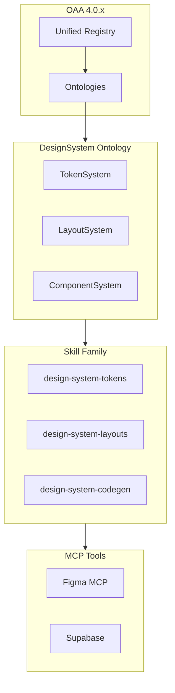
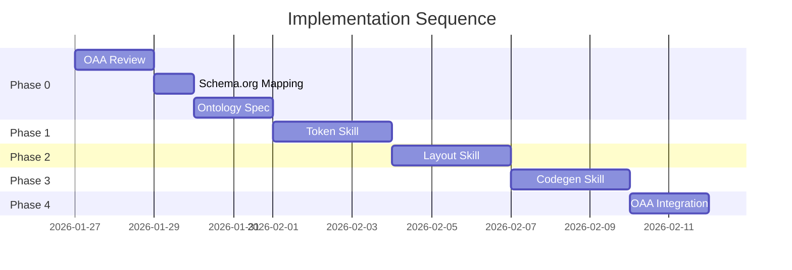

# BAIV Design System Skills: OAA Integration Plan

## Objective

Integrate BAIV Design System into OAA Ontology Architecture as a skill family, enabling token extraction, layout management, and code generation within the unified registry framework.

---

## Architecture



---

## Phases

### Phase 0: Alignment
| Task | Output |
|------|--------|
| Review OAA 4.0.0 + pfc-vsom-vsem | Gap analysis |
| Map DesignSystem to Schema.org | Type mappings |
| Define registry entry structure | JSON-LD template |
| Specify 4.0.2 agent requirements | Interface contract |

**Deliverable**: `design-system-ontology-spec.md`

### Phase 1: Token Skill
| Task | Output |
|------|--------|
| SKILL.md with extraction workflow | Skill definition |
| Schema validation functions | TypeScript types |
| Supabase storage patterns | SQL + Edge Function |
| MCP integration patterns | Tool definitions |

**Deliverable**: `/mnt/skills/user/design-system-tokens/SKILL.md`

### Phase 2: Layout Skill
| Task | Output |
|------|--------|
| Layout spec schema | TypeScript interface |
| Figma node extraction | MCP patterns |
| Token reference validation | Resolution rules |
| Version linking | FK to design_system |

**Deliverable**: `/mnt/skills/user/design-system-layouts/SKILL.md`

### Phase 3: Codegen Skill
| Task | Output |
|------|--------|
| CSS variable generator | Template |
| Tailwind config generator | Template |
| React hook generator | Template |
| Component shell generator | Template |

**Deliverable**: `/mnt/skills/user/design-system-codegen/SKILL.md`

### Phase 4: OAA Integration
| Task | Output |
|------|--------|
| Register in Unified Registry | Registry entry |
| Agent tool definitions | MCP server config |
| Cross-domain queries | SPARQL/query patterns |
| 4.0.2 system prompt updates | Prompt additions |

**Deliverable**: OAA 4.0.2 PR with design system support

---

## Schema.org Alignment

| Design System Concept | Schema.org Type | Notes |
|-----------------------|-----------------|-------|
| DesignSystem | `DigitalDocument` | Container for all tokens |
| TokenCollection | `DefinedTermSet` | Primitives, Semantics, Components |
| Token | `DefinedTerm` | Individual token with value |
| Layout | `WebPageElement` | Page structure spec |
| Component | `SoftwareSourceCode` | Generated component |

---

## Skill Interface Contract

Each skill implements:

```typescript
interface DesignSystemSkill {
  // Metadata
  name: string;
  version: string;
  domain: 'design-system';
  
  // OAA Registry
  registryId: string;
  ontologyRef: string;
  
  // Capabilities
  capabilities: {
    extract?: boolean;   // Can pull from Figma
    validate?: boolean;  // Can validate schema
    store?: boolean;     // Can persist to DB
    generate?: boolean;  // Can output code
  };
  
  // Tool definitions for agent
  tools: ToolDefinition[];
}
```

---

## File Structure

```
/mnt/skills/user/
├── design-system-tokens/
│   ├── SKILL.md
│   ├── schemas/
│   │   ├── primitives.ts
│   │   ├── semantics.ts
│   │   └── components.ts
│   └── templates/
│       └── extraction.md
├── design-system-layouts/
│   ├── SKILL.md
│   ├── schemas/
│   │   └── layout-spec.ts
│   └── templates/
│       └── figma-make-prompt.md
└── design-system-codegen/
    ├── SKILL.md
    └── templates/
        ├── css-variables.hbs
        ├── tailwind-config.hbs
        └── react-hooks.hbs
```

---

## Implementation Order



---

## Success Criteria

- [ ] DesignSystem ontology registered in OAA
- [ ] Token skill extracts from Figma via MCP
- [ ] Layout skill validates token references
- [ ] Codegen skill outputs CSS/Tailwind/React
- [ ] Agent can invoke skills via tool calls
- [ ] Cross-domain queries work (VSOM → DesignSystem)

---

## Next Action

Review in Claude Code:
1. Load OAA 4.0.0 system prompt
2. Load pfc-vsom-vsem SKILL.md
3. Identify integration patterns
4. Draft design-system-ontology-spec.md

---

*Plan Version: 1.0.0*
*For: Claude Code Implementation*
