# BAIV Production Architecture

## Complete Design-to-Deployment Platform Guide

This document consolidates the entire BAIV platform architecture from Figma design system through to production deployment with agentic capabilities. It serves as the single source of truth for implementation.

---

## Document Structure

```
1. Executive Summary & Architecture Overview
2. Design System Layer (Figma → Tokens)
3. Database Layer (Supabase + JSONB)
4. API Layer (tRPC + Edge Functions)
5. Agent Layer (Claude SDK + Tools)
6. UI Layer (Next.js + Shadcn)
7. Deployment & DevOps
8. Implementation Roadmap
9. Appendices (Schemas, Types, Checklists)
```

---

# Part 1: Executive Summary

## 1.1 Platform Vision

BAIV (Be AI Visible) is an AI-driven visibility and discovery platform that transforms Figma designs into production applications with embedded agentic capabilities. The architecture prioritizes:

- **Design System Fidelity** - Strict token compliance from Figma to production
- **Agentic Interaction** - Natural language interface for user actions
- **Rapid Development** - 70-90% reduction in component development time
- **Flexibility** - Database abstraction for future provider changes

## 1.2 Technology Stack

| Layer | Technology | Purpose |
|-------|------------|---------|
| Design | Figma + MCP | Design system source, token extraction |
| Database | Supabase (PostgreSQL + pgvector) | Data persistence, vector search, auth |
| API | tRPC + Edge Functions | Type-safe API, serverless compute |
| Agent | Claude SDK + Anthropic API | Conversational AI, tool orchestration |
| Frontend | Next.js 14 + Shadcn/ui | React framework, component library |
| Deployment | Vercel + Supabase Cloud | Hosting, edge network |

## 1.3 Complete System Architecture


## 1.4 Data Flow Sequence


---

# Part 2: Design System Layer

## 2.1 Token Architecture

The BAIV design system follows a three-tier token cascade ensuring no arbitrary values reach production.

```mermaid
flowchart LR
    subgraph TIER1["Tier 1: Primitives"]
        direction TB
        C_TEAL["Teal Scale<br/>#e2f7ff → #00161c"]
        C_ORANGE["Orange Scale<br/>#feedeb → #280901"]
        C_LAVENDER["Lavender Scale<br/>#f0e7fe → #150026"]
        C_GREEN["Green Scale<br/>#c5fff5 → #001512"]
        C_PINK["Pink Scale<br/>#ffe9f0 → #220112"]
        C_BLUE["Blue Scale<br/>#eaeefb → #060f1d"]
        C_YELLOW["Yellow Scale<br/>#fffad1 → #181707"]
        C_NEUTRAL["Neutral Scale<br/>#e9f3f3 → #101212"]
    end

    subgraph TIER2["Tier 2: Semantics"]
        direction TB
        S_PRIMARY["primary.*<br/>surface/border/text"]
        S_SECONDARY["secondary.*<br/>surface/border/text"]
        S_SUCCESS["success.*<br/>surface/border/text"]
        S_ERROR["error.*<br/>surface/border/text"]
        S_WARNING["warning.*<br/>surface/border/text"]
        S_INFO["information.*<br/>surface/border/text"]
        S_NEUTRAL["neutral.*<br/>surface/border/text"]
    end

    subgraph TIER3["Tier 3: Components"]
        direction TB
        BTN["button.*<br/>primary/secondary/ghost"]
        CARD["card.*<br/>default/elevated/feature"]
        INPUT["input.*<br/>default/focus/error"]
        ALERT["alert.*<br/>error/warning/success/info"]
        BADGE["badge.*<br/>primary/secondary/outline"]
    end

    C_TEAL --> S_PRIMARY
    C_ORANGE --> S_SECONDARY
    C_GREEN --> S_SUCCESS
    C_PINK --> S_ERROR
    C_YELLOW --> S_WARNING
    C_BLUE --> S_INFO
    C_NEUTRAL --> S_NEUTRAL

    S_PRIMARY --> BTN
    S_NEUTRAL --> CARD
    S_PRIMARY --> INPUT
    S_ERROR --> ALERT

    style TIER1 fill:#e2f7ff,stroke:#00a4bf,stroke-width:2px
    style TIER2 fill:#feedeb,stroke:#e84e1c,stroke-width:2px
    style TIER3 fill:#c5fff5,stroke:#019587,stroke-width:2px
```



## 2.2 Token Resolution Rules


## 2.3 Figma to Database Flow


## 2.4 Token Quick Reference

### Colors by Intent

| Intent | Surface Default | Border Default | Text Label | Source |
|--------|-----------------|----------------|------------|--------|
| **primary** | `#00a4bf` | `#00a4bf` | `#003d48` | Teal |
| **secondary** | `#fc998b` | `#e84e1c` | `#631c06` | Orange |
| **accent** | `#6f0eb0` | `#6f0eb0` | `#360458` | Lavender |
| **success** | `#019587` | `#019587` | `#003c36` | Green |
| **warning** | `#cec528` | `#cec528` | `#454213` | Yellow |
| **error** | `#cf057d` | `#cf057d` | `#54052d` | Pink |
| **information** | `#3b6fcc` | `#3b6fcc` | `#0f284d` | Blue |
| **neutral** | `#d9ebeb` | `#d9ebeb` | `#303535` | Neutral |

### Typography

| Style | Font | Size | Line Height | Weight |
|-------|------|------|-------------|--------|
| H1 | Titillium Web | 40px | 1.2 | 700 |
| H2 | Titillium Web | 36px | 1.2 | 700 |
| H3 | Titillium Web | 32px | 1.2 | 700 |
| H4 | Titillium Web | 28px | 1.2 | 700 |
| H5 | Titillium Web | 24px | 1.3 | 600 |
| H6 | Titillium Web | 20px | 1.3 | 600 |
| Body Large | Open Sans | 18px | 1.4 | 400 |
| Body Base | Open Sans | 16px | 1.4 | 400 |
| Body Small | Open Sans | 14px | 1.4 | 400 |

### Spacing Scale

| Token | Value | Use Case |
|-------|-------|----------|
| `3xs` | 2px | Micro adjustments |
| `2xs` | 4px | Icon gaps |
| `xs` | 6px | Tight spacing |
| `s` | 8px | Component internal |
| `m` | 12px | Component padding |
| `l` | 16px | Section gaps |
| `xl` | 20px | Card padding |
| `2xl` | 24px | Section padding |
| `3xl` | 32px | Page margins |
| `4xl` | 40px | Major sections |

### Border Radius

| Token | Value | Use Case |
|-------|-------|----------|
| `sml` | 8px | Buttons, Inputs |
| `med` | 12px | Cards, Containers |
| `lrg` | 20px | Large cards |
| `full` | 999px | Badges, Pills |

---

# Part 3: Database Layer

## 3.1 JSONB Storage Strategy

For MVP speed and ontology flexibility, we use JSONB columns instead of fully normalized tables.

```mermaid
flowchart TB
    subgraph NORMALIZED["❌ Normalized (Complex)"]
        direction TB
        N1["colors table"]
        N2["color_values table"]
        N3["semantic_mappings table"]
        N4["component_tokens table"]
        N5["typography table"]
        N6["spacing table"]
        
        N1 --> N2
        N2 --> N3
        N3 --> N4
    end

    subgraph JSONB["✅ JSONB (MVP)"]
        direction TB
        J1["design_system table"]
        J2["primitives: JSONB"]
        J3["semantics: JSONB"]
        J4["components: JSONB"]
        
        J1 --> J2
        J1 --> J3
        J1 --> J4
    end

    NORMALIZED -.->|"Migrate later<br/>if needed"| JSONB

    style NORMALIZED fill:#ffe9f0,stroke:#cf057d
    style JSONB fill:#c5fff5,stroke:#019587
```



**Trade-offs Accepted:**
- ✅ Faster development (no migrations for schema changes)
- ✅ Flexible ontology evolution
- ✅ Single query for complete documents
- ⚠️ Less query optimization (acceptable at MVP scale)

## 3.2 Entity Relationship Diagram


## 3.3 Core Tables Schema

```sql
-- ============================================
-- BAIV MVP Schema (10 Core Tables)
-- ============================================

-- Extensions
CREATE EXTENSION IF NOT EXISTS "uuid-ossp";
CREATE EXTENSION IF NOT EXISTS "vector";

-- 1. DESIGN SYSTEM (Complete ontology as JSONB)
CREATE TABLE design_system (
    id UUID PRIMARY KEY DEFAULT uuid_generate_v4(),
    version TEXT NOT NULL,
    primitives JSONB NOT NULL DEFAULT '{}',
    semantics JSONB NOT NULL DEFAULT '{}',
    components JSONB NOT NULL DEFAULT '{}',
    typography JSONB NOT NULL DEFAULT '{}',
    spacing JSONB NOT NULL DEFAULT '{}',
    figma_file_key TEXT,
    is_active BOOLEAN DEFAULT false,
    created_at TIMESTAMPTZ DEFAULT NOW(),
    updated_at TIMESTAMPTZ DEFAULT NOW()
);

-- 2. LAYOUTS (Page specifications)
CREATE TABLE layouts (
    id UUID PRIMARY KEY DEFAULT uuid_generate_v4(),
    slug TEXT NOT NULL UNIQUE,
    name TEXT NOT NULL,
    spec JSONB NOT NULL DEFAULT '{}',
    figma_file_key TEXT,
    figma_node_id TEXT,
    version TEXT DEFAULT '1.0.0',
    status TEXT DEFAULT 'draft' 
        CHECK (status IN ('draft', 'review', 'approved', 'locked', 'archived')),
    locked_at TIMESTAMPTZ,
    locked_by UUID,
    created_at TIMESTAMPTZ DEFAULT NOW(),
    updated_at TIMESTAMPTZ DEFAULT NOW()
);

-- 3. CONTENT (CMS data)
CREATE TABLE content (
    id UUID PRIMARY KEY DEFAULT uuid_generate_v4(),
    layout_id UUID REFERENCES layouts(id),
    page_slug TEXT NOT NULL,
    locale TEXT DEFAULT 'en',
    data JSONB NOT NULL DEFAULT '{}',
    meta JSONB DEFAULT '{}',
    version INTEGER DEFAULT 1,
    status TEXT DEFAULT 'draft' 
        CHECK (status IN ('draft', 'published', 'archived')),
    created_at TIMESTAMPTZ DEFAULT NOW(),
    updated_at TIMESTAMPTZ DEFAULT NOW(),
    published_at TIMESTAMPTZ,
    UNIQUE(page_slug, locale, version)
);

-- 4. PROFILES (Extended auth.users)
CREATE TABLE profiles (
    id UUID PRIMARY KEY REFERENCES auth.users(id) ON DELETE CASCADE,
    email TEXT,
    full_name TEXT,
    avatar_url TEXT,
    preferences JSONB DEFAULT '{"theme": "light"}',
    subscription_tier TEXT DEFAULT 'free',
    subscription_data JSONB DEFAULT '{}',
    metadata JSONB DEFAULT '{}',
    created_at TIMESTAMPTZ DEFAULT NOW(),
    updated_at TIMESTAMPTZ DEFAULT NOW()
);

-- 5. CONVERSATIONS
CREATE TABLE conversations (
    id UUID PRIMARY KEY DEFAULT uuid_generate_v4(),
    user_id UUID NOT NULL REFERENCES auth.users(id) ON DELETE CASCADE,
    title TEXT,
    status TEXT DEFAULT 'active' 
        CHECK (status IN ('active', 'completed', 'archived')),
    context JSONB DEFAULT '{}',
    last_message_preview TEXT,
    message_count INTEGER DEFAULT 0,
    created_at TIMESTAMPTZ DEFAULT NOW(),
    updated_at TIMESTAMPTZ DEFAULT NOW()
);

-- 6. MESSAGES
CREATE TABLE messages (
    id UUID PRIMARY KEY DEFAULT uuid_generate_v4(),
    conversation_id UUID NOT NULL REFERENCES conversations(id) ON DELETE CASCADE,
    role TEXT NOT NULL CHECK (role IN ('user', 'assistant', 'system', 'tool')),
    content TEXT,
    tool_calls JSONB,
    tool_call_id TEXT,
    metadata JSONB DEFAULT '{}',
    created_at TIMESTAMPTZ DEFAULT NOW()
);

-- 7. TOOL INVOCATIONS (Audit log)
CREATE TABLE tool_invocations (
    id UUID PRIMARY KEY DEFAULT uuid_generate_v4(),
    conversation_id UUID REFERENCES conversations(id) ON DELETE CASCADE,
    message_id UUID REFERENCES messages(id),
    user_id UUID REFERENCES auth.users(id),
    tool_name TEXT NOT NULL,
    input JSONB NOT NULL,
    output JSONB,
    status TEXT DEFAULT 'pending' 
        CHECK (status IN ('pending', 'running', 'success', 'error')),
    duration_ms INTEGER,
    created_at TIMESTAMPTZ DEFAULT NOW()
);

-- 8. CONVERSATION MEMORY (Vector embeddings)
CREATE TABLE conversation_memory (
    id UUID PRIMARY KEY DEFAULT uuid_generate_v4(),
    user_id UUID NOT NULL REFERENCES auth.users(id) ON DELETE CASCADE,
    conversation_id UUID REFERENCES conversations(id) ON DELETE CASCADE,
    content TEXT NOT NULL,
    embedding vector(1536),
    metadata JSONB DEFAULT '{}',
    created_at TIMESTAMPTZ DEFAULT NOW()
);

-- 9. PROMPT TEMPLATES
CREATE TABLE prompt_templates (
    id UUID PRIMARY KEY DEFAULT uuid_generate_v4(),
    slug TEXT NOT NULL UNIQUE,
    name TEXT NOT NULL,
    template TEXT NOT NULL,
    parent_slug TEXT REFERENCES prompt_templates(slug),
    variables JSONB DEFAULT '[]',
    version TEXT DEFAULT '1.0.0',
    is_active BOOLEAN DEFAULT true,
    created_at TIMESTAMPTZ DEFAULT NOW(),
    updated_at TIMESTAMPTZ DEFAULT NOW()
);

-- 10. ACTIVITY LOG
CREATE TABLE activity_log (
    id UUID PRIMARY KEY DEFAULT uuid_generate_v4(),
    user_id UUID REFERENCES auth.users(id),
    action TEXT NOT NULL,
    resource_type TEXT,
    resource_id UUID,
    data JSONB DEFAULT '{}',
    created_at TIMESTAMPTZ DEFAULT NOW()
);

-- ============================================
-- INDEXES
-- ============================================
CREATE INDEX idx_design_system_active ON design_system(is_active) WHERE is_active = true;
CREATE INDEX idx_layouts_slug ON layouts(slug);
CREATE INDEX idx_layouts_status ON layouts(status);
CREATE INDEX idx_content_page ON content(page_slug, locale);
CREATE INDEX idx_conversations_user ON conversations(user_id, updated_at DESC);
CREATE INDEX idx_messages_conversation ON messages(conversation_id, created_at);
CREATE INDEX idx_memory_embedding ON conversation_memory 
    USING ivfflat (embedding vector_cosine_ops) WITH (lists = 100);
CREATE INDEX idx_memory_user ON conversation_memory(user_id);

-- ============================================
-- FUNCTIONS
-- ============================================

-- Vector search for memory
CREATE OR REPLACE FUNCTION search_memory(
    p_user_id UUID,
    p_embedding vector(1536),
    p_limit INTEGER DEFAULT 5,
    p_threshold FLOAT DEFAULT 0.7
)
RETURNS TABLE (
    id UUID,
    content TEXT,
    conversation_id UUID,
    similarity FLOAT,
    metadata JSONB
) AS $$
BEGIN
    RETURN QUERY
    SELECT 
        cm.id,
        cm.content,
        cm.conversation_id,
        1 - (cm.embedding <=> p_embedding) as similarity,
        cm.metadata
    FROM conversation_memory cm
    WHERE cm.user_id = p_user_id
    AND 1 - (cm.embedding <=> p_embedding) > p_threshold
    ORDER BY cm.embedding <=> p_embedding
    LIMIT p_limit;
END;
$$ LANGUAGE plpgsql SECURITY DEFINER;

-- Auto-update conversation summary
CREATE OR REPLACE FUNCTION update_conversation_summary()
RETURNS TRIGGER AS $$
BEGIN
    UPDATE conversations
    SET 
        last_message_preview = LEFT(NEW.content, 100),
        message_count = message_count + 1,
        updated_at = NOW()
    WHERE id = NEW.conversation_id;
    RETURN NEW;
END;
$$ LANGUAGE plpgsql SECURITY DEFINER;

CREATE TRIGGER on_message_created
AFTER INSERT ON messages
FOR EACH ROW
WHEN (NEW.role IN ('user', 'assistant'))
EXECUTE FUNCTION update_conversation_summary();

-- Auto-create profile on signup
CREATE OR REPLACE FUNCTION handle_new_user()
RETURNS TRIGGER AS $$
BEGIN
    INSERT INTO profiles (id, email, full_name)
    VALUES (NEW.id, NEW.email, NEW.raw_user_meta_data->>'full_name');
    RETURN NEW;
END;
$$ LANGUAGE plpgsql SECURITY DEFINER;

CREATE TRIGGER on_auth_user_created
AFTER INSERT ON auth.users
FOR EACH ROW EXECUTE FUNCTION handle_new_user();
```

## 3.4 Row Level Security


```sql
-- ============================================
-- ROW LEVEL SECURITY POLICIES
-- ============================================

-- Enable RLS
ALTER TABLE profiles ENABLE ROW LEVEL SECURITY;
ALTER TABLE conversations ENABLE ROW LEVEL SECURITY;
ALTER TABLE messages ENABLE ROW LEVEL SECURITY;
ALTER TABLE tool_invocations ENABLE ROW LEVEL SECURITY;
ALTER TABLE conversation_memory ENABLE ROW LEVEL SECURITY;
ALTER TABLE content ENABLE ROW LEVEL SECURITY;
ALTER TABLE layouts ENABLE ROW LEVEL SECURITY;
ALTER TABLE design_system ENABLE ROW LEVEL SECURITY;

-- PROFILES: Own data only
CREATE POLICY "profiles_select_own" ON profiles 
    FOR SELECT USING (auth.uid() = id);
CREATE POLICY "profiles_update_own" ON profiles 
    FOR UPDATE USING (auth.uid() = id);

-- CONVERSATIONS: Own data only
CREATE POLICY "conversations_all_own" ON conversations 
    FOR ALL USING (auth.uid() = user_id);

-- MESSAGES: Own conversations only
CREATE POLICY "messages_all_own" ON messages 
    FOR ALL USING (
        conversation_id IN (
            SELECT id FROM conversations WHERE user_id = auth.uid()
        )
    );

-- CONVERSATION MEMORY: Own data only
CREATE POLICY "memory_select_own" ON conversation_memory 
    FOR SELECT USING (user_id = auth.uid());

-- CONTENT: Public read published, admin write
CREATE POLICY "content_read_published" ON content 
    FOR SELECT USING (status = 'published');
CREATE POLICY "content_admin_all" ON content 
    FOR ALL USING (
        EXISTS (
            SELECT 1 FROM profiles 
            WHERE id = auth.uid() 
            AND (metadata->>'role')::text = 'admin'
        )
    );

-- LAYOUTS: Public read approved/locked, admin write
CREATE POLICY "layouts_read_approved" ON layouts 
    FOR SELECT USING (status IN ('approved', 'locked'));
CREATE POLICY "layouts_admin_all" ON layouts 
    FOR ALL USING (
        EXISTS (
            SELECT 1 FROM profiles 
            WHERE id = auth.uid() 
            AND (metadata->>'role')::text = 'admin'
        )
    );

-- DESIGN SYSTEM: Public read active, admin write
CREATE POLICY "design_system_read_active" ON design_system 
    FOR SELECT USING (is_active = true);
CREATE POLICY "design_system_admin_all" ON design_system 
    FOR ALL USING (
        EXISTS (
            SELECT 1 FROM profiles 
            WHERE id = auth.uid() 
            AND (metadata->>'role')::text = 'admin'
        )
    );
```

---

# Part 4: API Layer

## 4.1 API Architecture


## 4.2 tRPC Router Structure

```typescript
// src/server/routers/_app.ts
import { router } from '../trpc';
import { contentRouter } from './content';
import { userRouter } from './user';
import { agentRouter } from './agent';
import { designRouter } from './design';

export const appRouter = router({
  content: contentRouter,
  user: userRouter,
  agent: agentRouter,
  design: designRouter,
});

export type AppRouter = typeof appRouter;
```

## 4.3 Agent Router Implementation

```typescript
// src/server/routers/agent.ts
import { z } from 'zod';
import { router, protectedProcedure } from '../trpc';

export const agentRouter = router({
  // Create conversation
  createConversation: protectedProcedure
    .input(z.object({
      title: z.string().optional(),
      context: z.record(z.any()).optional(),
    }))
    .mutation(async ({ ctx, input }) => {
      const { data, error } = await ctx.supabase
        .from('conversations')
        .insert({
          user_id: ctx.user.id,
          title: input.title,
          context: input.context || {},
        })
        .select()
        .single();
      
      if (error) throw error;
      return data;
    }),

  // Send message (calls Edge Function)
  sendMessage: protectedProcedure
    .input(z.object({
      conversationId: z.string().uuid(),
      content: z.string(),
    }))
    .mutation(async ({ ctx, input }) => {
      const response = await fetch(
        `${process.env.SUPABASE_URL}/functions/v1/agent-process`,
        {
          method: 'POST',
          headers: {
            'Authorization': `Bearer ${ctx.session.access_token}`,
            'Content-Type': 'application/json',
          },
          body: JSON.stringify({
            conversationId: input.conversationId,
            message: input.content,
          }),
        }
      );

      if (!response.ok) {
        throw new Error('Agent processing failed');
      }

      return response.json();
    }),

  // Get conversation with messages
  getConversation: protectedProcedure
    .input(z.object({
      conversationId: z.string().uuid(),
    }))
    .query(async ({ ctx, input }) => {
      const { data, error } = await ctx.supabase
        .from('conversations')
        .select(`
          *,
          messages (*)
        `)
        .eq('id', input.conversationId)
        .eq('user_id', ctx.user.id)
        .single();

      if (error) throw error;
      return data;
    }),

  // List conversations
  listConversations: protectedProcedure
    .input(z.object({
      limit: z.number().default(20),
    }))
    .query(async ({ ctx, input }) => {
      const { data, error } = await ctx.supabase
        .from('conversations')
        .select('*')
        .eq('user_id', ctx.user.id)
        .order('updated_at', { ascending: false })
        .limit(input.limit);

      if (error) throw error;
      return data;
    }),

  // Search memory
  searchMemory: protectedProcedure
    .input(z.object({
      query: z.string(),
      limit: z.number().default(5),
    }))
    .query(async ({ ctx, input }) => {
      // Generate embedding
      const embeddingResponse = await fetch('https://api.openai.com/v1/embeddings', {
        method: 'POST',
        headers: {
          'Authorization': `Bearer ${process.env.OPENAI_API_KEY}`,
          'Content-Type': 'application/json',
        },
        body: JSON.stringify({
          model: 'text-embedding-ada-002',
          input: input.query,
        }),
      });
      
      const { data: embeddingData } = await embeddingResponse.json();
      const embedding = embeddingData[0].embedding;

      // Search
      const { data, error } = await ctx.supabase.rpc('search_memory', {
        p_user_id: ctx.user.id,
        p_embedding: embedding,
        p_limit: input.limit,
      });

      if (error) throw error;
      return data;
    }),
});
```

---

# Part 5: Agent Layer

## 5.1 Agent Orchestration Flow


## 5.2 Tool Definitions


## 5.3 Edge Function Implementation

```typescript
// supabase/functions/agent-process/index.ts
import { serve } from 'https://deno.land/std@0.168.0/http/server.ts';
import { createClient } from 'https://esm.sh/@supabase/supabase-js@2';
import Anthropic from 'https://esm.sh/@anthropic-ai/sdk';

const corsHeaders = {
  'Access-Control-Allow-Origin': '*',
  'Access-Control-Allow-Headers': 'authorization, x-client-info, apikey, content-type',
};

serve(async (req) => {
  if (req.method === 'OPTIONS') {
    return new Response('ok', { headers: corsHeaders });
  }

  try {
    const { conversationId, message } = await req.json();

    // Initialize clients
    const supabase = createClient(
      Deno.env.get('SUPABASE_URL')!,
      Deno.env.get('SUPABASE_SERVICE_ROLE_KEY')!
    );
    
    const anthropic = new Anthropic({
      apiKey: Deno.env.get('ANTHROPIC_API_KEY')!,
    });

    // Authenticate user
    const authHeader = req.headers.get('Authorization')!;
    const { data: { user } } = await supabase.auth.getUser(
      authHeader.replace('Bearer ', '')
    );
    
    if (!user) throw new Error('Unauthorized');

    // Store user message
    await supabase.from('messages').insert({
      conversation_id: conversationId,
      role: 'user',
      content: message,
    });

    // Load context
    const [
      { data: conversation },
      { data: messages },
      { data: profile },
    ] = await Promise.all([
      supabase.from('conversations').select('*').eq('id', conversationId).single(),
      supabase.from('messages').select('*').eq('conversation_id', conversationId).order('created_at'),
      supabase.from('profiles').select('*').eq('id', user.id).single(),
    ]);

    // Search memory
    let memory: any[] = [];
    try {
      const embedding = await generateEmbedding(message);
      const { data } = await supabase.rpc('search_memory', {
        p_user_id: user.id,
        p_embedding: embedding,
        p_limit: 5,
      });
      memory = data || [];
    } catch (e) {
      console.error('Memory search failed:', e);
    }

    // Build system prompt
    const systemPrompt = buildSystemPrompt(profile, conversation?.context, memory);

    // Define tools
    const tools = [
      {
        name: 'get_content',
        description: 'Get content for a page',
        input_schema: {
          type: 'object',
          properties: {
            page_slug: { type: 'string' },
          },
          required: ['page_slug'],
        },
      },
      {
        name: 'update_content',
        description: 'Update content for a page section',
        input_schema: {
          type: 'object',
          properties: {
            page_slug: { type: 'string' },
            section: { type: 'string' },
            data: { type: 'object' },
          },
          required: ['page_slug', 'section', 'data'],
        },
      },
      {
        name: 'navigate',
        description: 'Navigate user to a page',
        input_schema: {
          type: 'object',
          properties: {
            path: { type: 'string' },
          },
          required: ['path'],
        },
      },
      {
        name: 'get_user_data',
        description: 'Get user profile, preferences, or subscription',
        input_schema: {
          type: 'object',
          properties: {
            type: { type: 'string', enum: ['profile', 'preferences', 'subscription'] },
          },
          required: ['type'],
        },
      },
    ];

    // Call Claude
    let response = await anthropic.messages.create({
      model: 'claude-sonnet-4-20250514',
      max_tokens: 4096,
      system: systemPrompt,
      messages: messages?.map((m: any) => ({
        role: m.role === 'tool' ? 'user' : m.role,
        content: m.content,
      })) || [],
      tools,
    });

    // Handle tool calls
    while (response.stop_reason === 'tool_use') {
      const toolResults = [];
      
      for (const block of response.content) {
        if (block.type === 'tool_use') {
          const result = await executeToolCall(supabase, user.id, block.name, block.input);
          
          await supabase.from('tool_invocations').insert({
            conversation_id: conversationId,
            user_id: user.id,
            tool_name: block.name,
            input: block.input,
            output: result,
            status: result.error ? 'error' : 'success',
          });

          toolResults.push({
            type: 'tool_result',
            tool_use_id: block.id,
            content: JSON.stringify(result),
          });
        }
      }

      response = await anthropic.messages.create({
        model: 'claude-sonnet-4-20250514',
        max_tokens: 4096,
        system: systemPrompt,
        messages: [
          ...(messages?.map((m: any) => ({ role: m.role, content: m.content })) || []),
          { role: 'assistant', content: response.content },
          { role: 'user', content: toolResults },
        ],
        tools,
      });
    }

    // Extract and store response
    const textContent = response.content
      .filter((b: any) => b.type === 'text')
      .map((b: any) => b.text)
      .join('');

    const { data: assistantMessage } = await supabase
      .from('messages')
      .insert({
        conversation_id: conversationId,
        role: 'assistant',
        content: textContent,
        tool_calls: response.content.filter((b: any) => b.type === 'tool_use'),
      })
      .select()
      .single();

    // Update memory asynchronously
    EdgeRuntime.waitUntil(updateMemory(supabase, user.id, conversationId, message, textContent));

    return new Response(
      JSON.stringify(assistantMessage),
      { headers: { ...corsHeaders, 'Content-Type': 'application/json' } }
    );

  } catch (error) {
    console.error('Error:', error);
    return new Response(
      JSON.stringify({ error: error.message }),
      { status: 500, headers: { ...corsHeaders, 'Content-Type': 'application/json' } }
    );
  }
});

function buildSystemPrompt(profile: any, context: any, memory: any[]): string {
  return `You are an AI assistant for the BAIV platform.

## User
- Name: ${profile?.full_name || 'User'}
- Tier: ${profile?.subscription_tier || 'free'}

## Context
${context ? JSON.stringify(context) : 'No specific context'}

## Relevant Memory
${memory.length > 0 
  ? memory.map(m => `- ${m.content}`).join('\n')
  : 'No relevant previous context'}

## Guidelines
1. Be helpful and concise
2. Use tools when needed
3. Confirm before destructive actions`;
}

async function generateEmbedding(text: string): Promise<number[]> {
  const response = await fetch('https://api.openai.com/v1/embeddings', {
    method: 'POST',
    headers: {
      'Authorization': `Bearer ${Deno.env.get('OPENAI_API_KEY')}`,
      'Content-Type': 'application/json',
    },
    body: JSON.stringify({
      model: 'text-embedding-ada-002',
      input: text,
    }),
  });
  const data = await response.json();
  return data.data[0].embedding;
}

async function executeToolCall(supabase: any, userId: string, toolName: string, input: any) {
  switch (toolName) {
    case 'get_content': {
      const { data } = await supabase
        .from('content')
        .select('data')
        .eq('page_slug', input.page_slug)
        .eq('status', 'published')
        .single();
      return data?.data || { error: 'Not found' };
    }

    case 'update_content': {
      const { data: existing } = await supabase
        .from('content')
        .select('data')
        .eq('page_slug', input.page_slug)
        .single();

      await supabase
        .from('content')
        .update({ 
          data: { ...existing?.data, [input.section]: input.data },
          updated_at: new Date().toISOString(),
        })
        .eq('page_slug', input.page_slug);

      return { success: true };
    }

    case 'navigate': {
      return { action: 'navigate', path: input.path, executeOnClient: true };
    }

    case 'get_user_data': {
      const { data } = await supabase
        .from('profiles')
        .select('*')
        .eq('id', userId)
        .single();

      if (input.type === 'profile') {
        return { full_name: data.full_name, email: data.email };
      } else if (input.type === 'preferences') {
        return data.preferences;
      } else if (input.type === 'subscription') {
        return { tier: data.subscription_tier, ...data.subscription_data };
      }
      return { error: 'Invalid type' };
    }

    default:
      return { error: `Unknown tool: ${toolName}` };
  }
}

async function updateMemory(
  supabase: any, 
  userId: string, 
  conversationId: string, 
  userMessage: string, 
  assistantResponse: string
) {
  try {
    const content = `User: ${userMessage}\nAssistant: ${assistantResponse}`;
    const embedding = await generateEmbedding(content);

    await supabase.from('conversation_memory').insert({
      user_id: userId,
      conversation_id: conversationId,
      content,
      embedding,
      metadata: { timestamp: new Date().toISOString() },
    });
  } catch (e) {
    console.error('Memory update failed:', e);
  }
}
```

---

# Part 6: UI Layer

## 6.1 Component Architecture


## 6.2 Agent Chat Component

```tsx
// src/components/agent/AgentChat.tsx
'use client';

import { useState, useRef, useEffect } from 'react';
import { trpc } from '@/lib/trpc';
import { cn } from '@/lib/utils';
import { Button } from '@/components/ui/button';
import { Input } from '@/components/ui/input';
import { ScrollArea } from '@/components/ui/scroll-area';
import { Avatar } from '@/components/ui/avatar';
import { Loader2, Send, Sparkles, User } from 'lucide-react';

interface AgentChatProps {
  conversationId?: string;
  layoutContext?: {
    currentPage: string;
    availableActions: string[];
  };
  onAction?: (action: string, params: any) => void;
}

export function AgentChat({ conversationId: initialId, layoutContext, onAction }: AgentChatProps) {
  const [messages, setMessages] = useState<any[]>([]);
  const [input, setInput] = useState('');
  const [isLoading, setIsLoading] = useState(false);
  const [conversationId, setConversationId] = useState(initialId);
  const scrollRef = useRef<HTMLDivElement>(null);

  const createConversation = trpc.agent.createConversation.useMutation();
  const sendMessage = trpc.agent.sendMessage.useMutation();

  const { data: conversation } = trpc.agent.getConversation.useQuery(
    { conversationId: conversationId! },
    { enabled: !!conversationId }
  );

  useEffect(() => {
    if (conversation?.messages) setMessages(conversation.messages);
  }, [conversation]);

  useEffect(() => {
    scrollRef.current?.scrollIntoView({ behavior: 'smooth' });
  }, [messages]);

  const handleSubmit = async (e: React.FormEvent) => {
    e.preventDefault();
    if (!input.trim() || isLoading) return;

    const userMessage = input.trim();
    setInput('');
    setIsLoading(true);

    // Optimistic update
    setMessages(prev => [...prev, { 
      id: `temp-${Date.now()}`, 
      role: 'user', 
      content: userMessage 
    }]);

    try {
      let currentConversationId = conversationId;
      if (!currentConversationId) {
        const newConv = await createConversation.mutateAsync({ context: layoutContext });
        currentConversationId = newConv.id;
        setConversationId(currentConversationId);
      }

      const response = await sendMessage.mutateAsync({
        conversationId: currentConversationId,
        content: userMessage,
      });

      setMessages(prev => [...prev.filter(m => !m.id.startsWith('temp-')), response]);

      // Handle client-side actions
      if (response.tool_calls) {
        for (const tc of response.tool_calls) {
          try {
            const output = JSON.parse(tc.content || '{}');
            if (output.executeOnClient && onAction) {
              onAction(output.action, output);
            }
          } catch {}
        }
      }
    } catch (error) {
      console.error('Error:', error);
      setMessages(prev => prev.filter(m => !m.id.startsWith('temp-')));
    } finally {
      setIsLoading(false);
    }
  };

  return (
    <div className="flex flex-col h-full bg-[#e9f3f3] rounded-[12px] border border-[#d9ebeb]">
      {/* Header */}
      <div className="flex items-center gap-3 p-4 border-b border-[#d9ebeb]">
        <div className="w-10 h-10 rounded-full bg-[#00a4bf] flex items-center justify-center">
          <Sparkles className="w-5 h-5 text-white" />
        </div>
        <div>
          <h3 className="font-semibold text-[#1c1f1f]" style={{ fontFamily: 'Titillium Web' }}>
            BAIV Assistant
          </h3>
          <p className="text-sm text-[#636e6e]">Ask me anything</p>
        </div>
      </div>

      {/* Messages */}
      <ScrollArea className="flex-1 p-4">
        <div className="space-y-4">
          {messages.map((msg) => (
            <div
              key={msg.id}
              className={cn('flex gap-3', msg.role === 'user' ? 'justify-end' : 'justify-start')}
            >
              {msg.role === 'assistant' && (
                <Avatar className="w-8 h-8 bg-[#00a4bf]">
                  <Sparkles className="w-4 h-4 text-white" />
                </Avatar>
              )}
              <div
                className={cn(
                  'max-w-[80%] rounded-[12px] p-3',
                  msg.role === 'user'
                    ? 'bg-[#00a4bf] text-white'
                    : 'bg-[#d9ebeb] text-[#303535]'
                )}
              >
                <p className="whitespace-pre-wrap">{msg.content}</p>
              </div>
              {msg.role === 'user' && (
                <Avatar className="w-8 h-8 bg-[#fc998b]">
                  <User className="w-4 h-4 text-white" />
                </Avatar>
              )}
            </div>
          ))}
          {isLoading && (
            <div className="flex gap-3">
              <Avatar className="w-8 h-8 bg-[#00a4bf]">
                <Sparkles className="w-4 h-4 text-white" />
              </Avatar>
              <div className="bg-[#d9ebeb] rounded-[12px] p-3">
                <Loader2 className="w-4 h-4 animate-spin text-[#00a4bf]" />
              </div>
            </div>
          )}
          <div ref={scrollRef} />
        </div>
      </ScrollArea>

      {/* Input */}
      <form onSubmit={handleSubmit} className="p-4 border-t border-[#d9ebeb]">
        <div className="flex gap-2">
          <Input
            value={input}
            onChange={(e) => setInput(e.target.value)}
            placeholder="Type a message..."
            disabled={isLoading}
            className="flex-1 border-[#d9ebeb] focus:border-[#00a4bf]"
          />
          <Button
            type="submit"
            disabled={!input.trim() || isLoading}
            className="bg-[#00a4bf] hover:bg-[#005b6b]"
          >
            {isLoading ? <Loader2 className="w-4 h-4 animate-spin" /> : <Send className="w-4 h-4" />}
          </Button>
        </div>
      </form>
    </div>
  );
}
```

## 6.3 Page Integration

```tsx
// src/app/(app)/dashboard/page.tsx
'use client';

import { useRouter } from 'next/navigation';
import { AgentChat } from '@/components/agent/AgentChat';
import { Sheet, SheetContent, SheetTrigger } from '@/components/ui/sheet';
import { Button } from '@/components/ui/button';
import { MessageSquare } from 'lucide-react';
import { useState } from 'react';

export default function DashboardPage() {
  const router = useRouter();
  const [isOpen, setIsOpen] = useState(false);

  const handleAction = (action: string, params: any) => {
    switch (action) {
      case 'navigate':
        router.push(params.path);
        break;
      case 'open_modal':
        // Handle modal
        break;
      default:
        console.log('Unknown action:', action);
    }
  };

  return (
    <div className="min-h-screen bg-[#e9f3f3]">
      {/* Dashboard Content */}
      <main className="p-8">
        <h1 className="text-[32px] font-bold text-[#1c1f1f]" style={{ fontFamily: 'Titillium Web' }}>
          Dashboard
        </h1>
        {/* ... dashboard content ... */}
      </main>

      {/* Floating Agent Button */}
      <Sheet open={isOpen} onOpenChange={setIsOpen}>
        <SheetTrigger asChild>
          <Button
            className="fixed bottom-6 right-6 w-14 h-14 rounded-full shadow-lg bg-[#00a4bf] hover:bg-[#005b6b]"
            size="icon"
          >
            <MessageSquare className="w-6 h-6 text-white" />
          </Button>
        </SheetTrigger>
        <SheetContent side="right" className="w-[400px] p-0">
          <AgentChat
            layoutContext={{
              currentPage: 'dashboard',
              availableActions: ['view_analytics', 'edit_content', 'export_data'],
            }}
            onAction={handleAction}
          />
        </SheetContent>
      </Sheet>
    </div>
  );
}
```

---

# Part 7: Deployment

## 7.1 Deployment Architecture


## 7.2 Environment Variables

```bash
# .env.local

# Supabase
NEXT_PUBLIC_SUPABASE_URL=https://YOUR_PROJECT.supabase.co
NEXT_PUBLIC_SUPABASE_ANON_KEY=eyJ...
SUPABASE_SERVICE_ROLE_KEY=eyJ...

# AI Services
ANTHROPIC_API_KEY=sk-ant-...
OPENAI_API_KEY=sk-...

# App
NEXT_PUBLIC_APP_URL=http://localhost:3000
NEXT_PUBLIC_APP_NAME=BAIV

# Optional
STRIPE_SECRET_KEY=sk_...
STRIPE_WEBHOOK_SECRET=whsec_...
```

## 7.3 Deployment Commands

```bash
# Initial Setup
git clone https://github.com/your-org/baiv-platform.git
cd baiv-platform
npm install

# Supabase Setup
npx supabase init
npx supabase link --project-ref YOUR_PROJECT_REF
npx supabase db push

# Generate Types
npx supabase gen types typescript --project-id YOUR_PROJECT_ID > src/types/database.ts

# Deploy Edge Functions
npx supabase functions deploy agent-process
npx supabase secrets set ANTHROPIC_API_KEY=sk-ant-...
npx supabase secrets set OPENAI_API_KEY=sk-...

# Deploy to Vercel
vercel --prod
```

---

# Part 8: Implementation Roadmap

## 8.1 8-Week MVP Timeline


## 8.2 Stage Checklist

### Stage 1: Foundation (Week 1-2)
- [ ] Create Supabase project
- [ ] Enable extensions (uuid-ossp, vector)
- [ ] Run schema migration
- [ ] Apply RLS policies
- [ ] Configure auth providers
- [ ] Test signup/login flow
- [ ] Verify profile auto-creation

### Stage 2: Design System (Week 2-3)
- [ ] Import primitive tokens
- [ ] Import semantic tokens
- [ ] Import component tokens
- [ ] Import layout specifications
- [ ] Create prompt templates
- [ ] Test design system queries

### Stage 3: API (Week 3-4)
- [ ] Setup tRPC router
- [ ] Implement content routes
- [ ] Implement user routes
- [ ] Implement agent routes
- [ ] Add authentication middleware
- [ ] Test all endpoints

### Stage 4: Agent (Week 4-5)
- [ ] Deploy agent-process edge function
- [ ] Implement all tools
- [ ] Test tool execution
- [ ] Setup memory system
- [ ] Test vector search
- [ ] Test multi-turn conversations

### Stage 5: UI (Week 5-6)
- [ ] Setup Shadcn + BAIV tokens
- [ ] Build landing page
- [ ] Build login/signup pages
- [ ] Build dashboard
- [ ] Build Agent Chat component
- [ ] Integrate chat on all pages

### Stage 6: Integration (Week 7)
- [ ] Write E2E tests
- [ ] Performance testing
- [ ] Security audit
- [ ] Fix critical issues

### Stage 7: Launch (Week 8)
- [ ] Deploy to staging
- [ ] User acceptance testing
- [ ] Deploy to production
- [ ] Monitor and iterate

---

# Appendix A: TypeScript Types

```typescript
// src/types/database.ts

export interface Database {
  public: {
    Tables: {
      profiles: {
        Row: {
          id: string;
          email: string | null;
          full_name: string | null;
          avatar_url: string | null;
          preferences: Json;
          subscription_tier: 'free' | 'starter' | 'professional' | 'enterprise';
          subscription_data: Json;
          metadata: Json;
          created_at: string;
          updated_at: string;
        };
        Insert: Omit<Database['public']['Tables']['profiles']['Row'], 'created_at' | 'updated_at'>;
        Update: Partial<Database['public']['Tables']['profiles']['Insert']>;
      };
      
      conversations: {
        Row: {
          id: string;
          user_id: string;
          title: string | null;
          status: 'active' | 'completed' | 'archived';
          context: Json;
          last_message_preview: string | null;
          message_count: number;
          created_at: string;
          updated_at: string;
        };
        Insert: Omit<Database['public']['Tables']['conversations']['Row'], 'id' | 'message_count' | 'created_at' | 'updated_at'>;
        Update: Partial<Database['public']['Tables']['conversations']['Insert']>;
      };
      
      messages: {
        Row: {
          id: string;
          conversation_id: string;
          role: 'user' | 'assistant' | 'system' | 'tool';
          content: string | null;
          tool_calls: Json | null;
          tool_call_id: string | null;
          metadata: Json;
          created_at: string;
        };
        Insert: Omit<Database['public']['Tables']['messages']['Row'], 'id' | 'created_at'>;
        Update: Partial<Database['public']['Tables']['messages']['Insert']>;
      };
      
      design_system: {
        Row: {
          id: string;
          version: string;
          primitives: Json;
          semantics: Json;
          components: Json;
          typography: Json;
          spacing: Json;
          figma_file_key: string | null;
          is_active: boolean;
          created_at: string;
          updated_at: string;
        };
        Insert: Omit<Database['public']['Tables']['design_system']['Row'], 'id' | 'created_at' | 'updated_at'>;
        Update: Partial<Database['public']['Tables']['design_system']['Insert']>;
      };
      
      layouts: {
        Row: {
          id: string;
          slug: string;
          name: string;
          spec: Json;
          figma_file_key: string | null;
          figma_node_id: string | null;
          version: string;
          status: 'draft' | 'review' | 'approved' | 'locked' | 'archived';
          locked_at: string | null;
          locked_by: string | null;
          created_at: string;
          updated_at: string;
        };
        Insert: Omit<Database['public']['Tables']['layouts']['Row'], 'id' | 'created_at' | 'updated_at'>;
        Update: Partial<Database['public']['Tables']['layouts']['Insert']>;
      };
      
      content: {
        Row: {
          id: string;
          layout_id: string | null;
          page_slug: string;
          locale: string;
          data: Json;
          meta: Json;
          version: number;
          status: 'draft' | 'published' | 'archived';
          created_at: string;
          updated_at: string;
          published_at: string | null;
        };
        Insert: Omit<Database['public']['Tables']['content']['Row'], 'id' | 'version' | 'created_at' | 'updated_at'>;
        Update: Partial<Database['public']['Tables']['content']['Insert']>;
      };
    };
    
    Functions: {
      search_memory: {
        Args: {
          p_user_id: string;
          p_embedding: number[];
          p_limit?: number;
          p_threshold?: number;
        };
        Returns: {
          id: string;
          content: string;
          conversation_id: string;
          similarity: number;
          metadata: Json;
        }[];
      };
    };
  };
}

export type Json = string | number | boolean | null | { [key: string]: Json } | Json[];

// Convenience types
export type Profile = Database['public']['Tables']['profiles']['Row'];
export type Conversation = Database['public']['Tables']['conversations']['Row'];
export type Message = Database['public']['Tables']['messages']['Row'];
export type DesignSystem = Database['public']['Tables']['design_system']['Row'];
export type Layout = Database['public']['Tables']['layouts']['Row'];
export type Content = Database['public']['Tables']['content']['Row'];
```

---

# Appendix B: Token JSON Structure

```json
{
  "$schema": "https://schema.org/DigitalDocument",
  "name": "BAIV Design System",
  "version": "3.0.0",
  "sourceFile": "bXCyfNwzc8Z9kEeFIeIB8C",
  
  "primitives": {
    "colors": {
      "teal": {
        "50": "#e2f7ff",
        "500": "#00a4bf",
        "700": "#005b6b",
        "900": "#00232b"
      }
    },
    "typography": {
      "fontFamilies": {
        "headings": "Titillium Web",
        "body": "Open Sans"
      }
    },
    "spacing": {
      "s": "8px",
      "m": "12px",
      "l": "16px",
      "xl": "20px"
    },
    "borderRadius": {
      "sml": "8px",
      "med": "12px",
      "full": "999px"
    }
  },
  
  "semantics": {
    "primary": {
      "surface": {
        "default": { "ref": "teal.500", "value": "#00a4bf" },
        "darker": { "ref": "teal.700", "value": "#005b6b" }
      }
    }
  },
  
  "components": {
    "button": {
      "primary": {
        "background": { "ref": "primary.surface.default" },
        "backgroundHover": { "ref": "primary.surface.darker" },
        "text": { "ref": "neutral.text.negative" },
        "borderRadius": { "ref": "borderRadius.sml" }
      }
    }
  }
}
```

---

*Document Version: 3.0.0 (Consolidated)*  
*Last Updated: 2026-01-25*  
*Stack: Figma + Supabase + Next.js + Claude SDK*  
*Timeline: 8 weeks to MVP*
