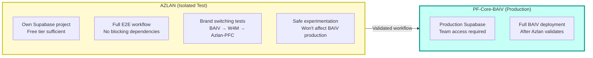
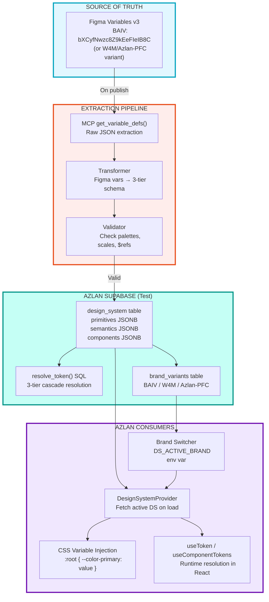
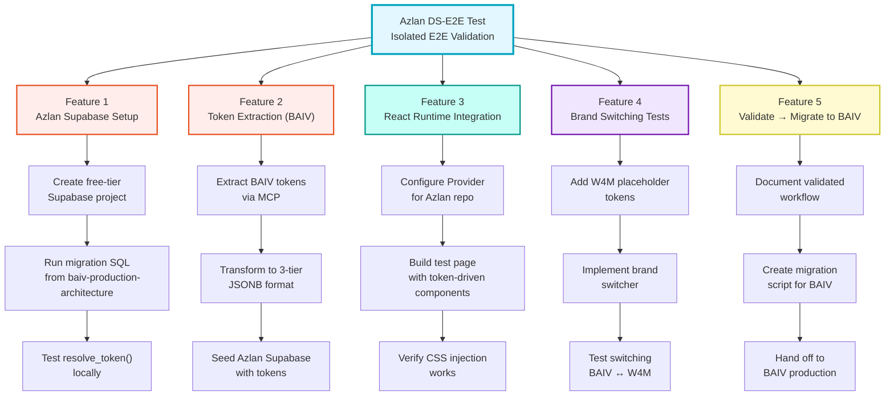

# Design System E2E Implementation Plan — Azlan Test Environment

## Overview

This is the **Azlan-specific** implementation plan for testing the DS-E2E workflow in isolation from PF-Core-BAIV.

| Context | Value |
|---------|-------|
| PFI Instance | PFI-BAIV |
| Product | Azlan |
| Repo | [ajrmooreuk/Azlan-EA-AAA](https://github.com/ajrmooreuk/Azlan-EA-AAA) |
| Design System | BAIV (with W4M/Azlan-PFC switch capability) |
| Purpose | Isolated E2E test before production deployment |

---

## 1. Azlan Test Environment Benefits



---

## 2. E2E Workflow: Azlan Configuration



---

## 3. Azlan Feature Breakdown



---

## 4. Quick Start: Azlan Setup

### Step 1: Create Supabase Project

```bash
# 1. Go to supabase.com and create free-tier project
# 2. Copy credentials to .env.local:

NEXT_PUBLIC_SUPABASE_URL=https://your-project.supabase.co
NEXT_PUBLIC_SUPABASE_ANON_KEY=your-anon-key
SUPABASE_SERVICE_ROLE_KEY=your-service-key
DS_ACTIVE_BRAND=baiv
```

### Step 2: Run Migrations

Use SQL from `baiv-production-architecture-consolidated.md` to create:
- `design_system` table
- `brand_variants` table
- `resolve_token()` function
- RLS policies

### Step 3: Seed Tokens

```bash
# Load BAIV tokens from tokens/baiv-tokens.css into Supabase
# Use extraction pipeline or manual seed script
```

### Step 4: Test Provider

```tsx
// In your Azlan test app:
import { BAIVTokenProvider } from './tokens/baiv-tokens';

export default function App({ children }) {
  return (
    <BAIVTokenProvider defaultMode="light">
      {children}
    </BAIVTokenProvider>
  );
}
```

---

## 5. Brand Switching Configuration

```json
{
  "DS_ACTIVE_BRAND": "baiv",
  "supportedBrands": {
    "baiv": {
      "tokens": "./tokens/baiv-tokens.css",
      "provider": "./tokens/baiv-tokens.tsx"
    },
    "w4m": {
      "tokens": "./tokens/w4m-tokens.css",
      "provider": "./tokens/w4m-tokens.tsx",
      "status": "placeholder"
    },
    "azlan-pfc": {
      "tokens": "./tokens/azlan-pfc-tokens.css",
      "provider": "./tokens/azlan-pfc-tokens.tsx",
      "status": "placeholder"
    }
  }
}
```

To test brand switching:
```bash
# Switch to W4M brand
DS_ACTIVE_BRAND=w4m npm run dev

# Switch back to BAIV
DS_ACTIVE_BRAND=baiv npm run dev
```

---

## 6. What This Validates

| Question | Validated By |
|----------|-------------|
| Does MCP extraction produce valid JSONB? | Feature 2 |
| Does resolve_token() cascade correctly? | Feature 1 |
| Do components render from DB tokens? | Feature 3 |
| Can we switch brands at runtime? | Feature 4 |
| Is the workflow portable to BAIV? | Feature 5 |

---

## 7. Files in This Directory

| File | Purpose |
|------|---------|
| `azlan-ds-config.json` | Azlan-specific configuration |
| `ds-e2e-implementation-plan-azlan.md` | This file |
| `ds-e2e-implementation-plan.md` | Original BAIV plan (reference) |
| `baiv-design-system-e2e-to-production.md` | Full E2E guide |
| `baiv-production-architecture-consolidated.md` | DB schema & architecture |
| `baiv-design-system-skills-plan.md` | Skills/capabilities plan |
| `design-system-ontology-v1.0.0.json` | DS ontology definition |
| `tokens/baiv-tokens.css` | BAIV CSS variables |
| `tokens/baiv-tokens.tsx` | BAIV React provider |

---

*Plan Version: 1.0.0*
*Created: 2026-01-30*
*Environment: Azlan (PFI-BAIV-Product Test)*
*Repo: ajrmooreuk/Azlan-EA-AAA*
