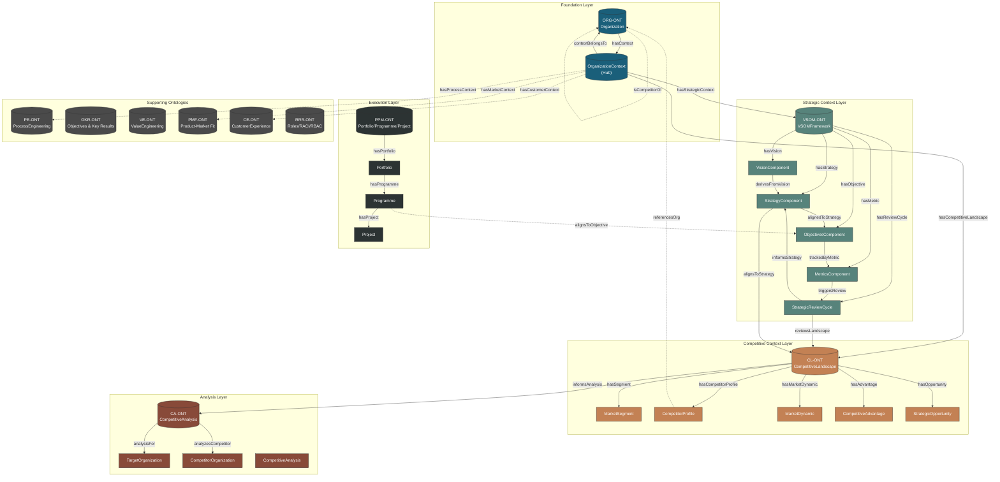
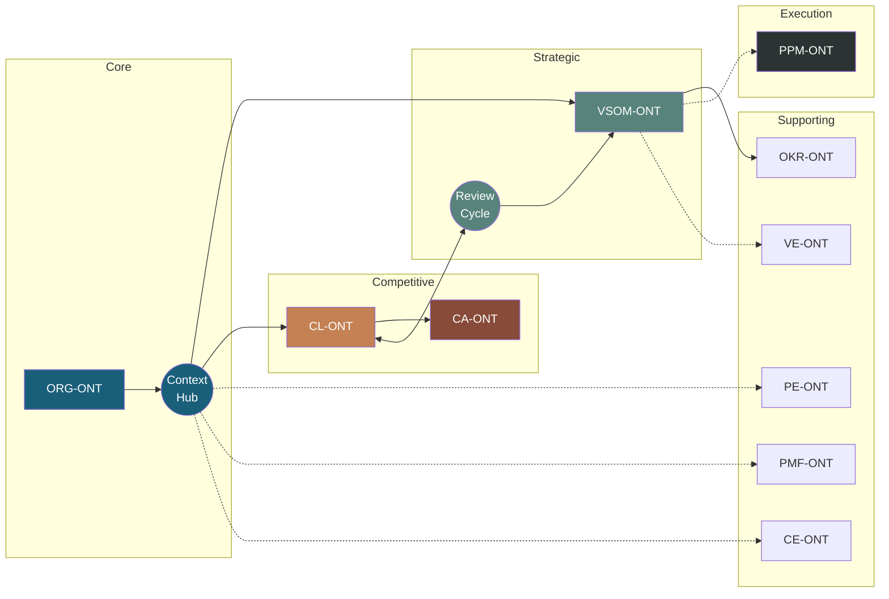
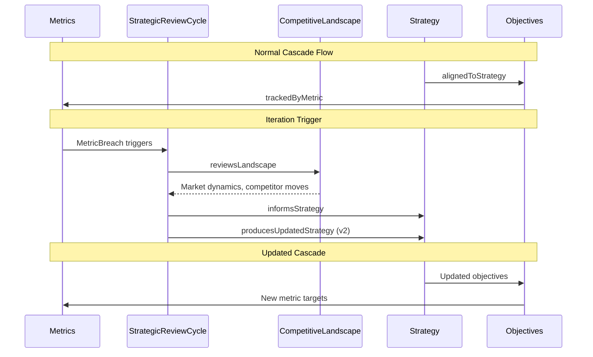
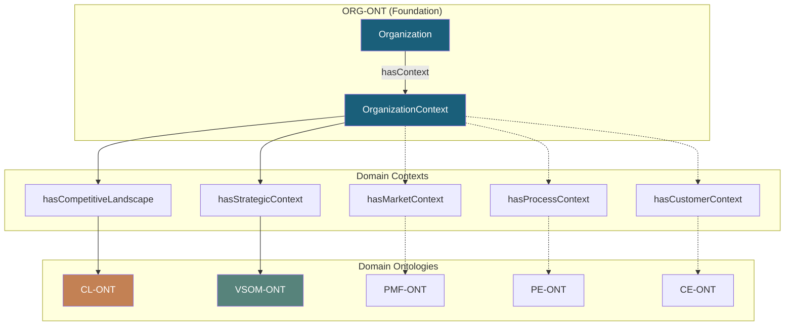
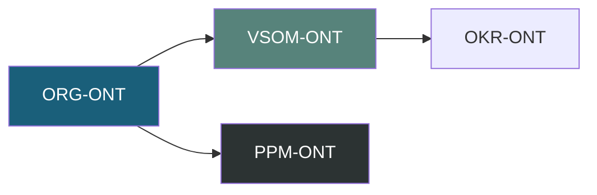
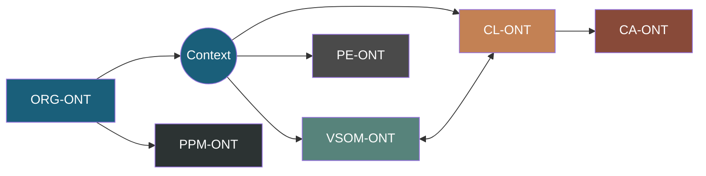

# Ontology Architecture Overview

**Version:** 1.0.0
**Date:** 2026-02-01
**Status:** Production

## Cross-Ontology Architecture Diagram

## Simplified Connection View

## Iteration Flow

## Bridge Pattern Architecture

## Graph Composition Patterns

### PF-Core Graph (Generic Template)

### PFI Instance Graph (Full Context)

## Ontology Status Summary

| Ontology | Version | Status | Bridge Pattern | Cross-Ontology Links |
|----------|---------|--------|----------------|---------------------|
| ORG-ONT | v2.1.0 | ✅ Production | Foundation + Hub | - |
| VSOM-ONT | v2.1.0 | ✅ Production | hasStrategicContext | CL-ONT (reviewsLandscape) |
| CL-ONT | v1.0.0 | ✅ Production | hasCompetitiveLandscape | VSOM-ONT, CA-ONT |
| CA-ONT | v2.0.0 | ✅ Production | Direct | CL-ONT |
| PPM-ONT | v3.0.0 | ✅ Production | Direct | VSOM-ONT (future) |
| PE-ONT | v2.0.0 | ✅ Production | hasProcessContext (future) | - |
| OKR-ONT | - | ⚠️ Glossary only | - | VSOM-ONT |
| VE-ONT | - | ⚠️ Docs only | - | VSOM-ONT |
| PMF-ONT | - | ⚠️ Docs only | hasMarketContext (future) | CL-ONT |
| CE-ONT | - | ⚠️ Empty | hasCustomerContext (future) | - |
| EA-ONT | - | ⏸️ ON HOLD | Instance data for PPM-ONT | - |

## Join Pattern Registry

| Pattern ID | Source | Target | Path | Use Case |
|------------|--------|--------|------|----------|
| JP-CL-001 | ORG-ONT | CL-ONT | Org→Context→Landscape | Full competitive context |
| JP-CL-002 | CL-ONT | CA-ONT | Landscape→Analysis | Analysis grounded in landscape |
| JP-CL-003 | CL-ONT | VSOM-ONT | Landscape→Strategy | Strategy-aligned positioning |
| JP-VSOM-001 | ORG-ONT | VSOM-ONT | Org→Context→VSOM | Full strategic context |
| JP-VSOM-002 | CL-ONT | VSOM-ONT | ReviewCycle→Landscape | Competitive feedback |
| JP-VSOM-003 | VSOM-ONT | VSOM-ONT | Metric→ReviewCycle | Performance-driven iteration |

---

*Part of PFC Ontologies | OAA Ontology Workbench v1.1.0*
