# Ontology Architecture Overview

**Version:** 4.0.0
**Date:** 2026-02-06
**Status:** Production

## Directory Structure

```
PBS/ONTOLOGIES/
├── ONTOLOGY-ARCHITECTURE.md
├── MIGRATION-PLAN-OAA-v6.1.md
├── readme.md
│
├── pfc-ontologies/                    # PF-Core Ontologies (Reusable)
│   ├── README.md
│   │
│   ├── EMC-ONT/                       # Enterprise Model Composition
│   │   └── pf-EMC-ONT-v1.0.0.jsonld
│   │
│   ├── ORG-ONT/                       # Organization Foundation
│   │   ├── org-ontology-v2.1.0-oaa-v5.json
│   │   ├── glossary-v1.0.0.json
│   │   ├── registry-entry-v3.0.0.json
│   │   ├── test-data-v1.0.0.json
│   │   ├── archive/
│   │   └── ont-org-ref-files/
│   │
│   ├── ORG-CONTEXT/                   # Organization Context Hub
│   │   ├── org-context-ontology-v1.0.1.json
│   │   ├── glossary-v1.0.0.json
│   │   ├── ORG-MAT-ONT/               # Maturity (nested)
│   │   │   └── org-maturity-v1.0.0-oaa-v5.json
│   │   └── ont-competitor-ref-files/
│   │
│   ├── CA-ONT/                        # Competitive Analysis
│   │   ├── competitive-analysis-v2.1.0-oaa-v5.json
│   │   └── archive/
│   │
│   ├── CL-ONT/                        # Competitive Landscape
│   │   ├── competitive-landscape-v1.0.0-oaa-v5.json
│   │   └── archive/
│   │
│   ├── GA-ONT/                        # Gap Analysis
│   │   └── gap-analysis-v1.0.0-oaa-v5.json
│   │
│   ├── CE-ONT/                        # Customer Experience (placeholder)
│   │
│   ├── ALZ-ONT/                       # Alzheimer's/MCSB Domain
│   │   └── MCSB-Ontology-v1.0.0.jsonld
│   │
│   ├── RCSG-ONT/                      # Risk, Compliance, Security & Governance
│   │   └── GDPR-ONT/                  # GDPR Regulatory Framework
│   │       └── gdpr-regulatory-framework-v1.0.0.json
│   │
│   ├── EA-ONT/                        # Enterprise Architecture (instance data)
│   │   ├── ea-portfolio-roadmaps-*.jsonld
│   │   └── EA-RCSG-Gov-PII/           # PII Governance (Microsoft Native)
│   │       └── pii-governance-microsoft-native-v3.3.0.json
│   │
│   ├── PE-Series-ONT/                 # Process Engineering Series
│   │   ├── README.md
│   │   ├── PE-PPM-ONT/                # Portfolio/Programme/Project
│   │   │   ├── ppm-module-v3.0.0-oaa-v5.json
│   │   │   └── archive/
│   │   ├── PE-Process-Engr-ONT/       # Process Engineering
│   │   │   ├── process-engineering-v2.0.0-oaa-v5.json
│   │   │   ├── ref-ont-pe-files/
│   │   │   └── archive/
│   │   ├── PE-EFS-ONT/                # Enterprise Framework Services
│   │   │   └── efs-ontology-v1.0.0.jsonld
│   │   └── PE-Campaign-Mgr-ONT/       # Campaign Manager (placeholder)
│   │
│   └── VE-Series-ONT/                 # Value Engineering Series
│       ├── README.md
│       ├── VE-VSOM-ONT/               # Vision-Strategy-Objectives-Metrics
│       │   ├── vsom-ontology-v2.1.0-oaa-v5.json
│       │   └── archive/
│       ├── VE-OKR-ONT/                # Objectives & Key Results
│       │   ├── PFC-ONT-OKR-v1_0_0.jsonld        (legacy v1.0.0)
│       │   └── okr-ontology-v2.0.0-oaa-v6.json  (current)
│       ├── VE-RRR-ONT/                # Roles/RACI/RBAC
│       │   ├── pf-roles-raci-rbac-ontology-v3.1.0.jsonld
│       │   └── RRR-DATA-csuite-roles-v2.0.0.jsonld
│       ├── VE-VP-ONT/                 # Value Proposition
│       │   └── vp-ontology-v1.2.0.jsonld
│       ├── VE-PMF-ONT/                # Product-Market Fit
│       │   └── pmf-ontology-v1.0.0.jsonld
│       ├── VE-KPI-ONT/                # KPIs (placeholder)
│       └── archive/
│
├── pfi-ontologies/                    # PF-Instance Ontologies (placeholder)
│   └── readme.md
│
├── pfi-BAIV-AIV-ONT/                  # BAIV Instance Ontologies
│   ├── RRR-DATA-BAIV-AIV-roles-v1.0.0.jsonld
│   └── AIV-Competitive-ONT/           # AI Visibility Competitive
│
└── unified-registry/                  # Ontology Registry
    ├── ont-registry-index.json
    ├── entries/
    └── validation-reports/
```

---

## EMC-ONT: Enterprise Model Composition

EMC-ONT is the orchestration layer that maps requirement scopes to ontology compositions, enabling filtered enterprise model assembly based on context.

### EMC Composition Architecture

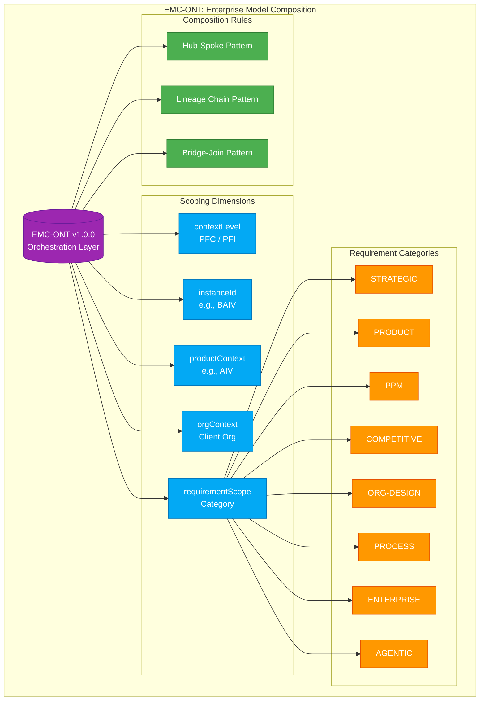

### EMC Requirement-to-Ontology Mapping

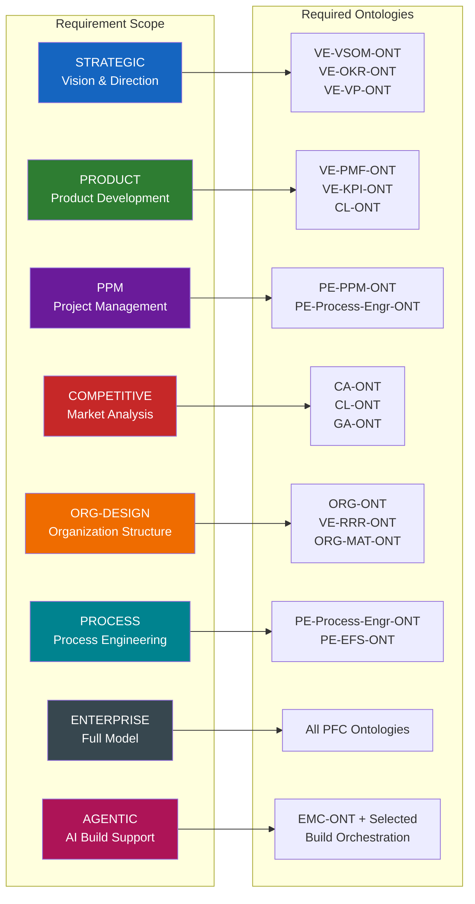

---

## Series Hierarchy Diagram

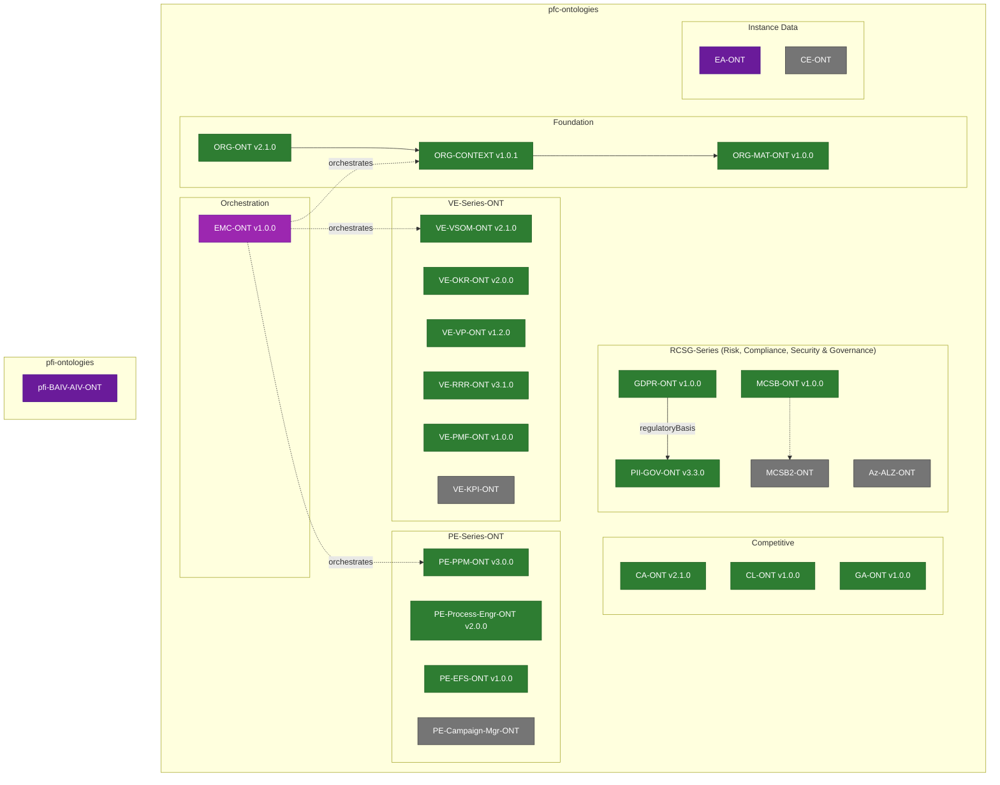

---

## PFC/PFI/Product/ORG Filtering Model

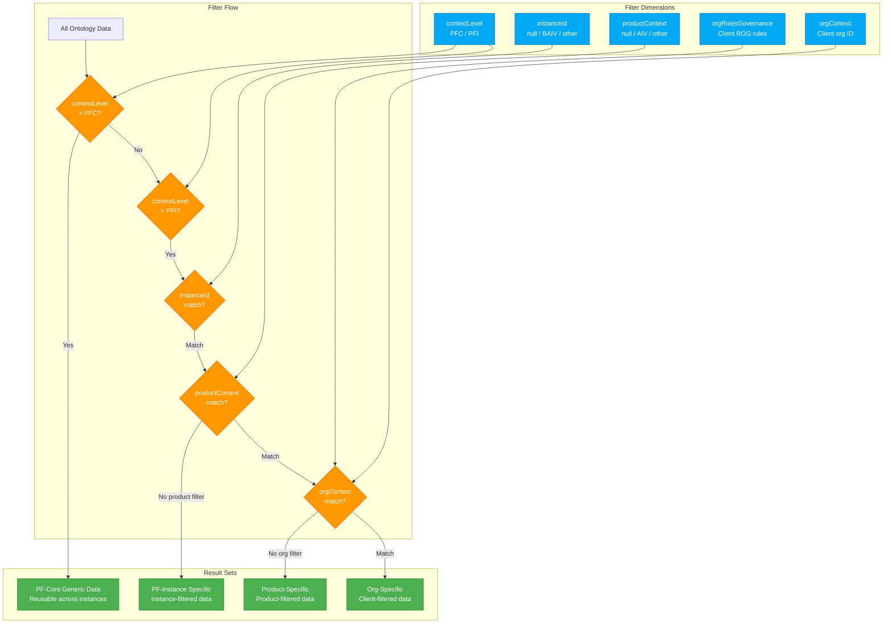

### Role Applicability Example

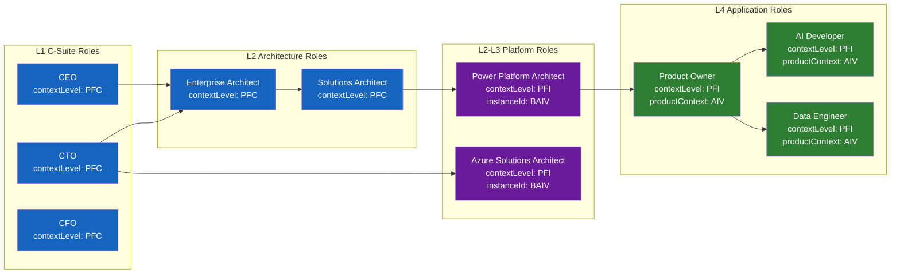

---

## L0-L4 Role Hierarchy (VE-RRR-ONT v3.1.0)

```mermaid
graph TB
    subgraph "L0: Enterprise Governance"
        BOARD[Board of Directors]
        CHAIR[Chairman]
        SHARE[Shareholders]
    end

    subgraph "L1: Core C-Suite"
        CEO[CEO]
        COO[COO]
        CFO[CFO]
        CTO[CTO]
        CMO[CMO]
        CHRO[CHRO]
    end

    subgraph "L1: Extended C-Suite"
        CDO[CDO<br/>Data]
        CAIO[CAIO<br/>AI]
        CPO[CPO<br/>Product]
        CIO[CIO<br/>Information]
        CSO_SEC[CSO-SEC<br/>Security]
        CSO_STR[CSO-STR<br/>Strategy]
        CRO[CRO<br/>Revenue/Risk]
        CCO[CCO<br/>Customer/Commercial]
        CLO[CLO<br/>Legal]
        CISO[CISO<br/>InfoSec]
    end

    subgraph "L2: Architecture Track"
        EA[Enterprise Architect]
        BA[Business Architect]
        DA[Data Architect]
        SA[Security Architect]
        SOL[Solutions Architect]
        TA[Technical Architect]
        IA[Integration Architect]
    end

    subgraph "L2-L3: Azure/Microsoft Platform"
        AZ_SA[Azure Solutions Architect]
        AZ_INF[Azure Infrastructure Architect]
        PP_ARCH[Power Platform Architect]
        M365_ARCH[M365 Architect]
        DYN_ARCH[Dynamics 365 Architect]
        AZ_DATA[Azure Data Architect]
        AZ_SEC[Azure Security Architect]
        AZ_DEVOPS[Azure DevOps Architect]
        FAB_ARCH[Fabric Architect]
    end

    subgraph "L4: Application Roles (Template)"
        PROD_OWN[Product Owner]
        TECH_LEAD[Technical Lead]
        UX_LEAD[UX Lead]
        DATA_ENG[Data Engineer]
        AI_DEV[AI Developer]
        QA_LEAD[QA Lead]
    end

    BOARD --> CEO
    CEO --> COO
    CEO --> CFO
    CEO --> CTO
    CEO --> CMO
    CEO --> CHRO

    CTO --> CDO
    CTO --> CAIO
    CTO --> CIO
    CTO --> CSO_SEC

    CEO --> CPO
    CEO --> CSO_STR
    CEO --> CRO
    CEO --> CCO
    CEO --> CLO

    CTO --> EA
    EA --> BA
    EA --> DA
    EA --> SA
    EA --> SOL
    EA --> TA
    EA --> IA

    CTO --> AZ_SA
    AZ_SA --> AZ_INF
    AZ_SA --> PP_ARCH
    AZ_SA --> M365_ARCH
    AZ_SA --> DYN_ARCH
    AZ_SA --> AZ_DATA
    AZ_SA --> AZ_SEC
    AZ_SA --> AZ_DEVOPS
    AZ_SA --> FAB_ARCH

    SOL --> PROD_OWN
    PROD_OWN --> TECH_LEAD
    PROD_OWN --> UX_LEAD
    TECH_LEAD --> DATA_ENG
    TECH_LEAD --> AI_DEV
    TECH_LEAD --> QA_LEAD

    classDef L0 fill:#263238,stroke:#000,color:#fff
    classDef L1 fill:#1565c0,stroke:#0d47a1,color:#fff
    classDef L1ext fill:#0277bd,stroke:#01579b,color:#fff
    classDef L2 fill:#2e7d32,stroke:#1b5e20,color:#fff
    classDef L2L3 fill:#6a1b9a,stroke:#4a148c,color:#fff
    classDef L4 fill:#ef6c00,stroke:#e65100,color:#fff

    class BOARD,CHAIR,SHARE L0
    class CEO,COO,CFO,CTO,CMO,CHRO L1
    class CDO,CAIO,CPO,CIO,CSO_SEC,CSO_STR,CRO,CCO,CLO,CISO L1ext
    class EA,BA,DA,SA,SOL,TA,IA L2
    class AZ_SA,AZ_INF,PP_ARCH,M365_ARCH,DYN_ARCH,AZ_DATA,AZ_SEC,AZ_DEVOPS,FAB_ARCH L2L3
    class PROD_OWN,TECH_LEAD,UX_LEAD,DATA_ENG,AI_DEV,QA_LEAD L4
```

---

## Value Engineering Lineage Chain

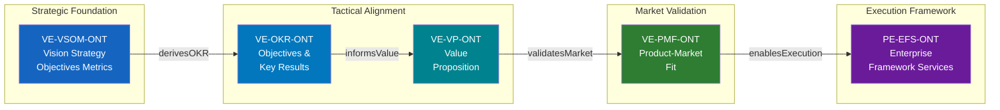

### Full VE-PE Integration

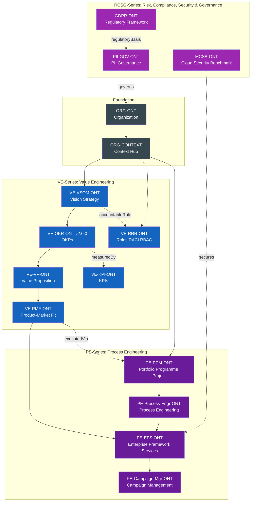

---

## Graph Composition Patterns

### Hub-Spoke Pattern

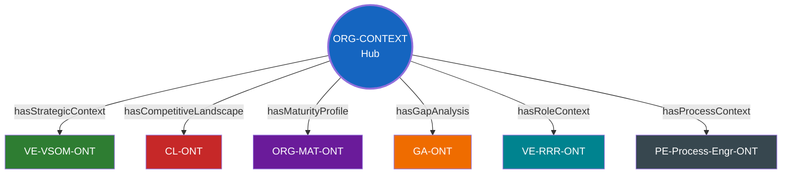

### Lineage Chain Pattern


### Bridge-Join Pattern

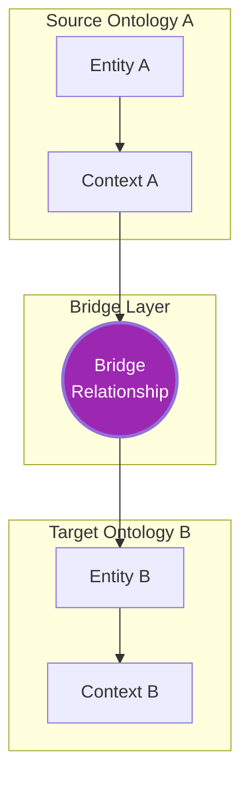

---

## Agentic Build Support

EMC-ONT provides orchestration for AI-augmented solution development using ontologies as a technology-agnostic layer.

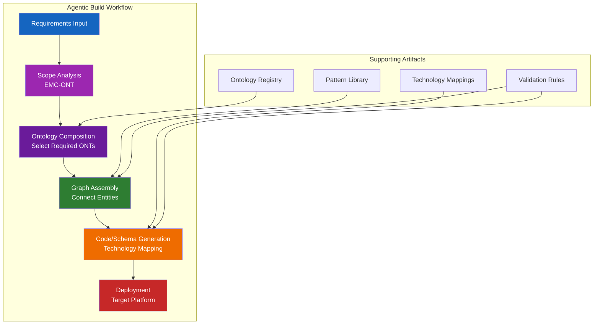

### Agentic Workflow Stages

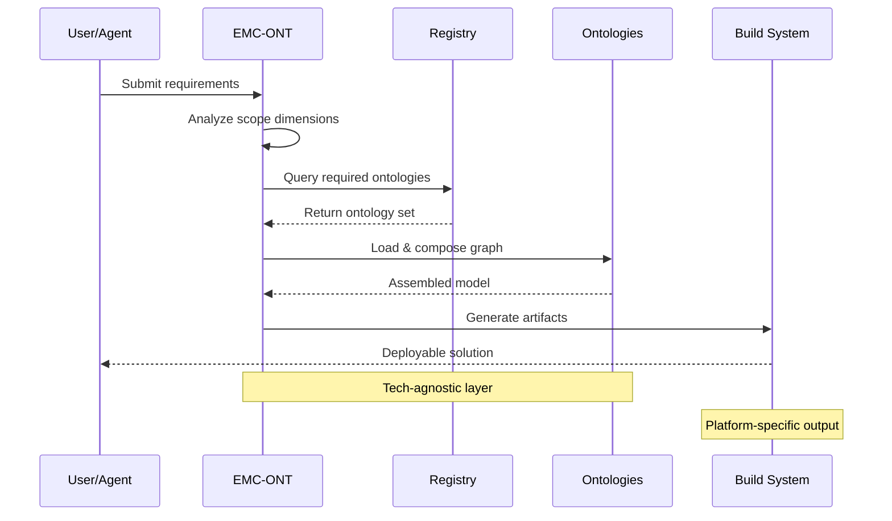

---

## Cross-Ontology Architecture Diagram

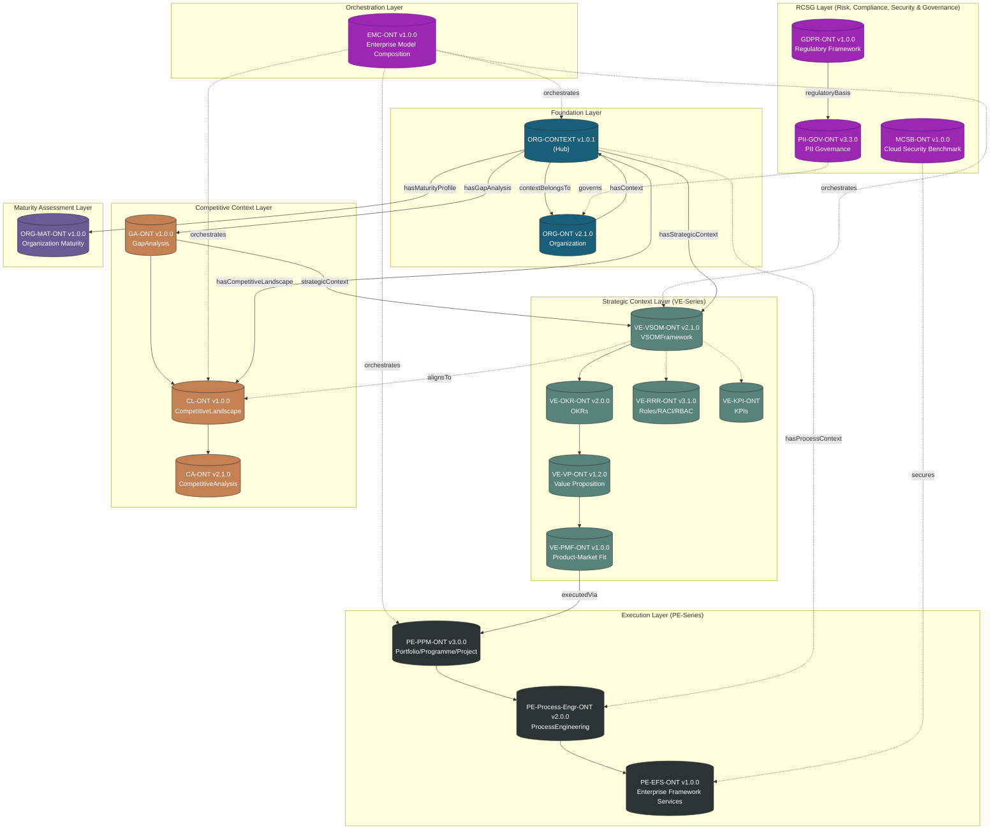

---

## PFI Instance Configuration: BAIV

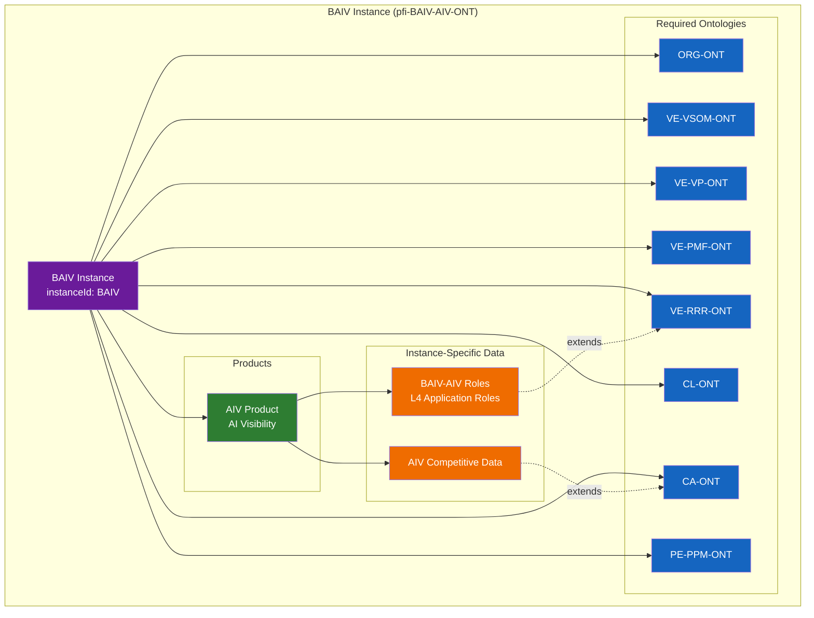

---

## Simplified Connection View

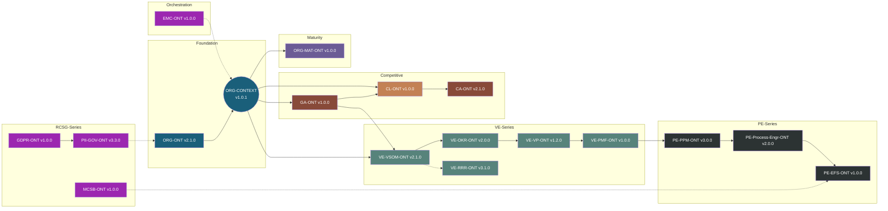

---

## Iteration Flow

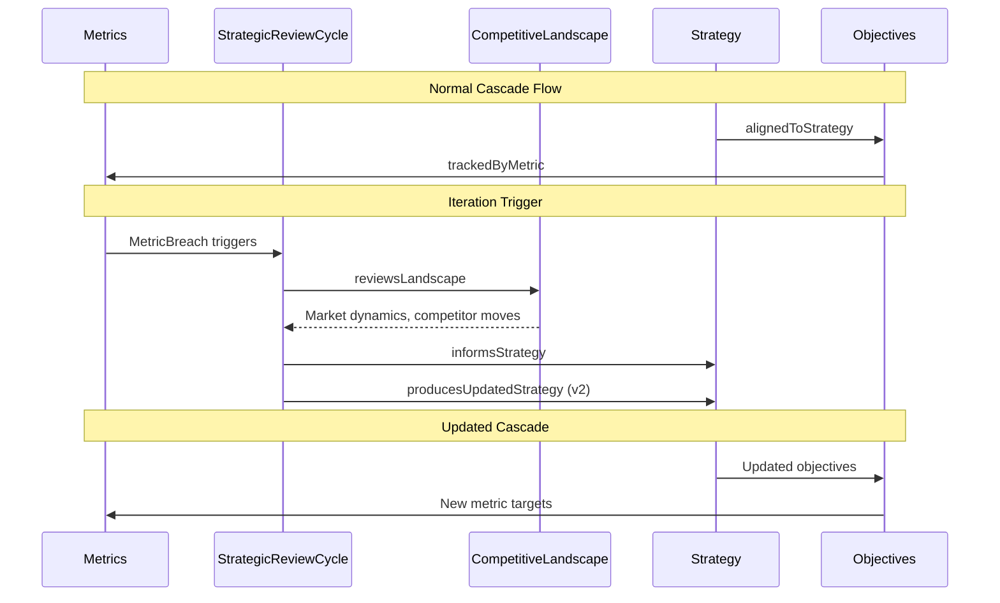

---

## Ontology Status Summary

| Series/Context | Ontology | Version | Status | Bridge Pattern | Cross-Ontology Links |
|----------------|----------|---------|--------|----------------|---------------------|
| **EMC-ONT** | EMC-ONT | v1.0.0 | ✅ Production | Orchestration Layer | All ontologies |
| **ORG-ONT** | ORG-ONT | v2.1.0 | ✅ Production | Foundation + Hub | - |
| **ORG-CONTEXT** | ORG-CONTEXT | v1.0.1 | ✅ Production | Context Hub | All domain ontologies |
| ORG-CONTEXT | ORG-MAT-ONT | v1.0.0 | ✅ Production | hasMaturityProfile | PE-Process-Engr-ONT, CE-ONT |
| ORG-CONTEXT | CL-ONT | v1.0.0 | ✅ Production | hasCompetitiveLandscape | VE-VSOM-ONT, CA-ONT |
| ORG-CONTEXT | CA-ONT | v2.1.0 | ✅ Production | Direct | ORG-ONT, CL-ONT |
| ORG-CONTEXT | GA-ONT | v1.0.0 | ✅ Production | hasGapAnalysis | VE-VSOM-ONT, CL-ONT, PE-PPM-ONT |
| ORG-CONTEXT | CE-ONT | - | ⏸️ Placeholder | hasCustomerContext (future) | ORG-MAT-ONT |
| **VE-Series-ONT** | VE-VSOM-ONT | v2.1.0 | ✅ Production | hasStrategicContext | CL-ONT (reviewsLandscape) |
| VE-Series-ONT | VE-OKR-ONT | v2.0.0 | ✅ Production (OAA v6.1.0) | - | VE-VSOM-ONT |
| VE-Series-ONT | VE-VP-ONT | v1.2.0 | ✅ Production | - | VE-VSOM-ONT, VE-OKR-ONT |
| VE-Series-ONT | VE-RRR-ONT | v3.1.0 | ✅ Production | hasRoleContext | VE-VSOM-ONT (L0-L4 roles) |
| VE-Series-ONT | VE-PMF-ONT | v1.0.0 | ✅ Production | hasMarketContext | CL-ONT, VE-VP-ONT |
| VE-Series-ONT | VE-KPI-ONT | - | ⏸️ Placeholder | - | VE-VSOM-ONT |
| **PE-Series-ONT** | PE-PPM-ONT | v3.0.0 | ✅ Production | Direct | VE-VSOM-ONT |
| PE-Series-ONT | PE-Process-Engr-ONT | v2.0.0 | ✅ Production | hasProcessContext | ORG-MAT-ONT |
| PE-Series-ONT | PE-EFS-ONT | v1.0.0 | ✅ Production | - | VE-PMF-ONT, PE-Process-Engr-ONT |
| PE-Series-ONT | PE-Campaign-Mgr-ONT | - | ⏸️ Placeholder | - | PE-PPM-ONT |
| **RCSG-Series** | GDPR-ONT | v1.0.0 | ✅ Production (OAA v6.1.0) | Regulatory Layer | PII-GOV-ONT |
| RCSG-Series | PII-GOV-ONT | v3.3.0 | ✅ Production (OAA v6.1.0) | implementsFramework | GDPR-ONT, MCSB-ONT, ORG-ONT |
| RCSG-Series | MCSB-ONT (v1) | v1.0.0 | ✅ Production | secures | PE-EFS-ONT |
| RCSG-Series | MCSB2-ONT (v2) | - | ⏸️ Placeholder | - | MCSB-ONT |
| RCSG-Series | Az-ALZ-ONT | - | ⏸️ Placeholder | - | MCSB-ONT |
| **Instance** | EA-ONT | - | ⏸️ ON HOLD | Instance data for PE-PPM-ONT | - |
| **pfi-BAIV-AIV-ONT** | AIV-Competitive-ONT | v1.0.0 | ✅ Production | - | CA-ONT, CL-ONT |
| pfi-BAIV-AIV-ONT | RRR-DATA-BAIV-AIV-roles | v1.0.0 | ✅ Production | - | VE-RRR-ONT |

---

## Join Pattern Registry

| Pattern ID | Source | Target | Path | Use Case |
|------------|--------|--------|------|----------|
| JP-EMC-001 | EMC-ONT | ORG-CONTEXT | EMC→Context | Model composition orchestration |
| JP-EMC-002 | EMC-ONT | VE-VSOM-ONT | EMC→Strategy | Strategic model composition |
| JP-EMC-003 | EMC-ONT | PE-PPM-ONT | EMC→Execution | Execution model composition |
| JP-ORG-001 | ORG-ONT | ORG-CONTEXT | Org→Context | Context hub access |
| JP-CL-001 | ORG-CONTEXT | CL-ONT | Context→Landscape | Full competitive context |
| JP-CL-002 | CL-ONT | CA-ONT | Landscape→Analysis | Analysis grounded in landscape |
| JP-CL-003 | CL-ONT | VE-VSOM-ONT | Landscape→Strategy | Strategy-aligned positioning |
| JP-VSOM-001 | ORG-CONTEXT | VE-VSOM-ONT | Context→VSOM | Full strategic context |
| JP-VSOM-002 | CL-ONT | VE-VSOM-ONT | ReviewCycle→Landscape | Competitive feedback |
| JP-VSOM-003 | VE-VSOM-ONT | VE-VSOM-ONT | Metric→ReviewCycle | Performance-driven iteration |
| JP-VE-001 | VE-VSOM-ONT | VE-OKR-ONT | VSOM→OKR | Strategic to tactical |
| JP-VE-002 | VE-OKR-ONT | VE-VP-ONT | OKR→VP | Tactical to value |
| JP-VE-003 | VE-VP-ONT | VE-PMF-ONT | VP→PMF | Value to market fit |
| JP-VE-004 | VE-PMF-ONT | PE-EFS-ONT | PMF→EFS | Market fit to execution |
| JP-MAT-001 | ORG-CONTEXT | ORG-MAT-ONT | Context→MaturityProfile | Organization maturity assessment |
| JP-GA-001 | ORG-CONTEXT | GA-ONT | Context→GapAnalysis | Connect org to gap analysis |
| JP-GA-002 | GA-ONT | VE-VSOM-ONT | Analysis→strategicContext | Strategic alignment |
| JP-GA-003 | GA-ONT | CL-ONT | Analysis→analysesLandscape | Competitive grounding |
| JP-GA-004 | GA-ONT | PE-PPM-ONT | Recommendation→spawnsProject | Execution handoff |
| JP-PE-001 | ORG-CONTEXT | PE-Process-Engr-ONT | Context→ProcessContext | Process engineering link |
| JP-PE-002 | PE-PPM-ONT | PE-Process-Engr-ONT | PPM→Process | Project process definitions |
| JP-PE-003 | PE-Process-Engr-ONT | PE-EFS-ONT | Process→EFS | Process to framework services |
| JP-RRR-001 | ORG-CONTEXT | VE-RRR-ONT | Context→Roles | Role context access |
| JP-RRR-002 | VE-VSOM-ONT | VE-RRR-ONT | VSOM→RRR | Accountability mapping |
| JP-RCSG-001 | GDPR-ONT | PII-GOV-ONT | GDPR→PII | Regulatory basis for PII governance |
| JP-RCSG-002 | PII-GOV-ONT | ORG-ONT | PII→ORG | PII governance of org data |
| JP-RCSG-003 | MCSB-ONT | PE-EFS-ONT | MCSB→EFS | Security controls for framework services |

---

## Legend

| Symbol | Meaning |
|--------|---------|
| ✅ | Production - OAA v5.0.0 or v6.1.0 compliant |
| ⚠️ | Development - Docs/Glossary only |
| ⏸️ | Placeholder - Empty or on hold |
| → | Direct relationship |
| -.-> | Future/planned relationship |
| (( )) | Hub/Orchestration node |

---

*Part of PFC Ontologies | Azlan-EA-AAA Repository*
*OAA Ontology Workbench v1.1.0 | OAA v6.1.0 (8-gate)*
*EMC-ONT Composition Engine v1.0.0*
