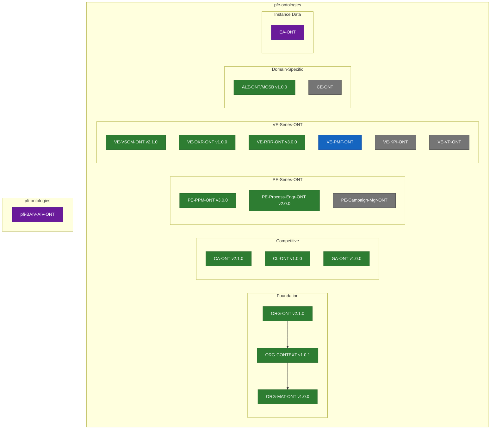
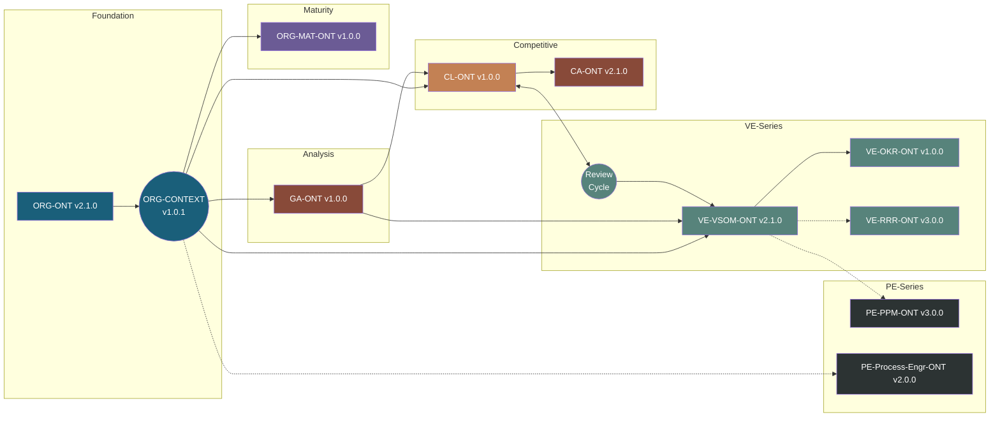
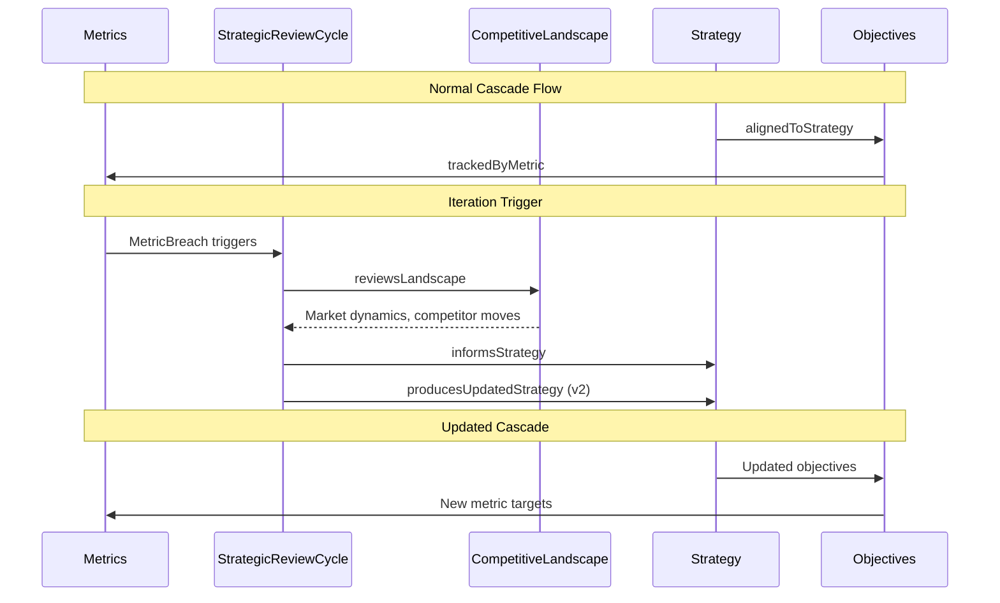
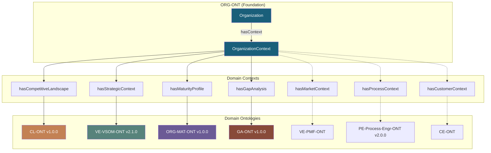
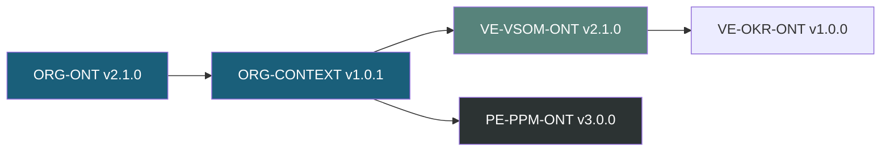
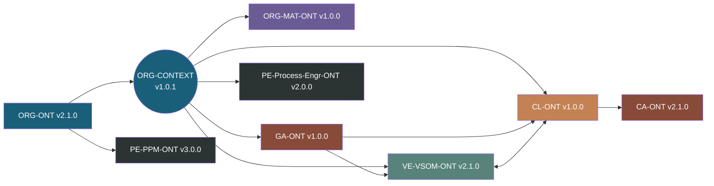

# Ontology Architecture Overview

**Version:** 2.0.0
**Date:** 2026-02-01
**Status:** Production

## Directory Structure

```
PBS/ONTOLOGIES/
├── ONTOLOGY-ARCHITECTURE.md
├── MIGRATION-PLAN-OAA-v6.1.md
├── readme.md
│
├── pfc-ontologies/                    # PF-Core Ontologies (Reusable)
│   ├── README.md
│   │
│   ├── ORG-ONT/                       # Organization Foundation
│   │   ├── org-ontology-v2.1.0-oaa-v5.json
│   │   ├── glossary-v1.0.0.json
│   │   ├── registry-entry-v3.0.0.json
│   │   ├── test-data-v1.0.0.json
│   │   ├── archive/
│   │   └── ont-org-ref-files/
│   │
│   ├── ORG-CONTEXT/                   # Organization Context Hub
│   │   ├── org-context-ontology-v1.0.1.json
│   │   ├── glossary-v1.0.0.json
│   │   ├── ORG-MAT-ONT/               # Maturity (nested)
│   │   │   └── org-maturity-v1.0.0-oaa-v5.json
│   │   └── ont-competitor-ref-files/
│   │
│   ├── CA-ONT/                        # Competitive Analysis
│   │   ├── competitive-analysis-v2.1.0-oaa-v5.json
│   │   └── archive/
│   │
│   ├── CL-ONT/                        # Competitive Landscape
│   │   ├── competitive-landscape-v1.0.0-oaa-v5.json
│   │   └── archive/
│   │
│   ├── GA-ONT/                        # Gap Analysis
│   │   └── gap-analysis-v1.0.0-oaa-v5.json
│   │
│   ├── CE-ONT/                        # Customer Experience (placeholder)
│   │
│   ├── ALZ-ONT/                       # Alzheimer's/MCSB Domain
│   │   └── MCSB-Ontology-v1.0.0.jsonld
│   │
│   ├── EA-ONT/                        # Enterprise Architecture (instance data)
│   │   └── ea-portfolio-roadmaps-*.jsonld
│   │
│   ├── PE-Series-ONT/                 # Process Engineering Series
│   │   ├── README.md
│   │   ├── PE-PPM-ONT/                # Portfolio/Programme/Project
│   │   │   ├── ppm-module-v3.0.0-oaa-v5.json
│   │   │   └── archive/
│   │   ├── PE-Process-Engr-ONT/       # Process Engineering
│   │   │   ├── process-engineering-v2.0.0-oaa-v5.json
│   │   │   ├── ref-ont-pe-files/
│   │   │   └── archive/
│   │   └── PE-Campaign-Mgr-ONT/       # Campaign Manager (placeholder)
│   │
│   └── VE-Series-ONT/                 # Value Engineering Series
│       ├── README.md
│       ├── VE-VSOM-ONT/               # Vision-Strategy-Objectives-Metrics
│       │   ├── vsom-ontology-v2.1.0-oaa-v5.json
│       │   └── archive/
│       ├── VE-OKR-ONT/                # Objectives & Key Results
│       │   └── PFC-ONT-OKR-v1_0_0.jsonld
│       ├── VE-RRR-ONT/                # Roles/RACI/RBAC
│       │   └── pf-roles-raci-rbac-ontology-v3.0.0.jsonld
│       ├── VE-PMF-ONT/                # Product-Market Fit (docs)
│       ├── VE-KPI-ONT/                # KPIs (placeholder)
│       ├── VE-VP-ONT/                 # Value Proposition (placeholder)
│       └── archive/
│
├── pfi-ontologies/                    # PF-Instance Ontologies (placeholder)
│   └── readme.md
│
├── pfi-BAIV-AIV-ONT/                  # BAIV Instance Ontologies
│   └── AIV-Competitive-ONT/           # AI Visibility Competitive
│
└── unified-registry/                  # Ontology Registry
    ├── ont-registry-index.json
    ├── entries/
    └── validation-reports/
```

## Series Hierarchy Diagram



## Cross-Ontology Architecture Diagram

```mermaid
graph TB
    subgraph "Foundation Layer"
        ORG[("ORG-ONT v2.1.0<br/>Organization")]
        ORG_CTX[("ORG-CONTEXT v1.0.1<br/>(Hub)")]
        ORG -->|hasContext| ORG_CTX
        ORG_CTX -->|contextBelongsTo| ORG
    end

    subgraph "Strategic Context Layer (VE-Series)"
        VSOM[("VE-VSOM-ONT v2.1.0<br/>VSOMFramework")]
        VISION["VisionComponent"]
        STRAT["StrategyComponent"]
        OBJ["ObjectivesComponent"]
        METRIC["MetricsComponent"]
        REVIEW["StrategicReviewCycle"]

        VSOM -->|hasVision| VISION
        VSOM -->|hasStrategy| STRAT
        VSOM -->|hasObjective| OBJ
        VSOM -->|hasMetric| METRIC
        VSOM -->|hasReviewCycle| REVIEW

        VISION -->|derivesFromVision| STRAT
        STRAT -->|alignedToStrategy| OBJ
        OBJ -->|trackedByMetric| METRIC
    end

    subgraph "Competitive Context Layer"
        CL[("CL-ONT v1.0.0<br/>CompetitiveLandscape")]
        SEGMENT["MarketSegment"]
        COMPETITOR["CompetitorProfile"]
        DYNAMIC["MarketDynamic"]
        ADVANTAGE["CompetitiveAdvantage"]
        OPPORTUNITY["StrategicOpportunity"]

        CL -->|hasSegment| SEGMENT
        CL -->|hasCompetitorProfile| COMPETITOR
        CL -->|hasMarketDynamic| DYNAMIC
        CL -->|hasAdvantage| ADVANTAGE
        CL -->|hasOpportunity| OPPORTUNITY
    end

    subgraph "Analysis Layer"
        CA[("CA-ONT v2.1.0<br/>CompetitiveAnalysis")]
        CA_TARGET["TargetOrganization"]
        CA_COMP["CompetitorOrganization"]
        CA_REPORT["CompetitiveAnalysis"]

        CA -->|analyzesCompetitor| CA_COMP
        CA -->|analysisFor| CA_TARGET

        GA[("GA-ONT v1.0.0<br/>GapAnalysis")]
        GAP["IdentifiedGap"]
        THREAT["ThreatAssessment"]
        OPP["OpportunityAssessment"]
        PRIORITY["PriorityMatrix"]
        REC["Recommendation"]

        GA -->|identifiesGap| GAP
        GA -->|identifiesThreat| THREAT
        GA -->|identifiesOpportunity| OPP
        GA -->|hasPriorityMatrix| PRIORITY
        GA -->|hasRecommendation| REC
    end

    subgraph "Execution Layer (PE-Series)"
        PPM[("PE-PPM-ONT v3.0.0<br/>Portfolio/Programme/Project")]
        PORTFOLIO["Portfolio"]
        PROGRAMME["Programme"]
        PROJECT["Project"]

        PPM -->|hasPortfolio| PORTFOLIO
        PORTFOLIO -->|hasProgramme| PROGRAMME
        PROGRAMME -->|hasProject| PROJECT

        PE[("PE-Process-Engr-ONT v2.0.0<br/>ProcessEngineering")]
    end

    subgraph "Maturity Assessment Layer"
        MAT[("ORG-MAT-ONT v1.0.0<br/>Organization Maturity")]
        PROFILE["MaturityProfile"]
        SIZE["SizeProfile"]
        SECTOR["SectorProfile"]
        TECH["TechAIMaturity"]
        DIGITAL["DigitalMaturity"]

        MAT -->|hasProfile| PROFILE
        PROFILE -->|hasSize| SIZE
        PROFILE -->|hasSector| SECTOR
        PROFILE -->|hasTechAI| TECH
        PROFILE -->|hasDigital| DIGITAL
    end

    subgraph "Supporting Ontologies (VE-Series)"
        OKR[("VE-OKR-ONT v1.0.0<br/>Objectives & Key Results")]
        RRR[("VE-RRR-ONT v3.0.0<br/>Roles/RACI/RBAC")]
        PMF[("VE-PMF-ONT<br/>Product-Market Fit")]
        KPI[("VE-KPI-ONT<br/>KPIs")]
        VP[("VE-VP-ONT<br/>Value Proposition")]
        CE[("CE-ONT<br/>CustomerExperience")]
    end

    %% Bridge Pattern Connections
    ORG_CTX -->|hasStrategicContext| VSOM
    ORG_CTX -->|hasCompetitiveLandscape| CL
    ORG_CTX -->|hasMaturityProfile| MAT
    ORG_CTX -.->|hasMarketContext| PMF
    ORG_CTX -.->|hasCustomerContext| CE
    ORG_CTX -.->|hasProcessContext| PE

    %% Cross-Ontology Iteration
    REVIEW -->|reviewsLandscape| CL
    REVIEW -->|informsStrategy| STRAT
    METRIC -->|triggersReview| REVIEW
    CL -->|informsAnalysis| CA

    %% Gap Analysis Connections
    ORG_CTX -->|hasGapAnalysis| GA
    GA -->|strategicContext| VSOM
    GA -->|analysesLandscape| CL
    REC -->|spawnsProject| PROJECT
    REC -.->|alignsToObjective| OBJ

    %% Strategic Alignment
    STRAT -->|alignsToStrategy| CL
    PROGRAMME -.->|alignsToObjective| OBJ

    %% Future Connections (dashed)
    ORG -.->|isCompetitorOf| ORG
    COMPETITOR -.->|referencesOrg| ORG

    classDef foundation fill:#1a5f7a,stroke:#333,color:#fff
    classDef strategic fill:#57837b,stroke:#333,color:#fff
    classDef competitive fill:#c38154,stroke:#333,color:#fff
    classDef analysis fill:#884a39,stroke:#333,color:#fff
    classDef execution fill:#2c3333,stroke:#333,color:#fff
    classDef maturity fill:#6b5b95,stroke:#333,color:#fff
    classDef supporting fill:#4a4a4a,stroke:#333,color:#fff
    classDef entity fill:#f0f0f0,stroke:#666,color:#333

    class ORG,ORG_CTX foundation
    class VSOM,VISION,STRAT,OBJ,METRIC,REVIEW strategic
    class CL,SEGMENT,COMPETITOR,DYNAMIC,ADVANTAGE,OPPORTUNITY competitive
    class CA,CA_TARGET,CA_COMP,CA_REPORT,GA,GAP,THREAT,OPP,PRIORITY,REC analysis
    class PPM,PORTFOLIO,PROGRAMME,PROJECT,PE execution
    class MAT,PROFILE,SIZE,SECTOR,TECH,DIGITAL maturity
    class OKR,RRR,PMF,KPI,VP,CE supporting
```



## Simplified Connection View



## Iteration Flow



## Bridge Pattern Architecture



## Graph Composition Patterns

### PF-Core Graph (Generic Template)


### PFI Instance Graph (Full Context)



## Ontology Status Summary

| Series/Context | Ontology | Version | Status | Bridge Pattern | Cross-Ontology Links |
|----------------|----------|---------|--------|----------------|---------------------|
| **ORG-ONT** | ORG-ONT | v2.1.0 | ✅ Production | Foundation + Hub | - |
| **ORG-CONTEXT** | ORG-CONTEXT | v1.0.1 | ✅ Production | Context Hub | All domain ontologies |
| ORG-CONTEXT | ORG-MAT-ONT | v1.0.0 | ✅ Production | hasMaturityProfile | PE-Process-Engr-ONT, CE-ONT (concepts) |
| ORG-CONTEXT | CL-ONT | v1.0.0 | ✅ Production | hasCompetitiveLandscape | VE-VSOM-ONT, CA-ONT |
| ORG-CONTEXT | CA-ONT | v2.1.0 | ✅ Production | Direct | ORG-ONT, CL-ONT |
| ORG-CONTEXT | GA-ONT | v1.0.0 | ✅ Production | hasGapAnalysis | VE-VSOM-ONT, CL-ONT, PE-PPM-ONT, ORG-MAT-ONT |
| ORG-CONTEXT | CE-ONT | - | ⏸️ Placeholder | hasCustomerContext (future) | ORG-MAT-ONT |
| **VE-Series-ONT** | VE-VSOM-ONT | v2.1.0 | ✅ Production | hasStrategicContext | CL-ONT (reviewsLandscape) |
| VE-Series-ONT | VE-OKR-ONT | v1.0.0 | ✅ Production | - | VE-VSOM-ONT |
| VE-Series-ONT | VE-RRR-ONT | v3.0.0 | ✅ Production | - | VE-VSOM-ONT |
| VE-Series-ONT | VE-PMF-ONT | - | ⚠️ Docs only | hasMarketContext (future) | CL-ONT |
| VE-Series-ONT | VE-KPI-ONT | - | ⏸️ Placeholder | - | VE-VSOM-ONT |
| VE-Series-ONT | VE-VP-ONT | v1.0.0 | ✅ Production | - | VE-VSOM-ONT |
| **PE-Series-ONT** | PE-PPM-ONT | v3.0.0 | ✅ Production | Direct | VE-VSOM-ONT (future) |
| PE-Series-ONT | PE-Process-Engr-ONT | v2.0.0 | ✅ Production | hasProcessContext (future) | ORG-MAT-ONT |
| PE-Series-ONT | PE-Campaign-Mgr-ONT | - | ⏸️ Placeholder | - | PE-PPM-ONT |
| **Domain** | ALZ-ONT (MCSB) | v1.0.0 | ✅ Production | - | - |
| **Instance** | EA-ONT | - | ⏸️ ON HOLD | Instance data for PE-PPM-ONT | - |
| **pfi-BAIV-AIV-ONT** | AIV-Competitive-ONT | v1.0.0 | ✅ Production | - | CA-ONT, CL-ONT |

## Join Pattern Registry

| Pattern ID | Source | Target | Path | Use Case |
|------------|--------|--------|------|----------|
| JP-ORG-001 | ORG-ONT | ORG-CONTEXT | Org→Context | Context hub access |
| JP-CL-001 | ORG-CONTEXT | CL-ONT | Context→Landscape | Full competitive context |
| JP-CL-002 | CL-ONT | CA-ONT | Landscape→Analysis | Analysis grounded in landscape |
| JP-CL-003 | CL-ONT | VE-VSOM-ONT | Landscape→Strategy | Strategy-aligned positioning |
| JP-VSOM-001 | ORG-CONTEXT | VE-VSOM-ONT | Context→VSOM | Full strategic context |
| JP-VSOM-002 | CL-ONT | VE-VSOM-ONT | ReviewCycle→Landscape | Competitive feedback |
| JP-VSOM-003 | VE-VSOM-ONT | VE-VSOM-ONT | Metric→ReviewCycle | Performance-driven iteration |
| JP-MAT-001 | ORG-CONTEXT | ORG-MAT-ONT | Context→MaturityProfile | Organization maturity assessment |
| JP-MAT-002 | ORG-MAT-ONT | ORG-MAT-ONT | Profile→DimensionScores | Access all maturity dimensions |
| JP-GA-001 | ORG-CONTEXT | GA-ONT | Context→GapAnalysis | Connect org to gap analysis |
| JP-GA-002 | GA-ONT | VE-VSOM-ONT | Analysis→strategicContext | Strategic alignment |
| JP-GA-003 | GA-ONT | CL-ONT | Analysis→analysesLandscape | Competitive grounding |
| JP-GA-004 | GA-ONT | ORG-MAT-ONT | Gap→affectsMaturity | Maturity impact |
| JP-GA-005 | GA-ONT | PE-PPM-ONT | Recommendation→spawnsProject | Execution handoff |
| JP-PE-001 | ORG-CONTEXT | PE-Process-Engr-ONT | Context→ProcessContext | Process engineering link |
| JP-PE-002 | PE-PPM-ONT | PE-Process-Engr-ONT | PPM→Process | Project process definitions |

## Legend

| Symbol | Meaning |
|--------|---------|
| ✅ | Production - OAA v5.0.0 compliant |
| ⚠️ | Development - Docs/Glossary only |
| ⏸️ | Placeholder - Empty or on hold |
| → | Direct relationship |
| -.-> | Future/planned relationship |

---

*Part of PFC Ontologies | Azlan-EA-AAA Repository*
*OAA Ontology Workbench v1.1.0*
