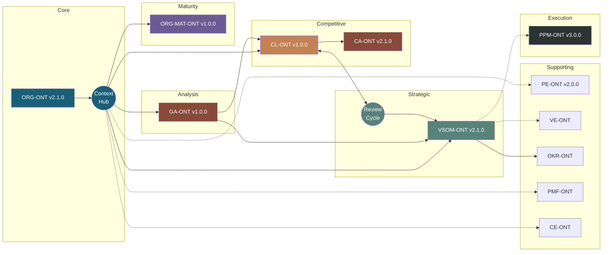
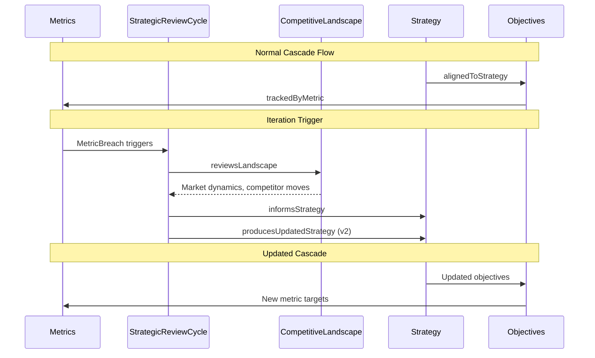
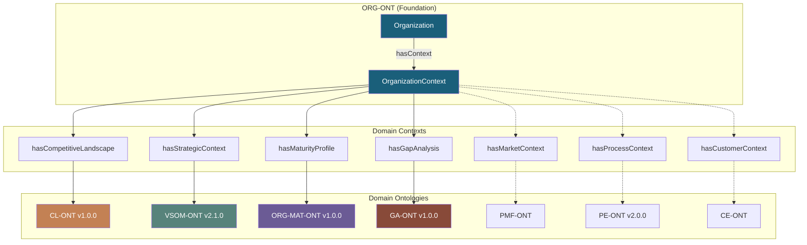
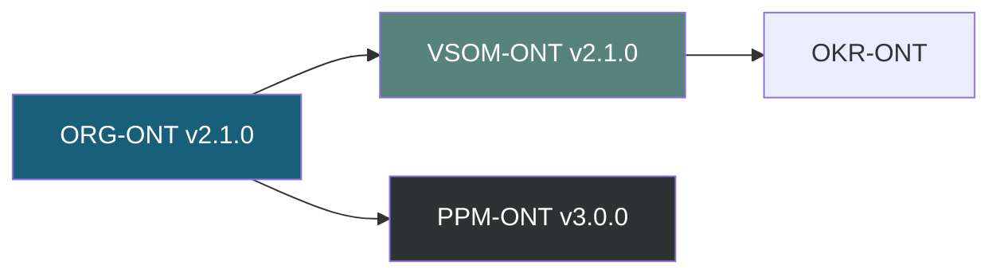
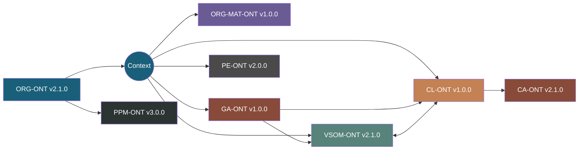

# Ontology Architecture Overview

**Version:** 1.3.0
**Date:** 2026-02-01
**Status:** Production

## Cross-Ontology Architecture Diagram

```mermaid
graph TB
    subgraph "Foundation Layer"
        ORG[("ORG-ONT v2.1.0<br/>Organization")]
        ORG_CTX[("OrganizationContext<br/>(Hub)")]
        ORG -->|hasContext| ORG_CTX
        ORG_CTX -->|contextBelongsTo| ORG
    end

    subgraph "Strategic Context Layer"
        VSOM[("VSOM-ONT v2.1.0<br/>VSOMFramework")]
        VISION["VisionComponent"]
        STRAT["StrategyComponent"]
        OBJ["ObjectivesComponent"]
        METRIC["MetricsComponent"]
        REVIEW["StrategicReviewCycle"]

        VSOM -->|hasVision| VISION
        VSOM -->|hasStrategy| STRAT
        VSOM -->|hasObjective| OBJ
        VSOM -->|hasMetric| METRIC
        VSOM -->|hasReviewCycle| REVIEW

        VISION -->|derivesFromVision| STRAT
        STRAT -->|alignedToStrategy| OBJ
        OBJ -->|trackedByMetric| METRIC
    end

    subgraph "Competitive Context Layer"
        CL[("CL-ONT v1.0.0<br/>CompetitiveLandscape")]
        SEGMENT["MarketSegment"]
        COMPETITOR["CompetitorProfile"]
        DYNAMIC["MarketDynamic"]
        ADVANTAGE["CompetitiveAdvantage"]
        OPPORTUNITY["StrategicOpportunity"]

        CL -->|hasSegment| SEGMENT
        CL -->|hasCompetitorProfile| COMPETITOR
        CL -->|hasMarketDynamic| DYNAMIC
        CL -->|hasAdvantage| ADVANTAGE
        CL -->|hasOpportunity| OPPORTUNITY
    end

    subgraph "Analysis Layer"
        CA[("CA-ONT v2.1.0<br/>CompetitiveAnalysis")]
        CA_TARGET["TargetOrganization"]
        CA_COMP["CompetitorOrganization"]
        CA_REPORT["CompetitiveAnalysis"]

        CA -->|analyzesCompetitor| CA_COMP
        CA -->|analysisFor| CA_TARGET

        GA[("GA-ONT v1.0.0<br/>GapAnalysis")]
        GAP["IdentifiedGap"]
        THREAT["ThreatAssessment"]
        OPP["OpportunityAssessment"]
        PRIORITY["PriorityMatrix"]
        REC["Recommendation"]

        GA -->|identifiesGap| GAP
        GA -->|identifiesThreat| THREAT
        GA -->|identifiesOpportunity| OPP
        GA -->|hasPriorityMatrix| PRIORITY
        GA -->|hasRecommendation| REC
    end

    subgraph "Execution Layer"
        PPM[("PPM-ONT v3.0.0<br/>Portfolio/Programme/Project")]
        PORTFOLIO["Portfolio"]
        PROGRAMME["Programme"]
        PROJECT["Project"]

        PPM -->|hasPortfolio| PORTFOLIO
        PORTFOLIO -->|hasProgramme| PROGRAMME
        PROGRAMME -->|hasProject| PROJECT
    end

    subgraph "Maturity Assessment Layer"
        MAT[("ORG-MAT-ONT v1.0.0<br/>Organization Maturity")]
        PROFILE["MaturityProfile"]
        SIZE["SizeProfile"]
        SECTOR["SectorProfile"]
        TECH["TechAIMaturity"]
        DIGITAL["DigitalMaturity"]

        MAT -->|hasProfile| PROFILE
        PROFILE -->|hasSize| SIZE
        PROFILE -->|hasSector| SECTOR
        PROFILE -->|hasTechAI| TECH
        PROFILE -->|hasDigital| DIGITAL
    end

    subgraph "Supporting Ontologies"
        PE[("PE-ONT v2.0.0<br/>ProcessEngineering")]
        OKR[("OKR-ONT<br/>Objectives & Key Results")]
        VE[("VE-ONT<br/>ValueEngineering")]
        PMF[("PMF-ONT<br/>Product-Market Fit")]
        CE[("CE-ONT<br/>CustomerExperience")]
        RRR[("RRR-ONT<br/>Roles/RACI/RBAC")]
    end

    %% Bridge Pattern Connections
    ORG_CTX -->|hasStrategicContext| VSOM
    ORG_CTX -->|hasCompetitiveLandscape| CL
    ORG_CTX -->|hasMaturityProfile| MAT
    ORG_CTX -.->|hasMarketContext| PMF
    ORG_CTX -.->|hasCustomerContext| CE
    ORG_CTX -.->|hasProcessContext| PE

    %% Cross-Ontology Iteration
    REVIEW -->|reviewsLandscape| CL
    REVIEW -->|informsStrategy| STRAT
    METRIC -->|triggersReview| REVIEW
    CL -->|informsAnalysis| CA

    %% Gap Analysis Connections
    ORG_CTX -->|hasGapAnalysis| GA
    GA -->|strategicContext| VSOM
    GA -->|analysesLandscape| CL
    REC -->|spawnsProject| PROJECT
    REC -.->|alignsToObjective| OBJ

    %% Strategic Alignment
    STRAT -->|alignsToStrategy| CL
    PROGRAMME -.->|alignsToObjective| OBJ

    %% Future Connections (dashed)
    ORG -.->|isCompetitorOf| ORG
    COMPETITOR -.->|referencesOrg| ORG

    classDef foundation fill:#1a5f7a,stroke:#333,color:#fff
    classDef strategic fill:#57837b,stroke:#333,color:#fff
    classDef competitive fill:#c38154,stroke:#333,color:#fff
    classDef analysis fill:#884a39,stroke:#333,color:#fff
    classDef execution fill:#2c3333,stroke:#333,color:#fff
    classDef maturity fill:#6b5b95,stroke:#333,color:#fff
    classDef supporting fill:#4a4a4a,stroke:#333,color:#fff
    classDef entity fill:#f0f0f0,stroke:#666,color:#333

    class ORG,ORG_CTX foundation
    class VSOM,VISION,STRAT,OBJ,METRIC,REVIEW strategic
    class CL,SEGMENT,COMPETITOR,DYNAMIC,ADVANTAGE,OPPORTUNITY competitive
    class CA,CA_TARGET,CA_COMP,CA_REPORT,GA,GAP,THREAT,OPP,PRIORITY,REC analysis
    class PPM,PORTFOLIO,PROGRAMME,PROJECT execution
    class MAT,PROFILE,SIZE,SECTOR,TECH,DIGITAL maturity
    class PE,OKR,VE,PMF,CE,RRR supporting
```

## Simplified Connection View

## Iteration Flow

## Bridge Pattern Architecture

## Graph Composition Patterns

### PF-Core Graph (Generic Template)

### PFI Instance Graph (Full Context)

## Ontology Status Summary

| Ontology | Version | Status | Bridge Pattern | Cross-Ontology Links |
|----------|---------|--------|----------------|---------------------|
| ORG-ONT | v2.1.0 | ✅ Production | Foundation + Hub | - |
| ORG-MAT-ONT | v1.0.0 | ✅ Production | hasMaturityProfile | PE-ONT, CE-ONT (concepts) |
| VSOM-ONT | v2.1.0 | ✅ Production | hasStrategicContext | CL-ONT (reviewsLandscape) |
| CL-ONT | v1.0.0 | ✅ Production | hasCompetitiveLandscape | VSOM-ONT, CA-ONT |
| CA-ONT | v2.1.0 | ✅ Production | Direct | ORG-ONT, CL-ONT |
| GA-ONT | v1.0.0 | ✅ Production | hasGapAnalysis | VSOM-ONT, CL-ONT, PPM-ONT, ORG-MAT-ONT |
| PPM-ONT | v3.0.0 | ✅ Production | Direct | VSOM-ONT (future) |
| PE-ONT | v2.0.0 | ✅ Production | hasProcessContext (future) | ORG-MAT-ONT |
| OKR-ONT | - | ⚠️ Glossary only | - | VSOM-ONT |
| VE-ONT | - | ⚠️ Docs only | - | VSOM-ONT |
| PMF-ONT | - | ⚠️ Docs only | hasMarketContext (future) | CL-ONT |
| CE-ONT | - | ⚠️ Empty | hasCustomerContext (future) | ORG-MAT-ONT |
| EA-ONT | - | ⏸️ ON HOLD | Instance data for PPM-ONT | - |

## Join Pattern Registry

| Pattern ID | Source | Target | Path | Use Case |
|------------|--------|--------|------|----------|
| JP-CL-001 | ORG-ONT | CL-ONT | Org→Context→Landscape | Full competitive context |
| JP-CL-002 | CL-ONT | CA-ONT | Landscape→Analysis | Analysis grounded in landscape |
| JP-CL-003 | CL-ONT | VSOM-ONT | Landscape→Strategy | Strategy-aligned positioning |
| JP-VSOM-001 | ORG-ONT | VSOM-ONT | Org→Context→VSOM | Full strategic context |
| JP-VSOM-002 | CL-ONT | VSOM-ONT | ReviewCycle→Landscape | Competitive feedback |
| JP-VSOM-003 | VSOM-ONT | VSOM-ONT | Metric→ReviewCycle | Performance-driven iteration |
| JP-MAT-001 | ORG-ONT | ORG-MAT-ONT | Org→Context→MaturityProfile | Organization maturity assessment |
| JP-MAT-002 | ORG-MAT-ONT | ORG-MAT-ONT | Profile→DimensionScores | Access all maturity dimensions |
| JP-GA-001 | ORG-ONT | GA-ONT | Org→Context→GapAnalysis | Connect org to gap analysis |
| JP-GA-002 | GA-ONT | VSOM-ONT | Analysis→strategicContext | Strategic alignment |
| JP-GA-003 | GA-ONT | CL-ONT | Analysis→analysesLandscape | Competitive grounding |
| JP-GA-004 | GA-ONT | ORG-MAT-ONT | Gap→affectsMaturity | Maturity impact |
| JP-GA-005 | GA-ONT | PPM-ONT | Recommendation→spawnsProject | Execution handoff |

---

*Part of PFC Ontologies | OAA Ontology Workbench v1.1.0*
