# RRR-RACI-RBAC Ontology Visual Guide

**Platform Foundation Core | Governance & Access Control Framework**

Version: 1.0.0  
Date: November 2025  
Status: Draft

---

## Table of Contents

1. [Overview](#1-overview)
2. [RRR: Roles, Responsibilities, Relationships](#2-rrr-roles-responsibilities-relationships)
3. [RACI: Assignment Matrix](#3-raci-assignment-matrix)
4. [RBAC: Access Control Model](#4-rbac-access-control-model)
5. [Ontology Structure](#5-ontology-structure)
6. [Integration with Solution Architect Agent](#6-integration-with-solution-architect-agent)
7. [Implementation Guidelines](#7-implementation-guidelines)

---

## 1. Overview

This guide defines the comprehensive governance framework for PF-Core platform operations, combining:
- **RRR (Roles, Responsibilities, Relationships)**: Organizational structure and accountability
- **RACI (Responsible, Accountable, Consulted, Informed)**: Task assignment and communication matrix
- **RBAC (Role-Based Access Control)**: Technical permission and security model

### Key Principles

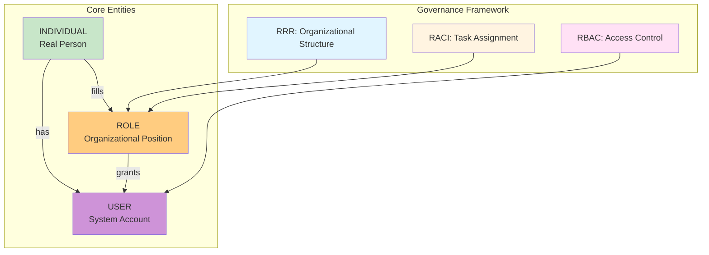

### Critical Distinctions

| Entity | Definition | Example | Governed By |
|--------|------------|---------|-------------|
| **INDIVIDUAL** | Real person who fills roles | Amanda Wilson | HR, Legal |
| **ROLE** | Organizational position/function | Solution Architect, CMO | RRR, RACI |
| **USER** | System account with permissions | amanda@baiv.ai (user_id: uuid) | RBAC |

---

## 2. RRR: Roles, Responsibilities, Relationships

### 2.1 Role Hierarchy

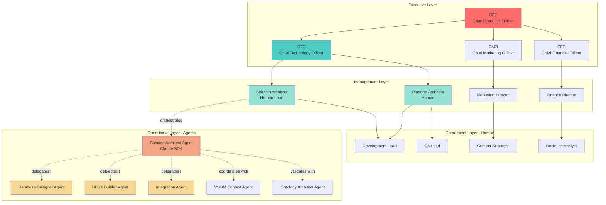

### 2.2 Role Responsibilities Matrix

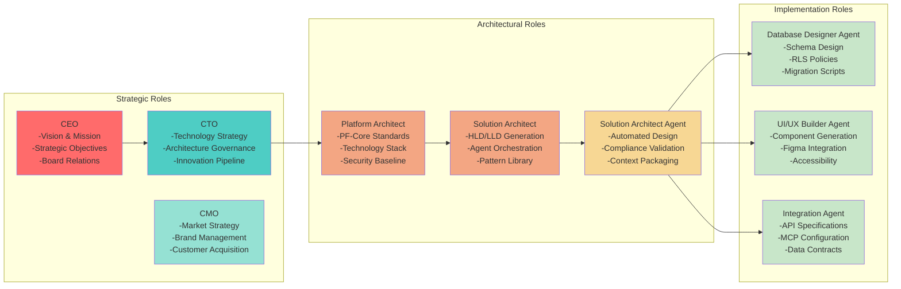

### 2.3 Role Relationships

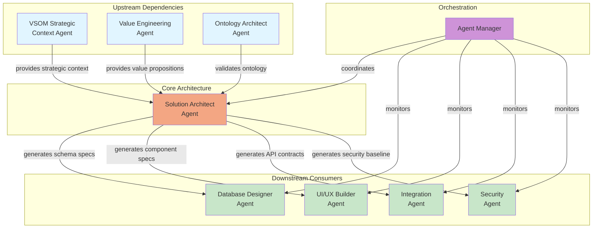

---

## 3. RACI: Assignment Matrix

### 3.1 RACI Definitions

| Letter | Role | Description |
|--------|------|-------------|
| **R** | Responsible | Does the work to complete the task |
| **A** | Accountable | Ultimately answerable for correct completion (only ONE per task) |
| **C** | Consulted | Provides input and expertise (two-way communication) |
| **I** | Informed | Kept up-to-date on progress (one-way communication) |

### 3.2 RACI Matrix - Architecture Process

```mermaid
graph TB
    subgraph "Architecture Activities"
        A1[1. Requirements<br/>Analysis]
        A2[2. HLD<br/>Generation]
        A3[3. LLD<br/>Generation]
        A4[4. Ontology<br/>Validation]
        A5[5. Agent<br/>Handoff]
        A6[6. Implementation<br/>Monitoring]
    end
    
    subgraph "RACI Assignments"
        direction TB
        
        R1["Platform Architect:<br/>C, A, I, C, I, A"]
        R2["Solution Architect (Human):<br/>R, A, C, C, R, C"]
        R3["Solution Architect Agent:<br/>C, R, R, R, R, R"]
        R4["Ontology Architect Agent:<br/>I, C, C, A, I, I"]
        R5["Database Designer Agent:<br/>I, I, C, I, C, R"]
        R6["Agent Manager:<br/>I, I, I, I, A, A"]
    end
    
    A1 --> R1
    A2 --> R1
    A3 --> R1
    A4 --> R1
    A5 --> R1
    A6 --> R1
    
    A1 --> R2
    A2 --> R2
    A3 --> R2
    A4 --> R2
    A5 --> R2
    A6 --> R2
    
    A1 --> R3
    A2 --> R3
    A3 --> R3
    A4 --> R3
    A5 --> R3
    A6 --> R3
    
    A1 --> R4
    A2 --> R4
    A3 --> R4
    A4 --> R4
    A5 --> R4
    A6 --> R4
    
    A1 --> R5
    A2 --> R5
    A3 --> R5
    A4 --> R5
    A5 --> R5
    A6 --> R5
    
    A1 --> R6
    A2 --> R6
    A3 --> R6
    A4 --> R6
    A5 --> R6
    A6 --> R6
    
    style A1 fill:#e1f5ff
    style A2 fill:#fff4e1
    style A3 fill:#ffe1f5
    style A4 fill:#e1ffe1
    style A5 fill:#ffe1e1
    style A6 fill:#f5e1ff
```

### 3.3 Detailed RACI Matrix Table

| Activity | Platform Architect | Solution Architect (Human) | Solution Architect Agent | Ontology Architect Agent | Database Designer Agent | UI/UX Builder Agent | Agent Manager |
|----------|-------------------|---------------------------|-------------------------|------------------------|------------------------|-------------------|--------------|
| **Requirements Analysis** | C | R, A | C | I | I | I | I |
| **VSOM Alignment Validation** | A | R | C | C | I | I | I |
| **HLD Generation** | A | C | R | C | I | I | I |
| **Ontology Compliance Check** | I | C | R | A | I | I | C |
| **LLD Generation** | I | C | R | C | C | C | I |
| **Database Schema Design** | I | C | C | C | R, A | I | C |
| **UI Component Specification** | I | C | C | I | I | R, A | C |
| **API Contract Definition** | I | C | R | C | C | C | A |
| **Agent Context Packaging** | I | C | R | I | C | C | A |
| **Implementation Validation** | A | R | C | C | C | C | A |
| **Architecture Decision Records** | C | R, A | R | C | I | I | I |
| **Pattern Library Management** | A | R | R | C | I | I | C |

**Legend:**
- **R** = Responsible (does the work)
- **A** = Accountable (ultimately answerable)
- **C** = Consulted (provides input)
- **I** = Informed (kept updated)

---

## 4. RBAC: Access Control Model

### 4.1 RBAC Architecture

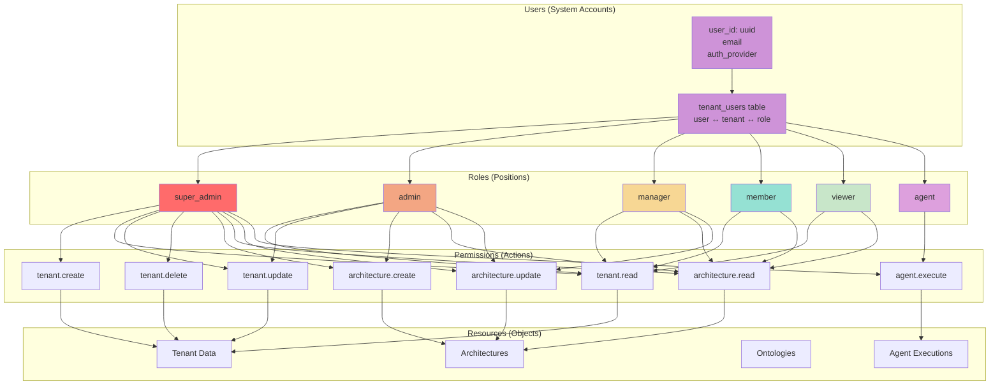

### 4.2 Permission Hierarchy

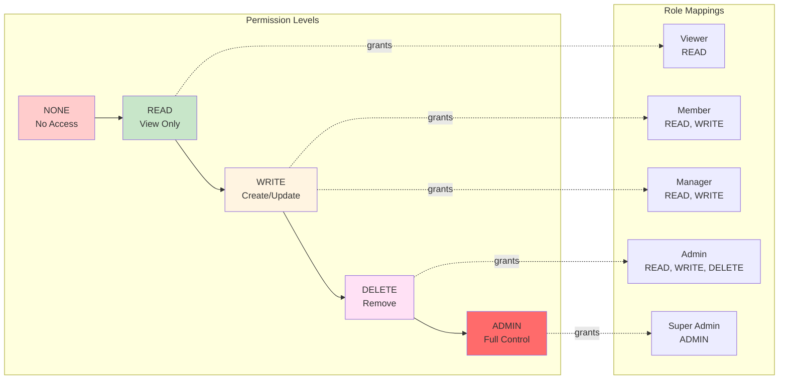

### 4.3 Row-Level Security (RLS) Model

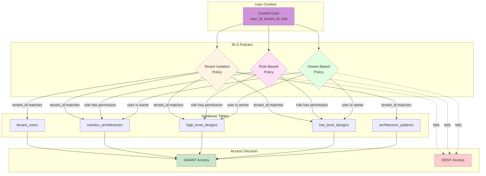

---

## 5. Ontology Structure

### 5.1 Core Ontology Entities

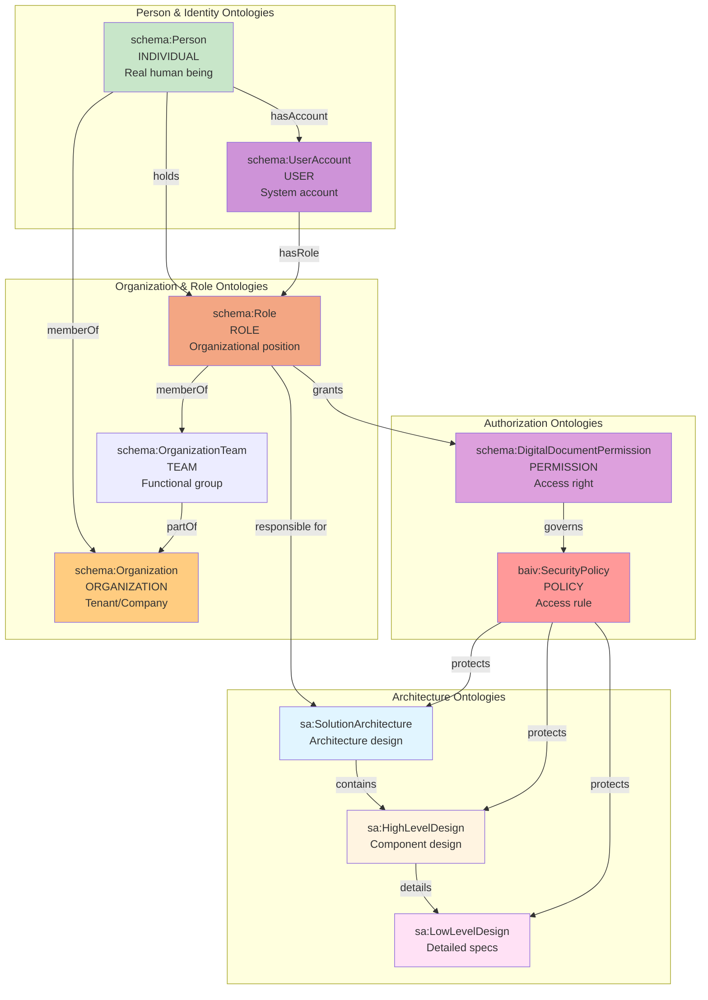

### 5.2 RACI Ontology Mapping

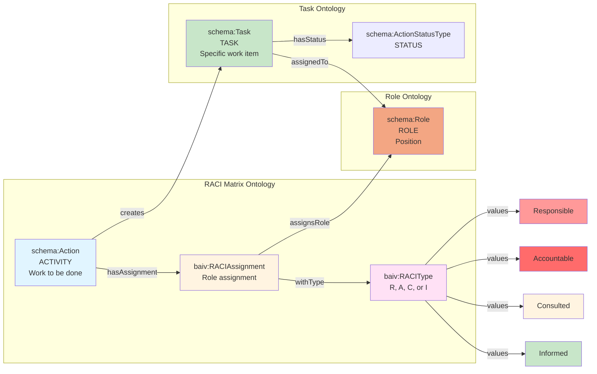

### 5.3 RBAC Ontology Mapping

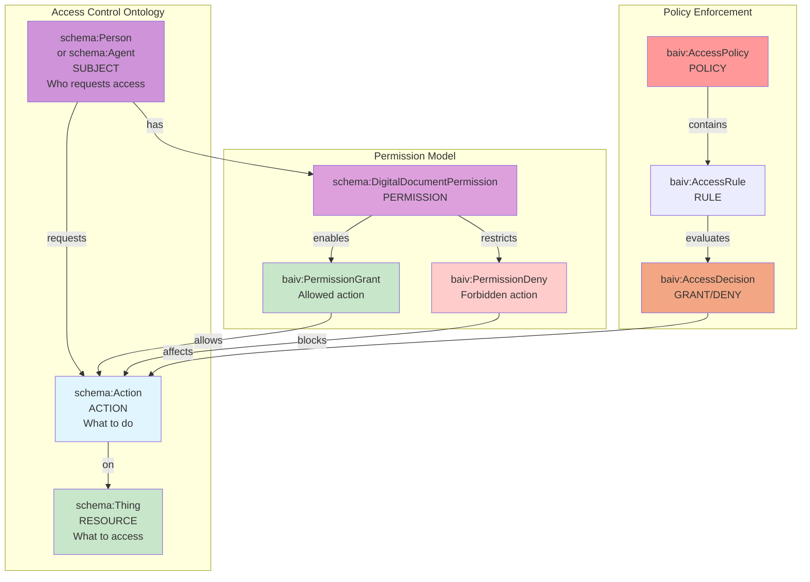

---

## 6. Integration with Solution Architect Agent

### 6.1 Agent RACI Assignment

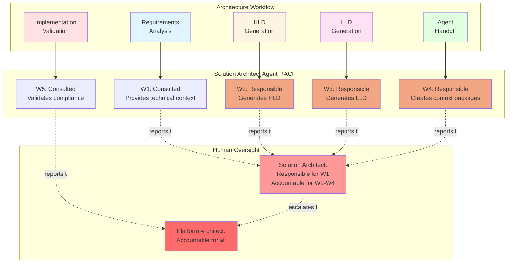

### 6.2 Agent RBAC Configuration

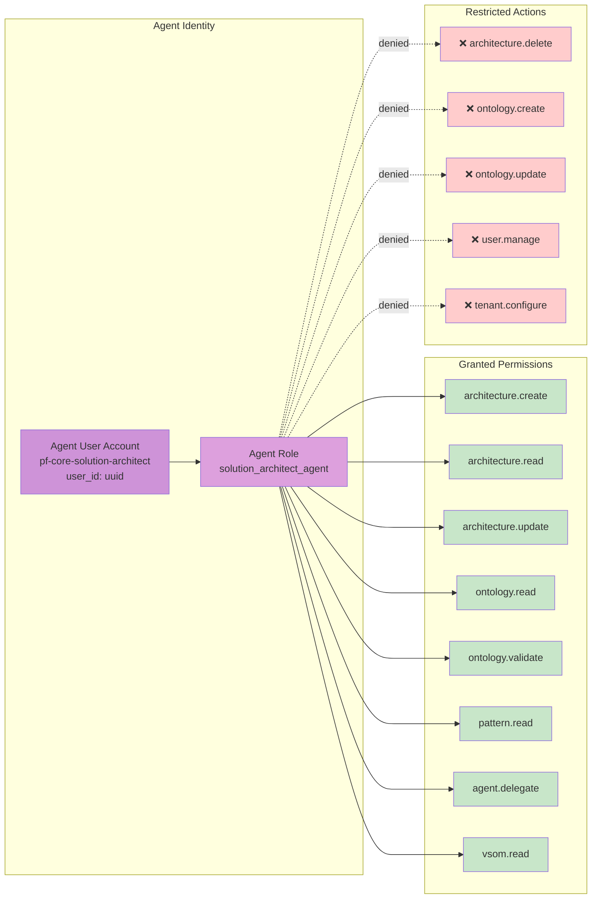

---

## 7. Implementation Guidelines

### 7.1 Database Schema for RRR-RACI-RBAC

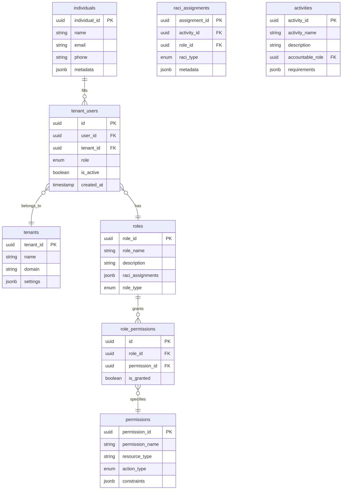

### 7.2 Implementation Checklist

#### Phase 1: Foundation

- [ ] Define individuals table for real people
- [ ] Implement tenant_users for user-tenant-role mapping
- [ ] Create roles enum with all organizational positions
- [ ] Establish permissions table with resource-action pairs
- [ ] Build role_permissions junction table
- [ ] Implement RLS policies for tenant isolation

#### Phase 2: RACI Matrix

- [ ] Create activities table for workflow steps
- [ ] Build raci_assignments table for role assignments
- [ ] Implement RACI validation rules (exactly one Accountable)
- [ ] Create RACI matrix views for reporting
- [ ] Build agent role assignment system
- [ ] Implement RACI change notification system

#### Phase 3: RBAC Enforcement

- [ ] Implement permission checking functions
- [ ] Create RLS policies per table
- [ ] Build permission inheritance model
- [ ] Implement agent service accounts
- [ ] Create audit logging for access attempts
- [ ] Build permission escalation workflows

#### Phase 4: Ontology Integration

- [ ] Map database entities to schema.org types
- [ ] Create JSON-LD representations of all entities
- [ ] Implement OAA Registry v3.0 compliance
- [ ] Build ontology validation tools
- [ ] Create semantic query capabilities
- [ ] Implement knowledge graph exports

### 7.3 Key SQL Implementation Examples

#### Creating Role with Permissions

```sql
-- Create a role
INSERT INTO roles (role_id, role_name, description, role_type)
VALUES (
    gen_random_uuid(),
    'solution_architect_agent',
    'Automated solution architecture generation and validation',
    'agent'
);

-- Grant permissions
INSERT INTO role_permissions (role_id, permission_id, is_granted)
SELECT 
    r.role_id,
    p.permission_id,
    true
FROM roles r
CROSS JOIN permissions p
WHERE r.role_name = 'solution_architect_agent'
AND p.permission_name IN (
    'architecture.create',
    'architecture.read',
    'architecture.update',
    'ontology.read',
    'ontology.validate',
    'pattern.read',
    'agent.delegate',
    'vsom.read'
);
```

#### RACI Assignment

```sql
-- Create activity
INSERT INTO activities (activity_id, activity_name, accountable_role)
VALUES (
    gen_random_uuid(),
    'HLD Generation',
    (SELECT role_id FROM roles WHERE role_name = 'platform_architect')
);

-- Assign RACI
INSERT INTO raci_assignments (assignment_id, activity_id, role_id, raci_type)
VALUES
    (gen_random_uuid(), 
     (SELECT activity_id FROM activities WHERE activity_name = 'HLD Generation'),
     (SELECT role_id FROM roles WHERE role_name = 'solution_architect_agent'),
     'responsible'),
    (gen_random_uuid(),
     (SELECT activity_id FROM activities WHERE activity_name = 'HLD Generation'),
     (SELECT role_id FROM roles WHERE role_name = 'platform_architect'),
     'accountable'),
    (gen_random_uuid(),
     (SELECT activity_id FROM activities WHERE activity_name = 'HLD Generation'),
     (SELECT role_id FROM roles WHERE role_name = 'ontology_architect_agent'),
     'consulted');
```

#### RLS Policy Example

```sql
-- Tenant isolation policy
CREATE POLICY tenant_isolation_policy ON solution_architectures
    FOR ALL
    TO authenticated
    USING (
        tenant_id IN (
            SELECT tenant_id 
            FROM tenant_users 
            WHERE user_id = auth.uid()
        )
    );

-- Role-based read policy
CREATE POLICY role_read_policy ON solution_architectures
    FOR SELECT
    TO authenticated
    USING (
        EXISTS (
            SELECT 1 
            FROM tenant_users tu
            JOIN role_permissions rp ON tu.role = rp.role_id
            JOIN permissions p ON rp.permission_id = p.permission_id
            WHERE tu.user_id = auth.uid()
            AND tu.tenant_id = solution_architectures.tenant_id
            AND p.permission_name = 'architecture.read'
            AND rp.is_granted = true
        )
    );
```

---

## 8. Validation and Testing

### 8.1 RACI Validation Rules

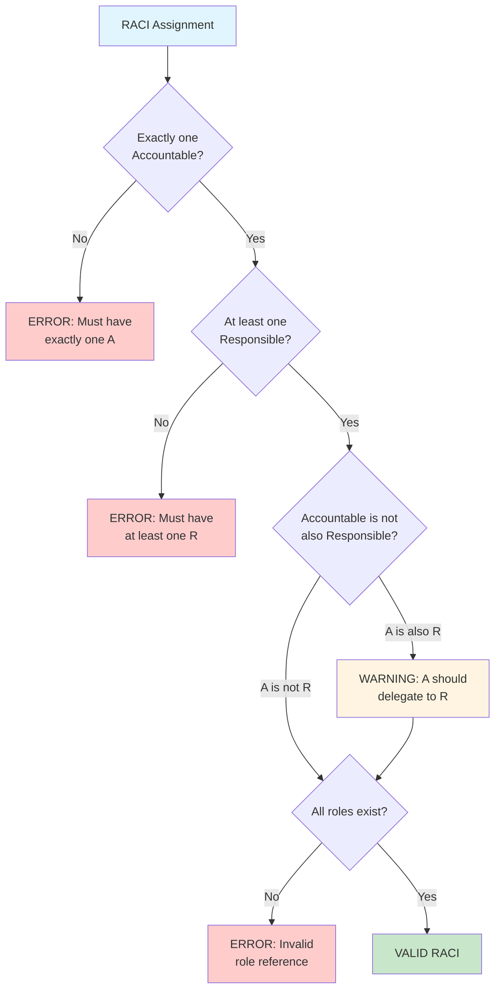

### 8.2 RBAC Test Cases

| Test Case | Subject | Resource | Action | Expected Result |
|-----------|---------|----------|--------|-----------------|
| TC-001 | solution_architect_agent | architecture-123 | create | GRANT |
| TC-002 | solution_architect_agent | architecture-123 | delete | DENY |
| TC-003 | solution_architect_agent | ontology-456 | update | DENY |
| TC-004 | solution_architect_agent | ontology-456 | validate | GRANT |
| TC-005 | admin_user | architecture-123 | delete | GRANT |
| TC-006 | viewer_user | architecture-123 | update | DENY |
| TC-007 | agent (different tenant) | architecture-123 | read | DENY |

---

## Appendix A: Complete Role Catalog

| Role Name | Type | RBAC Level | Primary Responsibilities |
|-----------|------|------------|-------------------------|
| super_admin | Human | ADMIN | Platform administration, tenant management |
| admin | Human | DELETE | Tenant administration, user management |
| platform_architect | Human | DELETE | Architecture governance, technology standards |
| solution_architect | Human | WRITE | Architecture design, agent supervision |
| manager | Human | WRITE | Team management, project oversight |
| developer | Human | WRITE | Code implementation, testing |
| member | Human | WRITE | Content creation, collaboration |
| viewer | Human | READ | View-only access |
| solution_architect_agent | Agent | WRITE | HLD/LLD generation, validation |
| database_designer_agent | Agent | WRITE | Schema design, migration scripts |
| ui_ux_builder_agent | Agent | WRITE | Component generation, Figma integration |
| integration_agent | Agent | WRITE | API contracts, MCP configuration |
| vsom_context_agent | Agent | READ | Strategic context retrieval |
| ontology_architect_agent | Agent | READ | Ontology validation, compliance |
| agent_manager | Agent | ADMIN | Agent orchestration, monitoring |

---

## Appendix B: Schema.org Ontology Mappings

| PF-Core Entity | Schema.org Type | Properties |
|----------------|-----------------|------------|
| Individual | schema:Person | name, email, telephone, memberOf |
| User | schema:UserAccount | accountId, hasRole |
| Organization | schema:Organization | name, legalName, member |
| Role | schema:Role | roleName, description, namedPosition |
| Team | schema:OrganizationTeam | name, member, parentOrganization |
| Permission | schema:DigitalDocumentPermission | grantee, permissionType |
| Activity | schema:Action | name, agent, object, result |
| RACI Assignment | baiv:RACIAssignment (custom) | activity, role, raciType |
| Solution Architecture | sa:SolutionArchitecture (custom) | name, version, components |

---

***--- END OF DOCUMENT ---***
