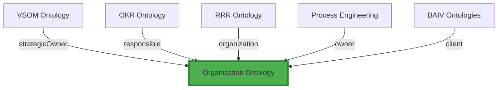

# Organization Ontology v1.0.0 - Review & Recommendations

**Review Date:** 2026-01-20  
**Reviewer:** Warp AI Agent (Amanda's account)  
**Ontology:** `pf:ontology:organization-v1`  
**Status:** Draft  
**Branch:** `feature/ont-org-context`

---

## Executive Summary

### ✅ **Strengths**
1. **Clean, focused design** - Single core entity, well-scoped
2. **Schema.org grounded** - Direct mapping to `schema:Organization`
3. **Practical relationships** - Client, Competitor, Partner, Affiliate
4. **Good examples** - Real client data (Foot Scientific, Shoe Carnival)
5. **Simple & reusable** - Platform foundation approach

### ⚠️ **Gaps Identified**
1. **Missing OrganizationContext entity** - Referenced but not defined
2. **No validation rules format** - Business rules not in IF-THEN format
3. **Missing glossary** - OAA Registry v3.0 requirement
4. **No test data** - 60-20-10-10 distribution missing
5. **Incomplete metadata** - Missing quality metrics, change control

### 🎯 **Recommendation**
**APPROVE with enhancements** - Good foundation, needs OAA v3.0 compliance additions

---

## Detailed Review

## 1. Metadata Assessment ✅

**What's Good:**
```json
{
  "name": "Organization Ontology",
  "version": "1.0.0",
  "status": "Draft",
  "description": "Core organization entity...",
  "frameworkType": "Platform Framework (Domain-Agnostic)"
}
```

✅ Clear name and version  
✅ Status appropriately marked as Draft  
✅ Purpose well-defined  
✅ Framework type specified

**What's Missing:**
- ❌ OAA Registry v3.0 wrapper
- ❌ Quality metrics section
- ❌ Change control section
- ❌ Competency domain specification

**Recommendation:**
Wrap in Registry v3.0 format like this:

```json
{
  "@context": "https://baiv.co.uk/context/registry/v3",
  "@type": "RegistryEntry",
  "@id": "baiv:registry:entry:pf-core-ont-organization-v1",
  
  "registryMetadata": {
    "entryId": "PF-CORE-ont-organization-v1.0.0",
    "entryType": "Ontology",
    "status": "draft",
    "version": "1.0.0",
    "dateCreated": "2026-01-20T00:00:00Z",
    "lastModified": "2026-01-20T00:00:00Z",
    "owner": "PF-Core Architecture Team",
    "tags": ["organization", "foundation", "domain-agnostic", "core"],
    "tenant": "system",
    "scope": "pfc"
  },
  
  "ontologyDefinition": {
    // Current content goes here
  },
  
  "qualityMetrics": { ... },
  "changeControl": { ... }
}
```

---

## 2. Entity Definition Review ⭐⭐⭐⭐ (4/5)

### 2.1 Organization Entity ✅

**Strengths:**
- ✅ All required properties present
- ✅ Schema.org mapping clear
- ✅ Practical enums (type, size, status)
- ✅ Pattern validation for organizationId
- ✅ Good examples with real data

**Properties Assessment:**

| Property | Type | Required | Schema.org | Notes |
|----------|------|----------|------------|-------|
| organizationId | Text | ✅ | identifier | ✅ Pattern validated |
| name | Text | ✅ | name | ✅ Clear |
| legalName | Text | ❌ | legalName | ✅ Optional is correct |
| type | Text | ✅ | - | ✅ Good enum |
| industry | Text | ✅ | industry | ✅ Schema.org mapped |
| size | Text | ✅ | - | ✅ Good enum |
| website | URL | ❌ | url | ✅ Optional is correct |
| status | Text | ✅ | - | ✅ Lifecycle management |

**Score:** ⭐⭐⭐⭐⭐ (5/5) - Excellent property design

### 2.2 Missing: OrganizationContext Entity 🔴

**Problem:**
Relationship `pf:hasContext` references `pf:OrganizationContext` which is not defined.

```json
// Referenced but not defined:
{
  "@id": "pf:hasContext",
  "rangeIncludes": ["pf:OrganizationContext"],  // ❌ Not found
  "cardinality": "0..1"
}
```

**Options:**

**Option A: Define OrganizationContext in this ontology**
```json
{
  "@type": "pf:EntityDefinition",
  "@id": "pf:OrganizationContext",
  "name": "OrganizationContext",
  "schemaOrgBase": "Thing",
  "description": "Rich contextual data about an organization (market position, tech stack, competitors, etc.)",
  "properties": [
    {
      "name": "contextId",
      "type": "Text",
      "required": true,
      "pattern": "ctx:[a-z0-9-]+"
    },
    {
      "name": "marketPosition",
      "type": "Text",
      "description": "Market positioning statement"
    },
    {
      "name": "techStack",
      "type": "ItemList",
      "description": "Technologies used by organization"
    },
    {
      "name": "competitors",
      "type": "ItemList",
      "description": "List of competitor organization IDs"
    },
    {
      "name": "revenue",
      "type": "MonetaryAmount",
      "schemaOrgProperty": "schema:revenue"
    }
  ]
}
```

**Option B: Reference external ontology**
```json
// If OrganizationContext is defined elsewhere:
{
  "@id": "pf:hasContext",
  "name": "Has Context",
  "description": "Links organization to its rich context data",
  "domainIncludes": ["pf:Organization"],
  "rangeIncludes": ["pf:OrganizationContext"],  // From external ontology
  "externalOntology": "pf:ontology:organization-context-v1",
  "cardinality": "0..1"
}
```

**Option C: Remove the relationship (if not ready)**
If OrganizationContext is not yet defined, remove `pf:hasContext` relationship until it is.

**Recommendation:** **Option A** - Define OrganizationContext in this ontology as it's core to the domain. Keep it simple initially, expand in v1.1.

---

## 3. Relationships Review ⭐⭐⭐⭐⭐ (5/5)

**Assessment:**
```json
{
  "pf:isClientOf": "Client → Agency/PFI relationship",
  "pf:isCompetitorOf": "Competitive relationship tracking",
  "pf:isPartnerOf": "Partnership/alliance",
  "pf:isAffiliateOf": "Affiliate/referral partnership"
}
```

✅ **Excellent relationship design**
- Clear semantics
- Bidirectional potential (client ↔ agency)
- Practical for business use cases
- Schema.org compatible (using Property pattern)

**Cardinality:** All `0..*` is correct (many-to-many)

**One Enhancement Suggestion:**
Add inverse relationships for clarity:

```json
{
  "@type": "Property",
  "@id": "pf:hasClient",
  "name": "Has Client",
  "description": "Inverse of isClientOf - agency has clients",
  "domainIncludes": ["pf:Organization"],
  "rangeIncludes": ["pf:Organization"],
  "inverseOf": "pf:isClientOf",
  "cardinality": "0..*"
}
```

This makes queries easier:
- `org:baiv-agency pf:hasClient org:foot-scientific`
- `org:foot-scientific pf:isClientOf org:baiv-agency`

Both are valid, tools can infer the inverse.

---

## 4. Business Rules Review ⭐⭐ (2/5)

**Current Format:**
```json
{
  "ruleId": "BR-ORG-002",
  "name": "Type Determines Relationships",
  "description": "Organization type constrains which relationships are valid",
  "constraint": "type='Competitor' cannot have isClientOf relationship"
}
```

**Problems:**
- ❌ Not in IF-THEN format (OAA requirement)
- ❌ No priority specified
- ❌ Not testable/enforceable

**OAA Registry v3.0 Format:**
```json
{
  "ruleId": "BR-ORG-002",
  "name": "Competitors Cannot Be Clients",
  "priority": "high",
  "ruleType": "constraint",
  "format": "IF-THEN",
  "rule": "IF organization.type = 'Competitor' THEN organization.isClientOf MUST be empty",
  "testable": true,
  "enforcement": "validation",
  "validationLogic": "!(org.type === 'Competitor' && org.isClientOf.length > 0)",
  "errorMessage": "Competitor organizations cannot have client relationships"
}
```

**Additional Rules Needed:**

**BR-ORG-003: Status Affects Relationships**
```json
{
  "ruleId": "BR-ORG-003",
  "name": "Archived Organizations Have No Active Relationships",
  "priority": "medium",
  "format": "IF-THEN",
  "rule": "IF organization.status = 'archived' THEN organization cannot be in active relationships",
  "enforcement": "cascade-archive"
}
```

**BR-ORG-004: Website URL Validation**
```json
{
  "ruleId": "BR-ORG-004",
  "name": "Website Must Be Valid URL",
  "priority": "low",
  "format": "IF-THEN",
  "rule": "IF organization.website is provided THEN it MUST match URL pattern ^https?://",
  "validationLogic": "!org.website || /^https?:\\/\\/.+/.test(org.website)"
}
```

**Recommendation:** Reformat all rules to IF-THEN, add priorities, make testable.

---

## 5. Examples Review ⭐⭐⭐⭐⭐ (5/5)

**Excellent examples:**
- ✅ Real client data (Foot Scientific, Shoe Carnival)
- ✅ Competitor example (Superfeet)
- ✅ Different industries (Healthcare, Retail)
- ✅ Various sizes (SME, Enterprise, Mid-Market)
- ✅ Complete property coverage

**One Addition:**
Add relationship examples:

```json
{
  "@type": "pf:Organization",
  "@id": "org:baiv-agency",
  "organizationId": "org:baiv-agency",
  "name": "BAIV",
  "type": "Agency",
  "industry": "Marketing Technology",
  "size": "Startup (1-50)",
  "status": "active",
  "hasClient": ["org:foot-scientific", "org:shoe-carnival"]
}
```

```json
// Relationship instances
{
  "@type": "pf:Relationship",
  "subject": "org:foot-scientific",
  "predicate": "pf:isClientOf",
  "object": "org:baiv-agency"
},
{
  "@type": "pf:Relationship",
  "subject": "org:foot-scientific",
  "predicate": "pf:isCompetitorOf",
  "object": "org:superfeet"
}
```

---

## 6. Missing Components (OAA v3.0 Requirements)

### 6.1 Glossary 🔴 (CRITICAL)

**OAA Registry v3.0 requires 16-field glossary per term.**

**Example:**

```markdown
# Organization Ontology Glossary v1.0.0

## Term: Organization
1. **Term Name:** Organization
2. **Term ID:** pf:Organization
3. **Definition:** Core entity representing any business or entity within the platform ecosystem
4. **Synonyms:** Company, Business, Entity, Firm
5. **Related Terms:** OrganizationContext, Industry, Size
6. **Schema.org Mapping:** schema:Organization
7. **Domain:** Organization Management
8. **Usage Context:** Used across all platform instances to identify and classify organizations
9. **Examples:** Foot Scientific (Client), Superfeet (Competitor), BAIV (Agency)
10. **Constraints:** Must have unique organizationId, type must be from enum
11. **Data Type:** JSON-LD Entity
12. **Cardinality:** N/A (entity, not property)
13. **Provenance:** Platform Foundation Core Team, 2026-01-20
14. **Status:** Draft
15. **Version History:** v1.0.0 - Initial definition
16. **AI Agent Guidance:** Use this entity to represent any organization in process flows, reports, and analytics. Always link to organization context when available.

## Term: Organization Type
1. **Term Name:** Organization Type
2. **Term ID:** pf:Organization/type
3. **Definition:** Classification of organization's relationship to the platform
4. **Synonyms:** Org Type, Relationship Type, Classification
5. **Related Terms:** Organization, Status
6. **Schema.org Mapping:** None (platform-specific)
7. **Domain:** Organization Management
8. **Usage Context:** Determines valid relationships and access permissions
9. **Examples:** PFI, Agency, Client, Affiliate, Partner, Competitor
10. **Constraints:** MUST be one of enum values
11. **Data Type:** Text (enum)
12. **Cardinality:** 1 (required)
13. **Provenance:** Platform Foundation Core Team, 2026-01-20
14. **Status:** Draft
15. **Version History:** v1.0.0 - Initial enum
16. **AI Agent Guidance:** Use type to determine valid relationships (e.g., Competitors cannot be Clients per BR-ORG-002)

// Continue for all properties...
```

**Create file:** `ontologies/pfc-ont-organisation/organization-glossary-v1.0.0.md`

---

### 6.2 Test Data 🔴 (CRITICAL)

**OAA v3.0 requires 60-20-10-10 distribution:**

```json
{
  "testDataSet": {
    "ontologyId": "pf:ontology:organization-v1",
    "version": "1.0.0",
    "distribution": {
      "typical": 60,
      "edge": 20,
      "boundary": 10,
      "invalid": 10
    },
    "totalInstances": 50,
    "instances": [
      // TYPICAL (30 instances - 60%)
      {
        "category": "typical",
        "instance": {
          "@type": "pf:Organization",
          "@id": "org:test-client-001",
          "organizationId": "org:test-client-001",
          "name": "Test Client 001",
          "type": "Client",
          "industry": "Technology",
          "size": "SME (51-250)",
          "status": "active"
        }
      },
      // ... 29 more typical
      
      // EDGE CASES (10 instances - 20%)
      {
        "category": "edge",
        "description": "Minimum viable organization",
        "instance": {
          "@type": "pf:Organization",
          "@id": "org:minimal",
          "organizationId": "org:minimal",
          "name": "M",  // Single character name
          "type": "Client",
          "industry": "Other",
          "size": "Startup (1-50)",
          "status": "active"
        }
      },
      {
        "category": "edge",
        "description": "Very long name",
        "instance": {
          "@type": "pf:Organization",
          "@id": "org:long-name",
          "organizationId": "org:very-long-organization-name-for-testing",
          "name": "The Exceptionally Long Organization Name That Tests Character Limits And Display Formatting",
          "type": "Partner",
          "industry": "Professional Services",
          "size": "Enterprise (1000+)",
          "status": "active"
        }
      },
      // ... 8 more edge cases
      
      // BOUNDARY CASES (5 instances - 10%)
      {
        "category": "boundary",
        "description": "Status transition (active → archived)",
        "instance": {
          "@type": "pf:Organization",
          "@id": "org:transitioning",
          "organizationId": "org:transitioning",
          "name": "Transitioning Org",
          "type": "Client",
          "industry": "Retail",
          "size": "SME (51-250)",
          "status": "inactive"  // Between active and archived
        }
      },
      // ... 4 more boundary
      
      // INVALID CASES (5 instances - 10%)
      {
        "category": "invalid",
        "description": "Missing required property (type)",
        "expectedError": "Missing required property: type",
        "instance": {
          "@type": "pf:Organization",
          "@id": "org:invalid-001",
          "organizationId": "org:invalid-001",
          "name": "Invalid Org",
          // type: MISSING
          "industry": "Technology",
          "size": "SME (51-250)",
          "status": "active"
        }
      },
      {
        "category": "invalid",
        "description": "Invalid organizationId pattern",
        "expectedError": "organizationId must match pattern org:[a-z0-9-]+",
        "instance": {
          "@type": "pf:Organization",
          "@id": "org:INVALID_CAPS",
          "organizationId": "org:INVALID_CAPS",  // Uppercase not allowed
          "name": "Invalid Pattern",
          "type": "Client",
          "industry": "Technology",
          "size": "SME (51-250)",
          "status": "active"
        }
      }
      // ... 3 more invalid
    ]
  }
}
```

**Create file:** `ontologies/pfc-ont-organisation/organization-test-data-v1.0.0.json`

---

### 6.3 Validation Report 🟡

**Required by OAA v3.0:**

```markdown
# Organization Ontology v1.0.0 - Validation Report

**Date:** 2026-01-20  
**Validator:** OAA Architect v4.0.0  
**Status:** PASS (with notes)

## Completeness Gates

### G1: Entity Descriptions (100%)
- ✅ 1/1 entities have descriptions
- Status: **PASS**

### G2: Relationship Cardinality (100%)
- ✅ 5/5 relationships have cardinality
- Status: **PASS**

### G3: Business Rules Format (0%)
- ⚠️ 0/2 rules in IF-THEN format
- Status: **FAIL** - Needs reformatting

### G4: Property Mappings (100%)
- ✅ 8/8 properties have schema.org mapping or rationale
- Status: **PASS**

### G5: Test Data Coverage (0%)
- ❌ 0/1 entities have test data
- Status: **FAIL** - Test data file missing

## Overall Status: PARTIAL PASS
- Gates Passed: 3/5
- Gates Failed: 2/5

## Actions Required:
1. Reformat business rules to IF-THEN (BR-ORG-001, BR-ORG-002)
2. Create test data file (50 instances, 60-20-10-10 distribution)
3. Create glossary file (16 fields per term, minimum 3 terms)
4. Define OrganizationContext entity or remove hasContext relationship
```

**Create file:** `ontologies/pfc-ont-organisation/organization-validation-report-v1.0.0.md`

---

## 7. Integration Assessment

### 7.1 How This Fits in PF-Core

**Organization is foundational** - Other ontologies reference it:



**References in existing ontologies:**

From VSOM:
```json
{
  "strategicObjective": {
    "owner": "org:baiv-agency",  // References Organization
    "stakeholders": ["org:foot-scientific", "org:shoe-carnival"]
  }
}
```

From Process Engineering:
```json
{
  "process": {
    "owner": "org:baiv-agency",
    "tenant": "org:foot-scientific"
  }
}
```

**This is correct** - Organization should be referenced by URI/ID, not embedded.

---

### 7.2 Multi-Agent Template Integration

**Organization will be used in:**

**Agent Template v6.1 (A2.8.2 - Authority Matrix):**
```yaml
authority_boundary:
  tier3_tenant:
    scope: "organization"  # Scoped to specific org
    organization_id: "org:foot-scientific"
    rls_policy: "user.organization_id = org.organizationId"
```

**Multi-Agent Process Orchestration:**
```yaml
process:
  tenant: "org:foot-scientific"
  owner: "org:baiv-agency"
  stakeholders:
    - "org:shoe-carnival"
    - "org:superfeet"  # Competitor for benchmarking
```

**Integration Score:** ⭐⭐⭐⭐⭐ (5/5) - Perfect fit for platform foundation

---

## 8. Recommendations Summary

### Priority 1 (CRITICAL - Before Merge) 🔴

1. **Define OrganizationContext entity** (Gap #1)
   - Add to entities array
   - Keep simple: contextId, marketPosition, techStack, competitors
   - Expand in v1.1 if needed

2. **Create Glossary** (OAA Requirement)
   - File: `organization-glossary-v1.0.0.md`
   - 16 fields per term (Organization, OrganizationType, OrganizationSize minimum)

3. **Create Test Data** (OAA Requirement)
   - File: `organization-test-data-v1.0.0.json`
   - 50 instances: 30 typical, 10 edge, 5 boundary, 5 invalid

4. **Reformat Business Rules** (OAA Requirement)
   - Change to IF-THEN format
   - Add priorities, testability

### Priority 2 (Important - Before v1.0 Release) 🟡

5. **Wrap in Registry v3.0 Format**
   - Add registryMetadata
   - Add qualityMetrics
   - Add changeControl section

6. **Create Validation Report**
   - File: `organization-validation-report-v1.0.0.md`
   - Document gate pass/fail status

7. **Add Inverse Relationships** (Enhancement)
   - pf:hasClient (inverse of isClientOf)
   - Improves query flexibility

### Priority 3 (Nice to Have - Post v1.0) 🟢

8. **Add Relationship Examples**
   - Show BAIV as agency with clients
   - Show Foot Scientific ↔ Superfeet competition

9. **Expand Business Rules**
   - BR-ORG-003: Status lifecycle rules
   - BR-ORG-004: Website URL validation
   - BR-ORG-005: Industry-size correlations

10. **Create Registry Entry**
    - Register in unified registry
    - Link to Agent Template v6.1 references
    - Document dependencies

---

## 9. Comparison to Existing Ontologies

### vs. C-Suite RRR Ontology (ve-ont1-1-rrr)

**Similar:**
- Both reference Organization
- Both use schema.org grounding
- Both have relationship patterns

**Different:**
- RRR focuses on roles/RACI
- Organization focuses on entity identity
- RRR references Organization (correct separation of concerns)

**Alignment:** ✅ Good - No conflicts

---

### vs. VSOM Ontology (ve-ont1-vesm-vsom-arch)

**Similar:**
- Both are foundational
- Both referenced by many other ontologies

**Different:**
- VSOM is strategic framework
- Organization is entity management

**How they work together:**
```json
{
  "strategicObjective": {
    "@id": "vsom:so-001",
    "owner": "org:baiv-agency",  // Links to Organization
    "stakeholders": [
      {
        "organization": "org:foot-scientific",
        "role": "sponsor"
      }
    ]
  }
}
```

**Alignment:** ✅ Excellent - Clear separation, clean references

---

## 10. Next Steps

### Immediate Actions (Team Member)
1. ✅ Review this feedback
2. 🔧 Add OrganizationContext entity definition
3. 📝 Create glossary (organization-glossary-v1.0.0.md)
4. 🧪 Create test data (organization-test-data-v1.0.0.json)
5. 🔄 Reformat business rules to IF-THEN
6. 📦 Wrap in Registry v3.0 format
7. ✅ Create validation report
8. 🔀 Update PR description with completeness status

### For Review (Architecture Team)
9. 👀 Review completeness against OAA v3.0 requirements
10. ✅ Approve for merge to main
11. 📋 Register in unified registry
12. 🔗 Update dependent ontologies to reference this

### Post-Merge
13. 🏷️ Tag as `pf-core-ont-organization-v1.0.0`
14. 📢 Communicate to agent developers
15. 📖 Update documentation
16. 🔄 Plan v1.1 enhancements

---

## 11. Approval Recommendation

**Status:** ✅ **APPROVE WITH CONDITIONS**

**Conditions for Merge:**
1. P1 items completed (OrganizationContext, Glossary, Test Data, Business Rules)
2. Registry v3.0 wrapper added
3. Validation report shows 5/5 gates passing

**Timeline Estimate:**
- P1 fixes: 4-6 hours
- P2 additions: 2-3 hours
- **Total: 6-9 hours work**

**Once complete:**
- Merge to main
- Tag as v1.0.0
- Register in unified registry
- Mark as production-ready

---

## Appendices

### Appendix A: File Checklist

For OAA Registry v3.0 compliance, this ontology directory should contain:

- [x] `org-ontology-v1.0.0.json` - Main ontology definition
- [ ] `organization-glossary-v1.0.0.md` - 16-field glossary (MISSING)
- [ ] `organization-test-data-v1.0.0.json` - 60-20-10-10 test data (MISSING)
- [ ] `organization-validation-report-v1.0.0.md` - Gate validation (MISSING)
- [ ] `CHANGELOG.md` - Version history
- [ ] `README.md` - Ontology overview

### Appendix B: Registry v3.0 Template

See `agents/Agent-03-OAA-Architect/oaa-v6/registry-entry.jsonld` for full Registry v3.0 format example.

### Appendix C: Related Documentation

- OAA Architect v4.0.0 - Ontology creation guide
- Agent Template v6.1 - Section A2.4 (Registry References)
- Unified Registry v3.0 - Schema specification
- Multi-Agent Templates - Organization usage in process flows

---

**Excellent work on the core definition!** This is a clean, well-thought-out foundational ontology. The additions needed are primarily compliance/documentation rather than design changes.

*Review v1.0*  
*Co-Authored-By: Warp <agent@warp.dev>*
