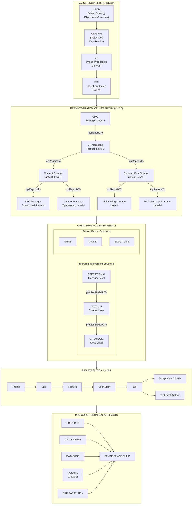
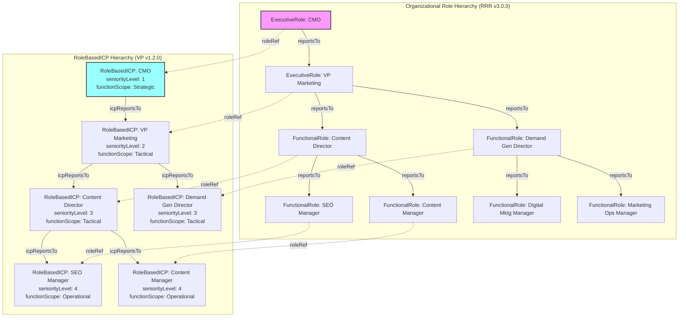
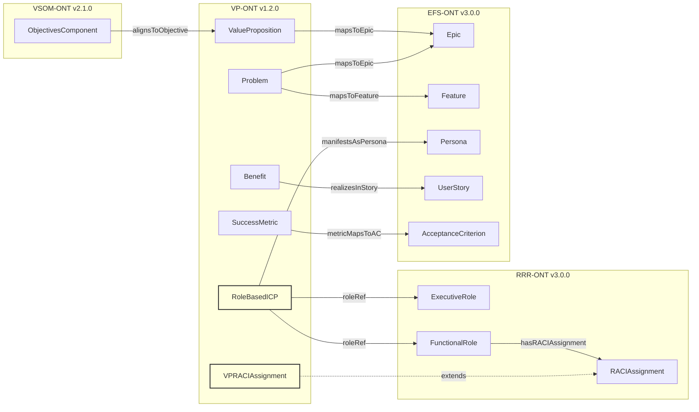
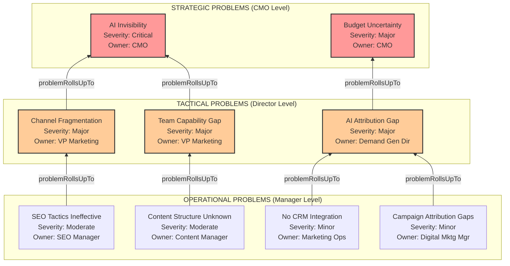
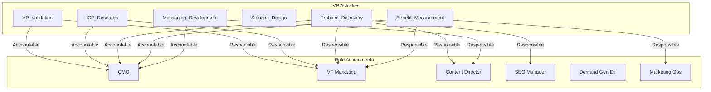
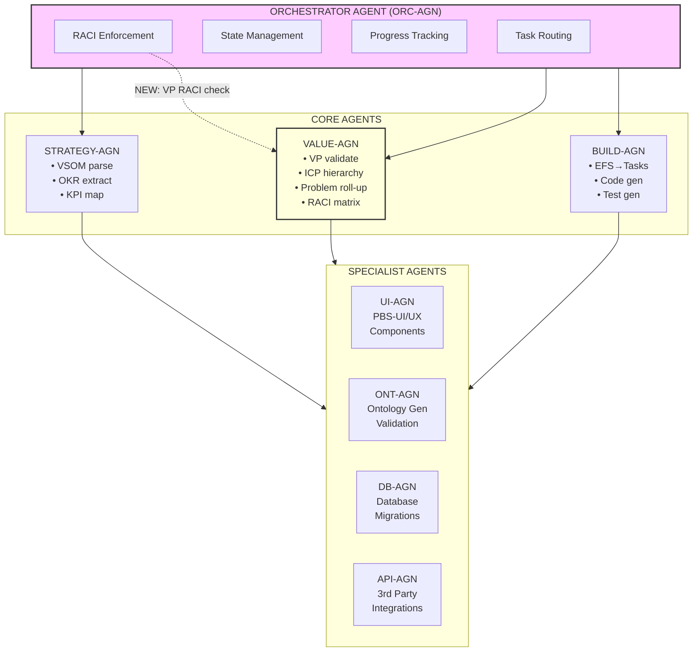
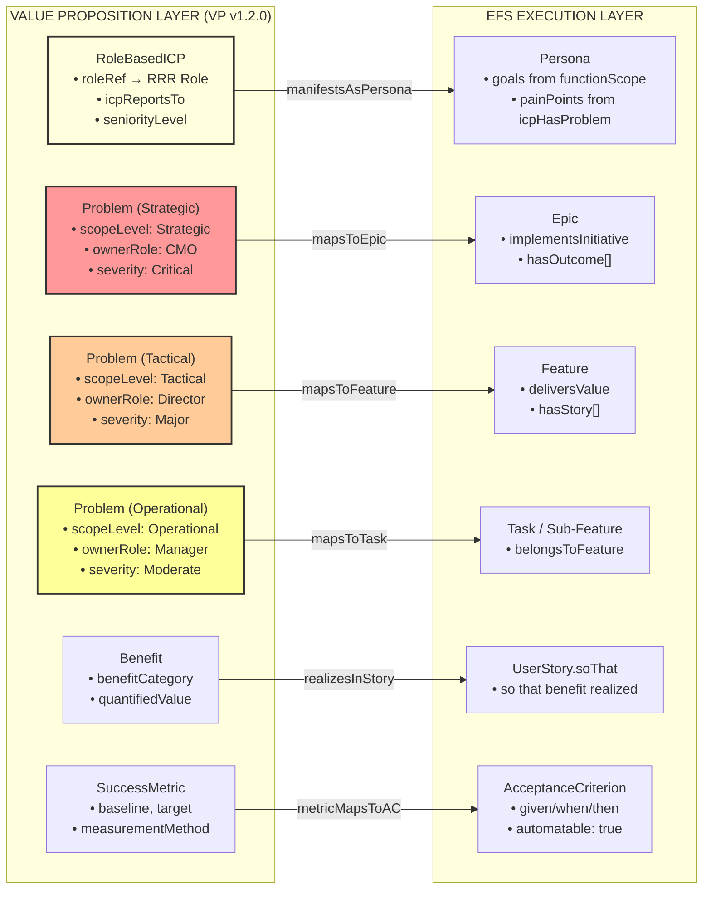
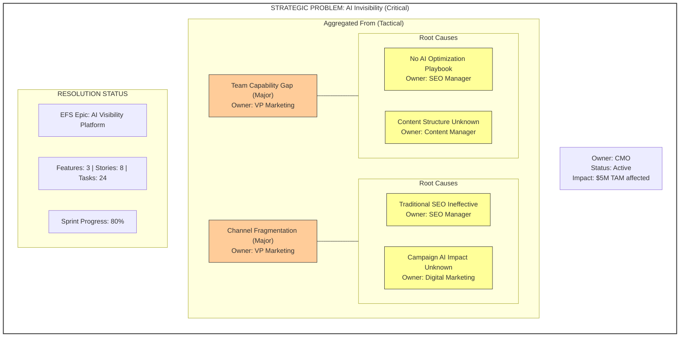

# PFI-Instance Integration Architecture v1.1.0

## Strategic Value Chain: VSOM → VP → EFS → Build



### Value Stack Legend

| Layer | Purpose | Ontology | Key Entities |
|-------|---------|----------|--------------|
| **VSOM** | Vision & Strategic Direction | VSOM v2.1.0 | Vision, Strategy, Objectives, Measures |
| **OKR/KPI** | Objective Tracking | OKR v1.0.0 | Objective, KeyResult, KPI |
| **VP** | Customer Value Definition | VP v1.2.0 | ValueProposition, RoleBasedICP, Problem, Benefit |
| **EFS** | Execution Framework | EFS v3.0.0 | Epic, Feature, UserStory, Task |
| **PFC-Core** | Technical Build | Multiple | UI, Database, Agents, APIs |

---

## RRR-Integrated ICP Hierarchy



Each **RoleBasedICP** has:
- `roleRef` → Points to corresponding RRR Role
- `functionScope` → Strategic | Tactical | Operational
- `seniorityLevel` → 1 (C-Suite) to 10 (Individual Contributor)
- `icpHasProblem` → Role-specific problems

---

## Cross-Ontology Lineage Architecture



### Join Patterns (VP v1.2.0)

| Pattern ID | Name | Path | Use Case |
|------------|------|------|----------|
| JP-VP-001 | VSOM-to-VP Alignment | `ObjectivesComponent → alignsToObjective ← ValueProposition` | Strategy drives VP |
| JP-VP-002 | VP-to-EFS Execution | `Problem → mapsToEpic → Epic → hasFeature → Feature` | Problem to execution |
| JP-VP-003 | ICP-to-Persona Bridge | `IdealCustomerProfile → manifestsAsPersona → Persona` | ICP to stories |
| JP-VP-008 | **RRR-to-ICP Role Bridge** | `ExecutiveRole → roleRef ← RoleBasedICP → icpReportsTo` | Role hierarchy to ICP |
| JP-VP-009 | **Problem Roll-Up Chain** | `Problem[Op] → problemRollsUpTo → Problem[Tac] → Problem[Strat]` | Root cause tracing |
| JP-VP-010 | **RACI-VP Activity Chain** | `VPRACIAssignment → role → FunctionalRole → roleRef ← RoleBasedICP` | Accountability chain |

---

## Problem Roll-Up Hierarchy



### Problem Level → EFS Mapping

| Problem Scope | Severity Range | Maps To | RACI Accountable |
|---------------|----------------|---------|------------------|
| **Strategic** | Critical, Major | Epic | CMO |
| **Tactical** | Major, Moderate | Feature | Director |
| **Operational** | Moderate, Minor | Task / Sub-Feature | Manager |

---

## RACI Integration for VP Activities (v1.2.0)



### VP Activity RACI Matrix

| VP Activity | CMO | VP Mktg | Content Dir | SEO Mgr | Demand Gen Dir | Mktg Ops |
|-------------|:---:|:-------:|:-----------:|:-------:|:--------------:|:--------:|
| VP_Validation | **A** | R | C | I | C | I |
| ICP_Research | A | **R** | C | I | C | I |
| Problem_Discovery | A | **R** | R | R | R | C |
| Solution_Design | A | **R** | C | R | C | R |
| Benefit_Measurement | **A** | R | I | I | R | **R** |
| Pain_Resolution | A | **A** | R | R | R | C |
| Competitive_Analysis | C | **A** | R | R | I | I |
| Messaging_Development | **A** | R | **R** | C | C | I |

**Legend:** **A** = Accountable (one per activity), R = Responsible, C = Consulted, I = Informed

### VPRACIAssignment Entity

```json
{
  "@id": "vp:VPRACIAssignment",
  "properties": [
    "vpActivity: VP_Validation | ICP_Research | Problem_Discovery | ...",
    "role: Reference to pf:ExecutiveRole or pf:FunctionalRole",
    "raciType: Responsible | Accountable | Consulted | Informed",
    "vpEntityRef: Reference to specific VP entity (optional)",
    "context: Additional context for this assignment"
  ],
  "businessRules": [
    "BR-VP-019: Each activity must have exactly ONE Accountable role",
    "BR-VP-019: Each activity must have AT LEAST ONE Responsible role"
  ]
}
```

---

## OAA v5.0.0 Validation Pipeline

```mermaid
flowchart LR
    subgraph G1["G1: ENTITY<br/>DESCRIPTIONS"]
        G1D["All entities<br/>≥20 chars<br/>descriptions"]
    end

    subgraph G2["G2: CARDINALITY"]
        G2D["Relationships<br/>have cardinality<br/>defined"]
    end

    subgraph G2B["G2B: CONNECTIVITY"]
        G2BD["100% entity<br/>connectivity<br/>No orphans"]
    end

    subgraph G2C["G2C: GRAPH<br/>CONNECTIVITY"]
        G2CD["Single component<br/>ratio ≥0.8"]
    end

    subgraph G3["G3: BUSINESS<br/>RULES"]
        G3D["IF-THEN format<br/>validation"]
    end

    subgraph G4["G4: SCHEMA.ORG"]
        G4D["Base type<br/>mappings for<br/>entities"]
    end

    subgraph G5["G5: TEST DATA"]
        G5D["60% Happy<br/>20% Edge<br/>10% Error<br/>10% Boundary"]
    end

    subgraph G6["G6: REGISTRY"]
        G6D["Entry in<br/>unified-registry"]
    end

    G1 --> G2 --> G2B --> G2C --> G3 --> G4 --> G5 --> G6
    G6 --> PROD["PRODUCTION<br/>READY"]

    style G6 fill:#9f9,stroke:#333,stroke-width:2px
    style PROD fill:#9f9,stroke:#333,stroke-width:3px
```



### Current Ontology Status (per OAA v5.0.0)

| Ontology | G1 | G2 | G2B | G2C | G3 | G4 | G5 | G6 | Version | Priority |
|----------|:--:|:--:|:---:|:---:|:--:|:--:|:--:|:--:|:-------:|:--------:|
| **VP**   | ✅ | ✅ | ✅  | ✅  | ✅ | ✅ | ✅ | ✅ | v1.1.0  | ✅ READY |
| **VP** (RRR) | ✅ | ✅ | ✅  | ✅  | ✅ | ✅ | ⚠️ | ⚠️ | v1.2.0  | IN PROGRESS |
| **EFS**  | ✅ | ✅ | ✅  | ✅  | ✅ | ✅ | ❌ | ✅ | v3.0.0  | HIGH     |
| **VSOM** | ✅ | ✅ | ✅  | ✅  | ✅ | ✅ | ❌ | ✅ | v2.1.0  | HIGH     |
| **RRR**  | ✅ | ✅ | ✅  | ⚠️  | ✅ | ✅ | ✅ | ✅ | v3.0.0  | ✅ READY |
| **PPM**  | ✅ | ✅ | ✅  | ✅  | ✅ | ✅ | ❌ | ⚠️ | v5.0.1  | HIGH     |
| **OKR**  | ✅ | ✅ | ⚠️  | ⚠️  | ❌ | ✅ | ❌ | ✅ | v1.0.0  | MEDIUM   |
| **ORG-CTX** | ✅ | ✅ | ✅  | ✅  | ✅ | ✅ | ❌ | ⚠️ | v1.0.1  | MEDIUM   |

> **STATUS UPDATE (2026-02-02):**
> - VP v1.1.0: Fully OAA v5.0.0 compliant with VSOM lineage and EFS bridges
> - VP v1.2.0: RRR integration in progress - adds RoleBasedICP, icpReportsTo, problemRollsUpTo, VPRACIAssignment
> - RRR v3.0.0: Production ready, integrated with VP v1.2.0

---

## VP v1.2.0 Schema Enhancements

### New Entities

| Entity | Description | Key Properties |
|--------|-------------|----------------|
| **RoleBasedICP** | ICP specialized for organizational role | `roleRef`, `parentICP`, `seniorityLevel`, `functionScope` |
| **VPRACIAssignment** | RACI for VP activities | `vpActivity`, `role`, `raciType`, `vpEntityRef` |

### New Relationships

| Relationship | Domain → Range | Description |
|--------------|----------------|-------------|
| **roleRef** | RoleBasedICP → ExecutiveRole/FunctionalRole | Links ICP to RRR role |
| **icpReportsTo** | RoleBasedICP → RoleBasedICP | ICP hierarchy matching role hierarchy |
| **problemRollsUpTo** | Problem → Problem | Aggregates operational→tactical→strategic |
| **icpHasProblem** | RoleBasedICP → Problem | Role-specific problems |
| **hasVPRACIAssignment** | VP entities → VPRACIAssignment | RACI accountability |

### New Business Rules (BR-VP-017 through BR-VP-022)

| Rule | Condition | Constraint |
|------|-----------|------------|
| BR-VP-017 | RoleBasedICP.roleRef.reportsTo = roleB | icpReportsTo MUST match role hierarchy |
| BR-VP-018 | Problem.problemRollsUpTo = parentProblem | Child severity ≤ parent severity |
| BR-VP-019 | VPRACIAssignment exists for activity | One Accountable, ≥1 Responsible |
| BR-VP-020 | RoleBasedICP.icpReportsTo = parentICP | Child seniorityLevel > parent seniorityLevel |
| BR-VP-021 | RoleBasedICP created | Must have roleRef to valid RRR role |
| BR-VP-022 | Problem owned by RoleBasedICP | Problem.scopeLevel SHOULD match ICP.functionScope |

---

## Agent Orchestration Architecture (Claude SDK)



### RACI-Aware Agent Routing (v1.2.0)

```python
class RACIAwareOrchestrator:
    """
    Orchestrator that enforces RACI assignments for VP activities.
    """

    async def route_vp_activity(self,
                                 activity: VPActivity,
                                 initiator_role: str) -> RoutingDecision:
        """
        Route VP activity based on RACI assignments.
        """
        # Get RACI assignments for this activity
        raci_assignments = await self.get_raci_for_activity(activity)

        # Validate initiator has R or A
        initiator_raci = raci_assignments.get(initiator_role)
        if initiator_raci not in ['Responsible', 'Accountable']:
            raise UnauthorizedActivityError(
                f"Role {initiator_role} has {initiator_raci} for {activity}, "
                "cannot initiate. Only R or A roles can initiate."
            )

        # Get accountable role for sign-off requirement
        accountable_role = next(
            role for role, raci in raci_assignments.items()
            if raci == 'Accountable'
        )

        # Get responsible roles for execution
        responsible_roles = [
            role for role, raci in raci_assignments.items()
            if raci == 'Responsible'
        ]

        # Get consulted roles for input gathering
        consulted_roles = [
            role for role, raci in raci_assignments.items()
            if raci == 'Consulted'
        ]

        return RoutingDecision(
            activity=activity,
            execute_with=responsible_roles,
            require_approval_from=accountable_role,
            gather_input_from=consulted_roles,
            notify_on_completion=[
                role for role, raci in raci_assignments.items()
                if raci == 'Informed'
            ]
        )
```

---

## VP → EFS Mapping Flow



### Entity Mapping Rules Summary

| VP Entity | EFS Entity | Key Transformation |
|-----------|------------|-------------------|
| **RoleBasedICP** | Persona | goals from functionScope, painPoints from icpHasProblem |
| **Problem (Strategic)** | Epic | CMO-level issues become major initiatives |
| **Problem (Tactical)** | Feature | Director-level issues become features |
| **Problem (Operational)** | Task | Manager-level issues become tasks |
| **Benefit** | UserStory.soThat | Benefit realized in story acceptance |
| **SuccessMetric** | AcceptanceCriterion | Metrics become testable criteria |

---

## CMO Dashboard View



---

## Implementation Checklist

### VP v1.2.0 RRR Integration

- [x] Create RoleBasedICP entity
- [x] Add icpReportsTo relationship
- [x] Add problemRollsUpTo relationship
- [x] Add VPRACIAssignment entity
- [x] Add roleRef relationship
- [x] Add icpHasProblem relationship
- [x] Add business rules BR-VP-017 through BR-VP-022
- [x] Add join patterns JP-VP-008 through JP-VP-011
- [x] Create BAIV enhanced instance with hierarchical ICPs
- [ ] Generate G5 test data for new entities
- [ ] Update unified registry for v1.2.0

### BAIV Instance Enhancements

- [x] Define role hierarchy (CMO → Directors → Managers)
- [x] Create hierarchical ICPs matching role hierarchy
- [x] Define problems at Strategic/Tactical/Operational levels
- [x] Create problem roll-up relationships
- [x] Define RACI matrix for VP activities
- [ ] Map to EFS Personas by seniority level
- [ ] Generate EFS items from hierarchical problems

---

## Version History

| Version | Date | Changes |
|---------|------|---------|
| 1.1.0 | 2026-02-02 | Added VP v1.2.0 RRR integration, hierarchical ICP structure, problem roll-up, RACI matrix, Mermaid diagrams for all architecture visualizations |
| 1.0.0 | 2026-02-02 | Initial architecture specification |
