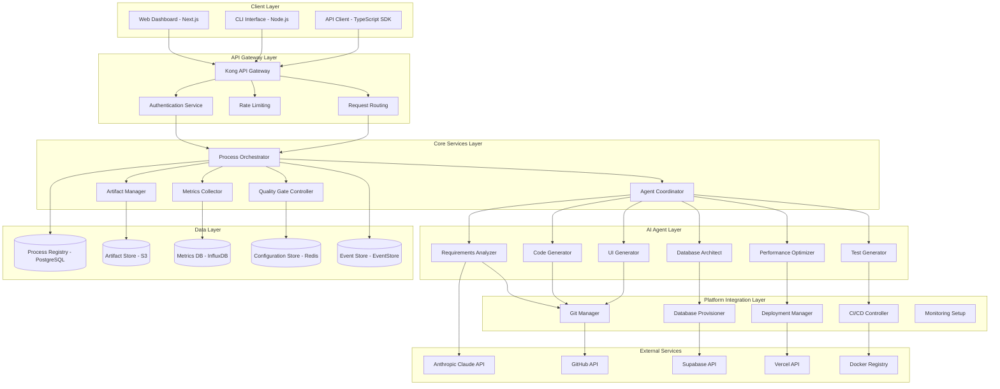
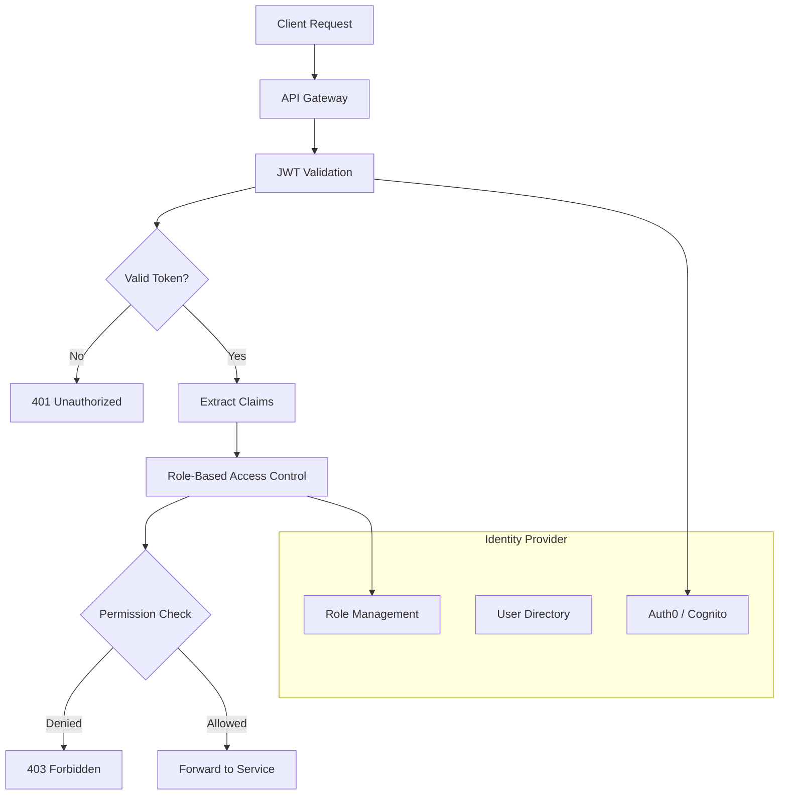
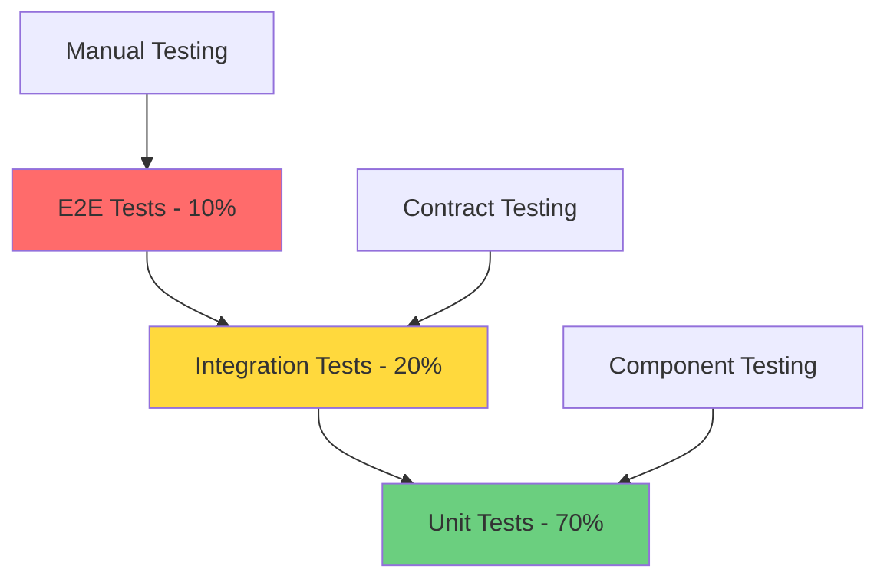

# Application Scaffold System - High Level Design (HLD)

**Version:** 1.0.0  
**Date:** 2025-10-04  
**System:** AI-Augmented Application Scaffold Platform  
**Architecture:** Cloud-Native, Event-Driven, AI-First

---

## System Overview

The Application Scaffold System is a distributed, AI-augmented platform that orchestrates the rapid development of applications through a 9-phase automated process. The system leverages a microservices architecture with event-driven communication, integrated AI agents, and comprehensive process ontology management.

### Core Architecture Principles

1. **AI-Native Design**: Built from ground-up for AI agent integration and coordination
2. **Event-Driven Architecture**: Asynchronous, loosely-coupled components with high scalability
3. **Ontology-Driven**: All operations grounded in formal ontology definitions
4. **Cloud-First**: Designed for modern cloud infrastructure with auto-scaling
5. **Security by Design**: End-to-end security with zero-trust principles

---

## System Architecture

### High-Level Architecture Diagram



---

## Component Design

### 1. Process Orchestrator Service

**Responsibility**: Central coordination of the application scaffold process

**Technology Stack**:
- **Runtime**: Node.js with TypeScript
- **Framework**: Express.js with OpenAPI
- **Process Engine**: Custom state machine with event sourcing
- **Messaging**: Redis pub/sub + EventStore

**Key Components**:

```typescript
interface ProcessOrchestrator {
  // Process Lifecycle Management
  initiateProcess(requirements: BusinessRequirements): ProcessInstance
  executePhase(processId: string, phaseId: string): PhaseExecution
  validatePhaseCompletion(processId: string, phaseId: string): ValidationResult
  transitionToNextPhase(processId: string): PhaseTransition
  
  // State Management
  getProcessState(processId: string): ProcessState
  updateProcessState(processId: string, state: Partial<ProcessState>): void
  persistProcessSnapshot(processId: string): void
  
  // Exception Handling
  handlePhaseFailure(processId: string, error: ProcessError): RecoveryPlan
  escalateToHuman(processId: string, escalation: EscalationRequest): void
  retryPhase(processId: string, phaseId: string): PhaseExecution
}

interface ProcessState {
  processId: string
  currentPhase: PhaseDefinition
  overallProgress: number
  phaseProgress: number
  metrics: ProcessMetrics
  artifacts: ArtifactReference[]
  gates: QualityGateStatus[]
  agentAssignments: AgentAssignment[]
  timeline: ProcessTimeline
  status: 'initiated' | 'executing' | 'paused' | 'completed' | 'failed'
}
```

**Event Handling**:
```typescript
// Events Published
- ProcessInitiated
- PhaseStarted
- PhaseCompleted
- QualityGatePassed
- QualityGateFailed
- ProcessCompleted
- ProcessFailed
- ArtifactGenerated

// Events Consumed
- AgentTaskCompleted
- ArtifactValidated
- QualityGateEvaluated
- MetricUpdated
- ExternalIntegrationCompleted
```

### 2. Agent Coordinator Service

**Responsibility**: Coordinate AI agents and manage their interactions

**Key Components**:

```typescript
interface AgentCoordinator {
  // Agent Management
  deployAgent(agentType: AgentType, phase: PhaseDefinition): AgentInstance
  coordinnateAgents(agentGroup: AgentInstance[]): CoordinationResult
  monitorAgentPerformance(agentId: string): PerformanceMetrics
  
  // Task Delegation
  delegateTask(task: AgentTask, agent: AgentInstance): TaskExecution
  validateAgentOutput(agentId: string, output: any): ValidationResult
  escalateAgentFailure(agentId: string, failure: AgentFailure): EscalationPlan
  
  // Agent Communication
  sendMessage(fromAgent: string, toAgent: string, message: AgentMessage): void
  broadcastToAgents(agentGroup: string[], message: AgentMessage): void
  collectAgentResponses(requestId: string): AgentResponse[]
}

interface AgentInstance {
  agentId: string
  agentType: 'requirements-analyzer' | 'code-generator' | 'database-architect' | 
             'ui-generator' | 'test-generator' | 'performance-optimizer'
  autonomyLevel: 'manual' | 'supervised' | 'highly-autonomous' | 'fully-autonomous'
  capabilities: string[]
  currentTask?: AgentTask
  performanceMetrics: AgentPerformanceMetrics
  status: 'idle' | 'busy' | 'error' | 'offline'
}
```

### 3. AI Agent Implementations

#### Requirements Analyzer Agent

```typescript
interface RequirementsAnalyzer extends AIAgent {
  analyzeBusinessRequirements(requirements: string): BusinessAnalysis
  mapToSchemaOrg(entities: string[]): SchemaOrgMapping[]
  identifyExtensions(mappings: SchemaOrgMapping[]): ExtensionDefinition[]
  generateOntologyConfig(analysis: BusinessAnalysis): OntologyConfig
  validateRequirements(config: OntologyConfig): ValidationReport
}

// Implementation using Claude API
class ClaudeRequirementsAnalyzer implements RequirementsAnalyzer {
  private anthropicClient: Anthropic
  
  async analyzeBusinessRequirements(requirements: string): Promise<BusinessAnalysis> {
    const prompt = `
    Analyze the following business requirements and extract:
    1. Core domain entities
    2. Business objectives
    3. Use cases and user stories
    4. Constraints and assumptions
    
    Requirements: ${requirements}
    
    Respond with structured JSON following BusinessAnalysis schema.
    `
    
    const response = await this.anthropicClient.messages.create({
      model: 'claude-sonnet-4-20250514',
      max_tokens: 4000,
      messages: [{ role: 'user', content: prompt }]
    })
    
    return JSON.parse(response.content[0].text)
  }
}
```

#### Code Generator Agent

```typescript
interface CodeGenerator extends AIAgent {
  generateTypeScriptTypes(ontologyConfig: OntologyConfig): TypeDefinitions
  generateZodSchemas(types: TypeDefinitions): ZodSchemas
  generateReactComponents(entities: EntityDefinition[]): ReactComponents
  generateAPIRoutes(entities: EntityDefinition[]): APIRoutes
  generateDatabaseSchemas(entities: EntityDefinition[]): DatabaseSchema
}

class ClaudeCodeGenerator implements CodeGenerator {
  async generateTypeScriptTypes(ontologyConfig: OntologyConfig): Promise<TypeDefinitions> {
    // Use Claude to generate TypeScript interfaces from ontology
    const prompt = this.buildTypeGenerationPrompt(ontologyConfig)
    const response = await this.callClaude(prompt)
    
    return {
      files: this.parseGeneratedTypes(response),
      exports: this.extractExports(response),
      dependencies: this.extractDependencies(response)
    }
  }
  
  private buildTypeGenerationPrompt(config: OntologyConfig): string {
    return `
    Generate TypeScript type definitions for the following ontology:
    
    ${JSON.stringify(config, null, 2)}
    
    Requirements:
    - Use schema.org base types where possible
    - Generate proper interfaces with JSDoc comments
    - Include validation decorators
    - Follow TypeScript best practices
    - Export all types for external use
    
    Generate complete, production-ready TypeScript files.
    `
  }
}
```

### 4. Quality Gate Controller

**Responsibility**: Enforce quality gates and validation across all phases

```typescript
interface QualityGateController {
  // Gate Management
  defineQualityGate(phaseId: string, criteria: QualityCriteria[]): QualityGate
  evaluateGate(gateId: string, artifacts: Artifact[]): GateEvaluation
  getGateStatus(processId: string): QualityGateStatus[]
  
  // Validation Rules
  registerValidator(validator: ArtifactValidator): void
  runValidation(artifact: Artifact, rules: ValidationRule[]): ValidationResult
  generateQualityReport(processId: string): QualityReport
}

interface QualityGate {
  gateId: string
  phaseId: string
  criteria: QualityCriteria[]
  validators: ArtifactValidator[]
  approvers: string[]
  automationLevel: 'full' | 'partial' | 'manual'
  passThreshold: number
}

// Example Quality Gates
const domainApprovalGate: QualityGate = {
  gateId: 'domain-approval',
  phaseId: 'domain-definition',
  criteria: [
    { name: 'requirements-complete', weight: 0.3, validator: 'requirements-validator' },
    { name: 'schema-mapped', weight: 0.4, validator: 'schema-mapping-validator' },
    { name: 'objectives-clear', weight: 0.3, validator: 'objectives-validator' }
  ],
  validators: ['RequirementsValidator', 'SchemaMappingValidator'],
  approvers: ['enterprise-architect', 'domain-expert'],
  automationLevel: 'partial',
  passThreshold: 0.85
}
```

### 5. Artifact Manager Service

**Responsibility**: Manage generation, storage, and versioning of all process artifacts

```typescript
interface ArtifactManager {
  // Artifact Lifecycle
  createArtifact(artifact: ArtifactDefinition): Artifact
  storeArtifact(artifact: Artifact): ArtifactReference
  retrieveArtifact(reference: ArtifactReference): Artifact
  versionArtifact(artifactId: string): ArtifactVersion
  
  // Organization & Discovery
  organizeArtifactsByPhase(processId: string): PhaseArtifacts
  searchArtifacts(query: ArtifactQuery): Artifact[]
  getArtifactDependencies(artifactId: string): Artifact[]
  
  // Validation & Quality
  validateArtifact(artifact: Artifact): ValidationResult
  calculateArtifactQuality(artifact: Artifact): QualityScore
  generateArtifactDocumentation(artifact: Artifact): Documentation
}

interface Artifact {
  artifactId: string
  type: ArtifactType
  phaseId: string
  processId: string
  content: ArtifactContent
  metadata: ArtifactMetadata
  quality: QualityScore
  dependencies: ArtifactReference[]
  version: string
  createdAt: Date
  createdBy: string // AI Agent or User
}

// Artifact Storage Strategy
interface ArtifactStorage {
  // File-based artifacts (code, configs, docs)
  fileStore: S3BucketStrategy
  
  // Structured data artifacts (schemas, metrics)
  structuredStore: PostgreSQLStrategy
  
  // Large binary artifacts (builds, images)
  binaryStore: S3BucketStrategy
  
  // Temporary artifacts (intermediate processing)
  tempStore: RedisStrategy
}
```

---

## Data Architecture

### Database Design

#### Process Registry (PostgreSQL)

```sql
-- Core process management tables
CREATE TABLE processes (
    process_id UUID PRIMARY KEY,
    process_name VARCHAR(255) NOT NULL,
    process_type VARCHAR(100) NOT NULL,
    business_objectives JSONB NOT NULL,
    current_phase_id VARCHAR(100),
    overall_progress DECIMAL(5,2),
    status VARCHAR(50) NOT NULL,
    created_at TIMESTAMP WITH TIME ZONE DEFAULT CURRENT_TIMESTAMP,
    updated_at TIMESTAMP WITH TIME ZONE DEFAULT CURRENT_TIMESTAMP,
    created_by VARCHAR(255),
    metadata JSONB
);

CREATE TABLE process_phases (
    phase_id UUID PRIMARY KEY,
    process_id UUID REFERENCES processes(process_id),
    phase_name VARCHAR(255) NOT NULL,
    sequence_order INTEGER NOT NULL,
    parallel_execution BOOLEAN DEFAULT FALSE,
    estimated_duration INTERVAL,
    actual_duration INTERVAL,
    phase_progress DECIMAL(5,2),
    status VARCHAR(50) NOT NULL,
    started_at TIMESTAMP WITH TIME ZONE,
    completed_at TIMESTAMP WITH TIME ZONE,
    dependencies JSONB,
    UNIQUE(process_id, sequence_order)
);

CREATE TABLE artifacts (
    artifact_id UUID PRIMARY KEY,
    process_id UUID REFERENCES processes(process_id),
    phase_id UUID REFERENCES process_phases(phase_id),
    artifact_type VARCHAR(100) NOT NULL,
    artifact_name VARCHAR(255) NOT NULL,
    content_type VARCHAR(100),
    storage_location TEXT NOT NULL,
    file_size BIGINT,
    quality_score DECIMAL(5,2),
    created_at TIMESTAMP WITH TIME ZONE DEFAULT CURRENT_TIMESTAMP,
    created_by VARCHAR(255),
    metadata JSONB
);

CREATE TABLE quality_gates (
    gate_id UUID PRIMARY KEY,
    phase_id UUID REFERENCES process_phases(phase_id),
    gate_name VARCHAR(255) NOT NULL,
    gate_type VARCHAR(100) NOT NULL,
    criteria JSONB NOT NULL,
    approvers JSONB,
    evaluation_result JSONB,
    status VARCHAR(50) NOT NULL,
    evaluated_at TIMESTAMP WITH TIME ZONE,
    approved_by VARCHAR(255)
);

CREATE TABLE process_metrics (
    metric_id UUID PRIMARY KEY,
    process_id UUID REFERENCES processes(process_id),
    metric_name VARCHAR(255) NOT NULL,
    metric_type VARCHAR(100) NOT NULL,
    target_value DECIMAL(10,2),
    actual_value DECIMAL(10,2),
    unit VARCHAR(50),
    measured_at TIMESTAMP WITH TIME ZONE DEFAULT CURRENT_TIMESTAMP,
    metadata JSONB
);

-- Agent management tables
CREATE TABLE ai_agents (
    agent_id UUID PRIMARY KEY,
    agent_type VARCHAR(100) NOT NULL,
    agent_name VARCHAR(255) NOT NULL,
    capabilities JSONB NOT NULL,
    autonomy_level VARCHAR(50) NOT NULL,
    status VARCHAR(50) NOT NULL,
    performance_metrics JSONB,
    created_at TIMESTAMP WITH TIME ZONE DEFAULT CURRENT_TIMESTAMP,
    last_active TIMESTAMP WITH TIME ZONE
);

CREATE TABLE agent_assignments (
    assignment_id UUID PRIMARY KEY,
    agent_id UUID REFERENCES ai_agents(agent_id),
    process_id UUID REFERENCES processes(process_id),
    phase_id UUID REFERENCES process_phases(phase_id),
    task_description TEXT,
    assigned_at TIMESTAMP WITH TIME ZONE DEFAULT CURRENT_TIMESTAMP,
    completed_at TIMESTAMP WITH TIME ZONE,
    status VARCHAR(50) NOT NULL,
    results JSONB
);

-- Indexes for performance
CREATE INDEX idx_processes_status ON processes(status);
CREATE INDEX idx_processes_created_at ON processes(created_at);
CREATE INDEX idx_process_phases_process_id ON process_phases(process_id);
CREATE INDEX idx_artifacts_process_id ON artifacts(process_id);
CREATE INDEX idx_quality_gates_phase_id ON quality_gates(phase_id);
CREATE INDEX idx_agent_assignments_agent_id ON agent_assignments(agent_id);
```

#### Event Store Schema

```sql
-- Event sourcing for process state management
CREATE TABLE event_streams (
    stream_id UUID PRIMARY KEY,
    stream_type VARCHAR(100) NOT NULL,
    aggregate_id UUID NOT NULL,
    version INTEGER NOT NULL DEFAULT 0,
    created_at TIMESTAMP WITH TIME ZONE DEFAULT CURRENT_TIMESTAMP,
    UNIQUE(aggregate_id, stream_type)
);

CREATE TABLE events (
    event_id UUID PRIMARY KEY,
    stream_id UUID REFERENCES event_streams(stream_id),
    event_type VARCHAR(100) NOT NULL,
    event_version INTEGER NOT NULL,
    event_data JSONB NOT NULL,
    event_metadata JSONB,
    occurred_at TIMESTAMP WITH TIME ZONE DEFAULT CURRENT_TIMESTAMP,
    sequence_number SERIAL
);

-- Event types for process management
-- ProcessInitiated, PhaseStarted, PhaseCompleted, ArtifactGenerated,
-- QualityGatePassed, QualityGateFailed, ProcessCompleted, etc.
```

### Metrics Database (InfluxDB)

```flux
// Time-series data for performance monitoring
bucket: "process_metrics"

// Measurement schemas
process_performance {
  time: timestamp,
  process_id: string,
  phase_id: string,
  metric_name: string,
  value: float,
  unit: string,
  tags: {
    process_type: string,
    agent_id: string,
    status: string
  }
}

agent_performance {
  time: timestamp,
  agent_id: string,
  agent_type: string,
  task_duration: float,
  task_success: boolean,
  quality_score: float,
  tags: {
    process_id: string,
    phase_id: string,
    task_type: string
  }
}

system_metrics {
  time: timestamp,
  service_name: string,
  cpu_usage: float,
  memory_usage: float,
  request_count: int,
  response_time: float,
  error_rate: float
}
```

---

## API Design

### RESTful API Endpoints

```yaml
openapi: 3.0.0
info:
  title: Application Scaffold API
  version: 1.0.0
  description: API for AI-augmented application scaffolding

paths:
  /api/v1/processes:
    post:
      summary: Initiate new scaffold process
      requestBody:
        required: true
        content:
          application/json:
            schema:
              $ref: '#/components/schemas/ProcessInitiationRequest'
      responses:
        '201':
          description: Process initiated successfully
          content:
            application/json:
              schema:
                $ref: '#/components/schemas/ProcessInstance'
    
    get:
      summary: List processes
      parameters:
        - name: status
          in: query
          schema:
            type: string
            enum: [initiated, executing, completed, failed]
        - name: limit
          in: query
          schema:
            type: integer
            default: 20
      responses:
        '200':
          description: List of processes
          content:
            application/json:
              schema:
                type: array
                items:
                  $ref: '#/components/schemas/ProcessSummary'
  
  /api/v1/processes/{processId}:
    get:
      summary: Get process details
      parameters:
        - name: processId
          in: path
          required: true
          schema:
            type: string
            format: uuid
      responses:
        '200':
          description: Process details
          content:
            application/json:
              schema:
                $ref: '#/components/schemas/ProcessInstance'
    
    patch:
      summary: Update process
      parameters:
        - name: processId
          in: path
          required: true
          schema:
            type: string
            format: uuid
      requestBody:
        required: true
        content:
          application/json:
            schema:
              $ref: '#/components/schemas/ProcessUpdate'
      responses:
        '200':
          description: Process updated successfully

  /api/v1/processes/{processId}/phases:
    get:
      summary: Get process phases
      responses:
        '200':
          description: List of phases
          content:
            application/json:
              schema:
                type: array
                items:
                  $ref: '#/components/schemas/ProcessPhase'
  
  /api/v1/processes/{processId}/artifacts:
    get:
      summary: Get process artifacts
      responses:
        '200':
          description: List of artifacts
          content:
            application/json:
              schema:
                type: array
                items:
                  $ref: '#/components/schemas/Artifact'
  
  /api/v1/processes/{processId}/metrics:
    get:
      summary: Get process metrics
      responses:
        '200':
          description: Process metrics
          content:
            application/json:
              schema:
                $ref: '#/components/schemas/ProcessMetrics'

components:
  schemas:
    ProcessInitiationRequest:
      type: object
      required:
        - processName
        - businessObjectives
        - targetPlatform
      properties:
        processName:
          type: string
          example: "SaaS Integration Platform"
        businessObjectives:
          type: array
          items:
            type: string
          example: ["API connectivity management", "Data flow orchestration"]
        targetPlatform:
          type: string
          enum: [nextjs-supabase, react-firebase, vue-postgresql]
        timeline:
          type: string
          example: "14 days"
        qualityTargets:
          $ref: '#/components/schemas/QualityTargets'
    
    ProcessInstance:
      type: object
      properties:
        processId:
          type: string
          format: uuid
        processName:
          type: string
        status:
          type: string
          enum: [initiated, executing, paused, completed, failed]
        currentPhase:
          $ref: '#/components/schemas/ProcessPhase'
        overallProgress:
          type: number
          minimum: 0
          maximum: 100
        metrics:
          $ref: '#/components/schemas/ProcessMetrics'
        estimatedCompletion:
          type: string
          format: date-time
        createdAt:
          type: string
          format: date-time
        updatedAt:
          type: string
          format: date-time
```

### GraphQL Schema

```graphql
type Query {
  processes(filter: ProcessFilter, pagination: Pagination): ProcessConnection
  process(id: ID!): Process
  processMetrics(processId: ID!): ProcessMetrics
  artifacts(processId: ID!, phaseId: String): [Artifact]
  qualityGates(processId: ID!): [QualityGate]
}

type Mutation {
  initiateProcess(input: ProcessInitiationInput!): ProcessInitiationResult
  updateProcess(id: ID!, input: ProcessUpdateInput!): Process
  approveQualityGate(gateId: ID!, approval: ApprovalInput!): QualityGate
  retryPhase(processId: ID!, phaseId: String!): PhaseExecution
}

type Subscription {
  processUpdates(processId: ID!): ProcessUpdate
  phaseProgress(processId: ID!, phaseId: String!): PhaseProgress
  artifactGenerated(processId: ID!): Artifact
  qualityGateEvaluated(processId: ID!): QualityGate
}

type Process {
  id: ID!
  processName: String!
  businessObjectives: [String!]!
  status: ProcessStatus!
  currentPhase: ProcessPhase
  phases: [ProcessPhase!]!
  artifacts: [Artifact!]!
  qualityGates: [QualityGate!]!
  metrics: ProcessMetrics!
  overallProgress: Float!
  timeline: ProcessTimeline!
  createdAt: DateTime!
  updatedAt: DateTime!
}

type ProcessPhase {
  id: ID!
  phaseName: String!
  sequenceOrder: Int!
  parallelExecution: Boolean!
  estimatedDuration: Duration
  actualDuration: Duration
  progress: Float!
  status: PhaseStatus!
  artifacts: [Artifact!]!
  qualityGates: [QualityGate!]!
  aiAgents: [AIAgent!]!
  dependencies: [ProcessPhase!]!
  startedAt: DateTime
  completedAt: DateTime
}

type Artifact {
  id: ID!
  artifactType: ArtifactType!
  artifactName: String!
  contentType: String!
  storageLocation: String!
  fileSize: Int
  qualityScore: Float
  metadata: JSON
  createdAt: DateTime!
  createdBy: String!
}

type ProcessMetrics {
  timeToMvp: MetricValue!
  aiAutomationPercentage: MetricValue!
  codeQualityScore: MetricValue!
  hypothesisValidation: [HypothesisStatus!]!
  resourceUtilization: ResourceMetrics!
}

enum ProcessStatus {
  INITIATED
  EXECUTING  
  PAUSED
  COMPLETED
  FAILED
}

enum PhaseStatus {
  PENDING
  EXECUTING
  COMPLETED
  FAILED
  BLOCKED
}

enum ArtifactType {
  DOCUMENT
  CODE
  CONFIGURATION
  MODEL
  DASHBOARD
  REPORT
}
```

---

## Security Architecture

### Authentication & Authorization



**Security Implementation**:

```typescript
// JWT Token Structure
interface JWTPayload {
  sub: string // User ID
  email: string
  roles: string[] // ['admin', 'process-manager', 'developer', 'viewer']
  permissions: string[] // ['process:create', 'process:read', 'artifact:download']
  org: string // Organization ID
  exp: number
  iat: number
}

// Role-Based Permissions
const rolePermissions = {
  'admin': [
    'process:*',
    'artifact:*', 
    'metrics:*',
    'agent:*',
    'system:*'
  ],
  'process-manager': [
    'process:create',
    'process:read',
    'process:update',
    'artifact:read',
    'artifact:download',
    'metrics:read',
    'agent:read'
  ],
  'developer': [
    'process:read',
    'artifact:read',
    'artifact:download',
    'metrics:read'
  ],
  'viewer': [
    'process:read',
    'metrics:read'
  ]
}

// API Authorization Middleware
async function authorizeRequest(req: Request, requiredPermission: string): Promise<boolean> {
  const token = extractJWTToken(req)
  const payload = await validateAndDecodeJWT(token)
  
  const userPermissions = await getUserPermissions(payload.sub, payload.roles)
  return hasPermission(userPermissions, requiredPermission)
}
```

### Data Protection

```typescript
// Encryption at Rest
interface EncryptionConfig {
  algorithm: 'AES-256-GCM'
  keyManagement: 'AWS-KMS' | 'Azure-KeyVault' | 'HashiCorp-Vault'
  keyRotation: 'daily' | 'weekly' | 'monthly'
  encryptionScope: 'field-level' | 'table-level' | 'database-level'
}

// Sensitive Data Fields (Always Encrypted)
const sensitiveFields = [
  'businessRequirements',
  'intellectualProperty',
  'apiKeys',
  'connectionStrings',
  'personalData'
]

// Encryption Implementation
class DataEncryption {
  async encryptSensitiveData(data: any): Promise<EncryptedData> {
    const encryptionKey = await this.keyManager.getActiveKey()
    const encrypted = await this.encrypt(JSON.stringify(data), encryptionKey)
    
    return {
      encryptedData: encrypted.ciphertext,
      keyId: encryptionKey.id,
      algorithm: 'AES-256-GCM',
      iv: encrypted.iv,
      authTag: encrypted.authTag
    }
  }
  
  async decryptSensitiveData(encryptedData: EncryptedData): Promise<any> {
    const decryptionKey = await this.keyManager.getKey(encryptedData.keyId)
    const decrypted = await this.decrypt(encryptedData, decryptionKey)
    
    return JSON.parse(decrypted)
  }
}
```

### Network Security

```yaml
# Network Security Configuration
network_security:
  api_gateway:
    tls_version: "1.3"
    cipher_suites: 
      - "TLS_AES_256_GCM_SHA384"
      - "TLS_CHACHA20_POLY1305_SHA256"
    hsts_enabled: true
    csrf_protection: true
    
  service_mesh:
    mtls_enabled: true
    certificate_rotation: "24h"
    traffic_encryption: "end-to-end"
    
  firewall_rules:
    inbound:
      - port: 443
        protocol: HTTPS
        source: "internet"
      - port: 80
        protocol: HTTP
        source: "internet"
        action: "redirect_to_https"
    
    internal:
      - protocol: "service-mesh"
        encryption: "mtls"
        authentication: "required"
        
  ddos_protection:
    enabled: true
    rate_limiting:
      requests_per_minute: 1000
      burst_limit: 100
    
  waf_rules:
    sql_injection: "block"
    xss_protection: "block"
    file_upload_scanning: "enabled"
```

---

## Deployment Architecture

### Container Strategy

```dockerfile
# Multi-stage build for Process Orchestrator
FROM node:18-alpine AS builder
WORKDIR /app
COPY package*.json ./
RUN npm ci --only=production

FROM node:18-alpine AS runtime
WORKDIR /app
COPY --from=builder /app/node_modules ./node_modules
COPY . .
EXPOSE 3000
HEALTHCHECK --interval=30s --timeout=3s --start-period=5s --retries=3 \
  CMD curl -f http://localhost:3000/health || exit 1
CMD ["npm", "start"]
```

```yaml
# Kubernetes Deployment
apiVersion: apps/v1
kind: Deployment
metadata:
  name: process-orchestrator
  labels:
    app: process-orchestrator
    version: v1.0.0
spec:
  replicas: 3
  selector:
    matchLabels:
      app: process-orchestrator
  template:
    metadata:
      labels:
        app: process-orchestrator
        version: v1.0.0
    spec:
      containers:
      - name: process-orchestrator
        image: app-scaffold/process-orchestrator:v1.0.0
        ports:
        - containerPort: 3000
        env:
        - name: DATABASE_URL
          valueFrom:
            secretKeyRef:
              name: database-credentials
              key: url
        - name: ANTHROPIC_API_KEY
          valueFrom:
            secretKeyRef:
              name: ai-credentials
              key: anthropic-key
        resources:
          requests:
            memory: "256Mi"
            cpu: "250m"
          limits:
            memory: "512Mi"
            cpu: "500m"
        livenessProbe:
          httpGet:
            path: /health
            port: 3000
          initialDelaySeconds: 30
          periodSeconds: 30
        readinessProbe:
          httpGet:
            path: /ready
            port: 3000
          initialDelaySeconds: 5
          periodSeconds: 5
---
apiVersion: v1
kind: Service
metadata:
  name: process-orchestrator-service
spec:
  selector:
    app: process-orchestrator
  ports:
  - protocol: TCP
    port: 80
    targetPort: 3000
  type: ClusterIP
```

### Infrastructure as Code (Terraform)

```hcl
# Main infrastructure configuration
provider "aws" {
  region = var.aws_region
}

# EKS Cluster for main application
module "eks" {
  source = "terraform-aws-modules/eks/aws"
  
  cluster_name    = "app-scaffold-cluster"
  cluster_version = "1.28"
  
  vpc_id     = module.vpc.vpc_id
  subnet_ids = module.vpc.private_subnets
  
  node_groups = {
    main = {
      desired_capacity = 3
      max_capacity     = 10
      min_capacity     = 3
      
      instance_types = ["t3.medium"]
      
      k8s_labels = {
        Environment = var.environment
        Application = "app-scaffold"
      }
    }
  }
}

# RDS for Process Registry
resource "aws_db_instance" "process_registry" {
  identifier = "app-scaffold-registry"
  
  engine         = "postgres"
  engine_version = "15.4"
  instance_class = "db.t3.micro"
  
  allocated_storage     = 20
  max_allocated_storage = 100
  storage_encrypted     = true
  
  db_name  = "process_registry"
  username = var.db_username
  password = var.db_password
  
  vpc_security_group_ids = [aws_security_group.rds.id]
  db_subnet_group_name   = aws_db_subnet_group.main.name
  
  backup_retention_period = 7
  backup_window          = "03:00-04:00"
  maintenance_window     = "sun:04:00-sun:05:00"
  
  skip_final_snapshot = false
  final_snapshot_identifier = "app-scaffold-registry-final-${formatdate("YYYY-MM-DD-hhmm", timestamp())}"
  
  tags = {
    Name        = "app-scaffold-registry"
    Environment = var.environment
  }
}

# ElastiCache for Redis
resource "aws_elasticache_subnet_group" "main" {
  name       = "app-scaffold-cache-subnet"
  subnet_ids = module.vpc.private_subnets
}

resource "aws_elasticache_replication_group" "redis" {
  replication_group_id         = "app-scaffold-redis"
  description                  = "Redis cluster for caching and session management"
  
  port                = 6379
  parameter_group_name = "default.redis7"
  
  num_cache_clusters = 2
  node_type         = "cache.t3.micro"
  
  subnet_group_name = aws_elasticache_subnet_group.main.name
  security_group_ids = [aws_security_group.redis.id]
  
  at_rest_encryption_enabled = true
  transit_encryption_enabled = true
  
  tags = {
    Name        = "app-scaffold-redis"
    Environment = var.environment
  }
}

# S3 for Artifact Storage
resource "aws_s3_bucket" "artifacts" {
  bucket = "app-scaffold-artifacts-${var.environment}-${random_id.bucket_suffix.hex}"
  
  tags = {
    Name        = "app-scaffold-artifacts"
    Environment = var.environment
  }
}

resource "aws_s3_bucket_encryption_configuration" "artifacts" {
  bucket = aws_s3_bucket.artifacts.id
  
  rule {
    apply_server_side_encryption_by_default {
      sse_algorithm = "AES256"
    }
  }
}

resource "aws_s3_bucket_versioning" "artifacts" {
  bucket = aws_s3_bucket.artifacts.id
  versioning_configuration {
    status = "Enabled"
  }
}

# CloudWatch for Monitoring
resource "aws_cloudwatch_log_group" "app_logs" {
  name              = "/aws/eks/app-scaffold/application"
  retention_in_days = 30
  
  tags = {
    Environment = var.environment
    Application = "app-scaffold"
  }
}

# Variables
variable "aws_region" {
  description = "AWS region"
  type        = string
  default     = "us-west-2"
}

variable "environment" {
  description = "Environment name"
  type        = string
  default     = "production"
}

variable "db_username" {
  description = "Database username"
  type        = string
  sensitive   = true
}

variable "db_password" {
  description = "Database password"
  type        = string
  sensitive   = true
}

resource "random_id" "bucket_suffix" {
  byte_length = 4
}
```

---

## Monitoring & Observability

### Metrics Collection

```yaml
# Prometheus Configuration
global:
  scrape_interval: 15s
  evaluation_interval: 15s

rule_files:
  - "process_alerts.yml"
  - "agent_alerts.yml"
  - "system_alerts.yml"

scrape_configs:
  - job_name: 'process-orchestrator'
    static_configs:
      - targets: ['process-orchestrator:3000']
    metrics_path: '/metrics'
    scrape_interval: 10s
    
  - job_name: 'agent-coordinator'
    static_configs:
      - targets: ['agent-coordinator:3001']
    metrics_path: '/metrics'
    scrape_interval: 10s
    
  - job_name: 'quality-gate-controller'
    static_configs:
      - targets: ['quality-gate-controller:3002']
    metrics_path: '/metrics'
    scrape_interval: 10s
    
  - job_name: 'kubernetes-pods'
    kubernetes_sd_configs:
      - role: pod
    relabel_configs:
      - source_labels: [__meta_kubernetes_pod_annotation_prometheus_io_scrape]
        action: keep
        regex: true
```

### Custom Metrics

```typescript
// Process Metrics
interface ProcessMetrics {
  // Performance Metrics
  processExecutionTime: Histogram
  phaseTransitionTime: Histogram
  artifactGenerationTime: Histogram
  qualityGateEvaluationTime: Histogram
  
  // Success Metrics  
  processSuccessRate: Counter
  phaseSuccessRate: Counter
  qualityGatePassRate: Counter
  
  // AI Agent Metrics
  agentTaskDuration: Histogram
  agentSuccessRate: Counter
  agentCoordinationEfficiency: Gauge
  
  // Business Metrics
  timeToMvp: Histogram
  aiAutomationPercentage: Gauge
  codeQualityScore: Gauge
  hypothesisValidationRate: Counter
}

// Metrics Implementation
class MetricsCollector {
  private prometheus = require('prom-client')
  
  processExecutionTime = new this.prometheus.Histogram({
    name: 'process_execution_duration_seconds',
    help: 'Duration of complete process execution',
    labelNames: ['process_type', 'status'],
    buckets: [60, 300, 900, 1800, 3600, 7200, 14400] // seconds
  })
  
  phaseTransitionTime = new this.prometheus.Histogram({
    name: 'phase_transition_duration_seconds', 
    help: 'Time taken for phase transitions',
    labelNames: ['from_phase', 'to_phase', 'process_id'],
    buckets: [1, 5, 10, 30, 60, 120, 300] // seconds
  })
  
  aiAutomationPercentage = new this.prometheus.Gauge({
    name: 'ai_automation_percentage',
    help: 'Percentage of activities automated by AI',
    labelNames: ['process_id', 'phase_id']
  })
  
  codeQualityScore = new this.prometheus.Gauge({
    name: 'code_quality_score',
    help: 'Composite code quality score',
    labelNames: ['process_id', 'artifact_type']
  })
  
  recordProcessCompletion(processId: string, duration: number, status: string) {
    this.processExecutionTime
      .labels({ process_type: 'application-scaffold', status })
      .observe(duration)
  }
  
  recordPhaseTransition(fromPhase: string, toPhase: string, processId: string, duration: number) {
    this.phaseTransitionTime
      .labels({ from_phase: fromPhase, to_phase: toPhase, process_id: processId })
      .observe(duration)
  }
}
```

### Alerting Rules

```yaml
# process_alerts.yml
groups:
  - name: process_alerts
    rules:
      - alert: ProcessExecutionTimeHigh
        expr: histogram_quantile(0.95, process_execution_duration_seconds) > 86400
        for: 5m
        labels:
          severity: warning
        annotations:
          summary: "Process execution time is exceeding 24 hours"
          description: "95th percentile of process execution time is {{ $value }} seconds"
          
      - alert: ProcessFailureRateHigh
        expr: rate(process_success_rate[5m]) < 0.9
        for: 2m
        labels:
          severity: critical
        annotations:
          summary: "Process failure rate is above 10%"
          description: "Process success rate has dropped to {{ $value }}%"
          
      - alert: QualityGateFailureSpike
        expr: increase(quality_gate_pass_rate[5m]) < 0.8
        for: 1m
        labels:
          severity: warning
        annotations:
          summary: "Quality gate failures increasing"
          description: "Quality gate pass rate has dropped to {{ $value }}%"
          
      - alert: AIAutomationBelowTarget
        expr: avg(ai_automation_percentage) < 80
        for: 10m
        labels:
          severity: warning
        annotations:
          summary: "AI automation percentage below target"
          description: "Current AI automation is {{ $value }}%, target is 80%"
```

### Dashboards

```json
{
  "dashboard": {
    "title": "Application Scaffold System - Overview",
    "panels": [
      {
        "title": "Active Processes",
        "type": "stat",
        "targets": [
          {
            "expr": "count(process_status{status=\"executing\"})",
            "legendFormat": "Executing"
          },
          {
            "expr": "count(process_status{status=\"completed\"})",
            "legendFormat": "Completed Today"
          }
        ]
      },
      {
        "title": "Process Success Rate",
        "type": "gauge", 
        "targets": [
          {
            "expr": "rate(process_success_rate[24h]) * 100",
            "legendFormat": "Success Rate %"
          }
        ],
        "fieldConfig": {
          "min": 0,
          "max": 100,
          "thresholds": [
            {"color": "red", "value": 0},
            {"color": "yellow", "value": 85},
            {"color": "green", "value": 95}
          ]
        }
      },
      {
        "title": "Time to MVP Distribution",
        "type": "histogram",
        "targets": [
          {
            "expr": "histogram_quantile(0.5, process_execution_duration_seconds)",
            "legendFormat": "P50"
          },
          {
            "expr": "histogram_quantile(0.95, process_execution_duration_seconds)", 
            "legendFormat": "P95"
          },
          {
            "expr": "histogram_quantile(0.99, process_execution_duration_seconds)",
            "legendFormat": "P99"
          }
        ]
      },
      {
        "title": "AI Agent Performance",
        "type": "table",
        "targets": [
          {
            "expr": "avg by (agent_type) (agent_task_duration_seconds)",
            "format": "table"
          }
        ]
      }
    ]
  }
}
```

---

## Performance & Scalability

### Performance Requirements

| Component | Requirement | Measurement |
|-----------|-------------|-------------|
| API Response Time | < 200ms P95 | HTTP request duration |
| Process Initiation | < 30 seconds | Time to first phase start |
| Phase Transition | < 30 seconds | Phase completion to next start |
| Artifact Generation | < 5 minutes | Agent task completion time |
| Quality Gate Evaluation | < 60 seconds | Gate validation duration |
| Database Queries | < 100ms P95 | Query execution time |
| File Upload | < 30 seconds | Artifact storage time |

### Scalability Design

```typescript
// Horizontal Scaling Strategy
interface ScalingConfiguration {
  // Auto-scaling based on metrics
  processOrchestrator: {
    minReplicas: 2,
    maxReplicas: 20,
    targetCPU: 70,
    targetMemory: 80,
    scaleUpCooldown: 300, // seconds
    scaleDownCooldown: 600
  },
  
  agentCoordinator: {
    minReplicas: 3,
    maxReplicas: 50,
    targetCPU: 60,
    customMetrics: [
      {
        name: "active_agent_tasks",
        targetValue: 10,
        scaleUpThreshold: 8
      }
    ]
  },
  
  // Database scaling
  database: {
    readReplicas: 3,
    connectionPooling: {
      maxConnections: 100,
      minConnections: 10,
      connectionTimeout: 30000
    },
    sharding: {
      strategy: "process_id_hash",
      shardCount: 8
    }
  }
}

// Load Balancing Strategy
class LoadBalancer {
  // Distribute processes based on resource availability
  selectOptimalNode(requirements: ProcessRequirements): NodeSelection {
    const availableNodes = this.getAvailableNodes()
    
    return availableNodes
      .filter(node => this.meetsRequirements(node, requirements))
      .sort((a, b) => this.calculateScore(a) - this.calculateScore(b))[0]
  }
  
  private calculateScore(node: Node): number {
    return (
      node.cpuUsage * 0.4 +
      node.memoryUsage * 0.3 +
      node.activeProcesses * 0.2 +
      node.networkLatency * 0.1
    )
  }
}
```

### Caching Strategy

```typescript
// Multi-Level Caching
interface CachingStrategy {
  // L1: In-memory application cache
  applicationCache: {
    provider: 'node-cache',
    ttl: 300, // 5 minutes
    maxKeys: 10000,
    checkInterval: 600
  },
  
  // L2: Redis distributed cache
  distributedCache: {
    provider: 'redis-cluster',
    ttl: 3600, // 1 hour
    serialization: 'msgpack',
    compression: 'gzip'
  },
  
  // L3: CDN for static assets
  cdnCache: {
    provider: 'cloudfront',
    ttl: 86400, // 24 hours
    cacheableTypes: ['.js', '.css', '.html', '.json', '.md']
  }
}

class CacheManager {
  async get<T>(key: string): Promise<T | null> {
    // Try L1 cache first
    let result = await this.applicationCache.get<T>(key)
    if (result) return result
    
    // Try L2 cache
    result = await this.distributedCache.get<T>(key)
    if (result) {
      // Populate L1 cache
      await this.applicationCache.set(key, result, 300)
      return result
    }
    
    return null
  }
  
  async set<T>(key: string, value: T, ttl?: number): Promise<void> {
    // Set in both L1 and L2
    await Promise.all([
      this.applicationCache.set(key, value, ttl || 300),
      this.distributedCache.set(key, value, ttl || 3600)
    ])
  }
  
  // Cache warming for frequently accessed data
  async warmCache(): Promise<void> {
    const frequentlyAccessed = [
      'process-templates',
      'ontology-definitions',
      'quality-gate-configurations',
      'agent-specifications'
    ]
    
    await Promise.all(
      frequentlyAccessed.map(key => this.preloadCache(key))
    )
  }
}
```

---

## Testing Strategy

### Test Pyramid



### Unit Testing

```typescript
// Example unit test for Process Orchestrator
describe('ProcessOrchestrator', () => {
  let orchestrator: ProcessOrchestrator
  let mockAgentCoordinator: jest.Mocked<AgentCoordinator>
  let mockQualityGateController: jest.Mocked<QualityGateController>
  
  beforeEach(() => {
    mockAgentCoordinator = createMockAgentCoordinator()
    mockQualityGateController = createMockQualityGateController()
    
    orchestrator = new ProcessOrchestrator(
      mockAgentCoordinator,
      mockQualityGateController
    )
  })
  
  describe('initiateProcess', () => {
    it('should create new process instance with correct initial state', async () => {
      const requirements: BusinessRequirements = {
        processName: 'Test SaaS Platform',
        businessObjectives: ['API management', 'Data synchronization'],
        targetPlatform: 'nextjs-supabase'
      }
      
      const processInstance = await orchestrator.initiateProcess(requirements)
      
      expect(processInstance.processId).toBeDefined()
      expect(processInstance.status).toBe('initiated')
      expect(processInstance.currentPhase?.phaseName).toBe('Domain Definition')
      expect(processInstance.overallProgress).toBe(0)
    })
    
    it('should validate requirements before creating process', async () => {
      const invalidRequirements = {} as BusinessRequirements
      
      await expect(
        orchestrator.initiateProcess(invalidRequirements)
      ).rejects.toThrow('Invalid business requirements')
    })
  })
  
  describe('executePhase', () => {
    it('should coordinate AI agents for phase execution', async () => {
      const processId = 'test-process-123'
      const phaseId = 'domain-definition'
      
      mockAgentCoordinator.deployAgent.mockResolvedValue({
        agentId: 'requirements-analyzer-1',
        status: 'idle'
      } as AgentInstance)
      
      const result = await orchestrator.executePhase(processId, phaseId)
      
      expect(mockAgentCoordinator.deployAgent).toHaveBeenCalledWith(
        'requirements-analyzer',
        expect.any(Object)
      )
      expect(result.status).toBe('executing')
    })
  })
})
```

### Integration Testing

```typescript
// Integration test for end-to-end process flow
describe('Application Scaffold Integration', () => {
  let testContainer: TestContainer
  
  beforeAll(async () => {
    testContainer = await setupTestEnvironment()
  })
  
  afterAll(async () => {
    await testContainer.cleanup()
  })
  
  it('should complete full application scaffold process', async () => {
    const requirements = {
      processName: 'Integration Test SaaS',
      businessObjectives: ['User management', 'Data analytics'],
      targetPlatform: 'nextjs-supabase',
      timeline: '14 days'
    }
    
    // Initiate process
    const response = await testContainer.api
      .post('/api/v1/processes')
      .send(requirements)
      .expect(201)
    
    const processId = response.body.processId
    
    // Wait for process completion or timeout
    const completedProcess = await waitForProcessCompletion(
      processId, 
      30000 // 30 second timeout
    )
    
    // Verify final state
    expect(completedProcess.status).toBe('completed')
    expect(completedProcess.overallProgress).toBe(100)
    
    // Verify all artifacts were generated
    const artifacts = await testContainer.api
      .get(`/api/v1/processes/${processId}/artifacts`)
      .expect(200)
    
    expect(artifacts.body).toHaveLength(greaterThan(20))
    
    // Verify quality metrics
    const metrics = await testContainer.api
      .get(`/api/v1/processes/${processId}/metrics`)
      .expect(200)
    
    expect(metrics.body.codeQualityScore.actual).toBeGreaterThan(95)
    expect(metrics.body.aiAutomationPercentage.actual).toBeGreaterThan(80)
  }, 60000) // 60 second timeout for full process
})
```

### Performance Testing

```typescript
// Load testing with Artillery
// artillery-config.yml
config:
  target: 'https://api.app-scaffold.com'
  phases:
    - duration: 60
      arrivalRate: 5
      name: "Warm up"
    - duration: 300
      arrivalRate: 20
      name: "Load test"
    - duration: 60
      arrivalRate: 50
      name: "Spike test"

scenarios:
  - name: "Process Creation Flow"
    weight: 70
    flow:
      - post:
          url: "/api/v1/auth/login"
          json:
            email: "test@example.com"
            password: "testpass123"
          capture:
            - json: "$.token"
              as: "authToken"
      
      - post:
          url: "/api/v1/processes"
          headers:
            Authorization: "Bearer {{ authToken }}"
          json:
            processName: "Load Test Process {{ $randomString() }}"
            businessObjectives: ["Test objective 1", "Test objective 2"]
            targetPlatform: "nextjs-supabase"
          expect:
            - statusCode: 201
            - contentType: json
            - hasProperty: processId
      
      - get:
          url: "/api/v1/processes/{{ processId }}"
          headers:
            Authorization: "Bearer {{ authToken }}"
          expect:
            - statusCode: 200
            - contentType: json

  - name: "Metrics Monitoring"
    weight: 30
    flow:
      - get:
          url: "/api/v1/metrics/system"
          expect:
            - statusCode: 200
            - contentType: json
```

---

## Conclusion

This High Level Design provides a comprehensive technical architecture for the AI-Augmented Application Scaffold System. The design emphasizes:

1. **Scalability**: Event-driven microservices architecture that can handle growing workloads
2. **AI Integration**: Native support for AI agent coordination and management
3. **Quality**: Multi-layered quality gates and comprehensive testing strategy
4. **Security**: End-to-end security with encryption, authentication, and authorization
5. **Observability**: Comprehensive monitoring, metrics, and alerting
6. **Performance**: Optimized for sub-second API responses and 14-day process completion

The architecture supports the core business objectives of accelerating application development while maintaining high quality standards and enabling sustainable competitive advantage through AI augmentation.

---

**Document Status**: Draft v1.0.0  
**Next Review**: 2025-10-11  
**Implementation Start**: 2025-10-07  
**Approval Required**: Architecture Review Board, Security Team, Platform Engineering
