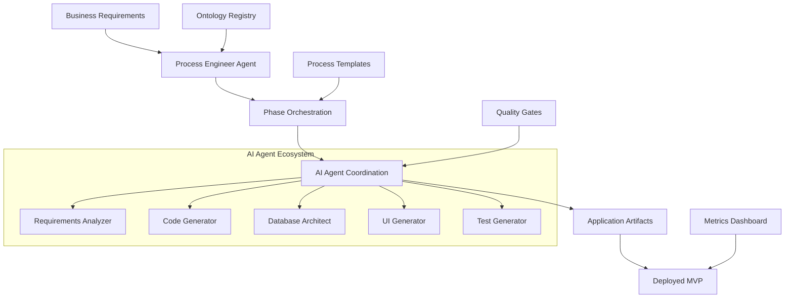
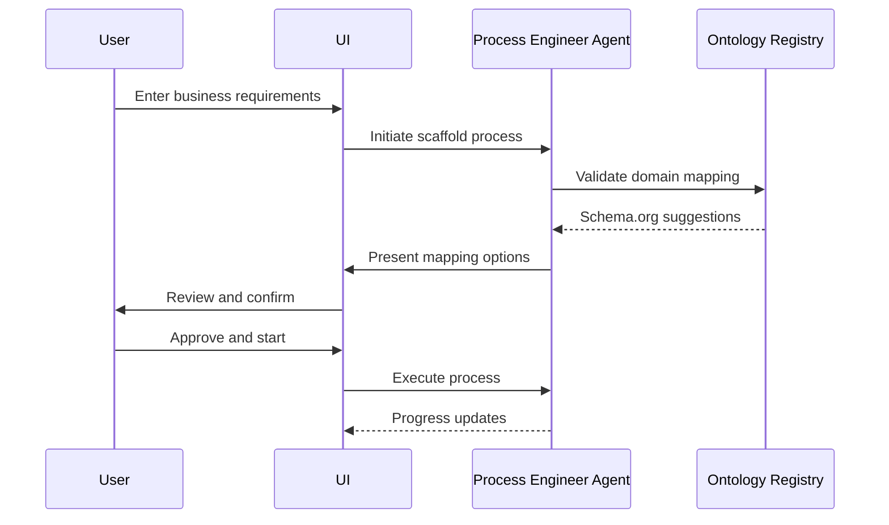
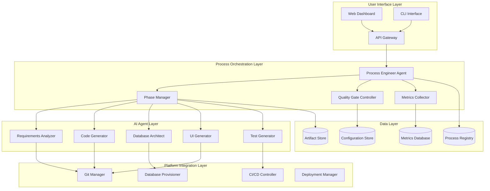

# Application Scaffold System - Product Requirements Document (PRD)

**Version:** 1.0.0  
**Date:** 2025-10-04  
**Product:** AI-Augmented Application Scaffold Platform  
**Process:** Application Scaffold Process v1.0.0

---

## Executive Summary

The Application Scaffold System is an AI-augmented platform that transforms business requirements into deployable applications within 14 days using hypothesis-driven OKR design. The system orchestrates a 9-phase development process with 80%+ AI automation, delivering MVPs that achieve 30% conversion to Product-Market Fit.

**Key Value Propositions:**
- **Speed**: 70% reduction in idea-to-MVP time (14 days target)
- **Quality**: 95%+ code quality with comprehensive testing
- **Automation**: 80%+ AI-augmented development process
- **Innovation**: Hypothesis-driven design with PMF optimization

---

## Product Vision & Strategy

### Vision Statement
*"To enable any business to rapidly transform ideas into validated, deployable applications through AI-augmented development processes that deliver sustainable competitive advantage."*

### Strategic Objectives
1. **Accelerate Innovation Cycles**: Reduce time from concept to validated MVP
2. **Democratize Development**: Enable non-technical stakeholders to drive application creation
3. **Ensure Quality**: Maintain enterprise-grade quality standards at startup speed
4. **Enable Competitive Advantage**: Focus on unique value rather than technical implementation

### Target Market
- **Primary**: SaaS startups and joint ventures requiring rapid MVP development
- **Secondary**: Enterprise innovation teams exploring new digital products
- **Tertiary**: Digital transformation consultants delivering client solutions

---

## Problem Statement

### Current State Pain Points
1. **Slow Development Cycles**: Traditional development takes 3-6 months for MVP
2. **High Technical Complexity**: Non-technical founders struggle with architecture decisions
3. **Quality vs Speed Trade-offs**: Fast development often compromises long-term maintainability
4. **Disconnected Hypothesis Testing**: Development and validation occur in silos
5. **Repetitive Architecture Work**: Each project rebuilds similar foundations

### Impact of Problems
- **Market Opportunity Loss**: Competitors launch faster with inferior products
- **Resource Waste**: 60% of development effort spent on non-differentiating features
- **Validation Delays**: Late discovery of product-market fit issues
- **Technical Debt**: Rush to market creates maintenance nightmares

---

## Solution Overview

### Core Solution Components

### Hypothesis-Driven Development
Every application scaffold includes:
- **Clear Hypotheses**: Measurable assumptions about user behavior
- **Validation Metrics**: KPIs aligned with hypotheses
- **Rapid Testing**: Built-in A/B testing and analytics
- **Iteration Framework**: Data-driven improvement cycles

### AI Augmentation Strategy
- **Requirements Analysis**: 90% automated extraction and mapping
- **Code Generation**: 85% automated TypeScript/React/Database scaffolding
- **Testing**: 95% automated test suite generation
- **Deployment**: 100% automated CI/CD pipeline setup

---

## Functional Requirements

### FR-001: Process Orchestration
**Priority**: P0 (Critical)
**Description**: System must orchestrate 9-phase application development process

**Acceptance Criteria**:
- [ ] Initialize new scaffold process from requirements
- [ ] Execute phases in correct dependency order
- [ ] Support parallel execution where applicable (Phase 4A/4B)
- [ ] Validate phase completion before transition
- [ ] Handle exceptions and escalations gracefully
- [ ] Provide real-time progress visibility

**User Stories**:
- As a **Product Manager**, I want to initiate a scaffold process so that I can transform requirements into a development plan
- As a **Stakeholder**, I want to monitor progress so that I can track milestone achievement
- As a **Developer**, I want to see phase artifacts so that I can understand what was generated

### FR-002: AI Agent Coordination
**Priority**: P0 (Critical)
**Description**: System must coordinate multiple AI agents for maximum automation

**Acceptance Criteria**:
- [ ] Deploy appropriate AI agents for each phase
- [ ] Coordinate handoffs between agents
- [ ] Validate AI-generated outputs against quality criteria
- [ ] Escalate to human oversight when needed
- [ ] Maintain audit trail of AI decisions

**User Stories**:
- As a **Process Engineer Agent**, I want to delegate tasks to specialized AI agents so that I can maximize automation
- As a **Quality Manager**, I want to validate AI outputs so that I can ensure consistency with requirements

### FR-003: Artifact Generation
**Priority**: P0 (Critical)
**Description**: System must generate all application artifacts automatically

**Acceptance Criteria**:
- [ ] Generate TypeScript types from domain ontology
- [ ] Create Zod schemas for validation
- [ ] Build database schemas and migrations
- [ ] Generate React components and forms
- [ ] Create comprehensive test suites
- [ ] Package deployment configurations

**Artifacts by Phase**:
1. **Domain Definition**: ontology-config.json, requirements.md, schema-mappings.json
2. **Code Generation**: types.ts, schemas.ts, json-schemas/
3. **Database Setup**: migrations/, seeds/, rls-policies.sql
4. **Services**: services/, api/, graph/
5. **UI**: components/, forms/, visualizations/
6. **Integration**: hooks/, connectors/, sync/
7. **Testing**: tests/, specs/, performance/
8. **Optimization**: computed/, cache/, performance/
9. **Deployment**: build/, deploy/, monitoring/

### FR-004: Quality Gates
**Priority**: P0 (Critical)
**Description**: System must enforce quality gates at each phase transition

**Quality Gates**:
- [ ] **Domain Approval**: Requirements complete, schema.org mapped, business objectives clear
- [ ] **Code Quality**: TypeScript compiles, Zod schemas validate, naming conventions followed
- [ ] **Database Validation**: Migrations successful, RLS policies active, indexes optimized
- [ ] **Service Quality**: APIs functional, business logic validated, error handling complete
- [ ] **UI Quality**: Components render, forms validate, accessibility standards met
- [ ] **Integration Complete**: Services connected, real-time sync working, data flows validated
- [ ] **Tests Pass**: >95% test pass rate, >90% coverage, performance benchmarks met
- [ ] **Optimization Effective**: Performance improved, patterns identified, cache working
- [ ] **Deployment Successful**: Production deployed, monitoring active, health checks pass

### FR-005: Metrics & Hypothesis Tracking
**Priority**: P1 (High)
**Description**: System must track OKR metrics and validate hypotheses

**Metrics Dashboard**:
- [ ] **Time to MVP**: Track against 14-day target
- [ ] **AI Automation %**: Measure automated vs manual activities
- [ ] **Code Quality Score**: Composite quality metrics
- [ ] **Hypothesis Status**: Track validation of key assumptions
- [ ] **Resource Utilization**: Monitor agent usage and efficiency

**Hypothesis Validation**:
- [ ] Track "AI reduces development time by 60%" - Target: <3 days to working prototype
- [ ] Track "Schema.org improves interoperability by 40%" - Target: 80% integration success
- [ ] Track "OKR design improves MVP success by 50%" - Target: 30% MVP→PMF conversion

### FR-006: Platform Integration
**Priority**: P1 (High)
**Description**: System must integrate with target development platforms

**Supported Platforms**:
- [ ] **Next.js + Supabase**: Primary target platform
- [ ] **React + Firebase**: Secondary platform
- [ ] **Vue + PostgreSQL**: Tertiary platform

**Integration Points**:
- [ ] Git repository initialization and management
- [ ] CI/CD pipeline configuration (GitHub Actions, Vercel)
- [ ] Database provisioning and configuration
- [ ] Environment management (dev, staging, prod)
- [ ] Monitoring and analytics setup

---

## Non-Functional Requirements

### NFR-001: Performance
- **Response Time**: Phase transitions complete within 30 seconds
- **Throughput**: Support 10 concurrent scaffold processes
- **Availability**: 99.9% uptime during business hours
- **Scalability**: Handle 100 scaffold processes per month

### NFR-002: Quality
- **Code Quality**: Generated code must achieve >95% quality score
- **Test Coverage**: Automated tests must cover >90% of generated code
- **Documentation**: All artifacts must include comprehensive documentation
- **Maintainability**: Generated applications must be easily modifiable

### NFR-003: Security
- **Data Protection**: Secure handling of business requirements and IP
- **Access Control**: Role-based access to process management
- **Audit Trail**: Complete logging of all agent actions and decisions
- **Compliance**: Meet SOC 2 Type II requirements

### NFR-004: Usability
- **Learning Curve**: Non-technical users can initiate scaffolds in <1 hour training
- **Process Visibility**: Real-time progress tracking with clear milestone indicators
- **Error Handling**: Clear, actionable error messages and recovery guidance
- **Accessibility**: WCAG 2.1 AA compliance for all user interfaces

---

## User Experience Requirements

### UX-001: Process Initiation Flow

**Key UX Principles**:
- **Progressive Disclosure**: Show only relevant information at each step
- **Intelligent Defaults**: Pre-populate based on domain analysis
- **Continuous Feedback**: Real-time progress with estimated completion
- **Recovery Options**: Clear paths to resolve issues and continue

### UX-002: Monitoring Dashboard

**Dashboard Components**:
- [ ] **Process Overview**: Current phase, overall progress, estimated completion
- [ ] **Metrics Tracking**: OKR progress, hypothesis validation status
- [ ] **Artifact Library**: Generated files organized by phase
- [ ] **Quality Report**: Gate status, test results, quality scores
- [ ] **Agent Activity**: AI agent actions and coordination status

**Interactive Features**:
- [ ] Drill-down into phase details and artifacts
- [ ] Real-time notifications for milestones and issues
- [ ] Direct access to generated applications and documentation
- [ ] Export capabilities for reports and artifacts

---

## Technical Architecture Requirements

### Architecture Principles
1. **Microservices**: Loosely coupled, independently deployable components
2. **Event-Driven**: Asynchronous communication for scalability
3. **AI-Native**: Built-in integration with AI agents and LLMs
4. **Cloud-First**: Designed for cloud deployment and scaling

### System Components

### Technology Stack
- **Frontend**: Next.js, React, TypeScript, Tailwind CSS
- **Backend**: Node.js, Express, TypeScript
- **Database**: PostgreSQL, Supabase
- **AI Integration**: Anthropic Claude API, OpenAI API
- **Infrastructure**: Vercel, AWS, Docker
- **Monitoring**: DataDog, Sentry, PostHog

---

## Success Metrics & KPIs

### Primary Success Metrics (OKRs)

**Objective**: Accelerate application development with AI-augmented processes

**Key Results**:
1. **Time to MVP ≤ 14 days**: Measure from requirements submission to deployed application
   - Baseline: 90 days (traditional development)
   - Target: 14 days (84% reduction)
   - Measurement: Automated tracking through process completion

2. **AI Automation ≥ 80%**: Percentage of development activities automated by AI
   - Baseline: 20% (current tooling)
   - Target: 80% (60 percentage point improvement)
   - Measurement: Activity classification and timing analysis

3. **Code Quality ≥ 95%**: Composite score of code quality metrics
   - Components: Compilation success, test coverage, maintainability, security
   - Target: 95% composite score
   - Measurement: Automated quality analysis tools

### Secondary Metrics

**Product Adoption**:
- Weekly Active Users: 50 users within 3 months
- Process Completion Rate: >90% of initiated processes complete successfully
- User Satisfaction (NPS): >50 net promoter score

**Business Impact**:
- Customer Time-to-Value: <7 days from purchase to first application
- Revenue per User: $5,000 annual subscription value
- Customer Retention: >85% annual retention rate

**Technical Performance**:
- System Uptime: >99.9% availability
- Process Success Rate: >95% successful completion without intervention
- Agent Coordination Efficiency: <5% manual intervention required

### Hypothesis Validation Metrics

1. **Development Speed Hypothesis**: "AI-generated scaffolds reduce development time by 60%"
   - Metric: Time from requirements to working prototype
   - Target: <3 days for basic CRUD application
   - Validation: Compare against traditional development timelines

2. **Interoperability Hypothesis**: "Schema.org grounding improves interoperability by 40%"
   - Metric: Integration success rate with external systems
   - Target: 80% successful integrations without custom mapping
   - Validation: Test integrations with common business systems

3. **PMF Success Hypothesis**: "Hypothesis-driven OKR design improves MVP success by 50%"
   - Metric: MVP to Product-Market Fit conversion rate
   - Target: 30% of MVPs achieve PMF within 6 months
   - Validation: Track post-deployment success metrics

---

## Implementation Roadmap

### Phase 1: Foundation (Weeks 1-4)
**Deliverables**:
- [ ] Process Engineering Ontology v1.0
- [ ] Process Engineer Agent v1.0
- [ ] Basic process orchestration framework
- [ ] Simple code generation capabilities

**Success Criteria**:
- Successfully orchestrate 3-phase simplified process
- Generate basic TypeScript types and React components
- Demonstrate end-to-end automation for simple use case

### Phase 2: Core Platform (Weeks 5-8)
**Deliverables**:
- [ ] All 9 process phases implemented
- [ ] Quality gate enforcement
- [ ] Metrics tracking dashboard
- [ ] Integration with Next.js/Supabase

**Success Criteria**:
- Complete full application scaffold in <14 days
- Achieve >70% AI automation
- Pass all quality gates automatically

### Phase 3: AI Enhancement (Weeks 9-12)
**Deliverables**:
- [ ] Advanced AI agent coordination
- [ ] Intelligent error handling and recovery
- [ ] Performance optimization agents
- [ ] Comprehensive testing automation

**Success Criteria**:
- Achieve >80% AI automation target
- <5% manual intervention required
- >95% code quality score

### Phase 4: Scale & Optimize (Weeks 13-16)
**Deliverables**:
- [ ] Multi-tenant platform architecture
- [ ] Advanced monitoring and analytics
- [ ] Additional platform support (React/Firebase)
- [ ] Enterprise security features

**Success Criteria**:
- Support 10+ concurrent processes
- >99.9% system availability
- SOC 2 compliance achieved

---

## Risk Assessment & Mitigation

### High-Risk Items

**Risk**: AI-generated code quality insufficient for production use
- **Likelihood**: Medium
- **Impact**: High
- **Mitigation**: Comprehensive testing automation, human review gates, incremental quality improvement

**Risk**: Development timeline exceeds 14-day target consistently
- **Likelihood**: Medium
- **Impact**: High  
- **Mitigation**: Continuous process optimization, parallel execution, scope management

**Risk**: Platform integration complexity higher than expected
- **Likelihood**: High
- **Impact**: Medium
- **Mitigation**: Focus on single platform initially, modular integration architecture

### Medium-Risk Items

**Risk**: User adoption slower than projected
- **Likelihood**: Medium
- **Impact**: Medium
- **Mitigation**: Enhanced onboarding, clear value demonstration, customer success support

**Risk**: AI agent coordination overhead reduces automation benefits
- **Likelihood**: Low
- **Impact**: Medium
- **Mitigation**: Efficient agent communication protocols, performance monitoring

---

## Compliance & Governance

### Data Privacy
- **GDPR Compliance**: Explicit consent for data processing, right to deletion
- **Data Minimization**: Collect only necessary business requirement data
- **Encryption**: End-to-end encryption for sensitive business information

### Quality Assurance
- **Code Review**: All AI-generated code subject to quality validation
- **Security Scanning**: Automated security vulnerability assessment
- **Performance Testing**: Automated performance benchmarking

### Change Management
- **Version Control**: All process definitions and ontologies versioned
- **Backward Compatibility**: Maintain compatibility across version upgrades
- **Migration Support**: Automated migration tools for process updates

---

## Appendix

### Glossary
- **MVP**: Minimum Viable Product with core functionality for market validation
- **PMF**: Product-Market Fit, validated demand for the product solution
- **OKR**: Objectives and Key Results framework for goal setting
- **Schema.org**: Structured data vocabulary for web content
- **AI Augmentation**: Enhancement of human activities with artificial intelligence

### References
- Process Engineering Ontology v1.0.0
- Application Scaffold Process Definition v1.0.0
- Process Engineer Agent Specification v1.0.0
- Ontology Architect Agent Framework

---

**Document Status**: Draft v1.0.0  
**Next Review**: 2025-10-11  
**Approval Required**: Product Management, Engineering, Architecture
