# W4M VSOM Visual Guide
## Ontology Architecture and Agent Ecosystem

**Version:** 1.0.0  
**Date:** 14 November 2025 17:30:00 GMT  
**Framework:** W4M Core Capability and Business Framework  

---

## 1. Core Framework Architecture

### 1.1 W4M Core Principles

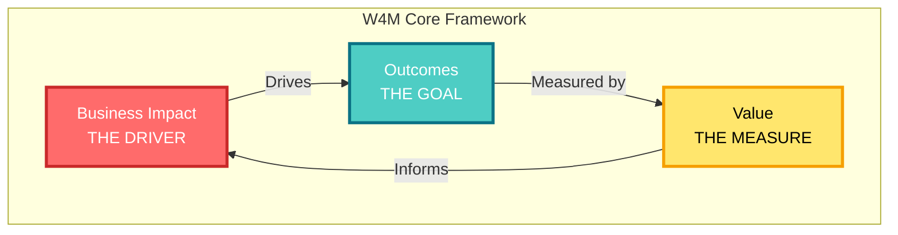

### 1.2 VSOM Framework Hierarchy

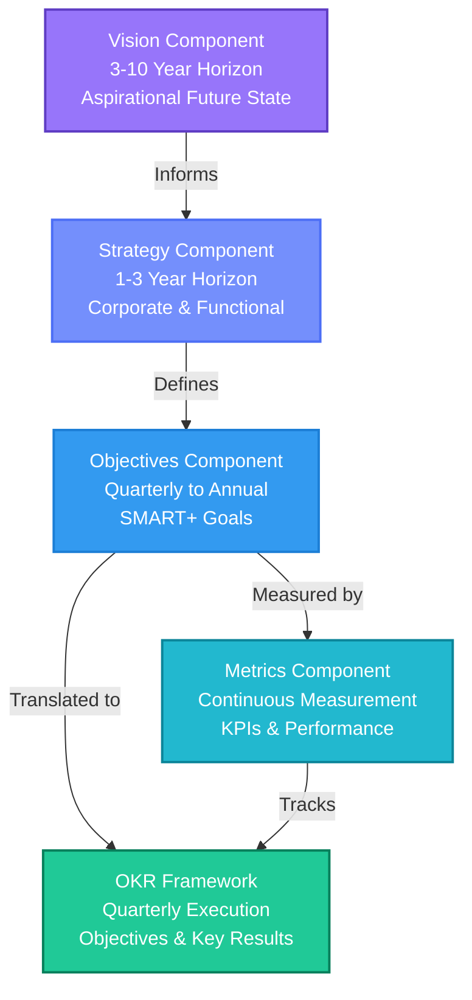

---

## 2. VSOM Ontology Structure

### 2.1 Core Entity Classes

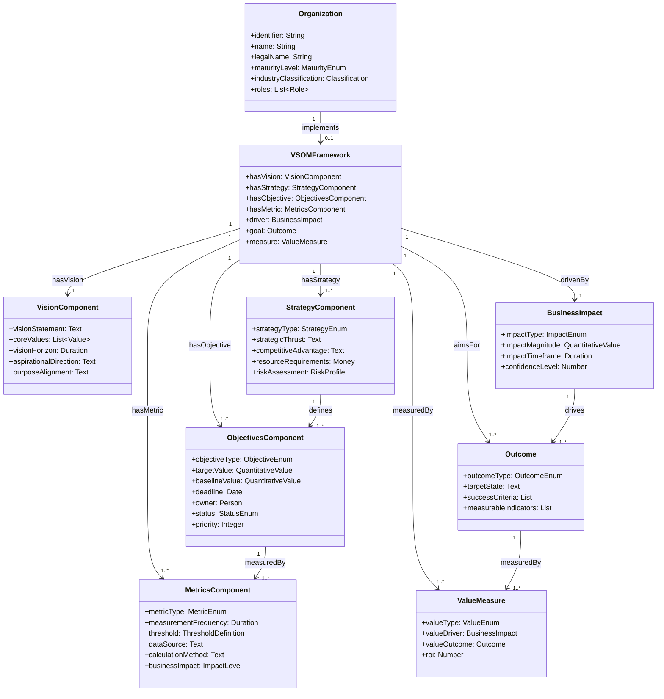

### 2.2 Schema.org Integration Layer

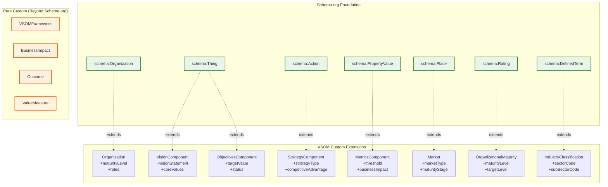

---

## 3. Strategic Cascade Flow

### 3.1 Vision to Execution Cascade

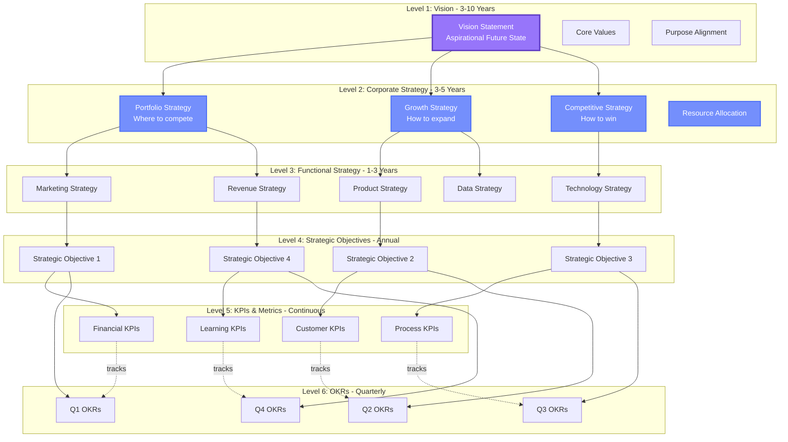

### 3.2 Strategy Architecture Matrix

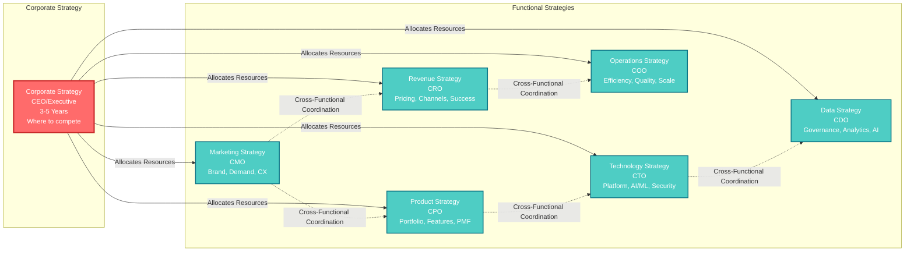

---

## 4. Claude Skills Agent Ecosystem

### 4.1 Agent Hierarchy and Orchestration

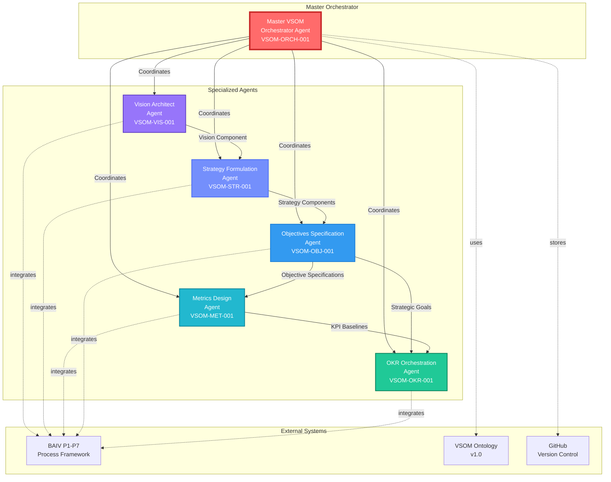

### 4.2 Agent Capability Breakdown

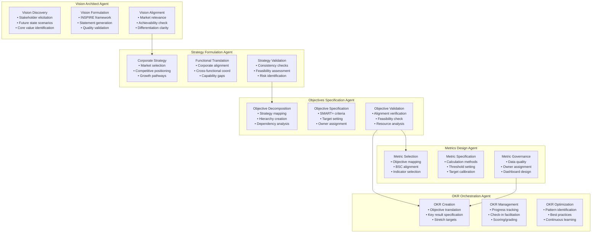

### 4.3 Agent Data Flow

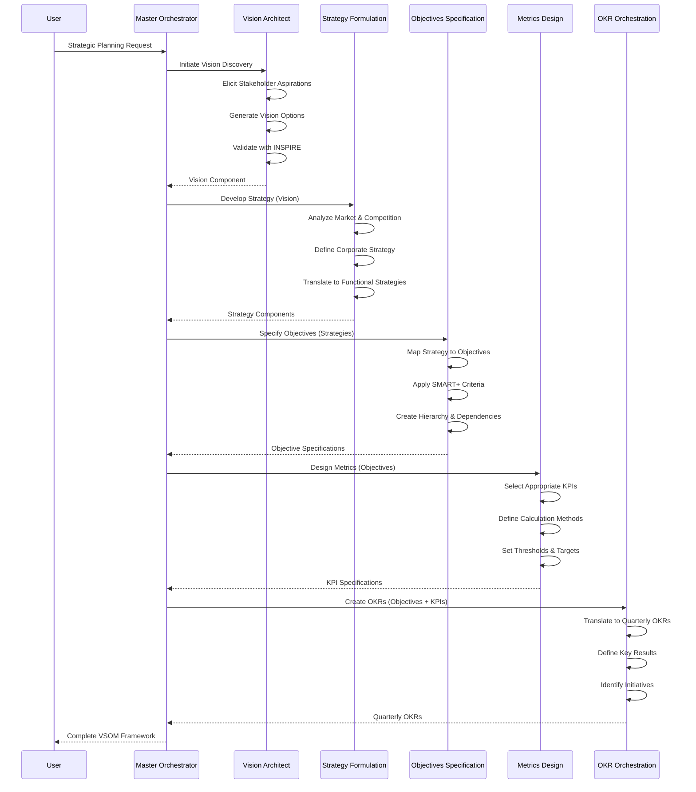

---

## 5. Integration Architecture

### 5.1 BAIV Process Integration

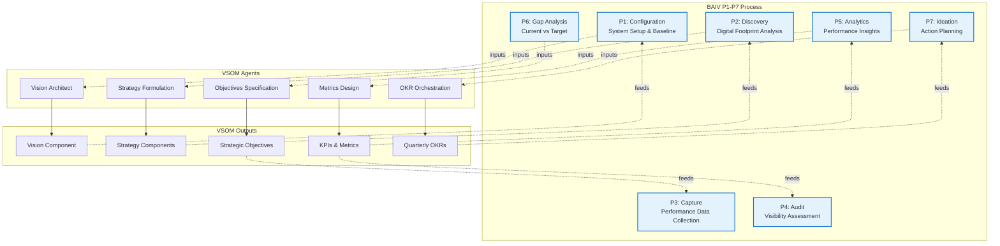

### 5.2 Value Engineering Connection

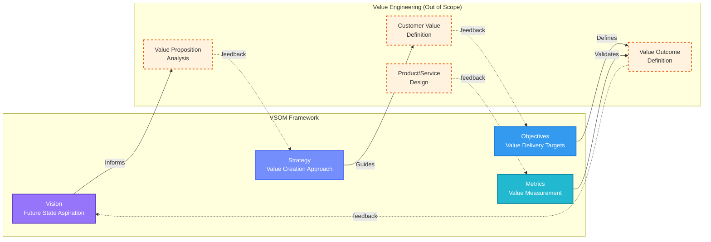

---

## 6. Implementation Roadmap

### 6.1 Agent Development Phases

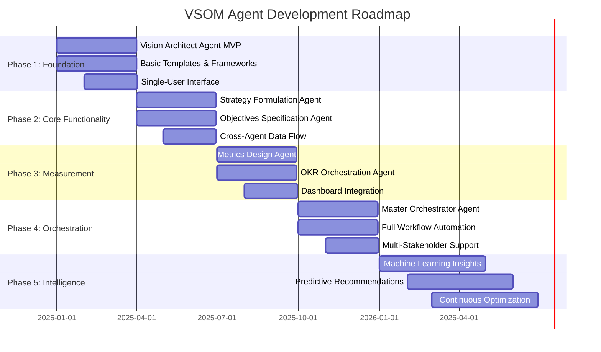

### 6.2 Capability Maturity Evolution

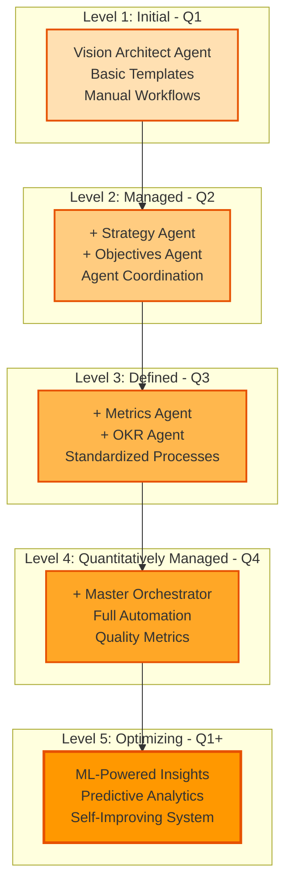

---

## 7. Cardinal Rules Visualization

### 7.1 W4M Cardinal Rules

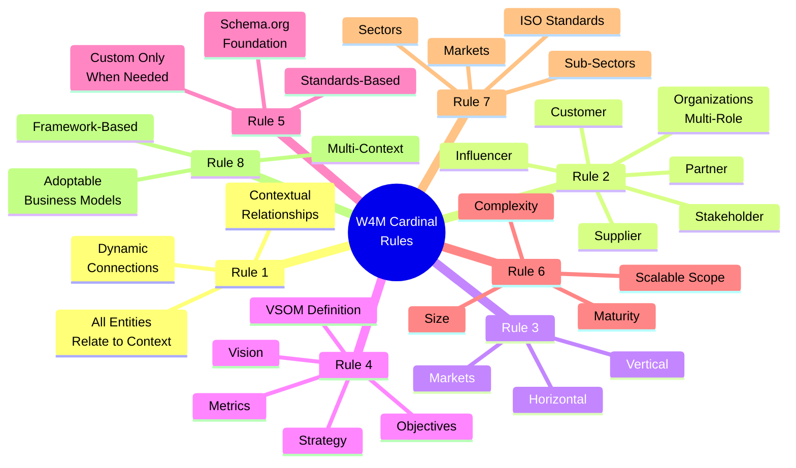

### 7.2 Ontology Compliance Structure

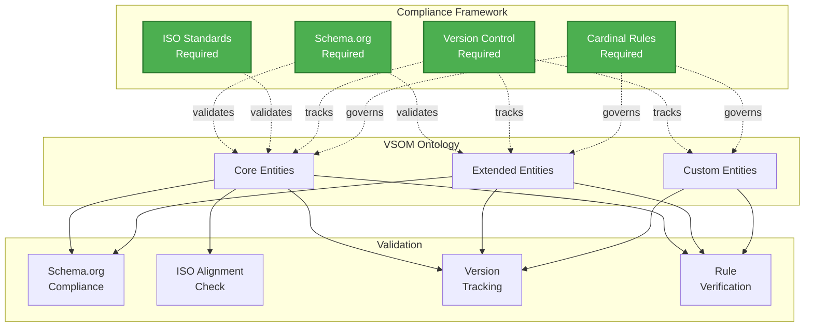

---

## 8. Metrics and Measurement Flow

### 8.1 Balanced Scorecard Integration

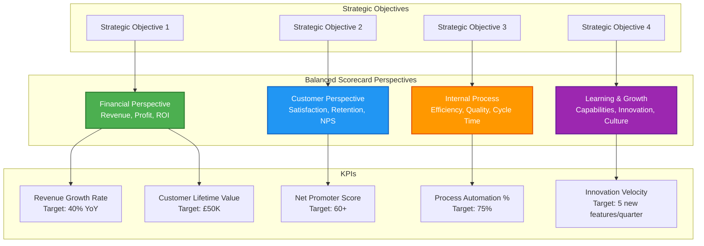

### 8.2 Leading vs Lagging Indicators

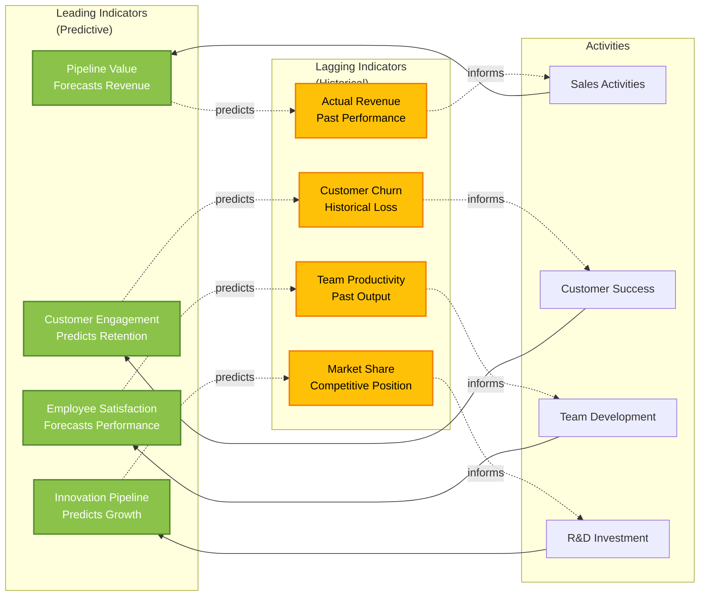

---

## 9. OKR Lifecycle Management

### 9.1 Quarterly OKR Flow

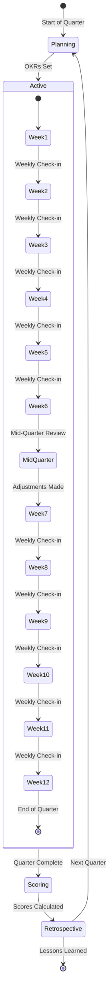

### 9.2 OKR to Strategy Alignment

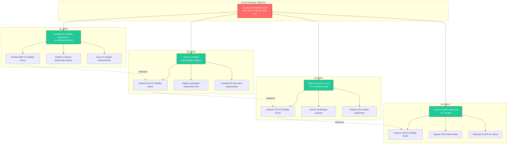

---

## 10. End-to-End VSOM Example

### 10.1 Complete VSOM Instance

```mermaid
graph TB
    subgraph "Organization: AI Transformation Consultancy"
        Org[Organization<br/>ORG-EXAMPLE-001<br/>Mid-Market Professional Services]
    end
    
    subgraph "Vision - 2030"
        V[Become the definitive AI visibility partner<br/>enabling sustainable competitive advantage]
    end
    
    subgraph "Corporate Strategy - 2028"
        CS[Achieve market leadership through<br/>proprietary frameworks and measurable outcomes<br/>Target: 40% market share]
    end
    
    subgraph "Functional Strategies"
        MS[Marketing Strategy<br/>Build category-defining<br/>thought leadership]
        PS[Product Strategy<br/>Develop proprietary<br/>assessment tools]
        TS[Technology Strategy<br/>Build AI-powered<br/>automation platform]
    end
    
    subgraph "Strategic Objectives - 2025"
        SO1[Increase Client AI Visibility<br/>45% → 75%<br/>Generate 3x ROI]
    end
    
    subgraph "KPIs"
        KPI1[AI Visibility Score<br/>Monthly | Target: 75%<br/>Current: 45%]
        KPI2[Client ROI<br/>Quarterly | Target: 3x<br/>Current: 1.8x]
    end
    
    subgraph "Q1 2025 OKRs"
        OKR1[Establish industry-standard<br/>assessment methodology]
        KR1[60% AI Visibility Score]
        KR2[3 Benchmark Reports Published]
        KR3[5 Analyst Endorsements]
    end
    
    Org --> V
    V --> CS
    CS --> MS
    CS --> PS
    CS --> TS
    MS --> SO1
    PS --> SO1
    TS --> SO1
    SO1 --> KPI1
    SO1 --> KPI2
    SO1 --> OKR1
    OKR1 --> KR1
    OKR1 --> KR2
    OKR1 --> KR3
    KPI1 -.tracks.-> KR1
    
    style Org fill:#E1BEE7,stroke:#8E24AA,stroke-width:2px
    style V fill:#9775FA,stroke:#5F3DC4,stroke-width:3px,color:#fff
    style CS fill:#748FFC,stroke:#4C6EF5,stroke-width:2px,color:#fff
    style SO1 fill:#339AF0,stroke:#1C7ED6,stroke-width:2px,color:#fff
    style KPI1 fill:#22B8CF,stroke:#0C8599,stroke-width:2px,color:#fff
    style KPI2 fill:#22B8CF,stroke:#0C8599,stroke-width:2px,color:#fff
    style OKR1 fill:#20C997,stroke:#087F5B,stroke-width:2px,color:#fff
```

---

## Appendix: Diagram Legend

### Entity Types

- **Purple/Violet** = Vision Layer
- **Blue Shades** = Strategy Layer
- **Cyan/Teal** = Objectives & Metrics Layer
- **Green** = OKR & Execution Layer
- **Red/Orange** = Critical/High Priority
- **Yellow** = Warning/Caution

### Line Types

- **Solid Arrow (→)** = Direct relationship/flow
- **Dashed Arrow (-.->)** = Indirect influence/feedback
- **Thick Border** = Primary/Critical entity
- **Dotted Border** = Out of scope/External

### Size Indicators

- **Larger boxes** = Higher hierarchy level
- **Smaller boxes** = Lower hierarchy level
- **Grouped boxes** = Related entities

---

**Document Control:**
- Version: 1.0.0
- Created: 14 November 2025 17:30:00 GMT
- Author: W4M Framework Team
- Classification: Internal/Partner Use
- Format: Mermaid Diagrams

**Usage Notes:**
- All diagrams render in Mermaid-compatible viewers
- Diagrams can be embedded in documentation
- Interactive versions available via Mermaid Live Editor
- Export to PNG/SVG for presentations

---

*This visual guide complements the W4M VSOM Ontology v1.0 and Strategic Planning Methodology Guide.*
