# MCSB AI Workloads Readiness Visual Guide

## Microsoft Cloud Security Benchmark v2 - Ontology Foundation for AI Security & Compliance

**Document Version:** 1.0.0  
**Date:** January 2026  
**Platform:** PF-Core  
**PF-Instance:** W4M-RCS (Wings4Mind - Regulatory Compliance & Security)  
**Module Type:** Security & Compliance Ontology Foundation  
**Classification:** MVP Implementation Guide

---

## 1. Executive Summary

This visual guide provides a comprehensive overview of the Microsoft Cloud Security Benchmark (MCSB) v2 framework and demonstrates how an ontology-driven approach can establish AI workloads readiness for security and compliance. The W4M-RCS instance implements this as a Platform Foundation Core module, enabling semantic reasoning about security controls, compliance mapping, and AI-specific threat mitigation.

---

## 2. MCSB v2 Security Domains Architecture

The MCSB v2 framework organizes security guidance into **12 security domains**, with the new **Artificial Intelligence Security** domain specifically addressing AI workload risks.

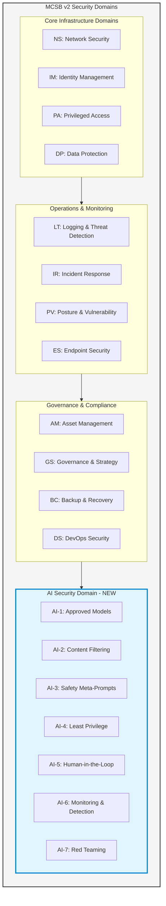

---

## 3. AI Security Domain Deep Dive - The 7 Controls

The AI Security domain introduces seven critical controls specifically designed for AI workloads:

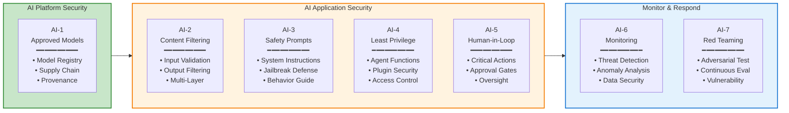

---

## 4. MCSB Ontology Structure for W4M-RCS

The ontology translates MCSB controls into a semantic framework that enables AI agents to reason about security compliance:

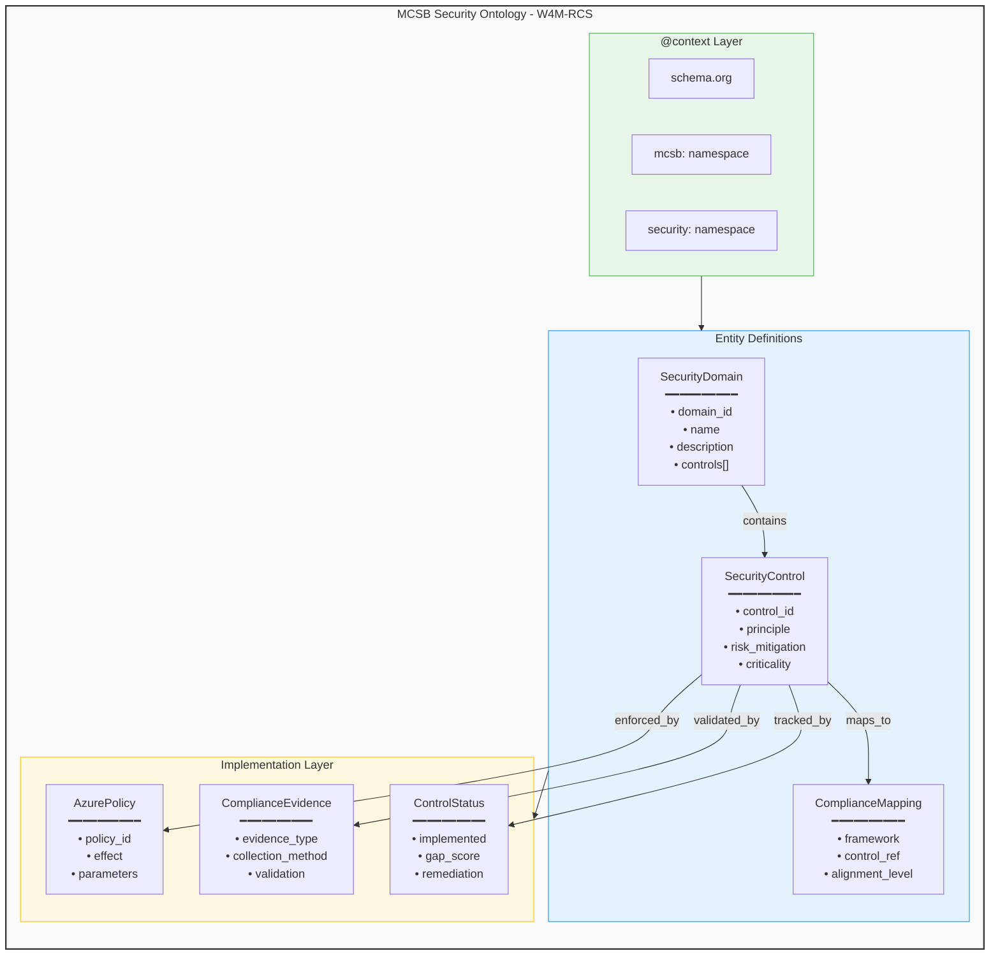

---

## 5. AI Workloads Readiness Assessment Flow

This diagram shows how the ontology enables systematic AI workloads readiness assessment:

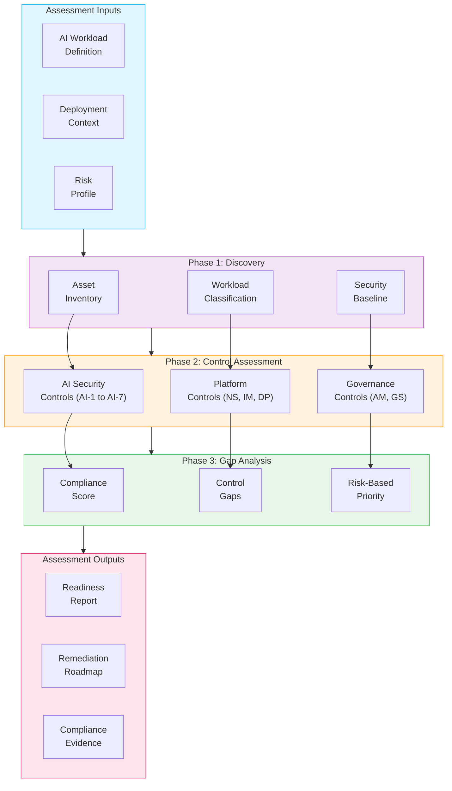

---

## 6. MITRE ATT&CK Integration for AI Threats

The ontology maps MCSB controls to MITRE ATT&CK/ATLAS tactics for AI-specific threat modeling:

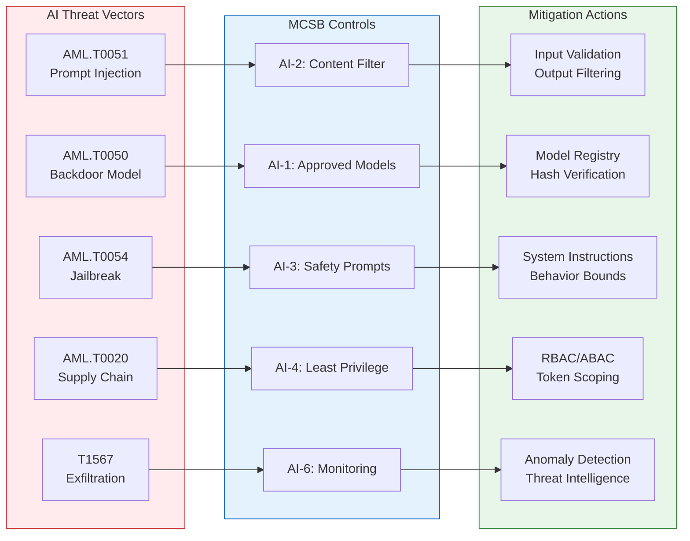

---

## 7. Compliance Framework Mappings

MCSB controls map to major regulatory frameworks, enabling cross-compliance assessment:

```mermaid
flowchart TB
    subgraph MCSB_Controls["MCSB v2 AI Controls"]
        AI1["AI-1"]
        AI2["AI-2"]
        AI3["AI-3"]
        AI4["AI-4"]
        AI5["AI-5"]
        AI6["AI-6"]
        AI7["AI-7"]
    end
    
    subgraph NIST["NIST SP 800-53"]
        N1["SA-3, SA-10, SA-15"]
        N2["SI-3, SI-4, AC-2"]
        N3["SA-8, SI-16"]
        N4["AC-6, AC-3, CM-7"]
        N5["IA-9, AC-2, AU-6"]
        N6["SI-4, AU-6, IR-4"]
        N7["CA-8, SI-2, RA-5"]
    end
    
    subgraph ISO["ISO 27001:2022"]
        I1["A.5.19, A.5.20"]
        I2["A.8.16, A.8.7"]
        I3["A.8.28, A.8.15"]
        I4["A.5.15, A.8.3"]
        I5["A.5.17, A.6.8"]
        I6["A.8.16, A.8.15"]
        I7["A.8.8, A.5.7"]
    end
    
    subgraph PCI["PCI-DSS v4.0"]
        P1["6.3.2, 6.5.5"]
        P2["6.4.3, 11.6.1"]
        P3["6.5.1, 6.5.10"]
        P4["7.2.1, 7.3.1"]
        P5["10.2.2, 12.10.1"]
        P6["10.6.2, 11.5.1"]
        P7["11.4.1, 11.4.7"]
    end
    
    AI1 --> N1 & I1 & P1
    AI2 --> N2 & I2 & P2
    AI3 --> N3 & I3 & P3
    AI4 --> N4 & I4 & P4
    AI5 --> N5 & I5 & P5
    AI6 --> N6 & I6 & P6
    AI7 --> N7 & I7 & P7
    
    style MCSB_Controls fill:#e3f2fd,stroke:#1976d2
    style NIST fill:#fff3e0,stroke:#f57c00
    style ISO fill:#e8f5e9,stroke:#388e3c
    style PCI fill:#fce4ec,stroke:#c2185b
```

---

## 8. W4M-RCS Implementation Architecture

The PF-Instance implementation for Wings4Mind Regulatory Compliance & Security:

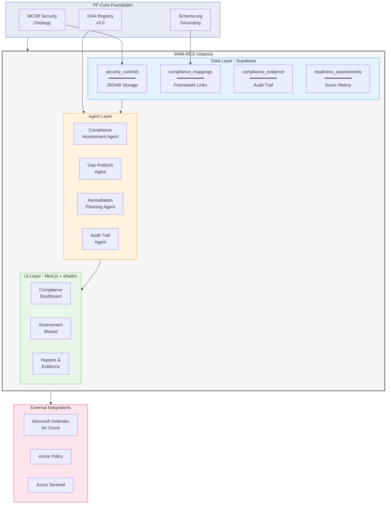

---

## 9. Readiness Score Calculation Model

The ontology enables semantic calculation of AI workloads readiness scores:

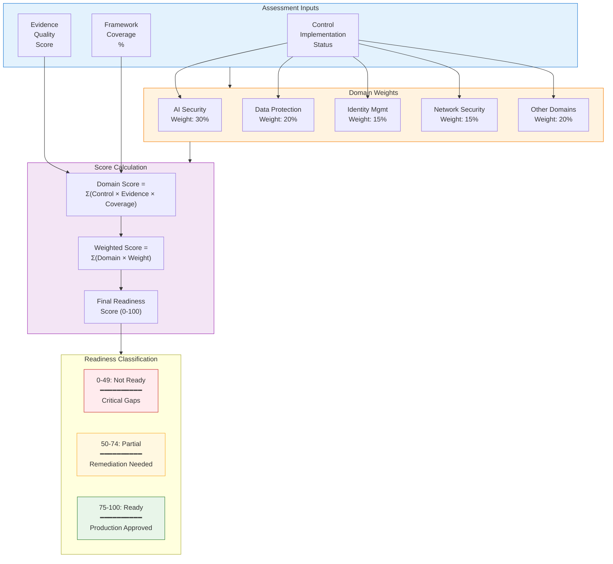

---

## 10. Agent Orchestration for Compliance Workflow

The W4M-RCS agent orchestration for automated compliance assessment:

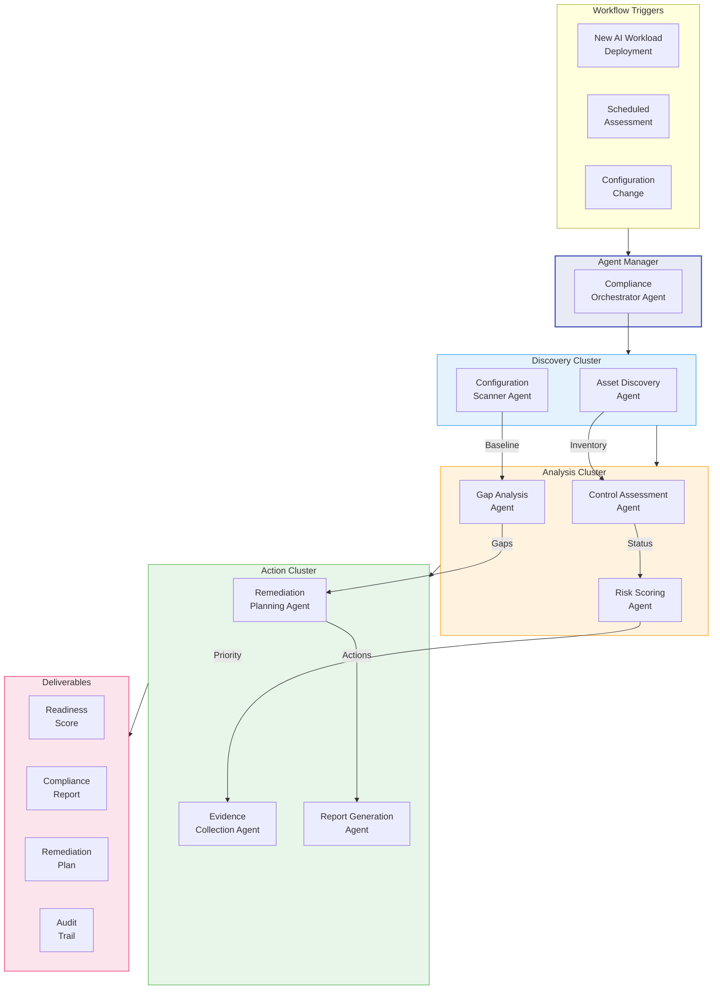

---

## 11. MVP Database Schema Overview

Core tables for the W4M-RCS MCSB implementation:

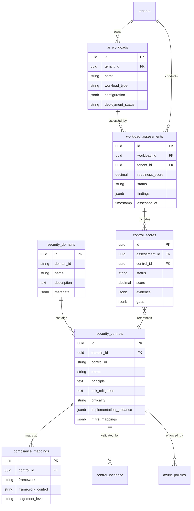

---

## 12. Implementation Roadmap

Phased approach for MVP delivery:

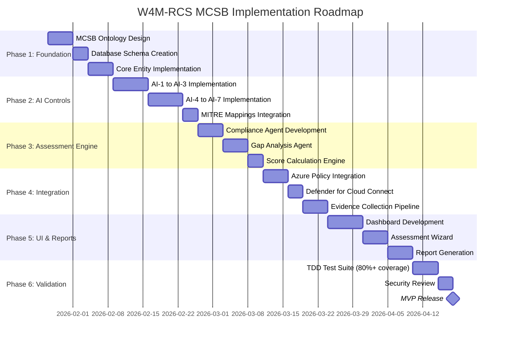

---

## 13. Value Proposition Summary

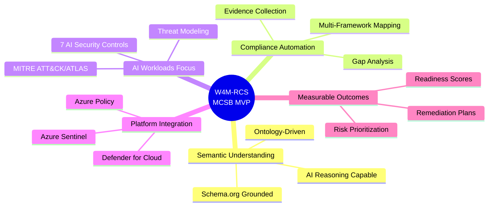

---

## 14. Key Ontology Entities Reference

| Entity | Purpose | Key Properties |
|--------|---------|----------------|
| `SecurityDomain` | Groups related controls | domain_id, name, controls[] |
| `SecurityControl` | Individual security requirement | control_id, principle, criticality, mitre_mappings |
| `ComplianceMapping` | Cross-framework alignment | framework, control_ref, alignment_level |
| `AIWorkload` | AI system under assessment | workload_type, configuration, deployment_status |
| `ReadinessAssessment` | Point-in-time evaluation | readiness_score, findings, gaps |
| `ControlEvidence` | Proof of implementation | evidence_type, collection_method, validation_status |
| `RemediationPlan` | Gap closure roadmap | priority, actions, timeline, owner |

---

## 15. Success Metrics for MVP

| Metric | Target | Measurement |
|--------|--------|-------------|
| Control Coverage | 100% AI Controls (AI-1 to AI-7) | Ontology completeness |
| Framework Mappings | NIST, ISO, PCI, CIS | Cross-reference validation |
| Assessment Automation | 80% automated evidence collection | Manual vs automated ratio |
| Score Accuracy | 95% correlation with manual audit | Validation testing |
| Agent Response Time | <30 seconds per control assessment | Performance monitoring |
| Test Coverage | >80% TDD compliance | Code coverage metrics |

---

## 16. References

- [MCSB v2 Overview](https://learn.microsoft.com/en-us/security/benchmark/azure/overview)
- [AI Security Domain](https://learn.microsoft.com/en-us/security/benchmark/azure/mcsb-v2-artificial-intelligence-security)
- [MITRE ATLAS](https://atlas.mitre.org/)
- [OWASP Top 10 for LLM](https://owasp.org/www-project-top-10-for-large-language-model-applications/)
- [Azure AI Landing Zone](https://learn.microsoft.com/en-us/azure/architecture/ai-ml/architecture/azure-openai-baseline-landing-zone)

---

**Document Classification:** PF-Core Module Specification  
**Asset Status:** MVP - Development Ready  
**Ontology Compliance:** OAA Registry v3.0 | Schema.org Grounded

*© 2026 Platform Foundation Core Holdings. W4M licensed under PF-Core Participant Arrangements.*
