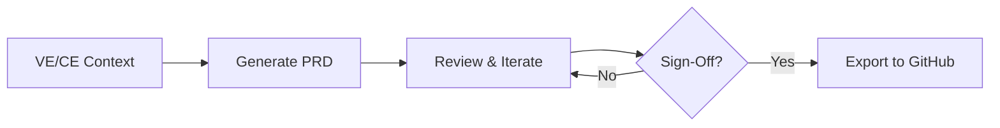

# EFS → GitHub Projects Integration Workflow

**Version:** 1.0.0
**Date:** 2026-01-28
**Purpose:** Enable signed-off Epics/Features/Stories to flow into GitHub Projects, PBS, and WBS for delivery

---

## Overview

This document describes the integration workflow from EFS (Epic-Features-Stories) ontology-based PRDs to GitHub Projects for agile delivery management.

```
┌─────────────────────────────────────────────────────────────────────────────┐
│                        EFS → DELIVERY PIPELINE                               │
├─────────────────────────────────────────────────────────────────────────────┤
│                                                                              │
│  ┌──────────┐     ┌──────────┐     ┌──────────┐     ┌──────────┐           │
│  │   VE/CE  │────▶│   PRD    │────▶│  GitHub  │────▶│   PBS    │           │
│  │  Context │     │  (EFS)   │     │ Projects │     │   WBS    │           │
│  └──────────┘     └──────────┘     └──────────┘     └──────────┘           │
│                                                                              │
│  Value Eng. ───▶ Epics ────────▶ Milestones ────▶ Product Breakdown         │
│  Customer Exp ──▶ Features ────▶ Issues ────────▶ Work Breakdown            │
│  VSOM Align ───▶ Stories ──────▶ Tasks ─────────▶ Sprint Planning           │
│                                                                              │
└─────────────────────────────────────────────────────────────────────────────┘
```

---

## 1. Pre-Integration: VE/CE Context Setting

Before generating EFS specifications, establish context through:

### 1.1 Value Engineering (VE) Alignment

| VE Component | Maps To | Purpose |
|--------------|---------|---------|
| Value Proposition | Epic.businessOutcome | Strategic value delivery |
| Value Streams | Theme | Capability grouping |
| Value Metrics | Outcome.leadMetric/lagMetric | Success measurement |

### 1.2 Customer Experience (CE) Alignment

| CE Component | Maps To | Purpose |
|--------------|---------|---------|
| Customer Segments | Persona | User targeting |
| Customer Journeys | Feature flows | Experience mapping |
| Pain Points | UserStory.soThat | Benefit articulation |

### 1.3 VSOM Strategic Alignment

| VSOM Component | Maps To | Purpose |
|----------------|---------|---------|
| Strategic Objectives | Epic.alignsToObjective | Strategy traceability |
| Strategic Initiatives | Theme.strategicPillar | Portfolio alignment |
| Strategic KPIs | Outcome.targetValue | Performance measurement |

---

## 2. EFS → GitHub Projects Field Mapping

### 2.1 Primary Mappings

| EFS Entity | GitHub Element | Notes |
|------------|----------------|-------|
| **Epic** | Milestone | Set due date to target release |
| **Feature** | Issue (label: `feature`) | Parent of stories |
| **UserStory** | Issue (label: `story`) | Child of feature |
| **Task** | Checklist item OR Sub-issue | Within story |
| **Hypothesis** | Issue (label: `hypothesis`) | Linked to epic |
| **Enabler** | Issue (label: `enabler`) | Technical dependency |

### 2.2 Field Mappings

| EFS Field | GitHub Field | Type |
|-----------|--------------|------|
| backlogItemId | Issue number + prefix | Auto-generated |
| name | Title | Text |
| description | Body (first section) | Markdown |
| priority | Priority field | Single select |
| status | Status field | Built-in |
| estimate | Size field | Single select (T-shirt) |
| storyPoints | Estimate field | Number |
| targetRelease | Milestone | Reference |
| assignee | Assignees | People |
| acceptanceCriteria | Body (AC section) | Markdown checkbox list |

### 2.3 Custom Fields Required

Create these custom fields in GitHub Projects:

```yaml
Fields:
  - name: Priority
    type: single_select
    options: [Critical, High, Medium, Low]

  - name: Size
    type: single_select
    options: [XS, S, M, L, XL]

  - name: Story Points
    type: number

  - name: Epic Link
    type: text
    description: "Link to parent epic (for features)"

  - name: Feature Link
    type: text
    description: "Link to parent feature (for stories)"

  - name: Value Score
    type: number
    description: "Business value 1-10"

  - name: Risk Score
    type: number
    description: "Risk level 1-5"

  - name: VSOM Objective
    type: text
    description: "Strategic objective reference"
```

### 2.4 Labels Required

```yaml
Labels:
  # Entity Types
  - name: epic
    color: "#7057ff"
    description: "Large initiative decomposed into features"

  - name: feature
    color: "#008672"
    description: "Distinct functionality delivering value"

  - name: story
    color: "#0075ca"
    description: "User-centric functionality description"

  - name: task
    color: "#cfd3d7"
    description: "Implementation work item"

  - name: enabler
    color: "#d876e3"
    description: "Technical/architectural enabler"

  - name: hypothesis
    color: "#f9d0c4"
    description: "Testable assumption"

  # Priority
  - name: "priority:critical"
    color: "#b60205"

  - name: "priority:high"
    color: "#d93f0b"

  - name: "priority:medium"
    color: "#fbca04"

  - name: "priority:low"
    color: "#0e8a16"

  # Feature Types
  - name: "type:functional"
    color: "#1d76db"

  - name: "type:non-functional"
    color: "#5319e7"

  - name: "type:compliance"
    color: "#e99695"

  - name: "type:integration"
    color: "#bfd4f2"

  # Status
  - name: mvp
    color: "#fbca04"
    description: "Part of MVP scope"

  - name: validated
    color: "#0e8a16"
    description: "Hypothesis validated"

  - name: blocked
    color: "#b60205"
    description: "Blocked by dependency"
```

---

## 3. Integration Workflow

### 3.1 Phase 1: PRD Sign-Off



**Sign-Off Checklist:**
- [ ] All epics have strategic alignment (VSOM objective)
- [ ] All features have acceptance criteria
- [ ] All stories have As A / I Want / So That
- [ ] Hypotheses have success criteria
- [ ] Stakeholder approval obtained

### 3.2 Phase 2: GitHub Projects Population

#### Step 1: Create Milestones (Epics)

```bash
# For each Epic in PRD
gh api repos/{owner}/{repo}/milestones -f title="EPIC-001: {Epic Name}" \
  -f description="{Epic Description}" \
  -f due_on="{Target Release Date}"
```

#### Step 2: Create Feature Issues

```bash
# For each Feature in Epic
gh issue create \
  --title "[F-001] {Feature Name}" \
  --body "$(cat <<'EOF'
## Description
{Feature Description}

## Benefit Hypothesis
{Benefit Hypothesis}

## Acceptance Criteria
- [ ] AC-001: Given {given} When {when} Then {then}
- [ ] AC-002: Given {given} When {when} Then {then}

## Value Proposition
{VP Reference}

## Links
- Epic: #{Epic Issue Number}
- VSOM Objective: {Objective ID}
EOF
)" \
  --label "feature" \
  --label "type:{feature_type}" \
  --label "priority:{priority}" \
  --milestone "{Epic Milestone}"
```

#### Step 3: Create Story Issues

```bash
# For each Story in Feature
gh issue create \
  --title "[US-001] {Story Name}" \
  --body "$(cat <<'EOF'
## User Story
**As a** {Persona}
**I want** {Desire}
**So that** {Benefit}

## Acceptance Criteria
- [ ] **Given** {precondition} **When** {action} **Then** {outcome}
- [ ] **Given** {precondition} **When** {action} **Then** {outcome}

## Tasks
- [ ] Task 1: {description}
- [ ] Task 2: {description}

## Links
- Feature: #{Feature Issue Number}
- Persona: {Persona Reference}

## Story Points
{Story Points}
EOF
)" \
  --label "story" \
  --label "priority:{priority}" \
  --milestone "{Epic Milestone}"
```

### 3.3 Phase 3: PBS/WBS Integration

Once issues are created, they form the basis for:

#### Product Breakdown Structure (PBS)

```
Product: {Product Name}
├── Epic: {Epic 1 Name} (Milestone)
│   ├── Feature: {Feature 1.1} (Issue)
│   │   ├── Story: {Story 1.1.1} (Issue)
│   │   └── Story: {Story 1.1.2} (Issue)
│   └── Feature: {Feature 1.2} (Issue)
│       └── Story: {Story 1.2.1} (Issue)
└── Epic: {Epic 2 Name} (Milestone)
    └── Feature: {Feature 2.1} (Issue)
```

#### Work Breakdown Structure (WBS)

```
Delivery: Sprint {N}
├── {Team Name}
│   ├── Story: {Story 1.1.1} - {Assignee}
│   │   ├── Task: {Task 1} - 4h
│   │   └── Task: {Task 2} - 2h
│   └── Story: {Story 1.2.1} - {Assignee}
└── {Team Name 2}
    └── Story: {Story 2.1.1} - {Assignee}
```

---

## 4. Automation Workflows

### 4.1 GitHub Actions: PRD to Issues

```yaml
# .github/workflows/prd-to-issues.yml
name: PRD to GitHub Issues

on:
  push:
    paths:
      - 'prds/**/*.md'
  workflow_dispatch:
    inputs:
      prd_file:
        description: 'Path to PRD file'
        required: true

jobs:
  create-issues:
    runs-on: ubuntu-latest
    steps:
      - uses: actions/checkout@v4

      - name: Parse PRD and Create Issues
        uses: actions/github-script@v7
        with:
          script: |
            const fs = require('fs');
            const prdPath = '${{ github.event.inputs.prd_file }}' ||
                           context.payload.head_commit.added[0];

            // Parse PRD markdown (implement parser)
            const prd = parsePRD(fs.readFileSync(prdPath, 'utf8'));

            // Create milestone for each epic
            for (const epic of prd.epics) {
              const milestone = await github.rest.issues.createMilestone({
                owner: context.repo.owner,
                repo: context.repo.repo,
                title: `EPIC: ${epic.name}`,
                description: epic.description,
                due_on: epic.targetRelease
              });

              // Create issues for features
              for (const feature of epic.features) {
                const issue = await github.rest.issues.create({
                  owner: context.repo.owner,
                  repo: context.repo.repo,
                  title: `[Feature] ${feature.name}`,
                  body: formatFeatureBody(feature),
                  labels: ['feature', `priority:${feature.priority}`],
                  milestone: milestone.data.number
                });

                // Create issues for stories
                for (const story of feature.stories) {
                  await github.rest.issues.create({
                    owner: context.repo.owner,
                    repo: context.repo.repo,
                    title: `[Story] ${story.name}`,
                    body: formatStoryBody(story, issue.data.number),
                    labels: ['story', `priority:${story.priority}`],
                    milestone: milestone.data.number
                  });
                }
              }
            }
```

### 4.2 Status Sync Automation

```yaml
# .github/workflows/status-sync.yml
name: Sync Issue Status to PRD

on:
  issues:
    types: [closed, reopened, labeled]
  project_card:
    types: [moved]

jobs:
  sync-status:
    runs-on: ubuntu-latest
    steps:
      - name: Update PRD Status
        # Sync issue status back to PRD document
        # Update progress tracking
```

---

## 5. Views and Boards

### 5.1 Recommended Project Views

| View Name | Group By | Sort By | Filter |
|-----------|----------|---------|--------|
| **Epic Board** | Milestone | Priority | label:epic OR label:feature |
| **Sprint Board** | Status | Priority | milestone:"Sprint X" |
| **Story Backlog** | None | Priority, Story Points | label:story, status:Backlog |
| **Kanban** | Status | Priority | -label:done |
| **Team View** | Assignee | Status | assignee:@me |
| **MVP Tracker** | Status | Priority | label:mvp |

### 5.2 Status Columns

```yaml
Statuses:
  - Idea        # Initial capture
  - Backlog     # Prioritized, not started
  - Ready       # Refined, ready for sprint
  - In Progress # Active development
  - In Review   # PR/QA review
  - Done        # Completed
  - Released    # Deployed to production
```

---

## 6. Traceability

### 6.1 Linking Structure

```
VSOM Objective
    └── Epic (Milestone)
            └── Feature (Issue)
                    └── Story (Issue)
                            └── Task (Checklist / Sub-issue)
                                    └── PR (Pull Request)
                                            └── Commit
```

### 6.2 Reference Format

| Reference Type | Format | Example |
|----------------|--------|---------|
| Epic to Objective | `VSOM: {ID}` | `VSOM: OBJ-001` |
| Feature to Epic | `Epic: #{number}` | `Epic: #12` |
| Story to Feature | `Feature: #{number}` | `Feature: #15` |
| PR to Story | `Closes #{number}` | `Closes #18` |

---

## 7. Reporting

### 7.1 Progress Metrics

| Metric | Calculation | Target |
|--------|-------------|--------|
| Epic Progress | Features Done / Total Features | 100% |
| Sprint Velocity | Story Points Completed | Baseline ±20% |
| MVP Completion | MVP Stories Done / Total MVP Stories | 100% |
| Hypothesis Validation | Validated / Total Hypotheses | ≥80% |

### 7.2 Dashboards

Use GitHub Insights or external tools to track:

- Burndown by milestone (epic)
- Velocity trend by sprint
- Feature cycle time
- Story throughput
- Blocked items aging

---

## 8. Best Practices

### 8.1 PRD Quality

- ✅ Every epic has a VSOM objective link
- ✅ Every feature has measurable acceptance criteria
- ✅ Every story follows As A / I Want / So That
- ✅ Hypotheses have quantified success criteria
- ✅ Dependencies are explicitly documented

### 8.2 GitHub Projects Hygiene

- ✅ Use consistent labeling
- ✅ Keep acceptance criteria as checkboxes
- ✅ Link related issues
- ✅ Update status regularly
- ✅ Close completed milestones

### 8.3 Traceability

- ✅ Reference PRD section in issue body
- ✅ Link PRs to stories
- ✅ Document changes in issue comments
- ✅ Maintain changelog

---

## 9. Templates

### 9.1 Epic Issue Template

```markdown
---
name: Epic
about: Large initiative decomposed into features
title: '[EPIC] '
labels: epic
assignees: ''
---

## Epic Summary
{Brief description of the epic}

## Strategic Alignment
- **VSOM Objective:** {Objective ID}
- **Theme:** {Theme Name}
- **Target Release:** {Release Version}

## Business Outcome
{Expected business result}

## Success Metrics
| Metric | Baseline | Target |
|--------|----------|--------|
| {Metric 1} | {value} | {value} |

## MVP Scope
- [ ] Feature 1: {name}
- [ ] Feature 2: {name}

## Hypotheses
- [ ] H1: {hypothesis statement}

## Risks
| Risk | Probability | Impact | Mitigation |
|------|-------------|--------|------------|
| {risk} | {L/M/H} | {L/M/H} | {plan} |
```

### 9.2 Feature Issue Template

```markdown
---
name: Feature
about: Distinct functionality delivering value
title: '[FEATURE] '
labels: feature
assignees: ''
---

## Feature Description
{Detailed description}

## Parent Epic
Epic: #{epic_number}

## Benefit Hypothesis
{We believe that... will result in...}

## Acceptance Criteria
- [ ] **Given** {context} **When** {action} **Then** {outcome}
- [ ] **Given** {context} **When** {action} **Then** {outcome}

## Capability Enabled
{Business capability this enables}

## Technical Enablers
- [ ] {Enabler 1}

## Dependencies
- Depends on: #{issue_number}
```

### 9.3 Story Issue Template

```markdown
---
name: User Story
about: User-centric functionality description
title: '[STORY] '
labels: story
assignees: ''
---

## User Story
**As a** {persona}
**I want** {desire}
**So that** {benefit}

## Parent Feature
Feature: #{feature_number}

## Acceptance Criteria
- [ ] **Given** {precondition} **When** {action} **Then** {outcome}
- [ ] **Given** {precondition} **When** {action} **Then** {outcome}

## Tasks
- [ ] {Task 1 description}
- [ ] {Task 2 description}

## Story Points
{estimate}

## Definition of Done
- [ ] Code complete
- [ ] Tests passing
- [ ] PR reviewed
- [ ] Documentation updated
```

---

*Template Version: 1.0.0 | Based on EFS Ontology v1.0.0 | OAA v5.0.0 Compliant*
