# Process Engineering Ontology - Architectural Visual Guide

**Version:** 1.0.0  
**Date:** 2026-01-18  
**Ontology:** pf:ontology:process-engineering

---

## Table of Contents

1. [High-Level Architecture Overview](#1-high-level-architecture-overview)
2. [Core Entity Structure](#2-core-entity-structure)
3. [Process Lifecycle Flow](#3-process-lifecycle-flow)
4. [Integration Architecture](#4-integration-architecture)
5. [Data Flow Diagrams](#5-data-flow-diagrams)
6. [AI Agent Orchestration](#6-ai-agent-orchestration)
7. [Multi-Tenant Architecture](#7-multi-tenant-architecture)
8. [Deployment Architecture](#8-deployment-architecture)

---

## 1. High-Level Architecture Overview

### System Context Diagram

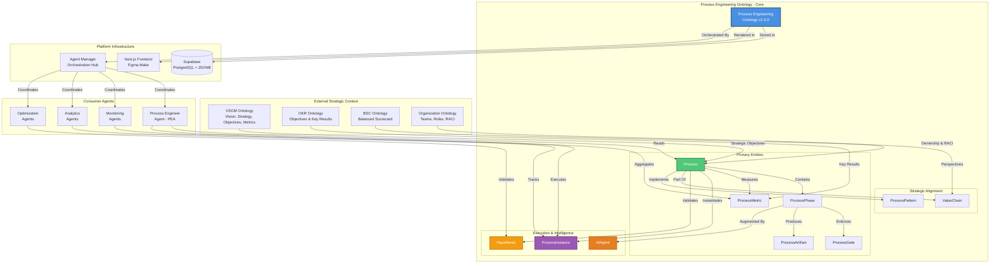

### Architecture Layers

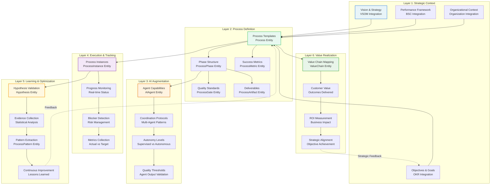

---

## 2. Core Entity Structure

### Entity Relationship Diagram

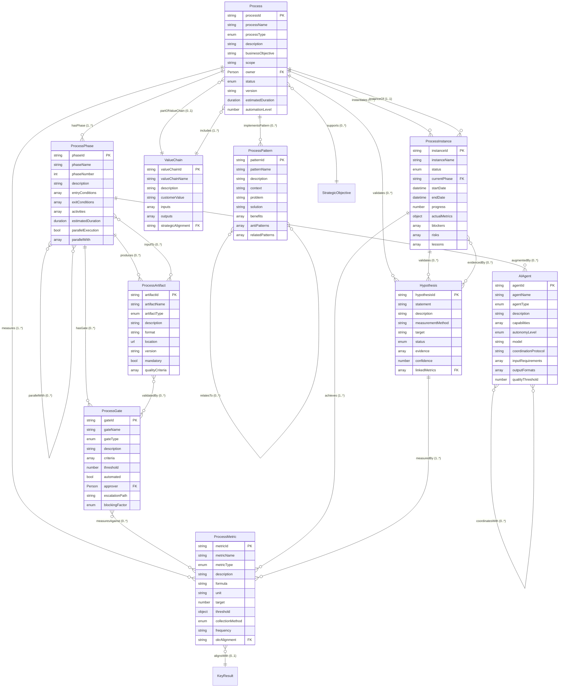

### Entity Hierarchy & Composition

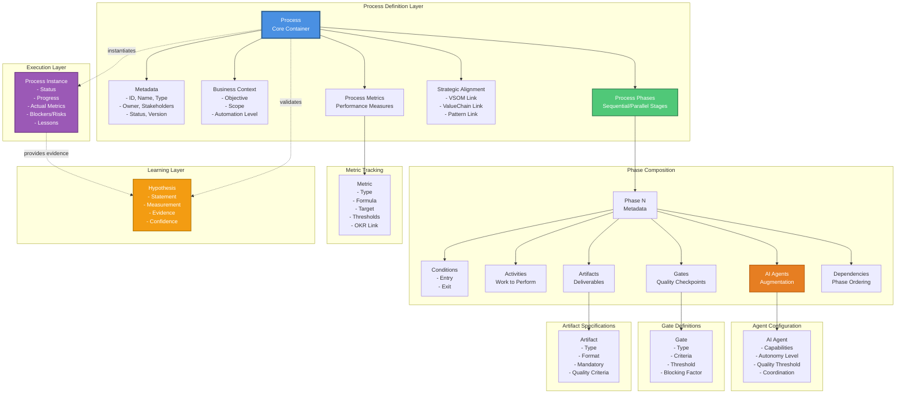

---

## 3. Process Lifecycle Flow

### Cradle-to-Grave Process Journey

```mermaid
stateDiagram-v2
    [*] --> ProcessDesign: Create Process Definition
    
    state ProcessDesign {
        [*] --> DefineObjective: Link to VSOM Strategy
        DefineObjective --> MapPhases: Structure Workflow
        MapPhases --> DefineGates: Set Quality Standards
        DefineGates --> DefineMetrics: Establish Measurements
        DefineMetrics --> ConfigureAgents: Enable AI Augmentation
        ConfigureAgents --> DefineHypotheses: Set Improvement Goals
        DefineHypotheses --> [*]: Process Template Ready
    }
    
    ProcessDesign --> ProcessExecution: Instantiate Process
    
    state ProcessExecution {
        [*] --> Initialize: Create ProcessInstance
        Initialize --> ExecutePhases: Begin Phase 1
        
        state ExecutePhases {
            [*] --> CheckEntry: Validate Entry Conditions
            CheckEntry --> PerformActivities: Execute Phase Activities
            PerformActivities --> AgentAugmentation: AI Agent Support
            AgentAugmentation --> ProduceArtifacts: Generate Deliverables
            ProduceArtifacts --> EvaluateGate: Quality Gate Check
            
            state EvaluateGate {
                [*] --> AutoGate: Automated?
                AutoGate --> GatePass: Criteria Met
                AutoGate --> HumanReview: Manual Approval
                HumanReview --> GatePass: Approved
                HumanReview --> GateFail: Rejected
                GatePass --> [*]: Continue
                GateFail --> [*]: Rework
            }
            
            EvaluateGate --> CheckExit: Validate Exit Conditions
            CheckExit --> NextPhase: Conditions Met
            CheckExit --> Rework: Incomplete
            Rework --> PerformActivities: Iterate
            NextPhase --> [*]: Phase Complete
        }
        
        ExecutePhases --> CollectMetrics: Track Performance
        CollectMetrics --> DetectBlockers: Monitor Health
        
        state DetectBlockers {
            [*] --> CheckStatus: Evaluate Progress
            CheckStatus --> Green: On Track
            CheckStatus --> Yellow: At Risk
            CheckStatus --> Red: Blocked
            Yellow --> Escalate: Alert Stakeholders
            Red --> Escalate: Immediate Action
            Green --> [*]: Continue
            Escalate --> Resolve: Take Action
            Resolve --> [*]: Unblock
        }
        
        DetectBlockers --> MorePhases{More Phases?}
        MorePhases --> ExecutePhases: Yes
        MorePhases --> Complete: No - All Done
        Complete --> [*]: Process Complete
    }
    
    ProcessExecution --> ProcessLearning: Collect Lessons
    
    state ProcessLearning {
        [*] --> CaptureMetrics: Actual vs Target
        CaptureMetrics --> ValidateHypotheses: Test Assumptions
        ValidateHypotheses --> AnalyzeEvidence: Statistical Confidence
        AnalyzeEvidence --> UpdateStatus: Validated/Invalidated
        UpdateStatus --> ExtractLessons: Identify Improvements
        ExtractLessons --> CreatePatterns: Codify Best Practices
        CreatePatterns --> [*]: Learning Complete
    }
    
    ProcessLearning --> ProcessOptimization: Apply Improvements
    
    state ProcessOptimization {
        [*] --> AnalyzePerformance: Review Metrics
        AnalyzePerformance --> IdentifyBottlenecks: Find Issues
        IdentifyBottlenecks --> ProposeChanges: Suggest Improvements
        ProposeChanges --> TestHypothesis: Create New Hypothesis
        TestHypothesis --> UpdateDefinition: Modify Process
        UpdateDefinition --> [*]: New Version Ready
    }
    
    ProcessOptimization --> ProcessDesign: Iterate (New Version)
    ProcessExecution --> [*]: Archive Instance
    ProcessOptimization --> [*]: Continuous Improvement
```

### Phase Execution Sequence

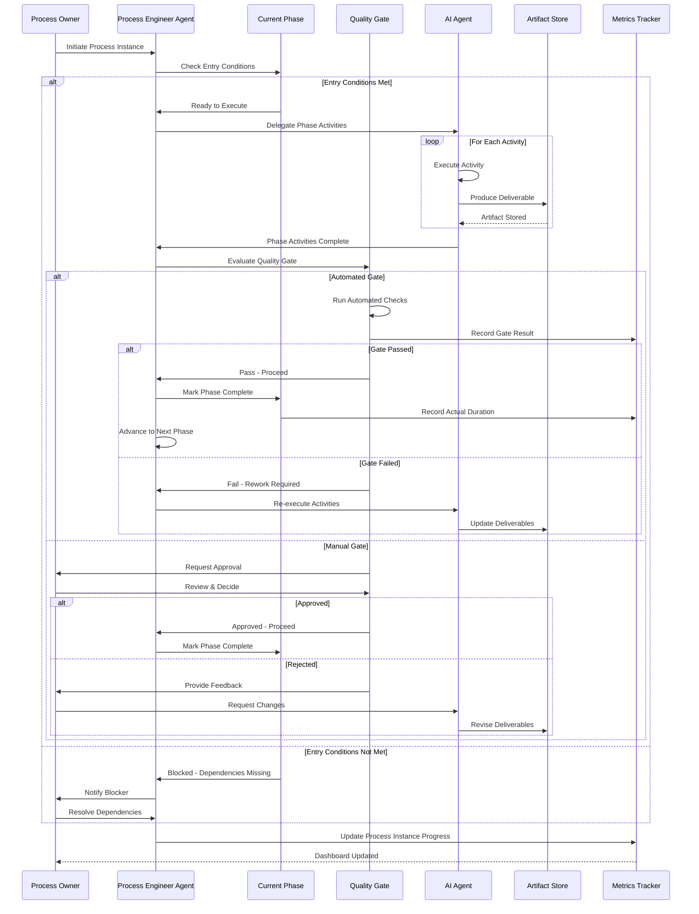

---

## 4. Integration Architecture

### Strategic Ontology Integrations

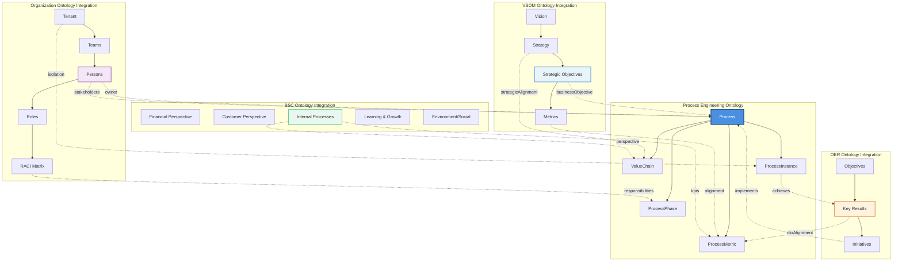

### Platform Instance Deployments

```mermaid
graph TB
    subgraph "Platform Foundation Core - PF-Core"
        PFC[Process Engineering<br/>Ontology v1.0.0]
        
        PFC --> SHARED[Shared Assets<br/>- ProcessPattern Library<br/>- Common Metrics<br/>- Best Practices]
    end
    
    subgraph "BAIV Platform Instance"
        BAIV_PROC[AI Visibility Processes]
        
        BAIV_PROC --> BAIV_1[Discovery Audit<br/>Process]
        BAIV_PROC --> BAIV_2[Content Optimization<br/>Process]
        BAIV_PROC --> BAIV_3[Competitive Analysis<br/>Process]
        BAIV_PROC --> BAIV_4[Gap Remediation<br/>Process]
        
        BAIV_CTX[BAIV Context<br/>- AI Visibility Domain<br/>- Marketing Focus<br/>- SEO/SEM Metrics]
    end
    
    subgraph "AIR Platform Instance"
        AIR_PROC[AI Readiness Processes]
        
        AIR_PROC --> AIR_1[Maturity Assessment<br/>Process]
        AIR_PROC --> AIR_2[Gap Analysis<br/>Process]
        AIR_PROC --> AIR_3[Capability Development<br/>Process]
        AIR_PROC --> AIR_4[Governance Framework<br/>Process]
        
        AIR_CTX[AIR Context<br/>- AI Strategy Domain<br/>- Enterprise Focus<br/>- Readiness Metrics]
    end
    
    subgraph "W4M Platform Instance"
        W4M_PROC[Value Engineering Processes]
        
        W4M_PROC --> W4M_1[Idea Validation<br/>Process]
        W4M_PROC --> W4M_2[MVP Development<br/>Process]
        W4M_PROC --> W4M_3[PMF Testing<br/>Process]
        W4M_PROC --> W4M_4[Value Realization<br/>Process]
        
        W4M_CTX[W4M Context<br/>- Innovation Domain<br/>- Startup Focus<br/>- PMF Metrics]
    end
    
    PFC -.template.-> BAIV_PROC
    PFC -.template.-> AIR_PROC
    PFC -.template.-> W4M_PROC
    
    SHARED -.reuse.-> BAIV_1
    SHARED -.reuse.-> AIR_1
    SHARED -.reuse.-> W4M_1
    
    BAIV_CTX -.contextualizes.-> BAIV_PROC
    AIR_CTX -.contextualizes.-> AIR_PROC
    W4M_CTX -.contextualizes.-> W4M_PROC
    
    style PFC fill:#4A90E2,stroke:#2E5C8A,stroke-width:3px,color:#fff
    style BAIV_PROC fill:#50C878,stroke:#2E7D4E,stroke-width:2px,color:#fff
    style AIR_PROC fill:#E67E22,stroke:#BA6316,stroke-width:2px,color:#fff
    style W4M_PROC fill:#9B59B6,stroke:#6C3483,stroke-width:2px,color:#fff
```

---

## 5. Data Flow Diagrams

### Process Definition to Execution Flow

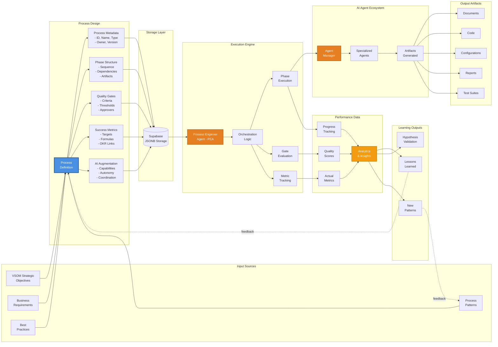

### Inputs, Transformations, and Outputs

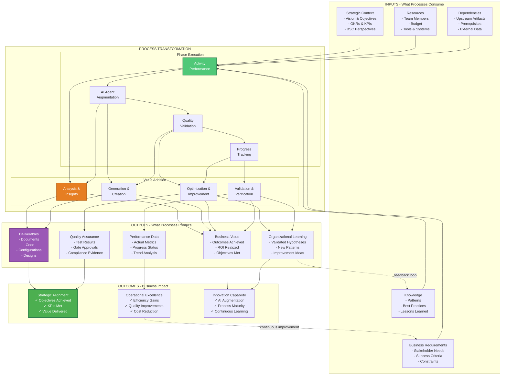

---

## 6. AI Agent Orchestration

### Multi-Agent Coordination Pattern

```mermaid
graph TB
    subgraph "Agent Manager - Orchestration Hub"
        AM[Agent Manager<br/>Master Orchestrator]
        
        AM --> COORD[Coordination Logic<br/>- Capability Matching<br/>- Load Balancing<br/>- Quality Monitoring]
    end
    
    subgraph "Process Engineer Agent - PEA"
        PEA[Process Engineer Agent<br/>Primary Process Orchestrator]
        
        PEA --> READ[Read Process<br/>Definition]
        PEA --> PLAN[Plan Execution<br/>Sequence]
        PEA --> DELEGATE[Delegate to<br/>Specialist Agents]
        PEA --> MONITOR[Monitor<br/>Progress]
    end
    
    subgraph "Discovery Cluster - Analysis Agents"
        D1[Requirements<br/>Analyzer Agent]
        D2[Gap<br/>Analysis Agent]
        D3[Competitive<br/>Intelligence Agent]
        D4[Risk<br/>Detection Agent]
    end
    
    subgraph "Generation Cluster - Creation Agents"
        G1[Code<br/>Generator Agent]
        G2[Test<br/>Generator Agent]
        G3[Documentation<br/>Generator Agent]
        G4[Configuration<br/>Generator Agent]
    end
    
    subgraph "Optimization Cluster - Improvement Agents"
        OPT1[Performance<br/>Optimizer Agent]
        OPT2[Cost<br/>Optimizer Agent]
        OPT3[Quality<br/>Optimizer Agent]
        OPT4[Process<br/>Optimizer Agent]
    end
    
    subgraph "Validation Cluster - Quality Agents"
        V1[Code<br/>Validator Agent]
        V2[Test<br/>Executor Agent]
        V3[Compliance<br/>Checker Agent]
        V4[Security<br/>Scanner Agent]
    end
    
    subgraph "Monitoring Cluster - Tracking Agents"
        M1[Progress<br/>Monitor Agent]
        M2[Metric<br/>Collector Agent]
        M3[Blocker<br/>Detector Agent]
        M4[Health<br/>Monitor Agent]
    end
    
    AM --> PEA
    
    PEA -.delegates.-> D1 & D2 & D3 & D4
    PEA -.delegates.-> G1 & G2 & G3 & G4
    PEA -.delegates.-> OPT1 & OPT2 & OPT3 & OPT4
    PEA -.delegates.-> V1 & V2 & V3 & V4
    PEA -.delegates.-> M1 & M2 & M3 & M4
    
    D1 & D2 & D3 & D4 -.reports to.-> PEA
    G1 & G2 & G3 & G4 -.reports to.-> PEA
    OPT1 & OPT2 & OPT3 & OPT4 -.reports to.-> PEA
    V1 & V2 & V3 & V4 -.reports to.-> PEA
    M1 & M2 & M3 & M4 -.reports to.-> PEA
    
    subgraph "Coordination Protocols"
        PROTO1[Hub-and-Spoke<br/>PEA coordinates all]
        PROTO2[Peer-to-Peer<br/>Direct agent coordination]
        PROTO3[Pipeline<br/>Sequential handoffs]
        PROTO4[Broadcast<br/>Parallel execution]
    end
    
    PEA -.uses.-> PROTO1 & PROTO2 & PROTO3 & PROTO4
    
    style AM fill:#2C3E50,stroke:#1A252F,stroke-width:3px,color:#fff
    style PEA fill:#E67E22,stroke:#BA6316,stroke-width:3px,color:#fff
    style D1 fill:#3498DB,stroke:#2471A3,stroke-width:2px,color:#fff
    style G1 fill:#27AE60,stroke:#1E8449,stroke-width:2px,color:#fff
    style OPT1 fill:#F39C12,stroke:#B77A09,stroke-width:2px,color:#fff
    style V1 fill:#9B59B6,stroke:#6C3483,stroke-width:2px,color:#fff
    style M1 fill:#E74C3C,stroke:#A93226,stroke-width:2px,color:#fff
```

### Agent Autonomy Levels & Supervision

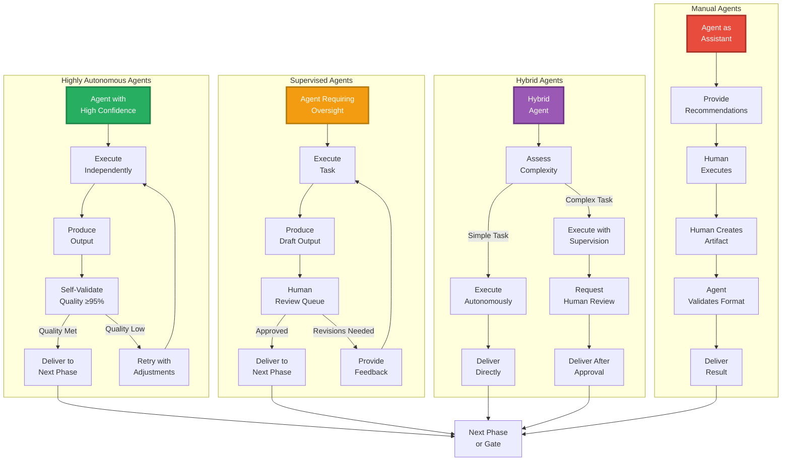

---

## 7. Multi-Tenant Architecture

### Tenant Isolation & Data Segmentation

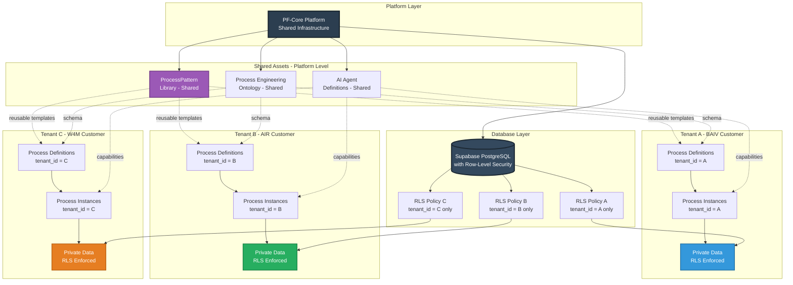

### RLS Policy Implementation

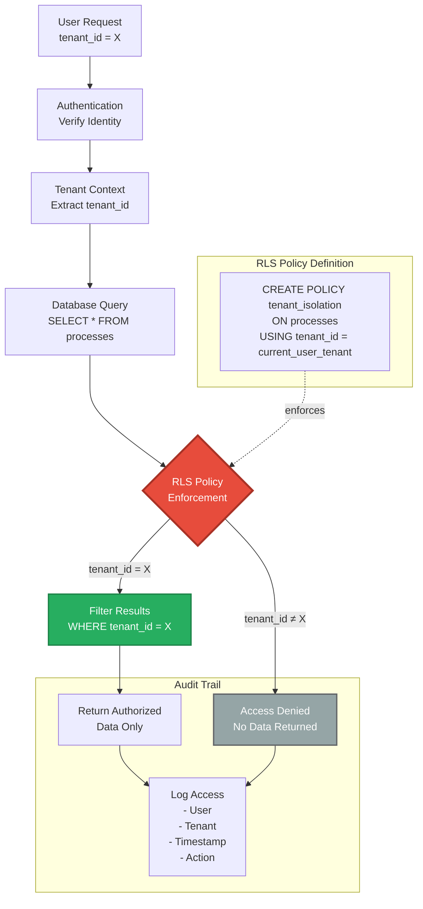

---

## 8. Deployment Architecture

### Technology Stack

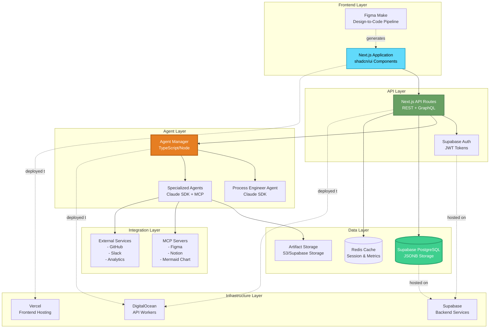

### Deployment Pipeline

```mermaid
flowchart LR
    subgraph "Development"
        DEV_CODE[Local Development<br/>Claude Code CLI]
        DEV_TEST[Unit & Integration<br/>Tests - 80% Coverage]
        
        DEV_CODE --> DEV_TEST
    end
    
    subgraph "Version Control"
        GIT[GitHub Repository<br/>Main Branch]
        
        DEV_TEST -->|git push| GIT
    end
    
    subgraph "CI/CD Pipeline"
        CI[GitHub Actions<br/>Automated Build]
        
        GIT -->|trigger| CI
        
        CI --> BUILD[Build<br/>Application]
        BUILD --> LINT[Lint &<br/>Format]
        LINT --> TEST[Run Test<br/>Suite]
        TEST --> VALIDATE[Validate<br/>Ontology]
    end
    
    subgraph "Staging Environment"
        STAGE_DEPLOY[Deploy to<br/>Staging]
        STAGE_TEST[E2E Testing<br/>& Validation]
        
        VALIDATE -->|pass| STAGE_DEPLOY
        STAGE_DEPLOY --> STAGE_TEST
    end
    
    subgraph "Production Deployment"
        PROD_APPROVE[Manual<br/>Approval]
        PROD_DEPLOY[Deploy to<br/>Production]
        PROD_MONITOR[Monitor<br/>Health]
        
        STAGE_TEST -->|pass| PROD_APPROVE
        PROD_APPROVE -->|approved| PROD_DEPLOY
        PROD_DEPLOY --> PROD_MONITOR
    end
    
    subgraph "Rollback Strategy"
        PROD_MONITOR -->|issues detected| ROLLBACK[Rollback to<br/>Previous Version]
        ROLLBACK --> INVESTIGATE[Investigate &<br/>Fix Issues]
        INVESTIGATE --> DEV_CODE
    end
    
    PROD_MONITOR -->|healthy| SUCCESS[Deployment<br/>Complete ✓]
    
    style CI fill:#2088FF,stroke:#0969DA,stroke-width:2px,color:#fff
    style PROD_DEPLOY fill:#27AE60,stroke:#1E8449,stroke-width:3px,color:#fff
    style ROLLBACK fill:#E74C3C,stroke:#A93226,stroke-width:2px,color:#fff
```

### Environment Configuration

```mermaid
graph TB
    subgraph "Environment Variables"
        ENV[Environment Config<br/>.env files]
        
        ENV --> ENV_DEV[Development<br/>- Local DB<br/>- Debug Mode<br/>- Mock Agents]
        ENV --> ENV_STAGE[Staging<br/>- Staging DB<br/>- Verbose Logs<br/>- Test Agents]
        ENV --> ENV_PROD[Production<br/>- Prod DB<br/>- Error Logs Only<br/>- Live Agents]
    end
    
    subgraph "Database Configuration"
        DB_CONFIG[Database Settings]
        
        DB_CONFIG --> DB_DEV[Dev: local<br/>No RLS]
        DB_CONFIG --> DB_STAGE[Staging: cloud<br/>RLS Testing]
        DB_CONFIG --> DB_PROD[Production: cloud<br/>RLS Enforced]
    end
    
    subgraph "Agent Configuration"
        AGENT_CONFIG[AI Agent Settings]
        
        AGENT_CONFIG --> AGENT_DEV[Dev: Mock<br/>Fast Responses]
        AGENT_CONFIG --> AGENT_STAGE[Staging: Haiku<br/>Cost-Effective]
        AGENT_CONFIG --> AGENT_PROD[Production: Sonnet 4.5<br/>High Quality]
    end
    
    subgraph "Monitoring Configuration"
        MON_CONFIG[Monitoring Setup]
        
        MON_CONFIG --> MON_DEV[Dev: Console<br/>Logs Only]
        MON_CONFIG --> MON_STAGE[Staging: Basic<br/>Metrics]
        MON_CONFIG --> MON_PROD[Production: Full<br/>Observability]
    end
    
    ENV_DEV --> APP_DEV[Development<br/>Application]
    ENV_STAGE --> APP_STAGE[Staging<br/>Application]
    ENV_PROD --> APP_PROD[Production<br/>Application]
    
    DB_DEV --> APP_DEV
    DB_STAGE --> APP_STAGE
    DB_PROD --> APP_PROD
    
    AGENT_DEV --> APP_DEV
    AGENT_STAGE --> APP_STAGE
    AGENT_PROD --> APP_PROD
    
    MON_DEV --> APP_DEV
    MON_STAGE --> APP_STAGE
    MON_PROD --> APP_PROD
    
    style ENV_PROD fill:#27AE60,stroke:#1E8449,stroke-width:3px,color:#fff
    style DB_PROD fill:#3ECF8E,stroke:#2BA46F,stroke-width:3px,color:#fff
    style AGENT_PROD fill:#E67E22,stroke:#BA6316,stroke-width:3px,color:#fff
    style APP_PROD fill:#4A90E2,stroke:#2E5C8A,stroke-width:3px,color:#fff
```

---

## Summary: Key Architectural Patterns

### 1. **Ontology-Driven Architecture**
- Process definitions stored as JSON-LD in JSONB
- Schema.org grounding enables semantic interoperability
- Configuration over code for platform transferability

### 2. **Agentic Orchestration Hub**
- Process Engineer Agent (PEA) as primary orchestrator
- Hub-and-spoke pattern with Agent Manager coordination
- Capability-based agent selection and load balancing

### 3. **Strategic Integration Cascade**
- VSOM → Process → Phase → Gate → Metric
- OKR Key Results measured through ProcessMetric
- BSC perspectives aligned with ValueChain

### 4. **Multi-Tenant Isolation**
- Row-Level Security (RLS) policies at database layer
- Tenant-scoped process instances with audit trails
- Shared patterns and ontologies, private execution data

### 5. **Hypothesis-Driven Improvement**
- ProcessInstance execution generates evidence
- Statistical validation with confidence scoring
- Lessons learned feed back into process optimization

### 6. **Quality Gate Enforcement**
- Blocking, warning, and informational gates
- Automated and manual approval workflows
- Progressive quality validation through phases

### 7. **Platform Foundation Core (PF-Core)**
- Reusable ontology across BAIV, AIR, W4M instances
- Context-specific process implementations
- Centralized governance with distributed execution

---

**Document Version:** 1.0.0  
**Last Updated:** 2026-01-18  
**Maintained By:** Platform Foundation Core Team  
**Status:** Production Ready

All diagrams are Mermaid-compatible and can be rendered in Markdown viewers, GitHub, Notion, Mermaid Chart, and other tools supporting Mermaid syntax.
