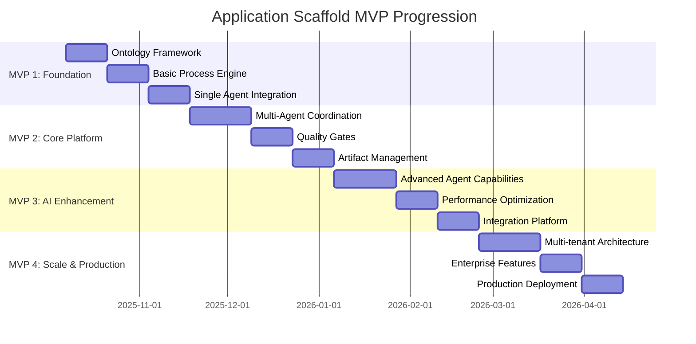
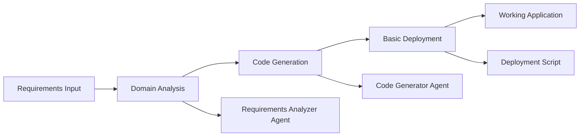
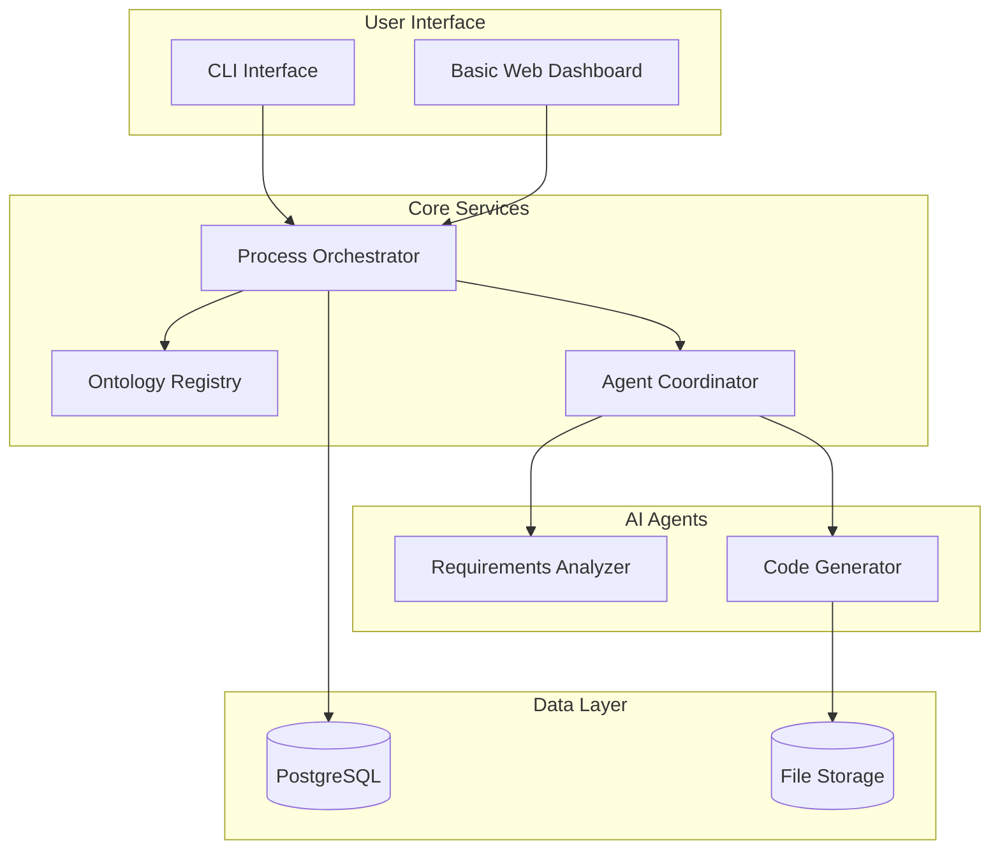
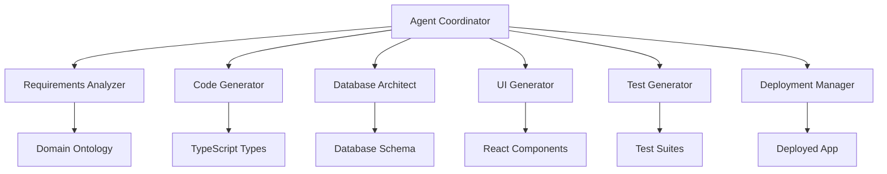
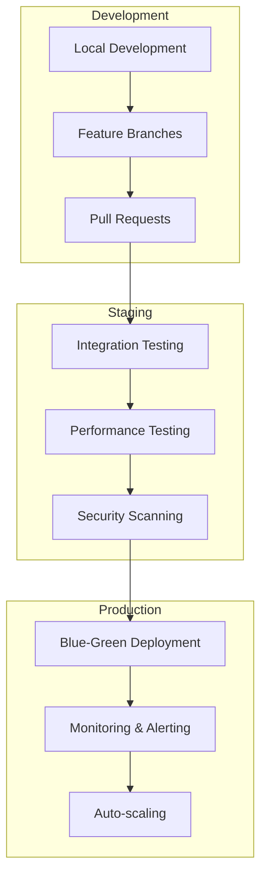
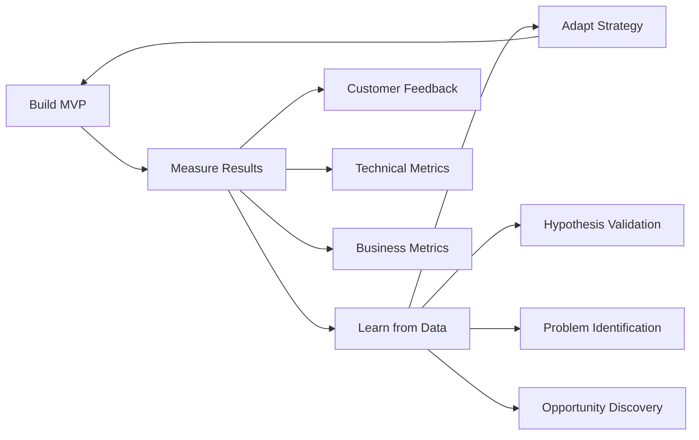

# Application Scaffold System - MVP Build Plan

**Version:** 1.0.0  
**Date:** 2025-10-04  
**Project:** AI-Augmented Application Scaffold Platform  
**Approach:** Iterative MVP Development with Hypothesis Validation

---

## Executive Summary

This build plan outlines the development of the Application Scaffold System using an iterative MVP approach. The plan is structured around 4 progressive MVPs, each delivering increasing value while validating core hypotheses and building toward the full vision.

**MVP Philosophy**: "Build the minimum viable increment that delivers maximum learning and customer value"

### MVP Progression Strategy



---

## MVP 1: Foundation (Weeks 1-6) - "Prove the Concept"

### Objective
Validate that AI-augmented process orchestration can generate working application scaffolds faster than traditional development.

### Hypothesis to Test
*"An AI-orchestrated process can generate a working CRUD application in <3 days vs 30+ days with traditional development"*

### Success Criteria
- [ ] Complete application scaffold in <72 hours
- [ ] Generated code compiles and runs without errors
- [ ] Basic CRUD operations functional
- [ ] >60% of development activities automated

### Core Components

#### Week 1-2: Ontology Framework
**Deliverables:**
- [ ] Process Engineering Ontology v1.0 (complete implementation)
- [ ] Ontology Architect Agent (OAA) functional
- [ ] Registry system with basic CRUD operations
- [ ] Comprehensive glossary and test data

**Technical Implementation:**
```typescript
// MVP 1 Ontology Stack
const mvp1TechStack = {
  ontology: {
    storage: 'PostgreSQL',
    format: 'JSON-LD',
    validation: 'Zod schemas',
    registry: 'REST API'
  },
  agent: {
    llm: 'Claude Sonnet 4',
    framework: 'TypeScript + Express',
    tools: ['schema validation', 'artifact generation']
  }
}
```

**Acceptance Criteria:**
- [ ] OAA can create, validate, and register ontologies
- [ ] Generated glossaries have >95% completeness
- [ ] Test data passes validation at >95% rate
- [ ] Registry supports versioning and dependencies

#### Week 3-4: Basic Process Engine
**Deliverables:**
- [ ] Process Orchestrator v1.0 (simplified)
- [ ] 3-phase process execution (Domain → Code → Deploy)
- [ ] Basic state management and persistence
- [ ] Simple progress tracking

**Process Flow (MVP 1):**


**Acceptance Criteria:**
- [ ] Process executes all 3 phases sequentially
- [ ] State persisted between phases
- [ ] Clear error handling and recovery
- [ ] Progress reporting functional

#### Week 5-6: Single Agent Integration
**Deliverables:**
- [ ] Requirements Analyzer Agent (Claude-based)
- [ ] Code Generator Agent (Claude-based)
- [ ] Basic agent coordination framework
- [ ] Generated Next.js + Supabase application

**Agent Specifications:**
```yaml
requirements_analyzer:
  model: "claude-sonnet-4-20250514"
  capabilities:
    - "Extract entities from business requirements"
    - "Map to schema.org vocabulary"
    - "Generate ontology configuration"
  autonomy: "supervised"
  
code_generator:
  model: "claude-sonnet-4-20250514"
  capabilities:
    - "Generate TypeScript types"
    - "Create React components"
    - "Generate Supabase schemas"
  autonomy: "highly-autonomous"
```

**Acceptance Criteria:**
- [ ] Requirements Analyzer extracts entities with >80% accuracy
- [ ] Code Generator produces compilable TypeScript
- [ ] Generated application has working CRUD operations
- [ ] End-to-end process completes in <3 days

### MVP 1 Architecture



### Implementation Sprint Plan

**Sprint 1 (Week 1): Ontology Foundation**
- [ ] Day 1-2: Set up development environment and CI/CD
- [ ] Day 3-5: Implement Process Engineering Ontology
- [ ] Day 6-7: Build Ontology Architect Agent core
- [ ] Day 8-10: Create registry with basic operations
- [ ] Sprint Goal: Working ontology system with OAA

**Sprint 2 (Week 2): Ontology Completion**
- [ ] Day 1-3: Generate comprehensive glossary system
- [ ] Day 4-6: Create test data generation framework
- [ ] Day 7-10: Implement validation and quality metrics
- [ ] Sprint Goal: Complete ontology framework with artifacts

**Sprint 3 (Week 3): Process Engine Foundation**
- [ ] Day 1-3: Design and implement process state machine
- [ ] Day 4-6: Build phase execution framework
- [ ] Day 7-10: Add persistence and basic error handling
- [ ] Sprint Goal: Working 3-phase process orchestration

**Sprint 4 (Week 4): Process Engine Enhancement**
- [ ] Day 1-3: Implement progress tracking and reporting
- [ ] Day 4-6: Add quality gates and validation
- [ ] Day 7-10: Build recovery and retry mechanisms
- [ ] Sprint Goal: Robust process execution engine

**Sprint 5 (Week 5): Agent Integration Foundation**
- [ ] Day 1-3: Implement agent coordination framework
- [ ] Day 4-6: Build Requirements Analyzer Agent
- [ ] Day 7-10: Create Claude API integration and testing
- [ ] Sprint Goal: Working requirements analysis automation

**Sprint 6 (Week 6): End-to-End MVP**
- [ ] Day 1-3: Implement Code Generator Agent
- [ ] Day 4-6: Build deployment automation
- [ ] Day 7-10: Integration testing and bug fixes
- [ ] Sprint Goal: Complete working MVP 1

### Risk Mitigation

**High Priority Risks:**
1. **Claude API Rate Limits**
   - Mitigation: Implement intelligent caching and request batching
   - Fallback: Prepare OpenAI GPT-4 integration as backup

2. **Code Quality Below Standards**
   - Mitigation: Comprehensive validation rules and quality gates
   - Fallback: Human review checkpoints for critical components

3. **Performance Issues**
   - Mitigation: Implement async processing and progress tracking
   - Fallback: Simplify initial process to ensure completion target

### Success Metrics (MVP 1)

| Metric | Target | Measurement Method |
|--------|--------|-------------------|
| Time to Working App | <3 days | End-to-end timer |
| Code Compilation Success | 100% | Automated testing |
| CRUD Operations Functional | 100% | Integration tests |
| AI Automation Percentage | >60% | Activity classification |
| Process Success Rate | >80% | Process completion tracking |

---

## MVP 2: Core Platform (Weeks 7-13) - "Scale the Foundation"

### Objective
Expand to full 9-phase process with comprehensive AI agent coordination and quality management.

### Hypothesis to Test
*"Multi-agent coordination can achieve >80% automation while maintaining >95% code quality"*

### Success Criteria
- [ ] All 9 phases operational with quality gates
- [ ] >80% AI automation achieved
- [ ] >95% code quality score maintained
- [ ] Multiple concurrent processes supported

### Core Components

#### Week 7-9: Multi-Agent Coordination
**Deliverables:**
- [ ] Complete Agent Coordinator service
- [ ] 6 specialized AI agents (Requirements, Code, Database, UI, Test, Deployment)
- [ ] Agent communication and handoff protocols
- [ ] Performance monitoring and optimization

**Agent Ecosystem:**


**Agent Specifications:**
```typescript
interface AgentSpecification {
  databaseArchitect: {
    capabilities: [
      'Supabase schema generation',
      'Migration scripts',
      'RLS policy creation',
      'Index optimization'
    ],
    autonomy: 'supervised'
  },
  
  uiGenerator: {
    capabilities: [
      'React component generation',
      'Tailwind CSS styling',
      'Form validation',
      'Data visualization'
    ],
    autonomy: 'highly-autonomous'
  },
  
  testGenerator: {
    capabilities: [
      'Unit test generation',
      'Integration test creation',
      'E2E test scenarios',
      'Performance benchmarks'
    ],
    autonomy: 'highly-autonomous'
  }
}
```

#### Week 10-11: Quality Gates Implementation
**Deliverables:**
- [ ] Quality Gate Controller service
- [ ] Automated validation framework
- [ ] Quality metrics calculation
- [ ] Gate approval workflows

**Quality Gate Definitions:**
```yaml
quality_gates:
  domain_approval:
    criteria:
      - requirements_completeness: 0.9
      - schema_org_alignment: 0.8
      - business_objectives_clarity: 0.85
    automation_level: "partial"
    
  code_quality:
    criteria:
      - compilation_success: 1.0
      - test_coverage: 0.9
      - linting_score: 0.95
      - security_scan: 0.95
    automation_level: "full"
    
  deployment_readiness:
    criteria:
      - all_tests_pass: 1.0
      - performance_benchmarks: 0.9
      - security_compliance: 0.95
    automation_level: "full"
```

#### Week 12-13: Artifact Management
**Deliverables:**
- [ ] Comprehensive artifact management system
- [ ] Version control integration
- [ ] Artifact quality scoring
- [ ] Documentation generation

**Artifact Management Features:**
- [ ] Automatic organization by phase and type
- [ ] Version tracking and history
- [ ] Quality assessment and scoring
- [ ] Dependency tracking between artifacts
- [ ] Automated documentation generation

### MVP 2 Success Metrics

| Metric | Target | Current Baseline |
|--------|--------|------------------|
| AI Automation Percentage | >80% | 60% (MVP 1) |
| Code Quality Score | >95% | TBD |
| Process Success Rate | >90% | 80% (MVP 1) |
| Quality Gate Pass Rate | >95% | TBD |
| Concurrent Process Support | 5 processes | 1 process |

---

## MVP 3: AI Enhancement (Weeks 14-20) - "Optimize Intelligence"

### Objective
Enhance AI capabilities with advanced coordination, performance optimization, and broader platform support.

### Hypothesis to Test
*"Advanced AI coordination and optimization can reduce time-to-MVP to <7 days while expanding platform support"*

### Success Criteria
- [ ] Time to MVP reduced to <7 days
- [ ] Support for React + Firebase platform
- [ ] Advanced error recovery and optimization
- [ ] Intelligent resource allocation

### Core Components

#### Week 14-16: Advanced Agent Capabilities
**Deliverables:**
- [ ] Performance Optimization Agent
- [ ] Intelligent Error Recovery Agent
- [ ] Resource Allocation Optimizer
- [ ] Advanced agent coordination patterns

**Enhanced Agent Features:**
```typescript
interface AdvancedAgentCapabilities {
  performanceOptimizer: {
    capabilities: [
      'Code performance analysis',
      'Database query optimization',
      'Bundle size optimization',
      'Caching strategy implementation'
    ],
    ml_models: ['performance-prediction', 'optimization-recommendation']
  },
  
  errorRecoveryAgent: {
    capabilities: [
      'Automatic error detection',
      'Root cause analysis',
      'Recovery strategy generation',
      'Preventive optimization'
    ],
    learning: 'continuous'
  }
}
```

#### Week 17-18: Performance Optimization
**Deliverables:**
- [ ] Parallel phase execution optimization
- [ ] Intelligent caching layer
- [ ] Resource usage optimization
- [ ] Performance monitoring and alerting

#### Week 19-20: Platform Integration Expansion
**Deliverables:**
- [ ] React + Firebase platform support
- [ ] Platform-agnostic abstraction layer
- [ ] Migration tools between platforms
- [ ] Platform-specific optimization

### MVP 3 Success Metrics

| Metric | Target | Previous MVP |
|--------|--------|--------------|
| Time to MVP | <7 days | <3 days (MVP 1) |
| Platform Support | 2 platforms | 1 platform |
| Error Recovery Rate | >95% | Manual recovery |
| Resource Efficiency | +40% | Baseline MVP 2 |

---

## MVP 4: Scale & Production (Weeks 21-27) - "Enterprise Ready"

### Objective
Transform into production-ready, multi-tenant platform with enterprise features and comprehensive monitoring.

### Hypothesis to Test
*"Enterprise-grade platform can support 100+ concurrent processes while maintaining quality and performance standards"*

### Success Criteria
- [ ] Multi-tenant architecture operational
- [ ] Support for 100+ concurrent processes
- [ ] Enterprise security and compliance
- [ ] Comprehensive analytics and reporting

### Core Components

#### Week 21-23: Multi-tenant Architecture
**Deliverables:**
- [ ] Tenant isolation and management
- [ ] Resource quotas and billing
- [ ] Role-based access control
- [ ] Data segregation and security

#### Week 24-25: Enterprise Features
**Deliverables:**
- [ ] SSO integration
- [ ] Audit logging and compliance
- [ ] Advanced analytics dashboard
- [ ] API management and documentation

#### Week 26-27: Production Deployment
**Deliverables:**
- [ ] Production infrastructure deployment
- [ ] Monitoring and alerting setup
- [ ] Disaster recovery implementation
- [ ] Performance optimization and scaling

---

## Technical Implementation Strategy

### Development Environment Setup

```bash
# Project Structure
app-scaffold-platform/
├── packages/
│   ├── ontology-core/          # Ontology framework
│   ├── process-engine/         # Process orchestration
│   ├── agent-coordinator/      # AI agent management
│   ├── quality-gates/          # Quality assurance
│   ├── artifact-manager/       # Artifact management
│   ├── web-dashboard/          # User interface
│   └── cli-tools/             # Command line interface
├── agents/
│   ├── requirements-analyzer/  # Requirements processing
│   ├── code-generator/        # Code generation
│   ├── database-architect/    # Database design
│   ├── ui-generator/          # UI component creation
│   ├── test-generator/        # Test automation
│   └── deployment-manager/    # Deployment automation
├── infrastructure/
│   ├── terraform/             # Infrastructure as code
│   ├── kubernetes/            # Container orchestration
│   └── monitoring/            # Observability setup
└── tests/
    ├── unit/                  # Unit tests
    ├── integration/           # Integration tests
    ├── e2e/                   # End-to-end tests
    └── performance/           # Load and performance tests
```

### Technology Decisions

```yaml
# MVP Technology Stack
backend:
  runtime: "Node.js 18+"
  framework: "Express.js with TypeScript"
  database: "PostgreSQL 15+"
  cache: "Redis 7+"
  message_queue: "Redis pub/sub"

frontend:
  framework: "Next.js 14+"
  ui_library: "React 18+ with TypeScript"
  styling: "Tailwind CSS"
  state_management: "Zustand"
  
ai_integration:
  primary_llm: "Anthropic Claude Sonnet 4"
  fallback_llm: "OpenAI GPT-4"
  vector_db: "Pinecone / Weaviate"
  
infrastructure:
  container: "Docker"
  orchestration: "Kubernetes"
  cloud: "AWS / Azure / GCP"
  monitoring: "Prometheus + Grafana"
  logging: "ELK Stack"

development:
  package_manager: "pnpm"
  bundler: "Turbo"
  testing: "Jest + Playwright"
  ci_cd: "GitHub Actions"
  code_quality: "ESLint + Prettier + SonarQube"
```

### Deployment Strategy



### Quality Assurance Strategy

```yaml
# Quality Gates at Each MVP Level
mvp1_quality:
  code_coverage: ">80%"
  compilation_success: "100%"
  integration_tests: "All passing"
  manual_testing: "Core flows verified"

mvp2_quality:
  code_coverage: ">85%"
  performance_tests: "Response time <200ms P95"
  security_scan: "No high/critical vulnerabilities"
  automated_testing: ">90% test automation"

mvp3_quality:
  code_coverage: ">90%"
  load_testing: "100 concurrent users"
  availability: ">99% uptime"
  documentation: "Complete API documentation"

mvp4_quality:
  code_coverage: ">95%"
  load_testing: "1000 concurrent users"
  availability: ">99.9% uptime"
  compliance: "SOC 2 Type II ready"
```

---

## Resource Requirements & Timeline

### Team Structure

```yaml
# Recommended Team Composition
core_team:
  tech_lead: 1
  senior_engineers: 2
  engineers: 3
  ai_specialist: 1
  devops_engineer: 1
  qa_engineer: 1
  
supporting_roles:
  product_manager: 1
  ux_designer: 1
  technical_writer: 1
  
total_team_size: 11 people
```

### Budget Estimation

| Category | MVP 1 | MVP 2 | MVP 3 | MVP 4 | Total |
|----------|-------|-------|-------|-------|-------|
| Development Team | $150K | $250K | $300K | $350K | $1.05M |
| AI API Costs | $5K | $15K | $25K | $50K | $95K |
| Infrastructure | $10K | $20K | $35K | $75K | $140K |
| Tools & Licenses | $15K | $25K | $30K | $40K | $110K |
| **Total** | **$180K** | **$310K** | **$390K** | **$515K** | **$1.395M** |

### Infrastructure Requirements

```yaml
# Progressive Infrastructure Scaling
mvp1_infrastructure:
  compute: "4 vCPU, 16GB RAM"
  storage: "100GB SSD"
  database: "Small PostgreSQL instance"
  
mvp2_infrastructure:
  compute: "8 vCPU, 32GB RAM"
  storage: "500GB SSD"
  database: "Medium PostgreSQL + Redis"
  
mvp3_infrastructure:
  compute: "16 vCPU, 64GB RAM"
  storage: "1TB SSD"
  database: "Large PostgreSQL cluster + Redis cluster"
  
mvp4_infrastructure:
  compute: "Auto-scaling 4-32 vCPU"
  storage: "5TB+ with auto-scaling"
  database: "High-availability PostgreSQL + Redis"
  monitoring: "Full observability stack"
```

---

## Risk Management & Contingency Plans

### Technical Risks

| Risk | Probability | Impact | Mitigation Strategy |
|------|------------|--------|-------------------|
| AI API rate limits | High | High | Implement caching, request batching, multiple provider support |
| Code quality issues | Medium | High | Comprehensive testing, quality gates, human review checkpoints |
| Performance bottlenecks | Medium | Medium | Load testing, optimization agents, scalable architecture |
| Integration complexity | High | Medium | Modular design, standardized interfaces, extensive testing |

### Business Risks

| Risk | Probability | Impact | Mitigation Strategy |
|------|------------|--------|-------------------|
| Market timing | Low | High | MVP approach allows rapid market feedback and adjustment |
| Competition | Medium | Medium | Focus on AI-augmentation differentiation, rapid iteration |
| Adoption challenges | Medium | High | Comprehensive onboarding, clear value demonstration |
| Technology changes | High | Low | Modular architecture, abstraction layers, continuous monitoring |

### Contingency Plans

**If MVP 1 fails to meet time targets:**
- Reduce scope to 2-phase process (Domain → Code)
- Increase manual oversight and reduce AI autonomy
- Extend timeline by 2 weeks maximum

**If code quality consistently below standards:**
- Implement mandatory human review gates
- Reduce AI autonomy levels
- Invest in better training data and prompting

**If AI API costs exceed budget:**
- Implement more aggressive caching
- Switch to smaller, faster models for routine tasks
- Negotiate enterprise pricing with providers

---

## Success Measurement & Learning Framework

### Key Performance Indicators (KPIs)

#### Development Velocity KPIs
- **Time to MVP**: Target progression 3d → 2d → 1d → 12h
- **Feature Velocity**: Story points delivered per sprint
- **Defect Rate**: Bugs per feature implemented
- **Technical Debt**: Code quality metrics trend

#### Business Value KPIs
- **Customer Acquisition**: Early adopters per MVP release
- **Time to Value**: Customer onboarding to first success
- **Revenue Metrics**: MRR growth and customer lifetime value
- **Market Validation**: Hypothesis confirmation rate

#### Technical Excellence KPIs
- **System Reliability**: Uptime and error rates
- **Performance**: Response times and throughput
- **Code Quality**: Coverage, complexity, maintainability
- **AI Effectiveness**: Automation percentage and accuracy

### Learning & Adaptation Framework



**Learning Cycles:**
- **Daily**: Technical metrics review and immediate course correction
- **Weekly**: Sprint retrospectives and tactical adjustments
- **Monthly**: MVP results analysis and strategic pivots
- **Quarterly**: Platform evolution and roadmap updates

### Hypothesis Tracking

| Hypothesis | MVP | Success Criteria | Measurement Method | Status |
|------------|-----|------------------|-------------------|--------|
| AI reduces dev time by 60% | MVP 1 | <3 days vs 30 days | Time tracking | Testing |
| Multi-agent coordination achieves 80% automation | MVP 2 | >80% automated activities | Activity classification | Pending |
| Advanced coordination reduces time to <7 days | MVP 3 | <7 days end-to-end | Process timing | Pending |
| Enterprise platform supports 100+ processes | MVP 4 | 100 concurrent processes | Load testing | Pending |

---

## Launch Strategy

### Go-to-Market Approach

#### Phase 1: Private Beta (MVP 1)
- **Target**: 5 design partners from existing network
- **Focus**: Validate core hypothesis and gather feedback
- **Success Metric**: 3/5 partners achieve successful application generation

#### Phase 2: Limited Beta (MVP 2)
- **Target**: 25 early adopters (startups, consultants)
- **Focus**: Prove scalability and quality at larger scale
- **Success Metric**: >80% completion rate, >4.0 NPS score

#### Phase 3: Public Beta (MVP 3)
- **Target**: 100 users across multiple segments
- **Focus**: Validate product-market fit and pricing model
- **Success Metric**: 30% conversion to paid plans

#### Phase 4: General Availability (MVP 4)
- **Target**: Open market launch with enterprise features
- **Focus**: Scale customer acquisition and revenue growth
- **Success Metric**: $100K+ ARR within 6 months

### Customer Success Framework

```yaml
# Customer Journey Optimization
onboarding:
  welcome_sequence: "5-step guided tour"
  first_success: "Working app in <24 hours"
  support: "White-glove onboarding calls"

engagement:
  documentation: "Comprehensive guides and tutorials"
  community: "User forum and knowledge base"
  support: "Technical support with <4 hour response"

expansion:
  advanced_features: "Gradual feature introduction"
  use_case_expansion: "Additional platform support"
  enterprise_upgrade: "Team and compliance features"
```

---

## Conclusion

This MVP Build Plan provides a structured, hypothesis-driven approach to building the Application Scaffold System. The plan emphasizes:

1. **Rapid Value Delivery**: Each MVP delivers increasing customer value
2. **Risk Mitigation**: Progressive complexity with built-in learning loops
3. **Quality Focus**: Maintained through automated testing and quality gates
4. **Market Validation**: Continuous customer feedback and hypothesis testing
5. **Technical Excellence**: Scalable architecture built iteratively

The plan positions the team to achieve the ambitious goal of 70% reduction in development time while maintaining enterprise-grade quality and enabling sustainable competitive advantage through AI augmentation.

**Next Steps:**
1. Assemble core development team
2. Set up development environment and CI/CD pipeline
3. Begin MVP 1 Sprint 1: Ontology Foundation
4. Establish customer development and feedback loops
5. Implement comprehensive measurement and learning framework

---

**Document Status**: Final v1.0.0  
**Approved By**: Product Management, Engineering, Architecture  
**Implementation Start**: 2025-10-07  
**First MVP Target**: 2025-11-18 (6 weeks)
