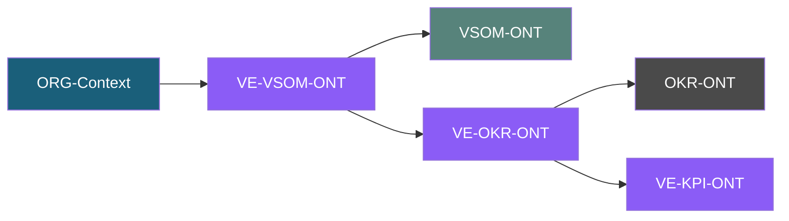
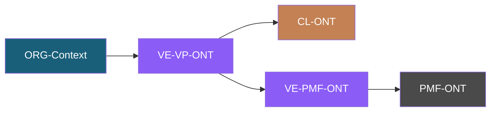

# VE-Series-ONT (Value Engineering Series)

**Status:** Planned
**OAA Schema Version:** 5.0.0

## Overview

The Value Engineering (VE) Series is a collection of **5 interconnected ontologies** that model value engineering across strategic, operational, and market dimensions. All ontologies connect via the OrganizationContext hub from ORG-ONT.

## Series Architecture

```
ORG-Context (hub)
    └── hasValueEngineering
            │
            ├── VE-VSOM ──────────► VSOM-ONT
            │       │
            │       └── VE-OKR ───► OKR-ONT
            │               │
            │               └── VE-KPI
            │
            └── VE-VP ────────────► CL-ONT
                    │
                    └── VE-PMF ───► PMF-ONT
```

## Ontology Sequence

| Order | Ontology | Full Name | Status | Dependencies |
|-------|----------|-----------|--------|--------------|
| 1 | **VE-VSOM-ONT** | Value Engineering for Vision-Strategy-Objectives-Metrics | Planned | ORG-Context, VSOM-ONT |
| 2 | **VE-OKR-ONT** | Value Engineering for Objectives & Key Results | Planned | ORG-Context, OKR-ONT, VE-VSOM |
| 3 | **VE-KPI-ONT** | Value Engineering for Key Performance Indicators | Planned | ORG-Context, VE-OKR |
| 4 | **VE-VP-ONT** | Value Engineering for Value Proposition | Planned | ORG-Context, CL-ONT |
| 5 | **VE-PMF-ONT** | Value Engineering for Product-Market Fit | Planned | ORG-Context, PMF-ONT, VE-VP |

## Directory Structure

```
VE-Series-ONT/
├── README.md                 # This file
├── VE-VSOM-ONT/             # Value Engineering for VSOM
│   └── (planned)
├── VE-OKR-ONT/              # Value Engineering for OKR
│   └── (planned)
├── VE-KPI-ONT/              # Value Engineering for KPIs
│   └── (planned)
├── VE-VP-ONT/               # Value Engineering for Value Proposition
│   └── (planned)
├── VE-PMF-ONT/              # Value Engineering for Product-Market Fit
│   └── (planned)
└── archive/                 # Legacy VE content
    ├── PF-Core_VE_GTM_Diagram-Ontology_v0.1.0.mermaid
    ├── PF-Core_VE_PMF_Diagram-Ontology_v2.0.0.mermaid
    ├── VE-AgentSDK-Scope-v1.0.0.md
    └── readme.md
```

## Dependency Chain

### Strategic Value Track (VE-VSOM → VE-OKR → VE-KPI)



### Market Value Track (VE-VP → VE-PMF)



## Planned Entity Overview

### VE-VSOM-ONT (Order 1)
Value engineering applied to Vision-Strategy-Objectives-Metrics framework.

| Entity | Description |
|--------|-------------|
| VisionValueAssessment | Value analysis of vision statements |
| StrategyValueAlignment | Strategic value alignment scoring |
| ObjectiveValueContribution | Value contribution per objective |
| MetricValueImpact | Value impact of metrics |

### VE-OKR-ONT (Order 2)
Value engineering for Objectives and Key Results.

| Entity | Description |
|--------|-------------|
| OKRValueScore | Composite value score for OKRs |
| KeyResultValueDriver | Value drivers per key result |
| OKRValueCascade | Value cascade through OKR hierarchy |

### VE-KPI-ONT (Order 3)
Value engineering for Key Performance Indicators.

| Entity | Description |
|--------|-------------|
| KPIValueWeight | Value weighting for KPIs |
| KPIValueThreshold | Value-based threshold definitions |
| KPIValueTrend | Value trend analysis |

### VE-VP-ONT (Order 4)
Value engineering for Value Proposition design.

| Entity | Description |
|--------|-------------|
| ValuePropositionCanvas | Value proposition mapping |
| CustomerValueGain | Customer value gain analysis |
| ValueDifferentiator | Competitive value differentiators |
| ValueDeliveryMechanism | How value is delivered |

### VE-PMF-ONT (Order 5)
Value engineering for Product-Market Fit.

| Entity | Description |
|--------|-------------|
| PMFValueScore | Product-market fit value score |
| MarketValueOpportunity | Market value opportunity sizing |
| FitValueIndicator | Value indicators for fit assessment |
| ValueScaleReadiness | Readiness for value scaling |

## Cross-Ontology Relationships

| Relationship | Domain | Range | Description |
|--------------|--------|-------|-------------|
| hasValueEngineering | org:OrganizationContext | VE-* | Bridge from ORG-ONT |
| engineersValue | VE-VSOM | vsom:VSOMFramework | Strategic value engineering |
| engineersOKRValue | VE-OKR | okr:OKRFramework | OKR value engineering |
| engineersVP | VE-VP | cl:CompetitiveLandscape | Value proposition engineering |
| engineersPMF | VE-PMF | pmf:ProductMarketFit | PMF value engineering |
| cascadesValue | VE-VSOM | VE-OKR | Value cascade |
| refinesValue | VE-OKR | VE-KPI | Value refinement |
| validatesValue | VE-VP | VE-PMF | Value validation |

## Implementation Order

1. **Phase 1:** VE-VSOM-ONT (requires VSOM-ONT v2.1.0)
2. **Phase 2:** VE-VP-ONT (requires CL-ONT v1.0.0)
3. **Phase 3:** VE-OKR-ONT (requires OKR-ONT, VE-VSOM)
4. **Phase 4:** VE-PMF-ONT (requires PMF-ONT, VE-VP)
5. **Phase 5:** VE-KPI-ONT (requires VE-OKR)

## Prerequisites

Before implementing VE series:
- [ ] OKR-ONT must be created (currently glossary only)
- [ ] PMF-ONT must be created (currently docs only)
- [ ] VSOM-ONT v2.1.0 available (done)
- [ ] CL-ONT v1.0.0 available (done)

## Related Documentation

- [VE-AgentSDK-Scope-v1.0.0.md](archive/VE-AgentSDK-Scope-v1.0.0.md) - Agent SDK scope for VE
- [PF-Core_VE_PMF_Diagram-Ontology_v2.0.0.mermaid](archive/PF-Core_VE_PMF_Diagram-Ontology_v2.0.0.mermaid) - PMF diagram
- [PF-Core_VE_GTM_Diagram-Ontology_v0.1.0.mermaid](archive/PF-Core_VE_GTM_Diagram-Ontology_v0.1.0.mermaid) - GTM diagram

---

*Part of PFC Ontologies | OAA Ontology Workbench v1.1.0*
