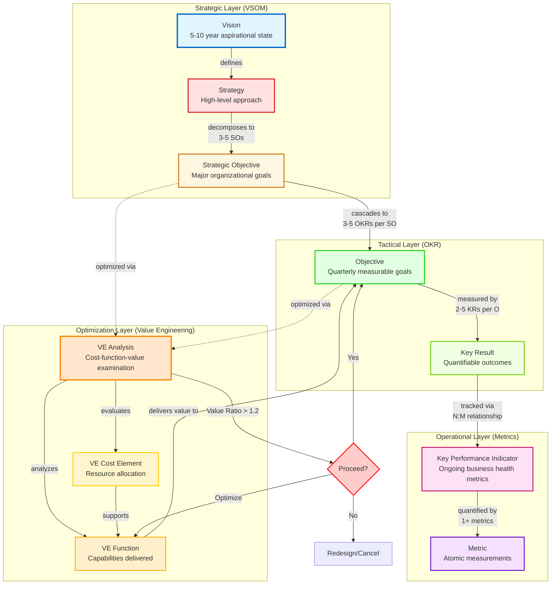
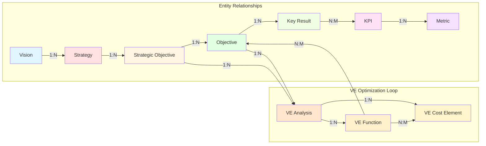

# PF-Core Metrics Ontology: VSOM-OKR-KPI & Value Engineering Integration

## Complete System Architecture Diagram



## Detailed Relationship Map



## BAIV Example: Complete Cascade

```mermaid
graph TB
    subgraph "BAIV Strategic Foundation"
        BV["Vision: AI Marketing Leadership 2030<br/>10x organic reach for mid-market"]
        BS["Strategy: Agentic SEO Platform<br/>Multi-agent AI system"]
        BSO["Strategic Objective: Unified Knowledge<br/>Registry v3.0 migration, 60% cost reduction"]
    end
    
    subgraph "Q1 2026 OKRs"
        BO["Objective: Complete Registry v3.0 Migration<br/>Q1 2026"]
        BKR1["KR1: 100% Ontology Compliance<br/>Baseline: 45% → Target: 100% → Current: 78%"]
        BKR2["KR2: <50ms Query Latency<br/>Baseline: 120ms → Target: 50ms → Current: 65ms"]
        BKR3["KR3: 80% Agent Reuse Rate<br/>Baseline: 35% → Target: 80% → Current: 62%"]
    end
    
    subgraph "Operational Metrics"
        BKPI1["KPI: Ontology Quality Score<br/>Current: 85/100 | Target: 95/100"]
        BKPI2["KPI: Database Query Performance<br/>Current: 65ms | Target: 50ms"]
        BKPI3["KPI: Development Velocity<br/>Current: 12 ontologies/month | Target: 15"]
    end
    
    subgraph "Value Engineering Decision"
        BVEA["VE Analysis: Ontology Infrastructure<br/>Cost: £125K | Value: 87.5 | Ratio: 1.75"]
        BVEF1["Function: Enforce Consistency<br/>Value: 95 | Cost: £45K | Priority: Must Have"]
        BVEF2["Function: Enable Querying<br/>Value: 80 | Cost: £35K | Priority: Must Have"]
        BVEF3["Function: Support Versioning<br/>Value: 60 | Cost: £25K | Priority: Should Have"]
        BVEC1["Cost: PostgreSQL JSONB Storage<br/>£12K/year | Operating"]
        BVEC2["Cost: Development Labor<br/>£85K | Labor"]
        BVEC3["Cost: Migration Tooling<br/>£28K | External Services"]
    end
    
    BV --> BS
    BS --> BSO
    BSO --> BO
    BO --> BKR1
    BO --> BKR2
    BO --> BKR3
    BKR1 -.-> BKPI1
    BKR2 -.-> BKPI2
    BKR3 -.-> BKPI3
    
    BSO -.->|optimize| BVEA
    BVEA --> BVEF1
    BVEA --> BVEF2
    BVEA --> BVEF3
    BVEA --> BVEC1
    BVEA --> BVEC2
    BVEA --> BVEC3
    BVEF1 --> BO
    BVEF2 --> BO
    BVEF3 --> BO
    
    BVEC1 -.supports.- BVEF1
    BVEC1 -.supports.- BVEF2
    BVEC2 -.supports.- BVEF1
    BVEC2 -.supports.- BVEF2
    BVEC2 -.supports.- BVEF3
    BVEC3 -.supports.- BVEF3
    
    BVEA -->|Value Ratio: 1.75| Proceed["✅ Recommendation: PROCEED<br/>Strong ROI, phased implementation"]
    
    style BV fill:#e1f5ff,stroke:#0066cc,stroke-width:4px
    style BS fill:#ffe1e1,stroke:#cc0000,stroke-width:3px
    style BSO fill:#fff5e1,stroke:#cc6600,stroke-width:3px
    style BO fill:#e1ffe1,stroke:#00cc00,stroke-width:3px
    style BVEA fill:#ffe6cc,stroke:#ff8800,stroke-width:4px
    style Proceed fill:#ccffcc,stroke:#00aa00,stroke-width:3px
```



## Business Rule Flow

```mermaid
graph TB
    Start([User Creates/Updates Entity])
    
    Start --> CheckVision{Is Vision<br/>Archived?}
    CheckVision -->|Yes| ArchiveStrategies[Auto-archive<br/>Child Strategies]
    CheckVision -->|No| CheckPriority
    
    CheckPriority{Strategic Objective<br/>Priority = P0?}
    CheckPriority -->|Yes| CheckQuarterly{Has Objective<br/>this Quarter?}
    CheckQuarterly -->|No| Alert1[🚨 Alert: Missing<br/>P0 Objective]
    CheckQuarterly -->|Yes| CheckOKR
    CheckPriority -->|No| CheckOKR
    
    CheckOKR{Objective<br/>Status = Active?}
    CheckOKR -->|Yes| CheckKRCount{Has 2+<br/>Key Results?}
    CheckKRCount -->|No| Alert2[🚨 Alert: Insufficient<br/>Key Results]
    CheckKRCount -->|Yes| CheckKRValues
    
    CheckKRValues{All KRs have<br/>currentValue?}
    CheckKRValues -->|No| Alert3[🚨 Alert: Missing<br/>KR Values]
    CheckKRValues -->|Yes| CheckProgress
    
    CheckProgress{KR currentValue<br/>≥ targetValue?}
    CheckProgress -->|Yes| CompleteKR[Set progressPercentage=100<br/>Suggest Complete Objective]
    CheckProgress -->|No| CheckKPI
    
    CheckKPI{KPI updateFrequency<br/>= Daily?}
    CheckKPI -->|Yes| CheckFreshness{Data age<br/>> 36 hours?}
    CheckFreshness -->|Yes| Alert4[🚨 Alert: Stale<br/>KPI Data]
    CheckFreshness -->|No| CheckVE
    CheckKPI -->|No| CheckVE
    
    CheckVE{Objective Cost<br/>> £10K?}
    CheckVE -->|Yes| RecommendVE[💡 Recommend:<br/>Conduct VE Analysis]
    CheckVE -->|No| CheckVEComplete
    
    CheckVEComplete{VE Analysis<br/>Exists?}
    CheckVEComplete -->|Yes| CheckBasicFunction{Has Basic<br/>Function Type?}
    CheckBasicFunction -->|No| Alert5[🚨 Alert: No Basic<br/>Function Defined]
    CheckBasicFunction -->|Yes| CheckCostAllocation
    
    CheckCostAllocation{Cost Elements<br/>Sum = Total Cost?}
    CheckCostAllocation -->|No| Alert6[🚨 Alert: Cost<br/>Allocation Mismatch]
    CheckCostAllocation -->|Yes| CheckValueRatio
    
    CheckValueRatio{Value Ratio<br/>< 0.8?}
    CheckValueRatio -->|Yes| RecommendRedesign[💡 Recommend:<br/>Redesign or Cancel]
    CheckValueRatio -->|No| CheckValueRatioHigh{Value Ratio<br/>> 1.2?}
    CheckValueRatioHigh -->|Yes| RecommendProceed[✅ Recommend:<br/>Proceed]
    CheckValueRatioHigh -->|No| RecommendOptimize[⚠️ Recommend:<br/>Optimize]
    
    RecommendProceed --> End([Save Entity])
    RecommendOptimize --> End
    RecommendRedesign --> End
    RecommendVE --> End
    CompleteKR --> End
    Alert1 --> End
    Alert2 --> End
    Alert3 --> End
    Alert4 --> End
    Alert5 --> End
    Alert6 --> End
    ArchiveStrategies --> End
    
    style Start fill:#e1ffe1
    style End fill:#e1ffe1
    style Alert1 fill:#ffcccc
    style Alert2 fill:#ffcccc
    style Alert3 fill:#ffcccc
    style Alert4 fill:#ffcccc
    style Alert5 fill:#ffcccc
    style Alert6 fill:#ffcccc
    style RecommendVE fill:#ffffcc
    style RecommendProceed fill:#ccffcc
    style RecommendOptimize fill:#ffeecc
    style RecommendRedesign fill:#ffcccc
```



## Key Insights

### 1. Full Traceability
Every operational metric traces back to strategic vision:
```
Metric → KPI → Key Result → Objective → Strategic Objective → Strategy → Vision
```

### 2. Value Engineering Integration
Strategic and tactical decisions optimized through systematic cost-function-value analysis:
- **Value Ratio > 1.2:** Proceed (strong ROI)
- **Value Ratio 0.8-1.2:** Optimize (marginal ROI)
- **Value Ratio < 0.8:** Redesign or Cancel (poor ROI)

### 3. Automated Governance
12 business rules enforce data quality and strategic alignment:
- P0 objectives require quarterly OKRs
- Active objectives need 2+ key results
- VE analyses require Basic function classification
- Cost allocation must balance

### 4. Multi-Instance Reusability
PF-Core ontology instantiates across platforms:
- **PFI-BAIV:** SEO visibility, ontology quality, AI search ranking KPIs
- **PFI-AIR:** AI maturity, transformation ROI, change adoption KPIs
- **PFI-W4M:** Time-to-market, MVP velocity, idea validation KPIs

### 5. Agent-Ready Structure
Semantic ontology enables AI agents to:
- Query strategic context for decision-making
- Calculate value ratios automatically
- Recommend VE analysis when cost thresholds exceeded
- Track progress and alert on at-risk objectives
- Suggest optimization opportunities

## Implementation Roadmap

### Phase 1: PF-Core Deployment (Week 1)
1. Register ontology in OAA Registry v3.0
2. Create PostgreSQL schema (10 tables + JSONB columns)
3. Implement business rule validators
4. Deploy baseline VSOM entities (Vision, Strategy templates)

### Phase 2: BAIV Instantiation (Weeks 2-3)
1. Create BAIV Vision: "AI Marketing Leadership 2030"
2. Define Strategy: "Agentic SEO Platform"
3. Establish 3-5 Strategic Objectives
4. Set Q1 2026 OKRs with Key Results
5. Define 15-20 BAIV-specific KPIs

### Phase 3: VE Integration (Week 4)
1. Conduct VE Analysis on ontology infrastructure
2. Configure VE triggers (>£10K decisions)
3. Build VE dashboard in Supabase
4. Train team on VE methodology

### Phase 4: Agent Orchestration (Weeks 5-6)
1. Integrate with AgentManager workflows
2. Enable Discovery agents to query VSOM context
3. Configure Analysis agents to trigger VE
4. Implement automated progress tracking
5. Deploy KPI dashboards

### Phase 5: Scale to AIR & W4M (Weeks 7-8)
1. Extend ontology for domain-specific KPIs
2. Instantiate Vision/Strategy for each platform
3. Deploy shared infrastructure
4. Validate cross-platform metric aggregation
