# PF-CORE VE ProdDev: PMF & GTM Visual Guide
## Comprehensive Mermaid Diagram Reference

**Version:** 1.0.0  
**Date:** October 18, 2025  
**Purpose:** Visual process flows for Product-Market Fit and Go-to-Market strategies

---

## Table of Contents

1. [PMF Iteration Process](#pmf-iteration-process)
2. [GTM Strategy Development](#gtm-strategy-development)
3. [PMF Metrics Dashboard](#pmf-metrics-dashboard)
4. [GTM Channel Strategy](#gtm-channel-strategy)
5. [Customer Journey Mapping](#customer-journey-mapping)
6. [PMF Assessment Framework](#pmf-assessment-framework)
7. [GTM Launch Sequence](#gtm-launch-sequence)
8. [Integrated PMF-GTM Flow](#integrated-pmf-gtm-flow)

---

## PMF Iteration Process

### Complete PMF Iteration Cycle

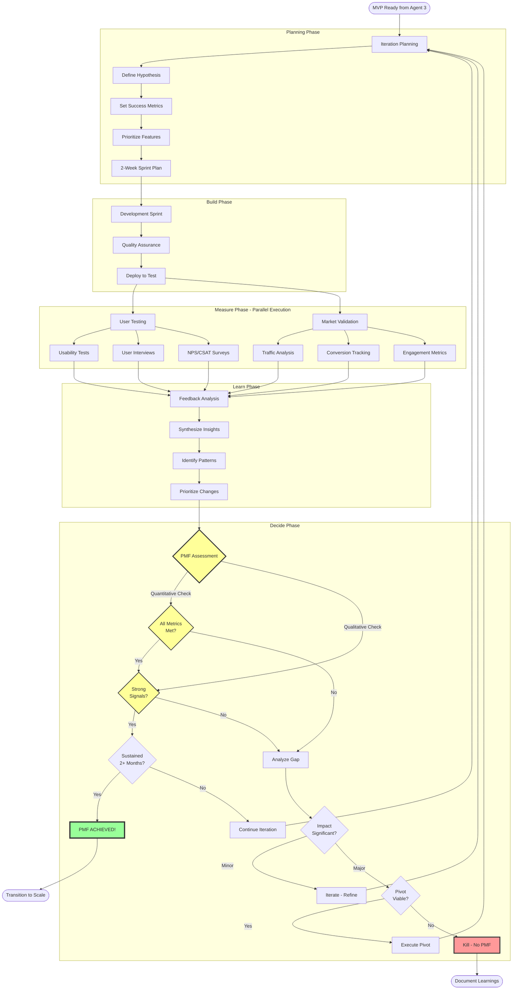

### PMF Iteration Timeline (2-Week Sprint)

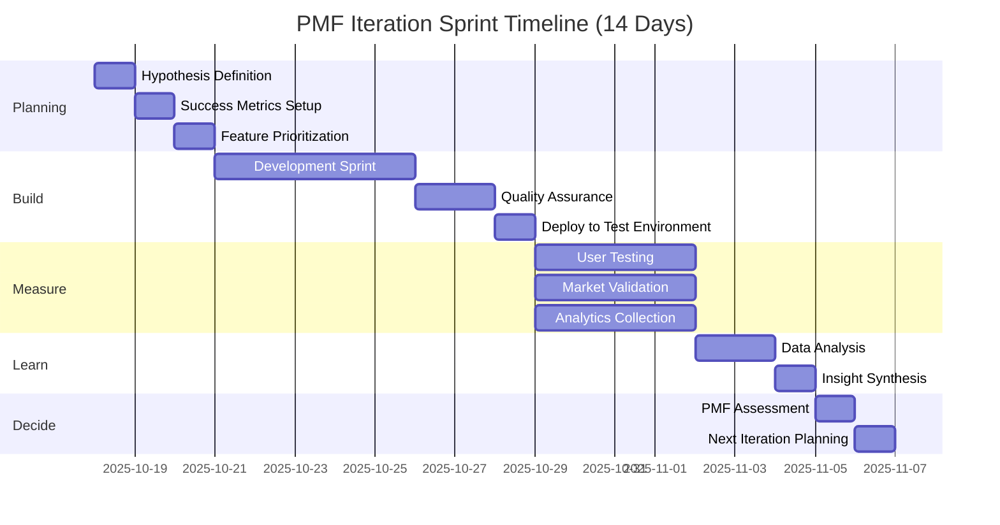

### Build-Measure-Learn Loop Detail

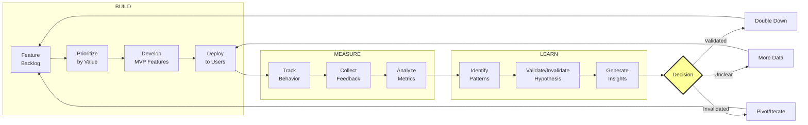

---

## GTM Strategy Development

### Complete GTM Strategy Flow

```mermaid
graph TB
    Start([Validated Concept<br/>from Agent 2]) --> Position[Positioning]
    
    subgraph "Strategic Foundation"
        Position --> Target[Define Target<br/>ICP Segment]
        Target --> Problem[Frame<br/>Problem]
        Problem --> Solution[Articulate<br/>Unique Solution]
        Solution --> Proof[Build Proof<br/>Points]
        
        Proof --> Msg[Messaging<br/>Hierarchy]
        Msg --> Tier1[Core Message<br/>15 words]
        Msg --> Tier2[Key Pillars<br/>3-5 messages]
        Msg --> Tier3[Proof Points<br/>Evidence]
        Msg --> Tier4[Features/Benefits<br/>Details]
    end
    
    subgraph "Brand Development"
        Tier4 --> Brand[Brand Identity]
        Brand --> Personality[Brand<br/>Personality]
        Brand --> Visual[Visual<br/>Identity]
        Brand --> Voice[Tone &<br/>Voice]
    end
    
    subgraph "Commercial Strategy"
        Voice --> Price[Pricing Strategy]
        Price --> Model[Pricing<br/>Model]
        Price --> Tiers[Package<br/>Tiers]
        Price --> Psych[Pricing<br/>Psychology]
        
        Psych --> Channels[Channel Strategy]
        Channels --> Eval[Evaluate<br/>Channels]
        Channels --> Select[Select<br/>2-3 Primary]
        Channels --> Budget[Allocate<br/>Budget]
    end
    
    subgraph "Execution Planning"
        Budget --> Content[Content Strategy]
        Content --> Journey[Map Buyer<br/>Journey]
        Content --> Assets[Plan<br/>Assets]
        Content --> Calendar[Content<br/>Calendar]
        
        Calendar --> Sales[Sales Process]
        Sales --> Motion[Sales<br/>Motion]
        Sales --> Demo[Demo<br/>Script]
        Sales --> Collateral[Sales<br/>Collateral]
        
        Collateral --> CS[Customer Success]
        CS --> Onboard[Onboarding<br/>Program]
        CS --> Health[Health<br/>Scoring]
        CS --> Expand[Expansion<br/>Strategy]
    end
    
    subgraph "Measurement"
        Expand --> Analytics[Analytics Framework]
        Analytics --> NSM[North Star<br/>Metric]
        Analytics --> KPIs[Primary<br/>KPIs]
        Analytics --> Attrib[Attribution<br/>Model]
    end
    
    subgraph "Launch"
        Attrib --> Launch[Launch Plan]
        Launch --> PreLaunch[Pre-Launch<br/>Checklist]
        Launch --> Sequence[Launch<br/>Sequence]
        Launch --> Monitor[Post-Launch<br/>Monitoring]
    end
    
    Monitor --> Ready{Market<br/>Ready?}
    Ready -->|Yes| GO[HANDOFF to Agent 4]
    Ready -->|No| Refine[Refine Strategy]
    Refine --> Position
    
    style GO fill:#9f9,stroke:#333,stroke-width:4px
    style Ready fill:#ff9,stroke:#333,stroke-width:3px
```

### GTM Timeline (6-8 Weeks)

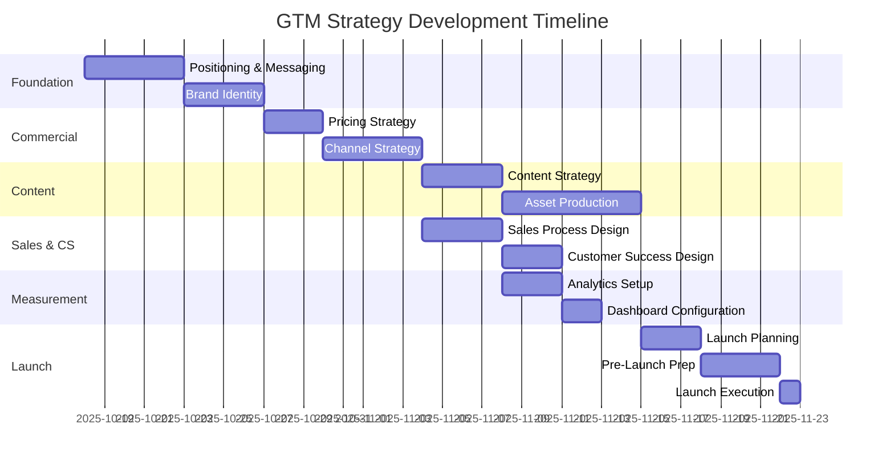

### Positioning Framework (Detail)

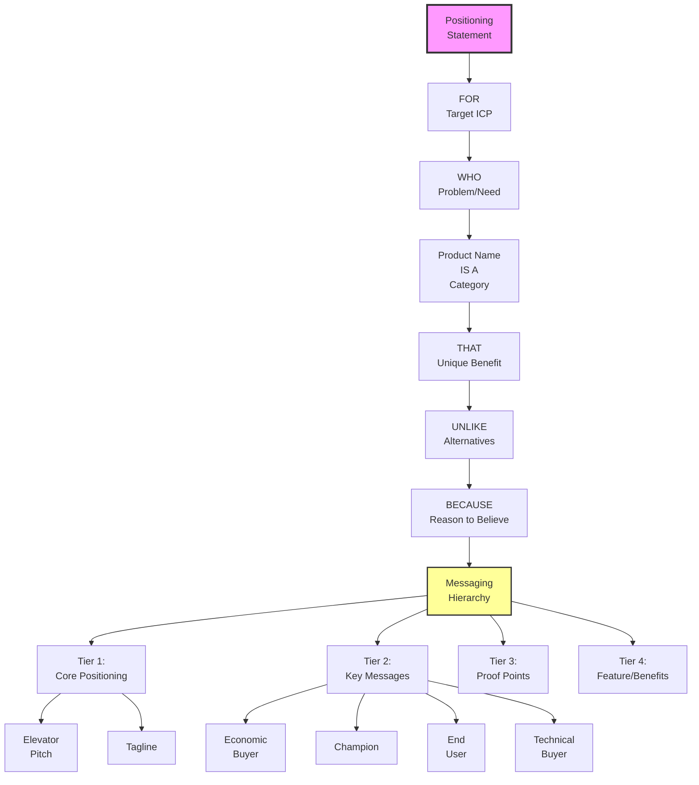

---

## PMF Metrics Dashboard

### PMF Health Scorecard

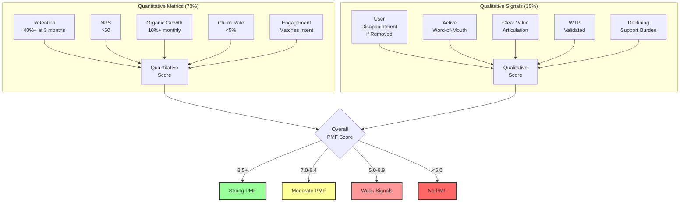

### Retention Cohort Analysis

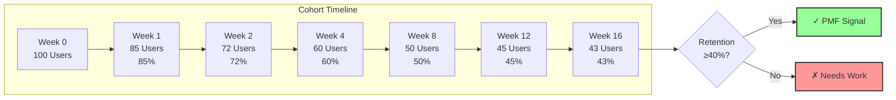

### Engagement Depth Funnel

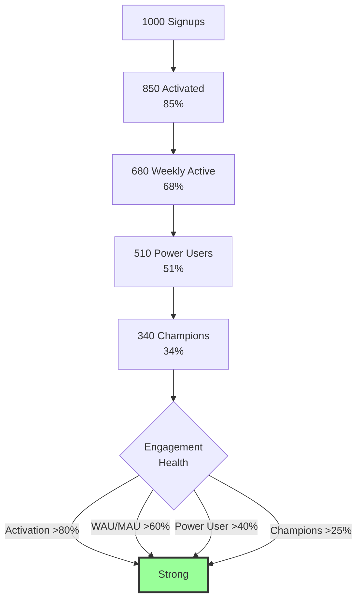

---

## GTM Channel Strategy

### Channel Selection Framework

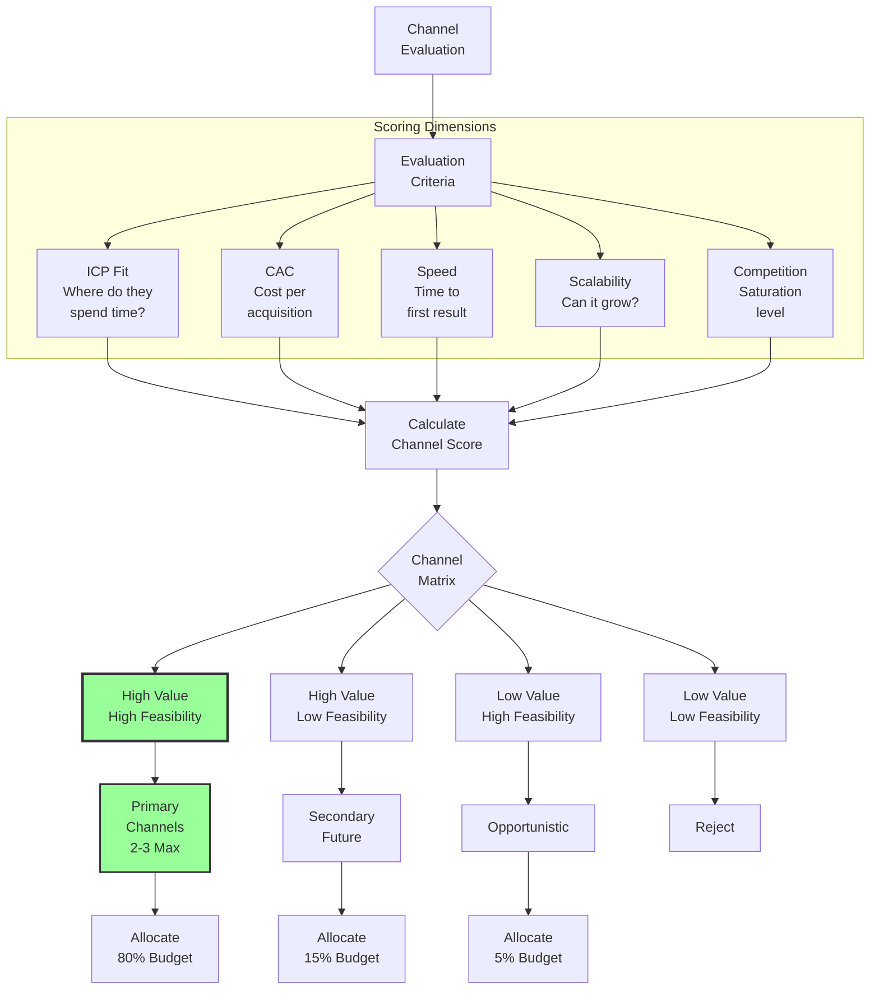

### Channel Mix Strategy

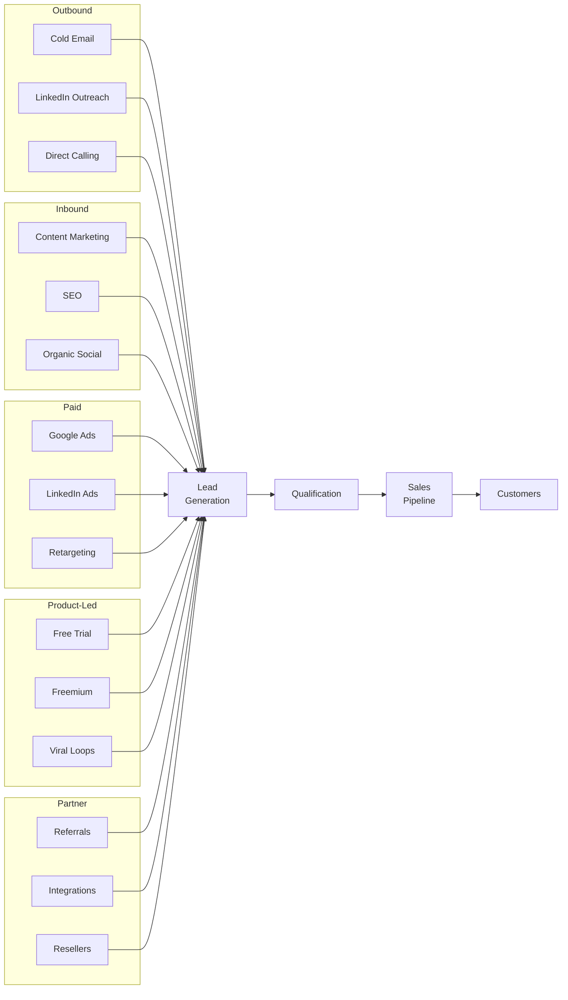

### Channel Experiment Framework

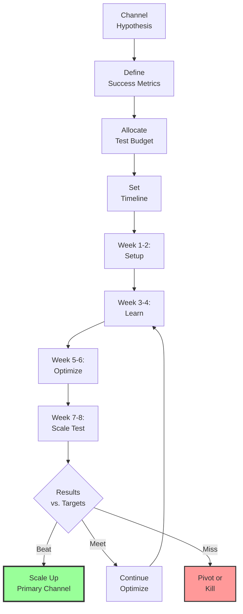

---

## Customer Journey Mapping

### Complete Buyer Journey

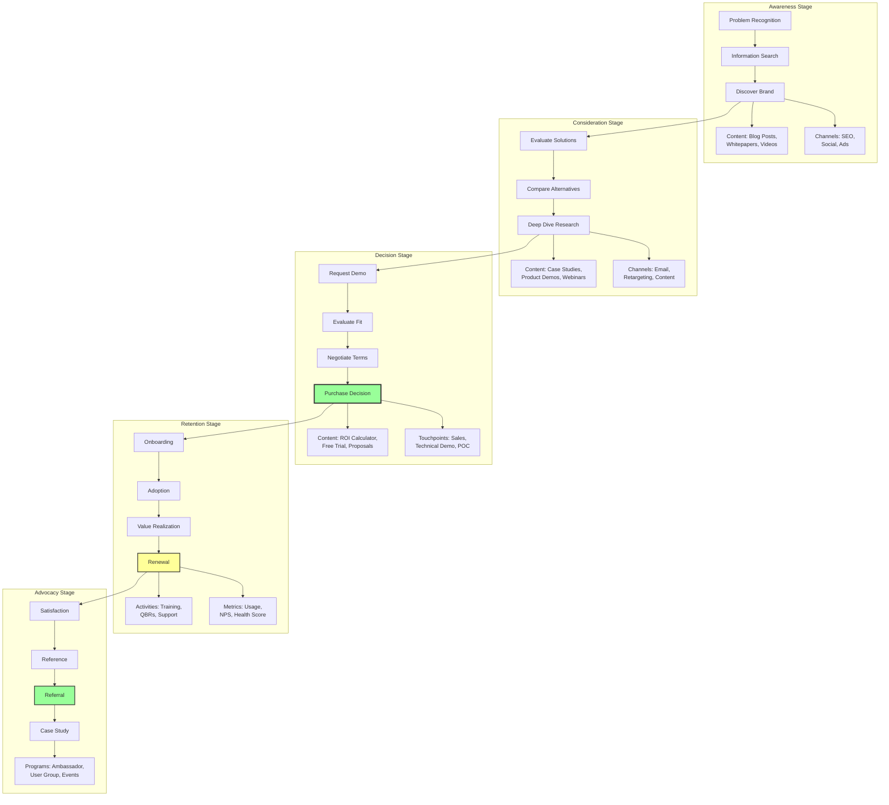

### Content Mapping by Journey Stage

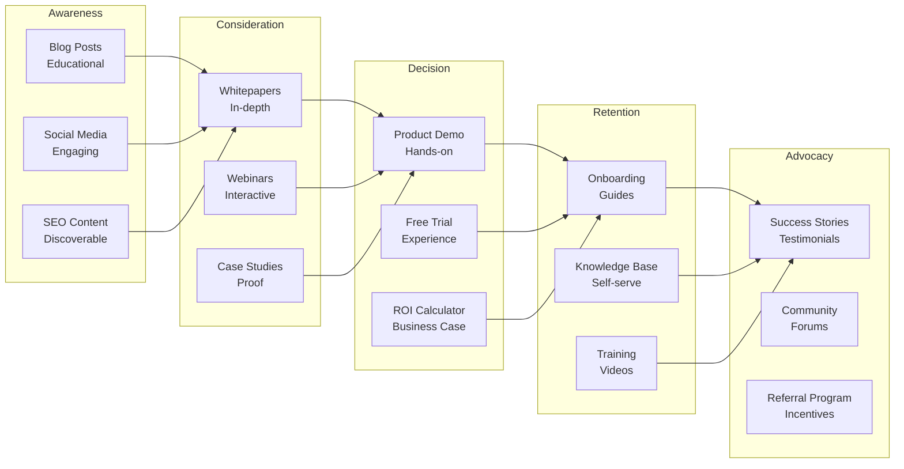

---

## PMF Assessment Framework

### PMF Evaluation Decision Tree

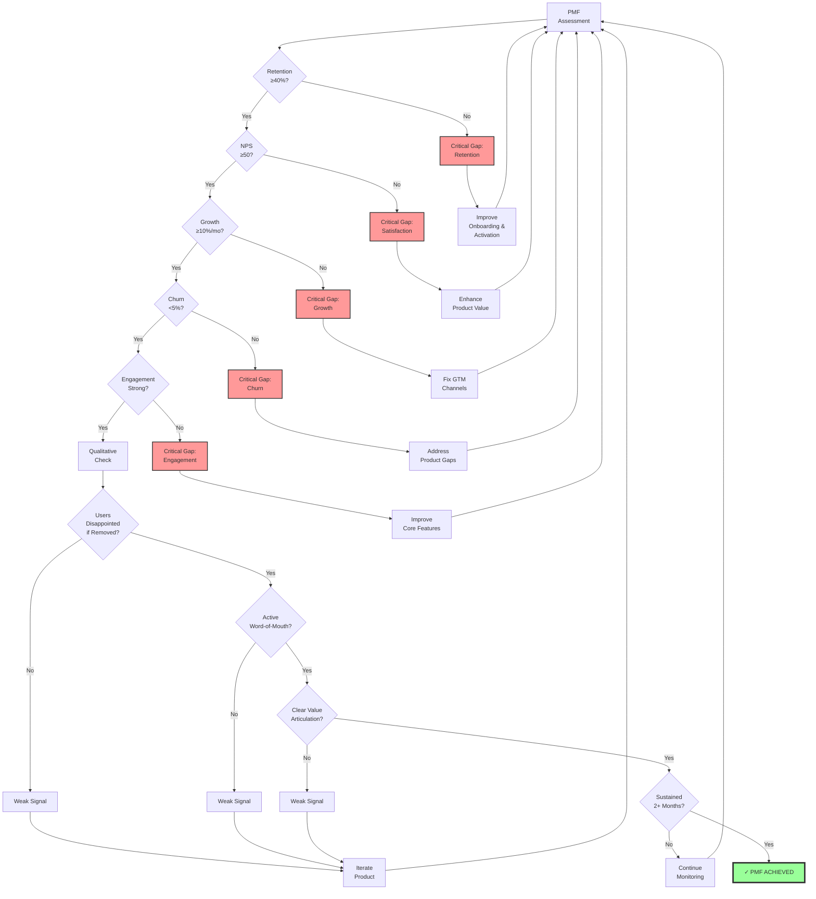

### PMF Progression Stages

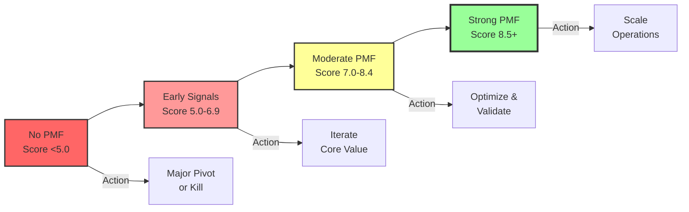

---

## GTM Launch Sequence

### Pre-Launch Checklist Flow

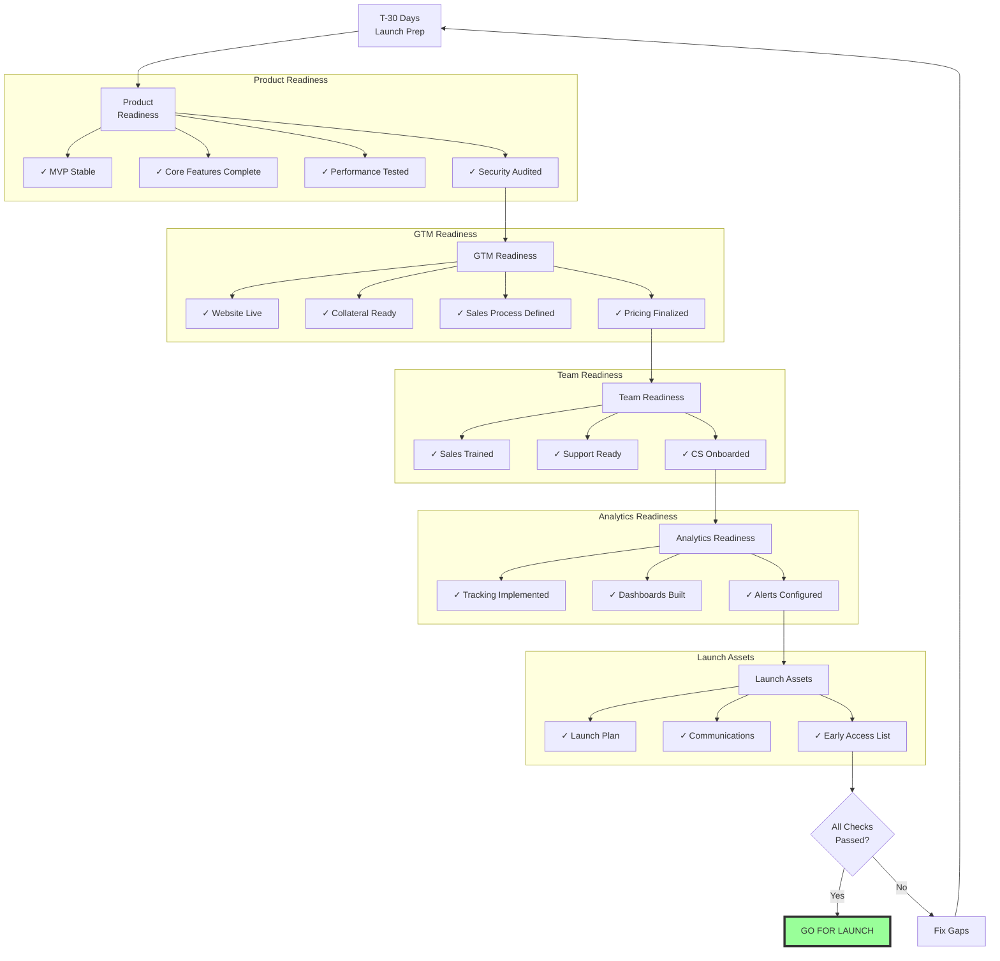

### Launch Week Timeline

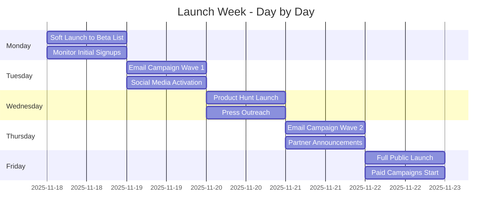

### Launch Monitoring Dashboard

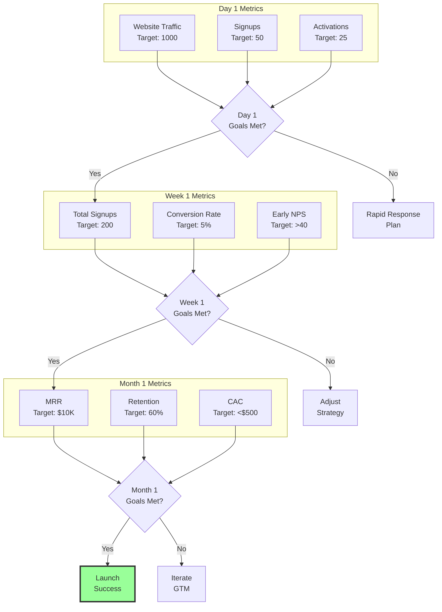

---

## Integrated PMF-GTM Flow

### Complete Product Development to Scale

```mermaid
graph TB
    Start([Validated Concept]) --> GTM[Agent 3:<br/>GTM Strategy]
    
    subgraph "GTM Development (6-8 weeks)"
        GTM --> Pos[Positioning &<br/>Messaging]
        Pos --> Chan[Channel<br/>Strategy]
        Chan --> Price[Pricing &<br/>Packaging]
        Price --> Content[Content &<br/>Sales Assets]
        Content --> Launch[Launch<br/>Plan Ready]
    end
    
    Launch --> MVP[Agent 4:<br/>MVP Launch]
    
    subgraph "PMF Iteration (8-20 weeks)"
        MVP --> Iter1[Iteration 1<br/>Hypothesis Testing]
        Iter1 --> Metrics1[Measure<br/>Metrics]
        Metrics1 --> Learn1[Learn &<br/>Adapt]
        
        Learn1 --> Iter2[Iteration 2<br/>Refinement]
        Iter2 --> Metrics2[Measure<br/>Metrics]
        Metrics2 --> Learn2[Learn &<br/>Adapt]
        
        Learn2 --> Iter3[Iteration 3<br/>Optimization]
        Iter3 --> Metrics3[Measure<br/>Metrics]
        Metrics3 --> Learn3[Learn &<br/>Adapt]
        
        Learn3 --> IterN[Iteration N<br/>Continue...]
    end
    
    IterN --> PMFCheck{PMF<br/>Assessment}
    
    PMFCheck -->|Not Yet| Gap[Analyze<br/>Gap]
    Gap -->|Minor| Iter1
    Gap -->|Major| Pivot{Pivot<br/>Required?}
    
    Pivot -->|Yes| GTM
    Pivot -->|No| Kill[Kill<br/>Project]
    
    PMFCheck -->|Achieved| Validate[Validate<br/>Sustained<br/>2+ Months]
    
    Validate -->|Confirmed| Scale[Scale<br/>Phase]
    Validate -->|Premature| IterN
    
    Scale --> Ops[Operational<br/>Excellence]
    Ops --> Growth[Growth<br/>Acceleration]
    Growth --> Market[Market<br/>Leadership]
    
    style PMFCheck fill:#ff9,stroke:#333,stroke-width:3px
    style Scale fill:#9f9,stroke:#333,stroke-width:4px
    style Kill fill:#f99,stroke:#333,stroke-width:2px
```

### Success Probability by Stage

```mermaid
graph LR
    A[100 Concepts] -->|45% Pass Gate 1| B[45 Validated<br/>Concepts]
    B -->|80% Pass Gate 2| C[36 Technical<br/>Specs]
    C -->|90% Pass Gate 3| D[32 GTM<br/>Ready]
    D -->|40% Achieve PMF| E[13 PMF<br/>Products]
    E -->|80% Scale| F[10 Scaled<br/>Products]
    
    A -->|55%| Fail1[55 Killed<br/>Gate 1]
    B -->|20%| Fail2[9 Killed<br/>Gate 2]
    C -->|10%| Fail3[4 Killed<br/>Gate 3]
    D -->|60%| Fail4[19 Killed<br/>PMF Stage]
    E -->|20%| Fail5[3 Fail<br/>to Scale]
    
    style E fill:#9f9,stroke:#333,stroke-width:3px
    style F fill:#9f9,stroke:#333,stroke-width:4px
```

### Cumulative Investment by Stage

```mermaid
graph TD
    A[Concept: $0] --> B[Gate 1: $5K<br/>Validation]
    B --> C[Gate 2: $15K<br/>Technical Design]
    C --> D[Gate 3: $25K<br/>GTM Strategy]
    D --> E[PMF Iter 1-3: $100K<br/>MVP Development]
    E --> F[PMF Iter 4-8: $250K<br/>Refinement]
    F --> G[PMF Achieved: $350K<br/>Total Investment]
    G --> H[Scale: $1M+<br/>Growth Capital]
    
    B -.Kill Early.-> X1[Loss: $5K]
    C -.Kill Early.-> X2[Loss: $15K]
    D -.Kill Early.-> X3[Loss: $25K]
    F -.Kill Late.-> X4[Loss: $250K]
    
    style G fill:#9f9,stroke:#333,stroke-width:3px
    style X1 fill:#9f9,stroke:#333,stroke-width:1px
    style X2 fill:#ff9,stroke:#333,stroke-width:1px
    style X3 fill:#f99,stroke:#333,stroke-width:1px
    style X4 fill:#f66,stroke:#333,stroke-width:2px
```

---

## Summary: Key PMF & GTM Patterns

### PMF Success Pattern

1. **Hypothesis-Driven**: Clear hypothesis each iteration
2. **Data-Informed**: Quantitative + qualitative feedback
3. **Rapid Iteration**: 2-week cycles
4. **User-Centric**: Continuous user testing
5. **Metric-Focused**: Clear PMF indicators
6. **Sustained Validation**: 2+ months confirmation

### GTM Success Pattern

1. **Positioning First**: Clear differentiation
2. **Channel Discipline**: Focus on 2-3 channels
3. **Staged Launch**: Beta → Soft → Public
4. **Measurement Ready**: Analytics before launch
5. **Content-Rich**: Assets for each journey stage
6. **Feedback Loops**: Rapid iteration on messaging

### Integration Keys

- **GTM enables PMF**: Good positioning accelerates finding fit
- **PMF validates GTM**: Market feedback refines strategy
- **Continuous Loop**: Insights from PMF improve GTM
- **Resource Efficiency**: Kill early, scale winners
- **Knowledge Capture**: Document learnings at each stage

---

**End of Visual Guide**

Use these Mermaid diagrams to:
- Visualize process flows
- Train teams
- Present to stakeholders
- Document workflows
- Guide implementation

All diagrams are editable and can be customized for specific contexts.
