# AI Product Development System Architecture
## Comprehensive Design Document with Agentic Orchestration

**Version:** 1.0.0  
**Date:** October 18, 2025  
**Author:** AI/BI Digital Transformation Consultant  
**Document Type:** System Architecture & Design Specification

---

## Table of Contents

1. [Executive Summary](#executive-summary)
2. [System Overview](#system-overview)
3. [Architecture Patterns](#architecture-patterns)
4. [Agent Specifications](#agent-specifications)
5. [Data Flow Architecture](#data-flow-architecture)
6. [Decision Gate Framework](#decision-gate-framework)
7. [Integration Architecture](#integration-architecture)
8. [Knowledge Management](#knowledge-management)
9. [Deployment Architecture](#deployment-architecture)
10. [Success Metrics & KPIs](#success-metrics--kpis)

---

## Executive Summary

This document specifies a comprehensive agentic system for AI-augmented product development that systematically transforms market opportunities into products achieving product-market fit. The system employs five specialized agents orchestrated by a meta-reasoning agent to maximize success probability while minimizing resource waste.

### System Objectives

1. **Maximize PMF Success Rate**: >30% of concepts reach product-market fit
2. **Minimize Time to PMF**: <180 days from ideation to validated PMF
3. **Optimize Resource Efficiency**: Reduce wasted investment on non-viable concepts
4. **Capture Institutional Knowledge**: Build reusable playbooks and patterns
5. **Enable Data-Driven Decisions**: Evidence-based go/no-go at every gate

### Key Innovation

Unlike traditional product development processes, this system:
- **Validates before building**: Rigorous validation reduces false positives
- **Learns continuously**: Knowledge graph captures and reuses learnings
- **Automates intelligently**: Agents handle routine analysis, humans focus on judgment
- **Scales systematically**: Process scales beyond individual intuition
- **Optimizes holistically**: Orchestrator balances entire portfolio

---

## System Overview

### High-Level System Architecture

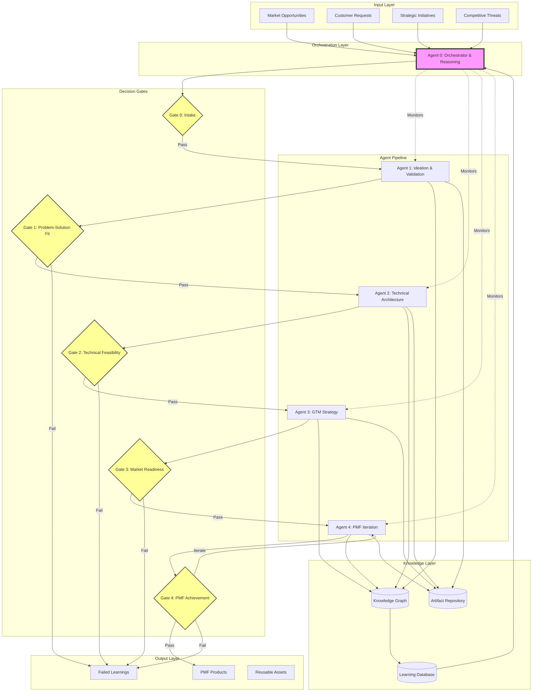

### Agent Interaction Model

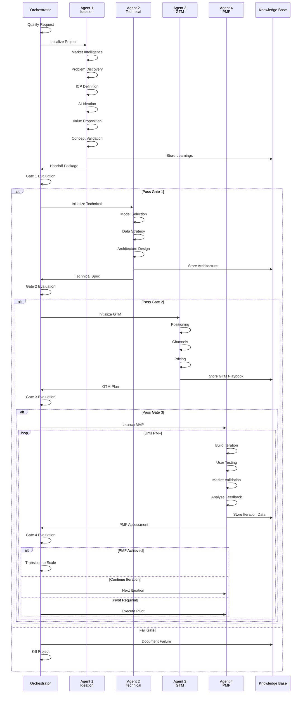

---

## Architecture Patterns

### 1. Agent Autonomy Model

Each agent operates with bounded autonomy:

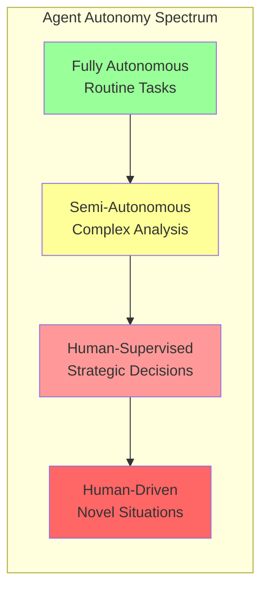

**Agent 1 (Ideation):**
- Autonomous: Market scanning, data collection
- Semi-Autonomous: Concept generation, initial validation
- Supervised: Final concept scoring, build recommendations

**Agent 2 (Technical):**
- Autonomous: Technology research, benchmark testing
- Semi-Autonomous: Architecture design, risk assessment
- Supervised: Final technical recommendations

**Agent 3 (GTM):**
- Autonomous: Channel research, competitive analysis
- Semi-Autonomous: Messaging development, pricing models
- Supervised: Final GTM strategy approval

**Agent 4 (PMF):**
- Autonomous: Metrics monitoring, data collection
- Semi-Autonomous: Iteration planning, analysis
- Supervised: Major pivots, PMF declaration

**Agent 0 (Orchestrator):**
- Autonomous: Monitoring, alerting, reporting
- Semi-Autonomous: Resource allocation, priority management
- Supervised: Gate decisions, strategic interventions

### 2. Data Flow Pattern

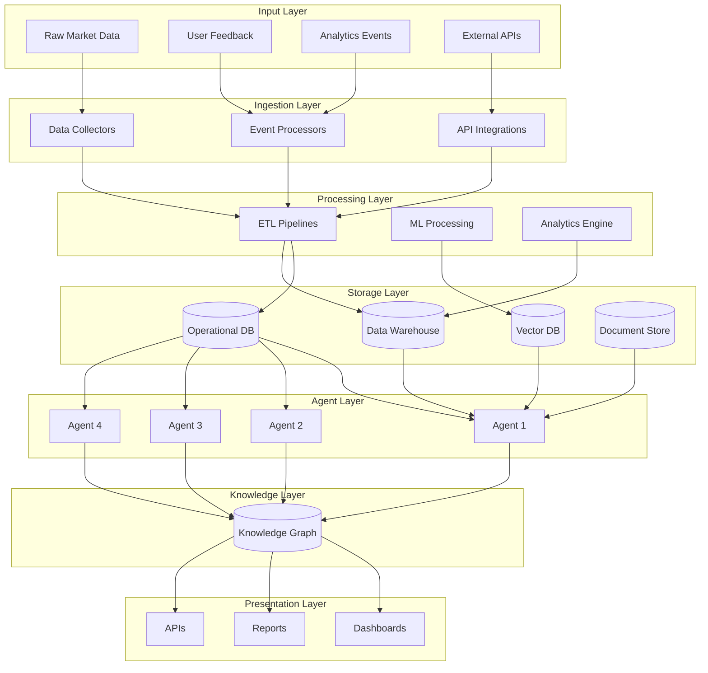

### 3. Event-Driven Architecture

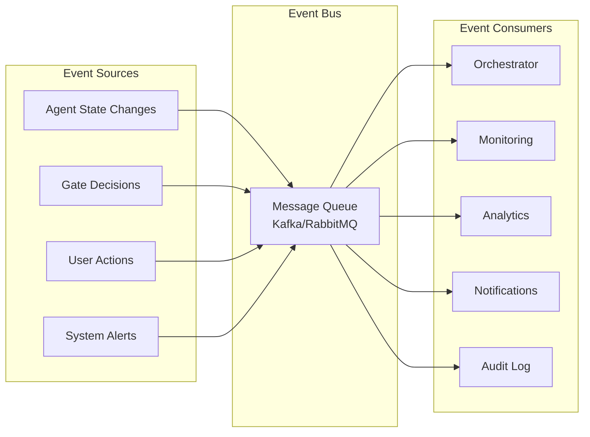

---

## Agent Specifications

### Agent 0: Orchestrator & Reasoning Agent

**Purpose:** Meta-agent coordinating entire product development pipeline

**Core Capabilities:**
- Request intake and qualification
- Agent coordination and handoff management
- Decision gate execution
- Resource allocation optimization
- Portfolio monitoring and health tracking
- Knowledge management
- Executive reporting

**Key Interfaces:**
```json
{
  "intake": "POST /api/v1/projects",
  "status": "GET /api/v1/projects/{id}",
  "gates": "POST /api/v1/gates/{gate}/evaluate",
  "handoffs": "POST /api/v1/handoffs",
  "analytics": "GET /api/v1/analytics"
}
```

**Decision Framework:**
- Scoring models for gate evaluation
- Resource optimization algorithms
- Priority-based scheduling
- Risk-adjusted recommendations

### Agent 1: Ideation & Validation Agent

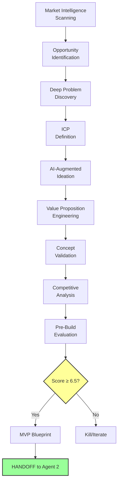

**Key Outputs:**
1. Validated Product Concept
2. ICP Profile with Validation Data
3. Value Proposition Canvas
4. Competitive Analysis
5. Concept Scorecard (≥6.5/10 to proceed)
6. MVP Blueprint

**Success Criteria:**
- 70%+ ICP confirms problem significance
- 60%+ solution appeal score
- 40%+ purchase intent
- Clear differentiation
- Buildable in <6 months

### Agent 2: Technical Architecture Agent

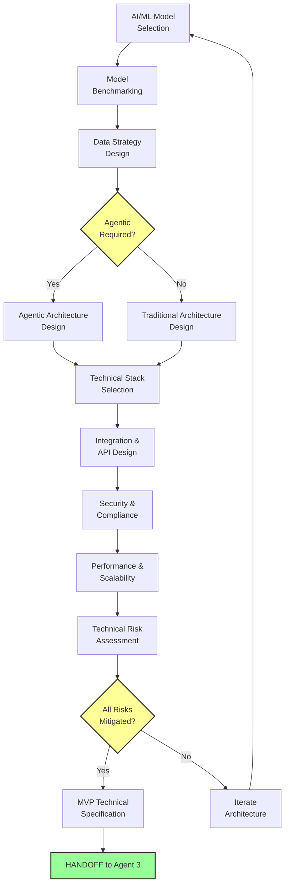

**Key Outputs:**
1. Technical Architecture Document
2. AI/ML Model Specification
3. Data Strategy & Pipeline Design
4. Agentic Architecture (if applicable)
5. API Specifications (OpenAPI)
6. Security & Compliance Architecture
7. Technical Risk Register
8. MVP Technical Specification
9. Development Timeline & Budget

**Success Criteria:**
- Buildable architecture designed
- All major risks mitigated
- Cost within ±20% confidence
- Timeline within ±15% confidence
- Team capable of execution

### Agent 3: GTM Strategy Agent

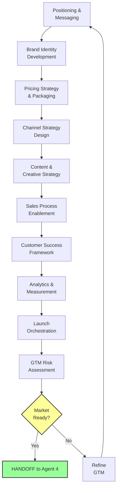

**Key Outputs:**
1. Positioning & Messaging Framework
2. Brand Identity Guidelines
3. Pricing Strategy & Package Definitions
4. Channel Strategy & Playbooks
5. Content Strategy & Asset Inventory
6. Sales Playbook & Enablement Kit
7. Customer Success Framework
8. Analytics & Measurement Framework
9. Launch Plan & Timeline
10. GTM Risk Register

**Success Criteria:**
- Clear, differentiated positioning
- Validated pricing model
- 2-3 primary channels identified
- Sales process defined
- Measurement systems ready
- Launch plan 100% complete

### Agent 4: PMF Iteration Agent

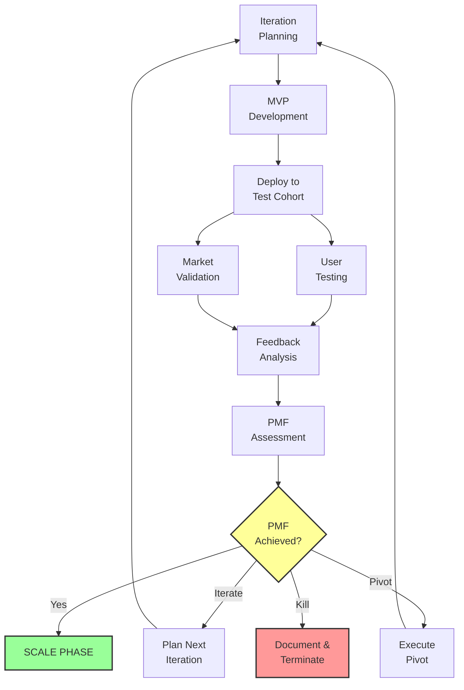

**PMF Indicators (All must be met):**

**Quantitative:**
- 40%+ retention at 3 months
- NPS > 50
- 10%+ organic monthly growth
- <5% churn rate
- Strong engagement metrics

**Qualitative:**
- Users express disappointment if removed
- Active word-of-mouth
- Clear value articulation
- Validated willingness-to-pay
- Declining support burden

**Iteration Cycle:**
- 2-week sprints
- Build → Measure → Learn
- Hypothesis-driven
- Data-informed decisions

---

## Data Flow Architecture

### Artifact Schema (schema.org compliant)

All data artifacts follow schema.org standards with custom extensions:

```json
{
  "@context": "https://schema.org",
  "@type": "CreativeWork",
  "identifier": "UUID",
  "name": "Artifact name",
  "description": "Description",
  "author": {
    "@type": "SoftwareApplication",
    "name": "Agent Name"
  },
  "dateCreated": "ISO 8601",
  "version": "Semantic version",
  "isPartOf": "Project UUID",
  "hasPart": ["Related artifact UUIDs"],
  "about": {
    "Custom schema based on artifact type"
  }
}
```

### Handoff Package Structure

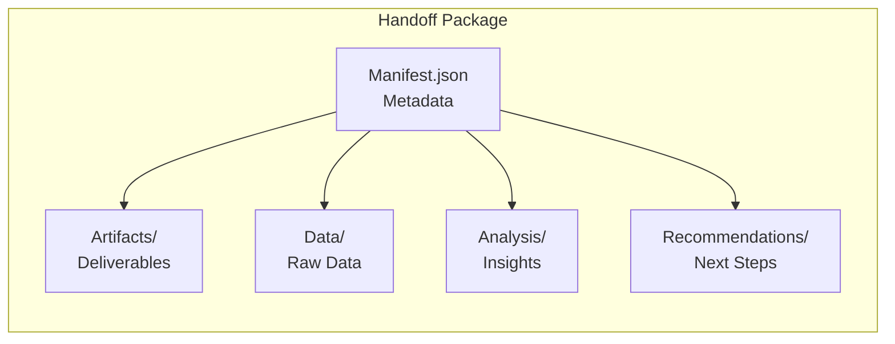

**Manifest Schema:**
```json
{
  "@context": "https://schema.org",
  "@type": "DataFeed",
  "name": "Agent X to Agent Y Handoff",
  "datePublished": "ISO 8601",
  "sourceOrganization": "Agent X",
  "targetOrganization": "Agent Y",
  "dataFeedElement": [
    {
      "@type": "DataDownload",
      "name": "Artifact name",
      "contentUrl": "Path to artifact",
      "encodingFormat": "application/json",
      "contentSize": "bytes"
    }
  ],
  "qualityAssessment": {
    "completeness": "percentage",
    "accuracy": "score",
    "timeliness": "ISO 8601"
  },
  "recommendations": ["Next steps"]
}
```

---

## Decision Gate Framework

### Gate Architecture

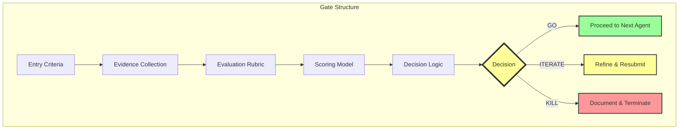

### Gate Decision Matrix

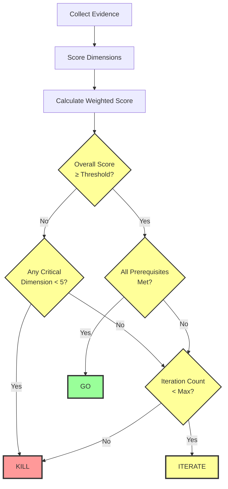

### Comprehensive Gate Flow

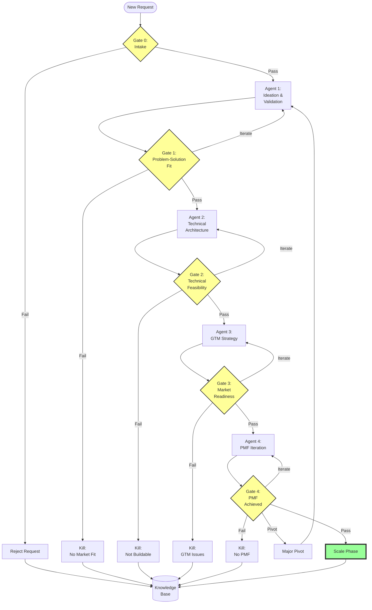

---

## Integration Architecture

### System Integration Map

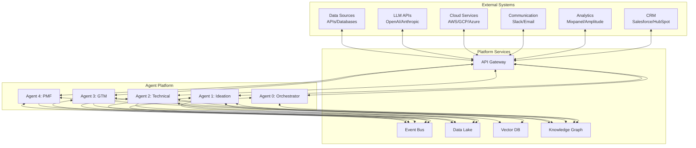

### API Architecture

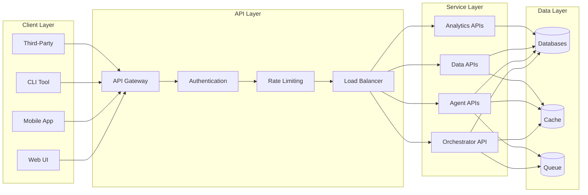

---

## Knowledge Management

### Knowledge Graph Structure

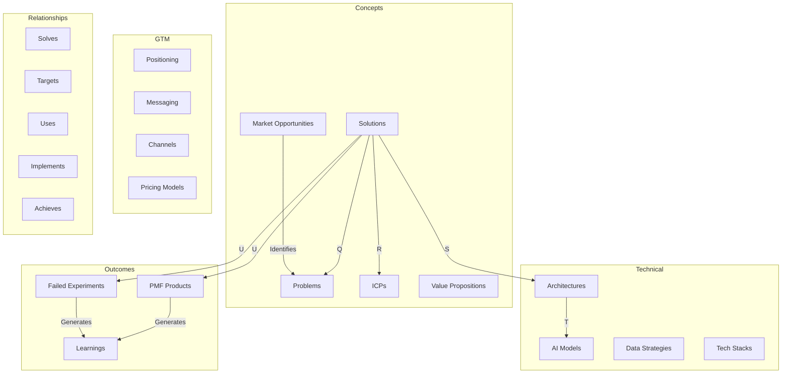

### Learning Capture Process

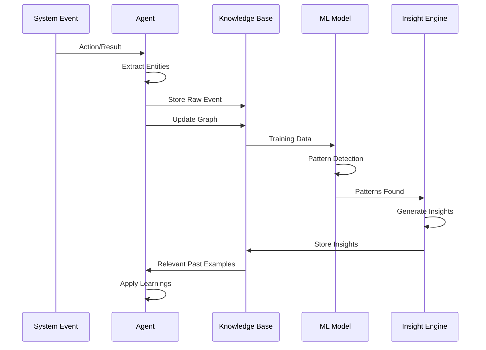

---

## Deployment Architecture

### Cloud Infrastructure

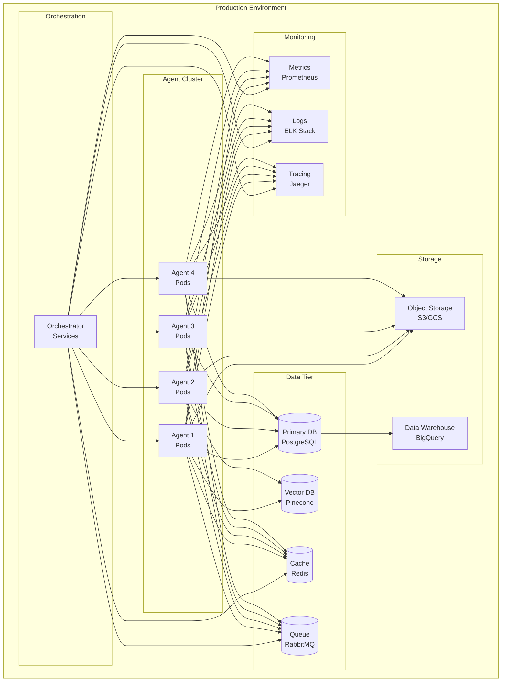

### Deployment Pipeline

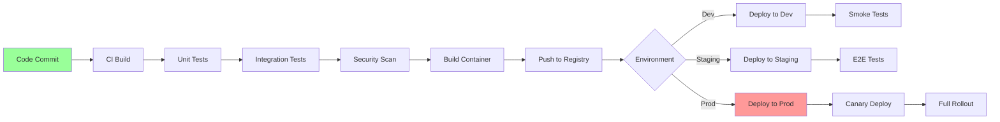

---

## Success Metrics & KPIs

### System Health Dashboard

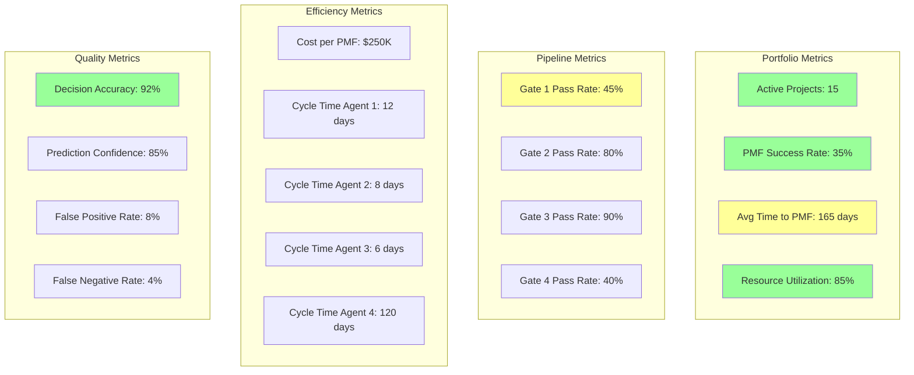

### Funnel Analysis

```mermaid
graph TD
    A[100 Ideas Submitted] -->|45% Pass| B[45 Pass Gate 1]
    B -->|80% Pass| C[36 Pass Gate 2]
    C -->|90% Pass| D[32 Pass Gate 3]
    D -->|40% Pass| E[13 Achieve PMF]
    
    A -->|55% Fail| F[55 Killed at Gate 1]
    B -->|20% Fail| G[9 Killed at Gate 2]
    C -->|10% Fail| H[4 Killed at Gate 3]
    D -->|60% Fail| I[19 Killed at Gate 4]
    
    style E fill:#9f9,stroke:#333,stroke-width:4px
    style F fill:#f99
    style G fill:#f99
    style H fill:#f99
    style I fill:#f99
```

**Key Success Indicators:**

1. **Portfolio Performance:**
   - PMF success rate: Target >30%
   - Time to PMF: Target <180 days
   - Cost per PMF product: Target <$300K

2. **Pipeline Efficiency:**
   - Gate 1 pass rate: 40-50% (rigorous validation)
   - Gate 2 pass rate: 75-85% (technical feasibility)
   - Gate 3 pass rate: 85-95% (market readiness)
   - Gate 4 PMF achievement: 35-45%

3. **Resource Optimization:**
   - Team utilization: 80-90%
   - Budget variance: ±10%
   - Timeline variance: ±15%

4. **Decision Quality:**
   - Decision accuracy: >90%
   - False positive rate: <10%
   - False negative rate: <5%

---

## Implementation Roadmap

### Phase 1: Foundation (Months 1-3)

```mermaid
gantt
    title Phase 1: Foundation
    dateFormat  YYYY-MM-DD
    section Infrastructure
    Cloud Setup           :2025-10-18, 14d
    Database Setup        :14d
    API Gateway          :7d
    section Agent 0
    Orchestrator Core    :2025-10-18, 30d
    Gate Controller      :20d
    Monitoring           :14d
    section Agent 1
    Module Development   :2025-11-01, 45d
    Integration          :15d
    Testing              :10d
```

### Phase 2: Agent Pipeline (Months 4-6)

```mermaid
gantt
    title Phase 2: Agent Pipeline
    dateFormat  YYYY-MM-DD
    section Agent 2
    Technical Design     :2026-01-18, 45d
    Integration          :15d
    section Agent 3
    GTM Development      :2026-02-15, 40d
    Integration          :10d
    section Agent 4
    PMF Framework        :2026-03-15, 30d
    Integration          :10d
```

### Phase 3: Knowledge & Optimization (Months 7-9)

- Knowledge graph implementation
- ML-based insights engine
- Automated learning capture
- Process optimization
- Performance tuning

---

## Conclusion

This agentic system architecture provides a comprehensive, scalable approach to AI product development that:

1. **Maximizes Success**: Rigorous validation at each stage
2. **Minimizes Waste**: Kill bad ideas early
3. **Captures Learning**: Build institutional knowledge
4. **Scales Systematically**: Process beyond individual intuition
5. **Optimizes Resources**: Data-driven allocation

The system is designed to evolve through continuous learning, with each project contributing to improved decision-making and higher success rates over time.

---

## Appendices

### A. Schema Specifications
See individual agent plan documents for detailed schema specifications.

### B. API Documentation
OpenAPI 3.0 specifications available in repository.

### C. Deployment Guides
Infrastructure-as-code templates provided separately.

### D. Runbook
Operational procedures and troubleshooting guides.

---

**Document Version:** 1.0.0  
**Last Updated:** October 18, 2025  
**Status:** Design Complete - Ready for Implementation
