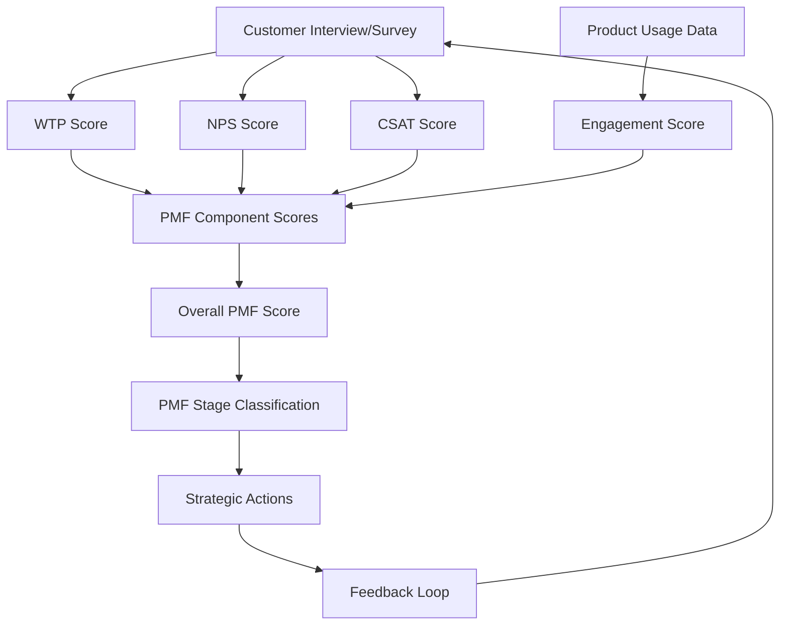

# Team Implementation Guide: PMF-WTP Integrated Assessment System
## Iterative Framework for Product-Market Fit Validation

### Overview
This guide shows how teams can use Willingness to Pay (WTP) as part of a comprehensive Product-Market Fit assessment system, integrated with NPS, CSAT, and customer feedback for continuous PMF optimization.

## PMF Component Integration Framework

### The Four Pillars of PMF Assessment

```
PMF Score (0-100) = Weighted Average of:
├── Willingness to Pay Score (25% weight)    │ Economic validation
├── Customer Satisfaction Score (25% weight) │ Experience validation  
├── Net Promoter Score (25% weight)          │ Loyalty validation
└── Usage/Engagement Score (25% weight)      │ Behavioral validation
```

### Metric Interconnections & Flow



## Weekly Team Workflow

### Monday: Data Collection & Review (30 minutes)

**Team**: Product Manager, Customer Success, Sales Lead

**Activities**:
1. **Review Current Metrics Dashboard**
   ```json
   {
     "weeklyMetrics": {
       "avgWTPScore": 14.2,
       "avgNPS": 42,
       "avgCSAT": 3.8, 
       "avgEngagement": 68,
       "overallPMFScore": 62.5,
       "sampleSize": 47,
       "responseRate": 0.73
     },
     "trendsVsPreviousWeek": {
       "wtpChange": "+1.1",
       "npsChange": "+3.2", 
       "csatChange": "-0.1",
       "engagementChange": "+5.4"
     }
   }
   ```

2. **Customer Feedback Triage**
   - Review latest interviews and surveys
   - Flag high-priority insights
   - Identify customers for follow-up

3. **Action Item Status Check**
   - Review progress on previous week's actions
   - Identify blockers or resource needs

**Output**: Weekly metrics report, priority customer list, action status

### Wednesday: Hypothesis & Experiment Planning (45 minutes)

**Team**: Full PMF team (Product, CS, Sales, Marketing, Engineering)

**Framework for Hypothesis Formation**:

```
If [change/action], 
then [expected metric improvement],
because [underlying assumption],
measurable by [specific KPI] within [timeframe]
```

**Example Hypotheses**:
- **WTP-focused**: "If we add ROI calculator to demos, then WTP scores will increase by 2+ points, because customers better understand value, measurable by interview scores within 2 weeks"
- **Satisfaction-focused**: "If we improve onboarding flow, then CSAT will increase to >4.0, because reduced friction improves first impression, measurable by onboarding surveys"
- **Loyalty-focused**: "If we implement customer success check-ins, then NPS will increase by 10+ points, because proactive support builds advocacy, measurable by quarterly NPS survey"

**Experiment Design Template**:
```json
{
  "experimentId": "EXP-2025-010",
  "hypothesis": "Pricing transparency increases WTP",
  "targetMetric": "WTP Score",
  "currentBaseline": 14.2,
  "targetImprovement": ">15.5",
  "testGroup": "Enterprise prospects",
  "controlGroup": "Standard sales process", 
  "treatmentGroup": "Transparent pricing upfront",
  "duration": "3 weeks",
  "sampleSize": 40,
  "successCriteria": [
    "WTP score improvement >1.3 points",
    "Statistical significance p<0.05",
    "No degradation in other PMF components"
  ]
}
```

**Output**: Prioritized experiment backlog, resource assignments, success criteria

### Friday: Results Analysis & Decision Making (60 minutes)

**Team**: PMF core team + stakeholders

**Analysis Framework**:

1. **Metric Performance Review**
   ```javascript
   // PMF Score Calculation
   const calculatePMFScore = (scores, weights = {wtp: 0.25, nps: 0.25, csat: 0.25, engagement: 0.25}) => {
     const normalizedScores = {
       wtp: (scores.wtp / 20) * 100,        // WTP: 0-20 -> 0-100
       nps: ((scores.nps + 100) / 200) * 100, // NPS: -100 to 100 -> 0-100  
       csat: (scores.csat / 5) * 100,       // CSAT: 0-5 -> 0-100
       engagement: scores.engagement         // Engagement: already 0-100
     };
     
     return Object.entries(weights).reduce((total, [metric, weight]) => {
       return total + (normalizedScores[metric] * weight);
     }, 0);
   };
   
   // Confidence Interval Calculation
   const calculateConfidence = (sampleSize, variance) => {
     const margin = 1.96 * Math.sqrt(variance / sampleSize);
     return {
       marginOfError: margin,
       confidenceLevel: sampleSize > 30 ? 0.95 : 0.90
     };
   };
   ```

2. **Correlation Analysis**
   ```python
   # Example correlation insights
   correlations = {
       "wtp_nps": 0.73,          # Strong positive correlation
       "wtp_csat": 0.41,         # Moderate positive correlation  
       "nps_retention": 0.82,    # Very strong correlation
       "csat_usage": 0.58        # Moderate-strong correlation
   }
   
   # Leading indicator identification
   leading_indicators = {
       "strongest_predictor": "NPS",
       "earliest_signal": "CSAT", 
       "revenue_predictor": "WTP"
   }
   ```

3. **Segment Performance Comparison**
   ```json
   {
     "segments": [
       {
         "name": "Enterprise_Tech",
         "pmfScore": 72.3,
         "sampleSize": 18,
         "confidence": 0.89,
         "trends": {
           "wtp": "+2.1 (improving)",
           "nps": "+5.2 (strong improvement)", 
           "csat": "-0.3 (stable)",
           "engagement": "+8.1 (strong improvement)"
         },
         "actionPriority": "Scale"
       },
       {
         "name": "SMB_Services", 
         "pmfScore": 48.7,
         "sampleSize": 29,
         "confidence": 0.92,
         "trends": {
           "wtp": "-1.2 (declining)",
           "nps": "+1.1 (slow improvement)",
           "csat": "+0.8 (improving)", 
           "engagement": "-2.3 (concerning)"
         },
         "actionPriority": "Investigate"
       }
     ]
   }
   ```

**Decision Tree Framework**:
```
PMF Score Analysis:
├── Score ≥ 80: Scale PMF
│   └── Actions: Increase marketing, expand team, geographic expansion
├── Score 60-79: PMF Achieved  
│   └── Actions: Optimize conversion, reduce churn, feature expansion
├── Score 40-59: Early PMF
│   └── Actions: Improve weak components, targeted experiments
└── Score < 40: Pre-PMF
    └── Actions: Fundamental pivots, deep customer research
```

**Output**: PMF assessment report, strategic decisions, resource allocation

## Monthly Deep Dive Process

### Comprehensive PMF Health Check

**Agenda (2-hour session)**:

#### 1. Trend Analysis (30 minutes)
- 3-month rolling averages
- Statistical significance testing
- Seasonal adjustments
- Cohort progression analysis

#### 2. Customer Journey Mapping (45 minutes)
- WTP evolution through customer lifecycle
- Satisfaction touchpoint analysis  
- NPS driver identification
- Engagement pattern recognition

#### 3. Competitive Benchmarking (15 minutes)
- Market WTP comparisons
- Competitive NPS analysis
- Feature gap assessment

#### 4. Strategic Planning (30 minutes)
- PMF roadmap updates
- Resource reallocation
- Pivot/persevere decisions

### PMF Stage-Based Action Framework

#### Pre-PMF (Score < 40)
**Primary Focus**: Problem-solution fit validation

**WTP Actions**:
- Deep customer interviews (5-10 per week)
- Problem severity validation  
- Value proposition testing
- Pricing model exploration

**Supporting Metrics**:
- CSAT: Focus on core experience
- NPS: Understand advocacy barriers
- Engagement: Measure feature adoption

**Decision Criteria**:
- WTP improvement trend
- Problem-solution alignment
- Customer segment clarity

#### Early PMF (Score 40-59) 
**Primary Focus**: Solution-market fit optimization

**WTP Actions**:
- Pricing optimization tests
- Value communication improvement
- Competitive positioning
- Segment-specific pricing

**Supporting Metrics**:
- CSAT: Optimize user experience
- NPS: Build advocacy programs
- Engagement: Increase stickiness

**Decision Criteria**:
- Consistent WTP growth
- Improved conversion rates
- Reduced sales cycle length

#### PMF (Score 60-79)
**Primary Focus**: Go-to-market optimization

**WTP Actions**:
- Premium tier development
- Upsell/cross-sell testing
- Enterprise pricing strategy
- Partner channel pricing

**Supporting Metrics**:
- CSAT: Scale experience quality
- NPS: Leverage for referrals
- Engagement: Power user features

**Decision Criteria**:
- Sustainable unit economics
- Predictable revenue growth
- Market share expansion

#### Scale PMF (Score 80+)
**Primary Focus**: Market expansion and optimization

**WTP Actions**:
- Geographic pricing adaptation
- New market penetration
- Platform/ecosystem pricing
- Advanced monetization

**Supporting Metrics**:
- CSAT: Maintain at scale
- NPS: Systematic advocacy
- Engagement: Platform adoption

## Real-Time Decision Dashboard

### Key PMF Indicators Display

```json
{
  "realTimePMF": {
    "currentScore": 67.2,
    "trend": "+2.1 (2 weeks)", 
    "confidence": 0.87,
    "stage": "PMF",
    "riskLevel": "Low",
    
    "componentHealth": {
      "wtp": {"score": 16.8, "trend": "+1.2", "status": "healthy"},
      "nps": {"score": 58, "trend": "+4.0", "status": "improving"}, 
      "csat": {"score": 4.1, "trend": "+0.3", "status": "healthy"},
      "engagement": {"score": 72, "trend": "-1.1", "status": "watch"}
    },
    
    "alerts": [
      {
        "type": "opportunity",
        "message": "Enterprise segment WTP increased 18% - consider premium pricing",
        "priority": "high"
      },
      {
        "type": "risk", 
        "message": "SMB engagement dropping for 3rd consecutive week",
        "priority": "medium"
      }
    ],
    
    "recommendedActions": [
      "Schedule 5 enterprise WTP interviews this week",
      "Launch SMB engagement improvement experiment", 
      "Test premium pricing with top 10 enterprise prospects"
    ]
  }
}
```

### Team Accountability Framework

**Role-Based PMF Responsibilities**:

- **Product Manager**: Overall PMF strategy, metric integration, roadmap prioritization
- **Customer Success**: CSAT and NPS optimization, customer feedback collection  
- **Sales**: WTP validation, pricing feedback, competitive intelligence
- **Marketing**: Segment messaging, value communication, demand generation alignment
- **Engineering**: Feature impact measurement, usage analytics, experiment infrastructure
- **Leadership**: Resource allocation, strategic pivots, growth investment decisions

## Success Metrics for PMF-WTP System

### Team Performance KPIs
- **Response Rate**: >70% for all feedback requests
- **Analysis Timeliness**: Metrics updated within 48 hours
- **Action Completion**: >85% of identified actions completed within sprint
- **Prediction Accuracy**: PMF predictions within 10% of actuals

### Business Impact Metrics
- **Revenue Predictability**: <15% variance from PMF-based forecasts
- **Customer Acquisition Cost**: Decreasing as PMF improves
- **Lifetime Value Growth**: Increasing with better PMF scores
- **Churn Reduction**: <5% monthly churn at PMF stage

This integrated system enables teams to systematically improve product-market fit through continuous measurement, analysis, and optimization of customer willingness to pay alongside satisfaction and loyalty metrics.