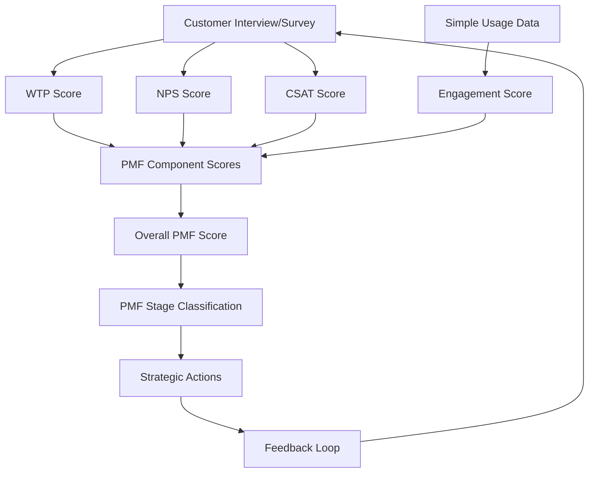

# Team Implementation Guide: PMF-WTP Integrated Assessment (MVP)
## Lean Framework for Product-Market Fit Validation

### Overview
This guide shows how teams can use Willingness to Pay (WTP) as part of a simple Product-Market Fit assessment system, integrated with NPS, CSAT, and customer feedback for continuous PMF optimization.

## PMF Component Integration Framework (MVP)

### The Four Pillars of PMF Assessment (Simplified)

```
PMF Score (0-100) = Simple Average of:
├── Willingness to Pay Score (25% weight)    │ Economic validation
├── Customer Satisfaction Score (25% weight) │ Experience validation  
├── Net Promoter Score (25% weight)          │ Loyalty validation
└── Usage/Engagement Score (25% weight)      │ Behavioral validation
```

### Basic Metric Flow



## Team Workflow (MVP)

### Cycle A: Data Collection & Review

**Team**: Product Manager, Customer Success, Sales Lead

**Activities**:
1. **Review Current Metrics**
   ```json
   {
     "currentMetrics": {
       "avgWTPScore": "[WTP_SCORE]",
       "avgNPS": "[NPS_SCORE]",
       "avgCSAT": "[CSAT_SCORE]", 
       "avgEngagement": "[ENGAGEMENT_SCORE]",
       "overallPMFScore": "[PMF_SCORE]",
       "sampleSize": "[SAMPLE_SIZE]",
       "responseRate": "[RESPONSE_RATE]"
     },
     "trendsVsPreviousCycle": {
       "wtpChange": "[WTP_CHANGE]",
       "npsChange": "[NPS_CHANGE]", 
       "csatChange": "[CSAT_CHANGE]",
       "engagementChange": "[ENGAGEMENT_CHANGE]"
     }
   }
   ```

2. **Customer Feedback Triage**
   - Review latest interviews and surveys
   - Flag high-priority insights
   - Identify customers for follow-up

3. **Action Item Status Check**
   - Review progress on previous cycle's actions
   - Identify blockers or resource needs

**Output**: Current metrics report, priority customer list, action status

### Cycle B: Hypothesis & Experiment Planning

**Team**: Full PMF team (Product, CS, Sales, Marketing, Engineering)

**Framework for Simple Hypothesis Formation**:

```
If [change/action], 
then [expected metric improvement],
because [underlying assumption],
measurable by [specific KPI] within [timeframe]
```

**Example Hypotheses**:
- **WTP-focused**: "If we add ROI calculator to demos, then WTP scores will increase by [IMPROVEMENT_TARGET] points, because customers better understand value, measurable by interview scores within next cycle"
- **Satisfaction-focused**: "If we improve onboarding flow, then CSAT will increase to >[CSAT_TARGET], because reduced friction improves first impression, measurable by onboarding surveys"
- **Loyalty-focused**: "If we implement customer success check-ins, then NPS will increase by [NPS_IMPROVEMENT] points, because proactive support builds advocacy, measurable by next NPS survey"

**Simple Experiment Design Template**:
```json
{
  "experimentId": "[EXPERIMENT_ID]",
  "hypothesis": "[HYPOTHESIS_STATEMENT]",
  "targetMetric": "[TARGET_METRIC]",
  "currentBaseline": "[BASELINE_VALUE]",
  "targetImprovement": "[TARGET_VALUE]",
  "testGroup": "[TEST_SEGMENT]",
  "controlGroup": "[CONTROL_DESCRIPTION]", 
  "treatmentGroup": "[TREATMENT_DESCRIPTION]",
  "duration": "[CYCLE_COUNT] cycles",
  "sampleSize": "[SAMPLE_SIZE]",
  "successCriteria": [
    "[SUCCESS_CRITERION_1]",
    "[SUCCESS_CRITERION_2]"
  ]
}
```

**Output**: Prioritized experiment backlog, resource assignments, success criteria

### Cycle C: Results Analysis & Decision Making

**Team**: PMF core team + stakeholders

**Analysis Framework (MVP)**:

1. **Simple Metric Performance Review**
   ```javascript
   // Basic PMF Score Calculation
   const calculatePMFScore = (scores, weights = {wtp: 0.25, nps: 0.25, csat: 0.25, engagement: 0.25}) => {
     const normalizedScores = {
       wtp: (scores.wtp / [WTP_MAX_SCORE]) * 100,        
       nps: ((scores.nps + 100) / 200) * 100, 
       csat: (scores.csat / [CSAT_MAX_SCORE]) * 100,       
       engagement: scores.engagement         
     };
     
     return Object.entries(weights).reduce((total, [metric, weight]) => {
       return total + (normalizedScores[metric] * weight);
     }, 0);
   };
   ```

2. **Simple Trend Analysis**
   ```json
   {
     "trends": {
       "wtp_correlation_nps": "[CORRELATION_VALUE]",
       "strongest_predictor": "[LEADING_METRIC]",
       "improvement_direction": "[TREND_DIRECTION]"
     }
   }
   ```

3. **Basic Segment Comparison**
   ```json
   {
     "segments": [
       {
         "name": "[SEGMENT_NAME]",
         "pmfScore": "[PMF_SCORE]",
         "sampleSize": "[SAMPLE_SIZE]",
         "actionPriority": "Scale | Optimize | Investigate"
       }
     ]
   }
   ```

**Simple Decision Framework**:
```
PMF Score Analysis:
├── Score ≥ [SCALE_THRESHOLD]: Scale PMF
│   └── Actions: Increase marketing, expand team
├── Score [PMF_RANGE]: PMF Achieved  
│   └── Actions: Optimize conversion, reduce churn
├── Score [EARLY_PMF_RANGE]: Early PMF
│   └── Actions: Improve weak components, targeted experiments
└── Score < [PRE_PMF_THRESHOLD]: Pre-PMF
    └── Actions: Fundamental pivots, deep customer research
```

**Output**: PMF assessment report, strategic decisions, resource allocation

## PMF Stage-Based Action Framework (MVP)

### Pre-PMF (Score < [PRE_PMF_THRESHOLD])
**Primary Focus**: Problem-solution fit validation

**Actions**:
- [WEEKLY_INTERVIEW_COUNT] customer interviews per cycle
- Problem severity validation  
- Value proposition testing
- Basic pricing exploration

### Early PMF (Score [EARLY_PMF_RANGE]) 
**Primary Focus**: Solution-market fit optimization

**Actions**:
- Simple pricing optimization tests
- Value communication improvement
- Basic competitive positioning
- Segment-specific messaging

### PMF (Score [PMF_RANGE])
**Primary Focus**: Go-to-market optimization

**Actions**:
- Premium offering development
- Upsell/cross-sell testing
- Referral program launch
- Partner channel exploration

### Scale PMF (Score [SCALE_THRESHOLD]+)
**Primary Focus**: Market expansion

**Actions**:
- Geographic expansion
- New market penetration
- Platform development
- Advanced monetization

## Simple Decision Dashboard

### Key PMF Indicators (MVP)

```json
{
  "realTimePMF": {
    "currentScore": "[CURRENT_PMF_SCORE]",
    "trend": "[TREND_DIRECTION] ([CYCLE_COUNT] cycles)", 
    "stage": "[PMF_STAGE]",
    "riskLevel": "[RISK_LEVEL]",
    
    "componentHealth": {
      "wtp": {"score": "[WTP_SCORE]", "status": "[STATUS]"},
      "nps": {"score": "[NPS_SCORE]", "status": "[STATUS]"}, 
      "csat": {"score": "[CSAT_SCORE]", "status": "[STATUS]"},
      "engagement": {"score": "[ENGAGEMENT_SCORE]", "status": "[STATUS]"}
    },
    
    "alerts": [
      "[ALERT_MESSAGE_1]",
      "[ALERT_MESSAGE_2]"
    ],
    
    "recommendedActions": [
      "[ACTION_RECOMMENDATION_1]",
      "[ACTION_RECOMMENDATION_2]"
    ]
  }
}
```

### Team Accountability Framework (MVP)

**Role-Based PMF Responsibilities**:

- **Product Manager**: Overall PMF strategy, metric integration, roadmap prioritization
- **Customer Success**: CSAT and NPS optimization, customer feedback collection  
- **Sales**: WTP validation, pricing feedback, competitive intelligence
- **Marketing**: Segment messaging, value communication, demand generation alignment

## Success Metrics for MVP PMF-WTP System

### Team Performance KPIs
- **Response Rate**: >[RESPONSE_RATE_TARGET] for all feedback requests
- **Analysis Timeliness**: Metrics updated within [UPDATE_TIMEFRAME]
- **Action Completion**: >[ACTION_COMPLETION_RATE] of identified actions completed within cycle

### Business Impact Metrics
- **Revenue Predictability**: <[VARIANCE_THRESHOLD] variance from PMF-based forecasts
- **Customer Acquisition Cost**: Decreasing as PMF improves
- **Lifetime Value Growth**: Increasing with better PMF scores
- **Churn Reduction**: <[CHURN_TARGET] churn at PMF stage

This lean system enables teams to systematically improve product-market fit through continuous measurement, analysis, and optimization of customer willingness to pay alongside satisfaction and loyalty metrics without over-engineering or excessive complexity.