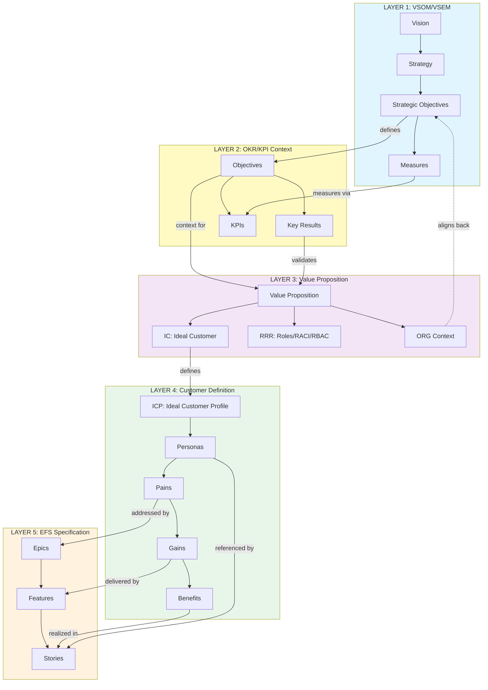
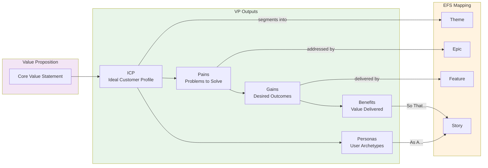
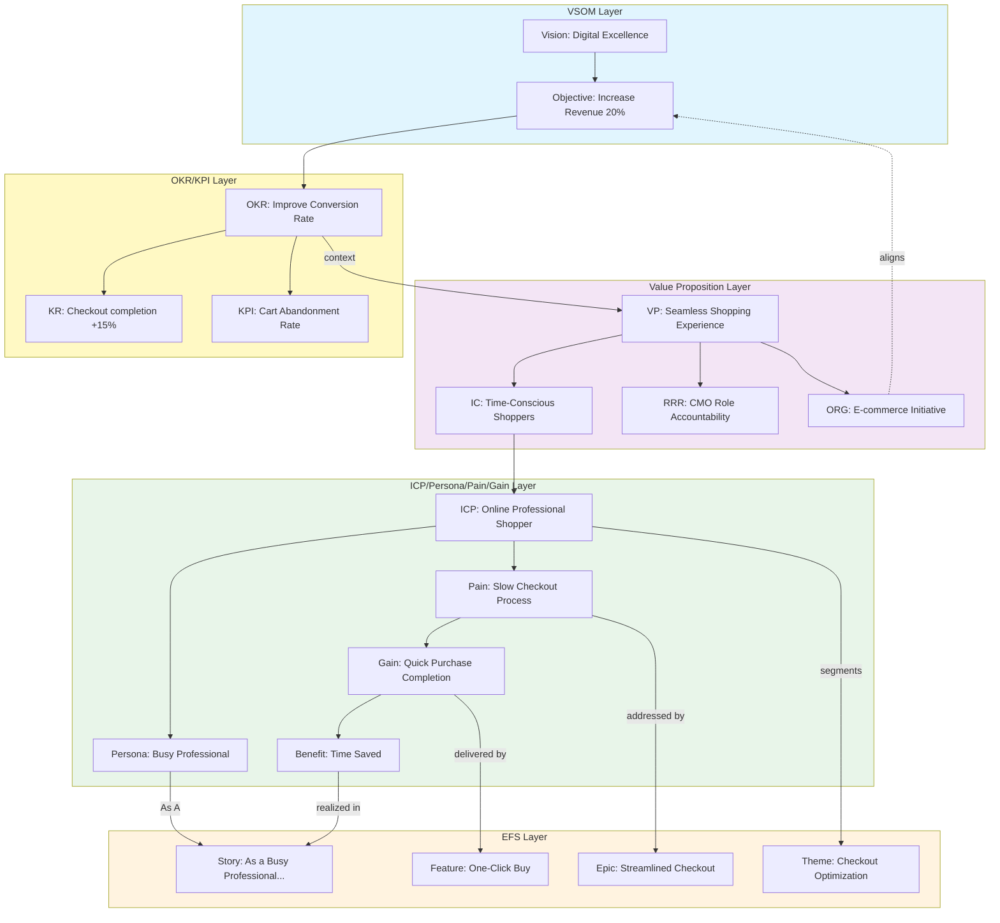

# EFS Lineage Specification

**Version:** 3.0.0
**Date:** 2026-01-28
**Status:** DRAFT
**OAA Compliant:** v5.0.0

---

## 1. Executive Summary

This specification defines the **lineage model** for the EFS (Epic-Features-Stories) Ontology, establishing the complete traceability chain from strategic vision through product delivery. The lineage flows through distinct conceptual layers:

```
VSOM/VSEM → OKR/KPI (Context) → Value Proposition → ICP/Personas/Pains/Gains → EFS
```

---

## 2. Complete Lineage Architecture

### 2.1 Five-Layer Value Chain

```
┌─────────────────────────────────────────────────────────────────────────────────┐
│                         COMPLETE LINEAGE ARCHITECTURE                           │
├─────────────────────────────────────────────────────────────────────────────────┤
│                                                                                 │
│  LAYER 1: STRATEGY                                                              │
│  ┌─────────────────────────────────────────────────────────────────────────┐   │
│  │  VSOM / VSEM                                                             │   │
│  │  Vision → Strategy → Objectives → Measures                               │   │
│  └─────────────────────────────────────────────────────────────────────────┘   │
│                                    │                                            │
│                                    ▼                                            │
│  LAYER 2: CONTEXT & MEASUREMENT                                                 │
│  ┌─────────────────────────────────────────────────────────────────────────┐   │
│  │  OKR / KPI                                                               │   │
│  │  Objectives & Key Results → Key Performance Indicators                   │   │
│  │  (Strategic context for value delivery)                                  │   │
│  └─────────────────────────────────────────────────────────────────────────┘   │
│                                    │                                            │
│                                    ▼                                            │
│  LAYER 3: VALUE DEFINITION                                                      │
│  ┌─────────────────────────────────────────────────────────────────────────┐   │
│  │  VALUE PROPOSITION                                                       │   │
│  │  ┌───────────────┐    ┌───────────────┐                                 │   │
│  │  │   IC / RRR    │◄──►│  ORG Context  │ ──────► (back to VSOM)          │   │
│  │  │ Ideal Customer│    │  Org Alignment│                                 │   │
│  │  │ Roles         │    └───────────────┘                                 │   │
│  │  │ RACI          │                                                      │   │
│  │  │ RBAC          │                                                      │   │
│  │  └───────────────┘                                                      │   │
│  └─────────────────────────────────────────────────────────────────────────┘   │
│                                    │                                            │
│                                    ▼                                            │
│  LAYER 4: CUSTOMER DEFINITION                                                   │
│  ┌─────────────────────────────────────────────────────────────────────────┐   │
│  │  ICP / PERSONAS / PAINS / GAINS / BENEFITS                               │   │
│  │  ┌─────────┐  ┌──────────┐  ┌───────┐  ┌───────┐  ┌──────────┐         │   │
│  │  │   ICP   │─▶│ Personas │─▶│ Pains │─▶│ Gains │─▶│ Benefits │         │   │
│  │  │ (Ideal  │  │          │  │       │  │       │  │          │         │   │
│  │  │Customer │  │          │  │       │  │       │  │          │         │   │
│  │  │Profile) │  │          │  │       │  │       │  │          │         │   │
│  │  └─────────┘  └──────────┘  └───────┘  └───────┘  └──────────┘         │   │
│  └─────────────────────────────────────────────────────────────────────────┘   │
│                                    │                                            │
│                                    ▼                                            │
│  LAYER 5: SPECIFICATION & DELIVERY                                              │
│  ┌─────────────────────────────────────────────────────────────────────────┐   │
│  │  EFS (Epic-Features-Stories)                                             │   │
│  │  ┌───────────┐    ┌────────────┐    ┌─────────────┐                     │   │
│  │  │   Epics   │───▶│  Features  │───▶│   Stories   │                     │   │
│  │  │           │    │            │    │             │                     │   │
│  │  │ (Address  │    │ (Deliver   │    │ (Implement  │                     │   │
│  │  │  Pains)   │    │  Gains)    │    │  Benefits)  │                     │   │
│  │  └───────────┘    └────────────┘    └─────────────┘                     │   │
│  └─────────────────────────────────────────────────────────────────────────┘   │
│                                                                                 │
└─────────────────────────────────────────────────────────────────────────────────┘
```

---

## 3. Layer Definitions

### 3.1 Layer 1: VSOM/VSEM (Strategy)

The strategic foundation layer defining organizational direction.

| Component | Description | Outputs |
|-----------|-------------|---------|
| **Vision** | Long-term aspirational state | Strategic direction |
| **Strategy** | How to achieve the vision | Strategic initiatives |
| **Objectives** | Measurable strategic goals | OKRs |
| **Measures** | How success is quantified | KPIs |

**Ontology:** `vsom:` / `vsem:`

### 3.2 Layer 2: OKR/KPI (Context & Measurement)

The bridge between strategy and value - provides context for value proposition definition.

| Component | Description | Relationship |
|-----------|-------------|--------------|
| **Objectives** | What we want to achieve | Derived from VSOM Objectives |
| **Key Results** | How we measure achievement | Quantifiable outcomes |
| **KPIs** | Performance indicators | Ongoing measurement |

**Function:** Provides the strategic context through which Value Proposition is defined.

**Ontology:** `okr:` / `kpi:`

### 3.3 Layer 3: Value Proposition

The core value definition layer - derived via OKR and Context.

| Component | Description | Relationship to VSOM |
|-----------|-------------|----------------------|
| **IC (Ideal Customer)** | Who receives the value | Aligns to strategic customer segments |
| **RRR (Roles, RACI, RBAC)** | Functional business roles and accountabilities | Maps to C-Suite and organizational roles |
| **ORG Context** | Organizational alignment | Direct relationship back to VSOM |

**Key Insight:** Value Proposition is the pivot point that:
- Receives strategic direction from VSOM via OKR/KPI context
- Enables IC/RRR to define functional roles, responsibilities (RACI), and access control (RBAC)
- Maintains ORG Context alignment back to VSOM
- Defines the customer-facing outputs (ICP, Personas, Pains, Gains, Benefits)

**Ontology:** `vp:` (Value Proposition)

### 3.4 Layer 4: ICP/Personas/Pains/Gains/Benefits

The customer definition layer - outputs defined by Value Proposition.

| Component | Description | Input From | Output To |
|-----------|-------------|------------|-----------|
| **ICP (Ideal Customer Profile)** | Target customer definition | Value Proposition IC | Personas |
| **Personas** | Archetypal user representations | ICP | User Stories (As A...) |
| **Pains** | Problems to solve | ICP + Personas | Epics (problems to address) |
| **Gains** | Desired outcomes | Pains | Features (outcomes to deliver) |
| **Benefits** | Value delivered | Gains | Stories (So That...) |

**Ontology:** `pmf:` (Product-Market Fit)

### 3.5 Layer 5: EFS (Epic-Features-Stories)

The specification and delivery layer.

| Component | Addresses | From Layer 4 |
|-----------|-----------|--------------|
| **Epic** | Major customer pain points | Pains → Epics |
| **Feature** | Gains/outcomes to deliver | Gains → Features |
| **Story** | Specific user benefits | Benefits → Stories (So That...) |

**Key Mappings:**
- `Epic.businessOutcome` ← addresses `Pain`
- `Feature.benefitHypothesis` ← delivers `Gain`
- `UserStory.soThat` ← realizes `Benefit`
- `UserStory.asA` ← references `Persona`

**Ontology:** `efs:`

---

## 4. Lineage Flow Diagram



---

## 5. Cross-Layer Relationships

### 5.1 VSOM → OKR/KPI

| VSOM Entity | OKR/KPI Entity | Relationship | Cardinality |
|-------------|----------------|--------------|-------------|
| Strategic Objective | Objective | `defines` | 1:N |
| Strategic Measure | KPI | `measuresVia` | 1:1 |
| Strategic Initiative | Key Result | `tracksProgress` | 1:N |

### 5.2 OKR/KPI → Value Proposition

| OKR/KPI Entity | VP Entity | Relationship | Cardinality |
|----------------|-----------|--------------|-------------|
| Objective | Value Proposition | `providesContextFor` | N:M |
| Key Result | Value Proposition | `validates` | N:M |
| KPI | RRR (Roles/RACI/RBAC) | `measures` | 1:N |

### 5.3 Value Proposition → ICP/PMF Layer

| VP Entity | PMF Entity | Relationship | Cardinality |
|-----------|------------|--------------|-------------|
| Ideal Customer | ICP | `defines` | 1:1 |
| Value Proposition | Pains | `identifies` | 1:N |
| Value Proposition | Gains | `promises` | 1:N |
| Value Proposition | Benefits | `delivers` | 1:N |

### 5.4 ICP/PMF → EFS

| PMF Entity | EFS Entity | Relationship | Cardinality |
|------------|------------|--------------|-------------|
| Pain | Epic | `addressedBy` | N:M |
| Gain | Feature | `deliveredBy` | N:M |
| Benefit | UserStory.soThat | `realizedIn` | N:M |
| Persona | UserStory.asA | `referencedBy` | 1:N |
| ICP | Theme | `groupsFor` | 1:N |

---

## 6. Value Proposition Breakdown

### 6.1 IC/RRR Component

The Ideal Customer and business metrics component of Value Proposition.

```
┌─────────────────────────────────────────────────────────────┐
│                    IC / RRR COMPONENT                       │
├─────────────────────────────────────────────────────────────┤
│                                                             │
│  ┌─────────────────────────────────────────────────────┐   │
│  │  IC (Ideal Customer)                                 │   │
│  │  - Customer characteristics                          │   │
│  │  - Market segment definition                         │   │
│  │  - Customer needs profile                            │   │
│  └─────────────────────────────────────────────────────┘   │
│                         │                                   │
│                         ▼                                   │
│  ┌─────────────────────────────────────────────────────┐   │
│  │  RRR (Roles, RACI, RBAC)                             │   │
│  │                                                       │   │
│  │  Roles:  Functional business roles (C-Suite, etc.)   │   │
│  │  RACI:   Responsible, Accountable, Consulted,        │   │
│  │          Informed - accountability matrix            │   │
│  │  RBAC:   Role-Based Access Control - permissions     │   │
│  └─────────────────────────────────────────────────────┘   │
│                         │                                   │
│                         ▼                                   │
│              Relates to VSOM Organizational Structure       │
│                                                             │
└─────────────────────────────────────────────────────────────┘
```

### 6.2 ORG Context Component

Organizational alignment ensuring Value Proposition connects back to strategy.

```
┌─────────────────────────────────────────────────────────────┐
│                   ORG CONTEXT COMPONENT                     │
├─────────────────────────────────────────────────────────────┤
│                                                             │
│  ┌─────────────────────────────────────────────────────┐   │
│  │  Organizational Alignment                            │   │
│  │  - Strategic initiative mapping                      │   │
│  │  - Capability requirements                           │   │
│  │  - Resource implications                             │   │
│  │  - Governance requirements                           │   │
│  └─────────────────────────────────────────────────────┘   │
│                         │                                   │
│                         │ relates back to                   │
│                         ▼                                   │
│  ┌─────────────────────────────────────────────────────┐   │
│  │  VSOM Alignment                                      │   │
│  │  - Strategic Objective connection                    │   │
│  │  - Initiative prioritization                         │   │
│  │  - Portfolio fit                                     │   │
│  └─────────────────────────────────────────────────────┘   │
│                                                             │
└─────────────────────────────────────────────────────────────┘
```

---

## 7. Value Proposition Outputs

Value Proposition defines the customer-facing elements that flow into EFS.

### 7.1 Output Flow



### 7.2 Output Definitions

| Output | Definition | EFS Connection |
|--------|------------|----------------|
| **ICP** | Detailed profile of the ideal customer including demographics, behaviors, and needs | Maps to `Theme` for customer segment grouping |
| **Personas** | Named archetypal representations of users within the ICP | Referenced in `UserStory.asA` |
| **Pains** | Specific problems, frustrations, or obstacles the customer faces | Addressed by `Epic.businessOutcome` |
| **Gains** | Desired outcomes, benefits, or improvements the customer wants | Delivered by `Feature.benefitHypothesis` |
| **Benefits** | Tangible value received when gains are achieved | Realized in `UserStory.soThat` |

---

## 8. EFS Lineage Properties

### 8.1 Epic Lineage

```json
{
  "@type": "efs:Epic",
  "@id": "epic:example",
  "name": "Epic Name",

  "efs:lineage": {
    "efs:addressesPain": {
      "@type": "pmf:Pain",
      "@id": "pain:customer-friction",
      "name": "Customer checkout friction"
    },
    "efs:forICP": {
      "@type": "pmf:ICP",
      "@id": "icp:online-shopper"
    },
    "efs:supportsValueProposition": {
      "@type": "vp:ValueProposition",
      "@id": "vp:seamless-experience"
    },
    "efs:alignsToOKR": {
      "@type": "okr:Objective",
      "@id": "okr:improve-conversion"
    },
    "efs:achievesVSOM": {
      "@type": "vsom:StrategicObjective",
      "@id": "vsom:revenue-growth"
    }
  }
}
```

### 8.2 Feature Lineage

```json
{
  "@type": "efs:Feature",
  "@id": "feature:example",
  "name": "Feature Name",

  "efs:lineage": {
    "efs:deliversGain": {
      "@type": "pmf:Gain",
      "@id": "gain:fast-checkout",
      "name": "Complete checkout in under 30 seconds"
    },
    "efs:realizesValueProposition": {
      "@type": "vp:ValueProposition",
      "@id": "vp:seamless-experience"
    },
    "efs:measuredByKPI": {
      "@type": "kpi:KPI",
      "@id": "kpi:checkout-time"
    }
  }
}
```

### 8.3 Story Lineage

```json
{
  "@type": "efs:UserStory",
  "@id": "story:example",
  "asA": {"@id": "persona:busy-professional"},
  "iWant": "one-click checkout",
  "soThat": "I can complete purchases quickly during my workday",

  "efs:lineage": {
    "efs:forPersona": {
      "@type": "pmf:Persona",
      "@id": "persona:busy-professional",
      "derivedFrom": {"@id": "icp:online-shopper"}
    },
    "efs:realizesBenefit": {
      "@type": "pmf:Benefit",
      "@id": "benefit:time-saved",
      "name": "Save time on purchases"
    }
  }
}
```

---

## 9. Lineage Validation Rules

### 9.1 Mandatory Lineage

| Rule ID | Rule | Severity |
|---------|------|----------|
| LR-001 | Every Epic MUST link to at least one Pain | Error |
| LR-002 | Every Feature MUST link to at least one Gain | Error |
| LR-003 | Every Story MUST reference a Persona from the ICP | Error |
| LR-004 | Every Pain MUST trace back to a Value Proposition | Error |
| LR-005 | Every Value Proposition MUST have OKR context | Error |
| LR-006 | Every OKR MUST align to VSOM objectives | Error |

### 9.2 Recommended Lineage

| Rule ID | Rule | Severity |
|---------|------|----------|
| LR-007 | Epics SHOULD have RRR (Role/RACI/RBAC) accountability defined | Warning |
| LR-008 | Features SHOULD link to KPIs | Warning |
| LR-009 | Value Propositions SHOULD have ORG Context | Warning |

---

## 10. Complete Lineage Example



---

## 11. Appendices

### A. Ontology Namespace Mapping

| Prefix | Namespace | Layer |
|--------|-----------|-------|
| `vsom:` | https://platformcore.io/ontology/vsom/ | Strategy |
| `vsem:` | https://platformcore.io/ontology/vsem/ | Strategy |
| `okr:` | https://platformcore.io/ontology/okr/ | Context |
| `kpi:` | https://platformcore.io/ontology/kpi/ | Context |
| `vp:` | https://platformcore.io/ontology/vp/ | Value Proposition |
| `pmf:` | https://platformcore.io/ontology/pmf/ | Customer Definition |
| `efs:` | https://platformcore.io/ontology/efs/ | Specification |

### B. Related Documents

- [EFS Ontology Specification](./EFS-ONTOLOGY-SPEC.md)
- [EFS GitHub Projects Integration](../../pfc-foundation-ont/oaa-templates/EFS-GitHub-Projects-Integration-v1.0.0.md)
- [OAA v5.0.0 Validation Report](./EFS-OAA-v5-Validation-Report.md)

### C. Change Log

| Version | Date | Author | Changes |
|---------|------|--------|---------|
| 1.0.0 | 2026-01-28 | OAA v5.0.0 | Initial lineage specification with 5-layer model |
| 3.0.0 | 2026-01-28 | OAA v5.0.0 | Corrected RRR definition: Roles/RACI/RBAC (not Revenue/Retention/Referral). RRR defines functional business roles and their accountabilities, modelled for C-Suite roles. |

---

*Specification Version: 3.0.0 | OAA v5.0.0 Compliant | Part of EFS Ontology Suite*
