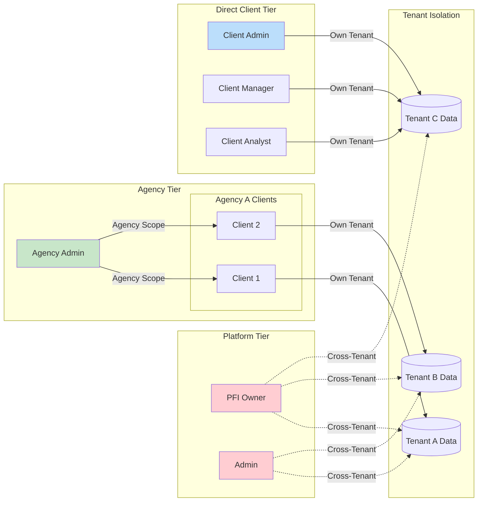

# PFC-PFI RRR-RBAC-EFS Security Architecture

**Document Version:** 1.0.0
**Date:** 2026-02-02
**Product:** BAIV AI Visibility Platform
**Schema Conformance:** `pf:RRR-ONT-v3.1.0` | `pf:EFS-ONT-v1.0`

---

## 1. Architecture Overview

### 1.1 Security Layer Stack


The BAIV security architecture implements defense-in-depth through three distinct layers. The **Application Layer** handles user interaction and API routing. The **Security Middleware** performs authentication via Supabase Auth, validates JWT tokens, and establishes tenant context for every request. The **Database Security** layer enforces Row-Level Security policies, ensuring tenant isolation cannot be bypassed even if application-level bugs exist.

This layered approach ensures that security is enforced at multiple checkpoints, with the database serving as the final authority on data access. Each layer operates independently, so a failure in one layer cannot compromise the security guarantees of others.

---

### 1.2 Multi-Tenant Architecture



The multi-tenant architecture separates access into three distinct tiers. **Platform Tier** roles (PFI Owner, Admin) have cross-tenant visibility for platform operations. **Agency Tier** roles manage a portfolio of client tenants with scoped access to their assigned clients only. **Direct Client Tier** roles operate within a single tenant boundary.

Tenant isolation is enforced at the database level through RLS policies. Every query automatically filters by `tenant_id = current_setting('app.current_tenant_id')::UUID`, ensuring data cannot leak across tenant boundaries regardless of application logic.

---

## 2. Role Hierarchy & RBAC Model

### 2.1 Role Hierarchy Tree


The role hierarchy follows a strict seniority model where Level 1 represents maximum authority and Level 5 represents minimum. Each role can only invite users at their level or below, preventing privilege escalation. The hierarchy branches into three tracks: **Agency** (green), **Client** (blue), and **Limited Access** (orange/gray).

This structure maps directly to the RRR-ONT v3.1.0 schema's `seniorityLevel` property, enabling automated permission resolution and RACI matrix generation.

---

### 2.2 Permission Matrix Flow


Permission resolution follows a three-step evaluation: **Action** (is the operation type allowed?), **Resource** (is this resource type accessible?), and **Scope** (is this specific resource within tenant boundaries?). All three checks must pass for access to be granted.

This model aligns with the `rbac:Permission` entity which defines `action`, `resource`, and `effect` properties, while tenant scope is evaluated dynamically via the security context.

---

## 3. Authentication Flow

### 3.1 Multi-Tenant Authentication


Authentication supports three methods: email/password, Google OAuth, and magic links. Upon successful authentication, the system checks tenant memberships. Users with multiple tenants see a selector; single-tenant users are auto-directed.

The critical step is `set_tenant_context()` which establishes PostgreSQL session variables. All subsequent queries are automatically filtered by RLS policies using these session values, ensuring complete tenant isolation.

---

## 4. Data Security Model

### 4.1 Row-Level Security Flow


Every table follows the dual-policy pattern: `{table}_tenant` policy for user access and `{table}_service` policy for backend operations. The tenant policy automatically filters using `tenant_id = current_setting('app.current_tenant_id', true)::UUID`.

This architecture ensures that even if application code contains bugs or SQL injection vulnerabilities, the database itself enforces tenant boundaries. No application-layer code can bypass RLS policies.

---

### 4.2 Audit Trail Architecture


The audit system captures all INSERT, UPDATE, and DELETE operations on core tables via database triggers. The `audit_log` table is append-only—policies explicitly deny UPDATE and DELETE operations, ensuring forensic integrity.

Each audit record includes actor (user/agent/system), action type, target resource, timestamp, and change details. Tenants can only read their own audit records via RLS, maintaining both visibility and isolation.

---

## 5. Collaboration Features

### 5.1 Presence & Locking System


User presence is tracked via a heartbeat mechanism (30-second interval). Users are marked offline after 2 minutes without heartbeat. This enables "who's online" visibility without requiring persistent connections.

Record locking prevents concurrent edit conflicts. Locks are tied to specific resources (e.g., `gap_analysis:123`), expire after 30 minutes, and display the lock holder's name when acquisition fails.

---

### 5.2 AI Visibility Cycle States


The AI Visibility journey follows a structured 6-stage cycle. Each tenant has exactly one `organization_cycle_state` record tracking current stage and status. Stage advancement requires owner/admin role permissions and is logged to the activity stream with `is_highlight=true`.

Health indicators (stored as JSONB) provide at-a-glance progress metrics for each stage, enabling teams to identify blockers early.

---

## 6. EFS Structure Overview

### 6.1 Epic-Feature-Story Hierarchy


The EFS hierarchy provides complete traceability from high-level business objectives down to specific functional requirements. Each User Story links to acceptance criteria and specific FR/TR requirement IDs from the source documentation.

This structure enables both top-down planning (what business value are we delivering?) and bottom-up verification (are all requirements covered?).

---

### 6.2 PBS Package Alignment


The Product Breakdown Structure (PBS) organizes deliverables into six logical packages. Each package maps to specific EPICs and contains concrete deliverables with defined formats (SQL, TypeScript, React, Config).

This alignment ensures development work can be planned, tracked, and delivered incrementally while maintaining architectural coherence.

---

## 7. PROJECT EPIC: PFI-BAIV-RRR-Security

### Epic Definition

| Attribute | Value |
|-----------|-------|
| **Epic ID** | `PFI-BAIV-SEC-001` |
| **Title** | BAIV AI Visibility Platform Security Implementation |
| **Owner** | Platform Architecture Team |
| **Priority** | P0 - Critical |
| **Status** | Planned |
| **Target Release** | v1.0.0 |

### Business Value Statement

> *"Implement enterprise-grade multi-tenant security for the BAIV AI Visibility platform, enabling secure collaboration across agencies and direct clients while maintaining complete data isolation and audit compliance."*

### Success Criteria

- [ ] Zero cross-tenant data leakage in security testing
- [ ] 100% of tables have RLS policies enabled
- [ ] Authentication supports 3 methods (email, OAuth, magic link)
- [ ] Audit log captures all data modifications
- [ ] Presence and locking prevent edit conflicts
- [ ] All 45 functional requirements implemented

---

## 8. GitHub-Compliant Epic/Feature/Story Breakdown

### 8.1 EPIC-SEC-AUTH: Authentication & Authorization

```yaml
epic:
  id: EPIC-SEC-AUTH
  title: "Authentication & Authorization System"
  labels: [epic, security, p0-critical]
  milestone: "v1.0.0-security"

  description: |
    Implement secure multi-method authentication with multi-tenant
    user support via Supabase Auth. Enable seamless tenant switching
    for users with multiple organization memberships.

  acceptance_criteria:
    - Users can sign up/login via email+password
    - Users can authenticate via Google OAuth
    - Users can use passwordless magic links
    - Multi-tenant users see tenant selector
    - JWT tokens contain user_id and email
    - Architecture supports future SAML SSO

  features:
    - FEAT-AUTH-01
    - FEAT-AUTH-02
    - FEAT-AUTH-03
    - FEAT-AUTH-04
    - FEAT-AUTH-05
```

#### Feature: FEAT-AUTH-01 - Email/Password Authentication

```yaml
feature:
  id: FEAT-AUTH-01
  title: "Email/Password Authentication"
  epic: EPIC-SEC-AUTH
  labels: [feature, auth, p0-critical]

  description: |
    Enable standard email and password authentication via Supabase Auth.

  stories:
    - id: US-A01
      title: "Email/Password Signup"
      type: user-story
      labels: [story, auth]

      body: |
        **As a** new user
        **I want** to sign up with email/password
        **So that** I can access the platform

        ## Acceptance Criteria
        - [ ] Given a new user with valid email
        - [ ] When user submits signup form
        - [ ] Then account is created
        - [ ] And confirmation email is sent

        ## Technical Notes
        - Supabase Auth handles email verification
        - Password requirements: 8+ chars, 1 uppercase, 1 number

        ## Requirements Traced
        - FR-AUTH-01

        ## PBS Deliverables
        - PBS-1.1: Supabase Auth Config
        - PBS-1.3: Auth Middleware
```

#### Feature: FEAT-AUTH-02 - OAuth Integration

```yaml
feature:
  id: FEAT-AUTH-02
  title: "Google OAuth Integration"
  epic: EPIC-SEC-AUTH
  labels: [feature, auth, p1-high]

  stories:
    - id: US-A02
      title: "Google OAuth Login"

      body: |
        **As a** user
        **I want** to sign in with Google
        **So that** I don't need another password

        ## Acceptance Criteria
        - [ ] Given Google OAuth is enabled
        - [ ] When user clicks "Sign in with Google"
        - [ ] Then user is redirected to Google
        - [ ] And upon success, JWT is issued

        ## Requirements Traced
        - FR-AUTH-03

        ## PBS Deliverables
        - PBS-1.2: OAuth Setup
```

#### Feature: FEAT-AUTH-04 - Multi-Tenant Switching

```yaml
feature:
  id: FEAT-AUTH-04
  title: "Multi-Tenant User Switching"
  epic: EPIC-SEC-AUTH
  labels: [feature, auth, multi-tenant, p1-high]

  stories:
    - id: US-A04
      title: "Multi-Organization Switching"

      body: |
        **As a** user with multiple organizations
        **I want** to switch between them easily
        **So that** I can manage multiple tenants

        ## Acceptance Criteria
        - [ ] Given user belongs to Tenant A and Tenant B
        - [ ] When user logs in
        - [ ] Then tenant selector is displayed
        - [ ] And selecting Tenant A sets context to Tenant A

        ## Negative Case
        - [ ] Given user belongs to only Tenant A
        - [ ] When user logs in
        - [ ] Then user is automatically directed to Tenant A dashboard

        ## Requirements Traced
        - FR-AUTH-05, FR-AUTH-06, FR-AUTH-07

        ## PBS Deliverables
        - PBS-1.4: Tenant Assignment
        - PBS-5.2: TenantSelector.tsx
```

---

### 8.2 EPIC-SEC-RLS: Row-Level Security

```yaml
epic:
  id: EPIC-SEC-RLS
  title: "Row-Level Security Implementation"
  labels: [epic, security, database, p0-critical]
  milestone: "v1.0.0-security"

  description: |
    Implement database-level tenant isolation using PostgreSQL
    Row-Level Security. Ensure data cannot leak across tenant
    boundaries even if application bugs exist.

  features:
    - FEAT-RLS-01: Tenant Data Isolation
    - FEAT-RLS-02: Context Propagation
    - FEAT-RLS-03: Audit Log Immutability
```

#### Feature: FEAT-RLS-01 - Tenant Data Isolation

```yaml
feature:
  id: FEAT-RLS-01
  title: "Tenant Data Isolation via RLS"
  epic: EPIC-SEC-RLS
  labels: [feature, security, rls, p0-critical]

  stories:
    - id: US-S01
      title: "Database-Level Tenant Isolation"

      body: |
        **As a** Platform Owner
        **I want** tenant data isolated at DB level
        **So that** app bugs can't leak data

        ## Acceptance Criteria
        - [ ] Given User A is in Tenant A
        - [ ] When User A queries any table with Tenant B's ID
        - [ ] Then zero rows are returned

        ## Technical Implementation
        ```sql
        -- Enable RLS
        ALTER TABLE {table} ENABLE ROW LEVEL SECURITY;

        -- Tenant policy
        CREATE POLICY {table}_tenant ON {table}
          USING (tenant_id = current_setting('app.current_tenant_id', true)::UUID);
        ```

        ## Requirements Traced
        - FR-SEC-01, TR-DB-01, TR-DB-02

        ## PBS Deliverables
        - PBS-2.1: RLS Migration
```

#### Feature: FEAT-RLS-03 - Audit Log Immutability

```yaml
feature:
  id: FEAT-RLS-03
  title: "Immutable Audit Trail"
  epic: EPIC-SEC-RLS
  labels: [feature, security, audit, p0-critical]

  stories:
    - id: US-S02
      title: "Append-Only Audit Logs"

      body: |
        **As a** Tenant Admin
        **I want** audit logs
        **So that** I can track who changed what

        ## Acceptance Criteria
        - [ ] Given an audit_log record exists
        - [ ] When any user attempts UPDATE or DELETE
        - [ ] Then the operation is blocked

        ## Technical Implementation
        ```sql
        -- Deny UPDATE/DELETE on audit_log
        CREATE POLICY audit_log_immutable ON audit_log
          FOR UPDATE USING (false);
        CREATE POLICY audit_log_no_delete ON audit_log
          FOR DELETE USING (false);
        ```

        ## Requirements Traced
        - FR-SEC-04, FR-SEC-05, FR-SEC-06

        ## PBS Deliverables
        - PBS-2.3: Audit Infrastructure
```

---

### 8.3 EPIC-SEC-COLLAB: Collaboration & Presence

```yaml
epic:
  id: EPIC-SEC-COLLAB
  title: "Real-Time Collaboration Features"
  labels: [epic, collaboration, p1-high]
  milestone: "v1.0.0-security"

  features:
    - FEAT-COLLAB-01: User Presence
    - FEAT-COLLAB-02: Record Locking
    - FEAT-COLLAB-03: Activity Stream
```

#### Feature: FEAT-COLLAB-02 - Record Locking

```yaml
feature:
  id: FEAT-COLLAB-02
  title: "Pessimistic Record Locking"
  epic: EPIC-SEC-COLLAB
  labels: [feature, collaboration, locking, p1-high]

  stories:
    - id: US-L02
      title: "Lock Resources During Edit"

      body: |
        **As an** Analyst
        **I want** to lock a gap analysis while editing
        **So that** others don't overwrite my work

        ## Acceptance Criteria

        ### Scenario: Lock Acquisition
        - [ ] Given no lock exists on gap_analysis:123
        - [ ] When User A requests lock
        - [ ] Then lock is granted to User A

        ### Scenario: Lock Conflict
        - [ ] Given User A holds lock on gap_analysis:123
        - [ ] When User B requests same lock
        - [ ] Then User B receives "Locked by User A"

        ### Scenario: Lock Expiry
        - [ ] Given lock held for 30+ minutes
        - [ ] When another user requests lock
        - [ ] Then expired lock is released
        - [ ] And new lock is granted

        ## Requirements Traced
        - FR-LOCK-01 through FR-LOCK-06

        ## PBS Deliverables
        - PBS-3.3: dataset_edit_locks table
        - PBS-4.3: /api/locks/* endpoints
```

---

### 8.4 EPIC-SEC-CYCLE: Cycle State Management

```yaml
epic:
  id: EPIC-SEC-CYCLE
  title: "AI Visibility Cycle State Management"
  labels: [epic, cycle, workflow, p1-high]
  milestone: "v1.0.0-security"

  features:
    - FEAT-CYCLE-01: Stage Tracking
    - FEAT-CYCLE-02: Stage Advancement
    - FEAT-CYCLE-03: Health Indicators
```

#### Feature: FEAT-CYCLE-02 - Stage Advancement

```yaml
feature:
  id: FEAT-CYCLE-02
  title: "Role-Controlled Stage Advancement"
  epic: EPIC-SEC-CYCLE
  labels: [feature, cycle, rbac, p1-high]

  stories:
    - id: US-C02
      title: "Advance Cycle Stages"

      body: |
        **As a** Tenant Admin
        **I want** to advance stages
        **So that** we progress through the AI Visibility journey

        ## Acceptance Criteria

        ### Scenario: Successful Advancement
        - [ ] Given tenant is in "audit" stage
        - [ ] And user has "admin" role
        - [ ] When user calls advance_cycle_stage()
        - [ ] Then stage becomes "gap_analysis"
        - [ ] And activity is logged with is_highlight=true

        ### Scenario: Permission Denied
        - [ ] Given user has "member" role
        - [ ] When user calls advance_cycle_stage()
        - [ ] Then operation fails with "Permission denied"

        ## Technical Implementation
        ```sql
        CREATE FUNCTION advance_cycle_stage()
        RETURNS void AS $$
        BEGIN
          -- Check role
          IF current_setting('app.current_role') NOT IN ('owner', 'admin') THEN
            RAISE EXCEPTION 'Permission denied';
          END IF;
          -- Advance stage...
        END;
        $$ LANGUAGE plpgsql SECURITY DEFINER;
        ```

        ## Requirements Traced
        - FR-CYC-04, FR-CYC-05, FR-CYC-06

        ## PBS Deliverables
        - PBS-3.5: advance_cycle_stage() function
        - PBS-4.4: /api/cycle/advance endpoint
```

---

## 9. Implementation Roadmap

### 9.1 Phase Timeline


---

## 10. Validation Checklist

### Schema Conformance

- [x] All roles conform to `pf:RRR-ONT-v3.1.0` schema
- [x] All EFS entities conform to `pf:EFS-ONT-v1.0` schema
- [x] RACI matrices follow BR-RRR-002 (one Accountable)
- [x] RACI matrices follow BR-RRR-003 (at least one Responsible)
- [x] Role hierarchy has no cycles (BR-RRR-004)

### Requirements Traceability

| Category | Total | Mapped | Coverage |
|----------|-------|--------|----------|
| FR-AUTH | 8 | 8 | 100% |
| FR-SEC | 6 | 6 | 100% |
| FR-CYC | 6 | 6 | 100% |
| FR-PRE | 5 | 5 | 100% |
| FR-LOCK | 6 | 6 | 100% |
| FR-ACT | 5 | 5 | 100% |
| TR-DB | 4 | 4 | 100% |
| TR-API | 5 | 5 | 100% |
| **Total** | **45** | **45** | **100%** |

---

## 11. References

### Source Documents
- `BAIV-Security-REQS.pdf` - Functional Requirements
- `BAIV-PFI-RBAC Roles v2.pdf` - RBAC Permission Matrix
- `BAIV-PFC-PFI Security-PBS.pdf` - Product Breakdown Structure

### Data Files
- `RRR-DATA-BAIV-AIV-roles-v1.0.0.jsonld` - Role Definitions
- `EFS-DATA-BAIV-AIV-security-v1.0.0.jsonld` - EFS Structure

### Schema Conformance
- `pf:RRR-ONT-v3.1.0` - Roles, RACI, RBAC Ontology
- `pf:EFS-ONT-v1.0` - Epics, Features, Stories Ontology

---

*Document Version: 1.0.0*
*Created: 2026-02-02*
*Author: Platform Architecture Team*
*Conformance: OAA v5.0.0 Documentation Standards*
