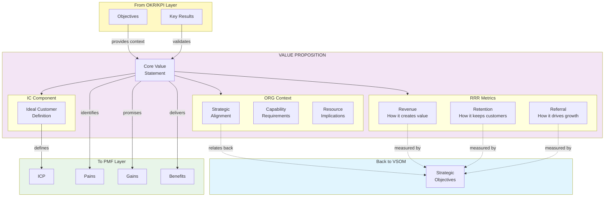

# EFS Lineage Diagrams

## 1. Complete Five-Layer Lineage Architecture

---

## 2. Value Proposition Breakdown

---

## 3. ICP to EFS Mapping

---

## 4. Complete Lineage Traceability Example

---

## 5. Bidirectional Traceability

---

## 6. Lineage Status Visualization

---

## 7. Cross-Ontology Relationship Map

---

*Diagrams Version: 1.0.0 | Part of EFS Lineage Specification*
