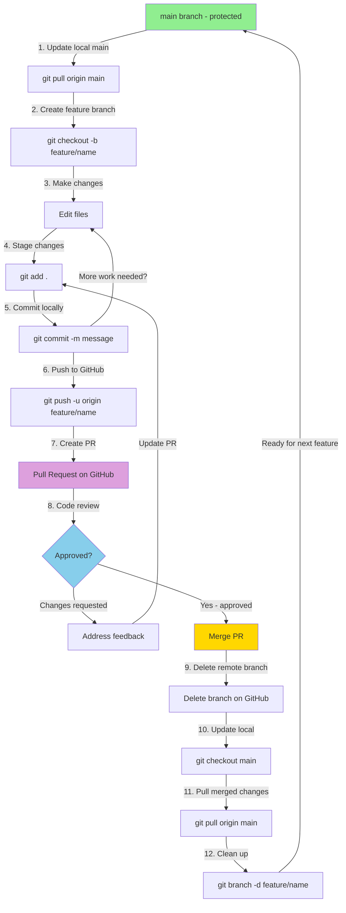
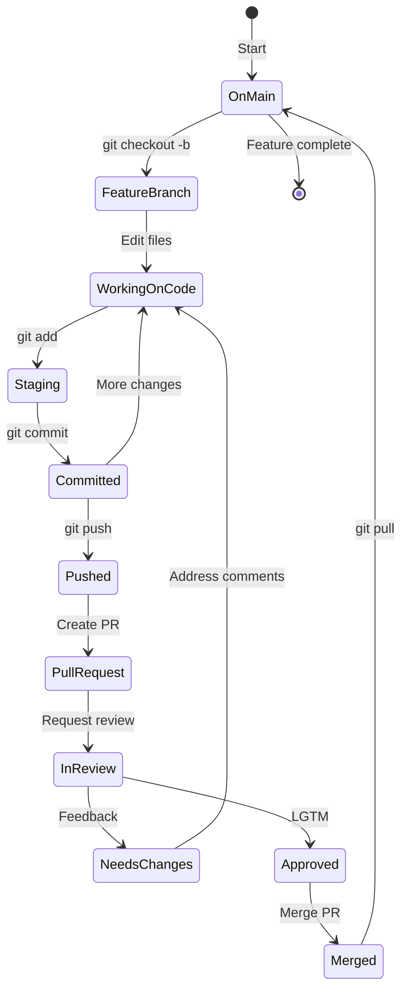

# Git Feature Branch Workflow - Team Guide

## Purpose
This guide teaches team members how to safely work with feature branches, avoiding direct commits to main and preventing data loss.

## Prerequisites
- Git installed on your machine
- Repository cloned locally
- GitHub account with repository access

## Core Principle
**NEVER commit directly to main.** Always work on a feature branch.

---

## Step-by-Step Workflow

### 1. Start Fresh - Update Your Local Main

Before creating a new feature branch, always get the latest changes:

```bash
# Make sure you're on main
git checkout main

# Get the latest changes from GitHub
git pull origin main
```

**Why?** This ensures your new branch starts from the most recent code.

---

### 2. Create a Feature Branch

Choose a descriptive branch name that explains what you're working on:

```bash
# Pattern: feature/description or fix/description or docs/description
git checkout -b feature/add-user-authentication
```

**Good branch names:**
- `feature/add-login-page`
- `fix/broken-navigation`
- `docs/update-readme`
- `refactor/cleanup-api-calls`

**Bad branch names:**
- `my-branch`
- `test`
- `temp`
- `branch1`

**Tip:** Use lowercase with hyphens, not spaces or underscores.

---

### 3. Make Your Changes

Work normally on your feature branch:

```bash
# Edit your files
# Add new files
# Delete files

# Check what you've changed
git status
```

---

### 4. Save Your Work Locally (Commit)

#### Step 4a: Stage Your Changes

```bash
# Add specific files
git add path/to/file.md

# Or add all changed files
git add .
```

**Review before adding:**
```bash
# See what will be staged
git diff

# See what's already staged
git diff --staged
```

#### Step 4b: Commit with a Clear Message

```bash
git commit -m "Add user authentication form

- Create login component
- Add validation logic
- Update routing

Co-Authored-By: Warp <agent@warp.dev>"
```

**Good commit messages:**
- First line: Short summary (50 chars or less)
- Blank line
- Bullet points explaining what changed
- Include co-author line if using AI assistants

**Example:**
```
Add search functionality to dashboard

- Implement search bar component
- Add filtering logic for results
- Update tests for search feature

Co-Authored-By: Warp <agent@warp.dev>
```

---

### 5. Push Your Branch to GitHub

```bash
# First time pushing this branch
git push -u origin feature/add-user-authentication

# Subsequent pushes (after first time)
git push
```

**What this does:** Uploads your branch to GitHub so others can see it and you can create a pull request.

---

### 6. Create a Pull Request (PR)

#### Via GitHub Web Interface:

1. Go to your repository on GitHub
2. You'll see a yellow banner saying "Compare & pull request" - click it
3. Fill in the PR form:
   - **Title:** Clear description of changes
   - **Description:** Explain what you did and why
   - **Reviewers:** Add team members if needed
4. Click **"Create pull request"**

#### Via GitHub CLI (if installed):

```bash
gh pr create --title "Add user authentication" --body "Implements login form with validation"
```

---

### 7. Handle Review Feedback

If reviewers request changes:

```bash
# Make the requested changes
# Then commit and push again
git add .
git commit -m "Address review feedback - improve validation"
git push
```

**The PR updates automatically** when you push to the same branch.

---

### 8. Merge Your PR

Once approved:

#### Option A: Merge via GitHub Web Interface
1. Go to your PR on GitHub
2. Click **"Merge pull request"**
3. Click **"Confirm merge"**
4. Optionally, click **"Delete branch"** (recommended)

#### Option B: Merge via GitHub CLI
```bash
gh pr merge --squash --delete-branch
```

**Merge strategies:**
- **Squash and merge** (recommended): Combines all commits into one
- **Merge commit**: Keeps all commits separate
- **Rebase and merge**: Replays commits on top of main

For most cases, use **squash and merge** for a clean history.

---

### 9. Clean Up Locally

After merging, delete your local feature branch:

```bash
# Switch back to main
git checkout main

# Pull the merged changes
git pull origin main

# Delete your local feature branch
git branch -d feature/add-user-authentication
```

**Why?** Keeps your local repository clean and prevents confusion.

---

## Common Scenarios

### Scenario 1: Main Has New Changes While You're Working

Your feature branch is behind main and you want the latest changes:

```bash
# On your feature branch
git checkout feature/your-feature

# Get latest from main
git fetch origin main

# Merge main into your branch
git merge origin/main
```

**Or use rebase** (cleaner but slightly riskier):
```bash
git rebase origin/main
```

If conflicts occur, Git will tell you which files. Edit them, then:
```bash
git add .
git rebase --continue
```

---

### Scenario 2: You Accidentally Started Working on Main

If you made changes on main but haven't committed:

```bash
# Create a new branch with your changes
git checkout -b feature/my-work

# Your changes are now on the new branch!
git add .
git commit -m "Your commit message"
```

If you already committed to main:

```bash
# Create branch from current state
git branch feature/my-work

# Reset main to match origin (CAUTION: loses local commits on main)
git checkout main
git reset --hard origin/main

# Switch to your feature branch
git checkout feature/my-work
```

---

### Scenario 3: Need to Switch Branches Mid-Work

If you need to switch branches but aren't ready to commit:

```bash
# Save work temporarily
git stash

# Switch branches
git checkout other-branch

# When ready to return
git checkout feature/your-feature
git stash pop
```

---

### Scenario 4: Made a Mistake in Last Commit

**Before pushing:**
```bash
# Change the last commit message
git commit --amend -m "New message"

# Add forgotten files to last commit
git add forgotten-file.md
git commit --amend --no-edit
```

**After pushing:**
Create a new commit instead - don't rewrite history on shared branches.

---

## Emergency Commands

### Undo All Local Changes (Not Committed)
```bash
# Discard all changes since last commit
git reset --hard HEAD
```

⚠️ **WARNING:** This permanently deletes uncommitted work!

### Undo Last Commit (Keep Changes)
```bash
# Undo commit but keep files changed
git reset --soft HEAD~1
```

### See What You're About to Push
```bash
git diff origin/main..HEAD
```

---

## Best Practices Checklist

Before creating a PR, verify:

- [ ] Branch name is descriptive
- [ ] Commits have clear messages
- [ ] Code works and has been tested
- [ ] No sensitive data (passwords, API keys) committed
- [ ] Large files excluded (use .gitignore)
- [ ] Co-author attribution added if using AI tools
- [ ] Branch is up to date with main
- [ ] Only related changes included (no random fixes)

---

## Quick Reference Commands

```bash
# Create branch
git checkout -b feature/name

# Check status
git status

# Stage changes
git add .

# Commit
git commit -m "message"

# Push
git push -u origin feature/name

# Update from main
git fetch origin main
git merge origin/main

# Delete branch locally
git branch -d feature/name

# Delete branch remotely
git push origin --delete feature/name
```

---

## Visual Workflow Diagram

### Mermaid Diagram - Complete Feature Branch Workflow



### Text-Based Diagram (for quick reference)

```
main branch (protected)
    │
    ├── Create feature branch ──┐
    │                           │
    │                    feature/your-work
    │                           │
    │                    [Make changes]
    │                           │
    │                    [Commit changes]
    │                           │
    │                    [Push to GitHub]
    │                           │
    │                    [Create Pull Request]
    │                           │
    │                    [Code Review]
    │                           │
    │                    [Approval]
    │                           │
    │◄──── Merge PR ────────────┘
    │
    ▼
Updated main
```

### Workflow State Transitions



---

## GitHub CLI Quick Setup

Install GitHub CLI for easier workflow:

```bash
# macOS
brew install gh

# Login
gh auth login

# Common commands
gh pr create                    # Create PR
gh pr list                      # List your PRs
gh pr view                      # View current PR
gh pr merge --squash           # Merge PR
```

---

## Getting Help

### Stuck? Check these first:
1. `git status` - What's the current state?
2. `git log --oneline -5` - Recent commits
3. `git branch -a` - What branches exist?

### Common errors and fixes:

**Error: "Updates were rejected"**
```bash
git pull --rebase origin main
git push
```

**Error: "Please commit or stash changes"**
```bash
git stash
git checkout other-branch
git stash pop
```

**Error: "Merge conflict"**
1. Open conflicted files
2. Look for `<<<<<<<`, `=======`, `>>>>>>>` markers
3. Edit to resolve
4. `git add .`
5. `git commit`

---

## Team Communication

When working on features:
- **Announce** when starting significant work
- **Link** your PR in team chat when ready for review
- **Respond** to review comments promptly
- **Update** status if blocked or delayed
- **Coordinate** if multiple people working on related areas

---

## Additional Resources

- [GitHub Flow Guide](https://guides.github.com/introduction/flow/)
- [Pro Git Book](https://git-scm.com/book/en/v2)
- [GitHub CLI Docs](https://cli.github.com/manual/)
- [Interactive Git Tutorial](https://learngitbranching.js.org/)

---

**Document Version:** 1.1.0  
**Last Updated:** 2026-01-20  
**Author:** TeamBAIV  
**Status:** Active  
**Changelog:**
- v1.1.0 (2026-01-20): Added Mermaid workflow diagrams and state transitions
- v1.0.0 (2026-01-20): Initial release

**Related:** See `github-branch-protection-setup.md` for repository protection configuration
