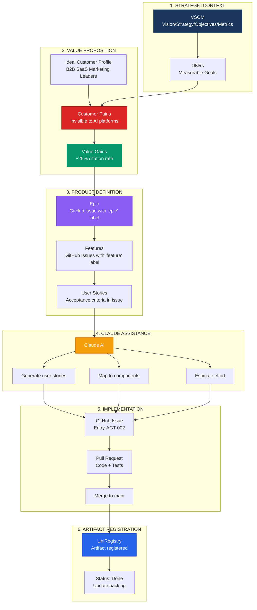
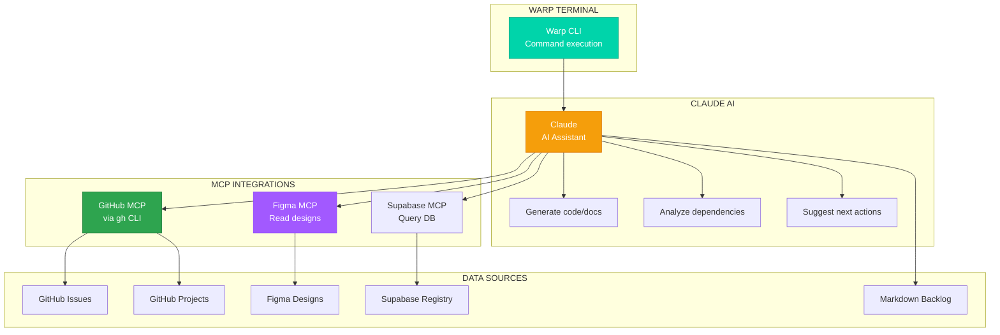

# GitHub + Claude Product Development Workflow

**Lightweight Product Management Without PPM Tools**

Version: 1.0.0  
Date: 2026-01-21  
Purpose: Document how to manage product development using GitHub, Claude, and MCP stack instead of traditional PPM tools  
Status: Active

---

## Overview

This workflow enables product teams to manage the entire product development lifecycle—from value proposition to shipped features—using only GitHub, Claude AI, and existing dev tools. No additional PPM software required.

**Philosophy:** Focus on building product, not managing project management tools.

**Tools Used:**
- **GitHub Issues + Projects** - Task tracking and visualization
- **Claude AI** - Product thinking, content generation, workflow automation
- **Warp Terminal** - Command execution with AI assistance
- **Figma MCP** - Design token sync
- **Markdown files** - Version-controlled documentation

---

## Product Development Flow



---

## Phase 1: Strategic Context → Value Proposition

### Step 1.1: Define VSOM Context

**Where:** `ontologies/ve-ontologies/ve-ont1-vesm-vsom-arch/`

**Claude Prompt:**
```
Based on our VSOM ontology, what are the top 3 strategic objectives 
for BAIV platform that align with "Make B2B SaaS brands discoverable by AI"?
```

**Output:** Strategic objectives with metrics
- Financial: $5K MRR by Month 3
- Customer: >40% PMF score, +25% citation rate
- Process: <2 sec response time, 99.5% uptime

**Create GitHub Issue:**
```
Title: [VSOM] Define BAIV Strategic Objectives
Labels: vsom, strategic, documentation
```

### Step 1.2: Define Value Proposition

**Where:** Markdown file or GitHub Discussion

**Claude Prompt:**
```
Using the Value Proposition Canvas, help me define:
- Target ICP: B2B SaaS Marketing Leaders
- Customer Pain: [describe problem]
- Value Gain: [describe improvement]
- Solution: [what we build]
```

**Claude generates:**
```markdown
## BAIV Value Proposition

**For:** B2B SaaS Marketing Leaders (CMO, VP Marketing)
**Who:** Struggle with invisibility to AI platforms (ChatGPT, Claude, Perplexity)
**The BAIV Platform:** AI Visibility Optimization solution
**That:** Audits gaps, generates content, increases citation rates
**Unlike:** Manual SEO or generic content tools
**BAIV:** Uses ontology-driven, multi-agent approach

### Pains (Before BAIV)
- Lost discovery opportunities from AI platforms
- Competitors get cited instead
- No AI-driven inbound leads
- Manual competitive analysis

### Gains (With BAIV)
- +25% citation rate improvement
- 3x faster content production
- Higher-intent leads from AI search
- Automated competitive intelligence
```

**Create GitHub Issue:**
```
Title: [Value Prop] BAIV AI Visibility Solution
Labels: value-proposition, epic
Milestone: Discovery Phase

Body: [paste Value Proposition Canvas from Claude]
```

---

## Phase 2: Value Proposition → Epics & Features

### Step 2.1: Generate Epic from Pain Point

**Claude Prompt:**
```
Given this customer pain:
"B2B SaaS companies are invisible to AI platforms"

Create an Epic with:
- Epic title
- User stories (As a [role], I want [action], so that [benefit])
- Success criteria
- Estimated value (impact)
```

**Claude Output:**
```markdown
# Epic 1: Make Brands Discoverable by AI Platforms

## Problem Statement
Marketing leaders have no visibility into whether AI platforms 
(ChatGPT, Claude, Perplexity) mention their brand when prospects 
ask relevant questions.

## Business Impact
- Lost market share to competitors who ARE cited
- Missing from the "future of search"
- No measurement of AI platform presence

## Features Needed
1. AI Visibility Audit - Measure current citation rate
2. Gap Analysis - Identify missed opportunities  
3. Content Generator - Create optimized content
```

**Create GitHub Issue (Epic):**
```
Title: [EPIC] Make Brands Discoverable by AI Platforms
Labels: epic, P0-Critical, value-prop
Milestone: MVP v1.0

Body:
## Problem
[paste from Claude]

## Business Impact
[paste from Claude]

## Features (Child Issues)
- [ ] #12 Feature 1.1: AI Visibility Audit
- [ ] #18 Feature 1.2: Gap Analysis
- [ ] #24 Feature 1.3: Content Generator

## Success Metrics
- Citation rate baseline established for 100 keywords
- Top 50 gaps identified and prioritized
- 10 blog posts generated addressing gaps
```

### Step 2.2: Break Epic into Features

**For each feature, Claude generates:**

**Claude Prompt:**
```
Break down "AI Visibility Audit" feature into:
- User stories (3-5)
- Technical components needed
- Acceptance criteria
- Estimated effort (S/M/L)
```

**Create GitHub Issues (Features):**
```
Title: [Feature 1.1] AI Visibility Audit
Labels: feature, agent, P0-Critical
Milestone: Week 2
Epic: #10 (link to epic issue)

## User Stories
- As a CMO, I want to see citation rate across 4 AI platforms, 
  so I know baseline visibility
- As a Marketing Director, I want to test 100 priority keywords, 
  so I understand gaps
- As an Analyst, I want competitor comparison, 
  so I can benchmark performance

## Technical Components
- Discovery Agent (Entry-AGT-002) - queries AI platforms
- Citation Tester (Entry-AGT-003) - measures citation rate
- Dashboard Widget (Entry-UIX-011) - displays metrics

## Acceptance Criteria
- [ ] Query 4 AI platforms (ChatGPT, Claude, Perplexity, Gemini)
- [ ] Extract brand mentions from responses
- [ ] Calculate citation rate (mentions / total queries)
- [ ] Store results in Supabase
- [ ] Display in dashboard widget
- [ ] 70% test coverage

## Effort Estimate
Medium (3-5 days)

## Registry Artifacts
- Entry-AGT-002: Discovery Agent
- Entry-AGT-003: Citation Tester
- Entry-ONT-020: AI Visibility Ontology
- Entry-UIX-011: Citation Dashboard
```

---

## Phase 3: Features → Implementation Tasks

### Step 3.1: Use Claude to Generate Implementation Plan

**Claude Prompt:**
```
For "Discovery Agent (Entry-AGT-002)", create:
1. WBS task breakdown
2. Technical architecture
3. File structure
4. Key functions to implement
```

**Claude Output:**
```markdown
## WBS: Discovery Agent (Entry-AGT-002)

### 1.1 Core Agent Implementation
- 1.1.1 Create agent specification (agent-template-v6.1)
- 1.1.2 Implement query executor
- 1.1.3 Build API integrations (ChatGPT, Claude, etc.)
- 1.1.4 Implement citation detection algorithm
- 1.1.5 Add error handling and retries

### 1.2 Testing
- 1.2.1 Unit tests (70% coverage)
- 1.2.2 Integration tests (API mocking)
- 1.2.3 Test data (60 typical, 20 edge, 10 boundary, 10 invalid)

### 1.3 Registration
- 1.3.1 Validate against quality gates (G1-G5)
- 1.3.2 Register in UniRegistry
- 1.3.3 Update backlog status to Done

## Technical Architecture
[Mermaid diagram from Claude]

## File Structure
agents/Agent-02-Discovery/
├── discovery-agent-v1/
│   ├── system-prompt.md
│   ├── config.json
│   ├── src/
│   │   ├── query-executor.ts
│   │   ├── citation-detector.ts
│   │   └── api-integrations/
│   └── tests/
```

**Create subtasks as checkboxes in feature issue** (no separate issues needed)

### Step 3.2: Use Figma MCP to Extract Design Tokens

**Warp + Claude + Figma MCP:**

```bash
# In Warp terminal with Claude
warp> "Extract spacing tokens from Figma design system"

# Claude uses Figma MCP to read design file
# Outputs: spacing-tokens.json
{
  "spacing": {
    "xs": "4px",
    "sm": "8px",
    "md": "16px",
    "lg": "24px",
    "xl": "32px"
  }
}
```

**Create Registry Entry Issue:**
```
Title: [Design Token] Spacing Scale (Entry-DTK-001)
Labels: design-token, ui
Milestone: Week 1

## Source
Figma: BAIV Design System > Foundation > Spacing

## Tokens
[paste spacing-tokens.json]

## Registry
Entry-DTK-001: Spacing Scale
```

---

## Phase 4: GitHub Project Workflow

### Step 4.1: Setup GitHub Project (One-Time)

**Manual setup (15 minutes):**

1. **Create Project:**
   - Go to github.com/TeamBAIV/PF-Core-BAIV/projects
   - Click "New Project" → "Board" template
   - Name: "BAIV AIViz-MVP v1.0"

2. **Create Custom Fields:**
   - Registry Entry (text): Entry-AGT-002, Entry-ONT-001, etc.
   - Priority (select): P0-Critical, P1-Important, P2-Optional
   - Effort (select): Small, Medium, Large
   - Component Type (select): Agent, Ontology, API, UI, Schema, Token

3. **Create Views:**
   - Board view: Columns = Backlog, In Progress, Testing, Done
   - Roadmap view: Group by Milestone
   - Table view: All fields visible

4. **Create Milestones:**
   - Week 1: Security Foundation (Due: 2026-01-28)
   - Week 2: Discovery & Citation (Due: 2026-02-04)
   - Week 3: Dashboard (Due: 2026-02-11)
   - Week 4: Gap Analysis (Due: 2026-02-18)
   - Week 5: Content Generator (Due: 2026-02-25)
   - Week 6: Publishing & Launch (Due: 2026-03-04)

5. **Create Labels:**
   - Type: `epic`, `feature`, `bug`, `task`
   - Component: `agent`, `ontology`, `api`, `ui`, `schema`, `token`
   - Priority: `P0-Critical`, `P1-Important`, `P2-Optional`
   - Status: `blocked`, `needs-review`, `wip`

### Step 4.2: Import Backlog with Claude

**Claude Prompt:**
```
Read CANDIDATE_REGISTRY_BACKLOG.md and generate GitHub issue 
creation commands for all 43 artifacts. Format as gh CLI commands.
```

**Claude Output:**
```bash
# Ontologies
gh issue create --title "[ONT-001] VSOM Ontology" \
  --label "ontology,P0-Critical" \
  --milestone "Week 1" \
  --body "Registry: Entry-ONT-001
Status: Testing
Location: ve-ontologies/ve-ont1-vesm-vsom-arch/"

gh issue create --title "[ONT-002] Organisation Ontology" \
  --label "ontology,P0-Critical" \
  --milestone "Week 1" \
  --body "Registry: Entry-ONT-002
Status: Testing  
Location: pfc-ont-organisation/"

# ... (41 more)
```

**Run batch creation:**
```bash
# Save Claude output to file
cat > create-issues.sh << 'EOF'
[paste commands]
EOF

chmod +x create-issues.sh
./create-issues.sh
```

**Result:** 43 GitHub issues created in 2 minutes

---

## Phase 5: Daily Development Workflow

### Morning Standup (5 minutes)

**Warp + Claude:**
```bash
warp> "Show me all In Progress issues assigned to me"

# Claude reads GitHub Project via API/gh CLI
Issues in Progress (3):
- #12 Discovery Agent (Entry-AGT-002) - 60% complete
- #18 Gap Analyzer (Entry-AGT-006) - Blocked by #12
- #22 Citation Dashboard (Entry-UIX-011) - 30% complete
```

**Claude Prompt:**
```
What should I focus on today given my In Progress issues 
and their dependencies?
```

**Claude Response:**
```
Priority: Complete Discovery Agent (#12) first
- It blocks Gap Analyzer (#18)
- Citation Dashboard (#22) needs Discovery Agent data

Tasks for today:
1. Finish citation detection algorithm (1.1.4)
2. Add error handling (1.1.5)
3. Run integration tests (1.2.2)
4. Move to Testing column if all pass
```

### During Development

**Use Claude for code generation:**
```typescript
// Warp + Claude prompt:
// "Generate citation detection algorithm for Discovery Agent"

export async function detectCitations(
  response: string,
  brandName: string
): Promise<CitationResult> {
  // Claude generates full implementation
  const mentions = findBrandMentions(response, brandName);
  const context = extractMentionContext(response, mentions);
  
  return {
    cited: mentions.length > 0,
    mentionCount: mentions.length,
    contexts: context,
    sentiment: analyzeSentiment(context)
  };
}
```

**Update issue status:**
```bash
# Manual: Drag issue card in GitHub Project
# Or via gh CLI:
gh issue edit 12 --add-label "in-progress"
```

### Code Review with Claude

**Pull Request Description (Claude-generated):**
```bash
warp> "Generate PR description for Discovery Agent implementation"
```

**Claude Output:**
```markdown
## Summary
Implements Discovery Agent (Entry-AGT-002) for AI platform querying.

## Changes
- ✅ Query executor with retry logic
- ✅ API integrations: ChatGPT, Claude, Perplexity, Gemini
- ✅ Citation detection algorithm (regex + NLP)
- ✅ Error handling and rate limiting
- ✅ 75% test coverage (exceeds 70% requirement)

## Testing
- Unit tests: 24/24 passing
- Integration tests: 8/8 passing (mocked APIs)
- Test data: 60 typical, 20 edge, 10 boundary, 10 invalid

## Registry
Entry-AGT-002: Discovery Agent
Dependencies: Entry-ONT-020 (AI Visibility Ontology)

## Checklist
- [x] Code follows agent template v6.1
- [x] All tests passing
- [x] Documentation updated
- [x] Quality gates passed (G1-G5)
- [ ] Ready for registry registration (after merge)
```

### End of Day

**Update backlog markdown:**
```bash
warp> "Update Discovery Agent status to Testing in backlog"

# Claude edits CANDIDATE_REGISTRY_BACKLOG.md
# Changes line:
# | 2 | Discovery Agent | In Progress | Entry-AGT-002 | ...
# To:
# | 2 | Discovery Agent | Testing | Entry-AGT-002 | ...

# Commits change
git commit -m "Update Discovery Agent status to Testing"
```

---

## Phase 6: Completion & Registration

### When Feature is Done

**1. Merge Pull Request:**
```bash
gh pr merge 45 --squash --delete-branch
```

**2. Register in UniRegistry (OAA Agent):**

**Warp + Claude:**
```bash
warp> "Register Discovery Agent (Entry-AGT-002) in UniRegistry"

# Claude calls OAA agent WORKFLOW A (registration)
# Creates registry entry with JSON-LD format
```

**3. Update GitHub Issue:**
```bash
gh issue close 12 --comment "✅ Registered in UniRegistry as Entry-AGT-002
Quality gates passed: G1-G5 (100%)
Merged: PR #45"
```

**4. Update Backlog:**
```markdown
| 2 | Discovery Agent | **Done** | Entry-AGT-002 | P0-Critical | 
  Entry-ONT-020 | Closed #12, PR #45 |
```

**5. Move to Done column in GitHub Project** (automatic when issue closed)

---

## MCP Integration Points

### Current Stack + MCP Capabilities



### MCP Workflow Examples

**Example 1: Morning Planning**
```bash
warp> "What's on my plate today?"

# Claude uses GitHub MCP to:
# 1. Read assigned issues
# 2. Check dependencies
# 3. Suggest priority order

Claude: You have 3 issues in progress:
- #12 Discovery Agent (60% done, blocks 2 other issues)
  → Priority: HIGH - finish today
- #22 Citation Dashboard (30% done, no blockers)
  → Priority: MEDIUM - continue tomorrow
- #18 Gap Analyzer (blocked by #12)
  → Priority: LOW - wait for #12

Recommendation: Focus on #12 to unblock #18.
```

**Example 2: Design Token Sync**
```bash
warp> "Sync spacing tokens from Figma to codebase"

# Claude uses Figma MCP to:
# 1. Read design tokens from Figma file
# 2. Generate TypeScript constants
# 3. Create PR with changes

Claude: Found 5 spacing tokens in Figma Design System.
Generated: src/styles/tokens/spacing.ts
Created PR #48: "Sync spacing tokens from Figma"
```

**Example 3: Registry Status Check**
```bash
warp> "How many artifacts are registered in UniRegistry?"

# Claude uses Supabase MCP to:
# 1. Query unified_registry table
# 2. Count by artifact type
# 3. Show completion percentage

Claude: UniRegistry Status:
- Ontologies: 3/10 (30% complete)
- Agents: 1/9 (11% complete)
- APIs: 0/5 (0% complete)
- UI Components: 0/3 (0% complete)

Next to register: OAA Agent (Entry-AGT-003) - in Testing
```

**Example 4: Dependency Analysis**
```bash
warp> "Can I start working on Gap Analyzer?"

# Claude uses GitHub MCP to:
# 1. Read issue #18 (Gap Analyzer)
# 2. Check dependencies
# 3. Verify blocker status

Claude: Gap Analyzer (#18) is blocked by:
- #12 Discovery Agent (In Progress, 60% done)

Discovery Agent must be Done before you can start.
Estimated unblock date: Tomorrow (based on velocity)

Suggestion: Work on #22 Citation Dashboard instead today.
```

---

## Comparison: Traditional PPM vs GitHub+Claude

| Capability | Traditional PPM | GitHub + Claude | Winner |
|------------|-----------------|-----------------|--------|
| **Epic/Feature Tracking** | Linear, Jira ($8-15/user/mo) | GitHub Issues (free) | ✅ GitHub |
| **User Story Generation** | Manual entry | Claude generates | ✅ Claude |
| **Task Breakdown** | Manual WBS creation | Claude generates WBS | ✅ Claude |
| **Dependency Tracking** | Native in tool | "Blocked by #123" in description | ⚖️ Tie |
| **Status Updates** | Manual drag/drop | Manual drag/drop OR Claude automation | ⚖️ Tie |
| **Roadmap View** | Native timeline | GitHub Projects Roadmap | ⚖️ Tie |
| **Design Token Sync** | Manual export/import | Figma MCP automated | ✅ Claude+MCP |
| **Registry Integration** | Custom API integration | Supabase MCP direct query | ✅ Claude+MCP |
| **Daily Standup Prep** | Manual review of boards | Claude summarizes In Progress | ✅ Claude |
| **PR Description** | Manual writing | Claude generates from commits | ✅ Claude |
| **Effort Estimation** | Manual T-shirt sizing | Claude analyzes and suggests | ✅ Claude |
| **Context Switching** | Web app + Code editor | All in Warp terminal | ✅ GitHub+Claude |
| **Learning Curve** | 1-2 weeks training | Existing GitHub knowledge | ✅ GitHub |
| **Cost (5 people, 6 weeks)** | $240-450 | $0 | ✅ GitHub |

**Time Saved:** ~5-8 hours/week (no PPM tool admin, Claude automation)  
**Cost Saved:** $240-450 for MVP period  
**Focus Gained:** Build product instead of manage tools

---

## When to Evolve to PPM Tool

**Stick with GitHub+Claude if:**
- ✅ Team <10 people
- ✅ Single product/project
- ✅ Technical team comfortable with GitHub
- ✅ MVP or early-stage product

**Consider PPM tool (Linear, Jira) when:**
- ⚠️ Team >10 people (coordination overhead)
- ⚠️ Multiple products/projects (need portfolio view)
- ⚠️ Non-technical stakeholders need access
- ⚠️ Complex dependencies across 20+ teams
- ⚠️ MCP integration available (can auto-sync)

**Evolution Path:**
1. **Weeks 1-6 (MVP):** GitHub + Claude + Markdown
2. **Weeks 7-12 (Phase 2):** Build Program Manager Agent
3. **Month 4+ (Phase 3):** Optional Linear with auto-sync from PM Agent

---

## Quick Reference Commands

### Daily Workflow

```bash
# Morning standup
warp> "Show my In Progress issues"
warp> "What should I work on today?"

# Start work
warp> "Create feature branch for issue #12"
git checkout -b feature/discovery-agent-agt-002

# During development
warp> "Generate citation detection algorithm"
warp> "Write unit tests for query executor"

# Create PR
warp> "Generate PR description for Discovery Agent"
gh pr create --title "..." --body "$(claude-generated)"

# End of day
warp> "Update Discovery Agent status to Testing"
warp> "Commit backlog changes"
```

### Weekly Workflow

```bash
# Monday - Week planning
warp> "Show Week 2 milestone progress"
warp> "List all blocked issues"

# Wednesday - Status sync
warp> "Update backlog from GitHub issue statuses"

# Friday - Week review
warp> "What did we complete this week?"
warp> "What's at risk for next week?"
```

### MCP Commands

```bash
# Figma integration
warp> "Extract spacing tokens from Figma"
warp> "Compare Figma colors with codebase tokens"

# GitHub integration  
warp> "Show all P0 issues in Testing status"
warp> "Create issues from backlog ONT section"

# Supabase integration
warp> "Query registry for completed agents"
warp> "Show artifacts registered this week"
```

---

## File Structure

All product docs in version control:

```
PF-Core-BAIV/
├── std-docs/
│   ├── github-claude-product-workflow.md (this file)
│   ├── git-feature-branch-workflow.md
│   └── github-branch-protection-setup.md
├── architecture/unified-register/uniregistry-mvp-v1.0/
│   ├── CANDIDATE_REGISTRY_BACKLOG.md (43 artifacts)
│   ├── PBS_TO_PPM_MAPPING.md (Epic → Feature → WBS)
│   └── INTEGRATION_GUIDE_PPM.md (PPM ontology)
├── ontologies/ve-ontologies/
│   └── ve-ont1-vesm-vsom-arch/ (Strategic context)
└── .github/
    └── ISSUE_TEMPLATE/
        ├── epic.md
        ├── feature.md
        └── artifact.md
```

---

## Next Steps

### Setup (2 hours)
1. ✅ Create GitHub Project "BAIV AIViz-MVP v1.0"
2. ✅ Create 6 milestones (Week 1-6)
3. ✅ Create labels (epic, feature, agent, etc.)
4. ✅ Import 43 issues from backlog with Claude
5. ✅ Configure custom fields (Registry Entry, Priority, etc.)

### Team Onboarding (30 minutes)
1. Review this workflow document
2. Practice Claude commands in Warp
3. Create first issue together
4. Walk through daily workflow
5. Test MCP integrations (Figma, GitHub)

### Week 1 Execution
1. Start with Epic 1 issues
2. Use daily workflow commands
3. Update backlog on Wednesday
4. Review progress on Friday
5. Iterate and improve

---

## Document Control

**Document Status:** Active  
**Version:** 1.0.0  
**Last Updated:** 2026-01-21  
**Owner:** PF-Core-BAIV Team  

**Related Documents:**
- PBS_TO_PPM_MAPPING.md (Epic → Feature → WBS mapping)
- CANDIDATE_REGISTRY_BACKLOG.md (43 artifacts)
- git-feature-branch-workflow.md (Git workflow)
- github-branch-protection-setup.md (Branch protection)

**Change Log:**
- v1.0.0 (2026-01-21): Initial workflow documentation

**Co-Authored-By:** Warp <agent@warp.dev>
