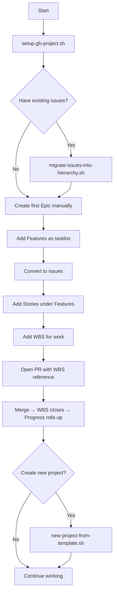

# Quick Start: Setup PF-Core-BAIV Hierarchy

This is a concrete example showing how to set up the GitHub hierarchy for PF-Core-BAIV as your first/template project.

## Prerequisites

```sh
# Install GitHub CLI if needed
brew install gh

# Authenticate
gh auth login

# Verify jq is installed
which jq || brew install jq
```

## Step 1: Create Project and Fields

Run the setup script and provide your answers:

```sh
cd /Users/amandamoore/Documents/PF-Core-BAIV
./scripts/setup-gh-project.sh
```

**Example prompts/answers:**
```
Owner (org or user, e.g., acme): amandamoore
Project name (e.g., Product Hierarchy): PF-Core BAIV Hierarchy
```

**What happens:**
- Creates project "PF-Core BAIV Hierarchy" under your account
- Adds fields: Type, Status, Priority, Estimate, Registry ID, PBS ID, WBS Code
- Creates saved views: Epic Progress, PBS Delivery, Registry Coverage

## Step 2: Migrate Existing Issues

If you have existing issues in your repo that need classification:

```sh
./scripts/migrate-issues-into-hierarchy.sh
```

**Example prompts/answers:**
```
Repo (owner/name): amandamoore/PF-Core-BAIV
Owner (org or user for Project): amandamoore
Project name: PF-Core BAIV Hierarchy

Classify issues by search query (leave blank to skip).
Search for Epics (e.g., in:title '[Epic]'): in:title "[Epic]" state:open
Search for Features: in:title "[Feature]" state:open
Search for Stories: in:title "[Story]" state:open
Search for PBS: in:title "[PBS]" state:open
Search for WBS: in:title "[WBS]" state:open
Search for Registry: in:title "[Registry]" state:open
```

**What happens:**
- Creates labels: type:epic, type:feature, type:story, type:pbs, type:wbs, type:registry
- Searches for matching issues using your queries
- Applies labels to matching issues
- Adds all labeled issues to the Project
- Sets the Type field for each

## Step 3: Verify Setup

Check your project on GitHub:

```sh
gh project view "PF-Core BAIV Hierarchy" --owner amandamoore --web
```

Or list issues in the project:

```sh
gh project item-list "PF-Core BAIV Hierarchy" --owner amandamoore --format json --jq '.items[] | {number:.content.number, title:.content.title, type:.Type}'
```

## Step 4: Create Your First Hierarchy

Manually create a complete example:

1. **Create an Epic** via GitHub UI:
   - Go to Issues → New Issue → Epic
   - Title: `[Epic] Unified Registry Integration`
   - Fill Problem/Pain and Outcome Metrics
   - Create issue

2. **Add Features as tasklist** in Epic body:
   ```md
   - [ ] Registry API implementation
   - [ ] Registry validation rules
   - [ ] Registry UI dashboard
   ```

3. **Convert each task to an issue:**
   - Click "Convert to issue" on each checkbox
   - Each will auto-link and show as "Tracked by" the Epic

4. **Create Stories under Features:**
   - Open a Feature issue
   - Use the Story issue form
   - Reference parent: `#<feature-number>`

5. **Create WBS for executable work:**
   - Use WBS issue form
   - Reference parent Story or PBS
   - Fill in WBS Code and Registry ID if applicable

## Step 5: Open a PR Referencing WBS

```sh
# Create branch
git checkout -b feature/registry-api-WBS-1.1.1

# Make changes, commit
git commit -m "Implement registry API endpoint

Co-Authored-By: Warp <agent@warp.dev>"

# Push and create PR
git push -u origin HEAD
gh pr create --title "Registry API endpoint (WBS 1.1.1)" \
  --body "## Summary
Implements the registry API endpoint for artifact lookup.

## Links
- Resolves: #<wbs-issue-number>
- Parent: #<story-or-pbs-number>
- Registry Artifact: baiv:registry:entry:api-v1.0.0

## Checklist
- [x] Tests added/updated
- [x] Registry entry updated/versioned"
```

**What happens:**
- PR includes Registry Artifact reference (passes workflow check)
- When merged, WBS issue closes automatically
- Parent Story/PBS/Feature/Epic progress updates

## Freeze as Template (Optional)

Once you're happy with the project structure, use it as a template for new projects:

```sh
./scripts/new-project-from-template.sh
```

**Example prompts:**
```
Owner: amandamoore
Template project name: PF-Core BAIV Hierarchy
New project name: W4M VHF Hierarchy
Target repo: amandamoore/VHF
```

This clones all fields and views into the new project and bootstraps labels in the target repo.

## Mermaid: Your Setup Flow



## Next Steps

- Review saved views in your Project: Epic Progress, PBS Delivery, Registry Coverage
- Create charts: Type vs Status (stacked bar), Cumulative flow
- Set up Milestones for PBS components for schedule tracking
- Review `.github/workflows/enforce-registry-link.yml` runs on PRs

## Troubleshooting

**Script fails with "Project not found":**
- Verify owner name matches your GitHub username or org
- Check project name spelling (case-sensitive)

**Issues not appearing in Project:**
- Check issue has the correct label (e.g., `type:epic`)
- Manually add via GitHub UI: Project → Add Item → Search issue number

**Registry enforcement not working:**
- Ensure `.github/workflows/enforce-registry-link.yml` is committed to main/default branch
- Check Actions tab in repo for workflow runs
- Verify workflow has required permissions (read issues, read PRs)
