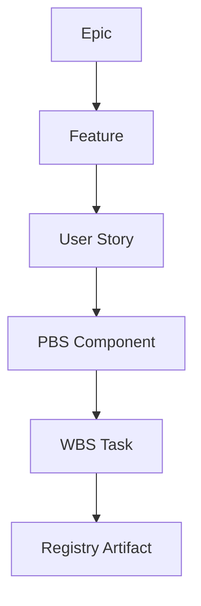
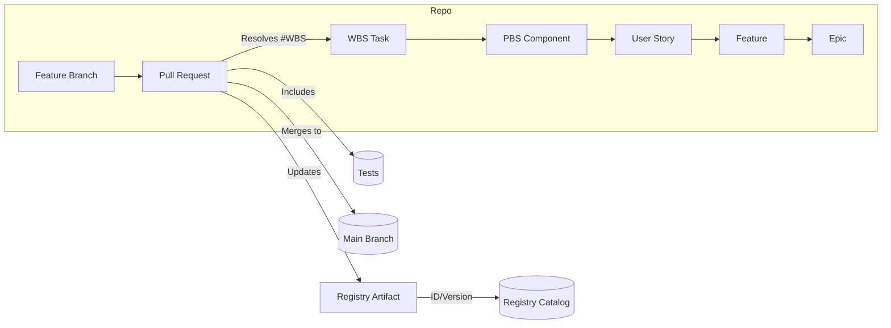
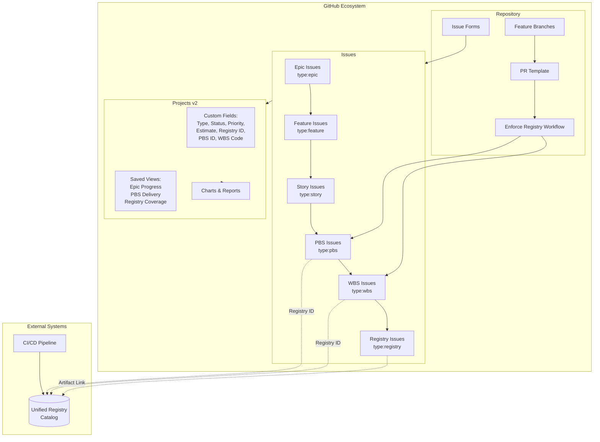

# GitHub Product Hierarchy and Reporting Guide

This guide shows how to model and report on the following hierarchy using GitHub Issues and Projects:

Epic → Feature → User Story → PBS Component → WBS Task → Registry Artifact

It includes a glossary, project configuration, issue forms, automation, migration steps with command sequences, and diagrams showing how repository branches and PRs correlate to this structure.

> **📖 For step-by-step instructions:** See the [GitHub Projects Operating Guide](./github-projects-operating-guide.md) for practical how-to instructions on creating projects, updating existing projects, configuring issues, and migrating legacy work.

## 1) Hierarchy Mapping to GitHub Objects

- Epic → Issue labeled `type:epic` (top level; contains tasklist of Features)
- Feature → Issue labeled `type:feature` (tracked by Epic; tasklist of Stories)
- User Story → Issue labeled `type:story` (tracked by Feature; tasklist of PBS/WBS)
- PBS Component (Deliverable) → Issue labeled `type:pbs` (optionally associated with a Milestone)
- WBS Task (Work Package) → Issue labeled `type:wbs` (execution unit; typically closed by a PR)
- Registry Artifact (Trackable Item) → Issue labeled `type:registry` (or an external entry in your registry), linked from WBS/PBS; contains canonical `Registry ID` and `Version`

Recommended Project (Projects v2) custom fields (single‑select unless noted):
- Type: Epic | Feature | Story | PBS | WBS | Registry
- Status: Backlog | Ready | In Progress | In Review | Done
- Priority: P0 | P1 | P2 | P3
- Venture/Domain: PF-Core | BAIV | W4M | AIR
- Tier: T1 | T2 | T3
- Estimate: Number
- Value: Number
- PBS ID: Text (e.g., PBS-1.2)
- WBS Code: Text (e.g., 1.2.3)
- Registry ID: Text (e.g., baiv:registry:entry:…)
- Version: Text (semver)

## 2) Glossary

- Epic (Customer Problem/Pain): A sizable customer problem/opportunity. Success is measured by an outcome metric. Owns Features.
- Feature (Solution Capability): A tangible capability that addresses part of the Epic. Accepts multiple Stories.
- User Story (Specific Functionality): User‑centric requirement describing behavior and acceptance criteria. Tracked by a Feature.
- PBS Component (Deliverable): Product Breakdown Structure item that packages Stories into a deliverable (e.g., API endpoint, UI module). May map to milestones/releases.
- WBS Task (Work Package): Work Breakdown Structure unit of work (hours/days). Typically closed by a PR. Must be traceable back to a Story/PBS.
- Registry Artifact (Trackable Item): A change‑controlled artifact (prompt, ontology, schema, API spec, design token, etc.) with an ID and version.
- Tracked by (Issue relation): Establishes parent→child progress via tasklists. Parents show a completion badge as children close.
- Milestone: Timebox for planning/reporting; optional for PBS/Stories.
- Project (Projects v2): Cross‑repo board with fields, views, charts, and automations.

## 3) Authoring Conventions

Labels
- `type:*`: `epic`, `feature`, `story`, `pbs`, `wbs`, `registry`
- `domain/*`: `pf-core`, `baiv`, `w4m`, `air`
- `tier/*`: `t1`, `t2`, `t3`

Parent/Child links
- Use tasklists in the parent’s issue body. Convert each checklist item into a child issue. This creates “Tracked by” relations.
- Keep one parent per issue for clean reporting.

Saved Project views
- Roadmap by Type: group by Type; filter `Status != Done`.
- Epic Progress: filter `Type = Epic`; show progress column.
- PBS Delivery: filter `Type = PBS`; group by Milestone; chart by Status.
- Registry Coverage: filter `Type in [WBS, PBS]`; show `Registry ID`; chart items missing `Registry ID`.

## 4) Issue Forms (YAML)

Use GitHub Issue Forms to capture structure up front. Place in `.github/ISSUE_TEMPLATE/`.

Epic
```yaml
name: Epic
description: Define a customer problem with measurable outcomes
title: "[Epic] <concise outcome>"
labels: ["type:epic"]
body:
  - type: textarea
    id: problem
    attributes:
      label: Problem / Pain
  - type: textarea
    id: outcome
    attributes:
      label: Outcome Metrics
      description: Metrics and target thresholds
  - type: textarea
    id: features
    attributes:
      label: Features (tasklist)
      description: Convert each to an issue to create tracking links
```

Feature
```yaml
name: Feature
description: Define a solution capability under an Epic
title: "[Feature] <capability>"
labels: ["type:feature"]
body:
  - type: input
    id: parent
    attributes:
      label: Parent Epic (URL or #)
    validations:
      required: true
  - type: textarea
    id: scope
    attributes:
      label: Scope
  - type: textarea
    id: stories
    attributes:
      label: Stories (tasklist)
```

User Story
```yaml
name: User Story
description: Define a user-facing capability with acceptance criteria
title: "[Story] <concise outcome>"
labels: ["type:story"]
body:
  - type: input
    id: parent
    attributes:
      label: Parent Feature (URL or #)
    validations:
      required: true
  - type: textarea
    id: narrative
    attributes:
      label: Narrative
      description: As a <role>, I want <capability>, so that <outcome>.
  - type: textarea
    id: acceptance
    attributes:
      label: Acceptance Criteria
      description: Gherkin-style GIVEN/WHEN/THEN
  - type: input
    id: pbs-id
    attributes:
      label: PBS ID (optional)
  - type: input
    id: wbs-code
    attributes:
      label: WBS Code (optional)
  - type: dropdown
    id: priority
    attributes:
      label: Priority
      options: ["P0","P1","P2","P3"]
      default: 1
  - type: input
    id: estimate
    attributes:
      label: Estimate (pts or hrs)
```

PBS Component
```yaml
name: PBS Component
description: Define a deliverable composed of stories/tasks
title: "[PBS] <deliverable>"
labels: ["type:pbs"]
body:
  - type: input
    id: parent
    attributes:
      label: Parent Story (URL or #)
    validations:
      required: false
  - type: input
    id: pbs-id
    attributes:
      label: PBS ID
  - type: textarea
    id: tasks
    attributes:
      label: WBS Tasks (tasklist)
```

WBS Task
```yaml
name: WBS Task
description: Execution unit typically closed by a PR
title: "[WBS] <work package>"
labels: ["type:wbs"]
body:
  - type: input
    id: parent
    attributes:
      label: Parent Story or PBS (URL or #)
    validations:
      required: true
  - type: input
    id: wbs-code
    attributes:
      label: WBS Code
  - type: input
    id: registry-id
    attributes:
      label: Registry ID (if applicable)
  - type: textarea
    id: definition
    attributes:
      label: Definition of Done
```

Registry Artifact
```yaml
name: Registry Artifact
description: Track a change-controlled artifact and version
title: "[Registry] <artifact name>"
labels: ["type:registry"]
body:
  - type: input
    id: registry-id
    attributes:
      label: Registry ID
      description: e.g., baiv:registry:entry:...
  - type: input
    id: version
    attributes:
      label: Version (semver)
  - type: textarea
    id: links
    attributes:
      label: Related WBS/PBS (URLs or #)
```

## 5) Automation

PR template (`.github/pull_request_template.md`)
```md
## Summary
<what/why>

## Links
- Resolves: #<issue>
- Parent (optional): #<parent>
- Registry Artifact: <baiv:registry:entry:... or URL>

## Checklist
- [ ] Tests added/updated
- [ ] Registry entry updated/versioned
```

Action: enforce Registry link for WBS/PBS on PRs (`.github/workflows/enforce-registry-link.yml`)
```yaml
name: enforce-registry-link
on:
  pull_request:
    types: [opened, edited, synchronize]
jobs:
  check:
    runs-on: ubuntu-latest
    steps:
      - uses: actions-ecosystem/action-regex-match@v2
        id: pr
        with:
          text: ${{ github.event.pull_request.body }}
          regex: 'Registry Artifact:\s*(\S+)'
      - name: Verify Registry ID present when PR closes WBS/PBS issues
        uses: actions/github-script@v7
        with:
          script: |
            const body = context.payload.pull_request.body || "";
            const closes = [...body.matchAll(/#(\d+)/g)].map(m => m[1]);
            if (closes.length === 0) return;
            const core = require('@actions/core');
            const registry = '${{ steps.pr.outputs.group1 }}';
            let needsRegistry = false;
            for (const num of closes) {
              const { data: iss } = await github.rest.issues.get({
                owner: context.repo.owner, repo: context.repo.repo, issue_number: Number(num)
              });
              const labels = iss.labels.map(l => typeof l === 'string' ? l : l.name);
              if (labels.some(l => ['type:wbs','type:pbs'].includes(l))) needsRegistry = true;
            }
            if (needsRegistry && (!registry || registry === '')) {
              core.setFailed('PR references WBS/PBS but is missing "Registry Artifact:" in the body.');
            }
```

## 6) Diagrams

Hierarchy


Repository Correlation (Branches and PRs)


Complete System Architecture


## 7) Migration Guide (Step‑by‑Step with Commands)

Prerequisites
- Install GitHub CLI and authenticate: `gh auth login`
- Decide on a single Projects v2 project to aggregate work (org‑level recommended)

Step 1 — Create Project and Fields
```sh
# Create an owner-level project (org or user). Replace OWNER or use --format=owner interactively.
PROJECT_NAME="Product Hierarchy"
OWNER="<org-or-user>"

gh project create "$PROJECT_NAME" --owner "$OWNER"

# Add fields
gh project field-create "$PROJECT_NAME" --owner "$OWNER" --name "Type" --type SINGLE_SELECT --options "Epic,Feature,Story,PBS,WBS,Registry"
gh project field-create "$PROJECT_NAME" --owner "$OWNER" --name "Status" --type SINGLE_SELECT --options "Backlog,Ready,In Progress,In Review,Done"
gh project field-create "$PROJECT_NAME" --owner "$OWNER" --name "Priority" --type SINGLE_SELECT --options "P0,P1,P2,P3"
gh project field-create "$PROJECT_NAME" --owner "$OWNER" --name "Estimate" --type NUMBER
gh project field-create "$PROJECT_NAME" --owner "$OWNER" --name "Registry ID" --type TEXT
gh project field-create "$PROJECT_NAME" --owner "$OWNER" --name "PBS ID" --type TEXT
gh project field-create "$PROJECT_NAME" --owner "$OWNER" --name "WBS Code" --type TEXT
```

Step 2 — Create Labels (idempotent)
```sh
for L in type:epic type:feature type:story type:pbs type:wbs type:registry; do
  gh label create "$L" --color BFD4F2 --description "$L" 2>/dev/null || true
done
```

Step 3 — Roughly Classify Existing Issues (search by title/labels)
```sh
REPO="<owner>/<repo>"
# Example: mark issues containing "[Epic]" in title as epics
for n in $(gh issue list -R "$REPO" --search "in:title '[Epic]' state:open" --json number -q '.[].number'); do
  gh issue edit -R "$REPO" "$n" --add-label type:epic
done
# Repeat with your own heuristics for feature/story/pbs/wbs
```

Step 4 — Add Issues to the Project and Set Type Field
```sh
PROJECT_ID=$(gh project view "$PROJECT_NAME" --owner "$OWNER" --format json --jq .id)
# Helper: add an issue to project and set Type
add_item() {
  local issue=$1; local type=$2
  local item_id=$(gh project item-add "$PROJECT_ID" --url "https://github.com/$REPO/issues/$issue" --format json --jq .id)
  # Set the Type field
  local field_id=$(gh project field-list "$PROJECT_ID" --format json --jq '.fields[] | select(.name=="Type").id')
  local opt_id=$(gh project field-list "$PROJECT_ID" --format json --jq ".fields[] | select(.name==\"Type\").options[] | select(.name==\"$type\").id")
  gh project item-edit "$PROJECT_ID" --id "$item_id" --field-id "$field_id" --single-select-option-id "$opt_id"
}
# Example: for all type:feature issues
for n in $(gh issue list -R "$REPO" -l type:feature --json number -q '.[].number'); do
  add_item "$n" Feature
done
```

Step 5 — Create Parent→Child Links via Tasklists
```sh
# For each Epic, ensure its body has a tasklist of Features (lines beginning with "- [ ] #<issue>")
# Example (manual-friendly): append a tasklist line for each child
PARENT=123   # Epic number
CHILDREN=(456 789)  # Feature numbers
for c in "${CHILDREN[@]}"; do
  gh issue comment -R "$REPO" "$PARENT" --body "- [ ] #$c"
done
# In the GitHub UI, use "Convert to issue" where needed. Links will show as "Tracked by" on children and progress on parent.
```

Step 6 — Associate PBS/Stories with Milestones (optional)
```sh
# Create a milestone and assign PBS issues to it
MILE="Q1 Delivery"
gh api -X POST repos/$REPO/milestones -f title="$MILE" >/dev/null 2>&1 || true
for n in $(gh issue list -R "$REPO" -l type:pbs --json number -q '.[].number'); do
  gh issue edit -R "$REPO" "$n" --milestone "$MILE"
end
```

Step 7 — Ensure Registry Coverage for WBS/PBS
```sh
# Flag items missing Registry ID in the Project view (filter: Type in [WBS,PBS] AND "Registry ID" is empty)
# Optionally bulk-add a placeholder to drive follow-up
for n in $(gh issue list -R "$REPO" -l type:wbs --json number -q '.[].number'); do
  gh issue comment -R "$REPO" "$n" --body "Pending Registry link"
done
```

Step 8 — PR Hygiene and Closure
```sh
# Use PR template with "Resolves: #<WBS>"; merging closes the issue and updates parent progress
# Example branch/PR flow
git checkout -b feature/validations-WBS-1.2.3
# ...commit code...
git push -u origin HEAD
gh pr create -R "$REPO" --title "Implement validations (WBS 1.2.3)" \
  --body "Resolves #123\nRegistry Artifact: baiv:registry:entry:abc123"
```

Step 9 — Saved Views and Charts
- Epic Progress: filter `Type = Epic`; show progress and Status.
- Delivery by Milestone: filter `Type = PBS`; group by Milestone; chart by Status.
- Registry Coverage: filter `Type in [WBS,PBS]`; add a chart counting empty vs filled `Registry ID`.

## 8) Practical Authoring Flow

1) Create an Epic; list Features in a tasklist. Convert each to an issue.
2) In each Feature, list Stories and convert to issues.
3) For each Story, add PBS/WBS children as needed.
4) For WBS/PBS that produce/modify artifacts, create or link a Registry Artifact and fill `Registry ID` and `Version`.
5) Open a branch and PR referencing the WBS; include the Registry Artifact reference; merge to close the WBS and roll up progress.

## 9) Tips

- Keep names concise and outcome‑oriented; put detail in body/acceptance criteria.
- Prefer one parent per issue for predictable progress roll‑ups.
- Use Milestones for schedule; keep PBS as issues so they participate in the hierarchy.
- Validate that WBS/PBS referenced by PRs have a Registry Artifact link using the provided GitHub Action.
