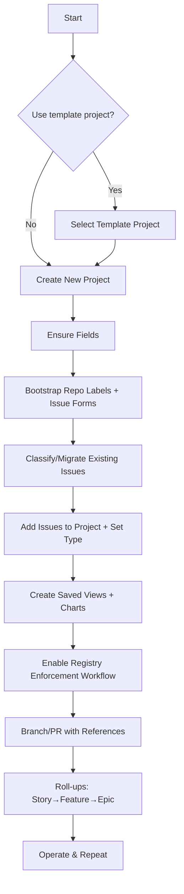
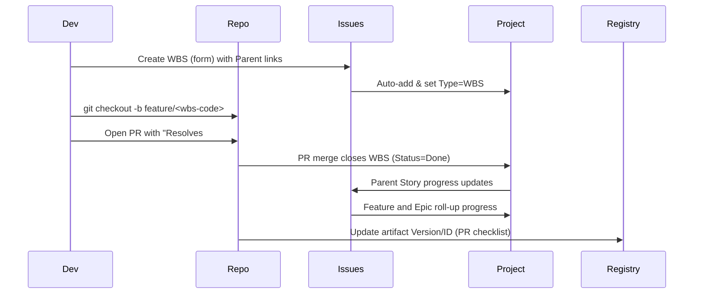

# Repeatable Project Setup Workflow (Template + Prompt)

This guide shows a prompt-driven, repeatable workflow to spin up a GitHub Project and hierarchy (Epic → Feature → Story → PBS → WBS → Registry), either from scratch or by cloning a template project.

## Provisioning Flow (Mermaid)



## Correlating Branches, PRs, Issues, Registry



## Runbook (Prompt-Driven)

All scripts are idempotent and live in `scripts/`.

1) Create or reuse a Project and configure fields
```sh
scripts/setup-gh-project.sh
```
- Prompts for Owner and Project name
- Ensures fields: Type, Status, Priority, Estimate, Registry ID, PBS ID, WBS Code
- Adds useful saved views

2) Bootstrap labels and migrate issues into the hierarchy
```sh
scripts/migrate-issues-into-hierarchy.sh
```
- Prompts for repo, project owner/name
- Ensures labels `type:*`
- Lets you supply search queries (e.g., `in:title "[Epic]"`) to bulk label
- Adds each issue to the Project and sets the Type field

3) Create a new Project from a frozen template
```sh
scripts/new-project-from-template.sh
```
- Prompts for Owner, Template project name, New project name, and target repo
- Clones fields from the template project and bootstraps labels in the repo

4) Enable PR hygiene and registry enforcement
- PR template at `.github/pull_request_template.md`
- Workflow at `.github/workflows/enforce-registry-link.yml` blocks PRs that close WBS/PBS without a `Registry Artifact:` reference

5) Day-to-day
- Create Features/Stories with tasklists to auto-link children
- Create WBS tasks for executable work; reference WBS in PRs with `Resolves #<num>`
- Fill `Registry ID` for any work that produces or modifies a trackable artifact

## Notes
- For schedule views, attach Milestones to PBS/Stories.
- Prefer one parent per issue to keep “Tracked by” progress accurate.
- Saved views: Epic Progress, PBS Delivery, Registry Coverage.
