# GitHub Projects: Idea-to-PR Traceability Workflow

**Version:** 1.0.0  
**Date:** 2026-01-22  
**Purpose:** Complete workflow for tracking features from initial idea through to merged PR and registry entry  
**Status:** Active

---

## Overview

This workflow ensures complete traceability from initial idea through to shipped, registered artifacts using GitHub Projects with the Epic → Feature → Story → PBS → WBS → Registry hierarchy.

**Philosophy:** Every line of code traces back to a customer problem. Every artifact is registered and versioned.

---

## Complete Hierarchy

```mermaid
graph LR
    IDEA[💡 Idea<br/>GitHub Discussion] --> EPIC[🎯 Epic<br/>Issue]
    EPIC --> FEATURE[⚙️ Feature<br/>Issue]
    FEATURE --> STORY[📖 Story<br/>Issue]
    STORY --> PBS[📦 PBS<br/>Deliverable]
    PBS --> WBS[⚒️ WBS<br/>Work Package]
    WBS --> BRANCH[🌿 Feature Branch]
    BRANCH --> PR[🔀 Pull Request]
    PR --> MERGE[✅ Merged]
    MERGE --> REG[📋 Registry Entry]
    REG --> DONE[✨ Done]
    
    style IDEA fill:#E0E7FF
    style EPIC fill:#DBEAFE
    style FEATURE fill:#FEF3C7
    style STORY fill:#D1FAE5
    style PBS fill:#FCE7F3
    style WBS fill:#E9D5FF
    style PR fill:#FED7AA
    style REG fill:#CCFBF1
```



---

## Phase 1: Ideation → Epic

### Purpose
Capture and validate ideas before committing to implementation.

### Tools
- GitHub Discussions (Ideas category)
- GitHub Issues (Epic template)

### Process

#### Step 1.1: Create Idea Discussion

Navigate to repository Discussions:
```bash
# Open discussions in browser
gh repo view --web --branch main
# Then click "Discussions" tab
```

Create new discussion with template:

```markdown
Category: Ideas

Title: [Idea] Make brands discoverable by AI platforms

## Problem/Opportunity
B2B SaaS marketing leaders have no visibility into whether AI platforms 
(ChatGPT, Claude, Perplexity) mention their brand when prospects ask 
relevant questions.

## Hypothesis
If we build an AI Visibility Audit tool, then marketing leaders will 
discover citation gaps and prioritize content optimization, leading to 
+25% citation rate improvement.

## Success Metrics
- Citation rate improvement: +25% within 3 months
- Time to identify gaps: <5 minutes (vs 2 hours manual)
- Content production velocity: 3x faster

## Dependencies
- VSOM alignment: Make B2B SaaS brands discoverable by AI
- OKR: Achieve 40% PMF score by Month 3
- Ontologies: Competitive Analysis, BAIV Core

## Assumptions to Validate
- [ ] Customers care about AI platform visibility
- [ ] Citation rate is measurable
- [ ] Content optimization improves citations
```

#### Step 1.2: Team Review & Vote

- Team members review discussion
- Upvote with 👍 reaction
- Comment with questions/concerns
- Product owner makes go/no-go decision

#### Step 1.3: Convert to Epic Issue

When approved:

1. Click "Create issue from discussion" button
2. Use Epic template or manually format:

```markdown
Title: [Epic] Make Brands Discoverable by AI Platforms

## Origin
Discussion: #12 (link to discussion URL)

## Problem / Pain
Marketing leaders have no visibility into AI platform mentions, 
losing market share to competitors who ARE cited.

## Outcome Metrics
- +25% citation rate improvement within 3 months
- <5 min to identify gaps (vs 2 hours manual)
- 3x faster content production

## VSOM Alignment
Strategic Objective: Make B2B SaaS brands discoverable by AI
OKR: 40% PMF score, +25% citation rate

## Features (tasklist)
- [ ] AI Visibility Audit
- [ ] Gap Analysis Engine
- [ ] Content Generator
- [ ] Citation Tracker

## Success Criteria
- All features shipped and registered
- Customer feedback ≥4.0/5.0
- Measurable citation improvement
```

3. Apply labels: `type:epic`, `domain:baiv`
4. Add to GitHub Project
5. Set project fields:
   - Type: Epic
   - Priority: P0 or P1
   - Status: Backlog

**Traceability:** Epic body contains `Origin: Discussion #12`

---

## Phase 2: Epic → Features → Stories

### Purpose
Break down Epic into shippable capabilities and user requirements.

### Tools
- GitHub Issues (Feature/Story templates)
- GitHub tasklists
- Claude/Warp (optional automation)

### Process

#### Step 2.1: Generate Features

**Option A: Manual**

Create Feature issue:

```markdown
Title: [Feature] AI Visibility Audit

## Parent Epic
#45

## Scope
Automated tool that measures how frequently a brand is cited by AI 
platforms (ChatGPT, Claude, Perplexity) across 50+ test queries 
relevant to their domain.

## User Value
Marketing leaders can quantify AI visibility, benchmark against 
competitors, and identify improvement opportunities.

## Acceptance Criteria
- Supports 3+ AI platforms
- Runs 50+ domain-relevant queries
- Generates citation rate report
- Compares to 3+ competitors

## Stories (tasklist)
- [ ] As a marketer, I want to configure test queries
- [ ] As a marketer, I want to run audits across platforms
- [ ] As a marketer, I want to see citation rate vs competitors

## Estimate
13 points (Large)

## Dependencies
- Ontology: Competitive Analysis
- API: LLM provider APIs (Claude, OpenAI)
```

**Option B: Claude-Assisted**

In Warp terminal:

```bash
warp> "Generate 3-5 Feature issues for Epic #45 (BAIV Discovery) with:
- Feature title
- Scope description
- User value
- Acceptance criteria
- Story breakdown (tasklist)
- Estimate (S/M/L)"

# Claude will:
# 1. Read Epic #45
# 2. Generate feature proposals
# 3. Create issues via gh CLI
# 4. Link to Epic via tasklist
# 5. Add to project
```

#### Step 2.2: Link Features to Epic

Edit Epic #45 body to add tasklist:

```markdown
## Features (tasklist)
- [ ] #46 AI Visibility Audit
- [ ] #47 Gap Analysis Engine
- [ ] #48 Content Generator
- [ ] #49 Citation Tracker
```

GitHub automatically creates "Tracked by" relationship and shows progress badge.

#### Step 2.3: Add Features to Project

For each Feature:

```bash
# Add to project
gh project item-add 1 --owner TeamBAIV --url https://github.com/TeamBAIV/PF-Core-BAIV/issues/46

# Or use GitHub UI:
# 1. Open issue #46
# 2. Right sidebar → Projects → Select your project
# 3. Set fields: Type=Feature, Priority=P1, Status=Ready
```

#### Step 2.4: Break Features into Stories

Create Story issues:

```markdown
Title: [Story] Configure test queries for audit

## Parent Feature
#46

## Narrative
As a marketing leader, I want to configure custom test queries 
relevant to my domain, so that the audit measures visibility for 
queries my prospects actually ask.

## Acceptance Criteria
GIVEN I am authenticated
WHEN I navigate to Audit Configuration
THEN I can add/edit/delete test queries
AND each query includes: question, category, priority
AND I can see query coverage by category

## PBS ID
PBS-2.1

## WBS Code
2.1.1

## Priority
P1

## Estimate
5 points
```

Link Stories in Feature tasklist:

```markdown
## Stories (tasklist)
- [ ] #52 Configure test queries for audit
- [ ] #53 Run audit across AI platforms
- [ ] #54 View citation rate report
```

**Traceability:** Stories reference Feature # in body; Feature tasklist creates GitHub tracking

---

## Phase 3: Stories → PBS/WBS

### Purpose
Define deliverable components (PBS) and executable work packages (WBS).

### Tools
- GitHub Issues (PBS/WBS templates)
- GitHub Project custom fields

### Process

#### Step 3.1: Create PBS (Product Breakdown Structure)

PBS = Deliverable component (API, UI module, schema, etc.)

```markdown
Title: [PBS] Query Configuration API

## Parent Story
#52

## PBS ID
PBS-2.1

## Deliverables
- RESTful API endpoint: `/api/queries`
- OpenAPI specification
- Database schema for queries table
- Integration tests
- API documentation

## WBS Tasks (tasklist)
- [ ] Design API schema
- [ ] Implement CRUD endpoints
- [ ] Create database migration
- [ ] Write integration tests
- [ ] Update OpenAPI spec

## Registry Dependencies
- Database schema: baiv:schema:queries:v1.0.0
- API endpoint: baiv:api:endpoint:queries:v1.0.0
```

Add to project:
- Type: PBS
- PBS ID: PBS-2.1
- Status: Ready

#### Step 3.2: Create WBS (Work Breakdown Structure)

WBS = Executable work package (typically closed by 1 PR)

```markdown
Title: [WBS] Implement query CRUD endpoints

## Parent PBS
#58

## WBS Code
2.1.2

## Registry ID
baiv:api:endpoint:queries:v1.0.0

## Work Description
Implement Create, Read, Update, Delete endpoints for test queries:
- POST /api/queries (create)
- GET /api/queries (list)
- GET /api/queries/:id (get)
- PUT /api/queries/:id (update)
- DELETE /api/queries/:id (delete)

## Definition of Done
- [ ] All 5 endpoints implemented
- [ ] Request/response validation
- [ ] Error handling (4xx, 5xx)
- [ ] Unit tests ≥90% coverage
- [ ] Integration tests for happy/error paths
- [ ] OpenAPI spec updated
- [ ] Artifact registered in UniRegistry
- [ ] PR merged to main

## Estimate
8 hours

## Dependencies
- Database migration must be complete first (WBS-2.1.1)
```

Link WBS in PBS tasklist:

```markdown
## WBS Tasks (tasklist)
- [ ] #60 Design API schema
- [ ] #61 Implement query CRUD endpoints
- [ ] #62 Create database migration
- [ ] #63 Write integration tests
```

Add to project:
- Type: WBS
- WBS Code: 2.1.2
- Registry ID: baiv:api:endpoint:queries:v1.0.0
- Status: Ready
- Estimate: 8

**Traceability:** WBS references PBS via tasklist; PBS ID and WBS Code in project fields

---

## Phase 4: WBS → Branch → PR

### Purpose
Implement work and create reviewable pull request with full traceability.

### Tools
- Git feature branch workflow
- GitHub Pull Requests
- PR template

### Process

#### Step 4.1: Create Feature Branch

```bash
# Update main
git checkout main
git pull origin main

# Create branch from WBS info
git checkout -b feature/wbs-61-query-crud-endpoints
```

Branch naming convention: `feature/wbs-{number}-{short-description}`

#### Step 4.2: Implement and Commit

```bash
# Make changes
# Write tests
# Verify locally

# Commit with reference
git add .
git commit -m "Implement query CRUD endpoints

- Add POST /api/queries (create)
- Add GET /api/queries (list)
- Add GET /api/queries/:id (get)
- Add PUT /api/queries/:id (update)
- Add DELETE /api/queries/:id (delete)
- Add request validation
- Add error handling
- Add integration tests

Relates to: #61 (WBS-2.1.2)
Co-Authored-By: Warp <agent@warp.dev>"
```

#### Step 4.3: Push Branch

```bash
# First push
git push -u origin feature/wbs-61-query-crud-endpoints
```

#### Step 4.4: Create Pull Request

Use PR template (`.github/pull_request_template.md`):

```markdown
## What
Implements CRUD endpoints for test query configuration

## Why
Part of AI Visibility Audit feature to enable custom query management

## Traceability
Resolves: #61 (WBS-2.1.2)
Part of: #58 (PBS-2.1)
Story: #52
Feature: #46
Epic: #45

## Registry Artifact
ID: baiv:api:endpoint:queries:v1.0.0
Type: API Endpoint
Status: [ ] Not Registered | [x] Pending registration

## Changes
- Added 5 RESTful endpoints for query CRUD
- Added request/response validation schemas
- Added error handling middleware
- Created integration test suite

## Testing
- Unit tests: 94% coverage
- Integration tests: All passing
- Manual testing: Verified in local dev environment

## Definition of Done
- [x] Code complete and reviewed
- [x] Tests written (≥90% coverage for new code)
- [x] CI quality gates pass (G1-G5)
- [x] Documentation updated (OpenAPI spec)
- [ ] Registry entry created (post-merge)
- [ ] WBS issue updated with registry status

## Screenshots/Logs
```
curl -X POST http://localhost:3000/api/queries \
  -H "Content-Type: application/json" \
  -d '{"question": "What is BAIV?", "category": "product"}'
  
Response: 201 Created
{"id": "q1", "question": "What is BAIV?", "category": "product"}
```
```

Create PR via CLI:

```bash
gh pr create --title "[WBS-2.1.2] Implement query CRUD endpoints" \
  --body-file .github/pull_request_template.md \
  --assignee @me
```

Or create via GitHub UI.

#### Step 4.5: Code Review

- Request reviews from team members
- Address feedback with additional commits
- Push updates (PR auto-updates)

```bash
# Address review feedback
git add .
git commit -m "Address review: Add pagination to GET /api/queries"
git push
```

**Traceability:** PR body contains full chain: WBS → PBS → Story → Feature → Epic

---

## Phase 5: Merge → Registry → Done

### Purpose
Merge code, register artifact, close issues, update project.

### Tools
- GitHub merge (squash and merge)
- UniRegistry
- GitHub Actions (automation)

### Process

#### Step 5.1: Pre-Merge Validation

Verify:
- ✅ All CI checks pass
- ✅ Code review approved
- ✅ PR references WBS issue
- ✅ Registry ID specified in PR
- ✅ Tests pass with ≥90% coverage

GitHub Actions workflow (`.github/workflows/enforce-registry-link.yml`) blocks merge if missing WBS or Registry ID.

#### Step 5.2: Merge PR

```bash
# Via CLI
gh pr merge 75 --squash --delete-branch

# Or via GitHub UI:
# 1. Click "Squash and merge"
# 2. Confirm merge
# 3. Delete branch
```

Merge commit message:

```
Implement query CRUD endpoints (#75)

Implements 5 RESTful endpoints for test query CRUD operations:
POST, GET, PUT, DELETE with validation and error handling.

Resolves: #61 (WBS-2.1.2)
Part of: #58 (PBS-2.1), #52 (Story), #46 (Feature), #45 (Epic)
Registry: baiv:api:endpoint:queries:v1.0.0

Co-Authored-By: Warp <agent@warp.dev>
```

Auto-closes WBS issue #61 via "Resolves: #61"

#### Step 5.3: Register Artifact in UniRegistry

**Option A: Manual Registration**

```bash
# Navigate to registry
cd architecture/unified-register

# Add entry to registry JSON
# (Follow registry v3.0 format)

git add .
git commit -m "Register Query CRUD API endpoint

Registry ID: baiv:api:endpoint:queries:v1.0.0
Type: API Endpoint
From PR: #75
WBS: #61

Co-Authored-By: Warp <agent@warp.dev>"

git push origin main
```

**Option B: Automated (Future)**

GitHub Action (`.github/workflows/post-merge-registry.yml`) automatically:
1. Extracts Registry ID from merged PR
2. Calls OAA Agent API to register artifact
3. Comments back to PR with registry URL
4. Updates WBS issue with registry status

#### Step 5.4: Update WBS Issue

Comment on closed WBS issue:

```bash
gh issue comment 61 --body "✅ Registered in UniRegistry

Registry ID: baiv:api:endpoint:queries:v1.0.0
Quality Gates: G1-G5 passed (100%)
Merged PR: #75
Documentation: Updated OpenAPI spec"
```

#### Step 5.5: Update Project Status

Manual (via GitHub UI):
1. Navigate to project
2. Find WBS #61 (should auto-move to Done)
3. Set Registry Status: Registered
4. Set PR Number: #75

Automated (future):
- GitHub Action updates project fields on merge

#### Step 5.6: Verify Cascade Updates

GitHub automatically updates:
- ✅ WBS #61: Closed
- ✅ PBS #58: Tasklist shows 1/5 complete (20%)
- ✅ Story #52: Shows progress if PBS tasklist complete
- ✅ Feature #46: Shows progress when Stories complete
- ✅ Epic #45: Shows overall progress badge

**Traceability:** Registry entry references WBS/PR; WBS references Registry ID; full chain intact

---

## Project Fields Reference

### Standard Fields

| Field | Type | Options | Purpose |
|-------|------|---------|---------|
| Type | Single-select | Epic, Feature, Story, PBS, WBS, Registry | Hierarchy level |
| Status | Single-select | Backlog, Ready, In Progress, In Review, Done | Workflow state |
| Priority | Single-select | P0, P1, P2, P3 | Urgency ranking |
| Estimate | Number | - | Story points or hours |
| Registry ID | Text | - | Semantic artifact ID |
| PBS ID | Text | - | Product breakdown reference |
| WBS Code | Text | - | Work breakdown reference |

### Extended Fields for Traceability

| Field | Type | Purpose | Example |
|-------|------|---------|---------|
| Origin Discussion | Text | Link to idea discussion | `#12` or URL |
| Parent Issue | Text | Quick reference to parent | `#45` |
| PR Number | Text | Link to implementing PR | `#75` |
| Registry Status | Single-select | Registration state | Not Registered, Pending, Registered |
| Branch Name | Text | Feature branch tracking | `feature/wbs-61-query-crud` |

### Setting Up Extended Fields

```bash
# Get project number
gh project list --owner TeamBAIV

# Add new fields
gh project field-create 1 --owner TeamBAIV \
  --name "Origin Discussion" \
  --data-type TEXT

gh project field-create 1 --owner TeamBAIV \
  --name "PR Number" \
  --data-type TEXT

gh project field-create 1 --owner TeamBAIV \
  --name "Registry Status" \
  --data-type SINGLE_SELECT \
  --single-select-options "Not Registered,Pending,Registered"

gh project field-create 1 --owner TeamBAIV \
  --name "Branch Name" \
  --data-type TEXT
```

---

## Project Views for Traceability

### View 1: Feature Flow (Kanban Board)

**Purpose:** See all work in progress with full context

**Configuration:**
- Layout: Board
- Group by: Status
- Filter: `Type IN (Feature, Story, PBS, WBS)`
- Columns: Backlog → Ready → In Progress → In Review → Done
- Show fields: Type, Parent Issue, PR Number, Registry Status, Priority

**How to use:**
- Drag items between columns as status changes
- Quick view of what's in flight
- Identify bottlenecks (too many In Review)

### View 2: Registry Coverage (Table)

**Purpose:** Ensure all shipped work is registered

**Configuration:**
- Layout: Table
- Filter: `Status = Done OR Status = In Review`
- Show fields: Title, Type, Registry ID, Registry Status, PR Number, WBS Code
- Sort by: Updated (descending)
- Highlight: Missing Registry ID or Registry Status ≠ Registered

**How to use:**
- Review items with blank Registry ID
- Register missing artifacts
- Update Registry Status field
- Weekly audit to maintain >95% coverage

### View 3: Epic Roadmap (Roadmap)

**Purpose:** High-level progress tracking

**Configuration:**
- Layout: Roadmap (if available) or Table
- Filter: `Type = Epic OR Type = Feature`
- Group by: Milestone or Quarter
- Show: Progress bars, Status, Priority, Outcome Metrics

**How to use:**
- Stakeholder communication
- Quarterly planning
- Progress reporting

### View 4: PR Pipeline (Board)

**Purpose:** Track PRs waiting for registry

**Configuration:**
- Layout: Board
- Group by: Registry Status
- Filter: `Type = WBS AND (Status IN (In Review, Done)) AND PR Number != null`
- Columns: Not Registered → Pending → Registered
- Show: PR Number, WBS Code, Registry ID, Merged Date

**How to use:**
- Identify PRs merged but not registered
- Daily standup: "What needs registration?"
- Maintain registry hygiene

### View 5: Orphan Detector (Table)

**Purpose:** Find items without proper parent linkage

**Configuration:**
- Layout: Table
- Filter: `Parent Issue = null OR Parent Issue = ""`
- Show: Type, Title, Created, Assignee
- Sort by: Type (to group Epics, Features, etc.)

**How to use:**
- Weekly audit
- Find and fix broken traceability
- Ensure every item (except Epics) has parent

---

## Automation Workflows

### GitHub Actions

#### 1. Auto-Label from Title Prefix

`.github/workflows/auto-label.yml`:

```yaml
name: Auto-label Issues
on:
  issues:
    types: [opened, edited]

jobs:
  label:
    runs-on: ubuntu-latest
    steps:
      - name: Label Epic
        if: startsWith(github.event.issue.title, '[Epic]')
        run: |
          gh issue edit ${{ github.event.issue.number }} \
            --add-label "type:epic" \
            --repo ${{ github.repository }}
        env:
          GH_TOKEN: ${{ secrets.GITHUB_TOKEN }}
      
      - name: Label Feature
        if: startsWith(github.event.issue.title, '[Feature]')
        run: |
          gh issue edit ${{ github.event.issue.number }} \
            --add-label "type:feature" \
            --repo ${{ github.repository }}
        env:
          GH_TOKEN: ${{ secrets.GITHUB_TOKEN }}
      
      - name: Label Story
        if: startsWith(github.event.issue.title, '[Story]')
        run: |
          gh issue edit ${{ github.event.issue.number }} \
            --add-label "type:story" \
            --repo ${{ github.repository }}
        env:
          GH_TOKEN: ${{ secrets.GITHUB_TOKEN }}
      
      - name: Label PBS
        if: startsWith(github.event.issue.title, '[PBS]')
        run: |
          gh issue edit ${{ github.event.issue.number }} \
            --add-label "type:pbs" \
            --repo ${{ github.repository }}
        env:
          GH_TOKEN: ${{ secrets.GITHUB_TOKEN }}
      
      - name: Label WBS
        if: startsWith(github.event.issue.title, '[WBS]')
        run: |
          gh issue edit ${{ github.event.issue.number }} \
            --add-label "type:wbs" \
            --repo ${{ github.repository }}
        env:
          GH_TOKEN: ${{ secrets.GITHUB_TOKEN }}
```

#### 2. Enforce PR → WBS Linkage

`.github/workflows/enforce-wbs-link.yml` (exists, verify):

```yaml
name: Enforce WBS/PBS Link in PRs
on:
  pull_request:
    types: [opened, edited, synchronize]

jobs:
  check-linkage:
    runs-on: ubuntu-latest
    steps:
      - name: Check for issue reference
        run: |
          PR_BODY="${{ github.event.pull_request.body }}"
          
          if ! echo "$PR_BODY" | grep -qE "Resolves: #[0-9]+"; then
            echo "❌ PR must reference a WBS or PBS issue with 'Resolves: #<number>'"
            exit 1
          fi
          
          echo "✅ PR references an issue"
      
      - name: Check for Registry ID
        run: |
          PR_BODY="${{ github.event.pull_request.body }}"
          
          if ! echo "$PR_BODY" | grep -qE "Registry.*ID:|Registry ID:"; then
            echo "⚠️ Warning: No Registry ID found in PR body"
            echo "Please add Registry ID in format: 'Registry ID: namespace:type:name:version'"
          fi
```

#### 3. Registry Reminder on Merge

`.github/workflows/registry-reminder.yml`:

```yaml
name: Registry Reminder
on:
  pull_request:
    types: [closed]

jobs:
  remind:
    if: github.event.pull_request.merged == true
    runs-on: ubuntu-latest
    steps:
      - name: Extract WBS issue number
        id: extract
        run: |
          PR_BODY="${{ github.event.pull_request.body }}"
          ISSUE_NUM=$(echo "$PR_BODY" | grep -oP "Resolves: #\K[0-9]+")
          echo "issue_num=$ISSUE_NUM" >> $GITHUB_OUTPUT
      
      - name: Comment on WBS issue
        if: steps.extract.outputs.issue_num != ''
        run: |
          gh issue comment ${{ steps.extract.outputs.issue_num }} \
            --repo ${{ github.repository }} \
            --body "✅ PR #${{ github.event.pull_request.number }} merged

          **Next steps:**
          - [ ] Register artifact in UniRegistry
          - [ ] Update this issue with Registry ID
          - [ ] Verify quality gates (G1-G5)
          - [ ] Update project Registry Status to 'Registered'"
        env:
          GH_TOKEN: ${{ secrets.GITHUB_TOKEN }}
```

#### 4. Auto-Add Issues to Project

`.github/workflows/auto-add-to-project.yml`:

```yaml
name: Auto-add to Project
on:
  issues:
    types: [opened, labeled]

jobs:
  add-to-project:
    runs-on: ubuntu-latest
    steps:
      - name: Add to project
        if: contains(github.event.issue.labels.*.name, 'type:epic') || 
            contains(github.event.issue.labels.*.name, 'type:feature') ||
            contains(github.event.issue.labels.*.name, 'type:story') ||
            contains(github.event.issue.labels.*.name, 'type:pbs') ||
            contains(github.event.issue.labels.*.name, 'type:wbs')
        run: |
          gh project item-add 1 --owner TeamBAIV \
            --url ${{ github.event.issue.html_url }}
        env:
          GH_TOKEN: ${{ secrets.GITHUB_TOKEN }}
```

### Claude/Warp Commands

#### Command 1: Create Full Hierarchy from Epic

```bash
warp> "Generate Features and Stories for Epic #45"
```

Claude workflow:
1. Reads Epic #45 content
2. Analyzes problem statement and success criteria
3. Generates 3-5 Feature proposals
4. Generates 2-4 Story proposals per Feature
5. Creates all issues via `gh issue create`
6. Links via tasklists (edits Epic/Feature bodies)
7. Adds all to project
8. Reports back with issue numbers

#### Command 2: Check Traceability Chain

```bash
warp> "Show full traceability for WBS #61"
```

Claude outputs:

```
WBS #61: Implement query CRUD endpoints
├─ PBS #58: Query Configuration API (PBS-2.1)
├─ Story #52: Configure test queries for audit
├─ Feature #46: AI Visibility Audit
└─ Epic #45: Make Brands Discoverable by AI Platforms

Branch: feature/wbs-61-query-crud
PR: #75 (merged 2026-01-22)
Registry: baiv:api:endpoint:queries:v1.0.0 ✅ Registered
Status: Done
```

#### Command 3: Find Orphaned Work

```bash
warp> "Find issues without parent references"
```

Claude queries project and reports:

```
Found 3 orphaned issues:

Story #87: "Add user authentication"
  → Missing Feature parent
  → Recommendation: Link to Feature #85 or create new Feature

WBS #92: "Update database schema"
  → Missing PBS parent
  → Recommendation: Create PBS or link to existing PBS-3.2

PBS #94: "Notification Service"
  → Missing Story parent
  → Recommendation: Link to Story #90
```

#### Command 4: Pre-PR Validation

```bash
warp> "Validate my branch is ready for PR"
```

Claude checks:
- ✅ Branch name follows convention
- ✅ Commits reference WBS issue
- ✅ Tests exist and pass
- ✅ Registry ID ready for PR body
- ⚠️ Warning: WBS issue #61 not assigned to you
- ✅ Ready to create PR

---

## Quick Reference Commands

### Issue Management

```bash
# Create Epic
gh issue create --title "[Epic] Title" --label "type:epic" --body-file epic-template.md

# Create Feature linked to Epic #45
gh issue create --title "[Feature] Title" --label "type:feature" --body "Parent Epic: #45"

# Add issue to project
gh project item-add 1 --owner TeamBAIV --url https://github.com/TeamBAIV/PF-Core-BAIV/issues/46

# List all WBS issues
gh issue list --label "type:wbs" --state open

# Close WBS with comment
gh issue close 61 --comment "✅ Merged PR #75, registered as baiv:api:endpoint:queries:v1.0.0"
```

### Project Management

```bash
# List projects
gh project list --owner TeamBAIV

# List project fields
gh project field-list 1 --owner TeamBAIV

# View project items
gh project item-list 1 --owner TeamBAIV --format json
```

### Git Workflow

```bash
# Create branch from WBS
git checkout main && git pull origin main
git checkout -b feature/wbs-61-query-crud

# Commit with reference
git commit -m "Implement X

Relates to: #61 (WBS-2.1.2)
Co-Authored-By: Warp <agent@warp.dev>"

# Create PR
gh pr create --title "[WBS-2.1.2] Implement X" --assignee @me

# Merge PR (squash)
gh pr merge 75 --squash --delete-branch
```

### Registry

```bash
# Register artifact (manual)
cd architecture/unified-register
# Edit registry JSON
git commit -m "Register artifact

Registry ID: baiv:api:endpoint:queries:v1.0.0
From PR: #75, WBS: #61"
```

---

## Success Metrics

Track these metrics to measure traceability health:

| Metric | Target | Measurement | Frequency |
|--------|--------|-------------|-----------|
| **Orphan Rate** | <5% | Issues without parent reference / Total issues | Weekly |
| **Registry Coverage** | >95% | Merged WBS with Registry ID / Total merged WBS | Weekly |
| **PR Linkage** | 100% | PRs with valid WBS/PBS reference / Total PRs | Per PR |
| **Epic Completion Accuracy** | 100% | Epics with accurate progress badges | Weekly |
| **Traceability Depth** | 100% | WBS with full chain to Epic / Total WBS | Monthly |
| **Time to Register** | <24 hrs | Hours between PR merge and registry entry | Per artifact |

### Measuring Orphan Rate

```bash
# Count issues without parent
TOTAL=$(gh issue list --json number --jq 'length')
ORPHANS=$(gh issue list --search "NOT (\"Parent Epic\" OR \"Parent Feature\" OR \"Parent Story\" OR \"Parent PBS\")" --json number --jq 'length')
ORPHAN_RATE=$(echo "scale=2; $ORPHANS / $TOTAL * 100" | bc)
echo "Orphan Rate: ${ORPHAN_RATE}%"
```

### Measuring Registry Coverage

```bash
# Get merged WBS issues
MERGED_WBS=$(gh issue list --label "type:wbs" --state closed --search "is:merged" --json number --jq 'length')

# Get WBS with Registry ID (manual count from project view)
# Target: >95% of merged WBS have Registry ID
```

---

## Troubleshooting

### Problem: Epic progress not updating

**Cause:** Tasklist in Epic body not using proper format

**Solution:**
1. Edit Epic issue body
2. Ensure tasklist uses: `- [ ] #46 Feature title`
3. Save and refresh - GitHub auto-calculates progress

### Problem: PR can't merge due to missing WBS reference

**Cause:** Enforcement workflow blocks PRs without "Resolves: #<number>"

**Solution:**
1. Edit PR description
2. Add line: `Resolves: #61` (WBS issue number)
3. Save - checks re-run automatically

### Problem: Registry ID not showing in project view

**Cause:** Field not added to project or view

**Solution:**
```bash
# Verify field exists
gh project field-list 1 --owner TeamBAIV | grep "Registry ID"

# If missing, create it
gh project field-create 1 --owner TeamBAIV \
  --name "Registry ID" \
  --data-type TEXT

# Add column to view in GitHub UI
```

### Problem: Can't find parent issue number

**Cause:** Tasklist not created or issue not linked

**Solution:**
1. Navigate to parent issue (Feature, PBS, etc.)
2. Edit body to add tasklist: `- [ ] #child-number`
3. Save - GitHub creates "Tracked by" link
4. Verify in child issue sidebar

### Problem: WBS closed but PBS still shows 0% progress

**Cause:** WBS not added to PBS tasklist

**Solution:**
1. Edit PBS issue #58
2. Add to WBS Tasks: `- [x] #61 Implement query CRUD endpoints`
3. Check the box (since WBS is closed)
4. Save - progress updates

---

## Best Practices

### Naming Conventions

- **Discussions:** `[Idea] Customer-facing outcome`
- **Epics:** `[Epic] Customer-facing outcome`
- **Features:** `[Feature] Capability name`
- **Stories:** `[Story] User action`
- **PBS:** `[PBS] Deliverable component name`
- **WBS:** `[WBS] Work package action`
- **Branches:** `feature/wbs-{number}-{description}`
- **PRs:** `[WBS-X.Y.Z] Action description`

### When to Create Each Type

| Type | When to Create | Who Creates |
|------|----------------|-------------|
| **Discussion** | Capture any idea, no commitment | Anyone |
| **Epic** | Validated customer problem worth solving | Product Owner |
| **Feature** | Shippable capability that solves part of Epic | Product Owner |
| **Story** | Specific user requirement with acceptance criteria | Product Owner / Team |
| **PBS** | Deliverable component needed for Story | Tech Lead |
| **WBS** | Executable work package (1 PR) | Developer |

### Estimation Guidelines

- **Epic:** Sum of Feature estimates (auto-calculate)
- **Feature:** Sum of Story points (auto-calculate)
- **Story:** 1-13 points (Fibonacci scale)
- **PBS:** Not typically estimated (sum of WBS)
- **WBS:** 1-40 hours (granular)

### Registry Integration

**Every WBS must reference a Registry artifact:**
- API endpoints
- Ontology definitions
- Agent specifications
- Database schemas
- UI components
- System prompts
- Design tokens

**Use semantic versioning for Registry IDs:**
```
{namespace}:{type}:{name}:{version}

Examples:
baiv:api:endpoint:queries:v1.0.0
pf-core:ontology:vsom:v2.1.0
baiv:agent:discovery:v3.0.0
```

---

## Implementation Checklist

### Week 1: Foundation
- [ ] Add extended project fields (Origin Discussion, PR Number, Registry Status, Branch Name)
- [ ] Create new project views (Feature Flow, Registry Coverage, PR Pipeline, Orphan Detector)
- [ ] Update PR template with traceability section
- [ ] Update issue templates with parent reference fields
- [ ] Document field usage in this guide

### Week 2: Automation
- [ ] Implement auto-label workflow
- [ ] Verify PR→WBS enforcement workflow
- [ ] Implement registry reminder workflow
- [ ] Implement auto-add-to-project workflow
- [ ] Test all workflows with sample issues

### Week 3: Process Adoption
- [ ] Create team training session
- [ ] Migrate 2-3 existing Epics to new format
- [ ] Run pilot with new Epic using full workflow
- [ ] Collect feedback from team
- [ ] Refine based on feedback

### Week 4: Optimization
- [ ] Build Claude commands for hierarchy generation
- [ ] Build traceability validation script
- [ ] Create metrics dashboard
- [ ] Document lessons learned
- [ ] Plan Phase 2 enhancements

---

## Related Documentation

- [GitHub Projects Operating Guide](./github-projects-operating-guide.md) - Detailed Projects v2 usage
- [Git Feature Branch Workflow](./git-feature-branch-workflow.md) - Branch and PR workflow
- [GitHub Branch Protection Setup](./github-branch-protection-setup.md) - Repository protection
- [GitHub + Claude Product Workflow](./github-claude-product-workflow.md) - Claude integration
- [Unified Registry Documentation](../architecture/unified-register/README.md) - Registry v3.0 format
- [WARP.md](../WARP.md) - Complete repository guide

---

## Changelog

**v1.0.0** (2026-01-22)
- Initial release
- Documented complete Idea → PR → Registry workflow
- Added automation workflows
- Added project fields and views
- Added success metrics and troubleshooting

---

**Document Version:** 1.0.0  
**Last Updated:** 2026-01-22  
**Author:** TeamBAIV  
**Status:** Active

Co-Authored-By: Warp <agent@warp.dev>
