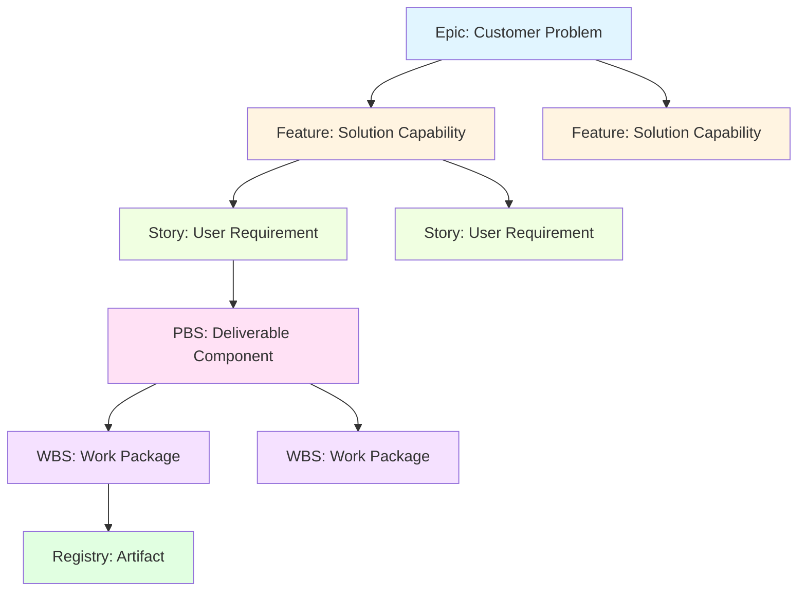
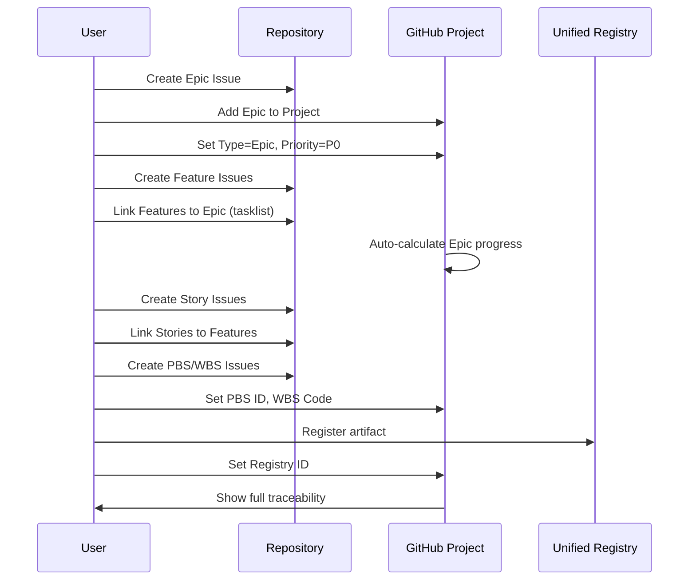

# GitHub Projects Operating Guide

## Overview

This guide provides step-by-step instructions for creating, configuring, and managing GitHub Projects v2 using the Epic → Feature → Story → PBS → WBS → Registry hierarchy.

## Table of Contents

1. [Quick Reference](#quick-reference)
2. [Creating a New Project](#creating-a-new-project)
3. [Updating an Existing Project](#updating-an-existing-project)
4. [Configuring Issues in the Hierarchy](#configuring-issues-in-the-hierarchy)
5. [Migrating Existing Issues](#migrating-existing-issues)
6. [Project Views and Reporting](#project-views-and-reporting)
7. [Workflow Automation](#workflow-automation)
8. [Troubleshooting](#troubleshooting)

---

## Quick Reference

### Project Hierarchy



### Available Scripts

| Script | Purpose | When to Use |
|--------|---------|-------------|
| `scripts/setup-gh-project.sh` | Create new project with template | Starting from scratch |
| `scripts/update-existing-project.sh` | Add template to existing project | Updating legacy projects |
| `scripts/new-project-from-template.sh` | Clone project configuration | Creating similar projects |

### Standard Fields

| Field | Type | Options | Purpose |
|-------|------|---------|---------|
| Type | Single Select | Epic, Feature, Story, PBS, WBS, Registry | Hierarchy level |
| Status | Single Select | Backlog, Ready, In Progress, In Review, Done | Workflow state |
| Priority | Single Select | P0, P1, P2, P3 | Urgency ranking |
| Estimate | Number | - | Effort estimation |
| Registry ID | Text | - | Links to unified registry |
| PBS ID | Text | - | Product breakdown reference |
| WBS Code | Text | - | Work breakdown reference |

---

## Creating a New Project

### Step 1: Run the Setup Script

```bash
cd /Users/amandamoore/Documents/PF-Core-BAIV
./scripts/setup-gh-project.sh
```

### Step 2: Provide Project Details

When prompted, enter:

```
Owner (org or user): TeamBAIV
Project name: My New Product
```

### Step 3: Verify Creation

The script will:
- ✓ Create the project under TeamBAIV
- ✓ Add all standard fields (Type, Status, Priority, etc.)
- ✓ Create saved views (Epic Progress, PBS Delivery, Registry Coverage)
- ✓ Display the project URL

Example output:
```
Creating project: TeamBAIV / My New Product
https://github.com/orgs/TeamBAIV/projects/22
Created field: Type
Created field: Status
Created field: Priority
Created field: Estimate
Created field: Registry ID
Created field: PBS ID
Created field: WBS Code
Done. Project is ready: My New Product (ID: PVT_...)
```

### Step 4: Link Repository to Project

1. Navigate to your repository (e.g., PF-Core-BAIV)
2. Go to **Projects** tab
3. Click **Link a project**
4. Select your new project

---

## Updating an Existing Project

### Step 1: Identify the Project

List all projects under an owner:

```bash
# For organizations
gh project list --owner TeamBAIV

# For personal account
gh project list --owner ajrmooreuk
```

Example output:
```
NUMBER  TITLE                  STATE  ID
1       PFC-PFI-BAIV-AIV-MVP  open   PVT_kwDODtZkgs4BNIei
```

### Step 2: Run the Update Script

```bash
./scripts/update-existing-project.sh
```

When prompted:
```
Owner (org or user): TeamBAIV
Existing project number or name: 1
```

Or use the project name:
```
Existing project number or name: PFC-PFI-BAIV-AIV-MVP
```

### Step 3: Review Changes

The script will show what was added:

```
Updating project #1 under TeamBAIV
Project ID: PVT_kwDODtZkgs4BNIei

Adding/verifying fields...
○ Field exists: Type
○ Field exists: Status
○ Field exists: Priority
○ Field exists: Estimate
✓ Created field: Registry ID
✓ Created field: PBS ID
✓ Created field: WBS Code

Adding/verifying views...
○ View exists: Epic Progress
✓ Created view: PBS Delivery
✓ Created view: Registry Coverage

✓ Done. Project #1 has been updated with template configuration.
```

Legend:
- `✓` = Newly created
- `○` = Already exists (no changes)
- `⚠` = Warning or limitation

---

## Configuring Issues in the Hierarchy

### Overview Workflow



### Step-by-Step: Create an Epic

1. **Navigate to Repository Issues**
   ```
   https://github.com/TeamBAIV/PF-Core-BAIV/issues
   ```

2. **Click "New Issue"**

3. **Select "Epic" Template** (if configured)

4. **Fill in Epic Details**
   ```markdown
   Title: [Epic] Improve Agent Ontology Management
   
   ## Problem / Pain
   Agents struggle to discover and validate ontologies, leading to 
   integration errors and duplicate definitions.
   
   ## Outcome Metrics
   - Reduce ontology validation errors by 80%
   - Decrease time-to-integrate new agent by 50%
   - Achieve 95% ontology coverage in registry
   
   ## Features (tasklist)
   - [ ] Ontology discovery API
   - [ ] Automated validation framework
   - [ ] Registry integration
   ```

5. **Apply Label**
   - Add label: `type:epic`

6. **Add to Project**
   - In right sidebar, click "Projects"
   - Select your project
   - Set **Type** = Epic
   - Set **Priority** = P0 or P1
   - Set **Status** = Backlog

### Step-by-Step: Create a Feature

1. **Create New Issue** with Feature template

2. **Fill in Details**
   ```markdown
   Title: [Feature] Ontology Discovery API
   
   ## Parent Epic
   #123
   
   ## Scope
   RESTful API that allows agents to query available ontologies by 
   domain, tier, and semantic tags.
   
   ## Stories (tasklist)
   - [ ] As a developer, I want to query ontologies by domain
   - [ ] As a developer, I want to filter by tier (T1/T2/T3)
   - [ ] As an agent, I want semantic search capabilities
   ```

3. **Link to Epic**
   - Edit Epic #123
   - Update the Features tasklist:
     ```markdown
     - [ ] #124 Ontology discovery API
     ```
   - GitHub automatically creates "Tracked by" relationship

4. **Add to Project**
   - Set **Type** = Feature
   - Set **Priority** = P1
   - Set **Status** = Ready

### Step-by-Step: Create a Story

1. **Create New Issue** with Story template

2. **Fill in Details**
   ```markdown
   Title: [Story] Query ontologies by domain
   
   ## Parent Feature
   #124
   
   ## Narrative
   As a developer integrating a new agent, I want to query all 
   available ontologies for a specific domain (e.g., BAIV), so that 
   I can discover which ontologies my agent should consume.
   
   ## Acceptance Criteria
   GIVEN I am authenticated
   WHEN I GET /api/ontologies?domain=BAIV
   THEN I receive a list of ontology definitions
   AND each includes: name, version, schema URL, dependencies
   
   ## PBS ID
   PBS-2.1
   
   ## WBS Code
   2.1.1
   
   ## Priority
   P1
   
   ## Estimate
   5
   ```

3. **Link to Feature**
   - Edit Feature #124
   - Add to Stories tasklist: `- [ ] #125`

4. **Add to Project**
   - Set **Type** = Story
   - Set **PBS ID** = PBS-2.1
   - Set **WBS Code** = 2.1.1
   - Set **Estimate** = 5
   - Set **Priority** = P1
   - Set **Status** = Ready

### Step-by-Step: Create PBS and WBS

1. **Create PBS Issue** (Deliverable)
   ```markdown
   Title: [PBS] Ontology Query API Endpoint
   
   ## Parent Story
   #125
   
   ## PBS ID
   PBS-2.1
   
   ## WBS Tasks (tasklist)
   - [ ] Design API schema
   - [ ] Implement endpoint handler
   - [ ] Write integration tests
   - [ ] Update API documentation
   ```

2. **Create WBS Issues** (Work Packages)
   ```markdown
   Title: [WBS] Implement ontology query endpoint handler
   
   ## Parent PBS
   #126
   
   ## WBS Code
   2.1.1.2
   
   ## Registry ID
   baiv:api:endpoint:ontology-query:v1.0.0
   
   ## Definition of Done
   - [ ] Handler accepts domain, tier, tag filters
   - [ ] Returns JSON-LD ontology definitions
   - [ ] Includes error handling for invalid domains
   - [ ] Integrated with unified registry
   - [ ] Unit tests achieve 90% coverage
   ```

3. **Link WBS to PBS**
   - Edit PBS #126
   - Add to WBS Tasks: `- [ ] #127`

4. **Add to Project**
   - WBS: Set **Type** = WBS, **WBS Code** = 2.1.1.2, **Registry ID** = baiv:api:...
   - PBS: Set **Type** = PBS, **PBS ID** = PBS-2.1

### Step-by-Step: Link to Registry

1. **Register Artifact in Unified Registry**
   ```bash
   # Register the API endpoint
   cd architecture/unified-register
   # Add entry to registry-v3.json
   ```

2. **Copy Registry ID**
   ```
   baiv:api:endpoint:ontology-query:v1.0.0
   ```

3. **Update WBS Issue**
   - In project, set **Registry ID** field
   - Or edit issue body to include Registry ID

4. **Verify Traceability**
   - Use "Registry Coverage" view
   - Filter for items missing Registry ID

---

## Migrating Existing Issues

### Scenario: You have existing issues without hierarchy

#### Step 1: Audit Existing Issues

```bash
# List all open issues
gh issue list -R TeamBAIV/PF-Core-BAIV --limit 100

# Export to CSV for analysis
gh issue list -R TeamBAIV/PF-Core-BAIV --json number,title,labels \
  --jq '.[] | [.number, .title, (.labels|map(.name)|join(","))] | @csv' \
  > existing-issues.csv
```

#### Step 2: Categorize by Type

Review each issue and determine its level in the hierarchy:
- Is this a customer problem? → **Epic**
- Is this a solution capability? → **Feature**
- Is this a user requirement? → **Story**
- Is this a deliverable? → **PBS**
- Is this a work package? → **WBS**

#### Step 3: Add Type Labels

```bash
# Add label to an issue
gh issue edit 45 -R TeamBAIV/PF-Core-BAIV --add-label "type:epic"
gh issue edit 46 -R TeamBAIV/PF-Core-BAIV --add-label "type:feature"
gh issue edit 47 -R TeamBAIV/PF-Core-BAIV --add-label "type:story"
```

Or bulk update using script:
```bash
# Create a script to label multiple issues
for issue in 45 46 47 48; do
  gh issue edit $issue -R TeamBAIV/PF-Core-BAIV --add-label "type:story"
done
```

#### Step 4: Add Issues to Project

```bash
# Get project number
gh project list --owner TeamBAIV

# Add issues to project (replace PROJECT_NUM)
gh project item-add 1 --owner TeamBAIV --url https://github.com/TeamBAIV/PF-Core-BAIV/issues/45
gh project item-add 1 --owner TeamBAIV --url https://github.com/TeamBAIV/PF-Core-BAIV/issues/46
```

#### Step 5: Set Project Fields

1. Open project in browser
2. For each issue:
   - Click on the issue row
   - Set **Type** field (Epic, Feature, Story, etc.)
   - Set **Status** field
   - Set **Priority** field
   - Set **PBS ID**, **WBS Code**, or **Registry ID** as applicable

#### Step 6: Establish Parent-Child Relationships

1. **Identify parent issues** (Epics, Features)
2. **Edit parent issue body** to add tasklist:
   ```markdown
   ## Features
   - [ ] #46 Feature name
   - [ ] #47 Another feature
   ```
3. **GitHub automatically creates "Tracked by" links**
4. **Parent shows progress badge** based on child completion

#### Step 7: Create Missing Issues

If you discover gaps (e.g., Stories without parent Features):
1. Create the missing parent issue
2. Link existing children using tasklist
3. Add to project with appropriate Type

---

## Project Views and Reporting

### Standard Views

#### 1. Epic Progress View

**Purpose:** Track Epic completion and Feature status

**Configuration:**
- Filter: `Type = Epic`
- Group by: Status
- Show columns: Title, Priority, Progress

**How to Use:**
1. Navigate to project
2. Click "Epic Progress" view
3. Review progress bars for each Epic
4. Drill down into Features by clicking Epic

#### 2. PBS Delivery View

**Purpose:** Track deliverables and milestones

**Configuration:**
- Filter: `Type = PBS`
- Group by: Milestone (if using)
- Chart: Status distribution

**How to Use:**
1. Identify PBS components in each milestone
2. Monitor Status progression
3. Track which WBS tasks are blocking PBS

#### 3. Registry Coverage View

**Purpose:** Ensure all work items are registered

**Configuration:**
- Filter: `Type = WBS OR Type = PBS`
- Show columns: Title, Type, Registry ID, WBS Code, PBS ID
- Highlight: Missing Registry ID

**How to Use:**
1. Review items with blank Registry ID
2. Register missing artifacts
3. Update Registry ID field
4. Verify traceability

### Creating Custom Views

1. **Navigate to Project**
2. **Click "+" next to views**
3. **Select "New view"**
4. **Configure:**
   - Name: "Ready Stories"
   - Layout: Board
   - Group by: Priority
   - Filter: `Type = Story AND Status = Ready`
5. **Save view**

### Generating Reports

#### Progress Report by Epic

```bash
# List all Epics with their completion status
gh project item-list 1 --owner TeamBAIV --format json \
  --jq '.items[] | select(.fieldValues.Type=="Epic") | {title:.content.title, status:.fieldValues.Status}'
```

#### Roadmap View

1. Navigate to project
2. Switch to "Roadmap" layout (if available in Projects v2)
3. Group by: Type
4. Timeline: Milestones or custom date fields

---

## Workflow Automation

### Using GitHub Actions

Create automation for:
- Auto-labeling based on title prefix
- Auto-adding to project on issue creation
- Status transitions based on PR state

Example: Auto-label and add to project

`.github/workflows/issue-automation.yml`:
```yaml
name: Issue Automation
on:
  issues:
    types: [opened]

jobs:
  auto-setup:
    runs-on: ubuntu-latest
    steps:
      - name: Label Epic issues
        if: startsWith(github.event.issue.title, '[Epic]')
        run: |
          gh issue edit ${{ github.event.issue.number }} \
            --add-label "type:epic" \
            --repo ${{ github.repository }}
        env:
          GH_TOKEN: ${{ secrets.GITHUB_TOKEN }}
      
      - name: Add to project
        run: |
          gh project item-add 1 --owner TeamBAIV \
            --url ${{ github.event.issue.html_url }}
        env:
          GH_TOKEN: ${{ secrets.GITHUB_TOKEN }}
```

### Manual Automation via CLI

#### Bulk status update
```bash
# Move all "Ready" stories to "In Progress"
gh project item-list 1 --owner TeamBAIV --format json \
  --jq '.items[] | select(.fieldValues.Type=="Story" and .fieldValues.Status=="Ready") | .id' \
  | xargs -I {} gh project item-edit --id {} --field Status --value "In Progress"
```

---

## Troubleshooting

### Issue: Script fails with "unknown owner type"

**Solution:**
- Verify owner name: `gh api /orgs/TeamBAIV`
- Ensure you have project permissions: `gh project list --owner TeamBAIV`
- Check authentication: `gh auth status`

### Issue: Fields already exist error

**Solution:**
- The `update-existing-project.sh` script handles this gracefully
- Existing fields are preserved (marked with `○`)
- Only missing fields are created

### Issue: Cannot create views via API

**Symptom:** `cannot iterate over: null` error

**Cause:** GitHub Projects v2 GraphQL API has limitations for view creation

**Solution:**
- Create views manually in the UI
- Or ignore warnings (existing views are preserved)

### Issue: Parent-child links not showing

**Solution:**
1. Ensure parent has tasklist: `- [ ] #child-number`
2. Check that child issue exists and is open
3. Refresh project view
4. Verify both parent and child are in same project

### Issue: Registry ID not showing in view

**Solution:**
1. Ensure field exists: `gh project field-list 1 --owner TeamBAIV`
2. Add column to view: Click "+" → Select "Registry ID"
3. Set field value on issues: Edit in project grid or issue sidebar

---

## Best Practices

### Naming Conventions

- **Epics:** `[Epic] Customer-facing outcome`
- **Features:** `[Feature] Capability name`
- **Stories:** `[Story] User action`
- **PBS:** `[PBS] Deliverable component`
- **WBS:** `[WBS] Work package`

### Project Organization

1. **One project per product/venture** (e.g., BAIV MVP, W4M Platform)
2. **Cross-repo projects** for shared work
3. **Separate backlog project** for unrefined ideas

### Estimation Guidelines

- **Epic:** Total feature estimate (sum of children)
- **Feature:** Total story points (sum)
- **Story:** 1-13 points (Fibonacci)
- **WBS:** Hours or days (1-40 hrs)

### Registry Integration

- **Every WBS should reference a Registry artifact** (API, ontology, schema, prompt, etc.)
- **PBS components should have PBS IDs** for deliverable tracking
- **Use semantic versioning** for Registry IDs

---

## Quick Reference Commands

```bash
# List projects
gh project list --owner TeamBAIV

# Create project
gh project create --owner TeamBAIV --title "New Product"

# Add issue to project
gh project item-add <PROJECT_NUM> --owner TeamBAIV --url <ISSUE_URL>

# List project fields
gh project field-list <PROJECT_NUM> --owner TeamBAIV

# Create field
gh project field-create <PROJECT_NUM> --owner TeamBAIV \
  --name "My Field" --data-type TEXT

# List issues with label
gh issue list -R TeamBAIV/PF-Core-BAIV --label "type:epic"

# Add label to issue
gh issue edit <ISSUE_NUM> -R TeamBAIV/PF-Core-BAIV \
  --add-label "type:story"
```

---

## Related Documentation

- [GitHub Product Hierarchy and Reporting Guide](./github-hierarchy-setup.md) - Detailed hierarchy concepts
- [Git Feature Branch Workflow](./git-feature-branch-workflow.md) - Branch and PR workflow
- [GitHub Branch Protection Setup](./github-branch-protection-setup.md) - Repository protection rules
- [Unified Registry Documentation](../architecture/unified-register/README.md) - Registry integration

---

## Support and Feedback

For questions or improvements to this guide:
1. Create an issue in PF-Core-BAIV repository
2. Label with `type:documentation`
3. Add to the Documentation project

Co-Authored-By: Warp <agent@warp.dev>
