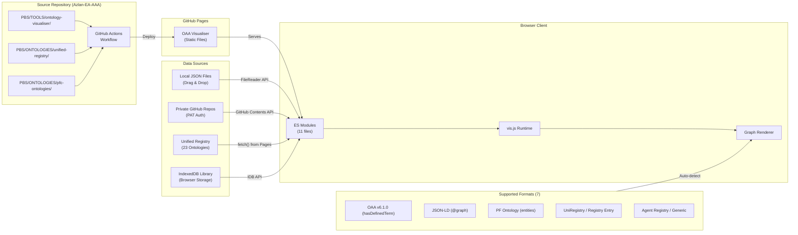

# OAA Ontology Visualiser — Architecture & Deployment

**Version:** 3.2.0
**Last Updated:** 2026-02-06

---

## Overview

The OAA Ontology Visualiser is a zero-build-step, client-side browser application for interactive graph visualisation of JSON ontologies produced by OAA (Ontology Architect Agent). It supports single-ontology inspection with OAA v6.1.0 compliance validation, multi-ontology registry loading with cross-reference detection, three-tier progressive disclosure navigation (series rollup → ontology drill-down → entity graph), VE/PE lineage chain highlighting, and cross-ontology edge navigation.

No server-side processing, no Node.js, no bundler. The only external dependency is vis-network v9.1.2, loaded via CDN.

---

## Architecture Diagram



---

## Module Architecture (ES Modules)

All JavaScript is split into native ES modules loaded via `<script type="module">`. No build step, no bundler (see [ADR-009](./ADR-LOG.md#adr-009)).

```
browser-viewer.html           <- HTML shell (140 lines, incl. breadcrumb bar + lineage toggles)
├── css/viewer.css             <- All styles (incl. breadcrumb, tier toggle, lineage chain, cross-edge filter)
└── js/
    ├── app.js                 <- Entry point, event wiring, navigation orchestration, lineage toggles, window bindings
    ├── state.js               <- Shared state, constants (TYPE_COLORS, SERIES_COLORS, LINEAGE_CHAINS, LINEAGE_COLORS, navigation state)
    ├── ontology-parser.js     <- Format detection + parsing (7 formats)
    ├── graph-renderer.js      <- vis.js rendering (single + multi + Tier 0/1 renderers + lineage edge styling + edge click handlers)
    ├── multi-loader.js        <- Registry batch loading, merged graph, cross-ref detection, series aggregation, lineage classification
    ├── audit-engine.js        <- OAA v6.1.0 validation gates (G1-G6, 8 gates)
    ├── compliance-reporter.js <- Compliance panel rendering
    ├── ui-panels.js           <- Sidebar, audit (incl. cross-dependency counts), modals, tabs, provenance display, tier-aware drill buttons
    ├── library-manager.js     <- IndexedDB ontology library (CRUD, versioning, export/import)
    ├── github-loader.js       <- Registry index loading, entry lookup
    └── export.js              <- PNG, audit JSON, ontology download
```

### Module Dependency Graph

```
state.js              <- (all modules import shared state + constants)
github-loader.js      <- multi-loader.js, app.js
ontology-parser.js    <- multi-loader.js, app.js
multi-loader.js       <- graph-renderer.js, app.js
audit-engine.js       <- graph-renderer.js
compliance-reporter.js <- graph-renderer.js
ui-panels.js          <- graph-renderer.js, app.js
graph-renderer.js     <- app.js
library-manager.js    <- app.js
export.js             <- app.js
```

No circular dependencies. `state.js` is the single shared state module imported by all others. `graph-renderer.js` imports lineage classification helpers (`classifyLineageEdge`, `getNodeLineageRole`) from `multi-loader.js`.

---

## View Modes

### Single-Ontology Mode (`state.viewMode = 'single'`)

Standard mode for inspecting one ontology at a time. Triggered by:

- Drag-and-drop file
- File picker
- Load from GitHub (PAT)
- Load from Library (IndexedDB)

Features: OAA v6.1.0 compliance validation (8 gates), entity type colouring, sidebar inspection (Details, Connections, Schema, Data tabs), OAA upgrade command generation.

### Multi-Ontology Mode (`state.viewMode = 'multi'`)

Registry mode with three-tier progressive disclosure. Triggered by "Load Registry" button. Uses `state.currentTier` to track the active navigation level.

#### Tier 0 — Series Rollup (Default Entry Point)

6 series super-nodes representing the ontology library at the highest level. This is the default view when "Load Registry" is clicked (see [ADR-010](./ADR-LOG.md#adr-010)).

- **Nodes**: 6 series super-nodes (size 45, multi-line labels with ontology count)
- **Edges**: Cross-series reference edges (gold dashed, labelled with count)
- **Interaction**: Double-click a series to drill down to Tier 1
- **Toggle**: Series (6) / Ontologies (23) toggle in breadcrumb bar
- **Renderer**: `renderTier0()` in `graph-renderer.js`

#### Tier 1 — Series Drill-Down

Ontology-level nodes within a selected series, with faded context nodes for other series.

- **Nodes**: Ontology nodes for the selected series (size 30) + faded context nodes for other series (30% opacity)
- **Edges**: Intra-series cross-ontology edges + cross-series edges to context nodes
- **Interaction**: Double-click an ontology to drill to Tier 2; double-click a faded context series to switch context
- **Placeholders**: Shown as dashed-border diamonds (not drillable)
- **Renderer**: `renderTier1()` in `graph-renderer.js`

#### Tier 2 — Entity Graph

Full entity-level graph for a single ontology. Reuses the single-ontology `renderGraph()` renderer with the parsed data from the registry record.

- **Renderer**: Existing `renderGraph()` (same as single-ontology mode)
- **Context**: Breadcrumb shows full path (Library › Series › Ontology)

#### Breadcrumb Navigation

A breadcrumb bar provides navigation context and back-navigation across all tiers:

```
Library  ›  VE-Series  ›  VSOM Ontology
(Tier 0)    (Tier 1)      (Tier 2)
```

Clickable segments navigate back to the corresponding tier. Home button returns to Tier 0.

#### Navigation State

Key data structures in multi-mode:

- `state.loadedOntologies: Map<namespace, OntologyRecord>` — all loaded ontologies
- `state.mergedGraph` — combined parsed graph with namespace-prefixed node IDs
- `state.seriesData` — series metadata with counts and colours
- `state.currentTier` — active navigation level (-1 = single, 0 = series, 1 = ontologies, 2 = entities)
- `state.currentSeries` — active series key when at Tier 1+
- `state.currentOntology` — active namespace when at Tier 2
- `state.navigationStack` — breadcrumb history array
- `state.crossEdges` — cross-ontology edges from `detectCrossReferences()`
- `state.crossSeriesEdges` — aggregated series-to-series edges from `buildCrossSeriesEdges()`
- `state.lineageHighlight` — lineage chain highlight mode (`'off'` | `'VE'` | `'PE'` | `'both'`)
- `state.crossEdgeFilterActive` — when true, only cross-ontology edges are shown (intra-ontology edges hidden)
- `state.bridgeFilterActive` — bridge node filter toggle
- `state.bridgeNodes` — `Map` of bridge node IDs (entities referenced by 3+ ontologies)

Node IDs are prefixed with namespace (`prefix::nodeId`) to avoid collisions across ontologies.

---

## Cross-Ontology Edge Detection

Two-pass algorithm implemented in `multi-loader.js` `detectCrossReferences()` (see [ADR-011](./ADR-LOG.md#adr-011)):

1. **Pass 1 — Registry bridges:** Reads both `entry.relationships.keyBridges[]` and `entry.relationships.crossOntology[]` from each registry entry (entries use both property names inconsistently)
2. **Pass 2 — Namespace-prefix scan:** Scans `rangeIncludes`/`domainIncludes` for prefixed references to other ontologies

Edges are deduplicated via `Set<edgeKey>`. Rendered as gold dashed lines (width 2.5) by default, or with lineage-specific styling when lineage highlighting is active.

### Series-Level Edge Aggregation

`buildCrossSeriesEdges()` in `multi-loader.js` aggregates cross-ontology edges into series-to-series edges for Tier 0 rendering. Direction is normalised alphabetically to avoid duplicate edges between the same pair of series. Each aggregated edge carries a count and list of source bridges.

---

## VE/PE Lineage Chain Highlighting

Two pre-defined lineage chains trace value flow through the ontology library (defined in `state.js` as `LINEAGE_CHAINS`):

- **VE (Value Engineering):** VSOM → OKR → VP → PMF → EFS — gold (#cec528)
- **PE (Process Engineering):** PPM → PE → EFS → EA — copper (#b87333)
- **EFS Convergence Point:** EFS appears in both chains — convergence orange (#FF6B35)

### Lineage Classification

`classifyLineageEdge(fromNs, toNs)` in `multi-loader.js` determines whether a cross-ontology edge represents a step in the VE or PE lineage chain. It checks both directions (from→to and to→from) against consecutive entries in `LINEAGE_CHAINS`. Returns `{ isVE, isPE, isConvergence }`.

`getNodeLineageRole(namespace)` returns `{ inVE, inPE, isConvergence }` for a given namespace, used for convergence node styling.

### Edge Styling

| Edge Type | Colour | Width | Dash | When Shown |
| --------- | ------ | ----- | ---- | ---------- |
| Intra-ontology | Series colour | 1.2 | Solid | Always |
| Cross-ontology (general) | Gold #FFD700 | 2.5 | [8,4] dashed | Always in multi mode |
| VE lineage | Gold #cec528 | 3.5 | Solid | When VE or Both active |
| PE lineage | Copper #b87333 | 3.5 | Solid | When PE or Both active |
| Non-lineage (dimmed) | #444 | 1 | [8,4] dashed | When lineage filter active |

### Convergence Node (EFS)

When lineage highlighting is active, the EFS node receives:

- Dual-colour border: gold inner (#cec528) + copper outer (#b87333)
- 1.3× normal size
- Shadow glow in convergence colour (#FF6B35)
- Tooltip: "CONVERGENCE POINT — VE and PE lineage chains meet here"

### Cross-Edge Filter

`state.crossEdgeFilterActive` hides intra-ontology edges, showing only cross-ontology connections. Toggled via the "Cross-refs Only" button in the breadcrumb bar.

### Edge Click Navigation

Clicking a cross-ontology edge navigates to the target ontology (Tier 2). Implemented via a `selectEdge` event handler on the vis.js network that reads the `_crossOntologyTarget` property from the edge data and calls `drillToOntology()`.

### Audit Panel: Cross-Dependency Counts

When in multi-ontology mode with cross-edges detected, the audit panel displays:

- Per-ontology outbound cross-reference counts (sorted descending)
- Total cross-ontology edge count
- Bridge node count (entities referenced by 3+ ontologies)

Implemented in `renderAuditPanel()` in `ui-panels.js`.

---

## Data Sources

### Unified Registry

The unified registry at `PBS/ONTOLOGIES/unified-registry/` contains:

- `ont-registry-index.json` — index of 23 entries with `seriesRegistry`, `namespaceRegistry`
- `entries/` — individual registry entry JSON files
- Artifact paths in entries are relative to the `entries/` directory (e.g., `../pfc-ontologies/EMC-ONT/...`)

Path resolution: `REGISTRY_BASE_PATH` (`../../ONTOLOGIES/unified-registry/`) is relative to the visualiser's location at `PBS/TOOLS/ontology-visualiser/`.

### IndexedDB Library

Client-side storage via `library-manager.js`:

- Database: `OntologyLibrary` (IDB v1)
- Stores: ontologies with version history
- Operations: save, load, delete, export, import
- Categories: `pfc-ontologies`, `pfi-ontologies`, `domain-ontologies`, `custom`

### GitHub API

Direct fetch from private repos via PAT (stored in `sessionStorage` only, cleared on tab close).

---

## OAA v6.1.0 Compliance

8 validation gates implemented in `audit-engine.js`:

| Gate | Name | Checks |
| ---- | ---- | ------ |
| G1 | Schema Structure | Valid `@context`, `@type`, required fields |
| G2 | Relationship Cardinality | All relationships properly defined |
| G2B | Entity Connectivity | Every entity in at least one relationship |
| G2C | Graph Connectivity | Single connected component |
| G3 | Business Rules | IF-THEN rules with correct format |
| G4 | Semantic Consistency | Naming conventions, description quality |
| G5 | Completeness | Test data with required distribution |
| G6 | UniRegistry | Registry entry with required metadata |

Results: pass / warn / fail per gate. Overall compliance badge in header (green/orange/red).

---

## Deployment

### GitHub Pages (Current)

Deployed automatically via GitHub Actions on push to `main`.

| Component | Detail |
| --------- | ------ |
| Workflow | `.github/workflows/pages.yml` |
| Trigger paths | `PBS/TOOLS/ontology-visualiser/**`, `PBS/ONTOLOGIES/unified-registry/**`, `PBS/ONTOLOGIES/pfc-ontologies/**`, `PBS/AGENTS/oaa-v6/**` |
| Primary URL | `https://ajrmooreuk.github.io/Azlan-EA-AAA/PBS/TOOLS/ontology-visualiser/browser-viewer.html` |
| Root redirect | `https://ajrmooreuk.github.io/Azlan-EA-AAA/` |
| Legacy URL | `https://ajrmooreuk.github.io/Azlan-EA-AAA/tools/ontology-visualiser/browser-viewer.html` |

The workflow deploys:

- Visualiser files (HTML, CSS, JS modules)
- Unified registry (index + entries)
- Ontology artifact files (from `pfc-ontologies/`)
- OAA system prompts
- Root `index.html` redirect

**Setup requirement:** Repo Settings > Pages > Source must be set to **GitHub Actions**.

### Future: Supabase

Planned migration to Supabase for persistent ontology storage, replacing file-based loading as the primary data source (see [ADR-001](./ADR-LOG.md#adr-001), [ADR-012](./ADR-LOG.md#adr-012)).

---

## Security

- **No backend** — all processing is client-side
- **PAT handling** — GitHub Personal Access Token stored in `sessionStorage` only (cleared on tab close, never persisted)
- **Auto-clear on 401** — invalid tokens removed from session immediately
- **No telemetry** — no analytics, tracking, or external calls beyond vis.js CDN and GitHub API
- **IndexedDB** — local-only storage, no sync to external services

---

## Dependencies

| Dependency | Version | Source |
| ---------- | ------- | ------ |
| vis-network | 9.1.2 | CDN (`unpkg.com`) |

No npm, no Node.js, no build step, no other external dependencies.

---

## File Structure

```
PBS/TOOLS/ontology-visualiser/
├── browser-viewer.html              <- HTML shell (incl. lineage toggle + cross-edge filter buttons)
├── css/
│   └── viewer.css                   <- All styles (incl. lineage chain + cross-edge filter)
├── js/
│   ├── app.js                       <- Entry point, navigation, lineage toggles
│   ├── state.js                     <- Shared state + constants (incl. LINEAGE_COLORS)
│   ├── ontology-parser.js           <- Format detection + parsing
│   ├── graph-renderer.js            <- vis.js rendering (single + Tier 0/1 + lineage styling)
│   ├── multi-loader.js              <- Registry loading, series aggregation, lineage classification
│   ├── audit-engine.js              <- OAA v6.1.0 validation
│   ├── compliance-reporter.js       <- Compliance panel
│   ├── ui-panels.js                 <- Sidebar, modals, tabs, cross-dependency counts
│   ├── library-manager.js           <- IndexedDB library
│   ├── github-loader.js             <- Registry integration
│   └── export.js                    <- PNG, JSON export
├── ARCHITECTURE.md                  <- This file
├── ADR-LOG.md                       <- Architecture Decision Records
├── OPERATING-GUIDE.md               <- Full operating guide
├── QUICK-START.md                   <- 2-minute getting started
├── README.md                        <- Project overview
├── sample-ontology-with-data.json   <- Demo ontology
└── sample-test-data.json            <- Demo test data
```

### Legacy Python Tools

The original Python tools (`demo.py`, `graph_builder.py`, `visualiser.py`, etc.) remain in this directory for reference but are superseded by the browser-based viewer.

---

## Related Documentation

| Document | Description |
| -------- | ----------- |
| [README.md](./README.md) | Project overview and quick start |
| [QUICK-START.md](./QUICK-START.md) | 2-minute getting started guide |
| [OPERATING-GUIDE.md](./OPERATING-GUIDE.md) | Full operating guide with all workflows |
| [ADR-LOG.md](./ADR-LOG.md) | Architecture Decision Records (13 ADRs) |

---

*OAA Ontology Visualiser v3.2.0 — Architecture & Deployment*
