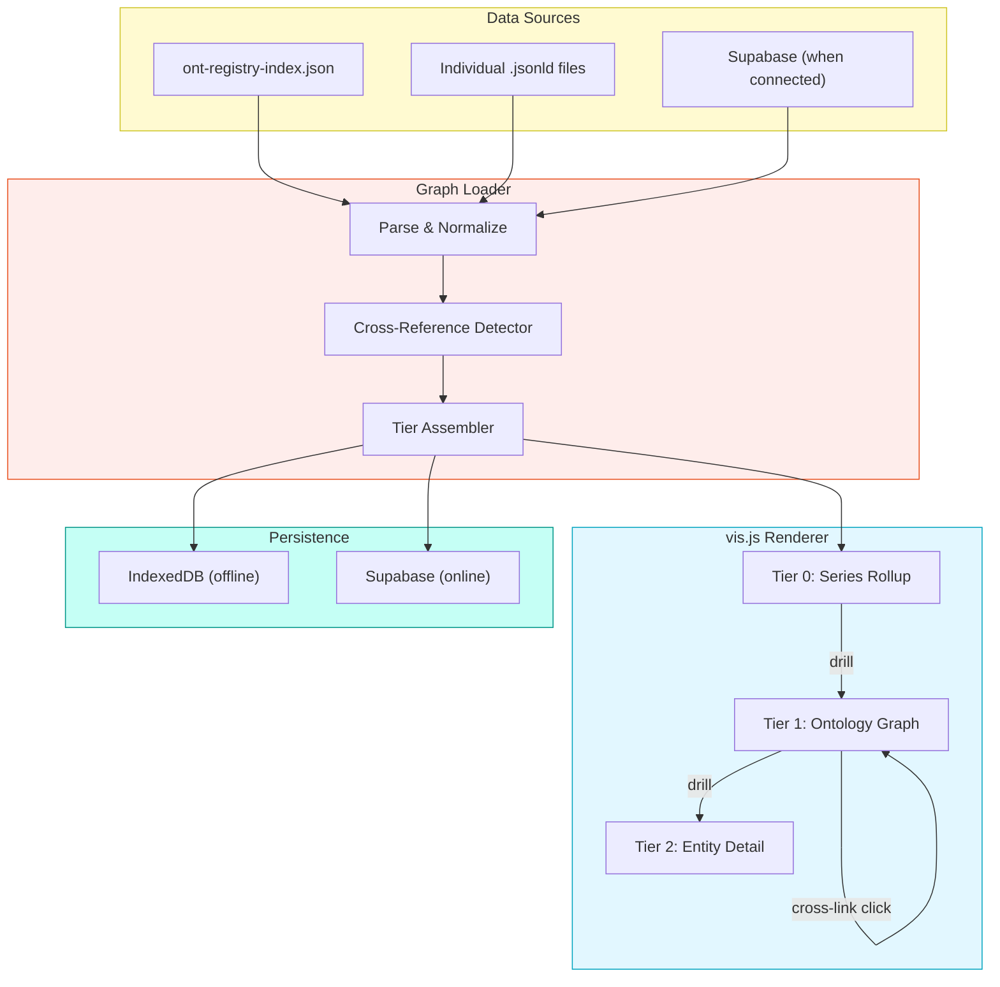
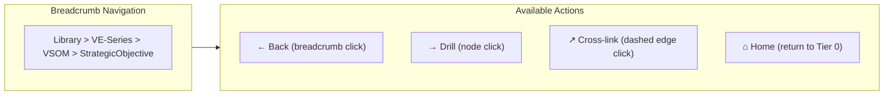
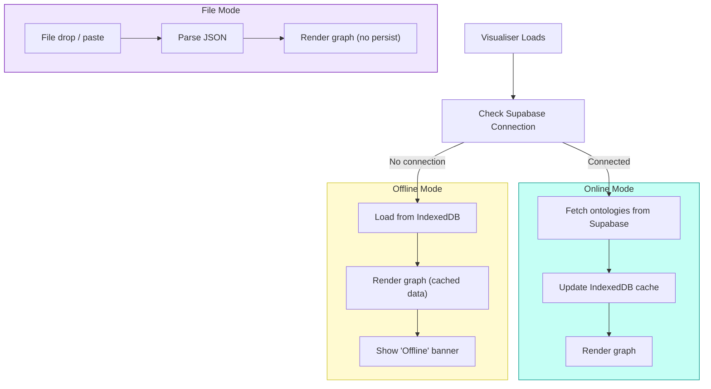

# Feature Spec: Graph Rollup, Drill-Through & Database Integration

**Version:** 1.0.0
**Date:** 2026-02-04
**Status:** Draft
**Relates to:** BACKLOG.md Epic 2, HLD Features F1/F3/F6

---

## Overview

Extend the Ontology Visualiser from a single-ontology viewer into a multi-layer graph platform capable of:

1. **Rollup View** — Aggregate meta-graph showing all 23 ontologies across 6 series as a graph-of-graphs
2. **Top-Down Drill-Through** — Navigate from series layer down through individual ontologies to entity-level detail
3. **Cross-Ontology Connections** — Detect and render relationships that span ontology boundaries, with lineage chain visualisation
4. **Supabase Integration** — Persist ontologies, graph data, and validation state in a shared database

These capabilities transform the visualiser from a file-by-file inspection tool into an enterprise knowledge graph navigator.

---

## Current State

| Aspect | Current | Target |
|--------|---------|--------|
| Scope | Single ontology at a time | Full library (23 ontologies, 6 series) |
| Navigation | Flat graph, zoom/pan only | Tiered: Series → Ontology → Entity |
| Cross-references | Not rendered | Detected and styled as cross-ontology edges |
| Data source | Local file / IndexedDB | Supabase-backed with local fallback |
| Lineage | Not visible | VE and PE chains rendered as navigable paths |

### Existing Artefacts

| Artefact | Status | Relevance |
|----------|--------|-----------|
| `browser-viewer.html` | v2.0.0 deployed | Base visualiser to extend |
| `BACKLOG.md` Epic 2 | 13 stories, all Backlog | Direct overlap — this spec supersedes E2 scope |
| `HLD-VISUALISER-ENHANCED-v1.0.0.md` | Decisions resolved | Architecture reference (Option A confirmed) |
| `ont-registry-index.json` | 23 ontologies indexed | Data source for rollup graph |
| Supabase schema (HLD) | Designed, not deployed | Database target |

---

## Architecture

### Tier Model

```
Tier 0: Series Rollup (graph-of-graphs)
├── VE-Series [6 ontologies]
├── PE-Series [5 ontologies]
├── Foundation [4 ontologies]
├── Competitive [3 ontologies]
├── Security [4 ontologies]
└── Orchestration [1 ontology: EMC]
    │
    ▼ click to drill
Tier 1: Ontology Graph (single ontology expanded)
├── Entities as nodes
├── Relationships as edges
└── Cross-ontology references as dashed outbound edges
    │
    ▼ click entity
Tier 2: Entity Detail (property inspector)
├── Properties panel
├── Business rules
├── Inbound/outbound relationships
└── Cross-ontology references (which other ontologies reference this entity)
```

### Data Flow



---

## Feature 1: Series Rollup View (Tier 0)

### Description

A meta-graph where each node represents an ontology series and edges represent cross-series dependencies. This is the entry point when loading the full library.

### Rollup Node Structure

Each series node displays:

| Field | Source | Example |
|-------|--------|---------|
| Label | `seriesRegistry[key].name` | "Value Engineering Series" |
| Count | `seriesRegistry[key].ontologies.length` | 6 |
| Compliance | Aggregate from entries | "5/6 compliant" |
| Badge | Compliance ratio | Green (100%), Yellow (>50%), Red (<50%) |

### Rollup Edge Structure

Edges between series nodes are derived from cross-ontology references declared in individual ontology definitions. Detection logic:

1. For each ontology, scan `relationships[].rangeIncludes` and `crossOntologyReferences`
2. If a reference uses a namespace prefix belonging to a different series, create an edge
3. Edge weight = count of cross-references between the two series

### Known Cross-Series Relationships

| From Series | To Series | Key Relationships |
|-------------|-----------|-------------------|
| VE (VSOM) | PE (PPM) | `vsom:cascadesTo` → `okr:Objective` |
| VE (OKR) | VE (VP) | `okr:drivesValueProposition` |
| VE (VP) | VE (PMF) | `vp:validatedBy` → `pmf:FitAssessment` |
| VE (PMF) | PE (EFS) | `pmf:decomposesInto` → `efs:Service` |
| PE (PPM) | PE (PE) | `ppm:executedVia` → `pe:Process` |
| PE (PE) | PE (EFS) | `pe:implements` → `efs:Service` |
| PE (EFS) | PE (EA) | `efs:architectedBy` → `ea:ArchitectureComponent` |
| Foundation (ORG-CTX) | VE (VSOM) | `org-ctx:strategicContext` → `vsom:Vision` |
| Foundation (ORG-CTX) | Competitive | `org-ctx:competitivePosition` → `ca:Analysis` |
| Foundation (RRR) | VE + PE | Bridges via RACI/RBAC role mappings |
| Security (MCSB) | PE (EA) | `mcsb:assessedComponent` → `ea:ArchitectureComponent` |
| Orchestration (EMC) | All | `emc:composes` all other ontologies |

### VE Lineage Chain

The primary strategic flow rendered as a highlighted path in Tier 0:

```
VSOM → OKR → VP → PMF → EFS
  "Vision cascades to Objectives, which drive Value Propositions,
   validated by Product-Market Fit, decomposed into Enterprise Services"
```

### PE Lineage Chain

The primary execution flow:

```
PPM → PE → EFS → EA
  "Portfolios execute via Processes, implementing Services,
   governed by Architecture"
```

### User Stories

| ID | Story | Points |
|----|-------|--------|
| R.1.1 | As a user, I want to see all 6 ontology series as nodes in a rollup graph when I load the full library | 5 |
| R.1.2 | As a user, I want edges between series nodes showing cross-series dependencies with labels | 5 |
| R.1.3 | As a user, I want each series node to show ontology count and compliance status as a badge | 3 |
| R.1.4 | As a user, I want the VE lineage chain (VSOM→OKR→VP→PMF→EFS) highlighted as a distinct path | 3 |
| R.1.5 | As a user, I want the PE lineage chain (PPM→PE→EFS→EA) highlighted as a distinct path | 3 |
| R.1.6 | As a user, I want to toggle between "Series View" (6 nodes) and "Ontology View" (23 nodes) at Tier 0 | 3 |
| R.1.7 | As a user, I want EMC (Orchestration) shown as a central hub connecting to all other series | 2 |

---

## Feature 2: Top-Down Drill-Through (Tier 0 → Tier 1 → Tier 2)

### Description

Click a series node in Tier 0 to expand into its constituent ontologies (Tier 1). Click an ontology node to see its entities and relationships (existing single-ontology view). Click an entity to open the detail panel (Tier 2).

### Navigation Model



### Drill-Through Behaviour

| Action | From | To | Animation |
|--------|------|----|-----------|
| Click series node | Tier 0 | Tier 1: show ontologies in that series as individual graphs side-by-side | Zoom-into transition, series node expands |
| Click ontology node | Tier 1 | Tier 1 (expanded): full entity-relationship graph for that ontology | Node expands inline, other ontologies fade to 30% opacity |
| Click entity node | Tier 1 | Tier 2: detail panel slides in from right | Panel animation, graph dims |
| Click cross-ontology edge | Tier 1 | Tier 1: navigate to target ontology, highlight target entity | Pan + zoom to target, breadcrumb updates |
| Click breadcrumb | Any | Navigate back to that tier level | Reverse animation |
| Home button | Any | Tier 0 | Zoom-out to rollup |

### Context Preservation

When drilling down, the parent context is preserved:
- Tier 0 → Tier 1: Other series remain visible but faded (30% opacity), clickable to switch
- Tier 1 expanded: Other ontologies in the same series remain as collapsed nodes
- Tier 2: Graph remains visible behind the detail panel

### User Stories

| ID | Story | Points |
|----|-------|--------|
| D.2.1 | As a user, I want to click a series node to drill into its ontologies | 5 |
| D.2.2 | As a user, I want to click an ontology to expand its entity graph inline | 5 |
| D.2.3 | As a user, I want breadcrumb navigation showing my current position in the hierarchy | 3 |
| D.2.4 | As a user, I want a Home button to return to the Tier 0 rollup from any depth | 1 |
| D.2.5 | As a user, I want parent-level context preserved (faded) when I drill down | 3 |
| D.2.6 | As a user, I want smooth transitions (zoom/fade) when navigating between tiers | 3 |
| D.2.7 | As a user, I want to click a cross-ontology edge to navigate to the target ontology | 3 |

---

## Feature 3: Cross-Ontology Connection Rendering

### Description

Detect and render relationships that span ontology boundaries. These exist in three forms:

1. **Namespace-prefixed references** — `rangeIncludes: ["okr:Objective"]` in the VSOM ontology references an entity in the OKR ontology
2. **Explicit crossOntology declarations** — `"crossOntology": true` on relationship definitions
3. **Shared entity names** — Same `@id` appearing in multiple ontology definitions (e.g., `RoleContext` in both VSOM and RRR)

### Cross-Reference Detection Algorithm

```
FOR each loaded ontology O:
  FOR each relationship R in O.relationships:
    FOR each target T in R.rangeIncludes:
      IF T contains namespace prefix P where P != O.namespace:
        CREATE cross-ontology edge {
          source: O.namespace + ":" + R.domainIncludes[0],
          target: T,
          edgeType: "cross-ontology",
          label: R.name,
          sourceOntology: O.name,
          targetOntology: resolve(P)
        }
  FOR each entity E in O.entities:
    IF E has "extends" or "references" pointing to external namespace:
      CREATE cross-ontology edge (inheritance or reference type)
```

### Edge Styling

| Edge Type | Style | Colour | Label |
|-----------|-------|--------|-------|
| Intra-ontology relationship | Solid | Series colour | Relationship name |
| Cross-ontology reference | Dashed | Grey (#888) | Relationship name + target namespace |
| Inheritance (extends) | Dotted with arrow | Blue (#4A90D9) | "extends" |
| Lineage chain (VE/PE) | Thick solid | Gold (#D4A843) | Chain step label |
| Bridge node connection | Dash-dot | Purple (#9B59B6) | "bridge" |

### Bridge Node Detection

A bridge node is an entity that appears in or is referenced by 3+ ontologies. Examples:

| Entity | Ontologies | Role |
|--------|------------|------|
| `rrr:RoleContext` | VSOM, PPM, PE, ORG | Role assignments across all domains |
| `efs:Service` | PMF, PE, EA, EFS | Core service abstraction |
| `org-ctx:OrganizationContext` | ORG-CTX, VSOM, CA, CL, GA | Central context hub |

Bridge nodes get a distinct visual treatment:
- Double border (inner series colour, outer gold)
- Larger node size (1.5x)
- Tooltip showing all referencing ontologies

### User Stories

| ID | Story | Points |
|----|-------|--------|
| X.3.1 | As a user, I want cross-ontology edges rendered with dashed styling distinct from intra-ontology edges | 3 |
| X.3.2 | As a user, I want the VE lineage chain (VSOM→OKR→VP→PMF→EFS) rendered as a highlighted path I can follow | 5 |
| X.3.3 | As a user, I want the PE lineage chain (PPM→PE→EFS→EA) rendered as a highlighted path | 3 |
| X.3.4 | As a user, I want bridge nodes (entities referenced by 3+ ontologies) highlighted with a special indicator | 3 |
| X.3.5 | As a user, I want to filter the graph to show only cross-ontology edges (hiding intra-ontology detail) | 3 |
| X.3.6 | As a user, I want the Audit panel to report cross-ontology dependency counts per ontology | 3 |
| X.3.7 | As a user, I want to click a cross-ontology edge to navigate to the target ontology and highlight the target entity | 3 |
| X.3.8 | As a user, I want a "Connection Map" mode showing only cross-ontology edges as a dependency diagram | 5 |

---

## Feature 4: Supabase Database Integration

### Description

Connect the visualiser to Supabase as the backing store for ontologies, graph data, and validation state. Follows the HLD Option A (Supabase-First) architecture with an offline fallback to IndexedDB.

### Schema

Uses the schema defined in `HLD-VISUALISER-ENHANCED-v1.0.0.md` with additions for rollup and cross-ontology data:

```sql
-- Core tables (from HLD)
CREATE TABLE ontologies (
    id UUID PRIMARY KEY DEFAULT gen_random_uuid(),
    name TEXT NOT NULL,
    version TEXT NOT NULL,
    pfi_id TEXT NOT NULL,
    tier TEXT DEFAULT 'domain',
    parent_id UUID REFERENCES ontologies(id),
    series TEXT,                          -- NEW: VE-Series, PE-Series, etc.
    layer TEXT,                           -- NEW: strategic, execution, etc.
    definition JSONB NOT NULL,
    entities JSONB GENERATED ALWAYS AS (definition->'hasDefinedTerm') STORED,
    relationships JSONB GENERATED ALWAYS AS (definition->'relationships') STORED,
    oaa_version TEXT DEFAULT '5.0.0',
    compliance_status TEXT DEFAULT 'pending',
    validation_report JSONB,
    environment TEXT DEFAULT 'dev' CHECK (environment IN ('dev', 'test', 'prod')),
    created_at TIMESTAMPTZ DEFAULT now(),
    updated_at TIMESTAMPTZ DEFAULT now(),
    created_by TEXT,
    UNIQUE(name, version, pfi_id)
);

CREATE TABLE graph_nodes (
    id UUID PRIMARY KEY DEFAULT gen_random_uuid(),
    ontology_id UUID REFERENCES ontologies(id) ON DELETE CASCADE,
    node_id TEXT NOT NULL,
    label TEXT NOT NULL,
    node_type TEXT,
    tier TEXT,
    properties JSONB,
    UNIQUE(ontology_id, node_id)
);

CREATE TABLE graph_edges (
    id UUID PRIMARY KEY DEFAULT gen_random_uuid(),
    ontology_id UUID REFERENCES ontologies(id) ON DELETE CASCADE,
    source_node TEXT NOT NULL,
    target_node TEXT NOT NULL,
    edge_type TEXT NOT NULL,
    label TEXT,
    is_cross_ontology BOOLEAN DEFAULT false,  -- NEW
    target_ontology_id UUID REFERENCES ontologies(id), -- NEW: for cross-ontology edges
    properties JSONB
);

-- NEW: Cross-ontology relationship summary
CREATE TABLE cross_ontology_edges (
    id UUID PRIMARY KEY DEFAULT gen_random_uuid(),
    source_ontology_id UUID REFERENCES ontologies(id) ON DELETE CASCADE,
    target_ontology_id UUID REFERENCES ontologies(id) ON DELETE CASCADE,
    edge_count INTEGER DEFAULT 1,
    relationship_names TEXT[],
    is_lineage_chain BOOLEAN DEFAULT false,
    chain_name TEXT,                      -- 'VE-lineage', 'PE-lineage'
    UNIQUE(source_ontology_id, target_ontology_id)
);

-- Design tokens (from HLD)
CREATE TABLE design_tokens (
    id UUID PRIMARY KEY DEFAULT gen_random_uuid(),
    pfi_id TEXT NOT NULL,
    figma_file_key TEXT,
    tokens JSONB NOT NULL,
    last_synced_at TIMESTAMPTZ DEFAULT now(),
    UNIQUE(pfi_id)
);

-- Indexes
CREATE INDEX idx_ontologies_series ON ontologies(series);
CREATE INDEX idx_ontologies_layer ON ontologies(layer);
CREATE INDEX idx_edges_cross ON graph_edges(is_cross_ontology) WHERE is_cross_ontology = true;
CREATE INDEX idx_cross_edges_source ON cross_ontology_edges(source_ontology_id);
CREATE INDEX idx_cross_edges_target ON cross_ontology_edges(target_ontology_id);
```

### Connection Modes

| Mode | Data Source | Writes | Use Case |
|------|------------|--------|----------|
| **Online** | Supabase primary, IndexedDB cache | Supabase + IndexedDB | Normal operation |
| **Offline** | IndexedDB only | IndexedDB only | No network / Supabase not configured |
| **File-only** | Loaded JSON files | None (read-only) | Quick inspection, no persistence |

### Sync Behaviour



### Import Pipeline

When connecting to Supabase for the first time:

1. Read `ont-registry-index.json` from the repository
2. For each entry, load the full ontology definition from its `path`
3. Insert into `ontologies` table with `series` and `layer` populated from `seriesRegistry`
4. Denormalize entities into `graph_nodes` and relationships into `graph_edges`
5. Run cross-reference detection to populate `cross_ontology_edges`
6. Mark `is_cross_ontology = true` on relevant `graph_edges` rows

### Supabase Edge Functions

| Function | Purpose | Trigger |
|----------|---------|---------|
| `resolve-graph` | Fetch ontologies + nodes + edges for a given tier/series | GET from visualiser |
| `validate-ontology` | Run OAA gates on upload | POST on ontology save |
| `detect-cross-refs` | Scan all ontologies for cross-references | POST on library import |
| `rollup-stats` | Aggregate compliance/count stats per series | GET for Tier 0 render |

### User Stories

| ID | Story | Points |
|----|-------|--------|
| DB.4.1 | As a user, I want the visualiser to connect to Supabase and load ontologies from the database | 5 |
| DB.4.2 | As a user, I want the visualiser to fall back to IndexedDB when Supabase is unavailable | 3 |
| DB.4.3 | As a user, I want to import the full ontology library from the repository into Supabase | 5 |
| DB.4.4 | As a user, I want ontologies saved to Supabase to include series, layer, and compliance metadata | 3 |
| DB.4.5 | As a user, I want cross-ontology edges computed and stored in the database on import | 3 |
| DB.4.6 | As a user, I want a connection status indicator showing Online/Offline/File mode | 2 |
| DB.4.7 | As a developer, I want a Supabase Edge Function that resolves the graph for a given tier | 5 |
| DB.4.8 | As a user, I want file drop to continue working regardless of database connection state | 2 |

---

## Implementation Order

### Phase 1: Graph Loader & Rollup (Foundation)

Build the multi-ontology graph data model and Tier 0 view.

| Step | Stories | Depends On |
|------|---------|------------|
| 1a. Multi-ontology parser | R.1.1 | None |
| 1b. Cross-reference detector | X.3.1, X.3.6 | 1a |
| 1c. Tier 0 rollup renderer | R.1.2, R.1.3, R.1.7 | 1a, 1b |
| 1d. Lineage chain highlighting | R.1.4, R.1.5, X.3.2, X.3.3 | 1c |
| 1e. Series/Ontology toggle | R.1.6 | 1c |

### Phase 2: Drill-Through Navigation

Add tiered navigation on top of the rollup.

| Step | Stories | Depends On |
|------|---------|------------|
| 2a. Tier 0 → Tier 1 drill | D.2.1, D.2.5 | Phase 1 |
| 2b. Tier 1 inline expansion | D.2.2 | 2a |
| 2c. Breadcrumb + Home | D.2.3, D.2.4 | 2a |
| 2d. Cross-ontology navigation | D.2.7, X.3.7 | 2b |
| 2e. Transition animations | D.2.6 | 2a, 2b |

### Phase 3: Cross-Ontology Features

Deeper cross-reference capabilities.

| Step | Stories | Depends On |
|------|---------|------------|
| 3a. Bridge node detection | X.3.4 | Phase 1 |
| 3b. Cross-edge filter mode | X.3.5 | Phase 1 |
| 3c. Connection Map mode | X.3.8 | 3a, 3b |

### Phase 4: Supabase Integration

Database backend.

| Step | Stories | Depends On |
|------|---------|------------|
| 4a. Supabase schema deployment | DB.4.4 | None (can run in parallel) |
| 4b. Connection manager (online/offline/file) | DB.4.1, DB.4.2, DB.4.6, DB.4.8 | 4a |
| 4c. Library import pipeline | DB.4.3, DB.4.5 | 4a, Phase 1 (cross-ref detector) |
| 4d. Edge Function: resolve-graph | DB.4.7 | 4a |

---

## Backlog Alignment

This spec extends and supersedes portions of the existing BACKLOG.md:

| Existing Story | This Spec | Relationship |
|----------------|-----------|--------------|
| E2 2.1.1 (multi-ontology loading) | R.1.1 + DB.4.1 | Expanded: adds series grouping and DB source |
| E2 2.1.2 (subgraph labels) | R.1.3 | Expanded: adds compliance badges |
| E2 2.1.3 (toggle visibility) | R.1.6 | Expanded: series/ontology toggle |
| E2 2.2.1 (cross-ontology edges) | X.3.1 | Same scope |
| E2 2.2.2 (edge styling) | X.3.1 edge styling table | Expanded: 5 edge types |
| E2 2.2.3 (audit panel cross-deps) | X.3.6 | Same scope |
| E2 2.3.1 (bridge node highlighting) | X.3.4 | Expanded: 3+ ontology threshold |
| E2 2.3.2 (filter bridge nodes) | X.3.5 | Expanded: filter cross-edges too |
| E2 2.4.1 (library panel) | R.1.1 | Expanded: graph-based not list-based |
| E2 2.4.3 (dependency graph) | X.3.8 Connection Map | Expanded: dedicated mode |
| HLD F1 (Supabase Registry) | DB.4.1-4.8 | Detailed implementation |
| HLD F3 (Tiered Navigation) | D.2.1-2.7 | Detailed drill-through spec |
| HLD F6 (Cross-Ontology Links) | X.3.1-3.8 | Detailed cross-reference spec |

### Stories Not Covered Here (remain in BACKLOG.md)

- E1 (OAA Verification) — separate concern
- E3 (Enhanced Audit) — separate concern
- E4 (Export & Reporting) — separate concern
- E5 (Multi-Source Loading) — partially covered by DB.4.1
- E6 (Package & Distribution) — separate concern

---

## Ontology Library Reference

### 23 Ontologies by Series

| Series | Ontologies | Status |
|--------|------------|--------|
| **VE-Series** (Value Engineering) | VSOM, OKR, VP, RRR, PMF, KPI | 5 compliant, 1 placeholder (KPI) |
| **PE-Series** (Process Engineering) | PPM, PE, EFS, EA, SA | 5 compliant |
| **Foundation** | ORG, ORG-CONTEXT, ORG-MAT, AIR | 3 compliant, 1 placeholder (AIR) |
| **Competitive** | CA, CL, GA | 3 compliant |
| **Security** | MCSB, MCSB2, GDPR, AZALZ | 1 compliant, 3 placeholder |
| **Orchestration** | EMC | 1 compliant |

### Namespace Registry

```
emc:     Enterprise Model Composition
org:     Organization Foundation
org-ctx: Organization Context (hub)
org-mat: Organization Maturity
ca:      Competitive Analysis
cl:      Competitive Landscape
ga:      Gap Analysis
vsom:    Vision-Strategy-Objectives-Metrics
okr:     Objectives & Key Results
vp:      Value Proposition
rrr:     Roles/RACI/RBAC
pmf:     Product-Market Fit
kpi:     Key Performance Indicators
ppm:     Portfolio/Programme/Project
pe:      Process Engineering
efs:     Enterprise Framework Services
ea:      Enterprise Architecture Portfolio
sa:      Solution Architecture
mcsb:    Microsoft Cloud Security Benchmark v1
mcsb2:   Microsoft Cloud Security Benchmark v2
gdpr:    General Data Protection Regulation
azalz:   Azure Landing Zone Assessment
air:     AI Readiness Assessment
```

---

## Story Point Summary

| Feature | Stories | Points |
|---------|---------|--------|
| F1: Series Rollup | 7 | 24 |
| F2: Drill-Through | 7 | 23 |
| F3: Cross-Ontology Connections | 8 | 28 |
| F4: Supabase Integration | 8 | 28 |
| **Total** | **30** | **103** |

---

## Open Questions

| # | Question | Options | Impact |
|---|----------|---------|--------|
| Q1 | Graph performance at 23 ontologies (~200+ nodes, ~400+ edges) | vis.js can handle this; may need clustering at full entity expansion | Phase 2 |
| Q2 | Should Tier 0 default to Series View (6 nodes) or Ontology View (23 nodes)? | Series view recommended as default — cleaner entry point | Phase 1 |
| Q3 | Should placeholder ontologies (KPI, MCSB2, AIR, GDPR, AZALZ) appear in the rollup? | Yes, with "placeholder" badge — shows intended scope | Phase 1 |
| Q4 | Supabase project: new dedicated project or extend existing ds-e2e-prototype schema? | Recommend new project — ontology data is distinct from design system | Phase 4 |
| Q5 | Should the import pipeline run as a one-off CLI script or as a visualiser UI action? | Both: CLI for initial import, UI "Sync from Repo" button for updates | Phase 4 |

---

## Related Documents

| Document | Path | Relevance |
|----------|------|-----------|
| Visualiser BACKLOG | `PBS/TOOLS/ontology-visualiser/BACKLOG.md` | Existing story backlog (Epic 2 overlap) |
| Visualiser HLD | `PBS/TOOLS/ontology-visualiser/HLD-VISUALISER-ENHANCED-v1.0.0.md` | Architecture decisions (Option A confirmed) |
| Unified Registry Index | `PBS/ONTOLOGIES/unified-registry/ont-registry-index.json` | Source data for rollup |
| Browser Viewer | `tools/ontology-visualiser/browser-viewer.html` | Implementation target |
| Supabase Architecture | `PBS/DESIGN-SYSTEM/ds-e2e-prototype-azlan/baiv-production-architecture-consolidated.md` | Existing DB schema reference |

---

*Feature Spec v1.0.0 | 04 February 2026*
*Azlan-EA-AAA Ontology Visualiser*
