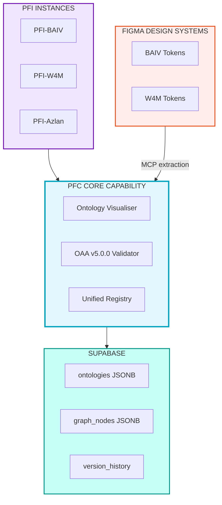
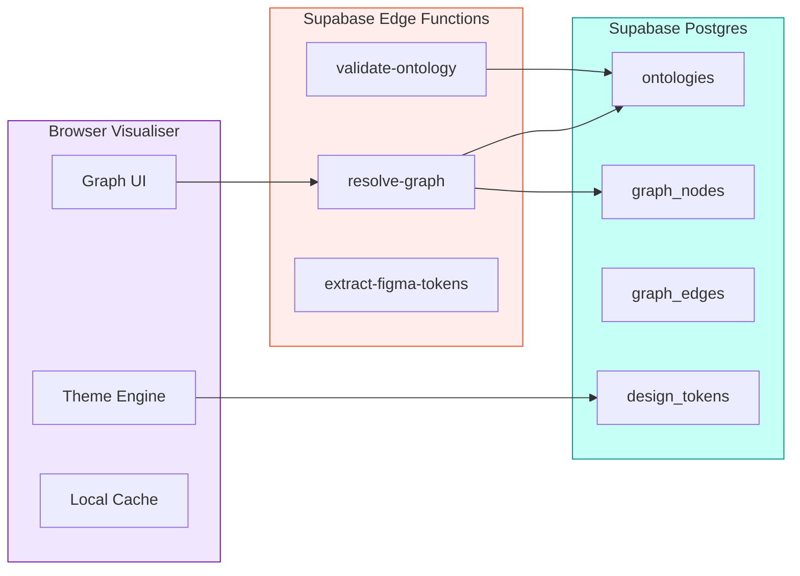
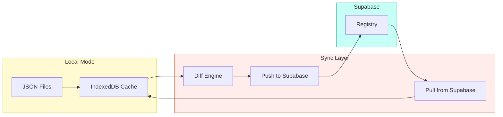
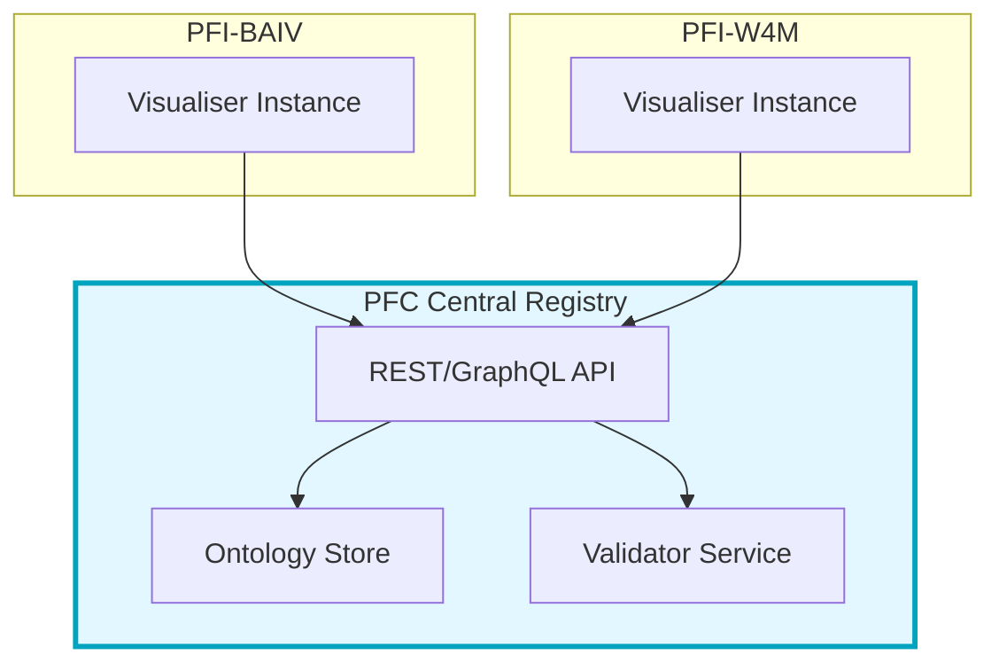
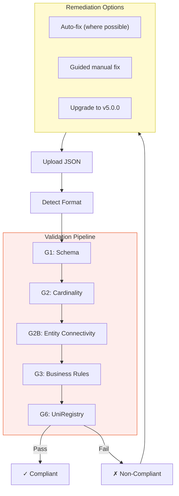
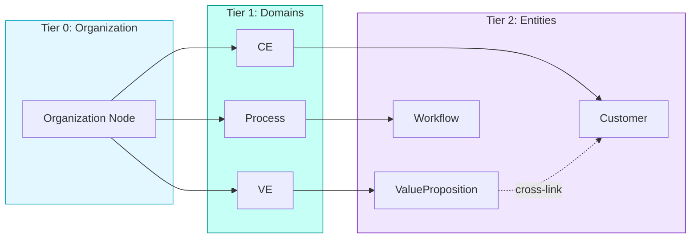
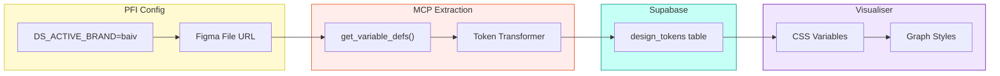

# Ontology Visualiser Enhanced — High Level Design v1.0.0

## Vision

Transform the Ontology Visualiser from a standalone browser tool into a **PFC Core Capability** with:
- Supabase-backed unified registry
- OAA v5.0.0 compliance validation
- Tiered organizational graph modeling
- PFI-customizable theming via Figma design tokens



---

## Feature Set

| # | Feature | Description | Priority |
|---|---------|-------------|----------|
| F1 | Supabase Registry | Store ontologies in JSONB with versioning | High |
| F2 | OAA v5.0.0 Validator | Validate any JSON against v5.0.0 spec | High |
| F3 | Tiered Graph Navigation | Drill-down from org → domain → entity | High |
| F4 | PFI Theming | Customize via Figma design tokens | Medium |
| F5 | Compliance Processor | Auto-upgrade non-compliant ontologies | Medium |
| F6 | Cross-Ontology Links | Connect nodes across ontologies | Low |

---

## Architecture Options

### Option A: Supabase-First (Recommended)

All ontologies stored in Supabase. Visualiser fetches from DB.



**Pros:**
- Single source of truth
- Real-time sync across instances
- Version history built-in
- Cross-ontology queries via SQL

**Cons:**
- Requires Supabase setup per PFI
- Network dependency for all operations

---

### Option B: Hybrid (Local + Sync)

Visualiser works offline with local files. Syncs to Supabase when connected.



**Pros:**
- Works offline
- Fast local operations
- Gradual migration path

**Cons:**
- Sync complexity
- Potential conflicts
- Duplicate storage

---

### Option C: Registry-as-Service

Central PFC registry. PFIs query via API.



**Pros:**
- True single source of truth
- Centralized governance
- Shared validation rules

**Cons:**
- Single point of failure
- Cross-org access control complexity
- Higher infrastructure cost

---

## Database Schema (Option A)

```sql
-- Ontology Registry
CREATE TABLE ontologies (
    id UUID PRIMARY KEY DEFAULT gen_random_uuid(),
    name TEXT NOT NULL,
    version TEXT NOT NULL,
    pfi_id TEXT NOT NULL,           -- Which PFI owns this
    tier TEXT DEFAULT 'domain',     -- 'org', 'domain', 'entity'
    parent_id UUID REFERENCES ontologies(id),

    -- OAA v5.0.0 structure
    definition JSONB NOT NULL,      -- Full ontology JSON
    entities JSONB GENERATED ALWAYS AS (definition->'hasDefinedTerm') STORED,
    relationships JSONB GENERATED ALWAYS AS (definition->'relationships') STORED,

    -- Compliance
    oaa_version TEXT DEFAULT '5.0.0',
    compliance_status TEXT DEFAULT 'pending',
    validation_report JSONB,

    -- Metadata
    created_at TIMESTAMPTZ DEFAULT now(),
    updated_at TIMESTAMPTZ DEFAULT now(),
    created_by TEXT,

    UNIQUE(name, version, pfi_id)
);

-- Graph Nodes (denormalized for fast queries)
CREATE TABLE graph_nodes (
    id UUID PRIMARY KEY DEFAULT gen_random_uuid(),
    ontology_id UUID REFERENCES ontologies(id) ON DELETE CASCADE,
    node_id TEXT NOT NULL,          -- @id from ontology
    label TEXT NOT NULL,
    node_type TEXT,                 -- 'class', 'property', 'external'
    tier TEXT,                      -- Inherited from ontology
    properties JSONB,

    UNIQUE(ontology_id, node_id)
);

-- Graph Edges
CREATE TABLE graph_edges (
    id UUID PRIMARY KEY DEFAULT gen_random_uuid(),
    ontology_id UUID REFERENCES ontologies(id) ON DELETE CASCADE,
    source_node TEXT NOT NULL,
    target_node TEXT NOT NULL,
    edge_type TEXT NOT NULL,        -- 'relationship', 'inheritance', 'reference'
    label TEXT,
    properties JSONB
);

-- Design Tokens (per PFI)
CREATE TABLE design_tokens (
    id UUID PRIMARY KEY DEFAULT gen_random_uuid(),
    pfi_id TEXT NOT NULL,
    figma_file_key TEXT,
    tokens JSONB NOT NULL,          -- Extracted token values
    last_synced_at TIMESTAMPTZ DEFAULT now(),

    UNIQUE(pfi_id)
);

-- Indexes for graph queries
CREATE INDEX idx_nodes_ontology ON graph_nodes(ontology_id);
CREATE INDEX idx_nodes_type ON graph_nodes(node_type);
CREATE INDEX idx_edges_source ON graph_edges(source_node);
CREATE INDEX idx_edges_target ON graph_edges(target_node);
CREATE INDEX idx_ontologies_tier ON ontologies(tier);
CREATE INDEX idx_ontologies_parent ON ontologies(parent_id);
```

---

## OAA v5.0.0 Validation

### Validation Gates (from OAA v5.0.0 Spec)

| Gate | Check | Action on Fail |
|------|-------|----------------|
| G1 | Schema completeness | Block |
| G2 | Relationship cardinality | Block |
| G2B | Entity connectivity (NEW) | Block |
| G2C | Graph connectivity | Warn |
| G3 | Business rules syntax | Block |
| G4 | Glossary completeness | Warn |
| G5 | Test data coverage | Warn |
| G6 | UniRegistry format | Block |

### Validation Flow



---

## Tiered Graph Navigation

### Tier Hierarchy

```
Organization Graph (Tier 0)
└── Domain Ontologies (Tier 1)
    ├── VE Domain
    ├── CE Domain
    ├── Process Domain
    └── ...
        └── Entity Details (Tier 2)
            ├── Properties
            ├── Relationships
            └── Business Rules
```

### Navigation UX



**Interactions:**
- Click node → Drill down to next tier
- Double-click → Expand inline
- Right-click → Context menu (validate, edit, export)
- Breadcrumb navigation at top

---

## DS-E2E Integration (PFI Theming)

### Cross-Reference with ds-e2e-prototype

| DS-E2E Component | Visualiser Integration |
|------------------|------------------------|
| `DS_ACTIVE_BRAND` env var | Determines which Figma file to extract |
| MCP `get_variable_defs()` | Fetches color/typography tokens |
| 3-tier tokens (primitives → semantic → component) | Maps to visualiser CSS variables |
| Supabase `design_tokens` table | Caches extracted tokens |

### Theming Flow



### Token Mapping

```javascript
// Figma semantic tokens → Visualiser CSS
const tokenMapping = {
  // Node colors
  'color.surface.primary': '--vis-node-bg',
  'color.text.primary': '--vis-node-text',
  'color.border.default': '--vis-node-border',

  // Edge colors
  'color.accent.primary': '--vis-edge-relationship',
  'color.accent.secondary': '--vis-edge-inheritance',

  // Typography
  'font.family.body': '--vis-font-family',
  'font.size.sm': '--vis-font-size-label',

  // Spacing
  'spacing.md': '--vis-node-padding',
  'radius.md': '--vis-node-radius'
};
```

---

## Recommended Approach

### Phase 1: Foundation (Option A - Supabase-First)
1. Set up Supabase schema in Azlan (test PFI)
2. Implement OAA v5.0.0 validator as Edge Function
3. Add "Save to Registry" button in visualiser
4. Basic tiered navigation (2 levels)

### Phase 2: Theming
1. Integrate DS-E2E token extraction
2. Add theme switcher to visualiser
3. Store tokens in `design_tokens` table
4. Apply CSS variables dynamically

### Phase 3: Advanced Features
1. Cross-ontology linking
2. Full 3-tier navigation
3. Compliance auto-remediation
4. Organization-wide graph view

---

## Decision Points

| # | Decision | Options | Recommendation |
|---|----------|---------|----------------|
| D1 | Storage architecture | A (Supabase-First) / B (Hybrid) / C (Central) | **A** - Simpler, proven pattern |
| D2 | Validation location | Browser / Edge Function / Both | **Both** - Quick client check, authoritative server |
| D3 | Theming source | Figma MCP / Pre-built CSS / Both | **Both** - MCP for sync, fallback CSS |
| D4 | Graph library | vis.js (current) / D3 / Cytoscape | **vis.js** - Already integrated, sufficient |
| D5 | Tier navigation | Separate views / Inline expansion / Both | **Both** - Flexibility |

---

## Related Documents

| Document | Location | Relevance |
|----------|----------|-----------|
| DS-E2E Implementation Plan | `PBS/DESIGN-SYSTEM/ds-e2e-prototype-azlan/ds-e2e-implementation-plan-azlan.md` | Token extraction pipeline |
| Azlan DS Config | `PBS/DESIGN-SYSTEM/ds-e2e-prototype-azlan/azlan-ds-config.json` | Brand switching config |
| OAA v5.0.0 System Prompt | `PBS/ONTOLOGIES/pfc-foundation-ont/oaa-system-prompts/oaa-v5.0.0-sys-prompt/` | Validation gates |
| Design System Ontology | `PBS/DESIGN-SYSTEM/ds-e2e-prototype-azlan/design-system-ontology-v1.0.0.json` | Token taxonomy |

---

## Open Questions

1. **Multi-tenancy**: Should each PFI have its own Supabase project, or share one with RLS?
2. **Versioning**: How to handle ontology version conflicts across PFIs?
3. **Compliance enforcement**: Block non-compliant uploads, or allow with warnings?
4. **Graph performance**: At what scale (nodes/edges) do we need pagination/virtualization?

---

*HLD Version: 1.0.0*
*Created: 2026-01-31*
*Status: DRAFT - Awaiting Review*
