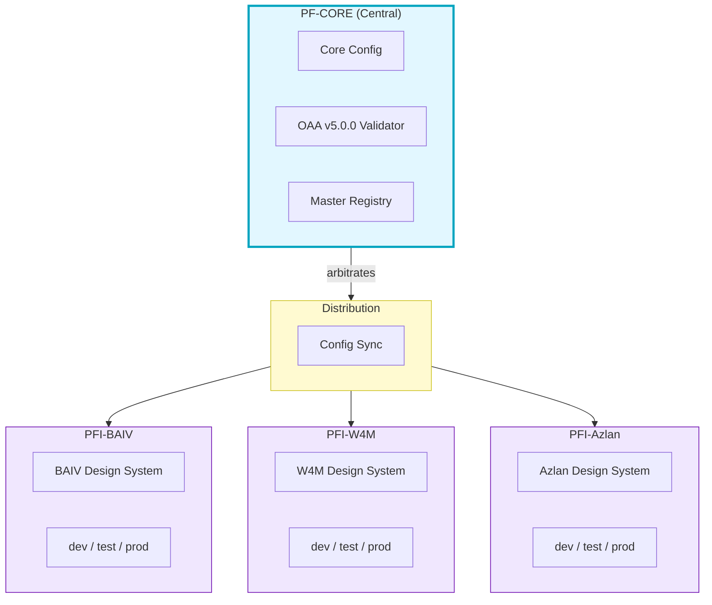
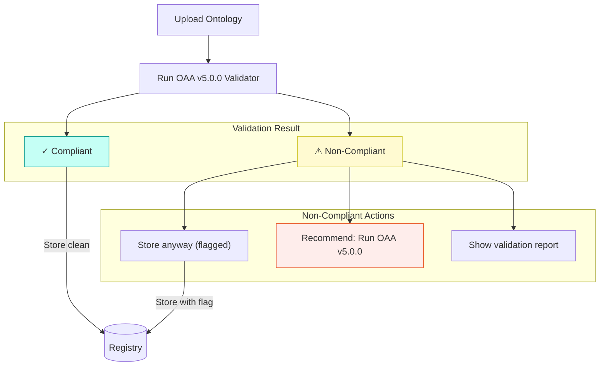
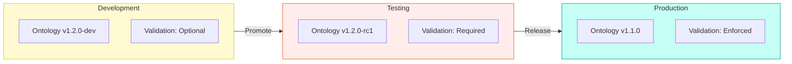
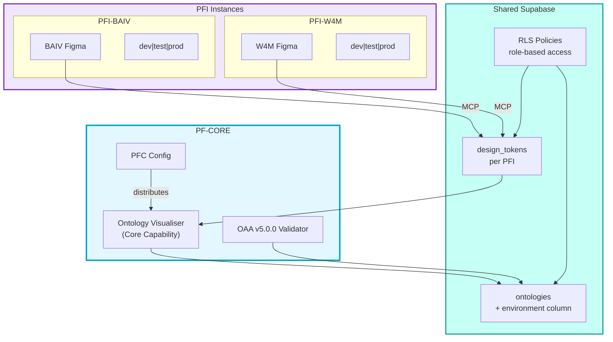

# Ontology Visualiser Enhanced — High Level Design v1.0.0

## Vision

Transform the Ontology Visualiser from a standalone browser tool into a **PFC Core Capability** with:
- Supabase-backed unified registry
- OAA v5.0.0 compliance validation
- Tiered organizational graph modeling
- PFI-customizable theming via Figma design tokens


---

## Feature Set

| # | Feature | Description | Priority |
|---|---------|-------------|----------|
| F1 | Supabase Registry | Store ontologies in JSONB with versioning | High |
| F2 | OAA v5.0.0 Validator | Validate any JSON against v5.0.0 spec | High |
| F3 | Tiered Graph Navigation | Drill-down from org → domain → entity | High |
| F4 | PFI Theming | Customize via Figma design tokens | Medium |
| F5 | Compliance Processor | Auto-upgrade non-compliant ontologies | Medium |
| F6 | Cross-Ontology Links | Connect nodes across ontologies | Low |

---

## Architecture Options

### Option A: Supabase-First (Recommended)

All ontologies stored in Supabase. Visualiser fetches from DB.


**Pros:**
- Single source of truth
- Real-time sync across instances
- Version history built-in
- Cross-ontology queries via SQL

**Cons:**
- Requires Supabase setup per PFI
- Network dependency for all operations

---

### Option B: Hybrid (Local + Sync)

Visualiser works offline with local files. Syncs to Supabase when connected.


**Pros:**
- Works offline
- Fast local operations
- Gradual migration path

**Cons:**
- Sync complexity
- Potential conflicts
- Duplicate storage

---

### Option C: Registry-as-Service

Central PFC registry. PFIs query via API.


**Pros:**
- True single source of truth
- Centralized governance
- Shared validation rules

**Cons:**
- Single point of failure
- Cross-org access control complexity
- Higher infrastructure cost

---

## Database Schema (Option A)

```sql
-- Ontology Registry
CREATE TABLE ontologies (
    id UUID PRIMARY KEY DEFAULT gen_random_uuid(),
    name TEXT NOT NULL,
    version TEXT NOT NULL,
    pfi_id TEXT NOT NULL,           -- Which PFI owns this
    tier TEXT DEFAULT 'domain',     -- 'org', 'domain', 'entity'
    parent_id UUID REFERENCES ontologies(id),

    -- OAA v5.0.0 structure
    definition JSONB NOT NULL,      -- Full ontology JSON
    entities JSONB GENERATED ALWAYS AS (definition->'hasDefinedTerm') STORED,
    relationships JSONB GENERATED ALWAYS AS (definition->'relationships') STORED,

    -- Compliance
    oaa_version TEXT DEFAULT '5.0.0',
    compliance_status TEXT DEFAULT 'pending',
    validation_report JSONB,

    -- Metadata
    created_at TIMESTAMPTZ DEFAULT now(),
    updated_at TIMESTAMPTZ DEFAULT now(),
    created_by TEXT,

    UNIQUE(name, version, pfi_id)
);

-- Graph Nodes (denormalized for fast queries)
CREATE TABLE graph_nodes (
    id UUID PRIMARY KEY DEFAULT gen_random_uuid(),
    ontology_id UUID REFERENCES ontologies(id) ON DELETE CASCADE,
    node_id TEXT NOT NULL,          -- @id from ontology
    label TEXT NOT NULL,
    node_type TEXT,                 -- 'class', 'property', 'external'
    tier TEXT,                      -- Inherited from ontology
    properties JSONB,

    UNIQUE(ontology_id, node_id)
);

-- Graph Edges
CREATE TABLE graph_edges (
    id UUID PRIMARY KEY DEFAULT gen_random_uuid(),
    ontology_id UUID REFERENCES ontologies(id) ON DELETE CASCADE,
    source_node TEXT NOT NULL,
    target_node TEXT NOT NULL,
    edge_type TEXT NOT NULL,        -- 'relationship', 'inheritance', 'reference'
    label TEXT,
    properties JSONB
);

-- Design Tokens (per PFI)
CREATE TABLE design_tokens (
    id UUID PRIMARY KEY DEFAULT gen_random_uuid(),
    pfi_id TEXT NOT NULL,
    figma_file_key TEXT,
    tokens JSONB NOT NULL,          -- Extracted token values
    last_synced_at TIMESTAMPTZ DEFAULT now(),

    UNIQUE(pfi_id)
);

-- Indexes for graph queries
CREATE INDEX idx_nodes_ontology ON graph_nodes(ontology_id);
CREATE INDEX idx_nodes_type ON graph_nodes(node_type);
CREATE INDEX idx_edges_source ON graph_edges(source_node);
CREATE INDEX idx_edges_target ON graph_edges(target_node);
CREATE INDEX idx_ontologies_tier ON ontologies(tier);
CREATE INDEX idx_ontologies_parent ON ontologies(parent_id);
```

---

## OAA v5.0.0 Validation

### Validation Gates (from OAA v5.0.0 Spec)

| Gate | Check | Action on Fail |
|------|-------|----------------|
| G1 | Schema completeness | Block |
| G2 | Relationship cardinality | Block |
| G2B | Entity connectivity (NEW) | Block |
| G2C | Graph connectivity | Warn |
| G3 | Business rules syntax | Block |
| G4 | Glossary completeness | Warn |
| G5 | Test data coverage | Warn |
| G6 | UniRegistry format | Block |

### Validation Flow


---

## Tiered Graph Navigation

### Tier Hierarchy

```
Organization Graph (Tier 0)
└── Domain Ontologies (Tier 1)
    ├── VE Domain
    ├── CE Domain
    ├── Process Domain
    └── ...
        └── Entity Details (Tier 2)
            ├── Properties
            ├── Relationships
            └── Business Rules
```

### Navigation UX


**Interactions:**
- Click node → Drill down to next tier
- Double-click → Expand inline
- Right-click → Context menu (validate, edit, export)
- Breadcrumb navigation at top

---

## DS-E2E Integration (PFI Theming)

### Cross-Reference with ds-e2e-prototype

| DS-E2E Component | Visualiser Integration |
|------------------|------------------------|
| `DS_ACTIVE_BRAND` env var | Determines which Figma file to extract |
| MCP `get_variable_defs()` | Fetches color/typography tokens |
| 3-tier tokens (primitives → semantic → component) | Maps to visualiser CSS variables |
| Supabase `design_tokens` table | Caches extracted tokens |

### Theming Flow


### Token Mapping

```javascript
// Figma semantic tokens → Visualiser CSS
const tokenMapping = {
  // Node colors
  'color.surface.primary': '--vis-node-bg',
  'color.text.primary': '--vis-node-text',
  'color.border.default': '--vis-node-border',

  // Edge colors
  'color.accent.primary': '--vis-edge-relationship',
  'color.accent.secondary': '--vis-edge-inheritance',

  // Typography
  'font.family.body': '--vis-font-family',
  'font.size.sm': '--vis-font-size-label',

  // Spacing
  'spacing.md': '--vis-node-padding',
  'radius.md': '--vis-node-radius'
};
```

---

## Recommended Approach

### Phase 1: Foundation (Option A - Supabase-First)
1. Set up Supabase schema in Azlan (test PFI)
2. Implement OAA v5.0.0 validator as Edge Function
3. Add "Save to Registry" button in visualiser
4. Basic tiered navigation (2 levels)

### Phase 2: Theming
1. Integrate DS-E2E token extraction
2. Add theme switcher to visualiser
3. Store tokens in `design_tokens` table
4. Apply CSS variables dynamically

### Phase 3: Advanced Features
1. Cross-ontology linking
2. Full 3-tier navigation
3. Compliance auto-remediation
4. Organization-wide graph view

---

## Decision Points

| # | Decision | Options | Resolution |
|---|----------|---------|------------|
| D1 | Storage architecture | A (Supabase-First) / B (Hybrid) / C (Central) | **A** - Supabase-First |
| D2 | Validation location | Browser / Edge Function / Both | **Both** - Client + server |
| D3 | Theming source | Figma MCP / Pre-built CSS / Both | **Both** - MCP primary, CSS fallback |
| D4 | Graph library | vis.js (current) / D3 / Cytoscape | **vis.js** - Already integrated |
| D5 | Tier navigation | Separate views / Inline expansion / Both | **Both** - Flexibility |
| D6 | Multi-tenancy | Per-PFI Supabase / Shared with RLS | **Shared** - PFC distributes to PFIs |
| D7 | Compliance enforcement | Block / Allow with warning | **Allow + Recommend** - Non-blocking |
| D8 | Branding control | Open / RBAC-restricted | **RBAC** - Admins only |

---

## Governance Model (RESOLVED)

### PFC → PFI Arbitration



**Key Principles:**
- **One PF-Core config** distributed to all sub-platform PFIs
- **Each PFI** owns its design system (Figma file)
- **PFC arbitrates** validation rules, PFI handles execution
- **Visualiser** = PFC core capability, theming = PFI customization

---

## RBAC & Branding Control

### Default Behavior

| Role | Can View | Can Upload Ontology | Can Change PFI/Brand |
|------|----------|---------------------|----------------------|
| Viewer | ✓ | ✗ | ✗ |
| Editor | ✓ | ✓ | ✗ |
| Admin | ✓ | ✓ | ✓ |

### Brand Switching (RBAC-Protected)

```sql
-- RLS policy: Only admins can modify pfi_config
CREATE POLICY "Admins can modify PFI config"
ON pfi_config
FOR UPDATE
USING (
    auth.jwt() ->> 'role' = 'admin'
);

-- Default PFI loaded on startup
CREATE TABLE pfi_config (
    id UUID PRIMARY KEY DEFAULT gen_random_uuid(),
    pfi_id TEXT NOT NULL DEFAULT 'baiv',
    figma_file_key TEXT,
    is_default BOOLEAN DEFAULT false,
    updated_by UUID REFERENCES auth.users(id),
    updated_at TIMESTAMPTZ DEFAULT now()
);
```

### UI Behavior

- **Non-admins**: See current PFI branding, no switcher visible
- **Admins**: See brand switcher dropdown, can select PFI
- **Default PFI**: Configurable per deployment, defaults to primary brand

---

## Compliance Workflow (RESOLVED)

### Allow + Recommend Approach



**Workflow:**
1. User uploads ontology
2. Validator checks against OAA v5.0.0 gates
3. If non-compliant:
   - **Allow storage** with `compliance_status = 'non-compliant'`
   - **Show recommendation**: "Run OAA v5.0.0 agent to upgrade"
   - **Display report**: Which gates failed
4. Non-compliant ontologies visible but flagged in UI

---

## Environment Model (Dev/Test/Prod)

### Version Flow



### Environment-Specific Rules

| Environment | Compliance Required | OAA Version | Branding |
|-------------|---------------------|-------------|----------|
| **dev** | No (warnings only) | Any | Switchable |
| **test** | Yes (must pass gates) | v5.0.0+ | Locked to target |
| **prod** | Yes (enforced) | v5.0.0+ | Locked |

### Database Schema Addition

```sql
-- Add environment column to ontologies
ALTER TABLE ontologies ADD COLUMN environment TEXT DEFAULT 'dev'
    CHECK (environment IN ('dev', 'test', 'prod'));

-- Environment-specific validation
CREATE OR REPLACE FUNCTION validate_for_environment()
RETURNS TRIGGER AS $$
BEGIN
    -- Prod requires full compliance
    IF NEW.environment = 'prod' AND NEW.compliance_status != 'compliant' THEN
        RAISE EXCEPTION 'Production ontologies must be OAA v5.0.0 compliant';
    END IF;

    -- Test requires validation to have run
    IF NEW.environment = 'test' AND NEW.validation_report IS NULL THEN
        RAISE EXCEPTION 'Test ontologies must have validation report';
    END IF;

    RETURN NEW;
END;
$$ LANGUAGE plpgsql;

CREATE TRIGGER enforce_environment_rules
    BEFORE INSERT OR UPDATE ON ontologies
    FOR EACH ROW EXECUTE FUNCTION validate_for_environment();
```

---

## Updated Architecture



---

## Related Documents

| Document | Location | Relevance |
|----------|----------|-----------|
| DS-E2E Implementation Plan | `PBS/DESIGN-SYSTEM/ds-e2e-prototype-azlan/ds-e2e-implementation-plan-azlan.md` | Token extraction pipeline |
| Azlan DS Config | `PBS/DESIGN-SYSTEM/ds-e2e-prototype-azlan/azlan-ds-config.json` | Brand switching config |
| OAA v5.0.0 System Prompt | `PBS/ONTOLOGIES/pfc-foundation-ont/oaa-system-prompts/oaa-v5.0.0-sys-prompt/` | Validation gates |
| Design System Ontology | `PBS/DESIGN-SYSTEM/ds-e2e-prototype-azlan/design-system-ontology-v1.0.0.json` | Token taxonomy |

---

## Resolved Questions

| # | Question | Resolution |
|---|----------|------------|
| Q1 | Multi-tenancy | Shared Supabase with RLS. PFC config distributed to PFIs. |
| Q2 | Compliance enforcement | Allow non-compliant + recommend OAA v5.0.0 upgrade |
| Q3 | Branding control | RBAC-protected. Default PFI. Only admins can switch. |
| Q4 | Environment handling | dev/test/prod with escalating validation requirements |

## Open Questions

1. **Graph performance**: At what scale (nodes/edges) do we need pagination/virtualization?
2. **Version promotion**: Automated dev→test→prod pipeline, or manual?
3. **Cross-PFI ontology sharing**: Can PFI-A reference ontologies from PFI-B?
4. **Offline mode**: Cache strategy for disconnected usage?

---

*HLD Version: 1.1.0*
*Created: 2026-01-31*
*Updated: 2026-01-31*
*Status: DECISIONS RESOLVED - Ready for Phase 1*
