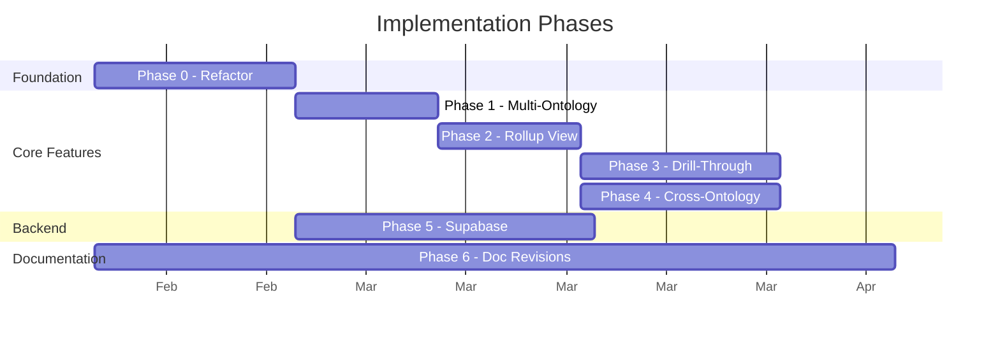
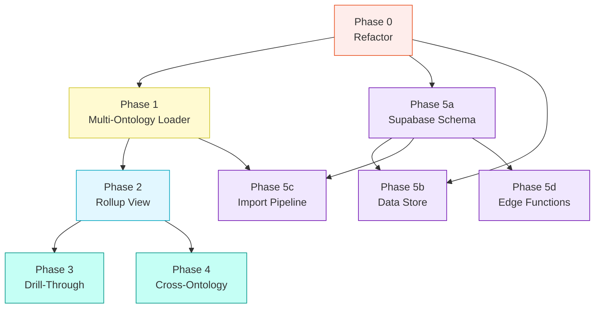

# Implementation Plan: Graph Rollup, Drill-Through & Database Integration

**Version:** 1.0.0
**Date:** 2026-02-04
**Status:** Proposed
**Implements:** [FEATURE-SPEC-Graph-Rollup-DrillThrough-v1.0.0.md](FEATURE-SPEC-Graph-Rollup-DrillThrough-v1.0.0.md)

---

## Current State Assessment

| Dimension | Current | Impact |
|-----------|---------|--------|
| Codebase | Single 2,980-line HTML file (`browser-viewer.html`) | Must modularise before adding features |
| Data model | Flat node/edge arrays, one ontology at a time | Must support multi-ontology graph model |
| Navigation | Zoom/pan on a single graph | Must add tiered drill-through |
| Storage | IndexedDB library (local only) | Must add Supabase backend |
| Deployment | GitHub Pages (static HTML via Actions) | Must support Supabase connection |
| Cross-refs | Not detected or rendered | Must scan namespace prefixes |
| Backlog | 6 epics / 37 features in BACKLOG.md | Must revise to incorporate this spec |
| HLD | v1.1.0, decisions resolved, schema designed | Must update with rollup architecture |

### Risk: Monolith Scale

The 2,980-line single-file architecture was acceptable for the single-ontology viewer but cannot absorb rollup, drill-through, cross-ontology detection, and database sync without becoming unmaintainable. Modularisation in Phase 0 is a prerequisite for all subsequent phases.

---

## Phase Overview

```
Phase 0: Architecture & Refactor       ─ Foundation
Phase 1: Multi-Ontology Loader         ─ Data model
Phase 2: Rollup View (Tier 0)          ─ First user-visible feature
Phase 3: Drill-Through Navigation      ─ Tier 0 → 1 → 2
Phase 4: Cross-Ontology Connections    ─ Edge detection + lineage chains
Phase 5: Supabase Integration          ─ Database backend
Phase 6: Document & Backlog Revisions  ─ Runs in parallel throughout
```



Phases 3 and 4 can run in parallel after Phase 2. Phase 5 can start once Phase 0 completes (independent of the UI features). Phase 6 runs continuously.

---

## Phase 0: Architecture & Refactor

**Objective:** Split the monolithic `browser-viewer.html` into a modular structure that supports multi-ontology loading and database connectivity without breaking the existing GitHub Pages deployment.

### Approach

The viewer currently works as a single HTML file with inline `<style>` and `<script>` blocks. The refactor splits these into ES modules loaded via `<script type="module">`, keeping the HTML file as a shell.

### Target File Structure

```
PBS/TOOLS/ontology-visualiser/
├── browser-viewer.html              ← Shell: HTML structure + module imports
├── css/
│   └── viewer.css                   ← Extracted styles
├── js/
│   ├── app.js                       ← Entry point, initialisation
│   ├── graph-renderer.js            ← vis.js graph setup, layout, physics
│   ├── ontology-parser.js           ← Format detection, node/edge extraction
│   ├── audit-engine.js              ← G1-G6 validation gates
│   ├── compliance-reporter.js       ← Compliance panel rendering
│   ├── library-manager.js           ← IndexedDB operations
│   ├── github-loader.js             ← GitHub API integration
│   ├── ui-panels.js                 ← Side panels, detail views, controls
│   ├── export.js                    ← PNG, JSON, audit export
│   └── data-store.js                ← NEW: abstraction layer over IndexedDB/Supabase
├── lib/                             ← Third-party (vis.js, tom-select) — unchanged
└── ...docs...
```

### Key Decisions

| Decision | Resolution | Rationale |
|----------|------------|-----------|
| Build tool? | No — use native ES modules | Keeps zero-build-step deployment; GitHub Pages serves static files |
| Bundling? | No — module count is small (~10 files) | HTTP/2 handles parallel loads; no bundler dependency |
| TypeScript? | No (not now) | Would require build step; consider in Phase 6 (Package & Distribution) |
| CSS extraction? | Yes — single CSS file | Easier theming when PFI tokens arrive |
| Backward compat? | URL stays the same; `browser-viewer.html` remains the entry point | No user-facing disruption |

### Tasks

| # | Task | Effort |
|---|------|--------|
| 0.1 | Extract CSS into `css/viewer.css` | Small |
| 0.2 | Extract graph rendering (vis.js setup, layout, physics, node styling) into `js/graph-renderer.js` | Medium |
| 0.3 | Extract format detection and parser into `js/ontology-parser.js` | Medium |
| 0.4 | Extract audit gates (G1-G6) into `js/audit-engine.js` | Medium |
| 0.5 | Extract compliance panel into `js/compliance-reporter.js` | Small |
| 0.6 | Extract IndexedDB library ops into `js/library-manager.js` | Small |
| 0.7 | Extract GitHub loader into `js/github-loader.js` | Small |
| 0.8 | Extract UI panel management into `js/ui-panels.js` | Medium |
| 0.9 | Create `js/data-store.js` as storage abstraction (IndexedDB now, Supabase later) | Medium |
| 0.10 | Create `js/app.js` entry point wiring all modules | Small |
| 0.11 | Update `browser-viewer.html` to shell with module imports | Small |
| 0.12 | Verify GitHub Pages deployment still works | Small |
| 0.13 | Regression test: all existing features work post-refactor | Medium |

### Entry Criteria
- Feature spec approved

### Exit Criteria
- All existing features work identically post-refactor
- GitHub Pages deployment succeeds
- Each module has clear exports and no global state leakage
- `data-store.js` abstraction accepts a provider (IndexedDB or Supabase)

---

## Phase 1: Multi-Ontology Loader

**Objective:** Extend the data model and parser to load and hold multiple ontologies simultaneously, with metadata from the unified registry.

### Technical Changes

| Component | Change |
|-----------|--------|
| `ontology-parser.js` | Add `parseRegistry(registryJson)` → returns array of ontology metadata |
| `ontology-parser.js` | Add `parseMultiple(ontologyFiles[])` → returns merged graph model |
| `data-store.js` | Add `loadedOntologies` map (keyed by namespace) |
| `graph-renderer.js` | Accept `{ ontologies: [], crossEdges: [] }` instead of single `{ nodes, edges }` |

### Graph Data Model (New)

```javascript
// Current: flat
{ nodes: DataSet, edges: DataSet }

// New: multi-ontology aware
{
  ontologies: [
    {
      id: "vsom",
      name: "VSOM Ontology",
      series: "VE-Series",
      layer: "strategic",
      compliance: "compliant",
      nodes: [...],
      edges: [...],
      metadata: { version, oaaVersion, ... }
    },
    // ... 22 more
  ],
  crossEdges: [
    { source: "vsom:Vision", target: "okr:Objective", label: "cascadesTo", type: "cross-ontology" },
    // ...
  ],
  series: {
    "VE-Series": { ontologies: ["vsom", "okr", "vp", "rrr", "pmf", "kpi"], compliance: "5/6" },
    // ... 5 more
  }
}
```

### Stories

| ID | From Spec | Summary |
|----|-----------|---------|
| R.1.1 | Feature 1 | Load full library as multi-ontology graph |
| — | New | Parse `ont-registry-index.json` to populate series metadata |
| — | New | Load individual ontology definitions from registry paths |

### Exit Criteria
- Can load `ont-registry-index.json` + all 18 compliant ontology files
- Multi-ontology data model populated with series grouping
- Existing single-file load still works (backward compat)
- 5 placeholder ontologies render as placeholder nodes

---

## Phase 2: Rollup View (Tier 0)

**Objective:** Render the series-level meta-graph as the default entry view when the full library is loaded.

### Visual Design

```
┌─────────────────────────────────────────────────────┐
│  [Home] Library > Series Rollup                      │
│                                                       │
│        ┌──────────┐        ┌──────────┐              │
│        │ VE-Series│───────→│PE-Series │              │
│        │  6 ONTs  │        │  5 ONTs  │              │
│        │ ■■■■■□   │        │ ■■■■■    │              │
│        └────┬─────┘        └────┬─────┘              │
│             │                    │                    │
│        ┌────┴─────┐        ┌────┴─────┐              │
│        │Foundation│        │Security  │              │
│        │  4 ONTs  │        │  4 ONTs  │              │
│        │ ■■■□     │        │ ■□□□     │              │
│        └────┬─────┘        └──────────┘              │
│             │                                        │
│        ┌────┴──────┐   ┌───────────┐                 │
│        │Competitive│   │Orchestratn│                 │
│        │  3 ONTs   │   │  1 ONT    │                 │
│        │ ■■■       │   │ ■         │                 │
│        └───────────┘   └───────────┘                 │
│                                                       │
│  ■ = compliant  □ = placeholder                       │
└─────────────────────────────────────────────────────┘
```

### Technical Changes

| Component | Change |
|-----------|--------|
| `graph-renderer.js` | Add `renderTier0(seriesData)` — creates 6 series super-nodes with compliance badges |
| `graph-renderer.js` | Add `renderTier0Expanded(ontologyData)` — creates 23 ontology nodes grouped by series |
| `js/cross-ref-detector.js` | NEW module: scans loaded ontologies for namespace-prefixed references, builds cross-edge list |
| `ui-panels.js` | Add toggle: "Series View (6 nodes)" / "Ontology View (23 nodes)" |
| `ui-panels.js` | Add lineage chain highlight toggle (VE chain, PE chain) |

### Stories

| ID | From Spec | Summary |
|----|-----------|---------|
| R.1.1 | Feature 1 | Series nodes in rollup graph |
| R.1.2 | Feature 1 | Edges between series showing cross-series dependencies |
| R.1.3 | Feature 1 | Compliance badge on each series node |
| R.1.4 | Feature 1 | VE lineage chain highlighted |
| R.1.5 | Feature 1 | PE lineage chain highlighted |
| R.1.6 | Feature 1 | Toggle Series View / Ontology View |
| R.1.7 | Feature 1 | EMC as central hub |

### Exit Criteria
- Loading the registry displays the 6-node series rollup by default
- Cross-series edges derived from ontology definitions
- VE and PE lineage chains render as gold highlighted paths
- Toggle switches between 6-node and 23-node views
- Compliance badges show correct ratios per series

---

## Phase 3: Drill-Through Navigation

**Objective:** Add tiered navigation from rollup (Tier 0) through ontology graph (Tier 1) to entity detail (Tier 2).

### Technical Changes

| Component | Change |
|-----------|--------|
| `js/navigation.js` | NEW module: manages tier state, breadcrumb, history, transitions |
| `graph-renderer.js` | Add `drillToSeries(seriesId)` — zooms into series, shows constituent ontologies |
| `graph-renderer.js` | Add `drillToOntology(ontologyId)` — expands entity graph for one ontology |
| `graph-renderer.js` | Add `drillToEntity(entityId)` — opens detail panel (existing sidebar behaviour) |
| `ui-panels.js` | Add breadcrumb bar: `Library > VE-Series > VSOM > Entity` |
| `css/viewer.css` | Add transition animations (opacity, zoom) |

### Interaction Map

| User Action | Current Tier | Result |
|-------------|-------------|--------|
| Click series node | Tier 0 | Transition to Tier 1: show ontologies in that series |
| Click ontology node | Tier 1 | Expand entity graph inline, fade other ontologies to 30% |
| Click entity node | Tier 1 (expanded) | Open detail panel (Tier 2) — existing sidebar |
| Click cross-ontology edge | Tier 1 | Navigate to target ontology, highlight target entity |
| Click breadcrumb segment | Any | Navigate back to that tier |
| Click Home button | Any | Return to Tier 0 rollup |
| Press Escape | Tier 1/2 | Go up one tier |

### Stories

| ID | From Spec | Summary |
|----|-----------|---------|
| D.2.1 | Feature 2 | Click series to drill into ontologies |
| D.2.2 | Feature 2 | Click ontology to expand entity graph |
| D.2.3 | Feature 2 | Breadcrumb navigation |
| D.2.4 | Feature 2 | Home button |
| D.2.5 | Feature 2 | Parent context preserved (faded) |
| D.2.6 | Feature 2 | Smooth transitions |
| D.2.7 | Feature 2 | Cross-ontology edge navigation |

### Exit Criteria
- Can navigate Tier 0 → Tier 1 → Tier 2 and back via breadcrumb
- Context preservation: parent nodes visible but faded
- Cross-ontology edge click navigates to target ontology
- Escape key and Home button work
- Existing single-ontology load goes directly to Tier 1 (no regression)

---

## Phase 4: Cross-Ontology Connections

**Objective:** Detect, render, and analyse relationships that span ontology boundaries. Can run in parallel with Phase 3.

### Technical Changes

| Component | Change |
|-----------|--------|
| `js/cross-ref-detector.js` | Extend with bridge node detection (entities referenced by 3+ ontologies) |
| `graph-renderer.js` | Add edge styles: dashed (cross-ref), dotted (extends), thick gold (lineage) |
| `graph-renderer.js` | Add bridge node styling: double border, 1.5x size |
| `ui-panels.js` | Add "Cross-Ontology Only" filter toggle |
| `ui-panels.js` | Add "Connection Map" mode (dependency diagram) |
| `audit-engine.js` | Add cross-ontology dependency counts to audit report |

### Stories

| ID | From Spec | Summary |
|----|-----------|---------|
| X.3.1 | Feature 3 | Cross-ontology edges with dashed styling |
| X.3.2 | Feature 3 | VE lineage chain as navigable path |
| X.3.3 | Feature 3 | PE lineage chain as navigable path |
| X.3.4 | Feature 3 | Bridge node highlighting |
| X.3.5 | Feature 3 | Filter to cross-ontology edges only |
| X.3.6 | Feature 3 | Audit panel cross-dependency counts |
| X.3.7 | Feature 3 | Cross-edge click navigates to target |
| X.3.8 | Feature 3 | Connection Map mode |

### Exit Criteria
- Cross-ontology edges detected from namespace prefixes in `rangeIncludes`
- 5 edge styles rendered correctly
- Bridge nodes (RoleContext, Service, OrganizationContext) highlighted
- Connection Map mode shows dependency diagram without entity-level detail
- Audit panel reports cross-ontology dependency counts

---

## Phase 5: Supabase Integration

**Objective:** Connect the visualiser to a Supabase backend for persistent, shared ontology storage. Can start after Phase 0 completes.

### Sub-Phases

#### 5a: Schema Deployment

| Task | Detail |
|------|--------|
| Create Supabase project | New project (not shared with ds-e2e-prototype) |
| Deploy schema | `ontologies`, `graph_nodes`, `graph_edges`, `cross_ontology_edges`, `design_tokens` tables |
| Configure RLS | Row-level security policies for viewer/editor/admin roles |
| Environment validation trigger | `validate_for_environment()` function |

#### 5b: Data Store Abstraction

| Task | Detail |
|------|--------|
| Implement Supabase provider in `data-store.js` | `SupabaseProvider` class matching `IndexedDBProvider` interface |
| Connection manager | Detect online/offline, switch providers |
| Connection indicator UI | Status badge: Online (green) / Offline (amber) / File (grey) |

#### 5c: Import Pipeline

| Task | Detail |
|------|--------|
| Registry importer | Read `ont-registry-index.json`, load all ontology files, insert into Supabase |
| Graph denormaliser | Extract entities → `graph_nodes`, relationships → `graph_edges` |
| Cross-ref populator | Run cross-ref detector, populate `cross_ontology_edges` table |
| "Sync from Repo" UI button | Trigger import from the browser |

#### 5d: Edge Functions

| Task | Detail |
|------|--------|
| `resolve-graph` | Fetch ontologies + nodes + edges for a given tier/series |
| `validate-ontology` | Run OAA gates on upload, return report |
| `detect-cross-refs` | Scan all ontologies for cross-references |
| `rollup-stats` | Aggregate compliance/count stats per series |

### Stories

| ID | From Spec | Summary |
|----|-----------|---------|
| DB.4.1 | Feature 4 | Connect to Supabase, load from DB |
| DB.4.2 | Feature 4 | Fall back to IndexedDB when offline |
| DB.4.3 | Feature 4 | Import full library into Supabase |
| DB.4.4 | Feature 4 | Series/layer/compliance metadata in DB |
| DB.4.5 | Feature 4 | Cross-ontology edges stored in DB |
| DB.4.6 | Feature 4 | Connection status indicator |
| DB.4.7 | Feature 4 | resolve-graph Edge Function |
| DB.4.8 | Feature 4 | File drop works regardless of DB state |

### Exit Criteria
- Supabase project deployed with full schema
- All 23 ontologies imported and queryable
- Visualiser loads from Supabase when connected
- Graceful fallback to IndexedDB when disconnected
- File drop continues to work in all modes
- Edge Functions deployed and callable from the visualiser

---

## Phase 6: Document & Backlog Revisions

**Objective:** Keep documentation and issue tracking aligned with implementation. Runs in parallel with all other phases.

### Document Updates

| Document | Changes | Trigger |
|----------|---------|---------|
| `BACKLOG.md` | Add stories from this spec under Epic 2; mark superseded stories; add new Epic 7 (Supabase) | After Phase 0 approval |
| `HLD-VISUALISER-ENHANCED-v1.0.0.md` | Update to v1.2.0: add rollup architecture, tier model, modular file structure | After Phase 0 |
| `ARCHITECTURE.md` | Update to v2.0.0: modular file structure, Supabase data flow, ES module architecture | After Phase 0 |
| `OPERATING-GUIDE.md` | Add rollup and drill-through usage instructions | After Phases 2-3 |
| `VISUALISER-DOCS.md` | Add cross-ontology connection documentation | After Phase 4 |
| `DEPLOYMENT.md` | Add Supabase deployment instructions | After Phase 5 |
| `README.md` | Update feature list, screenshots | After Phase 4 |

### GitHub Issues (Azlan-EA-AAA repo)

| Issue | Type | Phase |
|-------|------|-------|
| Epic: Visualiser v3 — Graph Rollup & Drill-Through | Epic | Covers Phases 0-4 |
| Feature: Modularise browser-viewer.html | Feature | Phase 0 |
| Feature: Multi-Ontology Loader | Feature | Phase 1 |
| Feature: Series Rollup View (Tier 0) | Feature | Phase 2 |
| Feature: Drill-Through Navigation (Tier 0→1→2) | Feature | Phase 3 |
| Feature: Cross-Ontology Connection Rendering | Feature | Phase 4 |
| Feature: Supabase Database Integration | Feature | Phase 5 |
| Feature: VE/PE Lineage Chain Visualisation | Feature | Phase 2/4 |
| Feature: Bridge Node Detection & Highlighting | Feature | Phase 4 |
| Feature: Connection Map Mode | Feature | Phase 4 |

---

## Dependency Map



### Critical Path

```
Phase 0 → Phase 1 → Phase 2 → Phase 3
```

Phase 4 and Phase 5 are parallel tracks that can progress independently once their prerequisites are met.

---

## Risks & Mitigations

| # | Risk | Likelihood | Impact | Mitigation |
|---|------|-----------|--------|------------|
| R1 | Refactor breaks existing features | Medium | High | Comprehensive regression test in Phase 0.13; keep old file as `browser-viewer-v2-backup.html` until Phase 2 ships |
| R2 | vis.js performance at 200+ nodes | Low | Medium | vis.js handles 500+ nodes; use clustering if entity-level expansion exceeds 300 |
| R3 | Cross-ontology detection misses implicit references | Medium | Low | Manual review of known cross-refs (listed in feature spec); iterative refinement |
| R4 | ES modules not supported on target browsers | Very Low | High | ES modules supported in all evergreen browsers since 2018; not targeting IE |
| R5 | Supabase cold start latency | Low | Low | IndexedDB cache for recently loaded ontologies; lazy loading on drill-through |
| R6 | GitHub Pages CORS issues with Supabase | Low | Medium | Supabase client SDK handles CORS; Edge Functions have CORS headers |
| R7 | Monolith split introduces circular dependencies | Medium | Medium | Strict module interface design in Phase 0; `data-store.js` is the only shared state |

---

## Review Gates

| Gate | Before Phase | Criteria |
|------|-------------|----------|
| G0 | Phase 0 start | Feature spec approved, implementation plan approved |
| G1 | Phase 1 start | Refactored viewer deployed to GitHub Pages, all existing features pass regression |
| G2 | Phase 2 start | Multi-ontology data model loads all 23 ontologies, single-file load unchanged |
| G3 | Phase 3 start | Rollup view renders correctly with series nodes and cross-series edges |
| G4 | Phase 5c start | Supabase schema deployed, data-store abstraction tested with both providers |

---

## Relationship to INS-PPL-AZL

The INS-PPL-AZL repo ([Feature TODO](https://github.com/ajrmooreuk/INS-PPL-AZL/blob/main/PBS/DOCS/INS-PPL-AZL-Feature-TODO.md)) contains issue [#63](https://github.com/ajrmooreuk/INS-PPL-AZL/issues/63) — "EA Enterprise Architecture Graph" — which is the consumer of this visualiser capability. Once Phases 2-4 are complete, the rollup view can load the INS-PPL-AZL ontologies (AZALZ, MCSB, RCSG) alongside the Azlan-EA-AAA library to provide a unified enterprise architecture graph.

---

*Implementation Plan v1.0.0 | 04 February 2026*
*Azlan-EA-AAA Ontology Visualiser*
