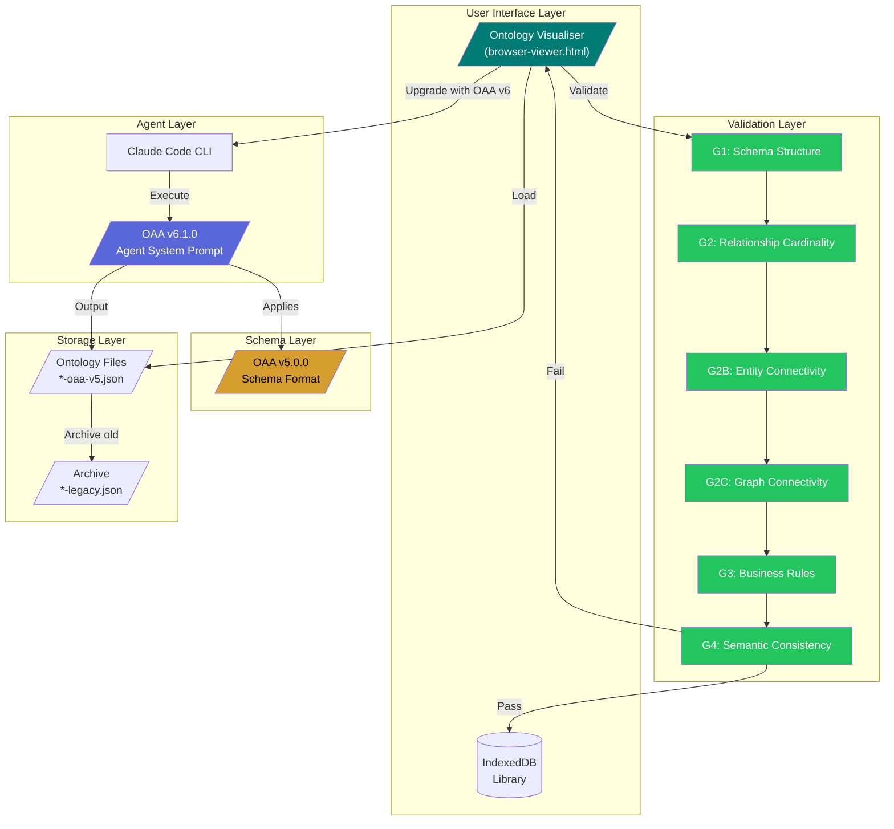
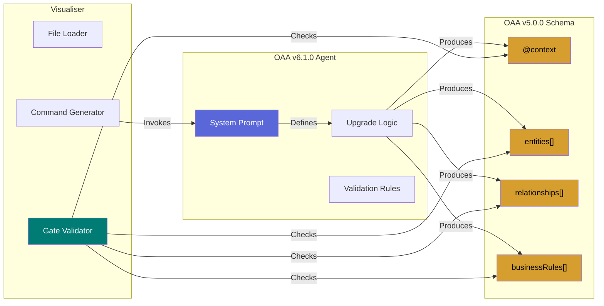
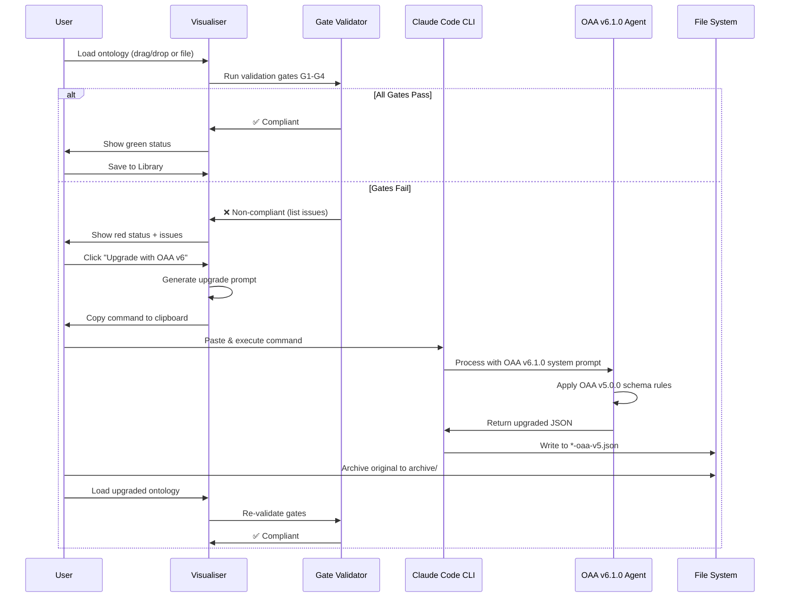
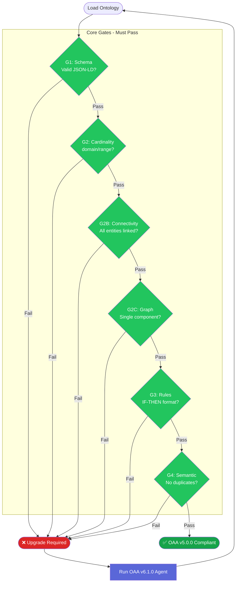
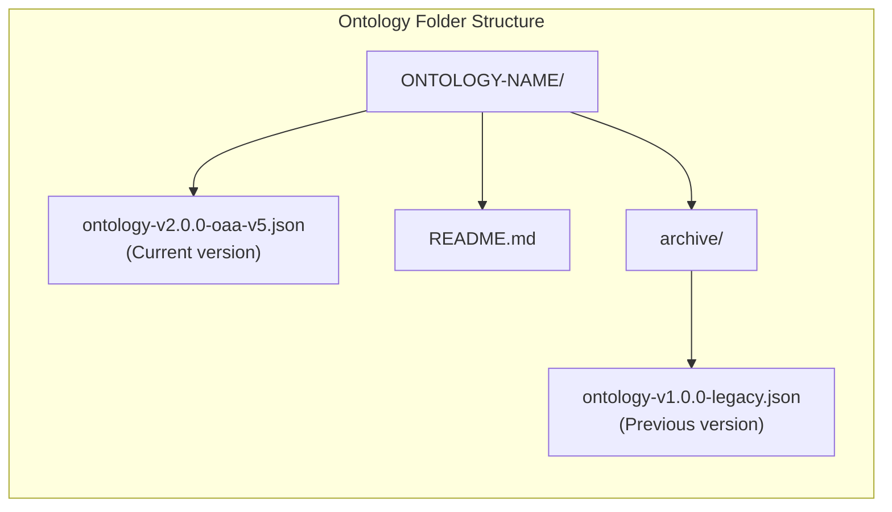
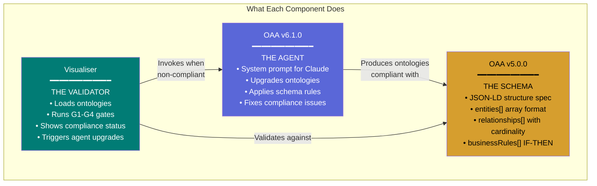

# OAA Ontology Workbench - Architecture & Process Guide

**Version:** 1.0.0
**Date:** 2026-02-01

---

## Component Overview

| Component | Version | Type | Purpose |
|-----------|---------|------|---------|
| **OAA v6.1.0** | 6.1.0 | Agent (System Prompt) | AI agent that upgrades/creates ontologies |
| **OAA v5.0.0** | 5.0.0 | Schema Format | JSON-LD structure specification for ontologies |
| **Visualiser** | 1.1.0 | Browser Tool | Validates ontologies, triggers agent |

---

## Architecture Diagram



---

## Component Relationships



---

## Process Flow - Ontology Upgrade



---

## Gate Validation Process



---

## OAA v5.0.0 Schema Structure

```mermaid
graph TD
    subgraph "OAA v5.0.0 Ontology Structure"
        ROOT["Ontology JSON-LD"]

        CTX["@context<br/>schema.org, oaa, rdfs, owl"]
        ID["@id<br/>Ontology URI"]
        TYPE["@type: owl:Ontology"]
        META["Metadata<br/>name, description, version"]

        ENT["entities[]<br/>Array of entity definitions"]
        REL["relationships[]<br/>Array with cardinality"]
        RULES["businessRules[]<br/>condition/action format"]
        CTRL["changeControl<br/>Version history"]
    end

    ROOT --> CTX
    ROOT --> ID
    ROOT --> TYPE
    ROOT --> META
    ROOT --> ENT
    ROOT --> REL
    ROOT --> RULES
    ROOT --> CTRL

    subgraph "Entity Structure"
        E_ID["@id: namespace:EntityName"]
        E_TYPE["@type: rdfs:Class"]
        E_NAME["name"]
        E_SUB["rdfs:subClassOf"]
        E_DESC["description"]
        E_PROPS["oaa:properties[]"]
    end

    ENT --> E_ID
    ENT --> E_TYPE
    ENT --> E_NAME
    ENT --> E_SUB
    ENT --> E_DESC
    ENT --> E_PROPS

    subgraph "Relationship Structure"
        R_ID["@id: namespace:relationName"]
        R_TYPE["@type: owl:ObjectProperty"]
        R_DOM["domainIncludes[]"]
        R_RNG["rangeIncludes[]"]
        R_CARD["oaa:cardinality"]
    end

    REL --> R_ID
    REL --> R_TYPE
    REL --> R_DOM
    REL --> R_RNG
    REL --> R_CARD

    subgraph "Business Rule Structure"
        BR_ID["@id: namespace:BR-XXX"]
        BR_NAME["name"]
        BR_COND["condition: IF..."]
        BR_ACT["action: THEN...MUST"]
        BR_SEV["severity: error|warning"]
    end

    RULES --> BR_ID
    RULES --> BR_NAME
    RULES --> BR_COND
    RULES --> BR_ACT
    RULES --> BR_SEV

    style ROOT fill:#d69e2e,color:#000
    style ENT fill:#3b82f6,color:#fff
    style REL fill:#8b5cf6,color:#fff
    style RULES fill:#ec4899,color:#fff
```



---

## Step-by-Step Upgrade Process

### Step 1: Load Ontology in Visualiser

```
1. Open https://ajrmooreuk.github.io/Azlan-EA-AAA/
2. Drag & drop ontology JSON file
   OR paste GitHub raw URL
   OR select from Library
```

### Step 2: Review Compliance Status

```
┌─────────────────────────────────────────┐
│ OAA v5.0.0 Compliance                   │
├─────────────────────────────────────────┤
│ G1: Schema Structure      ✅ PASS       │
│ G2: Relationship Cardinality  ❌ FAIL   │
│ G2B: Entity Connectivity  ❌ FAIL       │
│ G2C: Graph Connectivity   ⚠️ WARN       │
│ G3: Business Rules        ❌ FAIL       │
│ G4: Semantic Consistency  ✅ PASS       │
├─────────────────────────────────────────┤
│ Status: NON-COMPLIANT                   │
│ [Upgrade with OAA v6] button visible    │
└─────────────────────────────────────────┘
```

### Step 3: Generate Upgrade Command

```
1. Click "Upgrade with OAA v6" button
2. Modal shows generated command
3. Click "Copy Command"
```

### Step 4: Execute OAA v6.1.0 Agent

```bash
# Paste in terminal with Claude Code installed
claude -p 'You are OAA v6.1.0. Upgrade this ontology to OAA v5.0.0 compliance.

## Issues to Fix
- G2: Missing domainIncludes/rangeIncludes
- G2B: Orphaned entities (no relationships)
- G3: Business rules not in IF-THEN format

## Current Ontology
{...json...}

Output ONLY the upgraded JSON.' > ontology-v2.0.0-oaa-v5.json
```

### Step 5: Archive & Reload

```
1. Move original to archive/ folder
2. Rename with -legacy suffix
3. Load upgraded file in Visualiser
4. Verify all gates now pass ✅
```

### Step 6: Save to Library

```
1. Click "Save to Library"
2. Enter version number
3. Add change notes
4. Previous version auto-archived
```

---

## File Naming Convention



| Pattern | Example | Purpose |
|---------|---------|---------|
| Folder | `PPM-ONT/` | UPPERCASE-ONT |
| Current | `ppm-module-v3.0.0-oaa-v5.json` | OAA v5.0.0 compliant |
| Legacy | `archive/ppm-module-v2.2.1-legacy.json` | Pre-upgrade version |
| README | `README.md` | Documentation |

---

## Summary



---

*OAA Ontology Workbench v1.1.0 | Be AI Visible Platform*
