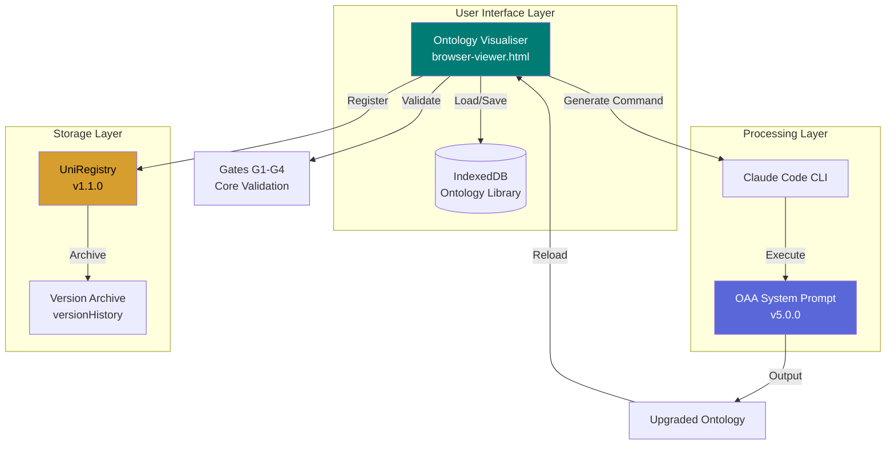
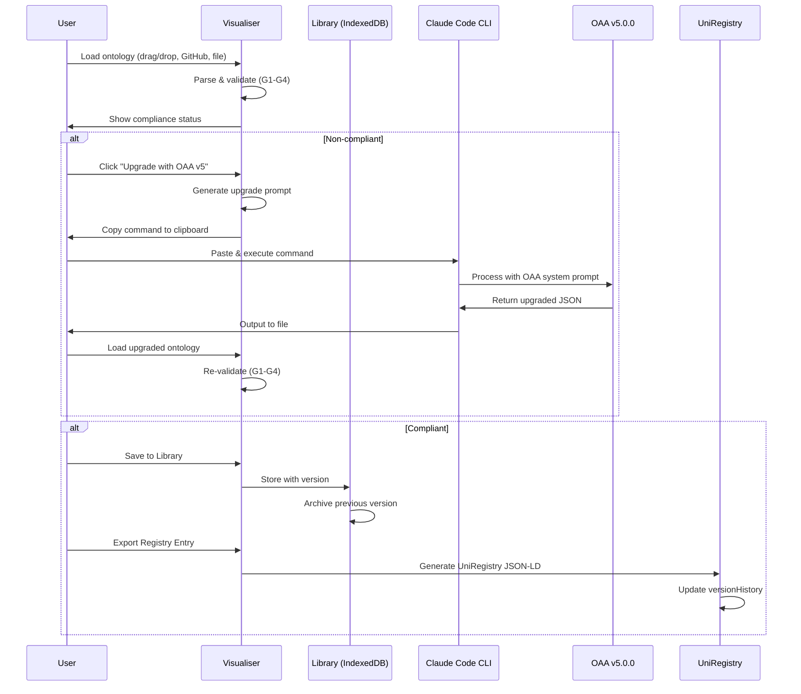
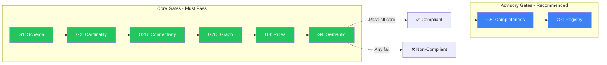
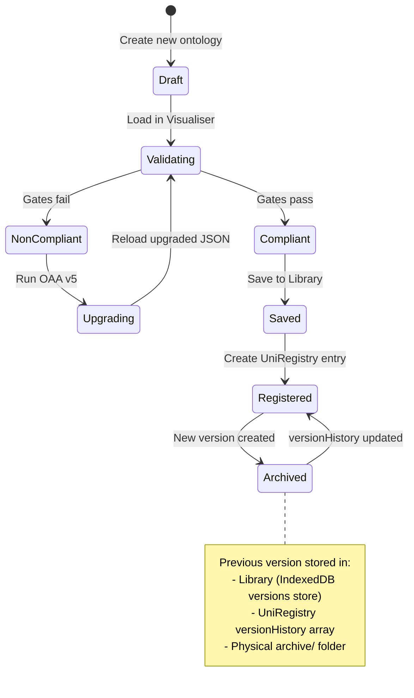

# OAA Ontology Workbench

**Version:** 1.0.0
**Status:** Production
**Last Updated:** 2026-01-31

---

## Overview

The **OAA Ontology Workbench** is an integrated toolchain for ontology lifecycle management, combining:

| Component | Purpose | Location |
|-----------|---------|----------|
| **Ontology Visualiser** | Visual inspection, validation, library management | Azlan-EA-AAA |
| **OAA System Prompt** | AI-powered ontology creation and upgrade | PF-Core-BAIV |
| **UniRegistry** | Centralized artifact versioning and audit trail | PF-Core-BAIV |

This integration enables a complete **create → validate → upgrade → archive** workflow for enterprise ontologies.

---

## Architecture



---

## Component Integration

### Data Flow Architecture



---

## Validation Gates

The Workbench enforces **OAA v5.0.0 compliance** through two gate categories:

### Core Gates (Required for Compliance)

| Gate | Name | Validation |
|------|------|------------|
| **G1** | Schema Structure | Valid JSON-LD with @context, entities array |
| **G2** | Relationship Cardinality | All relationships have domainIncludes/rangeIncludes |
| **G2B** | Entity Connectivity | Every entity participates in ≥1 relationship |
| **G2C** | Graph Connectivity | Single connected component (no islands) |
| **G3** | Business Rules | Rules in IF-THEN format with severity |
| **G4** | Semantic Consistency | No duplicate IDs, valid references |

### Advisory Gates (Recommendations)

| Gate | Name | Recommendation |
|------|------|----------------|
| **G5** | Completeness | Descriptions ≥20 chars, test data coverage |
| **G6** | UniRegistry Entry | Registered in UniRegistry with metadata |



---

## Version Management Workflow



---

## Step-by-Step Operations

### Operation 1: Validate an Existing Ontology

```
1. Open Visualiser: https://ajrmooreuk.github.io/Azlan-EA-AAA/
2. Load ontology via:
   - Drag & drop JSON file
   - Paste GitHub raw URL
   - Select from Library
3. View "OAA v5.0.0 Compliance" panel
4. Review gate status (✅ pass, ⚠️ warn, ❌ fail)
```

### Operation 2: Upgrade a Non-Compliant Ontology

```
1. Load non-compliant ontology in Visualiser
2. Click "Upgrade with OAA v5" button
3. In modal, click "Copy Command"
4. Open terminal with Claude Code installed
5. Paste and execute:
   claude -p '<prompt>' > ontology-oaa-v5-upgraded.json
6. Wait for Claude to generate upgraded ontology
7. Load output file back into Visualiser
8. Verify all gates pass
```

### Operation 3: Save to Library with Version History

```
1. Load compliant ontology
2. Click "Save to Library"
3. Enter:
   - Name (e.g., "Customer Order Ontology")
   - Category (e.g., "Commerce")
   - Version (auto-incremented if updating)
   - Notes (optional)
4. Click "Save"
5. Previous version auto-archived to versions store
```

### Operation 4: View Version History

```
1. Click "Library" button
2. Find ontology in list
3. Click "History" button
4. View all previous versions with:
   - Version number
   - Archive timestamp
   - Notes
5. Click "Restore" to load any previous version
```

### Operation 5: Create UniRegistry Entry

```
1. Load compliant ontology
2. Export registry entry:
   - Click "Export" → "UniRegistry Entry"
   - Or manually create JSON-LD following schema
3. Include in registry entry:
   - registryMetadata (entryType, name, version, status)
   - artifactDefinition (capabilities, entities, relationships)
   - qualityMetrics (compliance scores, gates passed)
   - versionHistory (empty for new, populated on updates)
4. Save to artifact's registry-entry-v*.jsonld file
```

---

## UniRegistry Schema v1.1.0

The UniRegistry supports full version tracking:

```json
{
  "@context": "https://baiv.co.uk/context/uniregistry/v1",
  "@type": "UniRegistryEntry",
  "@id": "baiv:uniregistry:ontology:example",
  "registryMetadata": {
    "entryType": "ontology",
    "entryId": "Entry-ONT-001",
    "name": "Example Ontology",
    "version": "2.0.0",
    "status": "active"
  },
  "versionHistory": [
    {
      "version": "1.0.0",
      "archivedAt": "2026-01-31T10:00:00Z",
      "archivedBy": "OAA-v5.0.0",
      "registryEntryPath": "archive/registry-entry-v1.0.0.jsonld",
      "artifactPath": "archive/example-ontology-v1.0.0.json",
      "changeReason": "Upgraded to OAA v5.0.0 compliance",
      "qualityMetricsSnapshot": {
        "overallScore": 65,
        "validationStatus": "non-compliant",
        "gatesPassed": 3
      }
    }
  ]
}
```

---

## File Organization

### Recommended Artifact Structure

```
ontology-name/
├── ontology-name-v2.0.0.json           # Current version
├── registry-entry-v2.0.0.jsonld        # Current registry entry
├── glossary-v2.0.0.md                  # Glossary (if applicable)
├── test-data-v2.0.0.json               # Test instances
├── README.md                           # Documentation
└── archive/
    ├── ontology-name-v1.0.0.json       # Archived version
    ├── registry-entry-v1.0.0.jsonld    # Archived registry
    └── upgrade-notes-v1-to-v2.md       # Change documentation
```

---

## Integration Points

### Claude Code CLI Commands

```bash
# Upgrade ontology with inline prompt
claude -p 'You are OAA v5.0.0. Upgrade this ontology...' > output.json

# Upgrade ontology from file
claude -p "Upgrade to OAA v5.0.0 compliance" < input.json > output.json

# Use OAA system prompt file
claude --system-prompt oaa-system-prompt-v5.0.0.md < input.json
```

### GitHub Actions Integration

```yaml
# Validate ontologies on PR
- name: Validate Ontology
  run: |
    node validate-oaa-v5.js ontology.json
    # Fails if any core gate (G1-G4) fails
```

### Programmatic Access (IndexedDB)

```javascript
// Access Library from browser console
const db = await indexedDB.open('OntologyLibrary', 1);
const tx = db.transaction(['ontologies', 'versions'], 'readonly');

// Get all ontologies
const ontologies = await tx.objectStore('ontologies').getAll();

// Get version history for ontology ID
const versions = await tx.objectStore('versions').index('ontologyId').getAll(ontologyId);
```

---

## Naming: OAA Ontology Workbench

Recommended name: **OAA Ontology Workbench**

| Alternative | Pros | Cons |
|-------------|------|------|
| OAA Ontology Workbench | Clear purpose, includes OAA branding | Slightly long |
| Ontology Lifecycle Platform | Descriptive, enterprise-friendly | Doesn't mention OAA |
| OAV Stack | Short, technical | Not self-explanatory |
| OAA Design Studio | Creative, modern | "Design" may be misleading |
| Unified Ontology Manager | Clear scope | Generic |

**Recommendation:** Use "OAA Ontology Workbench" for the integrated toolchain, with component-specific names:
- **OAA Visualiser** - The browser-based viewer
- **OAA Architect** - The Claude-powered upgrade agent
- **UniRegistry** - The version-controlled artifact registry

---

## Roadmap

### Current (v1.0)
- [x] Visualiser with OAA v5.0.0 validation
- [x] Claude Code CLI integration for upgrades
- [x] IndexedDB Library with version history
- [x] UniRegistry schema with versionHistory

### Planned (v1.1)
- [ ] Direct file write via File System Access API
- [ ] Batch validation of multiple ontologies
- [ ] Export to multiple formats (OWL, SKOS)
- [ ] Collaborative editing via Supabase

### Future (v2.0)
- [ ] Real-time streaming from Claude API
- [ ] Visual ontology editor (drag & drop)
- [ ] Automated CI/CD validation hooks
- [ ] Cross-ontology dependency visualization

---

## References

| Resource | Path |
|----------|------|
| Ontology Visualiser | `Azlan-EA-AAA/PBS/TOOLS/ontology-visualiser/` |
| OAA System Prompt v5.0.0 | `PF-Core-BAIV/PBS/ONTOLOGIES/pfc-foundation-ont/oaa-system-prompts/` |
| UniRegistry Schema v1.1 | `PF-Core-BAIV/PBS/ARCHITECTURE/unified-register/uniregistry-mvp-v1.0/` |
| Test Ontology (non-compliant) | `Azlan-EA-AAA/PBS/TOOLS/ontology-visualiser/test-data/test-non-compliant-ontology.json` |

---

*OAA Ontology Workbench v1.0.0 | Be AI Visible Platform*
