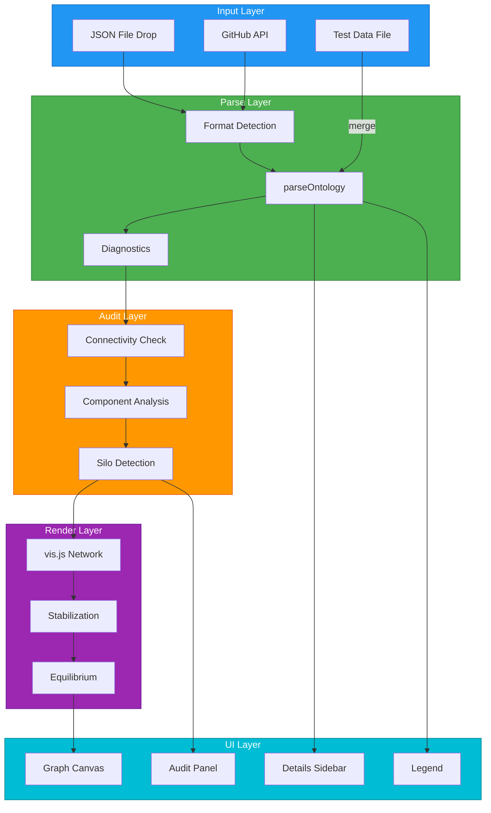
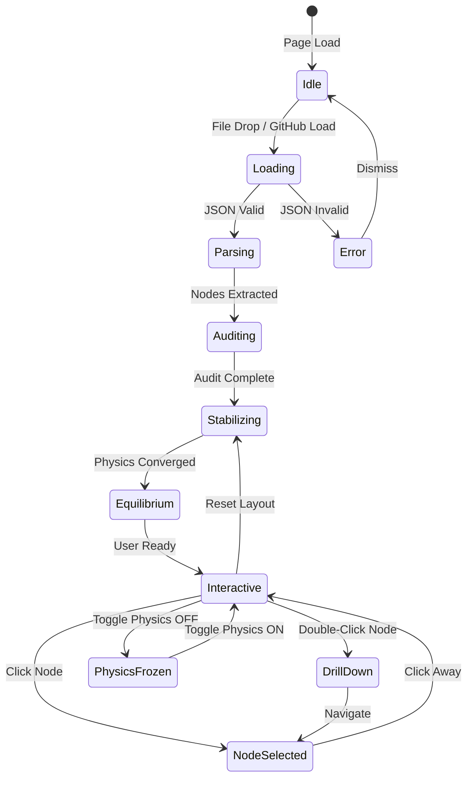
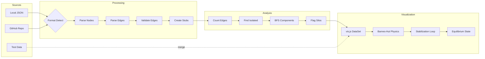
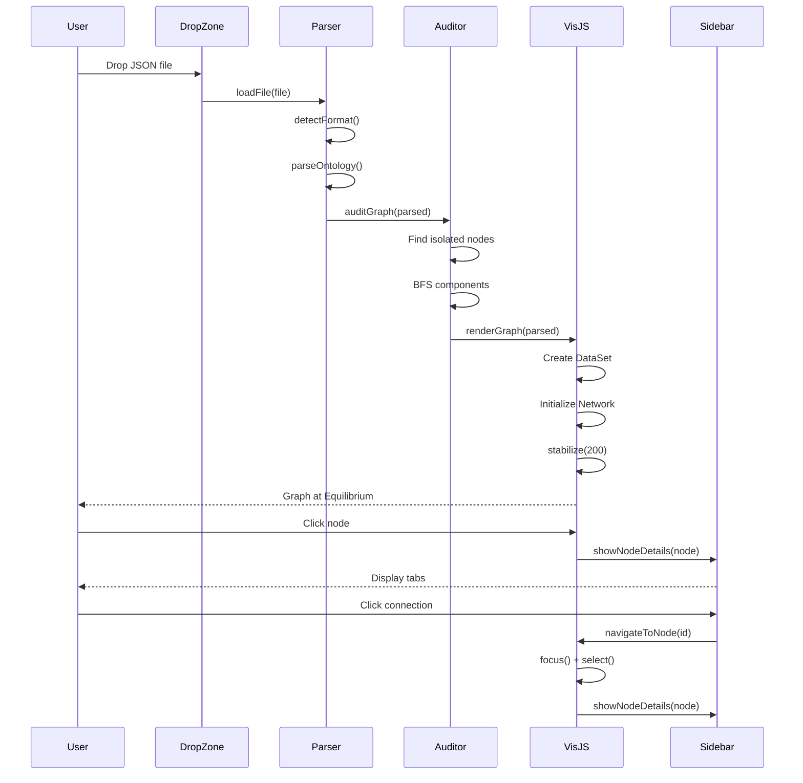

# OAA Ontology Visualiser — Technical Documentation

**Version:** 2.0.0
**Date:** 2026-01-28

---

## Technology Stack

### vis.js (vis-network)
**What:** A JavaScript library for dynamic, browser-based network/graph visualization.

**Why:** Provides force-directed layouts, physics simulation, pan/zoom, node selection, and event handling out of the box. No server required — runs entirely in the browser.

**CDN:** `https://unpkg.com/vis-network/standalone/umd/vis-network.min.js`

**Key APIs Used:**
| API | Purpose |
|-----|---------|
| `new vis.Network(container, data, options)` | Initialize the graph visualization |
| `vis.DataSet(nodes)` | Reactive data structure for nodes |
| `vis.DataSet(edges)` | Reactive data structure for edges |
| `network.on('click', fn)` | Handle node/edge clicks |
| `network.on('doubleClick', fn)` | Handle double-click for drill-down |
| `network.focus(nodeId, options)` | Animate camera to a node |
| `network.selectNodes([ids])` | Programmatically select nodes |
| `network.fit()` | Zoom to fit all nodes in view |
| `network.stabilize(iterations)` | Run physics simulation |
| `network.setOptions(opts)` | Update physics/layout at runtime |

**Documentation:** https://visjs.github.io/vis-network/docs/network/

---

### HTML5 File API
**What:** Browser API for reading files dropped or selected by the user.

**Why:** Enables drag-and-drop JSON loading without a server.

**Key APIs Used:**
| API | Purpose |
|-----|---------|
| `FileReader()` | Read file contents asynchronously |
| `reader.readAsText(file)` | Read as UTF-8 string |
| `reader.onload` | Callback when file is loaded |
| `DataTransfer.files` | Access dropped files from drag event |

---

### GitHub REST API
**What:** GitHub's HTTP API for accessing repository contents.

**Why:** Enables loading ontologies directly from private GitHub repos (with PAT).

**Endpoint Used:**
```
GET /repos/{owner}/{repo}/contents/{path}
Accept: application/vnd.github.v3.raw
Authorization: token {PAT}
```

---

### CSS Custom Properties & Flexbox
**What:** Modern CSS for layout and theming.

**Why:** Dark theme, responsive panels, smooth transitions without external CSS frameworks.

---

### Canvas API (via vis.js)
**What:** HTML5 Canvas for 2D rendering.

**Why:** vis.js renders the graph to a `<canvas>` element for performance. Used for PNG export via `canvas.toDataURL()`.

---

## Architecture Overview



---

## State Machine



---

## Lifecycle Phases

### Phase 1: IDLE
Initial page state. Drop zone visible, no graph rendered.

### Phase 2: LOADING
File being read (local) or fetched (GitHub API).

### Phase 3: PARSING
`parseOntology()` extracts nodes and edges based on detected format:
- `agent-registry` — Agents with dependencies
- `registry-entry` — UniRegistry wrapper
- `uni-registry` — Full ontology definition
- `pf-ontology` — PF-Core entities format
- `jsonld` — Standard JSON-LD @graph
- `generic` — Fallback object traversal

### Phase 4: AUDITING
`auditGraph()` analyzes connectivity:
- Counts incoming/outgoing edges per node
- Identifies isolated nodes (zero edges)
- Runs BFS to find connected components
- Flags silos (disconnected clusters)

### Phase 5: STABILIZING
vis.js physics engine runs iterations:
- **Algorithm:** Barnes-Hut (O(n log n))
- **Gravitational Constant:** -3000 (repulsion)
- **Spring Length:** 150px (ideal edge length)
- **Iterations:** 200 max before timeout

### Phase 6: EQUILIBRIUM
Physics converged — nodes at rest in optimal positions. This is the **initial stable state**.

### Phase 7: INTERACTIVE
User can:
- Pan/zoom the canvas
- Click nodes to inspect
- Double-click to drill into connections
- Toggle physics on/off
- Switch layouts
- Export PNG

---

## Glossary

| Term | Definition |
|------|------------|
| **Stabilization** | The process where vis.js runs physics simulation iterations until the graph reaches a stable configuration. Nodes move from random/seeded positions toward equilibrium. |
| **Equilibrium** | The state where all forces (repulsion between nodes, spring tension on edges) are balanced. Nodes stop moving. This is the "settled" graph. |
| **Force-Directed Layout** | A graph layout algorithm where nodes repel each other (like electric charges) and edges act like springs pulling connected nodes together. |
| **Barnes-Hut Algorithm** | An optimization for force calculations that groups distant nodes, reducing complexity from O(n²) to O(n log n). |
| **Physics Engine** | The simulation system that calculates forces and updates node positions each frame. Can be toggled on/off. |
| **Gravitational Constant** | Controls repulsion strength. Negative = nodes push apart. More negative = stronger repulsion = more spread out graph. |
| **Spring Length** | The "ideal" distance edges want to be. Shorter = tighter clusters. Longer = more spread. |
| **Silo / Isolated Node** | A node with zero edges (no connections). Highlighted with orange dashed border. |
| **Connected Component** | A group of nodes where every node can reach every other node via edges. A fully connected graph has 1 component. |
| **Disconnected Cluster** | A connected component that is separate from the main graph. Indicates potential ontology issues. |
| **Hierarchical Layout** | Alternative layout where nodes are arranged in tree-like levels based on edge direction. Physics disabled. |
| **Circular Layout** | Nodes arranged in a circle, then briefly simulated to spread, then frozen. |
| **Drill-Down** | Navigation from one node to a connected node via the Connections tab. Double-click triggers this. |

---

## Reset to Initial State

To restore the graph to its initial stabilized equilibrium:

### Option 1: Re-render (Full Reset)
```javascript
// Re-parse and re-render from stored data
if (currentData) {
  const parsed = parseOntology(currentData, 'reset');
  renderGraph(parsed);
}
```

### Option 2: Re-stabilize (Soft Reset)
```javascript
// Re-run physics stabilization without re-parsing
if (network) {
  network.setOptions({ physics: { enabled: true } });
  network.stabilize(200);
}
```

### Option 3: Fit to View (Position Reset)
```javascript
// Just reset zoom/pan to show all nodes
if (network) {
  network.fit({ animation: true });
}
```

### Implementation: Add Reset Button

To add a "Reset" button to the toolbar:

```html
<button onclick="resetGraph()">Reset</button>
```

```javascript
function resetGraph() {
  if (!currentData) return;

  // Re-parse from original data
  const parsed = parseOntology(currentData, document.getElementById('file-name').textContent || 'reset');

  // Re-render (triggers stabilization)
  renderGraph(parsed);

  // Close panels
  document.getElementById('sidebar').classList.remove('open');
  document.getElementById('audit-panel').classList.remove('open');

  // Reset physics toggle state
  physicsEnabled = true;
  document.getElementById('btn-physics').classList.add('active');
}
```

---

## Data Flow Diagram



---

## Component Interaction



---

## File Structure

```
tools/ontology-visualiser/
├── browser-viewer.html          # Main application (standalone)
├── sample-ontology-with-data.json   # Demo ontology with test data
├── sample-test-data.json        # Standalone test data file
├── VISUALISER-DOCS.md           # This documentation
└── lib/                         # (Optional) vendored dependencies
```

---

## Supported Formats

| Format | Detection Key | Example Structure |
|--------|--------------|-------------------|
| Agent Registry | `agents[]` | `{ "agents": [{ "id": "...", "dependencies": [] }] }` |
| Registry Entry | `registryEntry` | `{ "registryEntry": { "summary": { "entities": [] } } }` |
| UniRegistry | `ontologyDefinition` | `{ "ontologyDefinition": { "@graph": [], "entities": [] } }` |
| PF Ontology | `entities[]` | `{ "entities": [{ "@id": "...", "name": "..." }] }` |
| JSON-LD | `@graph` or `classes` | `{ "@graph": [{ "@id": "...", "rdfs:subClassOf": "..." }] }` |
| Generic | (fallback) | Any JSON object — traverses keys recursively |

---

## Physics Parameters

| Parameter | Value | Effect |
|-----------|-------|--------|
| `gravitationalConstant` | -3000 | Repulsion strength (more negative = more spread) |
| `springLength` | 150 | Ideal edge length in pixels |
| `stabilization.iterations` | 200 | Max iterations before stopping |
| `barnesHut.theta` | 0.5 | Approximation threshold (default) |

To customize, modify the `options` object in `renderGraph()`.

---

*OAA Ontology Visualiser v2.0.0 — Documentation*
