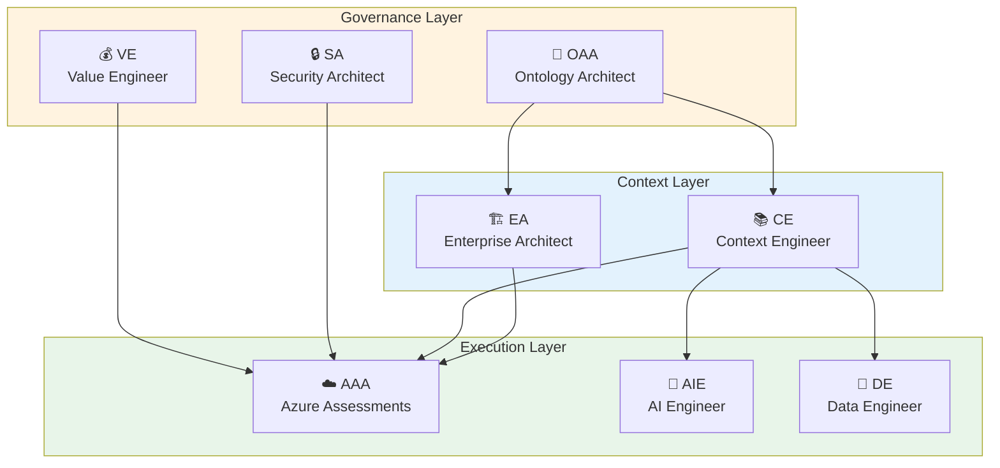

# Azlan-EA-AAA
## Azure Assessments Architect - Enterprise Architecture Agentic AI Tools

---

## Overview

**Azlan-EA-AAA** (Azure Assessments Architect) is an agentic AI-augmented toolkit for Azure architectural assessments and enterprise architecture activities. It follows the **PF (Platform Framework)** patterns for building intelligent, context-aware agents.

### Purpose

Build and operate a suite of Agentic-AI Augmented tools and smart applications to assist Azure Architectural needs:

- **Enterprise Architecture** - Organisation-wide cloud strategy and governance
- **AI-Augmented Solutions** - Intelligent assessment and recommendation engines
- **Well-Architected Reviews** - Automated Azure WAF assessments
- **Cloud Adoption Framework** - CAF-aligned migration and modernisation
- **Landing Zone Design** - Secure, scalable Azure foundations

---

## Agent Framework

### Core Agents (PF Pattern)

| Agent | Code | Purpose |
|-------|------|---------|
| **Ontology Architect** | OAA | Domain model management, semantic consistency |
| **Value Engineer** | VE | Benefits tracking, ROI analysis, cost optimisation |
| **Context Engineer** | CE | Organisation/AI context, knowledge management |
| **Enterprise Architect** | EA | Solution design, architecture patterns |
| **Azure Assessments Architect** | AAA | Well-Architected, CAF, Landing Zone assessments |
| **AI Engineer** | AIE | AI/ML integration, Copilot patterns |
| **Security Architect** | SA | MCSB, Zero Trust, compliance |
| **Data Engineer** | DE | Data architecture, governance |

### Agent Hierarchy



---

## Directory Structure

```
Azlan-EA-AAA/
├── 1-Architecture/              # Role-based architecture resources
│   ├── 0.1-OAA-Ontology-Architect/
│   ├── 0.2-VE-Value-Engineer/
│   ├── 0.3-CE-Context-Engineer/
│   ├── 0.4-EA-Enterprise-Architect/
│   ├── 0.5-AAA-Azure-Assessments/
│   ├── 0.6-AI-Engineer/
│   ├── 0.7-Security-Architect/
│   └── 0.8-Data-Engineer/
├── 2-AAA-Modules/               # Azure Assessment Modules
│   ├── Well-Architected/        # WAF pillars
│   ├── CAF-Cloud-Adoption/      # Cloud Adoption Framework
│   └── Landing-Zones/           # Azure Landing Zones
├── 3-Skills/                    # Agentic skills
│   ├── assessment-skills/
│   └── architecture-skills/
├── 4-Instances/                 # Project instances
├── Agentic/                     # Agent definitions
│   └── agents/
├── Ontology-Management/         # Domain ontologies
└── std-docs/                    # Standard documents
```

---

## Azure Assessment Modules

### Well-Architected Framework (WAF)

| Pillar | Assessment Focus |
|--------|------------------|
| **Reliability** | Availability, recovery, resilience |
| **Security** | Identity, data protection, threat protection |
| **Cost Optimisation** | Cost management, resource efficiency |
| **Operational Excellence** | DevOps, monitoring, automation |
| **Performance Efficiency** | Scalability, performance |

### Cloud Adoption Framework (CAF)

| Phase | Activities |
|-------|------------|
| **Strategy** | Business justification, outcomes |
| **Plan** | Digital estate, skills, adoption plan |
| **Ready** | Landing zones, governance |
| **Adopt** | Migrate, innovate |
| **Govern** | Policies, compliance |
| **Manage** | Operations, optimisation |

---

## Related Repositories

| Repository | Purpose |
|------------|---------|
| **PF-Prototype-Shared** | Platform Framework patterns |
| **EOMS-Ph1** | Order Management System (reference) |
| **PF-Core-BAIV** | Core platform patterns |

---

## Getting Started

1. Review agent definitions in `Agentic/agents/`
2. Explore assessment modules in `2-AAA-Modules/`
3. Check architecture patterns in `1-Architecture/`

---

*Azlan-EA-AAA - Agentic AI-Augmented Azure Architecture*
