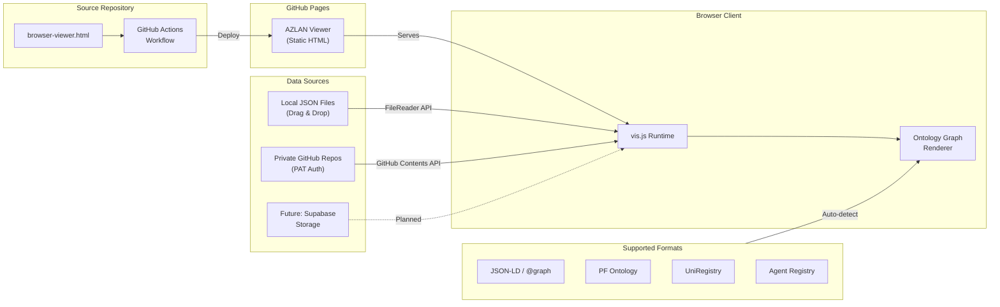

# AZLAN Viewer — Architecture & Deployment

> Interim ontology visualisation capability. "AZLAN Viewer" is the working name; co-branding can be applied later.

## Overview

The AZLAN Viewer is a zero-backend, client-side-only interactive graph viewer for JSON ontology files produced by OAA (Ontology Architect Agent). It runs entirely in the browser — no server-side processing, no database, no build step.

## Architecture Diagram

[Edit in FigJam](https://www.figma.com/online-whiteboard/create-diagram/4218582b-e80a-474c-92be-4c70183ce93b?utm_source=other&utm_content=edit_in_figjam&oai_id=&request_id=c85ac288-ec45-4a6c-b25d-3d24cd7e4900)



## Deployment

### Current: GitHub Pages (Private Repo)

```
Push to main → GitHub Actions → Deploy browser-viewer.html as index.html → GitHub Pages
```

| Component | Technology |
|-----------|-----------|
| Hosting | GitHub Pages (static site from Actions artifact) |
| CI/CD | `.github/workflows/pages.yml` |
| Trigger | Push to `main` when `browser-viewer.html` or workflow changes |
| URL | `https://ajrmooreuk.github.io/Azlan-EA-AAA/` |

**Setup requirement:** Repo Settings → Pages → Source must be set to **GitHub Actions**.

### Future: Supabase

Planned migration to Supabase for ontology file storage, replacing the GitHub Contents API as the primary remote data source.

## Operation

### Data Flow

1. **User opens** the AZLAN Viewer URL in a browser
2. **Loads ontology** via one of three methods:
   - **Drag & drop** a local `.json` / `.jsonld` file onto the viewer
   - **File picker** — click "Open JSON File"
   - **GitHub API** — click "Load from GitHub", provide PAT + `owner/repo/path/to/file.json`
3. **Auto-detect format** — the parser identifies which of 6 supported JSON structures the file uses
4. **Build graph** — nodes and edges extracted, typed, and coloured by entity type
5. **Render** — vis.js (vis-network) renders an interactive force-directed graph

### Format Detection Order

| Priority | Format | Detection Key |
|----------|--------|--------------|
| 1 | Agent Registry | `data.agents` array |
| 2 | JSON-LD | `data.classes` or `data['@graph']` |
| 3 | Registry Entry | `data.registryEntry` |
| 4 | UniRegistry | `data.ontologyDefinition` with `@graph` / `entities` |
| 5 | PF Ontology | `data.entities` array with `@id` identifiers |
| 6 | Generic | Fallback — walks top-level object keys |

### Security

- **No backend** — all processing is client-side
- **PAT handling** — GitHub Personal Access Token is stored in `sessionStorage` only (cleared on tab close, never written to disk or sent anywhere except `api.github.com`)
- **Auto-clear on 401** — invalid tokens are removed from session immediately
- **No telemetry** — no analytics, tracking, or external calls beyond vis.js CDN and GitHub API

### Client-Side Stack

| Layer | Technology |
|-------|-----------|
| Graph engine | [vis-network](https://visjs.github.io/vis-network/) (CDN) |
| Layout | Force-directed (Barnes-Hut), hierarchical, circular |
| Export | Canvas-to-PNG via `toDataURL` |
| File I/O | `FileReader` API (local), `fetch` (GitHub API) |

## File Structure

```
tools/ontology-visualiser/
├── browser-viewer.html          ← AZLAN Viewer (standalone, zero-dependency HTML)
├── ARCHITECTURE.md              ← This file
├── README.md                    ← Usage documentation
├── .github/workflows/pages.yml  ← GitHub Pages deployment
├── ontology_loader.py           ← Python: JSON-LD parsing
├── graph_builder.py             ← Python: NetworkX graph construction
├── visualiser.py                ← Python: PyVis/Matplotlib rendering
├── ve_domain_graphs.py          ← Python: W4M/VSOM domain graphs
├── demo.py                      ← Python: browser demo script
├── test_ontology_tools.py       ← Python: unit/integration tests
├── requirements.txt             ← Python dependencies
└── sample-ontologies/
    └── agent-registry.json      ← Sample input
```

The AZLAN Viewer (`browser-viewer.html`) and the Python tools are independent — the HTML viewer has no Python dependency and vice versa.

---

**Version:** 1.0.0
**Last Updated:** January 2026
